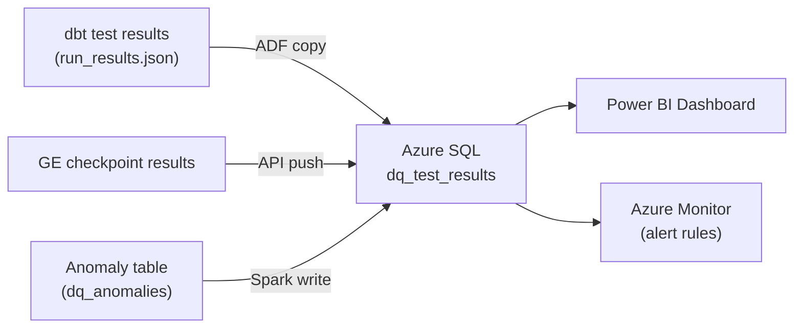
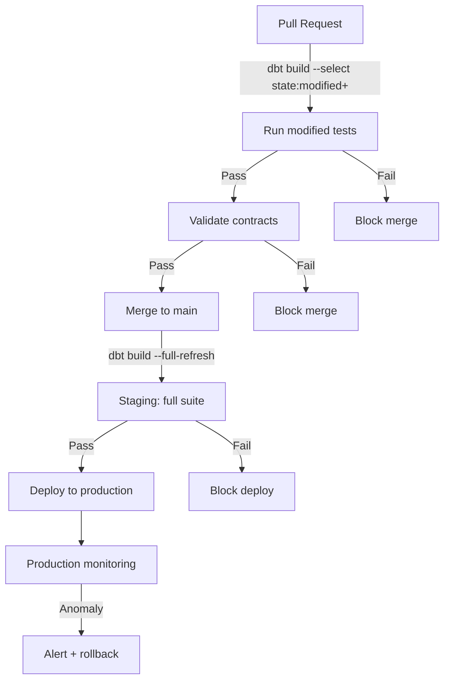

# Data Quality Playbook — Testing, Contracts, and Monitoring

> **TL;DR** — Data quality in CSA-in-a-Box is enforced at four levels: dbt
> tests, data contracts, monitoring dashboards, and anomaly detection. This
> guide covers all four, from schema-level column tests to composite quality
> scores surfaced in Power BI. Follow the patterns here and every dataset that
> reaches the gold layer will be provably correct.

---

## Data Quality Architecture

Quality gates are embedded at every tier of the medallion architecture.
Nothing moves downstream without passing the checks for its layer.

```mermaid
flowchart LR
    SRC["Data Sources"] -->|Schema validation| ING["Ingestion (ADF)"]
    ING -->|Freshness checks| BRZ["Bronze"]
    BRZ -->|"dbt tests\nGreat Expectations"| SLV["Silver"]
    SLV -->|"Data contracts\nBusiness rules"| GLD["Gold"]
    GLD --> MON["Monitoring Dashboard"]
    MON -->|Anomaly alerts| AZ["Azure Monitor / PagerDuty"]

    style BRZ fill:#cd7f32,color:#fff
    style SLV fill:#c0c0c0,color:#000
    style GLD fill:#ffd700,color:#000
    style MON fill:#4682b4,color:#fff
```



| Layer     | Primary gate                | Owner         | Failure action           |
| --------- | --------------------------- | ------------- | ------------------------ |
| Ingestion | JSON / Parquet schema check | ADF pipeline  | Quarantine to `_errors/` |
| Bronze    | Freshness SLA               | dbt source    | Alert + block downstream |
| Silver    | dbt tests + GE suites       | Domain team   | Fail the dbt run         |
| Gold      | Data contracts              | Platform team | Fail CI/CD pipeline      |
| Dashboard | Anomaly detection           | SRE / DataOps | Page on-call             |

---

## dbt Testing Strategy

dbt ships four built-in generic tests. CSA-in-a-Box layers custom tests on
top to cover domain-specific invariants.

### Built-in tests

| Test              | Use when                                       | Layer         |
| ----------------- | ---------------------------------------------- | ------------- |
| `not_null`        | Column must never be NULL                      | Silver + Gold |
| `unique`          | Column (or expression) must have no duplicates | Silver + Gold |
| `accepted_values` | Column values belong to a known set            | Silver        |
| `relationships`   | Foreign key must exist in the referenced model | Gold          |

### Schema YAML example

```yaml
# models/silver/finance/schema.yml
version: 2

models:
    - name: slv_finance__transactions_cleansed
      columns:
          - name: transaction_id
            tests: [not_null, unique]
          - name: amount
            tests:
                - not_null
                - dbt_utils.accepted_range:
                      min_value: 0
                      inclusive: true
          - name: currency_code
            tests:
                - not_null
                - accepted_values:
                      values: ["USD", "EUR", "GBP", "JPY", "CAD"]
          - name: customer_id
            tests:
                - not_null
                - relationships:
                      to: ref('slv_hr__employees_cleansed')
                      field: employee_id
```

### Coverage targets

| Layer  | Target | Rationale                                     |
| ------ | ------ | --------------------------------------------- |
| Bronze | 40%    | Light-touch; schema + freshness only          |
| Silver | 80%    | All keys, types, and domain rules tested      |
| Gold   | 100%   | Every column, every model, every relationship |

!!! tip "Measure coverage with `dbt-coverage`"
Run `dbt-coverage compute` after each PR to track column/model coverage.
Block merges if gold coverage drops below 100%.

---

## Custom dbt Tests

### Generic tests (reusable)

Generic tests live in `macros/generic_tests/` and accept parameters from YAML.

**Value range check:**

```sql
-- macros/generic_tests/test_in_range.sql

select {{ column_name }}
from {{ model }}
where {{ column_name }} < {{ min_val }}
   or {{ column_name }} > {{ max_val }}

```

```yaml
# Usage in schema YAML
columns:
    - name: age
      tests:
          - in_range: { min_val: 0, max_val: 150 }
```

**Row-count drift detection:**

```sql
-- macros/generic_tests/test_row_count_drift.sql

with current_count as (
    select count(*) as cnt from {{ model }}
),
previous_count as (
    select count(*) as cnt from {{ model }}
    where _loaded_at < current_date
)
select c.cnt, p.cnt
from current_count c cross join previous_count p
where abs(c.cnt - p.cnt) * 100.0 / nullif(p.cnt, 0) > {{ max_pct_change }}

```

### Singular tests (one-off assertions)

Singular tests live in `tests/data_tests/` and are plain SQL returning failing rows.

**Cross-domain referential integrity:**

```sql
-- tests/data_tests/assert_transactions_have_valid_customer.sql
select t.transaction_id, t.customer_id
from {{ ref('gld_finance__monthly_revenue') }} t
left join {{ ref('gld_shared__dim_customer') }} c
    on t.customer_id = c.customer_id
where c.customer_id is null
```

**Freshness SLA validation:**

```sql
-- tests/data_tests/assert_bronze_freshness.sql
select source_name, max_loaded_at
from {{ ref('stg_source_freshness') }}
where max_loaded_at < dateadd(hour, -4, current_timestamp())
```

---

## Data Contracts

A data contract is a versioned, machine-readable agreement between producer and
consumer defining schema, semantics, and quality expectations. Contracts are enforced at the silver-to-gold boundary.

### Contract definition format

```yaml
# contracts/finance/monthly_revenue.yml
contract:
    name: gld_finance__monthly_revenue
    version: "2.1"
    owner: finance-analytics@contoso.com
    sla: { freshness_hours: 6, max_null_pct: 0.0 }
    schema:
        - { name: revenue_month, type: date, nullable: false }
        - {
              name: total_revenue,
              type: "decimal(18,2)",
              nullable: false,
              constraints: [{ min: 0 }],
          }
        - {
              name: currency_code,
              type: varchar(3),
              nullable: false,
              allowed_values: ["USD", "EUR", "GBP"],
          }
        - { name: region, type: varchar(50), nullable: false }
    tests:
        - unique: [revenue_month, currency_code, region]
        - row_count_min: 1
```

### dbt contract enforcement

dbt 1.5+ supports native `contract: { enforced: true }` on models.

```yaml
# models/gold/finance/schema.yml
models:
    - name: gld_finance__monthly_revenue
      config: { contract: { enforced: true } }
      columns:
          - name: revenue_month
            data_type: date
            constraints: [{ type: not_null }]
          - name: total_revenue
            data_type: "decimal(18,2)"
            constraints:
                [
                    { type: not_null },
                    { type: check, expression: "total_revenue >= 0" },
                ]
```

### CI/CD integration

Contracts are validated during every PR. If a model's schema drifts from its
contract, the pipeline fails before merge.

```bash
python scripts/validate_contracts.py \
  --contracts-dir contracts/ --manifest-path target/manifest.json --fail-on-drift
```

!!! warning "Contract versioning"
Breaking changes (dropped columns, type changes) require a major version
bump. Additive changes (new nullable column) are minor bumps. Consumers
subscribe to a major version and are shielded from additive changes.

---

## Great Expectations Integration

Great Expectations (GE) complements dbt tests by handling statistical
validation and profiling that SQL-native tests cannot express.

### When to use each tool

| Capability                 | dbt tests | Great Expectations |
| -------------------------- | --------- | ------------------ |
| Nullability / uniqueness   | Best      | Adequate           |
| Referential integrity      | Best      | Adequate           |
| Distribution profiling     | Limited   | Best               |
| Statistical outlier checks | Limited   | Best               |
| Regex pattern matching     | Adequate  | Best               |
| Multi-table correlation    | Limited   | Best               |
| CI speed (< 30 s)          | Best      | Slower             |
| Data Docs (HTML reports)   | None      | Built-in           |

### Recommended split

Use **dbt tests** for every schema-level check (nulls, uniques, accepted values,
relationships, ranges) -- they run on every `dbt build` in seconds. Use **Great
Expectations** for profiling new sources, statistical distribution checks, regex
validation, and visual Data Docs reports. Run GE suites nightly or on onboarding.

The CSA-in-a-Box governance runner at
`csa_platform/governance/dataquality/ge_runner.py` exposes a stable interface for
executing expectation suites. See
[Tutorial 12 -- Great Expectations](../tutorials/great-expectations.md) for
the full walkthrough.

---

## Anomaly Detection

Automated anomaly detection catches regressions that static tests miss --
gradual drift, seasonal deviations, and silent schema changes.

### Statistical methods

| Method                   | Best for                     | Threshold           |
| ------------------------ | ---------------------------- | ------------------- |
| Z-score                  | Normally distributed metrics | \|z\| > 3           |
| IQR (interquartile)      | Skewed distributions         | 1.5x IQR from Q1/Q3 |
| Moving average deviation | Time-series with trend       | > 2 std from MA     |

### dbt macro for Z-score anomaly flagging

```sql
-- macros/anomaly/flag_zscore_anomaly.sql

with stats as (
    select {{ partition_col }},
           avg({{ metric_col }})    as mean_val,
           stddev({{ metric_col }}) as stddev_val
    from {{ model }}
    group by {{ partition_col }}
),
scored as (
    select t.*,
           s.mean_val, s.stddev_val,
           case when s.stddev_val = 0 then 0
                else (t.{{ metric_col }} - s.mean_val) / s.stddev_val
           end as z_score
    from {{ model }} t
    join stats s on t.{{ partition_col }} = s.{{ partition_col }}
)
select * from scored where abs(z_score) > {{ threshold }}

```

### Alert routing to Azure Monitor

Anomaly results land in a `dq_anomalies` table and trigger an Azure Monitor alert.

```kusto
dq_anomalies_CL
| where TimeGenerated > ago(1h) and abs(z_score_d) > 3
| summarize anomaly_count = count() by domain_s, model_s
| where anomaly_count > 0
```

The alert fires into an Action Group that pages on-call via PagerDuty or Teams.

---

## Data Quality Monitoring Dashboard

A Power BI dashboard gives stakeholders real-time visibility into DQ health.

### Monitoring data flow



### Dashboard pages

| Page                  | Key visuals                                               |
| --------------------- | --------------------------------------------------------- |
| **Executive summary** | Overall DQ score gauge, pass rate trend, top-5 failures   |
| **Test pass rates**   | Pass/fail/warn by model and test type, 30-day trend line  |
| **Freshness SLAs**    | Table of sources with last-loaded timestamp, SLA status   |
| **Anomaly tracker**   | Scatter plot of Z-scores by domain, drill-through to rows |
| **Domain deep-dive**  | Filterable by domain; shows every test for that domain    |

### Refresh cadence

Test results refresh after every dbt run (hourly). Anomaly scores refresh
nightly. Freshness data pulls from `dbt source freshness` every 15 minutes.

---

## Data Quality Scoring

A composite DQ score rolls up five dimensions into a single number per dataset.

### Dimensions

| Dimension        | Weight | Measurement                                      |
| ---------------- | ------ | ------------------------------------------------ |
| **Completeness** | 25%    | % of non-null values across required columns     |
| **Accuracy**     | 25%    | % of rows passing domain-rule tests              |
| **Consistency**  | 20%    | % of rows passing cross-table referential checks |
| **Timeliness**   | 15%    | 1 if within SLA, 0 if stale                      |
| **Validity**     | 15%    | % of rows passing format / range tests           |

### Formula

```
DQ_score = 0.25*completeness + 0.25*accuracy + 0.20*consistency + 0.15*timeliness + 0.15*validity
```

Each dimension is 0-100. The composite score is also 0-100.

### dbt implementation

```sql
-- models/gold/shared/gld_shared__dq_scores.sql
with completeness as (
    select 'slv_finance__transactions_cleansed' as model_name,
           100.0 * (1 - sum(case when transaction_id is null then 1 else 0 end)::float
                        / nullif(count(*), 0)) as score
    from {{ ref('slv_finance__transactions_cleansed') }}
), accuracy as (
    select 'slv_finance__transactions_cleansed' as model_name,
           100.0 * sum(case when amount >= 0 then 1 else 0 end)::float
               / nullif(count(*), 0) as score
    from {{ ref('slv_finance__transactions_cleansed') }}
), timeliness as (
    select 'slv_finance__transactions_cleansed' as model_name,
           case when max(_loaded_at) >= dateadd(hour, -4, current_timestamp())
                then 100.0 else 0.0 end as score
    from {{ ref('slv_finance__transactions_cleansed') }}
)
select c.model_name,
       round(0.25*c.score + 0.25*a.score + 0.20*100.0
           + 0.15*t.score + 0.15*100.0, 2) as dq_score,
       c.score as completeness, a.score as accuracy, t.score as timeliness
from completeness c
join accuracy a  on c.model_name = a.model_name
join timeliness t on c.model_name = t.model_name
```

!!! tip "Score thresholds"
Red / amber / green scheme: **green** >= 95, **amber** 80-94, **red** < 80.
Gold models in red block downstream consumers until remediated.

---

## Anti-patterns

!!! danger "Testing everything"
Writing `not_null` on every column of every model creates noise and slows
CI. Test what matters: primary keys, foreign keys, business-critical
measures, and columns that have failed before. Let coverage targets
(40 / 80 / 100%) guide your effort.

!!! danger "Ignoring test failures"
Treating failing tests as "known issues" erodes trust in the entire
framework. Zero-tolerance for gold-layer failures: if a gold test fails,
the pipeline stops. Silver failures block promotion to gold. Bronze
failures trigger alerts but do not halt ingestion.

!!! danger "Manual testing"
Running ad-hoc SQL to "spot-check" data is unrepeatable, undocumented,
and invisible. Every check must be codified as a dbt test, GE expectation,
or contract assertion so it runs automatically on every build.

!!! danger "Testing only happy paths"
If your tests only verify that good data looks good, they will never catch
bad data. Write tests for known failure modes: nulls in required fields,
negative amounts, duplicate keys, stale timestamps, out-of-range values.

---

## Data Quality CI/CD

Integrate quality gates into every pipeline stage so regressions are caught
before production.

### Pipeline stages



### PR checks

```yaml
# .github/workflows/dbt-pr.yml (excerpt)
jobs:
    dbt-test:
        runs-on: ubuntu-latest
        steps:
            - uses: actions/checkout@v4
            - run: pip install dbt-core dbt-databricks dbt-coverage
            - run: dbt deps && dbt build --select state:modified+ --state target-defer/
            - run: dbt source freshness --select state:modified+
            - run: |
                  dbt-coverage compute --manifest target/manifest.json \
                    --run-results target/run_results.json
                  python scripts/check_gold_coverage.py --min-pct 100
```

### Production monitoring

After deployment, a scheduled dbt Cloud job (or Airflow DAG) runs the full
test suite hourly. Failures trigger Azure Monitor alerts and surface on the dashboard.

---

## Readiness Checklist

Check every box before declaring a domain "production-ready."

- [ ] Every gold model has `contract: { enforced: true }` in its schema YAML
- [ ] Every primary key has `not_null` + `unique` tests
- [ ] Every foreign key has a `relationships` test
- [ ] Gold test coverage is 100%; silver is >= 80%
- [ ] `dbt source freshness` is configured for all sources with SLA thresholds
- [ ] At least one custom test covers domain-specific business rules
- [ ] Great Expectations suites exist for statistical profiling of new sources
- [ ] Anomaly detection macro runs nightly against key metrics
- [ ] Azure Monitor alerts are wired to the `dq_anomalies` table
- [ ] Power BI monitoring dashboard is published and refreshing on schedule
- [ ] DQ scores are computed and visible per domain
- [ ] CI/CD pipeline blocks merges on gold test failures
- [ ] Data contracts are versioned and reviewed on schema changes
- [ ] On-call rotation is defined for data quality alerts

---

## Related

- [Data Engineering Best Practices](../best-practices/data-engineering.md) --
  dbt project structure, naming conventions, incremental models
- [Great Expectations Tutorial](../tutorials/great-expectations.md) --
  Step-by-step GE setup with the CSA governance runner
- [Streaming & CDC Patterns](../patterns/streaming-cdc.md) --
  Real-time ingestion patterns that feed into DQ checks
- [dbt domain models](https://github.com/fgarofalo56/csa-inabox/tree/main/dbt_project/) -- 64 core domain models and ~100 examples
