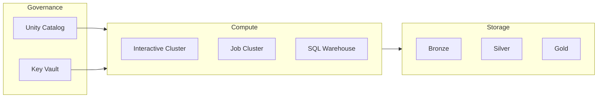
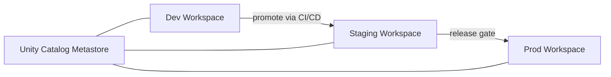
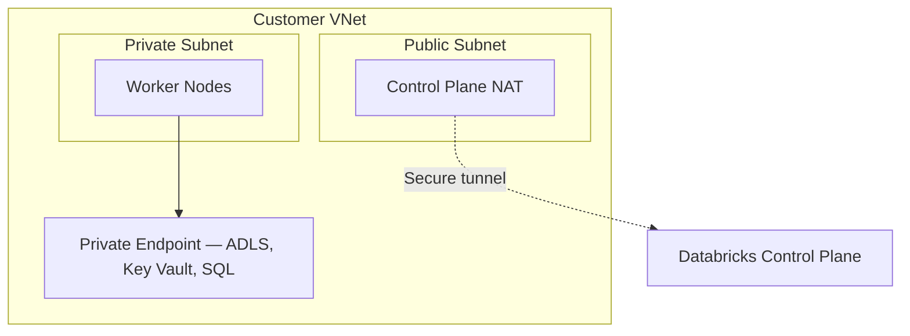

# Databricks Best Practices for CSA-in-a-Box

## Overview

Azure Databricks is the **primary heavy-compute engine** for CSA-in-a-Box
([ADR-0002](../adr/0002-databricks-over-oss-spark.md)). It powers medallion
transformations, large-scale enrichment, ML feature engineering, and dbt-driven
analytics across Azure Commercial and Azure Government tenants.

This guide distills operational best practices into actionable patterns so that
every workspace, cluster, notebook, and pipeline follows the same hardened
baseline. It is meant to be read alongside the
[Databricks Guide](../DATABRICKS_GUIDE.md) (setup/operations) and the
[Performance Tuning](../best-practices/performance-tuning.md) reference (deep
Delta/Spark tuning).



---

## Workspace Organization

### Folder Structure

Organize each Databricks workspace with a **standard folder tree** so that any
engineer can orient themselves in seconds.

```text
/Workspace
  /Shared
    /notebooks
      /bronze          # Raw-to-cleansed ingestion
      /silver          # Conformance, dedup, SCD
      /gold            # Business aggregations, star schemas
      /utilities       # Reusable helpers (logging, audit, config)
      /orchestration   # Master job notebooks, dbt runners
    /libs              # Shared .whl / .jar / init scripts
    /config            # Environment-specific JSON/YAML configs
  /Repos               # Git-backed repos (recommended over Shared)
  /Users
    /<user@domain>     # Personal scratch notebooks — never promoted to prod
```

### Naming Conventions

| Artifact         | Pattern                           | Example                     |
| ---------------- | --------------------------------- | --------------------------- |
| ETL notebook     | `<source>_to_<target>_spark.py`   | `erp_to_silver_spark.py`    |
| Utility notebook | `<action>_<subject>.py`           | `optimize_delta_tables.py`  |
| Domain notebook  | `<domain>_<action>_<subject>.py`  | `sales_daily_transform.py`  |
| Job name         | `[env]-[domain]-[layer]-[action]` | `prod-sales-gold-aggregate` |
| Cluster policy   | `policy-[env]-[tier]`             | `policy-prod-standard`      |
| Secret scope     | `scope-[env]-[purpose]`           | `scope-prod-adls`           |

### Workspace-Level vs. Cluster-Level Config

| Setting                   | Where to Set         | Why                                        |
| ------------------------- | -------------------- | ------------------------------------------ |
| Unity Catalog metastore   | Workspace            | One metastore per workspace, set by admin  |
| Default catalog / schema  | Cluster Spark config | Varies by environment and job              |
| ADLS OAuth credentials    | Cluster Spark config | Scoped to the cluster's managed identity   |
| Delta auto-optimize flags | Cluster Spark config | Consistent across all notebooks on cluster |
| Notebook-specific widgets | Notebook             | Per-run parameterization                   |

### Multi-Environment Setup

!!! tip "One workspace per environment"
Use separate workspaces for **dev**, **staging**, and **prod**. This gives
hard network and IAM boundaries, prevents accidental writes to production
storage, and aligns with Unity Catalog workspace bindings.



| Environment | Workspace SKU | Purpose                  | Who has access        |
| ----------- | ------------- | ------------------------ | --------------------- |
| Dev         | Premium       | Exploration, prototyping | All engineers         |
| Staging     | Premium       | Integration testing      | Engineers + CI bot    |
| Prod        | Premium       | Production workloads     | CI bot + on-call only |

---

## Cluster Configuration

### Job Clusters vs. All-Purpose Clusters

| Criterion       | Job Cluster              | All-Purpose Cluster        |
| --------------- | ------------------------ | -------------------------- |
| Use case        | Scheduled / CI pipelines | Ad-hoc exploration, dev    |
| Lifecycle       | Spins up per run, dies   | Long-running, user-managed |
| Cost model      | Pay only during run      | Pay while idle too         |
| Recommended for | **All production work**  | Dev / debugging only       |

!!! warning "Never use all-purpose clusters in production"
All-purpose clusters remain running between jobs, waste DBUs, and lack the
deterministic environment guarantees that job clusters provide.

### Autoscaling Policies

| Workload Type   | Min Workers | Max Workers | Rationale                                   |
| --------------- | ----------- | ----------- | ------------------------------------------- |
| Light ETL       | 1           | 4           | Small data, fast finish                     |
| Standard ETL    | 2           | 8           | Balanced cost vs. throughput                |
| Heavy transform | 4           | 16          | Large shuffles, complex joins               |
| ML training     | 4           | 32          | GPU-intensive or wide hyperparameter sweeps |
| Streaming       | 2           | 8           | Steady state with burst headroom            |

!!! tip "Set `spark.databricks.aggressiveWindowDownS` to 120"
This tells the autoscaler to wait 2 minutes of low utilization before
removing workers, preventing thrashing on bursty workloads.

### Spot Instances (Azure Spot VMs)

| Do                                                         | Don't                                           |
| ---------------------------------------------------------- | ----------------------------------------------- |
| Use spot for **worker** nodes (up to 80% savings)          | Use spot for the **driver** node                |
| Set `first_on_demand: 1` so the driver is always on-demand | Rely on 100% spot for latency-sensitive jobs    |
| Set spot bid to `max_price: -1` (pay market rate)          | Set a fixed bid that causes constant evictions  |
| Target 50-70% spot ratio for production jobs               | Exceed 80% spot — revocation risk rises sharply |

### Photon Acceleration

Photon is a vectorized C++ query engine that accelerates SQL and DataFrame
workloads on Delta Lake.

**When to use Photon:**

- SQL-heavy Silver-to-Gold transformations
- Large `JOIN`, `GROUP BY`, `WINDOW` operations
- Aggregation-heavy Gold tables
- Delta `MERGE` / `UPDATE` / `DELETE` at scale

**When to skip Photon:**

- Pure Python / pandas UDF workloads (Photon cannot accelerate UDFs)
- ML training notebooks (use ML Runtime instead)
- Small data (< 10 GB) where startup overhead exceeds savings

### DBR Version Pinning

!!! important "Always pin to an LTS release"
Never use `latest` or non-LTS runtimes in production. Pin the exact version
in your cluster policy and job definitions.

```json
{
    "dbus_per_hour": { "type": "unlimited" },
    "spark_version": {
        "type": "fixed",
        "value": "14.3.x-scala2.12"
    }
}
```

**LTS cadence:** Databricks LTS versions are supported for ~2 years. Upgrade
during a planned maintenance window, not reactively.

### Init Scripts

Use init scripts sparingly. Prefer cluster-scoped scripts stored in Unity
Catalog Volumes over workspace or DBFS scripts.

```bash
#!/bin/bash
# /Volumes/main/shared/init-scripts/install_deps.sh

pip install --quiet great-expectations==0.18.* pyarrow==15.*
echo "Init script completed at $(date)"
```

!!! danger "Never put secrets in init scripts"
Init scripts are stored in plain text. Use Databricks secret scopes
backed by Azure Key Vault instead (see [Secret Management](#secret-management)).

### Cluster Policy Example

```json
{
    "name": "policy-prod-standard",
    "definition": {
        "spark_version": {
            "type": "fixed",
            "value": "14.3.x-scala2.12"
        },
        "node_type_id": {
            "type": "allowlist",
            "values": ["Standard_DS3_v2", "Standard_DS4_v2", "Standard_DS5_v2"]
        },
        "driver_node_type_id": {
            "type": "fixed",
            "value": "Standard_DS4_v2"
        },
        "autoscale.min_workers": {
            "type": "range",
            "minValue": 1,
            "maxValue": 4
        },
        "autoscale.max_workers": {
            "type": "range",
            "minValue": 2,
            "maxValue": 16
        },
        "autotermination_minutes": {
            "type": "range",
            "minValue": 10,
            "maxValue": 60,
            "defaultValue": 30
        },
        "azure_attributes.first_on_demand": {
            "type": "fixed",
            "value": 1
        },
        "azure_attributes.spot_bid_max_price": {
            "type": "fixed",
            "value": -1
        },
        "custom_tags.Environment": {
            "type": "fixed",
            "value": "production"
        },
        "custom_tags.CostCenter": {
            "type": "required"
        },
        "spark_conf.spark.databricks.delta.optimizeWrite.enabled": {
            "type": "fixed",
            "value": "true"
        },
        "spark_conf.spark.databricks.delta.autoCompact.enabled": {
            "type": "fixed",
            "value": "true"
        }
    }
}
```

---

## Notebook Best Practices

### Parameterized Notebooks with `dbutils.widgets`

Use widgets to make notebooks reusable across environments and domains.

```python
# Define widgets at the top of every notebook
dbutils.widgets.text("environment", "dev", "Environment")
dbutils.widgets.text("domain", "sales", "Domain")
dbutils.widgets.dropdown("mode", "incremental", ["full", "incremental"], "Mode")
dbutils.widgets.text("start_date", "", "Start Date (optional)")

# Read values
env = dbutils.widgets.get("environment")
domain = dbutils.widgets.get("domain")
mode = dbutils.widgets.get("mode")
```

### `%run` vs. `dbutils.notebook.run`

| Feature           | `%run`                          | `dbutils.notebook.run`              |
| ----------------- | ------------------------------- | ----------------------------------- |
| Execution context | Same context (shares variables) | Separate context (isolated)         |
| Return value      | No                              | Yes (string)                        |
| Timeout control   | No                              | Yes (`timeout_seconds`)             |
| Error isolation   | Failure crashes caller          | Failure returns error, caller lives |
| Best for          | Loading shared utility code     | Orchestrating independent steps     |

!!! tip "Use `%run` for imports, `dbutils.notebook.run` for orchestration"
Load shared functions with `%run ./utilities/common_functions` at the top
of your notebook. Use `dbutils.notebook.run` to chain independent ETL
steps so that a failure in step 2 does not corrupt state from step 1.

### Notebook Workflows vs. Jobs API

| Approach               | When to Use                                                  |
| ---------------------- | ------------------------------------------------------------ |
| Single-notebook Job    | Simple ETL with one stage                                    |
| Multi-task Job (DAG)   | Production pipelines with dependencies                       |
| `dbutils.notebook.run` | Quick prototyping, small fan-out                             |
| ADF / Airflow          | Cross-service orchestration (storage + Databricks + Synapse) |

### Modular Code Organization

```text
# Recommended project layout in Repos
/my-domain-repo
  /src
    /transforms
      bronze.py          # Bronze-layer logic
      silver.py          # Silver-layer logic
      gold.py            # Gold-layer logic
    /utils
      config.py          # Config loader (reads widgets + env)
      logging.py         # Structured logging helpers
      delta_helpers.py   # OPTIMIZE, VACUUM, merge wrappers
  /notebooks
    main_pipeline.py     # Orchestration notebook — calls src/
    adhoc_exploration.py # Scratch — never promoted
  /tests
    test_transforms.py   # Unit tests runnable via nutter or pytest
  pyproject.toml
```

---

## Delta Lake Optimization

For deep-dive tuning, see [Performance Tuning](../best-practices/performance-tuning.md).

### OPTIMIZE + Z-ORDER Scheduling

```sql
-- Run nightly after ingestion completes
OPTIMIZE unity_catalog.sales.transactions
ZORDER BY (tenant_id, transaction_date);

-- Check optimization history
DESCRIBE HISTORY unity_catalog.sales.transactions;
```

| Do                                               | Don't                                    |
| ------------------------------------------------ | ---------------------------------------- |
| Schedule OPTIMIZE nightly or after large batches | Run OPTIMIZE after every micro-batch     |
| Z-ORDER on 2-3 high-cardinality filter columns   | Z-ORDER on > 4 columns (dilutes benefit) |
| Z-ORDER on columns used in `WHERE` and `JOIN`    | Z-ORDER on columns only used in `SELECT` |

### Liquid Clustering (DBR 13.3+)

Liquid clustering replaces both partitioning and Z-ORDER with adaptive,
incremental clustering. Prefer it for **new tables** on DBR 13.3 LTS or later.

```sql
-- New table with liquid clustering
CREATE TABLE catalog.schema.events (
    event_id   BIGINT,
    tenant_id  STRING,
    event_date DATE,
    payload    STRING
)
CLUSTER BY (tenant_id, event_date);

-- Migrate existing partitioned table
ALTER TABLE catalog.schema.events
CLUSTER BY (tenant_id, event_date);

-- Trigger incremental clustering
OPTIMIZE catalog.schema.events;
```

!!! info "Liquid clustering vs. Z-ORDER"
Liquid clustering is incremental (only rearranges new/changed data), whereas
Z-ORDER rewrites all files. For append-heavy Bronze/Silver tables, liquid
clustering avoids expensive full rewrites.

### VACUUM Scheduling

```sql
-- Default retention: 7 days (168 hours)
VACUUM catalog.schema.transactions;

-- Explicit retention for compliance (30 days)
VACUUM catalog.schema.transactions RETAIN 720 HOURS;
```

!!! danger "Never set retention below 7 days"
Concurrent readers may still reference old files. Setting retention below
7 days (`168 HOURS`) risks breaking time-travel queries and active reads.

### Auto-Optimize Settings

Enable these at the **cluster level** (via cluster policy) so every write
benefits automatically.

| Setting          | Spark Config Key                                      | Effect                              |
| ---------------- | ----------------------------------------------------- | ----------------------------------- |
| Optimized Writes | `spark.databricks.delta.optimizeWrite.enabled = true` | Coalesces small partitions on write |
| Auto Compaction  | `spark.databricks.delta.autoCompact.enabled = true`   | Runs mini-OPTIMIZE after writes     |

### Delta Table Properties Checklist

- [x] `delta.autoOptimize.optimizeWrite = true`
- [x] `delta.autoOptimize.autoCompact = true`
- [x] `delta.logRetentionDuration = 30 days` (or per compliance)
- [x] `delta.deletedFileRetentionDuration = 7 days` (minimum)
- [x] `delta.enableChangeDataFeed = true` (if downstream CDC consumers exist)
- [x] `delta.columnMapping.mode = name` (for schema evolution)

### Change Data Feed

Enable Change Data Feed (CDF) when downstream consumers need row-level change
events (inserts, updates, deletes) without scanning full tables.

```sql
ALTER TABLE catalog.schema.customers
SET TBLPROPERTIES (delta.enableChangeDataFeed = true);
```

```python
# Read changes since a specific version
changes_df = (
    spark.read.format("delta")
    .option("readChangeFeed", "true")
    .option("startingVersion", 42)
    .table("catalog.schema.customers")
)

# Filter to updates only
updates = changes_df.filter("_change_type = 'update_postimage'")
```

---

## dbt on Databricks

### Adapter Configuration

```yaml
# profiles.yml
csa_inabox:
    target: dev
    outputs:
        dev:
            type: databricks
            catalog: unity_dev
            schema: "{{ env_var('DBT_SCHEMA', 'dbt_dev') }}"
            host: "{{ env_var('DATABRICKS_HOST') }}"
            http_path: "{{ env_var('DATABRICKS_HTTP_PATH') }}"
            token: "{{ env_var('DATABRICKS_TOKEN') }}"
            threads: 4
            connect_retries: 3

        prod:
            type: databricks
            catalog: unity_prod
            schema: gold
            host: "{{ env_var('DATABRICKS_HOST') }}"
            http_path: "{{ env_var('DATABRICKS_HTTP_PATH') }}"
            token: "{{ env_var('DATABRICKS_TOKEN') }}"
            threads: 8
            connect_retries: 5
```

### Incremental Strategies

| Strategy           | When to Use                              | Config                     |
| ------------------ | ---------------------------------------- | -------------------------- |
| `merge`            | SCD Type 1, upserts, most use cases      | `unique_key` required      |
| `insert_overwrite` | Full partition replacement (append-only) | `partition_by` required    |
| `append`           | Event/log tables, no dedup needed        | Fastest, no merge overhead |

```sql
-- dbt model: models/gold/fct_orders.sql
{{
  config(
    materialized='incremental',
    incremental_strategy='merge',
    unique_key='order_id',
    file_format='delta',
    on_schema_change='append_new_columns'
  )
}}

SELECT
    order_id,
    customer_id,
    order_total,
    _loaded_at
FROM {{ ref('stg_orders') }}

WHERE _loaded_at > (SELECT MAX(_loaded_at) FROM {{ this }})

```

### Unity Catalog Integration

```yaml
# dbt_project.yml
models:
    csa_inabox:
        +persist_docs:
            relation: true
            columns: true
        bronze:
            +schema: bronze
            +catalog: "{{ env_var('DBT_CATALOG', 'unity_dev') }}"
        silver:
            +schema: silver
            +catalog: "{{ env_var('DBT_CATALOG', 'unity_dev') }}"
        gold:
            +schema: gold
            +catalog: "{{ env_var('DBT_CATALOG', 'unity_dev') }}"
```

### Model Grants

```yaml
# models/gold/fct_orders.yml
models:
    - name: fct_orders
      config:
          grants:
              select: ["analysts", "data_scientists"]
```

---

## Spark Performance

### Adaptive Query Execution (AQE)

AQE is **enabled by default** on DBR 12.2+ and dynamically adjusts query plans
at runtime. Verify it is not disabled.

```python
# Confirm AQE is enabled
assert spark.conf.get("spark.sql.adaptive.enabled") == "true"
```

Key AQE behaviors:

- **Coalesces shuffle partitions** — reduces 200 default partitions to match
  actual data volume
- **Converts sort-merge joins to broadcast joins** at runtime when one side is
  small
- **Optimizes skew joins** — splits skewed partitions automatically

### Key Spark Tuning Settings

| Setting                                         | Default | Recommended               | Why                                               |
| ----------------------------------------------- | ------- | ------------------------- | ------------------------------------------------- |
| `spark.sql.adaptive.enabled`                    | `true`  | `true`                    | Dynamic plan optimization                         |
| `spark.sql.adaptive.coalescePartitions.enabled` | `true`  | `true`                    | Auto-right-size shuffle partitions                |
| `spark.sql.shuffle.partitions`                  | `200`   | `auto` (AQE) or tune      | 200 is too many for small data, too few for large |
| `spark.sql.autoBroadcastJoinThreshold`          | `10MB`  | `30MB` for large clusters | Broadcast avoids shuffle entirely                 |
| `spark.databricks.io.cache.enabled`             | `true`  | `true`                    | SSD cache for hot Delta data                      |

### Broadcast Join Thresholds

```python
# Force broadcast for a known-small dimension table
from pyspark.sql.functions import broadcast

result = (
    fact_df
    .join(broadcast(dim_df), "customer_id")
)
```

| Do                                         | Don't                                    |
| ------------------------------------------ | ---------------------------------------- |
| Broadcast dimension tables < 100 MB        | Broadcast tables that grow unpredictably |
| Let AQE auto-convert when threshold is met | Disable AQE to "control" join strategies |

### Spill Management

Spill occurs when Spark runs out of execution memory and writes intermediate
data to disk. It severely degrades performance.

**Signs of spill:** Check the Spark UI for "Spill (Memory)" and
"Spill (Disk)" columns in the Stage detail view.

**Fixes:**

1. Increase `spark.executor.memory` or use a larger node type
2. Reduce `spark.sql.shuffle.partitions` to decrease per-partition size
3. Filter data earlier in the pipeline (`pushdown predicates`)
4. Avoid `collect()` or `toPandas()` on large DataFrames

### UDF Avoidance

!!! warning "Avoid Python UDFs in production pipelines"
Python UDFs serialize data row-by-row between the JVM and Python, creating
a massive performance bottleneck. Use built-in Spark SQL functions or
Pandas UDFs (vectorized) instead.

| Approach        | Relative Speed | When to Use                             |
| --------------- | -------------- | --------------------------------------- |
| Built-in SQL/DF | 1x (fastest)   | Always prefer                           |
| Pandas UDF      | 2-5x slower    | Complex Python logic, batch-vectorized  |
| Python UDF      | 10-100x slower | Last resort, simple row transforms only |

```python
# Bad: Python UDF
@udf("string")
def clean_name(name):
    return name.strip().title()

# Good: built-in functions
from pyspark.sql.functions import trim, initcap
df = df.withColumn("clean_name", initcap(trim(col("name"))))
```

---

## Secret Management

### Databricks Secret Scopes Backed by Azure Key Vault

```bash
# Create a Key-Vault-backed secret scope (Databricks CLI)
databricks secrets create-scope \
  --scope scope-prod-adls \
  --scope-backend-type AZURE_KEYVAULT \
  --resource-id /subscriptions/<sub>/resourceGroups/<rg>/providers/Microsoft.KeyVault/vaults/<vault> \
  --dns-name https://<vault>.vault.azure.net/
```

```python
# Access secrets in notebooks
storage_key = dbutils.secrets.get(scope="scope-prod-adls", key="adls-access-key")

# Secrets are redacted in notebook output — [REDACTED] appears in logs
print(storage_key)  # prints: [REDACTED]
```

### Secret ACLs

```bash
# Grant read access to a group
databricks secrets put-acl \
  --scope scope-prod-adls \
  --principal data-engineers \
  --permission READ
```

| Do                                          | Don't                                                      |
| ------------------------------------------- | ---------------------------------------------------------- |
| Use Key-Vault-backed scopes in production   | Use Databricks-backed scopes (no rotation, no audit trail) |
| Grant `READ` to groups, never individuals   | Grant `MANAGE` broadly                                     |
| Rotate secrets via Key Vault policies       | Hardcode tokens in notebooks or init scripts               |
| Reference secrets via `dbutils.secrets.get` | Pass secrets as widget parameters                          |

---

## Cost Optimization

### Auto-Termination

| Cluster Type   | Auto-Termination  | Rationale                           |
| -------------- | ----------------- | ----------------------------------- |
| Dev / adhoc    | 30 minutes        | Engineers forget to shut down       |
| CI / staging   | 15 minutes        | Short-lived test runs               |
| Production job | N/A (job cluster) | Cluster dies automatically post-job |

### Right-Sizing Guide

| Workload             | Recommended VM   | vCPUs | RAM (GB) | Notes                     |
| -------------------- | ---------------- | ----- | -------- | ------------------------- |
| Light dev / notebook | Standard_DS3_v2  | 4     | 14       | Single-user exploration   |
| Standard ETL         | Standard_DS4_v2  | 8     | 28       | Balanced cost/performance |
| Memory-intensive     | Standard_E8s_v3  | 8     | 64       | Large joins, wide tables  |
| Compute-intensive    | Standard_F8s_v2  | 8     | 16       | CPU-bound transforms      |
| GPU / ML training    | Standard_NC6s_v3 | 6     | 112      | CUDA workloads            |

### DBU Consumption Monitoring

```python
# Query Databricks system tables for DBU usage (Unity Catalog required)
dbu_usage = spark.sql("""
    SELECT
        usage_date,
        workspace_id,
        sku_name,
        SUM(usage_quantity) AS total_dbus
    FROM system.billing.usage
    WHERE usage_date >= DATEADD(DAY, -30, CURRENT_DATE())
    GROUP BY usage_date, workspace_id, sku_name
    ORDER BY usage_date DESC
""")

dbu_usage.display()
```

### Cost Control Checklist

- [x] Cluster policies enforced on all workspaces (prevents over-provisioning)
- [x] Auto-termination set on all interactive clusters
- [x] Job clusters used for all production workloads
- [x] Spot instances at 50-70% ratio on worker nodes
- [x] `CostCenter` tag required by cluster policy
- [x] DBU usage reviewed weekly via system tables or Azure Cost Management
- [x] Unused clusters and warehouses decommissioned monthly

---

## Monitoring

### Spark UI

The Spark UI is your first stop for diagnosing slow stages, skew, and spill.

| Tab       | What to Look For                                    |
| --------- | --------------------------------------------------- |
| Stages    | Spill (Memory/Disk), shuffle read/write sizes       |
| SQL       | Physical plan, scan stats, broadcast vs. sort-merge |
| Storage   | Cached RDDs/DataFrames, memory usage                |
| Executors | GC time, failed tasks, blacklisted nodes            |

### Azure Monitor Integration

Route cluster logs and metrics to Log Analytics for centralized observability.

```json
{
    "log_analytics": {
        "workspace_id": "<LOG_ANALYTICS_WORKSPACE_ID>",
        "workspace_key": "{{secrets/scope-prod-monitoring/la-key}}"
    },
    "log_delivery": {
        "cluster_logs": true,
        "spark_driver_logs": true,
        "spark_executor_logs": true,
        "init_script_logs": true
    }
}
```

### Alert Configuration

Set up alerts for:

| Condition                       | Threshold        | Action               |
| ------------------------------- | ---------------- | -------------------- |
| Job run duration > 2x baseline  | Per-job baseline | Notify + investigate |
| Cluster idle > auto-termination | Policy value     | Auto-terminate       |
| DBU spend > daily budget        | Per-workspace    | Alert team + freeze  |
| Failed job runs in sequence     | 3 consecutive    | Page on-call         |
| Disk spill exceeding 10 GB      | Per-stage        | Right-size cluster   |

---

## Security

### Network Isolation (VNet Injection)

Deploy Databricks workspaces into a customer-managed VNet so that all cluster
traffic stays within the private network.



**Bicep reference:** `deploy/bicep/DMLZ/modules/Databricks/databricks.bicep`

### Security Hardening Checklist

- [x] **VNet injection** enabled for all workspaces
- [x] **Private Link** for control plane connectivity (no public IP)
- [x] **NSG rules** restrict egress to Azure backbone + required endpoints only
- [x] **IP access lists** restrict workspace UI/API access to corporate CIDR ranges
- [x] **Conditional access** via Entra ID — require MFA, compliant device
- [x] **Unity Catalog** for table-level and column-level ACLs (replaces legacy table ACLs)
- [x] **Credential passthrough** disabled; use service principals or managed identities
- [x] **Cluster policies** prevent use of unrestricted node types or public subnets
- [x] **Audit logs** shipped to Log Analytics (NIST 800-53 AU-12)
- [x] **Customer-managed keys** (CMK) for DBFS encryption at rest

### Table ACLs vs. Unity Catalog

| Feature            | Legacy Table ACLs | Unity Catalog                    |
| ------------------ | ----------------- | -------------------------------- |
| Scope              | Per-workspace     | Cross-workspace, cross-cloud     |
| Column masking     | No                | Yes (row filters + column masks) |
| Lineage            | No                | Yes (automatic, queryable)       |
| External locations | Hive metastore    | Managed via Unity Catalog        |
| **Recommendation** | Migrate away      | **Use for all new workloads**    |

---

## Anti-Patterns

!!! danger "Long-running all-purpose clusters for production"
All-purpose clusters stay alive between jobs, waste DBUs during idle
windows, and lack the clean-environment guarantees of job clusters.
**Always use job clusters for scheduled workloads.**

!!! danger "No cluster policies"
Without policies, any user can spin up a 64-node GPU cluster. Cluster
policies are the single most effective cost-control lever. Enforce them
from day one.

!!! danger "Running everything as workspace admin"
Workspace admins bypass Unity Catalog ACLs. Create granular groups
(`data-engineers`, `analysts`, `ml-engineers`) and assign least-privilege
permissions. Reserve admin for infrastructure automation only.

!!! danger "Skipping OPTIMIZE on append-heavy tables"
Streaming and micro-batch ingestion creates thousands of small files.
Without OPTIMIZE (or auto-compaction), query performance degrades
exponentially as file count grows. See
[Delta Lake Optimization](#delta-lake-optimization).

!!! danger "Over-provisioned driver nodes"
The driver coordinates work but does not process data. A driver 4x the
size of workers wastes money. Match the driver to worker size or one tier
above.

!!! danger "Hardcoding secrets in notebooks or repos"
Tokens, keys, and passwords in source code are visible in version history
forever, even after deletion. Use
[Key-Vault-backed secret scopes](#secret-management) exclusively.

!!! danger "Disabling AQE to 'control' performance"
AQE dynamically optimizes shuffle partitions, join strategies, and skew
handling. Disabling it forces static plans that are worse in nearly every
scenario. Leave it enabled and tune thresholds instead.

---

## Cross-References

| Topic                             | Document                                                                                          |
| --------------------------------- | ------------------------------------------------------------------------------------------------- |
| Why Databricks over OSS Spark     | [ADR-0002](../adr/0002-databricks-over-oss-spark.md)                                              |
| Setup and operations guide        | [Databricks Guide](../DATABRICKS_GUIDE.md)                                                        |
| Delta Lake and Spark deep tuning  | [Performance Tuning](../best-practices/performance-tuning.md)                                     |
| Medallion layer design            | [Medallion Architecture](../best-practices/medallion-architecture.md)                             |
| Fabric vs. Databricks vs. Synapse | [Decision Matrix](../decisions/fabric-vs-databricks-vs-synapse.md)                                |
| Fabric migration path             | [Databricks to Fabric](../migrations/databricks-to-fabric.md)                                     |
| Reference architecture overview   | [Fabric vs. Synapse vs. Databricks](../reference-architecture/fabric-vs-synapse-vs-databricks.md) |
| OSS Spark alternative             | [OSS Ecosystem Guide](oss-ecosystem.md)                                                           |
| Bicep deployment modules          | `deploy/bicep/DMLZ/modules/Databricks/databricks.bicep`                                           |
| NIST 800-53 controls              | `governance/compliance/nist-800-53-rev5.yaml` (AC-3, AU-12, SC-8)                                 |
