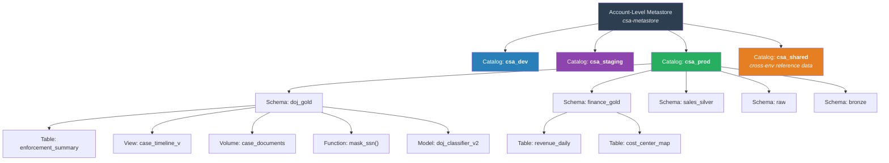
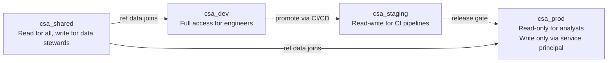
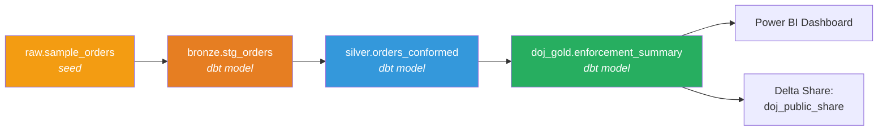
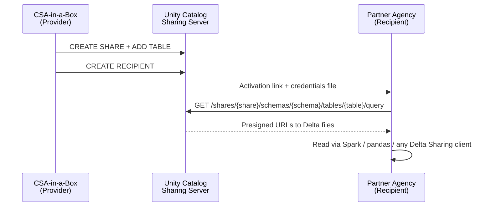

# Databricks Unity Catalog

> Unified governance for all data and AI assets in the CSA-in-a-Box Databricks estate —
> one metastore, consistent access control, automatic lineage, and cross-organization sharing.

## Overview

Unity Catalog is the **account-level governance layer** for Databricks. It replaces the
workspace-local Hive Metastore with a centralized hierarchy that spans every workspace
attached to the same Databricks account. For CSA-in-a-Box this means a single place to
manage catalogs, schemas, tables, views, volumes, functions, and registered ML models
across development, staging, and production workspaces.

Key capabilities relevant to CSA-in-a-Box:

| Capability            | What It Provides                                                                    |
| --------------------- | ----------------------------------------------------------------------------------- |
| Three-level namespace | `catalog.schema.object` — environment and domain isolation without workspace sprawl |
| Fine-grained ACLs     | GRANT / REVOKE on catalogs, schemas, tables, columns, and rows                      |
| Automatic lineage     | Column-level lineage captured from Spark, SQL, and dbt jobs                         |
| External data         | Storage credentials and external locations for ADLS Gen2                            |
| Delta Sharing         | Open-protocol sharing across organizations and clouds                               |
| AI/ML governance      | Registered models, feature tables, and model serving under one namespace            |
| Purview integration   | Dual governance with Microsoft Purview for cross-estate cataloging                  |

!!! tip "When to Use Unity Catalog vs Purview"
Unity Catalog governs **Databricks-native assets** (tables, models, volumes). Purview
governs the **entire Azure data estate** (SQL, ADLS, Synapse, Power BI, and more).
Use both together: Unity Catalog for Databricks ACLs and lineage, Purview for
cross-platform cataloging and classification. See
[Purview Setup](../governance/PURVIEW_SETUP.md) for integration details.

---

## Architecture

The diagram below shows how a single Unity Catalog metastore fans out into
environment-scoped catalogs, domain-scoped schemas, and the securable objects within
each schema.



---

## Setup

### Prerequisites

| Requirement        | Details                                                                                                                |
| ------------------ | ---------------------------------------------------------------------------------------------------------------------- |
| Databricks account | Account-level admin access                                                                                             |
| Premium workspace  | Unity Catalog requires the Premium tier (`deploy/bicep/DLZ/modules/databricks/databricks.bicep` defaults to `premium`) |
| ADLS Gen2 storage  | Root storage for the metastore (separate from pipeline storage)                                                        |
| Managed identity   | System-assigned or user-assigned identity with `Storage Blob Data Contributor` on the metastore root container         |

### Metastore Creation

Each Databricks account region gets **one metastore**. Create it via the Databricks
Account Console or the REST API:

```bash
# Using the Databricks CLI (v0.200+)
databricks unity-catalog metastores create \
  --name "csa-metastore" \
  --storage-root "abfss://uc-metastore@csametastoresta.dfs.core.windows.net/" \
  --region "eastus"
```

!!! warning "One Metastore per Region"
A Databricks account supports one metastore per Azure region. All workspaces in
that region share the same metastore. Plan region placement before provisioning.

### Workspace Assignment

Attach every workspace that should share governance to the metastore:

```bash
METASTORE_ID=$(databricks unity-catalog metastores list \
  --output json | jq -r '.[0].metastore_id')

WORKSPACE_ID="1234567890123456"  # from the workspace URL

databricks unity-catalog metastores assign \
  --metastore-id "$METASTORE_ID" \
  --workspace-id "$WORKSPACE_ID" \
  --default-catalog-name "csa_dev"
```

### Storage Credential

A storage credential tells Unity Catalog how to authenticate to external storage.
CSA-in-a-Box uses a managed identity credential:

```bash
databricks unity-catalog storage-credentials create \
  --name "csa-adls-credential" \
  --az-mi-access-connector-id "/subscriptions/<SUB>/resourceGroups/rg-dlz-dev/providers/Microsoft.Databricks/accessConnectors/csa-access-connector"
```

### External Location

An external location maps a credential to an ADLS path prefix, authorizing Unity Catalog
to read and write data at that path:

```bash
databricks unity-catalog external-locations create \
  --name "csa-dlz-gold" \
  --url "abfss://gold@csadlzdevst.dfs.core.windows.net/" \
  --credential-name "csa-adls-credential" \
  --comment "Gold layer in the DLZ storage account"
```

Repeat for `bronze` and `silver` containers as needed.

### Catalog Creation

```sql
-- Run in a Databricks SQL warehouse or notebook
CREATE CATALOG IF NOT EXISTS csa_dev
  COMMENT 'Development environment for CSA-in-a-Box';

CREATE CATALOG IF NOT EXISTS csa_staging
  COMMENT 'Staging / integration-test environment';

CREATE CATALOG IF NOT EXISTS csa_prod
  COMMENT 'Production data — restricted access';

CREATE CATALOG IF NOT EXISTS csa_shared
  COMMENT 'Cross-environment reference data and lookup tables';
```

### Bicep Integration

The Databricks workspace Bicep module at
`deploy/bicep/DLZ/modules/databricks/databricks.bicep` deploys a **Premium** workspace
with VNet injection and private endpoints. Unity Catalog metastore assignment happens
**post-deployment** via the Databricks CLI or the Account API because the ARM provider
does not expose metastore operations.

```bicep
// deploy/bicep/DLZ/modules/databricks/databricks.bicep (excerpt)
// The Premium tier is required for Unity Catalog
param pricingTier string = 'premium'
```

A typical CI step after Bicep deployment:

```bash
# .github/workflows/post-deploy.yml (excerpt)
- name: Assign Unity Catalog metastore
  run: |
    databricks unity-catalog metastores assign \
      --metastore-id "${{ secrets.UC_METASTORE_ID }}" \
      --workspace-id "${{ steps.deploy.outputs.workspaceId }}" \
      --default-catalog-name "csa_${{ inputs.environment }}"
```

---

## Three-Level Namespace

Unity Catalog uses the **`catalog.schema.object`** naming convention. CSA-in-a-Box
maps this to environment isolation (catalogs) and domain isolation (schemas).

### Naming Convention

```
<environment>.<domain>_<layer>.<object_name>
```

| Component | Convention             | Examples                                     |
| --------- | ---------------------- | -------------------------------------------- |
| Catalog   | `csa_<env>`            | `csa_dev`, `csa_staging`, `csa_prod`         |
| Schema    | `<domain>_<layer>`     | `doj_gold`, `sales_silver`, `finance_bronze` |
| Table     | descriptive snake_case | `enforcement_summary`, `revenue_daily`       |
| View      | suffix `_v`            | `case_timeline_v`, `revenue_ytd_v`           |
| Function  | verb_noun              | `mask_ssn`, `parse_address`                  |

### Fully Qualified References

```sql
-- Always use three-part names in production code
SELECT * FROM csa_prod.doj_gold.enforcement_summary;

-- Cross-catalog queries (e.g., enriching dev with prod reference data)
SELECT d.*
FROM   csa_dev.doj_silver.raw_cases       AS d
JOIN   csa_shared.reference.agency_lookup  AS a
  ON   d.agency_code = a.code;
```

### Environment Isolation via Catalogs

Each environment is a separate catalog. Access grants are scoped per catalog so
developers can have full access in `csa_dev` but read-only (or no) access in `csa_prod`.



### Domain Isolation via Schemas

Within each catalog, schemas separate domains and medallion layers:

```sql
CREATE SCHEMA IF NOT EXISTS csa_prod.doj_gold
  COMMENT 'DOJ domain — gold / business-ready tables';

CREATE SCHEMA IF NOT EXISTS csa_prod.sales_silver
  COMMENT 'Sales domain — conformed silver tables';

CREATE SCHEMA IF NOT EXISTS csa_prod.bronze
  COMMENT 'Raw ingested data — all domains';
```

---

## Data Access Control

Unity Catalog enforces access at every level of the namespace hierarchy. Grants cascade
downward: a `USE CATALOG` grant on `csa_prod` allows the grantee to see the catalog,
but they still need `USE SCHEMA` and `SELECT` to read data.

### Ownership

Every securable object has an **owner** who holds all privileges. Set ownership
explicitly to avoid orphaned assets:

```sql
ALTER CATALOG csa_prod OWNER TO `data-platform-admins`;
ALTER SCHEMA  csa_prod.doj_gold OWNER TO `doj-data-stewards`;
```

### GRANT / REVOKE

```sql
-- Catalog-level: allow a group to browse the catalog
GRANT USE CATALOG ON CATALOG csa_prod TO `csa-analysts`;

-- Schema-level: allow read access to all tables in a schema
GRANT USE SCHEMA ON SCHEMA csa_prod.doj_gold TO `doj-analysts`;
GRANT SELECT     ON SCHEMA csa_prod.doj_gold TO `doj-analysts`;

-- Table-level: grant write access to a specific table
GRANT MODIFY ON TABLE csa_prod.doj_gold.enforcement_summary
  TO `doj-etl-service-principal`;

-- Revoke access
REVOKE SELECT ON SCHEMA csa_prod.finance_gold FROM `doj-analysts`;
```

### Groups-Based Access

!!! important "Always Grant to Groups, Never to Users"
Granting directly to individual users creates unmaintainable ACLs. Create Databricks
groups (synced from Microsoft Entra ID) and grant to those groups instead.

```sql
-- Recommended: Entra ID group synced to Databricks
GRANT USE CATALOG ON CATALOG csa_prod TO `sg-csa-data-engineers`;
GRANT USE SCHEMA  ON SCHEMA csa_prod.doj_gold TO `sg-doj-analysts`;
GRANT SELECT      ON SCHEMA csa_prod.doj_gold TO `sg-doj-analysts`;
```

### Row Filters

Row filters restrict which rows a group can see. The filter is a SQL function that
returns `TRUE` for accessible rows:

```sql
-- Create a filter function
CREATE FUNCTION csa_prod.doj_gold.region_filter(region_code STRING)
  RETURN IF(
    IS_ACCOUNT_GROUP_MEMBER('doj-national-analysts'), TRUE,
    region_code = CURRENT_USER_ATTRIBUTE('region')
  );

-- Apply the filter to the table
ALTER TABLE csa_prod.doj_gold.enforcement_summary
  SET ROW FILTER csa_prod.doj_gold.region_filter ON (region_code);
```

### Column Masks

Column masks redact or transform sensitive column values based on the caller's group
membership:

```sql
-- Mask SSN: show full value to privileged group, last 4 to everyone else
CREATE FUNCTION csa_prod.doj_gold.mask_ssn(ssn STRING)
  RETURN IF(
    IS_ACCOUNT_GROUP_MEMBER('doj-pii-authorized'),
    ssn,
    CONCAT('***-**-', RIGHT(ssn, 4))
  );

ALTER TABLE csa_prod.doj_gold.case_details
  ALTER COLUMN ssn SET MASK csa_prod.doj_gold.mask_ssn;
```

### Secure Views

For complex access patterns, create a view that embeds the access logic:

```sql
CREATE VIEW csa_prod.doj_gold.case_timeline_v AS
SELECT
    case_id,
    event_date,
    event_type,
    CASE
      WHEN IS_ACCOUNT_GROUP_MEMBER('doj-pii-authorized')
        THEN defendant_name
      ELSE '***REDACTED***'
    END AS defendant_name,
    summary
FROM csa_prod.doj_gold.case_timeline
WHERE region_code = CURRENT_USER_ATTRIBUTE('region')
   OR IS_ACCOUNT_GROUP_MEMBER('doj-national-analysts');
```

---

## External Data

### Storage Credentials and External Locations

CSA-in-a-Box uses **managed identity** credentials (not service principal secrets) for
all external storage access. The mapping is:

```
Storage Credential (managed identity)
  └── External Location (ADLS container / path prefix)
        └── External Table or Volume
```

```sql
-- Verify registered external locations
SHOW EXTERNAL LOCATIONS;

-- Create an external table backed by Delta files on ADLS
CREATE TABLE csa_prod.doj_gold.enforcement_summary
  LOCATION 'abfss://gold@csadlzdevst.dfs.core.windows.net/doj/enforcement_summary';
```

### Managed Tables vs External Tables

| Aspect      | Managed Table              | External Table                      |
| ----------- | -------------------------- | ----------------------------------- |
| Storage     | Unity Catalog managed root | User-specified ADLS path            |
| Lifecycle   | DROP deletes data          | DROP removes metadata only          |
| Best for    | New tables, dev/test       | Existing data lakes, shared storage |
| Permissions | Unity Catalog ACLs only    | UC ACLs + ADLS RBAC                 |

!!! tip "Default to Managed Tables"
Unless you need to share the underlying files with non-Databricks tools, prefer
managed tables. They simplify lifecycle management and avoid dual-permission issues.

### Delta Sharing for Cross-Organization

Delta Sharing lets you share read-only snapshots of live Delta tables with external
organizations over an open protocol — no Databricks workspace required on the recipient
side.

```sql
-- Create a share
CREATE SHARE IF NOT EXISTS doj_public_share
  COMMENT 'Public enforcement statistics for partner agencies';

-- Add tables to the share
ALTER SHARE doj_public_share ADD TABLE csa_prod.doj_gold.enforcement_summary;

-- Create a recipient
CREATE RECIPIENT IF NOT EXISTS partner_agency_alpha
  COMMENT 'Partner agency Alpha — receives enforcement data';

-- Grant the share to the recipient
GRANT SELECT ON SHARE doj_public_share TO RECIPIENT partner_agency_alpha;
```

See [Delta Sharing](#delta-sharing) below for the full provider / recipient architecture.

---

## Lineage and Discovery

### Automatic Lineage Tracking

Unity Catalog captures **column-level lineage** automatically for:

- Spark SQL queries and DataFrame transformations
- Databricks SQL queries
- dbt models (via the dbt-databricks adapter)
- DLT pipeline transformations

No additional configuration is required. Lineage appears in the Databricks Data Explorer
under each table's **Lineage** tab.



### Data Explorer

The Databricks Data Explorer (available under the **Catalog** icon in the left sidebar)
provides:

- Schema browsing across all catalogs the current user can access
- Table details: columns, sample data, history, permissions
- Lineage graph (upstream and downstream)
- Full-text search across table and column names

### Tagging

Apply business metadata tags to any securable object:

```sql
ALTER TABLE csa_prod.doj_gold.enforcement_summary
  SET TAGS ('domain' = 'doj', 'pii' = 'true', 'refresh' = 'daily');

ALTER SCHEMA csa_prod.doj_gold
  SET TAGS ('data_steward' = 'jane.doe@agency.gov');
```

Tags are searchable in Data Explorer and queryable via `INFORMATION_SCHEMA`:

```sql
SELECT * FROM csa_prod.information_schema.table_tags
WHERE tag_name = 'pii' AND tag_value = 'true';
```

### Integration with Microsoft Purview

CSA-in-a-Box runs **dual governance**: Unity Catalog inside Databricks, Purview across
the Azure estate. To bridge the two:

1. **Register the Databricks workspace** as a Purview data source
2. **Scan Unity Catalog** — Purview crawls catalogs, schemas, and tables
3. **Lineage flows** into Purview's lineage graph alongside ADF and Synapse lineage

```bash
# Register Databricks workspace in Purview (Azure CLI)
az purview data-source create \
  --account-name "$PURVIEW_ACCOUNT" \
  --resource-group "$PURVIEW_RG" \
  --name "databricks-dlz" \
  --kind "Databricks" \
  --properties '{
    "endpoint": "https://adb-1234567890.12.azuredatabricks.net",
    "resourceId": "/subscriptions/<SUB>/resourceGroups/rg-dlz-dev/providers/Microsoft.Databricks/workspaces/csa-dlz-dev-dbw"
  }'
```

See [Data Lineage](../governance/DATA_LINEAGE.md) and
[Purview Setup](../governance/PURVIEW_SETUP.md) for the full integration walkthrough.

---

## dbt Integration

The CSA-in-a-Box dbt project (`domains/shared/dbt/`) targets Databricks via the
`dbt-databricks` adapter and writes to Unity Catalog namespaces.

### dbt_project.yml Configuration for Unity Catalog

The existing `dbt_project.yml` maps medallion layers to schemas:

```yaml
# domains/shared/dbt/dbt_project.yml (relevant excerpt)
name: "csa_analytics"
profile: "csa_analytics"

models:
    csa_analytics:
        bronze:
            +materialized: incremental
            +file_format: delta
            +schema: bronze
        silver:
            +materialized: incremental
            +file_format: delta
            +schema: silver
            +incremental_strategy: merge
        gold:
            +materialized: table
            +file_format: delta
            +schema: gold
```

The **catalog** is set in `profiles.yml` (not `dbt_project.yml`). The profile's
`catalog` field maps to a Unity Catalog catalog:

```yaml
# domains/shared/dbt/profiles.yml
csa_analytics:
    target: dev
    outputs:
        dev:
            type: databricks
            catalog: csa_dev # ← Unity Catalog catalog
            schema: dev
            host: "{{ env_var('DBT_DATABRICKS_HOST') }}"
            http_path: "{{ env_var('DBT_DATABRICKS_HTTP_PATH') }}"
            token: "{{ env_var('DBT_DATABRICKS_TOKEN') }}"
            threads: 4

        prod:
            type: databricks
            catalog: csa_prod # ← production catalog
            schema: prod
            host: "{{ env_var('DBT_DATABRICKS_HOST') }}"
            http_path: "{{ env_var('DBT_DATABRICKS_HTTP_PATH') }}"
            token: "{{ env_var('DBT_DATABRICKS_TOKEN') }}"
            threads: 8
```

### Model Grants in dbt

dbt-databricks can issue GRANT statements automatically after building a model.
Define grants in the model's YAML properties:

```yaml
# models/gold/schema.yml
models:
    - name: enforcement_summary
      config:
          grants:
              select:
                  - doj-analysts
                  - csa-analysts
              modify:
                  - doj-etl-service-principal
      columns:
          - name: case_id
            description: Primary identifier for the enforcement case
```

dbt will execute after each model run:

```sql
GRANT SELECT ON csa_prod.gold.enforcement_summary TO `doj-analysts`;
GRANT SELECT ON csa_prod.gold.enforcement_summary TO `csa-analysts`;
```

### Cross-Catalog References

dbt can reference tables in other catalogs using the `source()` macro with an explicit
database (catalog) override, or via the `{{ ref() }}` macro when models live in different
dbt projects:

```sql
-- models/gold/enforcement_summary.sql
{{ config(materialized='table') }}

SELECT
    e.*,
    a.agency_name,
    a.jurisdiction
FROM {{ ref('stg_enforcement_cases') }} AS e
LEFT JOIN {{ source('shared_reference', 'agency_lookup') }} AS a
  ON e.agency_code = a.code
```

With the source defined as:

```yaml
# models/sources.yml
sources:
    - name: shared_reference
      database: csa_shared # ← cross-catalog reference
      schema: reference
      tables:
          - name: agency_lookup
```

---

## Migration from Hive Metastore

### Backward Compatibility

When a workspace is assigned to a Unity Catalog metastore, the legacy Hive Metastore
remains accessible as a special catalog named **`hive_metastore`**. Existing code
continues to work:

```sql
-- Legacy two-part name still resolves via the hive_metastore catalog
SELECT * FROM hive_metastore.default.old_table;
```

!!! note "hive_metastore Is Read-Only for Governance"
The `hive_metastore` catalog cannot enforce Unity Catalog ACLs. Migrate tables to
a real UC catalog to gain fine-grained access control and lineage.

### Upgrade Wizard

Databricks provides a **UCX (Unity Catalog Upgrade)** tool that inventories your
Hive Metastore, identifies migration blockers, and generates migration scripts:

```bash
# Install and run the upgrade assistant
pip install databricks-sdk
databricks labs install ucx
databricks labs ucx assess          # inventory + compatibility report
databricks labs ucx migrate-tables  # generate migration SQL
```

### Table Migration Patterns

**Pattern 1 — CTAS (copy data into managed storage):**

```sql
CREATE TABLE csa_prod.doj_gold.enforcement_summary AS
SELECT * FROM hive_metastore.default.enforcement_summary;
```

**Pattern 2 — SYNC (in-place upgrade for Delta tables on external storage):**

```sql
-- For Delta tables already on ADLS, register them without copying data
CREATE TABLE csa_prod.doj_gold.enforcement_summary
  LOCATION 'abfss://gold@csadlzdevst.dfs.core.windows.net/doj/enforcement_summary';
```

**Pattern 3 — CLONE (zero-copy clone for large tables):**

```sql
CREATE TABLE csa_prod.doj_gold.enforcement_summary
  DEEP CLONE hive_metastore.default.enforcement_summary;
```

### Testing Strategy

1. **Parallel access** — run queries against both `hive_metastore.default.table` and
   `csa_prod.schema.table` and compare row counts and checksums
2. **Shadow pipeline** — run dbt with `--target uc_test` pointing at the new catalog
   while production continues on `hive_metastore`
3. **Cutover** — switch the dbt profile `catalog` field, update downstream consumers,
   then deprecate legacy references

---

## Volumes

Volumes provide governed access to **non-tabular files** — PDFs, images, CSVs, JSON
documents, ML artifacts, and more.

### Managed vs External Volumes

| Aspect        | Managed Volume                          | External Volume           |
| ------------- | --------------------------------------- | ------------------------- |
| Storage       | UC-managed root                         | External location on ADLS |
| Path format   | `/Volumes/<catalog>/<schema>/<volume>/` | Same                      |
| DROP behavior | Deletes files                           | Removes metadata only     |
| Best for      | New file collections                    | Existing file stores      |

### Creating Volumes

```sql
-- Managed volume for case documents
CREATE VOLUME IF NOT EXISTS csa_prod.doj_gold.case_documents
  COMMENT 'Scanned case PDFs and supporting documents';

-- External volume pointing to existing ADLS path
CREATE EXTERNAL VOLUME IF NOT EXISTS csa_prod.doj_gold.legacy_filings
  LOCATION 'abfss://raw@csadlzdevst.dfs.core.windows.net/doj/filings/'
  COMMENT 'Legacy filing scans — read-only archive';
```

### Working with Volume Paths

```python
# In a Databricks notebook
import os

# List files in a volume
files = dbutils.fs.ls("/Volumes/csa_prod/doj_gold/case_documents/2024/")

# Read a CSV from a volume
df = spark.read.csv(
    "/Volumes/csa_prod/doj_gold/case_documents/intake_log.csv",
    header=True, inferSchema=True
)

# Write output to a volume
df.write.mode("overwrite").parquet(
    "/Volumes/csa_prod/doj_gold/case_documents/processed/intake_enriched.parquet"
)
```

---

## AI/ML Assets

Unity Catalog governs ML models and feature tables alongside data assets, providing
a single ACL and lineage surface for the full analytics lifecycle.

### Registered Models

```python
import mlflow

mlflow.set_registry_uri("databricks-uc")

# Log and register a model under Unity Catalog
with mlflow.start_run():
    mlflow.sklearn.log_model(
        model,
        artifact_path="model",
        registered_model_name="csa_prod.doj_gold.doj_classifier"
    )
```

```sql
-- Grant serving access to the ML engineering group
GRANT EXECUTE ON FUNCTION csa_prod.doj_gold.doj_classifier
  TO `ml-engineers`;
```

### Model Serving Endpoints

Models registered in Unity Catalog can be deployed to Databricks Model Serving.
The endpoint inherits the model's UC permissions:

```python
from databricks.sdk import WorkspaceClient

w = WorkspaceClient()
w.serving_endpoints.create(
    name="doj-classifier-endpoint",
    config={
        "served_entities": [{
            "entity_name": "csa_prod.doj_gold.doj_classifier",
            "entity_version": "3",
            "workload_size": "Small",
            "scale_to_zero_enabled": True
        }]
    }
)
```

### Feature Tables

Feature tables in Unity Catalog are standard Delta tables with primary-key and
timestamp-key metadata, making them discoverable for both analytics and ML:

```python
from databricks.feature_engineering import FeatureEngineeringClient

fe = FeatureEngineeringClient()

fe.create_table(
    name="csa_prod.doj_gold.case_features",
    primary_keys=["case_id"],
    timestamp_keys=["feature_date"],
    df=feature_df,
    description="Engineered features for DOJ case classification"
)
```

---

## Delta Sharing

Delta Sharing is an open protocol for secure, live data sharing — no data copying,
no vendor lock-in.

### Architecture



### Share Management

```sql
-- Create a share scoped to public enforcement data
CREATE SHARE IF NOT EXISTS doj_public_share;

-- Add specific tables (with optional partition filter)
ALTER SHARE doj_public_share ADD TABLE csa_prod.doj_gold.enforcement_summary
  PARTITION (year >= 2020);

ALTER SHARE doj_public_share ADD TABLE csa_prod.doj_gold.agency_directory;

-- Remove a table from the share
ALTER SHARE doj_public_share REMOVE TABLE csa_prod.doj_gold.agency_directory;

-- List share contents
SHOW ALL IN SHARE doj_public_share;
```

### Recipient Management

```sql
-- Internal recipient (another Databricks workspace in the same account)
CREATE RECIPIENT IF NOT EXISTS internal_analytics_team
  USING ID 'databricks' : '<workspace-sharing-id>';

-- External recipient (any platform — generates activation link)
CREATE RECIPIENT IF NOT EXISTS partner_agency_beta;

-- View activation link (one-time use)
DESCRIBE RECIPIENT partner_agency_beta;

-- Grant the share
GRANT SELECT ON SHARE doj_public_share TO RECIPIENT partner_agency_beta;
```

### Consuming a Share (Recipient Side)

Recipients do not need Databricks. Any Delta Sharing-compatible client works:

```python
# Python client (no Databricks required)
import delta_sharing

profile = "config.share"  # downloaded credentials file
client = delta_sharing.SharingClient(profile)

# List available tables
tables = client.list_all_tables()

# Load as pandas DataFrame
df = delta_sharing.load_as_pandas(f"{profile}#doj_public_share.doj_gold.enforcement_summary")
```

---

## Anti-Patterns

| Anti-Pattern                          | Why It Hurts                                     | Do This Instead                                               |
| ------------------------------------- | ------------------------------------------------ | ------------------------------------------------------------- |
| Granting to individual users          | Unmaintainable ACLs; no audit trail by role      | Grant to Entra ID-synced groups                               |
| Using `hive_metastore` for new tables | No fine-grained ACLs, no lineage in UC           | Create tables in a UC catalog                                 |
| One schema per table                  | Namespace pollution, impossible to manage grants | Group by domain + layer: `doj_gold`, `sales_silver`           |
| Hardcoded catalog names in SQL        | Breaks environment promotion                     | Use dbt's `catalog` profile field or `{{ target.database }}`  |
| Skipping external locations           | Direct ADLS paths bypass UC governance           | Register external locations; reference them in table DDL      |
| Broad `ALL PRIVILEGES` grants         | Violates least-privilege; hides who can do what  | Grant specific privileges: `SELECT`, `MODIFY`, `CREATE TABLE` |
| Ignoring row filters for PII tables   | PII exposed to all users with `SELECT`           | Apply row filters and column masks for PII columns            |
| Creating volumes without schemas      | Files land in default schema, hard to govern     | Organize volumes under domain schemas                         |

---

## Checklist

Use this checklist when setting up Unity Catalog for a new CSA-in-a-Box environment:

- [ ] Metastore created in the target Azure region
- [ ] All workspaces assigned to the metastore
- [ ] Storage credential created with managed identity
- [ ] External locations registered for bronze, silver, and gold containers
- [ ] Catalogs created: `csa_dev`, `csa_staging`, `csa_prod`, `csa_shared`
- [ ] Schemas created per domain and layer (e.g., `doj_gold`, `sales_silver`)
- [ ] Entra ID groups synced to Databricks account
- [ ] Catalog ownership assigned to `data-platform-admins` group
- [ ] Schema ownership assigned to domain steward groups
- [ ] `USE CATALOG` and `USE SCHEMA` grants configured
- [ ] Row filters applied to tables with PII
- [ ] Column masks applied to sensitive columns (SSN, PII)
- [ ] dbt `profiles.yml` updated with `catalog` field per target
- [ ] dbt model grants defined in `schema.yml`
- [ ] Purview scan configured for the Databricks workspace
- [ ] Delta Shares created for cross-organization data products
- [ ] Legacy `hive_metastore` tables migrated or migration plan documented
- [ ] Tags applied to all production tables (`domain`, `pii`, `refresh`)

---

## Related Documentation

| Document                                                                                | Relevance                                                 |
| --------------------------------------------------------------------------------------- | --------------------------------------------------------- |
| [Databricks Guide](../DATABRICKS_GUIDE.md)                                              | Workspace setup, cluster config, dbt on Databricks        |
| [Data Governance Best Practices](../best-practices/data-governance.md)                  | Governance philosophy and Purview as the cross-estate hub |
| [Data Access](../governance/DATA_ACCESS.md)                                             | Self-service access policies via Purview                  |
| [Data Lineage](../governance/DATA_LINEAGE.md)                                           | Cross-platform lineage capture including Databricks       |
| [Data Cataloging](../governance/DATA_CATALOGING.md)                                     | Purview catalog integration and classification            |
| [Purview Setup](../governance/PURVIEW_SETUP.md)                                         | Purview deployment and workspace registration             |
| [Security & Compliance](../best-practices/security-compliance.md)                       | Platform-wide security patterns                           |
| [ADR-0002: Databricks over OSS Spark](../adr/0002-databricks-over-oss-spark.md)         | Decision record for choosing Databricks                   |
| [ADR-0003: Delta Lake over Iceberg](../adr/0003-delta-lake-over-iceberg-and-parquet.md) | Decision record for the Delta Lake table format           |
