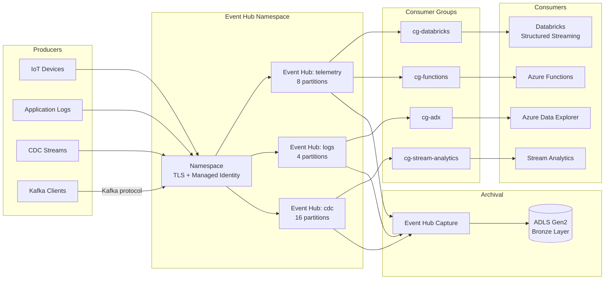

# Azure Event Hubs Guide

> Event Hubs is the streaming backbone of CSA-in-a-Box — a managed,
> Kafka-compatible ingestion layer that buffers high-velocity data into the
> Bronze layer with zero broker operations.
> See [ADR-0005](../adr/0005-event-hubs-over-kafka.md) for the decision rationale.

---

## Why Event Hubs

Event Hubs was chosen over self-hosted Kafka and Confluent Cloud for three
reasons: it is Gov-GA with FedRAMP High inheritance, it requires zero
ZooKeeper/KRaft management, and its Kafka-protocol endpoint lets existing
Kafka producers connect without code changes. Event Hubs Capture writes
directly to ADLS Gen2 as Avro or Parquet, giving every vertical example
zero-code Bronze ingestion.

---

## Architecture Overview



---

## Setup

### Namespace Creation (Bicep)

```bicep
resource ehNamespace 'Microsoft.EventHub/namespaces@2024-01-01' = {
  name: 'eh-csa-${environment}-${location}'
  location: location
  sku: {
    name: 'Standard'       // Standard | Premium | Dedicated
    tier: 'Standard'
    capacity: 2            // Throughput units (Standard) or PUs (Premium)
  }
  properties: {
    isAutoInflateEnabled: true
    maximumThroughputUnits: 10
    kafkaEnabled: true     // Enables Kafka-protocol endpoint
    minimumTlsVersion: '1.2'
    publicNetworkAccess: 'Disabled'
    disableLocalAuth: true // Force Entra ID auth only
  }
}
```

### Event Hub Configuration

```bicep
resource eventHub 'Microsoft.EventHub/namespaces/eventhubs@2024-01-01' = {
  parent: ehNamespace
  name: 'telemetry'
  properties: {
    partitionCount: 8          // Fixed at creation on Standard tier
    messageRetentionInDays: 7  // 1-7 (Standard) or 1-90 (Premium)
    status: 'Active'
  }
}
```

### Consumer Groups

Always create dedicated consumer groups per downstream consumer. The default
`$Default` group should never be shared across consumers.

```bicep
resource cgDatabricks 'Microsoft.EventHub/namespaces/eventhubs/consumergroups@2024-01-01' = {
  parent: eventHub
  name: 'cg-databricks'
  properties: {
    userMetadata: 'Databricks Structured Streaming — Bronze ingest'
  }
}

resource cgAdx 'Microsoft.EventHub/namespaces/eventhubs/consumergroups@2024-01-01' = {
  parent: eventHub
  name: 'cg-adx'
  properties: {
    userMetadata: 'ADX streaming ingestion — hot path analytics'
  }
}
```

---

## Event Hub Capture

Capture provides automatic archival of every event to ADLS Gen2 — no
consumer code required. This is the primary mechanism for populating the
Bronze layer in CSA-in-a-Box.

### Configuration

```bicep
resource captureDescription 'Microsoft.EventHub/namespaces/eventhubs@2024-01-01' = {
  parent: ehNamespace
  name: 'telemetry'
  properties: {
    partitionCount: 8
    messageRetentionInDays: 7
    captureDescription: {
      enabled: true
      encoding: 'Avro'          // Avro (default) or AvroDeflate
      intervalInSeconds: 300    // Flush every 5 minutes
      sizeLimitInBytes: 314572800 // 300 MB max file size
      destination: {
        name: 'EventHubArchive.AzureBlockBlob'
        properties: {
          storageAccountResourceId: adlsAccount.id
          blobContainer: 'bronze'
          archiveNameFormat: '{Namespace}/{EventHub}/{PartitionId}/{Year}/{Month}/{Day}/{Hour}/{Minute}/{Second}'
        }
      }
    }
  }
}
```

### Path Patterns

| Pattern element            | Example             | Notes                           |
| -------------------------- | ------------------- | ------------------------------- |
| `{Namespace}`              | `eh-csa-dev-eastus` | Identifies the source namespace |
| `{EventHub}`               | `telemetry`         | Topic/event hub name            |
| `{PartitionId}`            | `0` through `7`     | Partition for ordering          |
| `{Year}/{Month}/{Day}`     | `2026/04/29`        | Date-based partitioning         |
| `{Hour}/{Minute}/{Second}` | `14/30/00`          | Time granularity                |

!!! tip "Parquet Capture"
Premium and Dedicated tiers support Parquet encoding directly. For
Standard tier, Capture writes Avro — convert to Delta in the Bronze-to-Silver
dbt step.

---

## Kafka Compatibility

Event Hubs exposes a Kafka-protocol endpoint on port 9093 (SASL_SSL). Existing
Kafka producers and consumers connect without code changes.

### Kafka Client Configuration

```properties
# bootstrap.servers — use the Event Hubs namespace FQDN
bootstrap.servers=eh-csa-dev-eastus.servicebus.windows.net:9093
security.protocol=SASL_SSL
sasl.mechanism=PLAIN
sasl.jaas.config=org.apache.kafka.common.security.plain.PlainLoginModule required \
  username="$ConnectionString" \
  password="Endpoint=sb://eh-csa-dev-eastus.servicebus.windows.net/;SharedAccessKeyName=...;SharedAccessKey=...";

# Or use OAuth (recommended for production)
sasl.mechanism=OAUTHBEARER
sasl.login.callback.handler.class=org.apache.kafka.common.security.oauthbearer.OAuthBearerLoginCallbackHandler
sasl.oauthbearer.token.endpoint.url=https://login.microsoftonline.com/{tenant-id}/oauth2/v2.0/token
sasl.oauthbearer.scope=https://eh-csa-dev-eastus.servicebus.windows.net/.default
```

!!! warning "Kafka Feature Subset"
Event Hubs supports the Kafka **producer and consumer** protocols but does
**not** support Kafka Connect, Kafka Streams, KSQL, or broker-side
transactions. If you need those, evaluate Confluent Cloud on Azure as an
alternate path (see ADR-0005).

---

## Schema Registry

Event Hubs includes a built-in Schema Registry for Avro schema management.

### Registering a Schema

```python
from azure.schemaregistry import SchemaRegistryClient
from azure.identity import DefaultAzureCredential

client = SchemaRegistryClient(
    fully_qualified_namespace="eh-csa-dev-eastus.servicebus.windows.net",
    credential=DefaultAzureCredential(),
)

schema_definition = """{
  "type": "record",
  "name": "TelemetryEvent",
  "namespace": "com.csa.telemetry",
  "fields": [
    {"name": "device_id", "type": "string"},
    {"name": "timestamp", "type": "long", "logicalType": "timestamp-millis"},
    {"name": "temperature", "type": "double"},
    {"name": "humidity",    "type": "double"}
  ]
}"""

schema = client.register_schema(
    group_name="csa-telemetry",
    name="TelemetryEvent",
    definition=schema_definition,
    format="Avro",
)
print(f"Schema ID: {schema.id}")
```

### Schema Evolution Rules

| Change                 | Backward compatible? | Action required              |
| ---------------------- | -------------------- | ---------------------------- |
| Add field with default | Yes                  | No consumer changes          |
| Remove field           | No                   | Update all consumers first   |
| Rename field           | No                   | Add new field, deprecate old |
| Change field type      | No                   | Version the schema (v2)      |

---

## Streaming Patterns

### At-Least-Once vs Exactly-Once

| Guarantee         | How                                                | Trade-off                                     |
| ----------------- | -------------------------------------------------- | --------------------------------------------- |
| **At-least-once** | Consumer commits offset after processing           | Duplicates possible; use idempotent writes    |
| **Exactly-once**  | Checkpoint + transactional sink (Databricks Delta) | Higher latency; requires Delta MERGE or dedup |

!!! info "CSA-in-a-Box Default"
The platform defaults to **at-least-once** with idempotent Delta MERGE in
dbt Silver models. This is simpler to operate and handles 99% of use cases.

### Checkpointing

Consumers must persist their partition offsets (checkpoints) to survive
restarts. Databricks Structured Streaming uses ADLS-based checkpoints
automatically. Azure Functions uses Azure Storage blobs.

### Partition Assignment

- **Round-robin** (default) — events spread evenly across partitions
- **Partition key** — events with the same key go to the same partition (ordering guarantee)
- Use partition keys for per-device or per-tenant ordering; avoid hot partitions by choosing high-cardinality keys

---

## Databricks Integration

### Structured Streaming from Event Hubs (PySpark)

```python
from pyspark.sql import SparkSession
from pyspark.sql.functions import col, from_json, current_timestamp
from pyspark.sql.types import StructType, StructField, StringType, DoubleType, LongType

spark = SparkSession.builder.getOrCreate()

# Connection configuration
eh_conf = {
    "eventhubs.connectionString": sc._jvm.org.apache.spark.eventhubs
        .EventHubsUtils
        .encrypt(dbutils.secrets.get("kv-csa", "eh-connection-string")),
    "eventhubs.consumerGroup": "cg-databricks",
    "eventhubs.startingPosition": '{"offset": "-1", "enqueuedTime": null, "isInclusive": true}',
    "maxEventsPerTrigger": 10000,
}

# Define the payload schema
schema = StructType([
    StructField("device_id", StringType()),
    StructField("timestamp", LongType()),
    StructField("temperature", DoubleType()),
    StructField("humidity", DoubleType()),
])

# Read stream
raw_stream = (
    spark.readStream
    .format("eventhubs")
    .options(**eh_conf)
    .load()
)

# Parse the body (bytes → JSON → struct)
parsed = (
    raw_stream
    .withColumn("body", col("body").cast("string"))
    .withColumn("data", from_json(col("body"), schema))
    .select(
        col("data.device_id").alias("device_id"),
        col("data.timestamp").alias("event_timestamp"),
        col("data.temperature"),
        col("data.humidity"),
        col("enqueuedTime").alias("enqueued_at"),
        current_timestamp().alias("ingested_at"),
    )
)

# Write to Bronze Delta table with checkpointing
(
    parsed.writeStream
    .format("delta")
    .outputMode("append")
    .option("checkpointLocation", "/mnt/bronze/telemetry/_checkpoint")
    .table("bronze.telemetry_raw")
)
```

---

## Security

### Authentication & Authorization

| Method               | Use case                                            | Recommendation                                      |
| -------------------- | --------------------------------------------------- | --------------------------------------------------- |
| **Managed Identity** | Azure-hosted consumers (Databricks, Functions, ADX) | Preferred for all Azure workloads                   |
| **SAS Policy**       | External producers, legacy clients                  | Scope to Send-only or Listen-only; rotate regularly |
| **Entra ID OAuth**   | Kafka clients, service principals                   | Use `Azure Event Hubs Data Sender/Receiver` roles   |

### Network Security

- **Private Endpoints** — deploy Event Hubs with `publicNetworkAccess: Disabled` and connect via Private Link
- **IP firewall rules** — allowlist specific CIDRs when private endpoints are not feasible
- **Service endpoints** — legacy option; prefer Private Endpoints for new deployments

!!! warning "Disable Local Auth"
Set `disableLocalAuth: true` on the namespace to force Entra ID
authentication and prevent SAS key usage in production.

---

## Monitoring

### Key Metrics

| Metric                 | Alert threshold | What it means                                   |
| ---------------------- | --------------- | ----------------------------------------------- |
| **Incoming Messages**  | Baseline + 50%  | Burst ingestion; check auto-inflate             |
| **Outgoing Messages**  | Drop > 30%      | Consumer lag or failure                         |
| **Throttled Requests** | Any             | Throughput units exhausted                      |
| **Server Errors**      | Any             | Service-side issue; open support ticket         |
| **Capture Backlog**    | > 0 for 15 min  | Capture falling behind; increase flush interval |

### Diagnostic Settings

```bicep
resource diagnostics 'Microsoft.Insights/diagnosticSettings@2021-05-01-preview' = {
  scope: ehNamespace
  name: 'eh-diagnostics'
  properties: {
    workspaceId: logAnalyticsWorkspace.id
    logs: [
      { categoryGroup: 'allLogs', enabled: true }
    ]
    metrics: [
      { category: 'AllMetrics', enabled: true }
    ]
  }
}
```

---

## Cost Optimization

| Tier          | Best for                     | Throughput                   | Price model           |
| ------------- | ---------------------------- | ---------------------------- | --------------------- |
| **Standard**  | Dev/test, moderate workloads | 1 TU = 1 MB/s in, 2 MB/s out | Per TU-hour + ingress |
| **Premium**   | Production, large partitions | 1 PU = ~5-10 TU equivalent   | Per PU-hour           |
| **Dedicated** | Multi-tenant, >1M msg/s      | Entire cluster reserved      | Per CU-hour           |

!!! tip "Auto-Inflate"
Enable auto-inflate on Standard tier to automatically scale throughput
units from your baseline up to a configured maximum. This prevents throttling
during burst ingestion without pre-provisioning peak capacity.

### Capture Costs

Capture is free to enable — you pay only for the ADLS storage written. At
Standard tier, Capture writes Avro; at Premium/Dedicated, Parquet is available
and reduces downstream conversion costs.

---

## Anti-Patterns

!!! failure "Don't: Share consumer groups across consumers"
Each downstream service needs its own consumer group. Sharing causes
partition theft and message loss.

!!! failure "Don't: Use Event Hubs for request-reply"
Event Hubs is an append-only log. For request-reply messaging, use
Azure Service Bus queues or topics.

!!! failure "Don't: Ignore partition count planning"
Partition counts are fixed at creation on Standard tier. Start with at
least as many partitions as your expected peak consumer parallelism.
Over-partitioning is cheap; under-partitioning requires recreating the hub.

!!! success "Do: Use partition keys for ordering"
If per-device or per-tenant ordering matters, set a partition key.
Without a key, events are round-robin distributed and order is not guaranteed.

!!! success "Do: Enable Capture from day one"
Capture costs nothing beyond storage. Enable it immediately so the Bronze
layer is populated from the start — you cannot retroactively capture
events that have already expired.

---

## Checklist

- [ ] Namespace created with `kafkaEnabled: true` and `disableLocalAuth: true`
- [ ] Private Endpoint configured; public network access disabled
- [ ] Event hubs created with appropriate partition counts
- [ ] Dedicated consumer groups created per downstream consumer
- [ ] Capture enabled to ADLS Gen2 Bronze container
- [ ] Schema Registry schemas registered for each event type
- [ ] Databricks Structured Streaming job tested with checkpoint
- [ ] Diagnostic settings forwarding to Log Analytics
- [ ] Auto-inflate enabled (Standard) or PU scaling configured (Premium)
- [ ] Alerting configured for throttled requests and consumer lag

---

## Related Documentation

- [ADR-0005 — Event Hubs over Kafka](../adr/0005-event-hubs-over-kafka.md)
- [ADR-0018 — Fabric RTI Adapter](../adr/0018-fabric-rti-adapter.md)
- [Pattern — Streaming & CDC](../patterns/streaming-cdc.md)
- [Decision — Kafka vs Event Hubs vs Service Bus](../decisions/kafka-vs-eventhubs-vs-servicebus.md)
- [Use Case — Real-Time Intelligence](../use-cases/realtime-intelligence-anomaly-detection.md)
- [Guide — Azure Data Explorer](azure-data-explorer.md)
