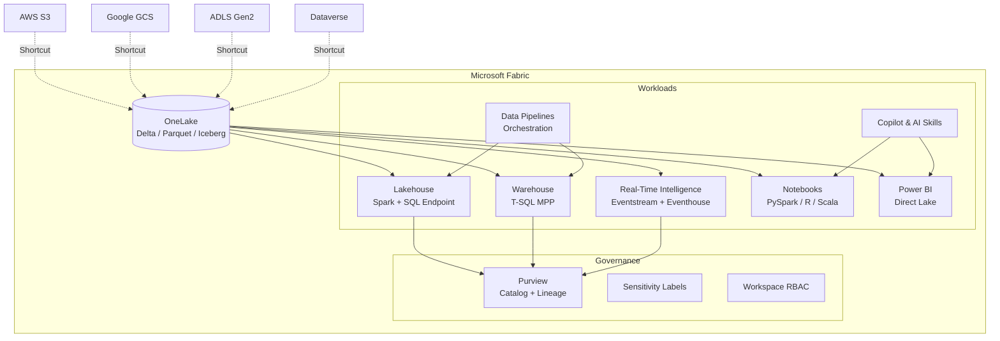
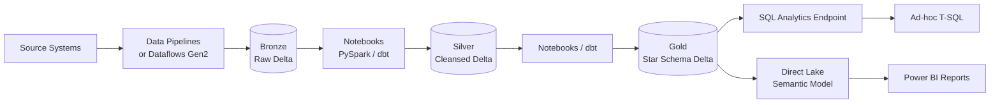
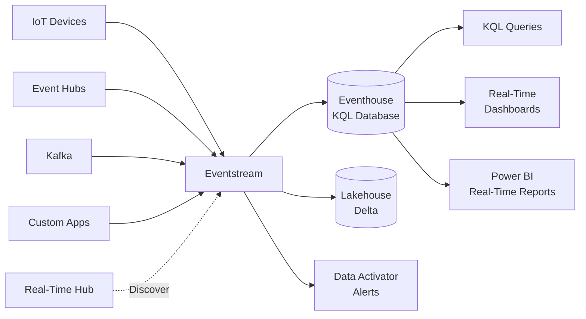
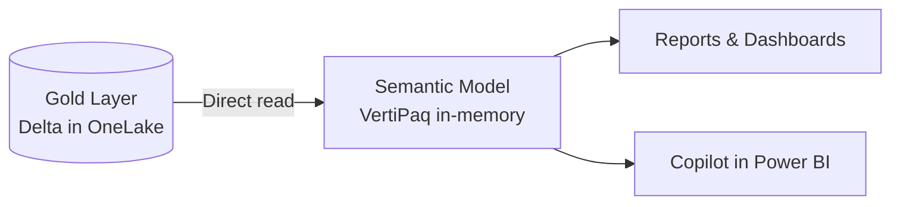

# Microsoft Fabric — The CSA-in-a-Box Platform Guide

> **Comparative positioning note.** This document is written from the
> perspective of Microsoft Azure, Cloud Scale Analytics, and CSA Loom. Any
> description of third-party or competing products, services, pricing, or
> capabilities is derived from **publicly available documentation and sources**
> believed accurate at the time of writing, and is provided for **general
> comparison only**. We do not claim expertise in, or authority over, any
> non-Microsoft product or service; the respective vendor's official
> documentation is the authoritative source for their offerings, which may
> change over time. Nothing here is intended to disparage any vendor — where a
> competing product has genuine advantages, we aim to note them honestly.
> Verify all third-party details against the vendor's current official
> documentation before making decisions.


> **TL;DR:** Microsoft Fabric is the unified analytics platform that collapses
> lakehouse, warehouse, real-time analytics, data engineering, BI, and
> governance into a single SaaS boundary backed by OneLake.
> [ADR-0010](../adr/0010-fabric-strategic-target.md) declares Fabric the
> strategic target for CSA-in-a-Box: every primitive in the current PaaS
> stack (Delta, Purview, dbt, Spark, Power BI) maps forward into Fabric
> with low rewrite cost. This guide covers what Fabric is, how its
> components work, and where the
> [Supercharge Microsoft Fabric](https://fgarofalo56.github.io/Suppercharge_Microsoft_Fabric/)
> companion site provides deeper hands-on material.

---

## Why Fabric Matters for CSA

CSA-in-a-Box was designed from day one to be Fabric-forward. Every technology
choice recorded in ADRs 0001 through 0009 was selected so it either matches a
Fabric primitive directly or has a documented migration path to one
([ADR-0010](../adr/0010-fabric-strategic-target.md)).

The value proposition is straightforward:

- **Unified platform** — One capacity, one security model, one catalog. No
  more stitching together ADF, Databricks, Synapse, Purview, and Power BI
  as independent services with separate billing, networking, and RBAC.
- **OneLake as the single data lake** — All workloads read and write to
  OneLake in open formats (Delta, Parquet, Iceberg). No data duplication
  across engines.
- **Direct Lake** — Power BI reads Delta tables in OneLake directly,
  eliminating scheduled imports and delivering sub-second analytics over
  fresh data.
- **Elimination of service sprawl** — Fewer Azure resources to deploy,
  monitor, and secure. A single Fabric capacity replaces multiple
  standalone services.
- **Federal readiness** — The current PaaS stack is production-ready for
  Azure Government today. When Fabric reaches Gov GA, the migration path
  is a connection swap, not a rewrite.

!!! note "Gov availability"
Fabric is GA in Azure Commercial. Azure Government availability
(FedRAMP High, IL4+) is on the Microsoft roadmap but not yet GA as of
2026-Q2. Federal tenants continue on the PaaS stack and migrate when
Gov GA lands. See [ADR-0010](../adr/0010-fabric-strategic-target.md)
for the dual-track strategy.

---

## Architecture Overview

Fabric organizes all analytics workloads around OneLake as the central
storage layer. Each workload (Lakehouse, Warehouse, Real-Time Intelligence,
Data Pipelines, Power BI, Copilot) operates on the same data without
copies.



---

## OneLake

OneLake is the single, tenant-wide data lake underpinning every Fabric
workload. It is to Fabric what OneDrive is to Microsoft 365 — one lake per
tenant, organized by workspaces.

### Core Concepts

| Concept          | Description                                                                                   |
| ---------------- | --------------------------------------------------------------------------------------------- |
| **One copy**     | All workloads read the same physical data. No ETL between engines.                            |
| **Shortcuts**    | Virtual pointers to external data (S3, GCS, ADLS Gen2, Dataverse) without copying.            |
| **Open formats** | Delta Lake is the default table format. Parquet and Iceberg (via interop) are also supported. |
| **ABFS path**    | Every item has a standard `abfss://` path addressable from Spark, T-SQL, or REST.             |
| **Governance**   | Inherits workspace RBAC, Purview cataloging, and sensitivity labels automatically.            |

### Shortcuts

Shortcuts let you query data that lives outside of Fabric without moving it.
This is the primary mechanism for hybrid architectures or incremental
migration.

| Shortcut target | Use case                                                |
| --------------- | ------------------------------------------------------- |
| **ADLS Gen2**   | Existing medallion layers on Azure storage              |
| **AWS S3**      | Cross-cloud data access (analytics without egress copy) |
| **Google GCS**  | Cross-cloud data access                                 |
| **Dataverse**   | Dynamics 365 / Power Platform data without export       |
| **OneLake**     | Cross-workspace references within the same tenant       |

### Open Formats

Fabric stores data in open formats by default:

- **Delta Lake** — the primary table format. Full ACID transactions,
  time travel, Z-order optimization, and liquid clustering.
- **Parquet** — read natively for any non-Delta files.
- **Iceberg** — OneLake exposes Delta tables via Iceberg-compatible
  metadata, enabling external engines (Spark, Trino, Snowflake) to read
  Fabric tables without conversion.

### Security Model

OneLake security layers from coarse to fine:

1. **Workspace RBAC** — Admin, Member, Contributor, Viewer.
2. **Item permissions** — Per-lakehouse or per-warehouse grants.
3. **OneLake data access roles** — Folder-level read/write within a
   lakehouse (preview).
4. **Row/Column-level security** — Enforced at the SQL endpoint or
   semantic model layer.
5. **Sensitivity labels** — Purview MIP labels flow through to exports
   and downstream reports.

**Deep dive:**
[OneLake Security](https://fgarofalo56.github.io/Suppercharge_Microsoft_Fabric/features/onelake-security/)
|
[Iceberg Interop](https://fgarofalo56.github.io/Suppercharge_Microsoft_Fabric/features/onelake-iceberg-interop/)
|
[OneLake Catalog](https://fgarofalo56.github.io/Suppercharge_Microsoft_Fabric/features/onelake-catalog/)

---

## Lakehouse

The Fabric Lakehouse combines a Delta Lake file store with an auto-generated
SQL analytics endpoint for T-SQL querying. It is the natural home for
medallion architecture workloads.

### Medallion Architecture in Fabric



| Layer      | Format | Purpose                                 | Typical transforms                        |
| ---------- | ------ | --------------------------------------- | ----------------------------------------- |
| **Bronze** | Delta  | Raw ingestion, append-only              | Schema enforcement, deduplication keys    |
| **Silver** | Delta  | Cleansed, conformed, business keys      | Null handling, type casting, SCD2 merges  |
| **Gold**   | Delta  | Star schema, aggregated, consumer-ready | Joins, calculations, dimensional modeling |

### SQL Analytics Endpoint

Every Lakehouse automatically exposes a read-only T-SQL endpoint over its
Delta tables. SQL users and tools can query the lakehouse without Spark.
This endpoint also serves as the backing store for Direct Lake semantic
models.

### When to Use Lakehouse vs Warehouse

| Criterion             | Lakehouse                         | Warehouse                             |
| --------------------- | --------------------------------- | ------------------------------------- |
| **Primary language**  | PySpark / Spark SQL / dbt         | T-SQL                                 |
| **Write pattern**     | Spark notebooks, pipelines        | T-SQL INSERT/MERGE, stored procedures |
| **Transaction model** | Delta ACID                        | Full T-SQL transactions               |
| **Schema evolution**  | Flexible (schema-on-read capable) | Strict (DDL-defined)                  |
| **Best for**          | Data engineering, ML, exploration | SQL-first warehousing, BI serving     |
| **Direct Lake**       | Yes, via SQL analytics endpoint   | Yes, natively                         |

!!! tip "Use both"
Many production architectures use a Lakehouse for Bronze/Silver
(data engineering) and a Warehouse for Gold (BI serving). Cross-database
queries let you join across them seamlessly.

**Deep dive:**
[Lakehouse Setup](https://fgarofalo56.github.io/Suppercharge_Microsoft_Fabric/best-practices/07_LAKEHOUSE_SETUP/)
|
[Bronze Layer Tutorial](https://fgarofalo56.github.io/Suppercharge_Microsoft_Fabric/tutorials/01-bronze-layer/)
|
[Silver Layer Tutorial](https://fgarofalo56.github.io/Suppercharge_Microsoft_Fabric/tutorials/02-silver-layer/)
|
[Gold Layer Tutorial](https://fgarofalo56.github.io/Suppercharge_Microsoft_Fabric/tutorials/03-gold-layer/)
|
[Medallion Deep Dive](https://fgarofalo56.github.io/Suppercharge_Microsoft_Fabric/best-practices/medallion-architecture-deep-dive/)

---

## Warehouse

The Fabric Warehouse is a fully managed T-SQL data warehouse built on the
same OneLake storage as the Lakehouse but optimized for SQL-first workloads.

### Key Capabilities

- **Full T-SQL surface** — DDL, DML, stored procedures, views, functions.
- **Cross-database queries** — Query across Lakehouses and Warehouses in
  the same workspace without data movement.
- **Automatic statistics and indexing** — Fabric manages physical
  optimization automatically.
- **Clone tables** — Zero-copy clones for dev/test or point-in-time
  snapshots.
- **Stored procedures** — Business logic in T-SQL, callable from pipelines.

### When to Use Warehouse

Choose the Warehouse when:

- The team's primary skill set is T-SQL.
- The workload is SQL-first DML (INSERT, UPDATE, DELETE, MERGE).
- Stored procedures encapsulate critical business logic.
- You need full transactional semantics beyond Delta ACID.

Avoid the Warehouse when the workload is Spark/Python-centric or requires
heavy ML processing — that belongs in the Lakehouse with notebooks.

**Deep dive:**
[Warehouse Setup](https://fgarofalo56.github.io/Suppercharge_Microsoft_Fabric/best-practices/08_WAREHOUSE_SETUP/)
|
[Cross-Database Queries](https://fgarofalo56.github.io/Suppercharge_Microsoft_Fabric/features/cross-database-queries/)
|
[Lakehouse vs Warehouse Decision Guide](https://fgarofalo56.github.io/Suppercharge_Microsoft_Fabric/best-practices/lakehouse-warehouse-sqldb-decision-guide/)

---

## Data Pipelines

Fabric Data Pipelines are the orchestration layer, built on the same engine
as Azure Data Factory but running natively inside Fabric.

### Core Patterns

| Pattern               | Description                                                     |
| --------------------- | --------------------------------------------------------------- |
| **Copy activity**     | Move data from 100+ connectors into OneLake                     |
| **Dataflow Gen2**     | Low-code Power Query transformations at scale                   |
| **Notebook activity** | Run PySpark notebooks as pipeline steps                         |
| **Stored procedure**  | Execute Warehouse T-SQL from a pipeline                         |
| **Metadata-driven**   | Config table drives which sources/tables to process dynamically |
| **Event-triggered**   | OneLake file arrival triggers pipeline execution                |

### Metadata-Driven Pipelines

The metadata-driven pattern uses a control table to define sources,
targets, and transformation logic. A single generic pipeline reads the
table and iterates over entries, reducing pipeline sprawl.

```
control_table
├── source_system: "crm"
├── source_table: "accounts"
├── target_lakehouse: "bronze"
├── load_type: "incremental"
├── watermark_column: "modified_date"
└── is_active: true
```

### Comparison to ADF

| Feature             | ADF (standalone)       | Fabric Data Pipelines       |
| ------------------- | ---------------------- | --------------------------- |
| **Billing**         | Per-activity-run + DIU | Included in Fabric capacity |
| **Storage target**  | ADLS / SQL / Cosmos    | OneLake (primary)           |
| **Monitoring**      | ADF Monitor blade      | Fabric Monitoring Hub       |
| **Git integration** | ADF Git mode           | Fabric Git integration      |
| **Spark notebooks** | Linked Databricks      | Native Fabric notebooks     |

**Deep dive:**
[Data Pipelines Tutorial](https://fgarofalo56.github.io/Suppercharge_Microsoft_Fabric/tutorials/06-data-pipelines/)
|
[Metadata-Driven Pipelines](https://fgarofalo56.github.io/Suppercharge_Microsoft_Fabric/best-practices/04_METADATA_DRIVEN_PIPELINES/)
|
[Pipelines & Data Movement](https://fgarofalo56.github.io/Suppercharge_Microsoft_Fabric/best-practices/03_PIPELINES_DATA_MOVEMENT/)

---

## Real-Time Intelligence

Real-Time Intelligence (RTI) is Fabric's streaming and time-series analytics
suite, combining event ingestion, storage, querying, and alerting in a
single integrated experience.

### Components



| Component          | Purpose                                                          |
| ------------------ | ---------------------------------------------------------------- |
| **Eventstream**    | No-code event ingestion and routing from 20+ sources             |
| **Eventhouse**     | Time-series optimized storage with KQL query engine              |
| **KQL Database**   | Individual database within an Eventhouse for logical separation  |
| **Real-Time Hub**  | Central catalog for discovering and subscribing to event streams |
| **Data Activator** | Condition-based alerting and actions on streaming or static data |
| **KQL Queryset**   | Saved KQL queries for ad-hoc analysis and dashboarding           |

### When to Use RTI

- Sub-second ingestion and querying of time-series or event data.
- IoT telemetry, application logs, clickstream, or security events.
- Real-time dashboards that need refresh at ingestion speed, not scheduled
  intervals.
- Alert-driven workflows (Data Activator triggers Teams/email/Power
  Automate on threshold breach).

### RTI vs Event Hubs + ADX

RTI is the Fabric-native evolution of the Event Hubs + Azure Data Explorer
(ADX) pattern. If you are already using ADX standalone, RTI provides the
same KQL engine inside Fabric with unified billing and governance.

**Deep dive:**
[Real-Time Intelligence Feature](https://fgarofalo56.github.io/Suppercharge_Microsoft_Fabric/features/real-time-intelligence/)
|
[Real-Time Analytics Tutorial](https://fgarofalo56.github.io/Suppercharge_Microsoft_Fabric/tutorials/04-real-time-analytics/)
|
[Eventhouse Vector Database](https://fgarofalo56.github.io/Suppercharge_Microsoft_Fabric/features/eventhouse-vector-database/)
|
[Alerting & Data Activator](https://fgarofalo56.github.io/Suppercharge_Microsoft_Fabric/best-practices/alerting-data-activator/)

---

## Direct Lake & Power BI

Direct Lake is the connectivity mode that makes Fabric transformative for
BI workloads. It reads Delta tables in OneLake directly into the Power BI
in-memory engine — no scheduled import refresh, no DirectQuery backend
round-trips.

### How It Works



- **Import-tier performance** — Data is loaded into the VertiPaq engine on
  first query, then cached. Subsequent queries hit memory.
- **Near real-time freshness** — When the underlying Delta table changes,
  the cache is transparently refreshed. No scheduled refresh to manage.
- **Fallback to DirectQuery** — If the data exceeds memory or the Delta
  table is unavailable, queries fall back to DirectQuery automatically.

### Trade-offs

| You give                               | You get                                                     |
| -------------------------------------- | ----------------------------------------------------------- |
| Data must be in OneLake (Delta format) | Sub-second queries with no import refresh overhead          |
| Limited DAX functions during fallback  | Near real-time freshness without DirectQuery latency        |
| Requires Fabric capacity (F SKU)       | Unified billing — no separate Power BI Premium P SKU needed |
| Some advanced DAX may trigger fallback | Import-tier performance on arbitrarily large datasets       |

### Semantic Models

Build semantic models following the same star schema conventions used in the
current PaaS Power BI guide. The DAX measures, calculation groups, and RLS
definitions are identical — only the data source connection changes from
Import/DirectQuery to Direct Lake.

**Deep dive:**
[Direct Lake Feature](https://fgarofalo56.github.io/Suppercharge_Microsoft_Fabric/features/direct-lake/)
|
[Direct Lake & Power BI Tutorial](https://fgarofalo56.github.io/Suppercharge_Microsoft_Fabric/tutorials/05-direct-lake-powerbi/)
|
[Power BI Best Practices](https://fgarofalo56.github.io/Suppercharge_Microsoft_Fabric/best-practices/power-bi-best-practices/)
|
[Semantic Link](https://fgarofalo56.github.io/Suppercharge_Microsoft_Fabric/features/semantic-link/)
|
[Composite Models](https://fgarofalo56.github.io/Suppercharge_Microsoft_Fabric/features/composite-models/)

---

## Copilot & AI

Fabric integrates AI throughout the platform, from natural language
querying to notebook code generation.

### Capabilities

| Capability                  | Where it runs         | What it does                                                |
| --------------------------- | --------------------- | ----------------------------------------------------------- |
| **Copilot in Notebooks**    | Spark notebooks       | Generates PySpark/SQL code, explains code, fixes errors     |
| **Copilot in Power BI**     | Report authoring      | Generates DAX measures, creates visuals, summarizes reports |
| **Copilot in Data Factory** | Pipeline authoring    | Describes pipeline steps, suggests transformations          |
| **AI Skills**               | Lakehouse / Warehouse | Custom NL-to-SQL skills published as reusable endpoints     |
| **Data Agents**             | OneLake               | Autonomous agents that query and reason over Fabric data    |
| **Fabric IQ**               | Across workloads      | Natural language data exploration and question answering    |

### AI Skills

AI Skills let you create a natural language interface over your Gold layer.
Users ask questions in plain English; the skill translates to SQL and
returns results. Skills are versioned, testable, and shareable within a
workspace.

### Data Agents

Data Agents extend AI Skills with autonomous reasoning. An agent can
decompose a complex question, query multiple tables, apply business logic,
and return a synthesized answer — effectively a RAG pipeline over your
lakehouse.

**Deep dive:**
[AI Copilot Configuration](https://fgarofalo56.github.io/Suppercharge_Microsoft_Fabric/features/ai-copilot-configuration/)
|
[Data Agents](https://fgarofalo56.github.io/Suppercharge_Microsoft_Fabric/features/data-agents/)
|
[Fabric IQ](https://fgarofalo56.github.io/Suppercharge_Microsoft_Fabric/features/fabric-iq/)
|
[Copilot & AI Tutorial](https://fgarofalo56.github.io/Suppercharge_Microsoft_Fabric/tutorials/19-copilot-ai/)
|
[Advanced AI/ML Tutorial](https://fgarofalo56.github.io/Suppercharge_Microsoft_Fabric/tutorials/09-advanced-ai-ml/)
|
[AutoML & Model Endpoints](https://fgarofalo56.github.io/Suppercharge_Microsoft_Fabric/features/automl-model-endpoints/)

---

## Spark & Notebooks

Fabric Spark (Synapse Data Engineering) provides managed Apache Spark for
data engineering, ML, and exploration.

### Key Features

- **PySpark, Spark SQL, Scala, R** — Full language support in notebooks.
- **Environments** — Reusable configurations bundling library versions,
  Spark properties, and pool sizes. Attach an environment to a notebook
  or a Spark job definition.
- **Library management** — Public PyPI/Maven packages, workspace libraries,
  and custom `.whl` / `.jar` uploads.
- **Spark job definitions** — Submit production Spark jobs outside of
  notebooks with configurable retry and alerting.
- **V-Order optimization** — Fabric applies V-Order write optimization to
  Delta tables automatically, accelerating Direct Lake reads.
- **High concurrency mode** — Share a single Spark session across multiple
  notebooks for cost-efficient interactive work.

### Notebook Best Practices

1. **Use environments** — Pin library versions to an environment rather than
   running `%pip install` inline.
2. **Optimize writes** — Enable V-Order and liquid clustering on Gold layer
   tables for Direct Lake performance.
3. **Parameterize** — Use notebook parameters and pipeline notebook
   activities for reusable, testable transforms.
4. **Monitor** — Use the Spark monitoring hub to identify slow stages,
   skewed partitions, and spill.

**Deep dive:**
[Spark & Notebooks Best Practices](https://fgarofalo56.github.io/Suppercharge_Microsoft_Fabric/best-practices/05_SPARK_NOTEBOOKS/)
|
[Notebooks](https://github.com/fgarofalo56/Suppercharge_Microsoft_Fabric/tree/main/notebooks)
|
[dbt Integration](https://fgarofalo56.github.io/Suppercharge_Microsoft_Fabric/features/dbt-fabric-integration/)

---

## Data Governance (Purview)

Fabric governance is built on Microsoft Purview, the same platform used in
the current CSA-in-a-Box PaaS stack
([Purview guide](purview.md)).

### Governance Capabilities in Fabric

| Capability               | Description                                                               |
| ------------------------ | ------------------------------------------------------------------------- |
| **Data catalog**         | Automatic discovery of all Fabric items — lakehouses, warehouses, reports |
| **Lineage**              | End-to-end lineage from source through pipelines to Power BI reports      |
| **Sensitivity labels**   | MIP labels applied to items, inherited by downstream consumers            |
| **Data Loss Prevention** | DLP policies block sharing of labeled data outside allowed boundaries     |
| **Access policies**      | Purview-managed access policies for OneLake data (preview)                |
| **Domains**              | Logical grouping of Fabric items for decentralized data ownership         |

### Migration from PaaS Purview

When migrating from the current PaaS stack to Fabric, Purview metadata
carries forward:

- Glossary terms and classifications transfer directly.
- Sensitivity labels apply to Fabric items the same way they apply to
  ADLS and Databricks today.
- Lineage expands to cover Fabric-native items (Eventstreams, Direct Lake
  models).

**Deep dive:**
[Governance & Purview Tutorial](https://fgarofalo56.github.io/Suppercharge_Microsoft_Fabric/tutorials/07-governance-purview/)
|
[Data Governance Deep Dive](https://fgarofalo56.github.io/Suppercharge_Microsoft_Fabric/best-practices/data-governance-deep-dive/)
|
[Identity & RBAC Patterns](https://fgarofalo56.github.io/Suppercharge_Microsoft_Fabric/best-practices/identity-rbac-patterns/)

---

## Capacity Planning

Fabric uses a Capacity Unit (CU) model. All workloads — Spark, SQL,
pipelines, Power BI — consume CUs from a shared pool.

### F-SKU Comparison

| SKU       | CUs  | Spark v-cores | Power BI equivalent | Typical workload                         | Approx. monthly cost |
| --------- | ---- | ------------- | ------------------- | ---------------------------------------- | -------------------- |
| **F2**    | 2    | 8             | —                   | Dev/test, small POC                      | ~$260                |
| **F4**    | 4    | 16            | —                   | Small team, light exploration            | ~$520                |
| **F8**    | 8    | 32            | P1 equivalent       | Departmental analytics, Direct Lake      | ~$1,040              |
| **F16**   | 16   | 64            | P2 equivalent       | Multiple workloads, moderate concurrency | ~$2,080              |
| **F32**   | 32   | 128           | P3 equivalent       | Enterprise BI, heavy Spark + SQL         | ~$4,160              |
| **F64**   | 64   | 256           | P4 equivalent       | Large enterprise, high concurrency       | ~$8,320              |
| **F128**  | 128  | 512           | P5 equivalent       | Platform-scale, multi-team               | ~$16,640             |
| **F256**  | 256  | 1024          | —                   | Very large data estates                  | ~$33,280             |
| **F512**  | 512  | 2048          | —                   | Extreme scale                            | ~$66,560             |
| **F1024** | 1024 | 4096          | —                   | Maximum single-capacity                  | ~$133,120            |
| **F2048** | 2048 | 8192          | —                   | Highest tier                             | ~$266,240            |

### Cost Optimization Levers

| Lever                     | Description                                                        |
| ------------------------- | ------------------------------------------------------------------ |
| **Smoothing**             | Fabric spreads burst CU consumption over 24 hours, avoiding spikes |
| **Autoscale**             | Automatically adds CUs during peak; scales back after              |
| **Pause/resume**          | Pause capacity during off-hours (dev/test)                         |
| **Reservations**          | 1-year commitment for 40% discount; available for F64+             |
| **Right-sizing**          | Start with F8; scale based on actual CU utilization metrics        |
| **Workspace segregation** | Separate dev/test and prod capacities to avoid contention          |

!!! tip "Start small"
Begin with F2 or F4 for proof-of-concept work. Monitor CU consumption
in the Fabric Capacity Metrics app and scale up only when utilization
consistently exceeds 80%.

**Deep dive:**
[Capacity Planning & Cost Optimization](https://fgarofalo56.github.io/Suppercharge_Microsoft_Fabric/best-practices/capacity-planning-cost-optimization/)
|
[Cost Estimation](https://fgarofalo56.github.io/Suppercharge_Microsoft_Fabric/COST_ESTIMATION/)
|
[FinOps & Cost Governance](https://fgarofalo56.github.io/Suppercharge_Microsoft_Fabric/best-practices/finops-cost-governance/)
|
[Cost Optimization Tutorial](https://fgarofalo56.github.io/Suppercharge_Microsoft_Fabric/tutorials/15-cost-optimization/)

---

## When to Use Fabric vs Alternatives

The full decision tree lives in
[Fabric vs. Databricks vs. Synapse](../decisions/fabric-vs-databricks-vs-synapse.md)
and the
[Reference Architecture](../reference-architecture/fabric-vs-synapse-vs-databricks.md).
Below is a condensed comparison.

| Criterion            | Microsoft Fabric                 | Azure Databricks                    | Azure Synapse                         |
| -------------------- | -------------------------------- | ----------------------------------- | ------------------------------------- |
| **Best for**         | Unified analytics + BI           | Spark/ML-heavy, multi-cloud         | Azure Gov, dedicated SQL pools        |
| **Primary language** | T-SQL + PySpark + DAX            | Python + Spark SQL + Scala          | T-SQL + Spark SQL                     |
| **Storage**          | OneLake (Delta)                  | ADLS/S3/GCS (Delta + Unity Catalog) | ADLS (Delta / Parquet)                |
| **BI integration**   | Direct Lake (native)             | Databricks SQL + DirectQuery        | Serverless SQL + DirectQuery          |
| **Real-time**        | RTI (Eventhouse, KQL)            | Structured Streaming                | Synapse Data Explorer pool            |
| **Governance**       | Purview (native)                 | Unity Catalog + Purview bridge      | Purview integration                   |
| **Cost model**       | F-SKU capacity (CU)              | DBU-based                           | DWU (dedicated) / per-TB (serverless) |
| **Azure Gov**        | Roadmap (not yet GA)             | GA (FedRAMP High, IL4, IL5)         | GA (FedRAMP High, IL4, IL5, IL6)      |
| **Multi-cloud**      | Azure only                       | AWS, Azure, GCP                     | Azure only                            |
| **Skill ceiling**    | Low (SQL + Power BI + notebooks) | High (Spark, MLflow, Unity Catalog) | Medium (T-SQL + Spark pools)          |

### Decision Shortcuts

- **Power BI-centric, Azure Commercial, greenfield** -- Fabric.
- **Heavy Spark/ML, multi-cloud, or deep MLflow investment** -- Databricks.
- **Azure Government, IL5/IL6, or existing Synapse dedicated pools** --
  Synapse.
- **Hybrid** -- Databricks for data engineering + Fabric for BI and
  real-time (common transitional architecture).

---

## Fabric in CSA-in-a-Box

CSA-in-a-Box integrates Fabric at multiple levels. The current PaaS stack
is designed as a Fabric on-ramp — every component has a documented forward
path.

### Integration Points

| CSA-in-a-Box component | Current PaaS                        | Fabric equivalent                       | Migration effort |
| ---------------------- | ----------------------------------- | --------------------------------------- | ---------------- |
| **Storage**            | ADLS Gen2 (medallion)               | OneLake (same Delta format)             | Shortcut or copy |
| **Compute**            | Databricks / Synapse Spark          | Fabric Spark (notebooks)                | Minimal rewrite  |
| **Orchestration**      | Azure Data Factory                  | Fabric Data Pipelines                   | JSON-compatible  |
| **Transforms**         | dbt Core on Databricks              | dbt Core on Fabric SQL endpoint         | Adapter swap     |
| **BI**                 | Power BI Import/DirectQuery         | Power BI Direct Lake                    | Connection swap  |
| **Governance**         | Purview (standalone)                | Purview (Fabric-integrated)             | Config migration |
| **Real-time**          | Event Hubs + ADX / Stream Analytics | Fabric RTI (Eventstream + Eventhouse)   | Adapter pattern  |
| **AI**                 | Azure OpenAI                        | Azure OpenAI + Fabric AI Skills/Copilot | Additive         |

### Bicep Deployment

CSA-in-a-Box Bicep modules provision Azure PaaS resources today. Fabric
capacity can be provisioned via Bicep (`Microsoft.Fabric/capacities`), and
Fabric items (lakehouses, warehouses, pipelines) are managed through the
Fabric REST API or the `fabric-cicd` CLI tool.

### dbt on Fabric

The `dbt-fabric` adapter connects dbt Core to the Fabric SQL analytics
endpoint. Existing dbt models written for Databricks or Synapse require
an adapter swap and minor SQL dialect adjustments — the business logic
remains unchanged.

### Power BI with Direct Lake

The transition from Import/DirectQuery to Direct Lake preserves the entire
semantic model: star schema, DAX measures, calculation groups, RLS. Only
the data source binding changes. See the
[Power BI guide](power-bi.md) for the detailed migration table.

**Deep dive:**
[dbt Integration](https://fgarofalo56.github.io/Suppercharge_Microsoft_Fabric/features/dbt-fabric-integration/)
|
[CI/CD with fabric-cicd](https://fgarofalo56.github.io/Suppercharge_Microsoft_Fabric/best-practices/fabric-cicd-deployment/)
|
[CI/CD & DevOps Tutorial](https://fgarofalo56.github.io/Suppercharge_Microsoft_Fabric/tutorials/12-cicd-devops/)

---

## Migration Paths to Fabric

CSA-in-a-Box includes migration playbooks for common platform transitions.
Several target Fabric directly or pass through the PaaS stack with a
documented Fabric forward path.

| Source platform        | Migration playbook                                                  | Fabric-specific content                       |
| ---------------------- | ------------------------------------------------------------------- | --------------------------------------------- |
| **Databricks**         | [Databricks to Fabric](../migrations/databricks-to-fabric/index.md) | Full playbook (notebooks, UC, streaming, ML)  |
| **Snowflake**          | [Snowflake Migration](../migrations/snowflake/index.md)             | Lands on Fabric Lakehouse or PaaS             |
| **Teradata**           | [Teradata Migration](../migrations/teradata/index.md)               | Tutorial 10 covers Fabric specifically        |
| **AWS (Redshift/EMR)** | [AWS to Azure](../migrations/aws-to-azure/index.md)                 | Analytics migration targets Fabric or PaaS    |
| **GCP (BigQuery)**     | [GCP to Azure](../migrations/gcp-to-azure/index.md)                 | Analytics migration targets Fabric or PaaS    |
| **Hadoop/Hive**        | [Hadoop/Hive Migration](../migrations/hadoop-hive/index.md)         | Lands on Fabric Lakehouse (Spark-native)      |
| **Cloudera**           | [Cloudera to Azure](../migrations/cloudera-to-azure/index.md)       | Impala to Fabric Warehouse, NiFi to Pipelines |
| **SAS**                | [SAS to Azure](../migrations/sas-to-azure/index.md)                 | SAS datasets to Fabric Lakehouse Delta        |
| **Informatica**        | [Informatica Migration](../migrations/informatica/index.md)         | PowerCenter to Fabric Data Pipelines          |
| **Palantir Foundry**   | [Palantir Migration](../migrations/palantir-foundry/index.md)       | Ontology to Fabric Lakehouse + AI Skills      |
| **Tableau**            | [Tableau to Power BI](../migrations/tableau-to-powerbi/index.md)    | Direct Lake as target connectivity mode       |
| **Qlik**               | [Qlik to Power BI](../migrations/qlik-to-powerbi/index.md)          | Direct Lake as target connectivity mode       |
| **DB2**                | [DB2 to Azure SQL](../migrations/db2-to-azure-sql/index.md)         | Fabric SQL Database or mirroring              |
| **Oracle**             | [Oracle to Azure](../migrations/oracle-to-azure/index.md)           | Fabric mirroring for near-real-time sync      |

**Deep dive:**
[Migration Planning Tutorial](https://fgarofalo56.github.io/Suppercharge_Microsoft_Fabric/tutorials/13-migration-planning/)
|
[Migration Patterns](https://fgarofalo56.github.io/Suppercharge_Microsoft_Fabric/best-practices/migration-patterns/)
|
[Teradata Migration Tutorial](https://fgarofalo56.github.io/Suppercharge_Microsoft_Fabric/tutorials/10-teradata-migration/)
|
[Snowflake to Fabric Tutorial](https://fgarofalo56.github.io/Suppercharge_Microsoft_Fabric/tutorials/24-snowflake-to-fabric/)
|
[SAS Connectivity Tutorial](https://fgarofalo56.github.io/Suppercharge_Microsoft_Fabric/tutorials/11-sas-connectivity/)

---

## Deep Dive Resources

The [Supercharge Microsoft Fabric](https://fgarofalo56.github.io/Suppercharge_Microsoft_Fabric/)
companion site provides hands-on tutorials, feature guides, best practices,
and POC materials for Fabric. Use the table below to navigate to the right
section.

| Section             | URL                                                                                                   | What you will find                                           |
| ------------------- | ----------------------------------------------------------------------------------------------------- | ------------------------------------------------------------ |
| **Tutorials**       | [tutorials/](https://fgarofalo56.github.io/Suppercharge_Microsoft_Fabric/tutorials/)                  | 37 step-by-step tutorials (medallion, RTI, AI, migrations)   |
| **Features**        | [features/](https://fgarofalo56.github.io/Suppercharge_Microsoft_Fabric/features/fabric-iq/)          | 30+ feature deep dives (Direct Lake, RTI, dbt, Copilot)      |
| **Best Practices**  | [best-practices/](https://fgarofalo56.github.io/Suppercharge_Microsoft_Fabric/best-practices/)        | Production patterns (workspaces, pipelines, Spark, security) |
| **Use Cases**       | [use-cases/](https://fgarofalo56.github.io/Suppercharge_Microsoft_Fabric/use-cases/)                  | Federal and industry analytics scenarios                     |
| **POC Agenda**      | [poc-agenda/](https://fgarofalo56.github.io/Suppercharge_Microsoft_Fabric/poc-agenda/)                | 3-day POC runbook with demo scripts                          |
| **Architecture**    | [ARCHITECTURE/](https://fgarofalo56.github.io/Suppercharge_Microsoft_Fabric/ARCHITECTURE/)            | Platform architecture and security model                     |
| **Notebooks**       | [GitHub notebooks/](https://github.com/fgarofalo56/Suppercharge_Microsoft_Fabric/tree/main/notebooks) | Ready-to-run PySpark and SQL notebooks                       |
| **Power BI Assets** | [GitHub powerbi/](https://github.com/fgarofalo56/Suppercharge_Microsoft_Fabric/tree/main/powerbi)     | PBIP report templates and semantic model examples            |
| **Infrastructure**  | [infra/](https://fgarofalo56.github.io/Suppercharge_Microsoft_Fabric/infra/)                          | Bicep IaC modules for Fabric capacity provisioning           |
| **Cheat Sheet**     | [CHEAT_SHEET/](https://fgarofalo56.github.io/Suppercharge_Microsoft_Fabric/tutorials/CHEAT_SHEET/)    | Quick reference for common Fabric operations                 |

### Selected Feature Guides

| Feature                  | Link                                                                                                                                           |
| ------------------------ | ---------------------------------------------------------------------------------------------------------------------------------------------- |
| Database Mirroring       | [features/mirroring/](https://fgarofalo56.github.io/Suppercharge_Microsoft_Fabric/features/mirroring/)                                         |
| Fabric SQL Database      | [features/fabric-sql-database/](https://fgarofalo56.github.io/Suppercharge_Microsoft_Fabric/features/fabric-sql-database/)                     |
| API for GraphQL          | [features/api-for-graphql/](https://fgarofalo56.github.io/Suppercharge_Microsoft_Fabric/features/api-for-graphql/)                             |
| Fabric REST APIs         | [features/fabric-rest-apis/](https://fgarofalo56.github.io/Suppercharge_Microsoft_Fabric/features/fabric-rest-apis/)                           |
| VNet Data Gateway        | [features/vnet-data-gateway/](https://fgarofalo56.github.io/Suppercharge_Microsoft_Fabric/features/vnet-data-gateway/)                         |
| Workspace IP Firewall    | [features/workspace-ip-firewall/](https://fgarofalo56.github.io/Suppercharge_Microsoft_Fabric/features/workspace-ip-firewall/)                 |
| Data Mesh Patterns       | [features/data-mesh-enterprise-patterns/](https://fgarofalo56.github.io/Suppercharge_Microsoft_Fabric/features/data-mesh-enterprise-patterns/) |
| Digital Twin Builder     | [features/digital-twin-builder/](https://fgarofalo56.github.io/Suppercharge_Microsoft_Fabric/features/digital-twin-builder/)                   |
| Fabric MCP               | [features/fabric-mcp/](https://fgarofalo56.github.io/Suppercharge_Microsoft_Fabric/features/fabric-mcp/)                                       |
| Workspace Monitoring     | [features/workspace-monitoring/](https://fgarofalo56.github.io/Suppercharge_Microsoft_Fabric/features/workspace-monitoring/)                   |
| Federated Fabric for GCC | [features/federated-fabric-gcc/](https://fgarofalo56.github.io/Suppercharge_Microsoft_Fabric/features/federated-fabric-gcc/)                   |

---

## Related

- **ADR:** [ADR-0010 — Fabric as strategic target](../adr/0010-fabric-strategic-target.md)
- **Decision tree:** [Fabric vs. Databricks vs. Synapse](../decisions/fabric-vs-databricks-vs-synapse.md)
- **Decision tree:** [Lakehouse vs. Warehouse vs. Lake](../decisions/lakehouse-vs-warehouse-vs-lake.md)
- **Reference architecture:** [Fabric vs Synapse vs Databricks](../reference-architecture/fabric-vs-synapse-vs-databricks.md)
- **Pattern:** [Power BI & Fabric Roadmap](../patterns/power-bi-fabric-roadmap.md)
- **Guide:** [Power BI](power-bi.md) (Direct Lake migration, semantic models)
- **Guide:** [Purview](purview.md) (governance, sensitivity labels)
- **Guide:** [Azure Data Explorer](azure-data-explorer.md) (RTI predecessor)
- **Guide:** [Azure Synapse](azure-synapse.md) (current PaaS engine)
- **Guide:** [Databricks Best Practices](databricks-best-practices.md) (current Spark engine)
- **Migration:** [Databricks to Fabric](../migrations/databricks-to-fabric/index.md)
- **Use case:** [Fabric Unified Analytics](../use-cases/fabric-unified-analytics.md)
- **Companion site:** [Supercharge Microsoft Fabric](https://fgarofalo56.github.io/Suppercharge_Microsoft_Fabric/)
