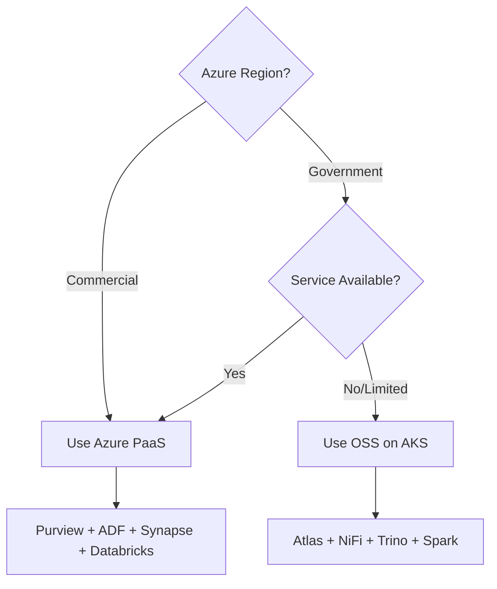

# Open-Source Ecosystem Guide

This guide covers the open-source alternatives and integrations available
in CSA-in-a-Box for scenarios where Azure PaaS services are unavailable
(e.g., Azure Government) or where teams prefer OSS tooling.

## Architecture Decision: Azure PaaS vs. OSS



## Service Mapping

| Capability       | Azure PaaS         | OSS Alternative      | Deployment  |
| ---------------- | ------------------ | -------------------- | ----------- |
| Data Catalog     | Microsoft Purview  | Apache Atlas         | Helm on AKS |
| Fine-grained ACL | Purview Policies   | Apache Ranger        | Helm on AKS |
| Data Integration | Azure Data Factory | Apache NiFi          | Helm on AKS |
| SQL Analytics    | Synapse Serverless | Trino (Starburst)    | Helm on AKS |
| Dashboards       | Power BI           | Apache Superset      | Helm on AKS |
| Orchestration    | ADF Pipelines      | Apache Airflow       | Helm on AKS |
| Streaming        | Event Hubs + ASA   | Apache Kafka + Flink | Helm on AKS |
| Search           | Azure AI Search    | OpenSearch           | Helm on AKS |

## Deployment Model

### Full OSS (Azure Government)

All services run on AKS with Helm charts from `csa_platform/oss_alternatives/helm/`.

```bash
# Deploy AKS cluster
az aks create -g $RG -n csa-oss-cluster \
    --node-count 3 --node-vm-size Standard_D4s_v5 \
    --enable-managed-identity --generate-ssh-keys

# Deploy OSS stack
helm install atlas ./helm/atlas -n csa-platform --create-namespace
helm install nifi ./helm/nifi -n csa-platform
helm install trino ./helm/trino -n csa-platform
helm install superset ./helm/superset -n csa-platform
```

### Hybrid (Commercial Azure with OSS additions)

Use Azure PaaS where available, add OSS for gaps:

```bash
# Example: Add Superset alongside Power BI for self-service
helm install superset ./helm/superset -n csa-platform \
    --set config.SQLALCHEMY_DATABASE_URI="postgresql://..." \
    --set config.SECRET_KEY="$(openssl rand -hex 32)"
```

## Helm Chart Configuration

### Apache Atlas (Data Catalog)

```yaml
# helm/atlas/values.yaml highlights
atlas:
    replicaCount: 1
    image:
        repository: apache/atlas
        tag: "2.3.0"
    persistence:
        enabled: true
        size: 50Gi
    solr:
        enabled: true
    kafka:
        enabled: true
    env:
        ATLAS_SERVER_OPTS: "-Xmx2g"
```

### Apache NiFi (Data Integration)

```yaml
# helm/nifi/values.yaml highlights
nifi:
    replicaCount: 1
    image:
        repository: apache/nifi
        tag: "2.0.0"
    persistence:
        enabled: true
        size: 100Gi
    service:
        type: LoadBalancer
        port: 8443
    auth:
        singleUser:
            username: admin
```

### Trino (SQL Analytics)

```yaml
# helm/trino/values.yaml highlights
trino:
    coordinator:
        resources:
            requests: { cpu: "2", memory: "4Gi" }
    worker:
        replicas: 2
        resources:
            requests: { cpu: "2", memory: "8Gi" }
    catalogs:
        adls: |
            connector.name=delta-lake
            hive.metastore=glue
            delta.register-table-procedure.enabled=true
        postgresql: |
            connector.name=postgresql
            connection-url=jdbc:postgresql://host:5432/db
```

## Integration with CSA Platform

### Atlas ↔ Purview Bridge

When migrating between Atlas and Purview, use the bridge utility:

```python
"""Bridge Apache Atlas entities to Purview format."""
from csa_platform.governance.purview_automation import PurviewClient

# Export from Atlas
atlas_entities = atlas_client.search("*", limit=1000)

# Transform and import to Purview
for entity in atlas_entities:
    purview_entity = {
        "typeName": map_atlas_type(entity["typeName"]),
        "attributes": {
            "qualifiedName": entity["attributes"]["qualifiedName"],
            "name": entity["attributes"]["name"],
        },
    }
    purview_client.create_entity(purview_entity)
```

### NiFi ↔ ADF Equivalence

| ADF Concept         | NiFi Equivalent        |
| ------------------- | ---------------------- |
| Pipeline            | Process Group          |
| Activity            | Processor              |
| Dataset             | Connection             |
| Linked Service      | Controller Service     |
| Trigger             | CRON-driven scheduling |
| Integration Runtime | NiFi cluster node      |

## Phase 2: Azure Government (Coming Soon)

> ⚠️ **Status: Planned for Phase 2**
>
> Full Azure Government deployment guides, FedRAMP compliance
> documentation, and IL4/IL5 configurations are planned for
> the next release. Current OSS alternatives provide a bridge
> for Gov cloud scenarios.

Planned additions:

- Azure Government-specific Bicep parameters
- FedRAMP moderate baseline compliance mapping
- IL4/IL5 network isolation patterns
- FIPS 140-2 cryptographic module configuration
- STIGs for AKS and VM hardening

## Related Documentation

- [OSS Alternatives](../../csa_platform/oss_alternatives/README.md) — Helm charts and details
- [Foundation Tutorial](../tutorials/01-foundation-platform/) — base platform setup
- [Governance Docs](governance/) — Purview configuration
