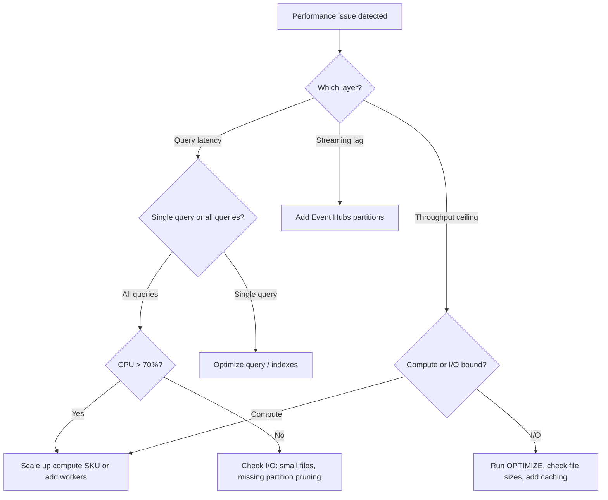

# Performance Testing — Benchmarking and Capacity Planning

> **Comparative positioning note.** This document is written from the
> perspective of Microsoft Azure, Cloud Scale Analytics, and CSA Loom. Any
> description of third-party or competing products, services, pricing, or
> capabilities is derived from **publicly available documentation and sources**
> believed accurate at the time of writing, and is provided for **general
> comparison only**. We do not claim expertise in, or authority over, any
> non-Microsoft product or service; the respective vendor's official
> documentation is the authoritative source for their offerings, which may
> change over time. Nothing here is intended to disparage any vendor — where a
> competing product has genuine advantages, we aim to note them honestly.
> Verify all third-party details against the vendor's current official
> documentation before making decisions.


> **TL;DR** Performance testing validates that CSA-in-a-Box meets SLAs under
> realistic load. This guide covers methodology for each service tier --
> Databricks SQL, Fabric, Cosmos DB, Power BI, API endpoints, and streaming --
> plus the automated regression pipeline that guards against silent degradation.

---

## Testing Architecture

Every performance test follows the same loop: generate load, observe telemetry,
analyse results.

```mermaid
flowchart LR
    subgraph Load Generators
        ALT[Azure Load Testing]
        K6[k6]
        LOC[Locust]
        DBT[dbt benchmark harness]
    end

    subgraph Target Services
        DBSQL[Databricks SQL]
        FAB[Fabric SQL / Lakehouse]
        CDB[Cosmos DB]
        API[Portal API endpoints]
        PBI[Power BI]
        EH[Event Hubs / Streaming]
    end

    subgraph Monitoring
        AM[Azure Monitor]
        AI[Application Insights]
        LA[Log Analytics]
    end

    subgraph Analysis
        KQL[KQL queries]
        RPT[Benchmark reports]
    end

    Load Generators --> Target Services
    Target Services --> Monitoring
    Monitoring --> Analysis
    Analysis -->|feedback| Load Generators
```

Each load generator emits structured results (JSON or CSV) archived as CI
artifacts. Azure Monitor and App Insights capture server-side telemetry.

---

## Query Benchmarking Methodology

Reliable benchmarks require controlled conditions.

### Protocol

1. **Warm-up runs** -- Execute the query 2-3 times before recording to populate
   caches and compile query plans.
2. **Statistical significance** -- Run a minimum of 5 recorded iterations.
   Report p50, p95, and p99 latencies, not averages.
3. **Isolation** -- Use a dedicated cluster or SQL pool to eliminate noise.
4. **Consistent dataset** -- Pin the dataset version (Delta snapshot or
   database restore point) for comparability.
5. **Record environment** -- Log cluster size, SKU, config, and dataset row
   count alongside every result set.

### Benchmark Harness Template

```python
"""Benchmark harness for SQL queries against Databricks or Fabric."""
import json, statistics, time
from pathlib import Path

def run_benchmark(execute_fn, queries: dict, iterations=5, warmup=2, output=None):
    results = {}
    for name, sql in queries.items():
        for _ in range(warmup):
            execute_fn(sql)
        durations = []
        for _ in range(iterations):
            t0 = time.perf_counter()
            execute_fn(sql)
            durations.append(time.perf_counter() - t0)
        durations.sort()
        results[name] = {
            "p50": durations[len(durations) // 2],
            "p95": durations[int(len(durations) * 0.95)],
            "p99": durations[int(len(durations) * 0.99)],
            "mean": statistics.mean(durations),
            "stdev": statistics.stdev(durations) if len(durations) > 1 else 0,
        }
        print(f"{name}: p50={results[name]['p50']:.3f}s  p95={results[name]['p95']:.3f}s")
    if output:
        Path(output).write_text(json.dumps(results, indent=2))
    return results
```

---

## Databricks Sizing

Match cluster configuration to the workload pattern.

| Workload             | Workers | Instance Type          | Autoscale | Photon | Spot | Notes                                  |
| -------------------- | ------- | ---------------------- | --------- | ------ | ---- | -------------------------------------- |
| **ETL batch**        | 4-16    | Standard_D16ds_v5      | 4-16      | Off    | Yes  | Cost-optimize; spot tolerates retries  |
| **Interactive / BI** | 2-8     | Standard_E8ds_v5       | 2-8       | On     | No   | Low latency; Photon speeds scans 2-8x  |
| **Streaming**        | 4-8     | Standard_D8ds_v5       | Fixed     | Off    | No   | Stable executor count avoids rebalance |
| **ML training**      | 4-32    | Standard_NC6s_v3 (GPU) | 4-32      | N/A    | Yes  | GPU spot saves 60-80%                  |
| **SQL Warehouse**    | Auto    | Serverless             | Auto      | On     | N/A  | Best for ad-hoc; pay per query         |

!!! tip "Cost-Performance Sweet Spot"
Start with the smallest autoscale range that keeps queue time under 30
seconds. Monitor `cluster.spark.executor.count` in Ganglia or Azure Monitor
to verify the cluster actually scales before widening the range.

!!! warning "Photon Increases DBU Rate"
Photon DBUs cost ~2x standard DBUs. Enable Photon only when scan-heavy
queries dominate and the wall-clock savings outweigh the DBU premium.
Benchmark both configurations before committing.

---

## Fabric Capacity Planning

Microsoft Fabric uses a Capacity Unit (CU) consumption model. Every operation
draws from a shared CU pool.

### F-SKU Comparison

| SKU       | CU Seconds / hr | Spark vCores | SQL Parallelism | Typical Use                |
| --------- | --------------- | ------------ | --------------- | -------------------------- |
| **F2**    | 7,200           | 8            | 4               | Dev / sandbox              |
| **F8**    | 28,800          | 32           | 16              | Single workload prod       |
| **F16**   | 57,600          | 64           | 32              | Multi-workload prod        |
| **F64**   | 230,400         | 256          | 128             | Enterprise analytics       |
| **F128+** | 460,800+        | 512+         | 256+            | Data warehouse / max scale |

### Smoothing vs Bursting

Fabric smooths CU consumption over 5 minutes for interactive operations and
24 hours for background operations. Short spikes are absorbed; sustained load
above capacity triggers throttling. Scale up when the Capacity Metrics app
shows sustained utilization above 80% or queue delays appear.

### CU Monitoring Query

```kql
// Fabric CU consumption over the last 24 hours
FabricCapacityMetrics
| where Timestamp > ago(24h)
| summarize
    AvgCU = avg(CUConsumption),
    MaxCU = max(CUConsumption),
    P95CU = percentile(CUConsumption, 95)
    by bin(Timestamp, 15m), WorkloadType
| order by Timestamp desc
| render timechart
```

---

## Cosmos DB Throughput

Every Cosmos DB operation costs Request Units (RU). Estimate consumption
before provisioning.

| Operation                                | Typical RU Cost | Notes                                       |
| ---------------------------------------- | --------------- | ------------------------------------------- |
| Point read (1 KB, by id + partition key) | 1 RU            | Cheapest operation                          |
| Point read (10 KB)                       | ~3 RU           | Scales with document size                   |
| Single-document write (1 KB)             | ~5 RU           | Includes indexing                           |
| Query (single partition, 10 results)     | 5-20 RU         | Depends on index hits                       |
| Query (cross-partition, 100 results)     | 50-500 RU       | Avoid in hot paths                          |
| Aggregate (cross-partition COUNT)        | 100-5,000 RU    | Use change feed + materialized view instead |

**Rule of thumb:** provision `peak_ops_per_second * avg_RU_per_op * 1.2` (20%
headroom). Use autoscale (100-max RU/s) for variable workloads.

### Partition Key Impact

A poorly chosen partition key forces cross-partition queries and creates hot
partitions. Benchmark with the target partition key before going to production.
Use `response_headers["x-ms-request-charge"]` or `page.request_charge` from
the Python SDK to measure actual RU cost per query.

!!! tip "Use the Capacity Calculator"
The [Azure Cosmos DB capacity calculator](https://cosmos.azure.com/capacitycalculator/)
takes document size, index policy, read/write ratio, and query patterns as
input and returns a provisioned throughput recommendation.

---

## Power BI Performance

### Connectivity Mode Comparison

| Mode            | Latency             | Data Freshness      | Best For                              |
| --------------- | ------------------- | ------------------- | ------------------------------------- |
| **Import**      | Fastest (in-memory) | Stale until refresh | Dashboards with scheduled refresh     |
| **DirectQuery** | 2-30 s per visual   | Real-time           | Operational reports over large tables |
| **Direct Lake** | Sub-second          | Near real-time      | Fabric lakehouse (preferred)          |
| **Composite**   | Mixed               | Mixed               | Combine hot Import + cold DirectQuery |

### DAX Query Optimization

Slow visuals are almost always slow DAX. Use Performance Analyzer
(View > Performance Analyzer) to identify expensive visuals, then optimize:

- Replace `CALCULATE` + `FILTER(ALL(...))` with `CALCULATETABLE`
- Use `SUMMARIZECOLUMNS` instead of `ADDCOLUMNS` + `SUMMARIZE`
- Avoid iterators (`SUMX`, `AVERAGEX`) over large tables; pre-aggregate in the lakehouse
- Set `IsAvailableInMDX = false` on columns not used in Excel pivot tables

### Direct Lake Guardrails

Direct Lake falls back to DirectQuery if a single query exceeds memory or
row-count thresholds. Monitor fallback events with:

```kql
PowerBIDatasetEvent
| where EventType == "DirectLakeFallback"
| summarize FallbackCount = count() by DatasetName, bin(Timestamp, 1h)
| order by Timestamp desc
```

---

## API Endpoint Testing

The portal API layer sits behind APIM and Azure Functions. Load test it to find
the concurrency ceiling before users do.

### k6 Script Example

```javascript
// tests/load/k6_portal_api.js
import http from "k6/http";
import { check, sleep } from "k6";

export const options = {
    stages: [
        { duration: "30s", target: 20 }, // ramp up
        { duration: "2m", target: 50 }, // sustained load
        { duration: "30s", target: 0 }, // ramp down
    ],
    thresholds: {
        http_req_duration: ["p(95)<500", "p(99)<1500"],
        http_req_failed: ["rate<0.01"],
    },
};

export default function () {
    const res = http.get(`${__ENV.BASE_URL}/api/v1/health`, {
        headers: { "x-api-key": __ENV.API_KEY },
    });
    check(res, { "status 200": (r) => r.status === 200 });
    sleep(1);
}
```

### Latency Targets

| Endpoint Category    | p50        | p95        | p99         | Max Concurrent Users |
| -------------------- | ---------- | ---------- | ----------- | -------------------- |
| Health / readiness   | < 50 ms    | < 100 ms   | < 200 ms    | N/A                  |
| CRUD (single record) | < 200 ms   | < 500 ms   | < 1,500 ms  | 200                  |
| Search / list        | < 500 ms   | < 1,500 ms | < 3,000 ms  | 100                  |
| AI enrichment        | < 2,000 ms | < 5,000 ms | < 10,000 ms | 50                   |

---

## Streaming Throughput

### Event Hubs Partition Sizing

Each Event Hubs partition supports a maximum of 1 MB/s ingress and 2 MB/s
egress. Size partitions to peak throughput plus headroom.

**Formula:** `partitions = ceil(peak_MB_per_sec) * 1.5` (round up, 50% headroom).

| Throughput Tier    | Partitions | Consumer Groups | Notes                         |
| ------------------ | ---------- | --------------- | ----------------------------- |
| Low (< 5 MB/s)     | 8          | 2-4             | Default for dev/test          |
| Medium (5-50 MB/s) | 32         | 4-8             | Standard production           |
| High (50-200 MB/s) | 128        | 8-16            | Dedicated tier required       |
| Ultra (> 200 MB/s) | 256+       | 16+             | Premium tier, contact support |

### End-to-End Latency Measurement

Measure from event publish to dashboard update by embedding a timestamp in the
payload and computing the delta at the consumer.

```kql
// Consumer-side: measure end-to-end latency
TelemetryEvents
| extend PublishedAt = unixtime_seconds_todatetime(todouble(parsed_payload.published_at))
| extend E2ELatencyMs = datetime_diff("millisecond", ingestion_time(), PublishedAt)
| summarize P50 = percentile(E2ELatencyMs, 50),
            P95 = percentile(E2ELatencyMs, 95),
            P99 = percentile(E2ELatencyMs, 99)
    by bin(ingestion_time(), 5m)
| render timechart
```

---

## Capacity Planning Formulas

Use these rules of thumb to project when a scale-up is needed.

**Storage growth:**
`projected_storage_TB = current_TB * (1 + daily_growth_rate) ^ days`

**Compute scaling trigger:** scale when average CPU or CU utilization exceeds
70% sustained over 30 minutes.

**Node addition trigger:** add workers when Spark task queue depth exceeds
`2 * total_cores` for more than 5 minutes.

### Decision Tree



---

## Automated Performance Regression

The `load-tests.yml` workflow provides on-demand performance regression
detection. It is manual-dispatch only because tests hit live environments and
incur cost.

### How It Works

1. **Dispatch** -- trigger via GitHub Actions UI, selecting a target, VU count, and duration.
2. **Execution** -- runs Locust, k6, or the dbt benchmark harness against the target environment.
3. **Baseline comparison** -- dbt benchmarks compare against files in `tests/load/baselines/`; a 20% regression triggers a warning annotation.
4. **Artifact upload** -- reports are uploaded as workflow artifacts (14-90 day retention).

### Establishing a Baseline

```bash
# Run the benchmark harness locally, then commit the output as a baseline
python tests/load/benchmark_dbt_models.py \
    --target dev \
    --models tag:silver \
    --runs 5 \
    --output tests/load/baselines/dbt-bench-silver.baseline.json

git add tests/load/baselines/
git commit -m "perf: establish silver model benchmark baseline"
```

### Regression Detection Thresholds

| Metric             | Warning          | Failure          |
| ------------------ | ---------------- | ---------------- |
| Query p50 latency  | > 10% regression | > 25% regression |
| Query p95 latency  | > 15% regression | > 30% regression |
| Throughput (req/s) | > 10% decrease   | > 20% decrease   |
| Error rate         | > 0.5%           | > 2%             |

!!! warning "Environment Drift"
Baselines are only valid when the environment matches. Re-establish
baselines after cluster resizing, SKU changes, or major data volume
increases. Comparing a 4-node baseline to an 8-node run is meaningless.

---

## Anti-Patterns

!!! warning "Testing in Shared Environments"
Shared clusters introduce uncontrollable variance. Another user's query can
spike CPU and skew your p95. Always benchmark on dedicated, isolated
compute.

!!! warning "Insufficient Warm-Up"
The first query execution compiles plans, populates caches, and may trigger
JIT compilation. Including it inflates p50 by 2-10x. Always discard at
least 2 warm-up iterations.

!!! warning "Ignoring Tail Latency"
A p50 of 200 ms with a p99 of 15 s means 1 in 100 users waits 15 seconds.
SLAs should be defined on p95 or p99, not averages or medians alone.

!!! warning "Benchmarking with Unrealistic Data Volumes"
A query that runs in 500 ms on 1 GB of data may take 5 minutes on 500 GB.
Always test with production-scale data or a statistically representative
sample (minimum 10% of production volume).

!!! warning "Single-Run Conclusions"
One run proves nothing. Variance from GC pauses, network jitter, or
autoscale lag can swing results 30%+. Report confidence intervals or at
minimum run 5 iterations.

---

## Benchmark Result Template

Use this table to record and compare benchmark runs across configurations.

| Metric           | Baseline    | Current     | Delta  | Status  |
| ---------------- | ----------- | ----------- | ------ | ------- |
| **Test date**    | 2026-04-01  | 2026-04-15  | --     | --      |
| **Environment**  | 4x D16ds_v5 | 4x D16ds_v5 | Same   | --      |
| **Dataset rows** | 50M         | 52M         | +4%    | --      |
| **Query A p50**  | 1.2 s       | 1.3 s       | +8%    | Pass    |
| **Query A p95**  | 2.1 s       | 2.4 s       | +14%   | Warning |
| **Query A p99**  | 3.8 s       | 4.0 s       | +5%    | Pass    |
| **Query B p50**  | 0.4 s       | 0.4 s       | 0%     | Pass    |
| **Query B p95**  | 0.9 s       | 1.5 s       | +67%   | Fail    |
| **Throughput**   | 120 req/s   | 115 req/s   | -4%    | Pass    |
| **Error rate**   | 0.1%        | 0.2%        | +0.1pp | Pass    |

Copy this template into your benchmark reports. Include environment details,
dataset version, and commit SHA so results are reproducible.

---

## Related

- [Performance Tuning](../best-practices/performance-tuning.md) -- Delta Lake,
  Spark, and query-level optimization techniques
- [Cost Optimization](../best-practices/cost-optimization.md) -- Balancing
  performance investment against cloud spend
- [Databricks Best Practices](databricks-best-practices.md) -- Cluster
  policies, workspace layout, and operational hardening
- [Cosmos DB Guide](cosmos-db.md) -- Throughput provisioning, partition design,
  and change feed patterns
- [Event Hubs Guide](event-hubs.md) -- Partition sizing, consumer groups, and
  capture configuration
- [Power BI Guide](power-bi.md) -- Connectivity modes, dataset refresh, and
  governance
