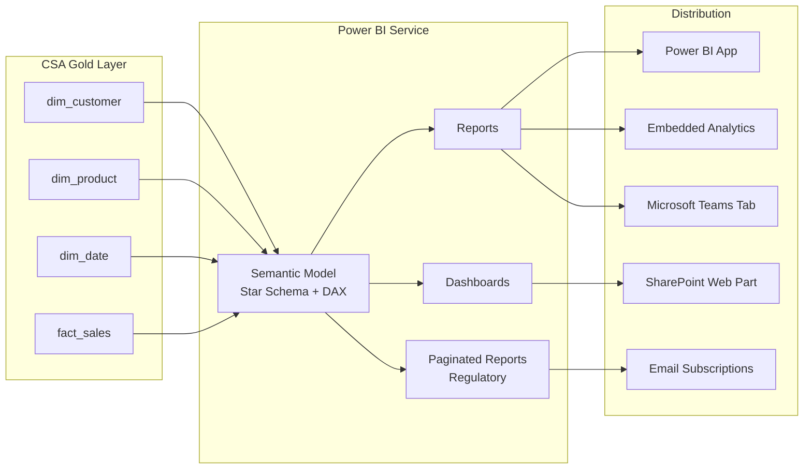
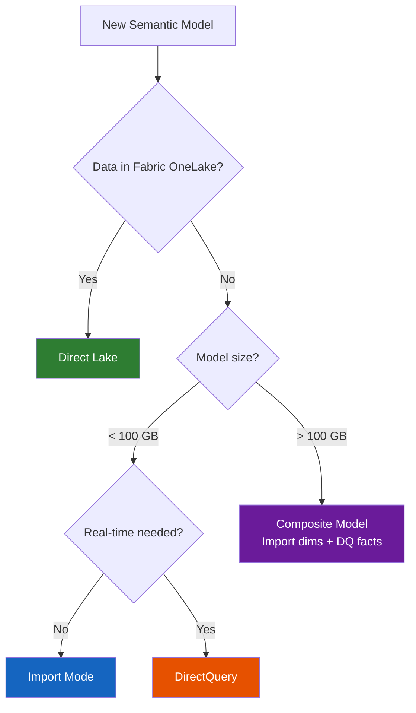
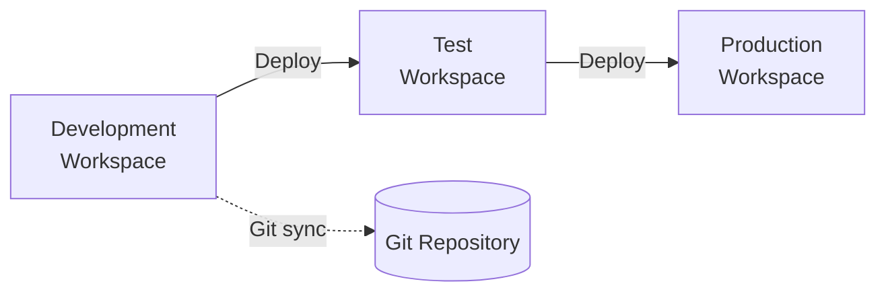
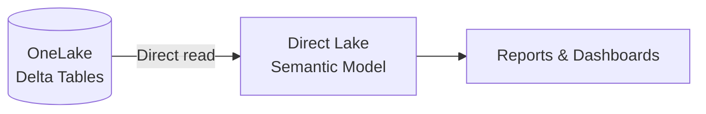
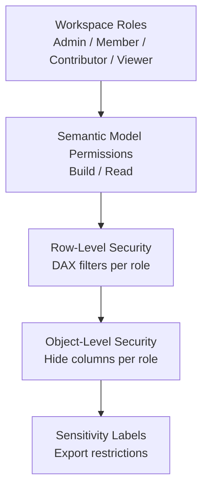

# Power BI Guide

> Power BI is the visualization and reporting layer for CSA-in-a-Box — connecting
> the Gold layer of the medallion architecture to interactive dashboards, embedded
> analytics, and regulatory reports.

---

## Why Power BI

Power BI is the native BI tool in the Microsoft analytics stack. It consumes
the Gold layer (star-schema Delta tables) via Import, DirectQuery, or Direct
Lake, and inherits sensitivity labels from Purview automatically. For federal
tenants, Power BI is available in Azure Government with FedRAMP High. As Fabric
reaches Gov GA (ADR-0010), Power BI semantic models transition to Direct Lake
with zero rewrite.

---

## Architecture Overview



---

## Connectivity Modes

Choosing the right connectivity mode is one of the most consequential
decisions in a Power BI deployment. The table below maps each mode to the
CSA-in-a-Box context.

| Mode                | Data freshness                 | Performance                         | Max size                         | When to use                                   | When to avoid                         |
| ------------------- | ------------------------------ | ----------------------------------- | -------------------------------- | --------------------------------------------- | ------------------------------------- |
| **Import**          | Scheduled refresh (min 30 min) | Fastest queries                     | ~10 GB (Pro) / ~400 GB (Premium) | <100 GB models, complex DAX, batch-refresh OK | Real-time freshness required          |
| **DirectQuery**     | Real-time (per-query)          | Backend-dependent                   | Unlimited                        | Real-time dashboards, very large datasets     | Complex DAX, high-concurrency reports |
| **Composite**       | Mixed (Import dims + DQ facts) | Good with aggregations              | Mixed                            | Large fact tables + small dimensions          | Simple models where Import suffices   |
| **Direct Lake**     | Near real-time (Fabric only)   | Import-tier perf, DQ-tier freshness | Fabric capacity limits           | New models on Fabric/OneLake                  | Non-Fabric environments               |
| **Live Connection** | Real-time                      | Depends on source AS model          | Source-defined                   | Shared enterprise semantic models             | When you need local DAX measures      |



!!! tip "CSA-in-a-Box Default"
For current PaaS deployments, use **Import** mode against the Gold layer
Delta tables in ADLS (via Databricks SQL endpoint or Synapse Serverless).
When migrating to Fabric, switch to **Direct Lake** — the semantic model
DAX and schema remain identical; only the data source connection changes.

---

## Semantic Models

### Star Schema from Gold Layer

CSA-in-a-Box Gold tables are modeled as star schemas in dbt. The Power BI
semantic model maps directly to these tables.

```
Semantic Model
├── dim_customer     (Type: Dimension, Cardinality: ~100K)
├── dim_product      (Type: Dimension, Cardinality: ~10K)
├── dim_date         (Type: Dimension, Cardinality: ~10 years)
├── dim_geography    (Type: Dimension, Cardinality: ~50K)
├── fact_sales       (Type: Fact, Cardinality: ~50M)
└── fact_inventory   (Type: Fact, Cardinality: ~10M)
```

### DAX Measures

Centralize business logic in DAX measures rather than report-level calculations.

```dax
// Revenue — base measure
Revenue = SUMX(fact_sales, fact_sales[quantity] * fact_sales[unit_price])

// Revenue YTD — time intelligence
Revenue YTD =
    TOTALYTD([Revenue], dim_date[date])

// Revenue vs Prior Year — comparison
Revenue vs PY =
    VAR _CurrentRevenue = [Revenue]
    VAR _PriorYear = CALCULATE([Revenue], SAMEPERIODLASTYEAR(dim_date[date]))
    RETURN
        DIVIDE(_CurrentRevenue - _PriorYear, _PriorYear)

// Customer Count — distinct count
Active Customers =
    DISTINCTCOUNT(fact_sales[customer_key])
```

### Calculation Groups

Use calculation groups for time intelligence patterns that apply to multiple
measures (YTD, QTD, MTD, Prior Year).

```dax
// Calculation group: Time Intelligence
// Items: Current, YTD, QTD, MTD, PY, PY YTD
// Applied to: Revenue, Cost, Margin, Customer Count

// YTD item
TOTALYTD(SELECTEDMEASURE(), dim_date[date])

// Prior Year item
CALCULATE(SELECTEDMEASURE(), SAMEPERIODLASTYEAR(dim_date[date]))
```

### Row-Level Security (RLS)

```dax
// Role: Regional Manager
// Table: dim_geography
// DAX filter:
[region] = USERPRINCIPALNAME()

// Role: Department Head
// Table: dim_department
// DAX filter:
[department_id] IN
    VALUES(
        FILTER(security_mapping,
            security_mapping[user_email] = USERPRINCIPALNAME()
        )[department_id]
    )
```

!!! warning "RLS + DirectQuery"
RLS filters are pushed to the backend on every query in DirectQuery mode.
Ensure the backend data source has indexes on the filtered columns to
avoid full table scans.

---

## Performance

### Aggregation Tables

For large fact tables (>100M rows), create pre-aggregated tables that Power BI
queries first.

| Aggregation level     | Source table | Grain                    | Row count |
| --------------------- | ------------ | ------------------------ | --------- |
| `agg_sales_daily`     | `fact_sales` | Date + Product + Region  | ~5M       |
| `agg_sales_monthly`   | `fact_sales` | Month + Product Category | ~100K     |
| `fact_sales` (detail) | `fact_sales` | Transaction-level        | ~500M     |

Power BI automatically routes queries to the appropriate aggregation level.

### Composite Models

Combine Import and DirectQuery for the best of both:

- **Import**: dimension tables, aggregation tables (fast filters, fast slicers)
- **DirectQuery**: large fact tables (avoid importing 500M+ rows)

### Query Folding

!!! info "What is Query Folding?"
Query folding translates Power Query (M) transformations into native SQL
queries pushed to the source. Folded queries run at the source; unfolded
queries download raw data and transform in-memory. Always verify folding
in the Power Query editor (right-click step > View Native Query).

### Incremental Refresh

Configure incremental refresh for large Import models to refresh only recent
data.

```
Policy:
  Archive period:  3 years
  Refresh period:  30 days
  Detect changes:  dim_date[last_modified] (optional, for real-time)
  Only refresh complete periods: Yes
```

| Parameter        | Setting                                                        | Rationale                                  |
| ---------------- | -------------------------------------------------------------- | ------------------------------------------ |
| **RangeStart**   | `DateTime.From(Date.AddDays(DateTime.FixedLocalNow(), -1095))` | 3-year archive                             |
| **RangeEnd**     | `DateTime.From(Date.AddDays(DateTime.FixedLocalNow(), -1))`    | Yesterday                                  |
| **Refresh rows** | Last 30 days                                                   | Balance between freshness and refresh time |

---

## Development Workflow

### Power BI Desktop

The standard authoring tool for semantic models and reports.

### PBIP (Power BI Project) Format

PBIP serializes `.pbix` files into human-readable JSON/TMDL for Git version
control.

```
my-report/
├── .gitignore
├── my-report.pbip                    # Project file
├── definition.pbir                   # Report definition
├── my-semantic-model/
│   ├── definition.pbism              # Semantic model bindings
│   ├── model.tmdl                    # Model-level config
│   ├── tables/
│   │   ├── dim_customer.tmdl
│   │   ├── dim_product.tmdl
│   │   ├── fact_sales.tmdl
│   │   └── _measures.tmdl
│   └── relationships.tmdl
└── report/
    ├── report.json
    └── pages/
        ├── page1.json
        └── page2.json
```

!!! success "Do: Use PBIP format for all new reports"
PBIP enables PR reviews for semantic model changes. A DAX measure change
is a one-line diff in `_measures.tmdl` — reviewable like any code change.

### Deployment Pipelines

| Stage           | Purpose              | Refresh schedule           | Access                 |
| --------------- | -------------------- | -------------------------- | ---------------------- |
| **Development** | Author and test      | Manual or on-demand        | Report authors         |
| **Test**        | UAT and validation   | Scheduled (matches prod)   | QA team + stakeholders |
| **Production**  | End-user consumption | Scheduled (8x/day typical) | All authorized users   |



### ALM Toolkit

For environments without deployment pipelines, ALM Toolkit compares and
deploys semantic model changes between workspaces.

---

## Governance

### Workspace Organization

| Workspace pattern    | Contents                                         | Naming convention         |
| -------------------- | ------------------------------------------------ | ------------------------- |
| **Domain workspace** | Domain-specific reports + semantic models        | `WS-{Domain}-{Env}`       |
| **Shared models**    | Enterprise semantic models consumed cross-domain | `WS-SharedModels-{Env}`   |
| **Embedded**         | Reports embedded in external apps                | `WS-Embedded-{Env}`       |
| **Self-service**     | User-created reports (sandboxed)                 | `WS-SelfService-{Domain}` |

### Endorsement

| Level              | Meaning                                           | Who can apply                         |
| ------------------ | ------------------------------------------------- | ------------------------------------- |
| **Certified**      | Approved for organization-wide use                | Power BI admin or delegated certifier |
| **Promoted**       | Recommended by the author; not formally certified | Report author                         |
| **No endorsement** | Default state                                     | N/A                                   |

!!! tip "Certify Gold-Layer Models"
Semantic models built on the CSA Gold layer and reviewed by data stewards
should be **certified**. This signals to users that the model is the
authoritative source for that domain.

### Sensitivity Labels from Purview

Sensitivity labels assigned to Gold layer tables in Purview propagate to
Power BI semantic models and reports automatically. Users see the label
in the Power BI service and cannot export data beyond the label's
protection policy.

### Usage Metrics

Enable usage metrics on production workspaces to track:

- Report views per day / per user
- Most/least used reports (candidates for deprecation)
- Query performance (slow queries indicate missing aggregations)

---

## Embedded Analytics

### Embed for Your Organization

Uses the user's own Entra ID identity. Best for internal portals.

```typescript
// Power BI Client (JavaScript SDK)
const embedConfig = {
    type: "report",
    id: reportId,
    embedUrl: embedUrl,
    accessToken: aadToken, // User's Entra ID token
    tokenType: models.TokenType.Aad,
    settings: {
        filterPaneEnabled: false,
        navContentPaneEnabled: false,
    },
};

const report = powerbi.embed(container, embedConfig);
```

### Embed for Your Customers (Power BI Embedded)

Uses a service principal; end users do not need Power BI licenses.

| SKU             | v-cores | Use case               | Approx. monthly cost |
| --------------- | ------- | ---------------------- | -------------------- |
| **A1**          | 1       | Dev/test               | ~$750                |
| **A2**          | 2       | Small production       | ~$1,500              |
| **A4**          | 8       | Medium production      | ~$6,000              |
| **F2** (Fabric) | 2       | Fabric-based embedding | ~$500                |

### Capacity Planning

- Estimate concurrent users and average render time per report
- Use the [Power BI Embedded Capacity Calculator](https://learn.microsoft.com/power-bi/developer/embedded/embedded-capacity-planning)
- Start with A2 for production; scale up based on usage metrics

---

## Fabric Integration

### Direct Lake Mode

Direct Lake reads Delta/Parquet files directly from OneLake — no import
refresh, no DirectQuery backend hits. It delivers import-tier query
performance with near real-time data freshness.



### Migration Path (PaaS to Fabric)

| Current (PaaS)                    | Fabric equivalent               | Migration effort             |
| --------------------------------- | ------------------------------- | ---------------------------- |
| Import from Databricks SQL        | Direct Lake from OneLake        | Change data source; keep DAX |
| DirectQuery to Synapse Serverless | Direct Lake from Lakehouse      | Change data source; keep DAX |
| Scheduled refresh (8x/day)        | No refresh needed (Direct Lake) | Remove refresh schedule      |
| PBIX in SharePoint                | PBIP in Git + Fabric workspace  | One-time conversion          |

!!! info "See Also"
[Pattern — Power BI & Fabric Roadmap](../patterns/power-bi-fabric-roadmap.md)
covers the full TMDL-first workflow, Direct Lake migration, and
SemPy/semantic-link patterns.

---

## Real-Time Reporting

### Streaming Datasets

For operational dashboards that need second-level freshness:

1. Create a streaming dataset in Power BI
2. Push data via REST API from Azure Functions or Stream Analytics
3. Pin streaming tiles to a dashboard

### Paginated Reports

For regulatory and compliance reporting that requires exact formatting, page
breaks, and PDF export:

| Feature        | Interactive report | Paginated report        |
| -------------- | ------------------ | ----------------------- |
| Layout         | Responsive canvas  | Fixed-pixel layout      |
| Data volume    | Aggregated         | Row-level detail        |
| Export         | PDF, PPTX, PNG     | PDF, Word, Excel, CSV   |
| Use case       | Exploration        | Regulatory filing       |
| Authoring tool | Power BI Desktop   | Power BI Report Builder |

---

## Security

### Access Control Layers



| Layer                           | Scope                            | Managed by             |
| ------------------------------- | -------------------------------- | ---------------------- |
| **Workspace roles**             | Who can see/edit reports         | Power BI admin         |
| **Semantic model permissions**  | Who can build reports on a model | Model owner            |
| **Row-Level Security (RLS)**    | Which rows a user can see        | DAX filter expressions |
| **Object-Level Security (OLS)** | Which columns/tables are hidden  | Tabular Editor or TMDL |
| **Sensitivity labels**          | Export and sharing restrictions  | Purview / MIP          |

---

## Cost Optimization

| Cost driver                  | Optimization                                      | Impact                       |
| ---------------------------- | ------------------------------------------------- | ---------------------------- |
| **Pro licenses**             | Use Free + Embedded for view-only consumers       | Significant per-user savings |
| **Import refresh frequency** | Reduce from 8x/day to 4x/day where acceptable     | 50% fewer refresh-hours      |
| **Premium capacity**         | Right-size SKU; use autoscale in Fabric           | Avoid over-provisioning      |
| **Paginated reports**        | Use only for regulatory — not ad hoc queries      | Reduce compute consumption   |
| **Large models**             | Add aggregation tables; switch to composite model | Smaller import footprint     |

---

## Anti-Patterns

!!! failure "Don't: Import > 100 GB without aggregations"
Large Import models consume premium memory and take hours to refresh. Use
aggregation tables or composite models to keep the in-memory footprint
manageable.

!!! failure "Don't: Build reports without a semantic model layer"
Reports built directly on SQL queries bypass DAX measures, RLS, and
governance. Always build reports on top of a published semantic model.

!!! failure "Don't: Refresh imports every 30 minutes"
Frequent refreshes consume capacity and overlap with user query time.
If you need sub-hour freshness, switch to DirectQuery or Direct Lake.

!!! success "Do: Use PBIP format and deploy through pipelines"
Version-controlled semantic models are reviewable, auditable, and
recoverable. Treat Power BI artifacts like code.

!!! success "Do: Certify authoritative semantic models"
Endorsement prevents report sprawl by guiding users to trusted models.

---

## Checklist

- [ ] Connectivity mode selected (Import / DirectQuery / Direct Lake)
- [ ] Semantic model follows star schema from Gold layer
- [ ] DAX measures centralized (no report-level calculations)
- [ ] Row-Level Security configured and tested
- [ ] Aggregation tables created for models > 100M rows
- [ ] Incremental refresh configured for large Import models
- [ ] PBIP format enabled; project committed to Git
- [ ] Deployment pipeline configured (Dev > Test > Prod)
- [ ] Workspace organization follows naming convention
- [ ] Certified endorsement applied to authoritative models
- [ ] Sensitivity labels from Purview propagating correctly
- [ ] Usage metrics enabled on production workspaces
- [ ] Embedded analytics capacity planned (if applicable)

---

## Related Documentation

- [Pattern — Power BI & Fabric Roadmap](../patterns/power-bi-fabric-roadmap.md)
- [ADR-0010 — Fabric Strategic Target](../adr/0010-fabric-strategic-target.md)
- [Best Practices — Data Governance](../best-practices/data-governance.md)
- [Guide — Microsoft Purview](purview.md) (sensitivity labels, catalog)
- [Guide — Azure Data Explorer](azure-data-explorer.md) (real-time dashboards)
