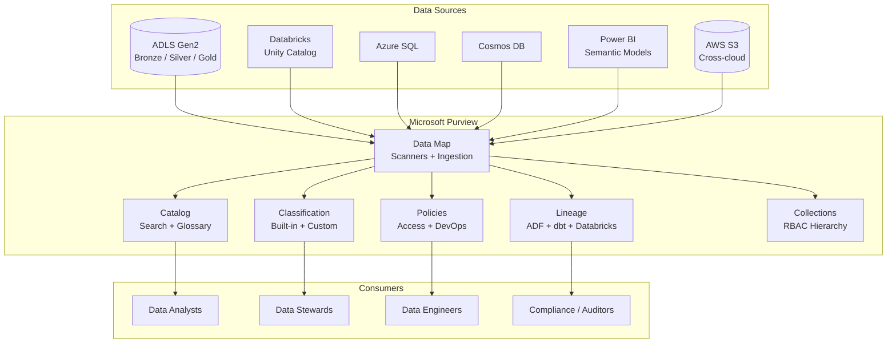
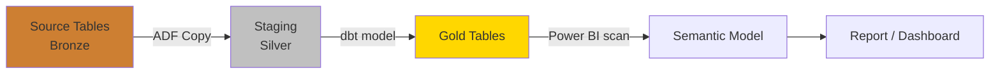
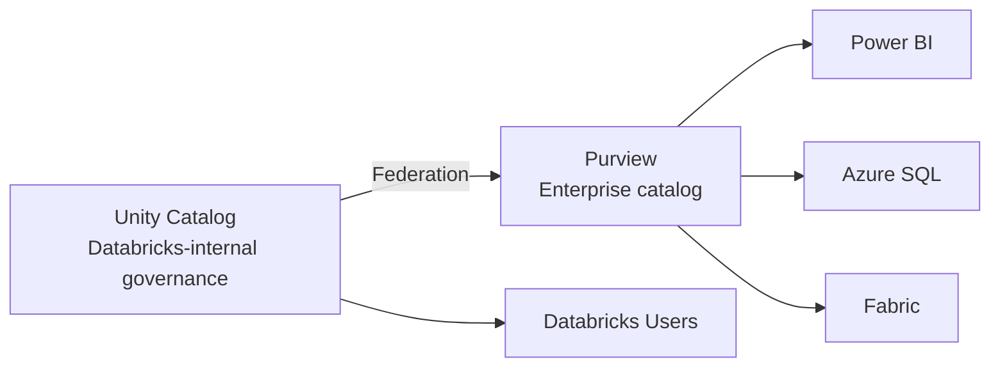

# Microsoft Purview Guide

> Purview is the data governance hub for CSA-in-a-Box — providing data
> cataloging, lineage, classification, and access policies across the
> entire medallion architecture.
> See [ADR-0006](../adr/0006-purview-over-atlas.md) for the decision rationale.

---

## Why Purview

Microsoft Purview was chosen over Apache Atlas, DataHub, and Collibra because
it is Gov-GA with FedRAMP High inheritance, integrates natively with Microsoft
Information Protection (MIP) sensitivity labels, and provides built-in scanners
for every service in the CSA stack (ADLS, Databricks, Synapse, SQL Server,
Power BI). Purview's Entra ID RBAC fits the platform's existing persona model,
and its metadata maps forward into Fabric Purview when tenants migrate.

---

## Architecture Overview



---

## Setup

### Account Creation (Bicep)

```bicep
resource purviewAccount 'Microsoft.Purview/accounts@2021-12-01' = {
  name: 'pview-csa-${environment}-${location}'
  location: location
  identity: {
    type: 'SystemAssigned'
  }
  properties: {
    publicNetworkAccess: 'Disabled'
    managedResourceGroupName: 'rg-pview-managed-${environment}'
  }
}
```

### Managed Identity Permissions

Purview's system-assigned managed identity needs read access to every source
it scans. Grant these roles before configuring scans.

| Source                   | Required role                              | Scope                            |
| ------------------------ | ------------------------------------------ | -------------------------------- |
| ADLS Gen2                | `Storage Blob Data Reader`                 | Storage account                  |
| Azure SQL                | `db_datareader` (SQL role)                 | Database                         |
| Databricks Unity Catalog | `Account Admin` or `Metastore Admin`       | Databricks account               |
| Cosmos DB                | `Cosmos DB Account Reader`                 | Cosmos account                   |
| Power BI                 | `Fabric Administrator` or workspace member | Tenant / workspace               |
| Key Vault                | `Key Vault Secrets User`                   | Key Vault (for scan credentials) |

```bash
# Grant ADLS read access to Purview managed identity
PURVIEW_MI=$(az purview account show \
  --name "pview-csa-dev-eastus" \
  --resource-group "rg-dmlz-dev" \
  --query "identity.principalId" -o tsv)

az role assignment create \
  --assignee "$PURVIEW_MI" \
  --role "Storage Blob Data Reader" \
  --scope "/subscriptions/{sub}/resourceGroups/{rg}/providers/Microsoft.Storage/storageAccounts/{sa}"
```

---

## Data Map

### Registering Sources

Register each data source in Purview's Data Map before scanning.


### Source Registration Examples

| Source         | Registration type            | Key configuration                          |
| -------------- | ---------------------------- | ------------------------------------------ |
| **ADLS Gen2**  | Azure Data Lake Storage Gen2 | Storage account URL; collection assignment |
| **Databricks** | Azure Databricks             | Workspace URL; Unity Catalog metastore     |
| **Azure SQL**  | Azure SQL Database           | Server FQDN; database name                 |
| **Cosmos DB**  | Azure Cosmos DB              | Account URL; database(s) to scan           |
| **Power BI**   | Power BI                     | Tenant-wide or specific workspaces         |
| **AWS S3**     | Amazon S3                    | Bucket ARN; cross-account IAM role         |

### Scan Rule Sets

Scan rule sets determine which file types and classification rules to apply.
CSA-in-a-Box uses a custom rule set that includes Delta Lake metadata and
government-specific classifiers.

```json
{
    "name": "csa-scan-rules",
    "kind": "AzureStorage",
    "scanRulesetType": "Custom",
    "properties": {
        "fileExtensions": [".parquet", ".delta", ".json", ".csv", ".avro"],
        "classificationRuleNames": [
            "MICROSOFT.GOVERNMENT.US_SOCIAL_SECURITY_NUMBER",
            "MICROSOFT.FINANCIAL.CREDIT_CARD_NUMBER",
            "CSA.GOVERNMENT.CUI_MARKING",
            "CSA.GOVERNMENT.FOUO_MARKING"
        ]
    }
}
```

---

## Catalog

### Business Glossary

The glossary provides a controlled vocabulary for business terms. CSA-in-a-Box
organizes glossary terms by domain.

| Term hierarchy   | Example                                       |
| ---------------- | --------------------------------------------- |
| **Category**     | Finance, Healthcare, Defense                  |
| **Term**         | Revenue, Patient Record, Classification Level |
| **Synonym**      | Revenue = Sales, Turnover                     |
| **Related term** | Revenue is related to Cost of Goods Sold      |

### Collections Hierarchy

Collections control both organization and RBAC. CSA-in-a-Box uses three levels.

```
Root Collection (CSA-in-a-Box)
├── Production
│   ├── Finance
│   ├── Healthcare
│   └── Defense
├── Staging
│   ├── Finance
│   └── Healthcare
└── Development
    └── Sandbox
```

!!! info "RBAC Inheritance"
Permissions flow downward. A user with `Data Reader` on `Production` can
browse assets in `Finance`, `Healthcare`, and `Defense` unless explicitly
denied at the child level.

### Search

Purview search supports faceted queries across the entire data estate.

```
# Find all Delta tables in the Gold layer with PII classifications
qualifiedName:*gold* AND classification:*SSN*
```

---

## Lineage

### Automatic Lineage Sources

| Source                 | Lineage mechanism                       | Configuration                                       |
| ---------------------- | --------------------------------------- | --------------------------------------------------- |
| **Azure Data Factory** | Built-in (automatic)                    | ADF linked to Purview; no extra setup               |
| **Databricks**         | Unity Catalog + OpenLineage             | Enable Purview connector in workspace settings      |
| **Synapse Analytics**  | Built-in (automatic)                    | Synapse workspace linked to Purview                 |
| **dbt**                | OpenLineage events via Purview REST API | `dbt-purview` integration or custom manifest parser |
| **Power BI**           | Built-in scan                           | Power BI tenant connected to Purview                |

### dbt Lineage Integration

```python
"""Push dbt lineage to Purview via the Atlas API endpoint."""
import json
from azure.purview.catalog import PurviewCatalogClient
from azure.identity import DefaultAzureCredential

credential = DefaultAzureCredential()
client = PurviewCatalogClient(
    endpoint="https://pview-csa-dev-eastus.purview.azure.com",
    credential=credential,
)

# Parse dbt manifest.json for model relationships
with open("target/manifest.json") as f:
    manifest = json.load(f)

for node_id, node in manifest["nodes"].items():
    if node["resource_type"] == "model":
        # Create lineage entity linking upstream sources to this model
        entity = {
            "typeName": "dbt_model",
            "attributes": {
                "qualifiedName": f"dbt://{node['database']}.{node['schema']}.{node['name']}",
                "name": node["name"],
                "description": node.get("description", ""),
            },
        }
        client.entity.create_or_update(entity={"entity": entity})
```



---

## Classification

### Built-in Classifiers

Purview ships with 200+ system classifiers. The most relevant for government
workloads:

| Classifier                | Detects                    | Sensitivity         |
| ------------------------- | -------------------------- | ------------------- |
| US Social Security Number | SSN patterns (XXX-XX-XXXX) | Confidential        |
| Credit Card Number        | Visa, MC, Amex patterns    | Confidential        |
| US Passport Number        | Passport format            | Highly Confidential |
| IP Address                | IPv4 / IPv6 addresses      | Internal            |
| Email Address             | RFC 5322 patterns          | Internal            |

### Custom Classifiers for Government Data

```json
{
    "name": "CSA.GOVERNMENT.CUI_MARKING",
    "kind": "Custom",
    "properties": {
        "classificationName": "CUI Marking",
        "description": "Controlled Unclassified Information marking per NIST SP 800-171",
        "pattern": {
            "kind": "Regex",
            "pattern": "(?i)(CUI|CONTROLLED UNCLASSIFIED|NOFORN|FOUO|LAW ENFORCEMENT SENSITIVE)"
        },
        "minimumPercentageMatch": 60
    }
}
```

| Custom classifier             | Pattern target                        | Regulation          |
| ----------------------------- | ------------------------------------- | ------------------- |
| `CSA.GOVERNMENT.CUI_MARKING`  | CUI, CONTROLLED UNCLASSIFIED          | NIST SP 800-171     |
| `CSA.GOVERNMENT.FOUO_MARKING` | FOR OFFICIAL USE ONLY                 | DoD 5200.01         |
| `CSA.GOVERNMENT.ITAR_MARKING` | ITAR, USML, defense articles          | 22 CFR 120-130      |
| `CSA.GOVERNMENT.HIPAA_PHI`    | Protected Health Information patterns | HIPAA Security Rule |

### Sensitivity Labels

Purview integrates with Microsoft Information Protection to apply sensitivity
labels that follow data across the estate.

```
Label hierarchy:
├── Public
├── Internal
├── Confidential
│   ├── Confidential - PII
│   └── Confidential - Financial
└── Highly Confidential
    ├── Highly Confidential - CUI
    └── Highly Confidential - ITAR
```

!!! warning "Label Propagation"
Sensitivity labels applied in Purview propagate to Power BI datasets
automatically. A `Highly Confidential` label on a Gold table will appear
on any Power BI semantic model built on that table.

---

## Data Access Policies

### Policy Types

| Policy type             | Purpose                                  | Scope          |
| ----------------------- | ---------------------------------------- | -------------- |
| **Self-service access** | Users request access through the catalog | Per-asset      |
| **DevOps policies**     | Grant diagnostic access to ops teams     | Resource group |
| **Data owner policies** | Data owners grant/deny access            | Collection     |

!!! tip "Self-Service Access"
Enable self-service access policies so analysts can request access to
datasets through the Purview portal. Data stewards approve or deny
requests, creating an auditable access trail for compliance.

---

## Purview + Unity Catalog

CSA-in-a-Box uses a **dual governance** pattern: Unity Catalog governs data
inside the Databricks workspace (fine-grained ACLs, row/column filters),
while Purview provides the enterprise-wide catalog that non-Databricks
consumers (SQL, Power BI, Fabric) use.



!!! info "No Duplication"
Unity Catalog metadata is **federated** into Purview, not duplicated.
Purview scans the Unity Catalog metastore and creates linked assets —
the source of truth for table definitions remains Unity Catalog.

---

## Purview + Fabric

When tenants migrate to Fabric (ADR-0010), Purview metadata moves forward:

- **Fabric Purview** is a superset of standalone Purview
- OneLake scanning replaces ADLS scanning
- Direct Lake semantic models appear automatically in the catalog
- Sensitivity labels propagate through OneLake to Fabric workloads

---

## Monitoring

### Key Metrics

| Metric                      | What to watch                          | Alert condition                   |
| --------------------------- | -------------------------------------- | --------------------------------- |
| **Scan success rate**       | Percentage of successful scans         | < 95% over 7 days                 |
| **Asset count growth**      | New assets discovered per scan         | Sudden drop (source disconnected) |
| **Classification coverage** | % of assets with classifications       | < 80% for sensitive collections   |
| **Glossary term adoption**  | Assets linked to glossary terms        | < 50% for Gold layer              |
| **Lineage completeness**    | % of Gold tables with upstream lineage | < 90%                             |

---

## Cost Optimization

| Cost driver                | Optimization                                              | Impact                 |
| -------------------------- | --------------------------------------------------------- | ---------------------- |
| **Scanner capacity units** | Scope scans to specific collections, not tenant-wide      | 30-60% reduction       |
| **Scan frequency**         | Daily for production, weekly for dev/staging              | 50% reduction          |
| **Classification rules**   | Disable irrelevant system classifiers                     | Faster scans           |
| **Data Map population**    | Register only governed sources, not every storage account | Fewer assets to manage |

!!! tip "Scanner Scope"
ADR-0006 warns that if scanner cost exceeds 10% of storage cost, revisit
scanner scope and cadence — not the catalog choice. Scope scans at the
domain/collection level rather than tenant-wide.

---

## Anti-Patterns

!!! failure "Don't: Scan everything at the tenant level"
Tenant-wide scans discover assets you do not govern, inflating costs and
cluttering the catalog. Register specific sources and scope scans to
relevant collections.

!!! failure "Don't: Skip the business glossary"
Without glossary terms, the catalog is a technical inventory — not a
governance tool. Invest in glossary terms early; they compound in value
as adoption grows.

!!! failure "Don't: Rely solely on automatic classification"
System classifiers catch common patterns (SSN, credit cards) but miss
domain-specific sensitive data. Create custom classifiers for CUI, FOUO,
ITAR, and any organization-specific data categories.

!!! success "Do: Federate Unity Catalog into Purview"
Maintain one source of truth per domain. Databricks teams use Unity
Catalog; everyone else discovers the same data through Purview.

!!! success "Do: Enable sensitivity label propagation"
Labels applied in Purview should flow to Power BI and downstream
consumers automatically. This is the primary mechanism for demonstrating
data classification compliance.

---

## Checklist

- [ ] Purview account deployed via DMLZ Bicep templates
- [ ] Managed identity granted read access to all governed sources
- [ ] Collection hierarchy created (Organization > Environment > Domain)
- [ ] Sources registered: ADLS, Databricks, SQL, Cosmos DB, Power BI
- [ ] Custom classifiers created for CUI, FOUO, ITAR
- [ ] Scan rule sets configured with Delta Lake file types
- [ ] Scan schedules configured (daily production, weekly dev)
- [ ] Business glossary seeded with initial domain terms
- [ ] Sensitivity labels configured and propagation enabled
- [ ] dbt lineage integration tested (manifest parser or OpenLineage)
- [ ] Unity Catalog federation verified
- [ ] Self-service access policies enabled
- [ ] Diagnostic settings forwarding to Log Analytics

---

## Related Documentation

- [ADR-0006 — Purview over Atlas](../adr/0006-purview-over-atlas.md)
- [ADR-0010 — Fabric Strategic Target](../adr/0010-fabric-strategic-target.md)
- [Governance — Purview Setup](../governance/PURVIEW_SETUP.md)
- [Governance — Data Lineage](../governance/DATA_LINEAGE.md)
- [Governance — Data Cataloging](../governance/DATA_CATALOGING.md)
- [Governance — Data Access](../governance/DATA_ACCESS.md)
- [Best Practices — Data Governance](../best-practices/data-governance.md)
- [Guide — OSS Ecosystem (Atlas alternative)](oss-ecosystem.md)
