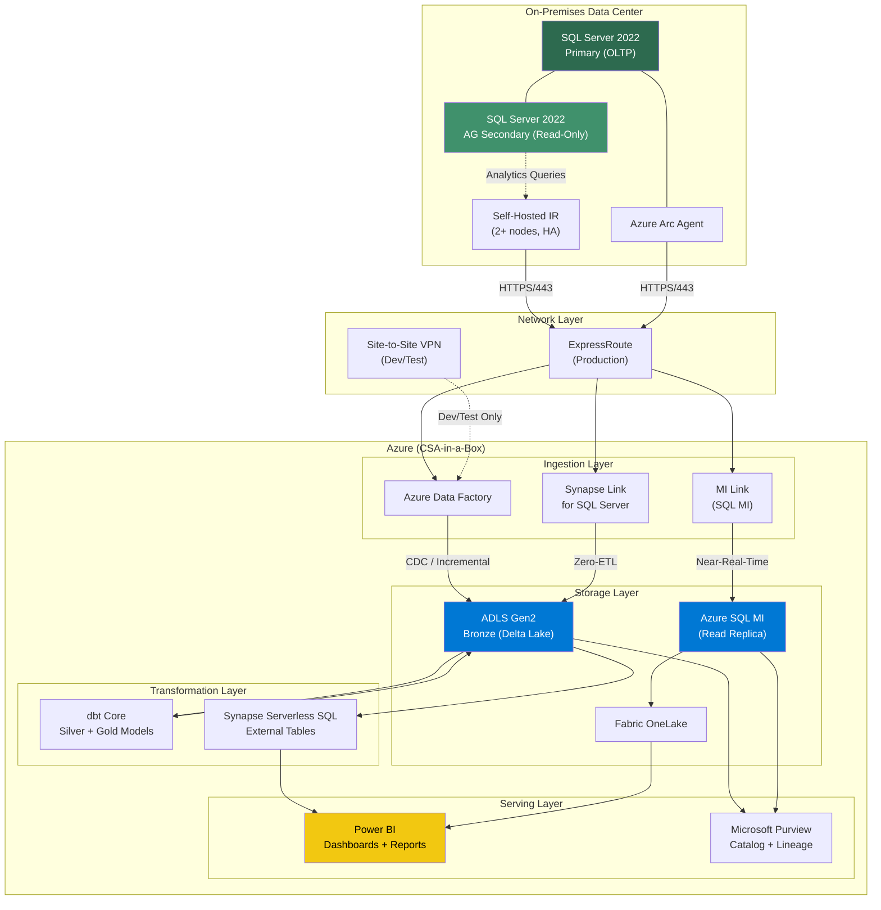
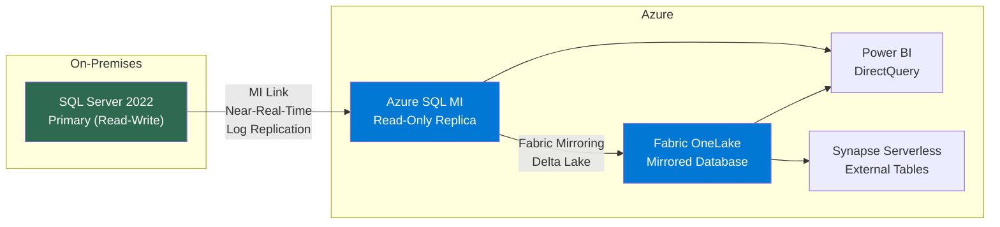
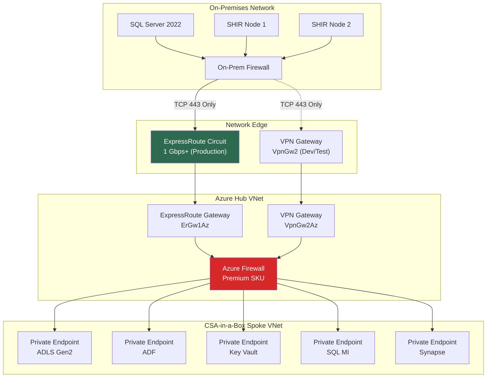
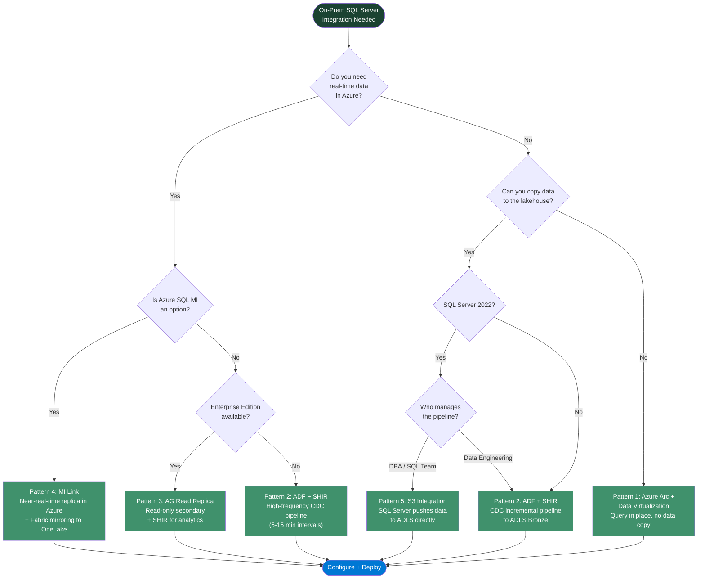

# On-Premises SQL Server Integration

## Overview

Every federal agency, defense contractor, and regulated enterprise has the same conversation at some point: "We need cloud analytics, but we cannot move the database." The reasons vary — FISMA boundary constraints, application coupling, change-control overhead, or simply that the SQL Server instance is so deeply embedded in operations that migration risk outweighs any benefit.

CSA-in-a-Box is designed for exactly this scenario. You do not need to migrate your SQL Server to get value from the platform. Instead, you integrate it — bringing analytical copies, virtual references, or real-time replicas into the Azure analytics stack while the operational database stays on-premises, untouched, under the same controls it has always been under.

This guide covers five integration patterns, from zero-copy virtualization to near-real-time replication. Each pattern has different trade-offs in latency, cost, complexity, and compliance posture. The decision tree at the end will help you pick the right one.

!!! info "SQL Server 2022 Is the Target"
This guide targets SQL Server 2022 (16.x), which introduced significant hybrid features — Synapse Link, S3 object storage integration, contained availability groups, and more. Most patterns also work with SQL Server 2019 and 2016, but several features (especially Synapse Link and S3 integration) require 2022. Version requirements are noted in each section.

!!! tip "Related Guides" - [Self-Hosted Integration Runtime](../SELF_HOSTED_IR.md) — deploying and operating the SHIR that bridges on-prem to Azure - [Azure Data Factory Setup](../ADF_SETUP.md) — ADF pipeline artifacts and CI/CD - [Multi-Cloud Data Virtualization](../use-cases/multi-cloud-data-virtualization.md) — broader virtualization patterns across clouds - [Performance Tuning](../best-practices/performance-tuning.md) — optimizing pipeline and query performance

---

## Architecture

The following diagram shows how on-premises SQL Server connects to the CSA-in-a-Box analytics platform through multiple integration paths.



---

## SQL Server 2022 Feature Highlights for Hybrid

SQL Server 2022 is the most Azure-connected release in SQL Server history. These features are directly relevant to hybrid integration with CSA-in-a-Box.

| Feature                                         | What It Does                                                                                        | CSA-in-a-Box Relevance                                    |
| ----------------------------------------------- | --------------------------------------------------------------------------------------------------- | --------------------------------------------------------- |
| **Azure Synapse Link for SQL Server**           | Zero-ETL replication of operational data to Synapse analytical store                                | Eliminates ADF pipelines for simple analytical scenarios  |
| **Managed Instance Link**                       | Near-real-time replication to Azure SQL MI (RPO ~seconds)                                           | Full read replica in Azure for BI and analytics           |
| **S3 Object Storage Integration**               | BACKUP/RESTORE, BULK INSERT, OPENROWSET against S3-compatible endpoints                             | Direct data exchange between SQL Server and ADLS          |
| **Azure Arc-enabled SQL Server**                | Unified management, inventory, and governance from Azure portal                                     | Single pane of glass for hybrid SQL estate                |
| **Ledger Tables**                               | Immutable, cryptographically verifiable audit trail                                                 | Compliance and tamper-evidence for regulated data         |
| **Query Store Improvements**                    | Query Store hints, CE feedback, plan forcing enhancements                                           | Better performance without application changes            |
| **Intelligent Query Processing (IQP)**          | DOP feedback, CE feedback, optimized plan forcing                                                   | Automatic query optimization for analytical workloads     |
| **Parameter Sensitive Plan (PSP) Optimization** | Multiple plans for a single parameterized query                                                     | Eliminates parameter sniffing issues in reporting queries |
| **Contained Availability Groups**               | AG-level system databases (master, msdb, logins)                                                    | Simplified AG management, easier failover for analytics   |
| **T-SQL Enhancements**                          | `GREATEST`, `LEAST`, `DATETRUNC`, `GENERATE_SERIES`, `STRING_SPLIT` with ordinal, JSON improvements | Cleaner transformation logic in source queries            |

!!! note "Version Compatibility Matrix"
| Pattern | Minimum SQL Server Version |
|---|---|
| Azure Arc Registration | SQL Server 2012+ |
| Self-Hosted IR + ADF | SQL Server 2008+ |
| AG Read Replicas | SQL Server 2012+ (Enterprise) |
| MI Link | SQL Server 2016+ |
| Synapse Link for SQL Server | SQL Server 2022 |
| S3 Object Storage Integration | SQL Server 2022 |

---

## Pattern 1: Azure Arc + Data Virtualization (Query in Place)

**When to use:** Low-frequency analytics, compliance constraints that prevent copying data outside the security boundary, or initial integration before committing to a replication pattern.

**Latency:** Real-time (queries execute against live data)
**Data Movement:** None (queries travel to the data, not the other way around)
**Complexity:** Low

### How It Works

Azure Arc extends Azure management to your on-premises SQL Server. Once registered, the instance appears in the Azure portal alongside your cloud resources — same RBAC, same policy, same Purview catalog. You then create external tables in Synapse Serverless SQL that reference the on-prem data through a Self-Hosted Integration Runtime.

### Step 1: Register SQL Server with Azure Arc

```bash
# Download and install the Azure Connected Machine agent on the SQL Server host
# (Run on the SQL Server machine as Administrator)

# Set variables
RESOURCE_GROUP="csa-inabox-rg"
LOCATION="eastus"
SUBSCRIPTION_ID="<your-subscription-id>"
TENANT_ID="<your-tenant-id>"

# Install the Arc agent (Windows)
# Download from: https://aka.ms/AzureConnectedMachineAgent
msiexec /i AzureConnectedMachineAgent.msi /l*v installationlog.txt /qn

# Connect to Azure Arc
& "$env:ProgramW6432\AzureConnectedMachineAgent\azcmagent.exe" connect `
    --resource-group $RESOURCE_GROUP `
    --location $LOCATION `
    --subscription-id $SUBSCRIPTION_ID `
    --tenant-id $TENANT_ID

# Verify connection
& "$env:ProgramW6432\AzureConnectedMachineAgent\azcmagent.exe" show
```

```bash
# Register the SQL Server extension on the Arc-enabled server (from Azure CLI)
az connectedmachine extension create \
    --machine-name "sql-server-prod-01" \
    --resource-group "$RESOURCE_GROUP" \
    --name "WindowsAgent.SqlServer" \
    --type "WindowsAgent.SqlServer" \
    --publisher "Microsoft.AzureData" \
    --location "$LOCATION" \
    --settings '{
        "SqlManagement": { "IsEnabled": true },
        "LicenseType": "Paid"
    }'

# Verify Arc-enabled SQL Server registration
az sql server-arc show \
    --name "sql-server-prod-01" \
    --resource-group "$RESOURCE_GROUP"
```

### Step 2: Configure Purview Scanning

Once the SQL Server is Arc-registered, Microsoft Purview can scan it for metadata, classifications, and lineage.

```bash
# Register the Arc-enabled SQL Server as a Purview data source
# (Purview portal → Data Map → Register → SQL Server on Azure Arc)

# Using Purview REST API:
az rest --method PUT \
    --uri "https://<purview-account>.purview.azure.com/scan/datasources/sql-onprem-prod?api-version=2022-07-01-preview" \
    --body '{
        "kind": "AzureArcEnabledSqlServer",
        "properties": {
            "serverEndpoint": "sql-server-prod-01.contoso.local",
            "resourceGroup": "csa-inabox-rg",
            "subscriptionId": "<subscription-id>",
            "location": "eastus",
            "collection": {
                "referenceName": "on-premises-sources",
                "type": "CollectionReference"
            }
        }
    }'
```

### Step 3: Create External Tables in Synapse Serverless

```sql
-- In Synapse Serverless SQL pool
-- Create a master key for credential encryption
CREATE MASTER KEY ENCRYPTION BY PASSWORD = '<strong-password>';

-- Create a credential for the Self-Hosted IR connection
CREATE DATABASE SCOPED CREDENTIAL SqlServerOnPremCred
WITH IDENTITY = 'sql-analytics-reader',
     SECRET = '<password>';

-- Create an external data source pointing to the on-prem SQL Server
-- (Requires Self-Hosted IR configured in ADF/Synapse linked service)
CREATE EXTERNAL DATA SOURCE SqlServerOnPrem
WITH (
    LOCATION = 'sqlserver://sql-server-prod-01.contoso.local',
    CREDENTIAL = SqlServerOnPremCred
);

-- Query on-prem data directly (no copy)
SELECT
    c.CustomerID,
    c.CustomerName,
    SUM(o.TotalAmount) AS TotalRevenue,
    COUNT(o.OrderID) AS OrderCount
FROM
    EXTERNAL TABLE SqlServerOnPrem.dbo.Customers AS c
    JOIN EXTERNAL TABLE SqlServerOnPrem.dbo.Orders AS o
        ON c.CustomerID = o.CustomerID
WHERE
    o.OrderDate >= DATEADD(month, -3, GETDATE())
GROUP BY
    c.CustomerID, c.CustomerName
ORDER BY
    TotalRevenue DESC;
```

!!! warning "Performance Considerations"
Data virtualization queries execute against the remote SQL Server in real time. Large analytical queries (full table scans, complex aggregations) will impact the on-prem instance. Use this pattern for low-frequency, small-result-set queries — not for building dashboards that 50 users refresh every 5 minutes. For heavier workloads, use Pattern 2 or Pattern 3.

---

## Pattern 2: Self-Hosted IR + ADF (Incremental Copy)

**When to use:** Regular analytical refresh (hourly, daily), medallion architecture pattern, or when you need the data materialized in the lakehouse for dbt transformations.

**Latency:** Minutes to hours (depends on pipeline schedule)
**Data Movement:** Incremental (only changed rows)
**Complexity:** Medium

This is the most common integration pattern for CSA-in-a-Box. Data flows from SQL Server through a Self-Hosted Integration Runtime into ADLS Bronze as Delta Lake tables, then dbt transforms it through Silver and Gold layers.

### Prerequisites

- [x] Self-Hosted IR deployed (see [SHIR guide](../SELF_HOSTED_IR.md))
- [x] CDC or Change Tracking enabled on source tables
- [x] ADF instance with linked services configured
- [x] ADLS Gen2 with Bronze container

### Step 1: Enable CDC on Source Tables

```sql
-- On the on-premises SQL Server (run as sysadmin)

-- Enable CDC at the database level
USE [OperationalDB];
GO
EXEC sys.sp_cdc_enable_db;
GO

-- Enable CDC on specific tables
-- Only enable on tables you actually need for analytics
EXEC sys.sp_cdc_enable_table
    @source_schema = N'dbo',
    @source_name   = N'Orders',
    @role_name     = N'cdc_reader',
    @supports_net_changes = 1;
GO

EXEC sys.sp_cdc_enable_table
    @source_schema = N'dbo',
    @source_name   = N'Customers',
    @role_name     = N'cdc_reader',
    @supports_net_changes = 1;
GO

EXEC sys.sp_cdc_enable_table
    @source_schema = N'dbo',
    @source_name   = N'Products',
    @role_name     = N'cdc_reader',
    @supports_net_changes = 1;
GO

-- Verify CDC is enabled
SELECT name, is_cdc_enabled
FROM sys.databases
WHERE name = 'OperationalDB';

SELECT s.name AS schema_name, t.name AS table_name, t.is_tracked_by_cdc
FROM sys.tables t
JOIN sys.schemas s ON t.schema_id = s.schema_id
WHERE t.is_tracked_by_cdc = 1;
```

### Step 2: Create the CDC Reader Query

```sql
-- Query to extract net changes since the last LSN
-- This is what the ADF pipeline executes via the Self-Hosted IR

DECLARE @from_lsn binary(10), @to_lsn binary(10);

-- @from_lsn is passed as a pipeline parameter (last successful LSN)
SET @from_lsn = @LastProcessedLSN;
SET @to_lsn   = sys.fn_cdc_get_max_lsn();

-- Extract net changes (INSERT, UPDATE, DELETE)
SELECT
    o.__$operation AS cdc_operation,
    -- 1 = DELETE, 2 = INSERT, 4 = UPDATE (after image)
    o.OrderID,
    o.CustomerID,
    o.OrderDate,
    o.TotalAmount,
    o.Status,
    o.ModifiedDate,
    @to_lsn AS _cdc_lsn,
    SYSUTCDATETIME() AS _extracted_at
FROM
    cdc.fn_cdc_get_net_changes_dbo_Orders(
        @from_lsn,
        @to_lsn,
        N'all with merge'
    ) AS o;
```

### Step 3: ADF Pipeline Definition

```json
{
    "name": "pl_ingest_sqlserver_cdc_to_bronze",
    "properties": {
        "description": "Incremental CDC load from on-prem SQL Server to ADLS Bronze (Delta)",
        "activities": [
            {
                "name": "Lookup_LastLSN",
                "type": "Lookup",
                "typeProperties": {
                    "source": {
                        "type": "AzureSqlSource",
                        "sqlReaderQuery": "SELECT LastLSN FROM dbo.WatermarkTable WHERE TableName = '@{pipeline().parameters.TableName}'"
                    },
                    "dataset": {
                        "referenceName": "ds_watermark_table",
                        "type": "DatasetReference"
                    }
                }
            },
            {
                "name": "Lookup_CurrentLSN",
                "type": "Lookup",
                "dependsOn": [
                    {
                        "activity": "Lookup_LastLSN",
                        "dependencyConditions": ["Succeeded"]
                    }
                ],
                "typeProperties": {
                    "source": {
                        "type": "SqlServerSource",
                        "sqlReaderQuery": "SELECT sys.fn_cdc_get_max_lsn() AS CurrentLSN"
                    },
                    "dataset": {
                        "referenceName": "ds_sqlserver_onprem",
                        "type": "DatasetReference"
                    },
                    "linkedServiceName": {
                        "referenceName": "ls_sqlserver_onprem_shir",
                        "type": "LinkedServiceReference"
                    }
                }
            },
            {
                "name": "Copy_CDC_Changes",
                "type": "Copy",
                "dependsOn": [
                    {
                        "activity": "Lookup_CurrentLSN",
                        "dependencyConditions": ["Succeeded"]
                    }
                ],
                "typeProperties": {
                    "source": {
                        "type": "SqlServerSource",
                        "sqlReaderStoredProcedureName": "dbo.usp_ExtractCDCChanges",
                        "storedProcedureParameters": {
                            "FromLSN": {
                                "value": "@activity('Lookup_LastLSN').output.firstRow.LastLSN"
                            },
                            "ToLSN": {
                                "value": "@activity('Lookup_CurrentLSN').output.firstRow.CurrentLSN"
                            },
                            "TableName": {
                                "value": "@pipeline().parameters.TableName"
                            }
                        }
                    },
                    "sink": {
                        "type": "ParquetSink",
                        "storeSettings": {
                            "type": "AzureBlobFSWriteSettings"
                        },
                        "formatSettings": {
                            "type": "ParquetWriteSettings"
                        }
                    }
                },
                "inputs": [
                    {
                        "referenceName": "ds_sqlserver_onprem",
                        "type": "DatasetReference"
                    }
                ],
                "outputs": [
                    {
                        "referenceName": "ds_adls_bronze_delta",
                        "type": "DatasetReference",
                        "parameters": {
                            "Container": "bronze",
                            "FolderPath": "@concat('sql_server/', pipeline().parameters.TableName, '/', formatDateTime(utcNow(), 'yyyy/MM/dd'))"
                        }
                    }
                ]
            },
            {
                "name": "Update_Watermark",
                "type": "SqlServerStoredProcedure",
                "dependsOn": [
                    {
                        "activity": "Copy_CDC_Changes",
                        "dependencyConditions": ["Succeeded"]
                    }
                ],
                "typeProperties": {
                    "storedProcedureName": "dbo.usp_UpdateWatermark",
                    "storedProcedureParameters": {
                        "TableName": {
                            "value": "@pipeline().parameters.TableName"
                        },
                        "LastLSN": {
                            "value": "@activity('Lookup_CurrentLSN').output.firstRow.CurrentLSN"
                        }
                    }
                }
            }
        ],
        "parameters": {
            "TableName": { "type": "string" }
        }
    }
}
```

### Step 4: Watermark Pattern (for Tables Without CDC)

Not every table supports CDC. For tables where CDC is not enabled (or not feasible), use a watermark column.

```sql
-- Watermark table in Azure SQL (or ADLS metadata)
CREATE TABLE dbo.WatermarkTable (
    TableName       NVARCHAR(128) PRIMARY KEY,
    LastLSN         BINARY(10)     NULL,
    LastModifiedDate DATETIME2      NULL,
    LastRowVersion   BIGINT         NULL,
    LastRunTime     DATETIME2      NOT NULL DEFAULT SYSUTCDATETIME()
);

-- Insert initial watermarks
INSERT INTO dbo.WatermarkTable (TableName, LastModifiedDate)
VALUES
    ('Products', '1900-01-01'),
    ('Inventory', '1900-01-01');
```

```sql
-- ADF source query using ModifiedDate watermark
SELECT *
FROM dbo.Products
WHERE ModifiedDate > '@{activity('Lookup_LastWatermark').output.firstRow.LastModifiedDate}'
  AND ModifiedDate <= '@{activity('Lookup_CurrentWatermark').output.firstRow.CurrentMax}';
```

### Step 5: dbt Incremental Model Consuming CDC Data

```sql
-- models/silver/stg_orders.sql
{{
    config(
        materialized='incremental',
        unique_key='order_id',
        incremental_strategy='merge',
        file_format='delta',
        on_schema_change='sync_all_columns'
    )
}}

WITH source AS (
    SELECT
        OrderID         AS order_id,
        CustomerID      AS customer_id,
        OrderDate       AS order_date,
        TotalAmount     AS total_amount,
        Status          AS order_status,
        ModifiedDate    AS modified_date,
        cdc_operation,
        _cdc_lsn,
        _extracted_at
    FROM {{ source('bronze_sql_server', 'orders') }}
    
    WHERE _extracted_at > (SELECT MAX(_extracted_at) FROM {{ this }})
    
),

-- Apply CDC operations: filter out deletes, keep latest version
deduplicated AS (
    SELECT *,
        ROW_NUMBER() OVER (
            PARTITION BY order_id
            ORDER BY _cdc_lsn DESC, _extracted_at DESC
        ) AS rn
    FROM source
)

SELECT
    order_id,
    customer_id,
    order_date,
    total_amount,
    order_status,
    modified_date,
    _extracted_at,
    CASE WHEN cdc_operation = 1 THEN TRUE ELSE FALSE END AS is_deleted
FROM deduplicated
WHERE rn = 1
```

---

## Pattern 3: SQL Server Read Replicas + Analytics

**When to use:** Near-real-time analytics without impacting the OLTP primary, or when you need to offload heavy reporting queries from production.

**Latency:** Seconds (synchronous commit) to minutes (asynchronous commit)
**Data Movement:** Automatic (AG replication)
**Complexity:** Medium-High (requires SQL Server Enterprise Edition)

### How It Works

Always On Availability Groups provide a read-only secondary replica that receives real-time transaction log updates from the primary. Analytics tools (ADF, Power BI, dbt) connect to the secondary, keeping the primary free for OLTP workloads.

### Step 1: Configure Always On Availability Group

```sql
-- On the PRIMARY replica
-- (Assumes Windows Server Failover Clustering is already configured)

-- Enable Always On at the instance level (requires restart)
-- Run in SQL Server Configuration Manager or via PowerShell:
-- Enable-SqlAlwaysOn -ServerInstance "SQL-PRIMARY" -Force

-- Create the Availability Group with a read-only secondary
CREATE AVAILABILITY GROUP [AG_Analytics]
WITH (
    AUTOMATED_BACKUP_PREFERENCE = SECONDARY,
    DB_FAILOVER = ON,
    CLUSTER_TYPE = WSFC
)
FOR DATABASE [OperationalDB]
REPLICA ON
    N'SQL-PRIMARY' WITH (
        ENDPOINT_URL = N'TCP://sql-primary.contoso.local:5022',
        FAILOVER_MODE = AUTOMATIC,
        AVAILABILITY_MODE = SYNCHRONOUS_COMMIT,
        SECONDARY_ROLE (
            ALLOW_CONNECTIONS = NO
        )
    ),
    N'SQL-SECONDARY' WITH (
        ENDPOINT_URL = N'TCP://sql-secondary.contoso.local:5022',
        FAILOVER_MODE = MANUAL,
        AVAILABILITY_MODE = ASYNCHRONOUS_COMMIT,
        SECONDARY_ROLE (
            ALLOW_CONNECTIONS = READ_ONLY,
            READ_ONLY_ROUTING_URL = N'TCP://sql-secondary.contoso.local:1433'
        )
    );

-- Configure read-only routing
ALTER AVAILABILITY GROUP [AG_Analytics]
MODIFY REPLICA ON N'SQL-PRIMARY' WITH (
    PRIMARY_ROLE (
        READ_ONLY_ROUTING_LIST = (N'SQL-SECONDARY', N'SQL-PRIMARY')
    )
);

-- Create the listener
ALTER AVAILABILITY GROUP [AG_Analytics]
ADD LISTENER N'ag-analytics-listener' (
    WITH IP (
        (N'10.0.1.100', N'255.255.255.0')
    ),
    PORT = 1433
);
```

### Step 2: ADF Linked Service Pointing to Read-Only Replica

```json
{
    "name": "ls_sqlserver_readonly_replica",
    "properties": {
        "type": "SqlServer",
        "typeProperties": {
            "connectionString": {
                "type": "SecureString",
                "value": "Server=ag-analytics-listener.contoso.local;Database=OperationalDB;ApplicationIntent=ReadOnly;Encrypt=True;TrustServerCertificate=False;"
            },
            "userName": "adf-analytics-reader",
            "password": {
                "type": "AzureKeyVaultSecret",
                "store": {
                    "referenceName": "ls_keyvault",
                    "type": "LinkedServiceReference"
                },
                "secretName": "sql-analytics-reader-password"
            }
        },
        "connectVia": {
            "referenceName": "SelfHostedIR",
            "type": "IntegrationRuntimeReference"
        }
    }
}
```

!!! tip "ApplicationIntent=ReadOnly"
The `ApplicationIntent=ReadOnly` connection string parameter tells the AG listener to route the connection to the secondary replica. This is the key setting that offloads analytics from the primary. Without it, connections go to the primary.

### Log Shipping Alternative (Simpler, No Enterprise Required)

For smaller deployments where Enterprise Edition licensing is not available, log shipping provides a simpler (but less current) alternative.

```sql
-- On the PRIMARY server: configure log backup job
BACKUP LOG [OperationalDB]
TO DISK = N'\\fileshare\logship\OperationalDB_log.trn'
WITH NOFORMAT, NOINIT, COMPRESSION;
-- Schedule this every 5-15 minutes via SQL Agent

-- On the SECONDARY server: restore with STANDBY (allows read access)
RESTORE LOG [OperationalDB]
FROM DISK = N'\\fileshare\logship\OperationalDB_log.trn'
WITH STANDBY = N'D:\Standby\OperationalDB_undo.ldf';
-- Users are disconnected during restore, then can read again
```

!!! warning "Log Shipping Limitations"
Log shipping with STANDBY mode disconnects all users during each restore cycle (typically every 5-15 minutes). This is acceptable for batch analytics but not for interactive dashboards. For interactive workloads, use AG read replicas (Enterprise) or MI Link (Pattern 4).

---

## Pattern 4: Database Mirroring to Azure SQL MI

**When to use:** You need a full read replica in Azure for analytics and BI, with near-real-time data currency and no SHIR dependency for query execution.

**Latency:** Seconds (RPO ~seconds for near-real-time replication)
**Data Movement:** Continuous (log-based replication to Azure SQL MI)
**Complexity:** Medium

### How It Works

The Managed Instance Link uses distributed availability groups to replicate data from on-premises SQL Server to Azure SQL MI in near-real-time. The MI instance serves as a read-only replica that lives in Azure — no Self-Hosted IR needed for analytics queries because the data is already in Azure.

Once the data is in MI, you can mirror it to Fabric OneLake for lakehouse analytics, or query it directly from Power BI and Synapse.



### Step 1: Prerequisites

| Requirement        | Details                                                                |
| ------------------ | ---------------------------------------------------------------------- |
| SQL Server Version | 2016 SP3, 2019 CU17+, or 2022 CU1+                                     |
| Azure SQL MI       | Business Critical tier (for real-time read replica) or General Purpose |
| Network            | ExpressRoute or S2S VPN with <100ms latency between on-prem and MI     |
| Certificates       | Database mirroring endpoint certificate exchange                       |

### Step 2: Configure MI Link

```sql
-- On the ON-PREMISES SQL Server

-- 1. Create a database mirroring endpoint (if not already present)
CREATE ENDPOINT dbm_endpoint
    STATE = STARTED
    AS TCP (LISTENER_PORT = 5022)
    FOR DATABASE_MIRRORING (ROLE = ALL);
GO

-- 2. Create a certificate for the endpoint
CREATE MASTER KEY ENCRYPTION BY PASSWORD = '<strong-password>';
GO

CREATE CERTIFICATE OnPrem_MI_Link_Cert
    WITH SUBJECT = 'MI Link Certificate - On-Premises',
    EXPIRY_DATE = '2030-12-31';
GO

-- 3. Back up the certificate to exchange with MI
BACKUP CERTIFICATE OnPrem_MI_Link_Cert
    TO FILE = 'C:\Certs\OnPrem_MI_Link_Cert.cer';
GO
```

```bash
# Create the MI Link using Azure CLI
az sql mi link create \
    --resource-group "csa-inabox-rg" \
    --managed-instance "csa-sql-mi" \
    --distributed-availability-group-name "dag-onprem-to-mi" \
    --primary-availability-group-name "AG_OnPrem" \
    --secondary-availability-group-name "AG_MI" \
    --source-endpoint "TCP://sql-server-prod-01.contoso.local:5022" \
    --databases "[{\"databaseName\": \"OperationalDB\"}]" \
    --replication-mode "Async"
```

### Step 3: Enable Fabric Mirroring from MI

Once the MI Link is active and data is flowing, enable Fabric Mirroring to automatically replicate MI tables into OneLake as Delta Lake.

1. Open the **Fabric portal** and create a new **Mirrored Database** item
2. Select **Azure SQL Managed Instance** as the source
3. Authenticate using MI's managed identity or SQL authentication
4. Select the tables to mirror
5. Fabric continuously replicates changes to OneLake in Delta Lake format

```sql
-- In Fabric SQL analytics endpoint (auto-created with mirroring)
-- Query the mirrored data using T-SQL
SELECT
    c.CustomerName,
    COUNT(o.OrderID)   AS order_count,
    SUM(o.TotalAmount) AS total_revenue
FROM dbo.Customers c
JOIN dbo.Orders o ON c.CustomerID = o.CustomerID
GROUP BY c.CustomerName
ORDER BY total_revenue DESC;
```

!!! info "Latency Chain"
The total end-to-end latency is: **SQL Server primary** (seconds) -> **Azure SQL MI** (seconds) -> **Fabric OneLake** (minutes). For most analytical workloads, this sub-5-minute latency is more than sufficient.

---

## Pattern 5: SQL Server 2022 S3 Object Storage Integration

**When to use:** Simple data exchange between SQL Server and the lakehouse, bulk export/import scenarios, or backup to cloud storage. Requires SQL Server 2022.

**Latency:** On-demand (push or pull)
**Data Movement:** Explicit (user-initiated)
**Complexity:** Low

SQL Server 2022 introduced native support for S3-compatible object storage. Since ADLS Gen2 exposes an S3-compatible endpoint, SQL Server can read and write directly to the CSA-in-a-Box lakehouse.

### Step 1: Create S3 Credentials in SQL Server

```sql
-- On SQL Server 2022
-- Create a credential for the ADLS S3-compatible endpoint
CREATE DATABASE SCOPED CREDENTIAL adls_s3_credential
WITH
    IDENTITY = 'S3 Access Key',
    SECRET   = '<storage-account-access-key>';
GO

-- Create an external data source pointing to ADLS via S3 protocol
CREATE EXTERNAL DATA SOURCE adls_bronze
WITH (
    LOCATION = 's3://<storage-account>.blob.core.windows.net/<container>',
    CREDENTIAL = adls_s3_credential
);
GO
```

### Step 2: Read Parquet from ADLS Directly

```sql
-- Query Parquet files in the lakehouse directly from SQL Server 2022
SELECT
    CustomerID,
    CustomerName,
    Region,
    Segment
FROM OPENROWSET(
    BULK '/bronze/sql_server/customers/*.parquet',
    DATA_SOURCE = 'adls_bronze',
    FORMAT = 'PARQUET'
) AS customers;
```

### Step 3: Export Data to ADLS

```sql
-- Bulk export from SQL Server to ADLS as Parquet
-- (Uses CETAS - CREATE EXTERNAL TABLE AS SELECT)

-- First, create an external file format
CREATE EXTERNAL FILE FORMAT ParquetFormat
WITH (FORMAT_TYPE = PARQUET);
GO

-- Export a summary table to the Gold layer
CREATE EXTERNAL TABLE dbo.MonthlySalesSummary
WITH (
    LOCATION = '/gold/monthly_sales/',
    DATA_SOURCE = adls_bronze,
    FILE_FORMAT = ParquetFormat
)
AS
SELECT
    YEAR(OrderDate)  AS order_year,
    MONTH(OrderDate) AS order_month,
    Region,
    COUNT(*)         AS order_count,
    SUM(TotalAmount) AS total_revenue
FROM dbo.Orders o
JOIN dbo.Customers c ON o.CustomerID = c.CustomerID
GROUP BY YEAR(OrderDate), MONTH(OrderDate), Region;
```

### Step 4: Backup to ADLS

```sql
-- SQL Server 2022 can back up directly to S3-compatible storage
BACKUP DATABASE [OperationalDB]
TO URL = 's3://<storage-account>.blob.core.windows.net/backups/OperationalDB_full.bak'
WITH
    CREDENTIAL = 'adls_s3_credential',
    COMPRESSION,
    STATS = 10;
```

!!! tip "When to Use S3 Integration vs. ADF"
Use S3 integration for **DBA-driven, ad-hoc, or scheduled exports** that the SQL Server team manages. Use ADF for **orchestrated, monitored, enterprise pipelines** with retry logic, alerting, and lineage tracking. Both can coexist.

---

## Network Architecture

All integration patterns depend on reliable, secure connectivity between on-premises and Azure.



### Connectivity Requirements by Pattern

| Pattern              | Required Connectivity           | Ports                               | Recommended Network     |
| -------------------- | ------------------------------- | ----------------------------------- | ----------------------- |
| Arc + Virtualization | Arc agent -> Azure, SHIR -> ADF | TCP 443 outbound                    | ExpressRoute or VPN     |
| ADF + SHIR (CDC)     | SHIR -> ADF, SHIR -> SQL Server | TCP 443 outbound, TCP 1433 internal | ExpressRoute            |
| AG Read Replica      | SHIR -> AG Listener             | TCP 443 outbound, TCP 1433 internal | ExpressRoute            |
| MI Link              | SQL Server -> Azure SQL MI      | TCP 5022, TCP 11000-11999           | ExpressRoute (required) |
| S3 Integration       | SQL Server -> ADLS S3 endpoint  | TCP 443 outbound                    | ExpressRoute or VPN     |

### Private Endpoint Configuration

```bash
# Create private endpoints for all Azure services accessed from on-prem
# ADLS Gen2
az network private-endpoint create \
    --name "pe-adls-csa" \
    --resource-group "csa-inabox-rg" \
    --vnet-name "vnet-csa-spoke" \
    --subnet "snet-private-endpoints" \
    --private-connection-resource-id "/subscriptions/.../storageAccounts/csaadls" \
    --group-ids "dfs" \
    --connection-name "adls-privatelink"

# Azure Data Factory
az network private-endpoint create \
    --name "pe-adf-csa" \
    --resource-group "csa-inabox-rg" \
    --vnet-name "vnet-csa-spoke" \
    --subnet "snet-private-endpoints" \
    --private-connection-resource-id "/subscriptions/.../factories/csa-adf" \
    --group-ids "dataFactory" \
    --connection-name "adf-privatelink"

# Key Vault
az network private-endpoint create \
    --name "pe-kv-csa" \
    --resource-group "csa-inabox-rg" \
    --vnet-name "vnet-csa-spoke" \
    --subnet "snet-private-endpoints" \
    --private-connection-resource-id "/subscriptions/.../vaults/csa-keyvault" \
    --group-ids "vault" \
    --connection-name "kv-privatelink"
```

---

## Best Practices

| Do                                                         | Don't                                                    |
| ---------------------------------------------------------- | -------------------------------------------------------- |
| Use CDC or Change Tracking for incremental loads           | Perform nightly full table scans in production           |
| Point analytics queries at AG read replicas or MI          | Run analytical queries against the OLTP primary          |
| Deploy SHIR in HA (2+ nodes) behind a load balancer        | Run a single SHIR node with no redundancy                |
| Use Azure Arc for governance even without data copy        | Ignore on-prem SQL Server in your Azure governance story |
| Encrypt data in transit (TLS 1.2+) and at rest (TDE)       | Send data over unencrypted connections                   |
| Monitor replication lag for MI Link and AG replicas        | Assume replication is always current                     |
| Test failover scenarios (what happens when the VPN drops?) | Discover network failures in production                  |
| Use Private Endpoints for all Azure service connections    | Expose Azure services on public endpoints                |
| Size SHIR VMs based on data volume and concurrent jobs     | Use the smallest VM and wonder why copies are slow       |
| Coordinate DDL changes with pipeline updates               | ALTER TABLE on CDC-enabled tables without updating ADF   |

### CDC Configuration Guidelines

```sql
-- Monitor CDC transaction log growth
-- CDC uses the transaction log; heavy write tables will generate large logs
SELECT
    DB_NAME() AS database_name,
    name AS log_file,
    CAST(size * 8.0 / 1024 AS DECIMAL(10,2)) AS size_mb,
    CAST(FILEPROPERTY(name, 'SpaceUsed') * 8.0 / 1024 AS DECIMAL(10,2)) AS used_mb,
    CAST((size - FILEPROPERTY(name, 'SpaceUsed')) * 8.0 / 1024 AS DECIMAL(10,2)) AS free_mb
FROM sys.database_files
WHERE type_desc = 'LOG';

-- Configure CDC cleanup to prevent log bloat
-- Default retention is 3 days (4320 minutes)
EXEC sys.sp_cdc_change_db_setting
    @maxtrans = 500,      -- max transactions per scan cycle
    @maxscans = 10,        -- max scan cycles per poll
    @pollinginterval = 5;  -- polling interval in seconds

-- Adjust retention period (in minutes)
EXEC sys.sp_cdc_cleanup_change_table
    @capture_instance = 'dbo_Orders',
    @low_water_mark = NULL,
    @threshold = 5000;
```

### Monitoring Replication Lag

```sql
-- For AG replicas: check synchronization health
SELECT
    ag.name AS ag_name,
    ar.replica_server_name,
    drs.database_id,
    DB_NAME(drs.database_id) AS database_name,
    drs.synchronization_state_desc,
    drs.synchronization_health_desc,
    drs.log_send_queue_size AS log_send_queue_kb,
    drs.redo_queue_size AS redo_queue_kb,
    drs.last_commit_time
FROM sys.dm_hadr_database_replica_states drs
JOIN sys.availability_replicas ar
    ON drs.replica_id = ar.replica_id
JOIN sys.availability_groups ag
    ON ar.group_id = ag.group_id
WHERE drs.is_local = 0;  -- Remote replicas only
```

```bash
# For MI Link: check replication status via Azure CLI
az sql mi link show \
    --resource-group "csa-inabox-rg" \
    --managed-instance "csa-sql-mi" \
    --distributed-availability-group-name "dag-onprem-to-mi" \
    --query "{status: replicationState, lag: lagTimeSeconds}"
```

---

## Lessons Learned

!!! warning "Self-Hosted IR Is a Single Point of Failure"
Always deploy the Self-Hosted IR with **2+ nodes** in a high-availability configuration. A single SHIR node means a single Windows update, reboot, or hardware failure stops all data movement. The CSA-in-a-Box SHIR module deploys on a VMSS with auto-scaling 1-10 nodes specifically to avoid this. See the [SHIR guide](../SELF_HOSTED_IR.md) for HA configuration details.

!!! warning "CDC Has Overhead — Enable Selectively"
CDC adds overhead to the transaction log. Every insert, update, and delete on a CDC-enabled table generates additional log records. Enable CDC **only on tables you actually need** for analytics. Monitor transaction log growth weekly. For high-volume tables (millions of rows/day), consider Change Tracking instead — it has lower overhead but provides less detail (no column-level before/after images).

!!! warning "ExpressRoute Takes Weeks to Provision"
Do not wait until the sprint before go-live to order an ExpressRoute circuit. Provisioning can take **2-8 weeks** depending on the connectivity provider and peering location. Start the network provisioning workstream at project kickoff. Use Site-to-Site VPN for initial development and testing while ExpressRoute is being provisioned.

!!! warning "Schema Changes Break CDC"
When a DBA runs `ALTER TABLE` on a CDC-enabled table (adding columns, changing data types), the CDC capture instance becomes out of sync. This silently breaks downstream pipelines. **Always coordinate DDL changes** with the analytics team. The process is: (1) disable CDC on the table, (2) make the DDL change, (3) re-enable CDC with a new capture instance, (4) update ADF pipeline mappings.

!!! warning "Full Loads Are Expensive — Resist the Temptation"
The first instinct is always "let's just do a nightly full refresh." For a 10-million-row table, that means copying 10 million rows every night even if only 500 changed. This wastes SHIR bandwidth, ADLS storage, and compute time. Invest in CDC or Change Tracking from day one. The setup cost is paid once; the savings compound every pipeline run.

---

## Anti-Patterns

!!! danger "Direct Linked Server Queries from Synapse to On-Prem"
Creating a linked server in Synapse that queries on-prem SQL Server directly seems convenient, but it has catastrophic performance characteristics. Every query traverses the network, there is no caching layer, and complex joins between cloud and on-prem tables result in full data shuffles over the WAN. Use materialized copies (Pattern 2) or MI Link (Pattern 4) instead.

!!! danger "Full Table Copies Every Night Instead of Incremental"
Copying entire tables nightly is a hallmark of "we didn't have time to set up CDC." It wastes network bandwidth, storage, and compute. Worse, it creates a 24-hour data freshness gap. Even if you start with full copies, add a backlog task to migrate to incremental loads within the first two sprints.

!!! danger "No Network Redundancy (Single VPN Tunnel)"
A single Site-to-Site VPN tunnel is acceptable for dev/test environments. It is not acceptable for production. VPN tunnels drop, ISPs have outages, and when your tunnel is down, all data movement stops. For production workloads, use ExpressRoute with a VPN failover, or dual ExpressRoute circuits for mission-critical scenarios.

!!! danger "Ignoring SQL Server Version Requirements"
Synapse Link for SQL Server, S3 object storage integration, and several other hybrid features require SQL Server 2022. MI Link requires SQL Server 2016+. Do not design an architecture around features your SQL Server version does not support. Check the version compatibility matrix at the top of this guide before committing to a pattern.

!!! danger "Running Analytics on the OLTP Primary"
Connecting Power BI, ADF, or ad-hoc analytical queries directly to the production OLTP primary is the fastest path to an incident. Analytical queries (table scans, large aggregations, complex joins) compete with transactional workloads for CPU, memory, and I/O. Use AG read replicas (Pattern 3), MI Link (Pattern 4), or materialized copies (Pattern 2) to isolate analytical workloads.

---

## Decision Tree

Use this flowchart to select the right integration pattern for your scenario.



### Quick Comparison

| Criteria            | Pattern 1: Arc + Virtualization | Pattern 2: ADF + SHIR (CDC) | Pattern 3: AG Read Replica | Pattern 4: MI Link | Pattern 5: S3 Integration |
| ------------------- | ------------------------------- | --------------------------- | -------------------------- | ------------------ | ------------------------- |
| **Data Freshness**  | Real-time                       | Minutes-hours               | Seconds-minutes            | Seconds            | On-demand                 |
| **Data Movement**   | None                            | Incremental copy            | AG replication             | Log replication    | Explicit push/pull        |
| **Min SQL Version** | 2012                            | 2008                        | 2012 (Enterprise)          | 2016               | 2022                      |
| **Azure Cost**      | Low (compute only)              | Medium (ADF + ADLS)         | Medium (SHIR + ADLS)       | High (SQL MI)      | Low (ADLS only)           |
| **On-Prem Impact**  | Medium (query load)             | Low (CDC reader)            | Low (log shipping)         | Low (log shipping) | Low (on-demand)           |
| **Complexity**      | Low                             | Medium                      | Medium-High                | Medium             | Low                       |
| **dbt Compatible**  | Limited                         | Full                        | Full                       | Full (via Fabric)  | Full                      |
| **Best For**        | Compliance constraints          | Medallion architecture      | Real-time + isolation      | Full Azure replica | DBA-managed exchange      |

---

## Cross-References

- **[Self-Hosted Integration Runtime](../SELF_HOSTED_IR.md)** — deploying, scaling, and monitoring the SHIR that bridges on-prem to Azure
- **[Azure Data Factory Setup](../ADF_SETUP.md)** — ADF pipeline artifacts, linked services, and CI/CD
- **[Multi-Cloud Data Virtualization](../use-cases/multi-cloud-data-virtualization.md)** — broader virtualization patterns including AWS, GCP, and SaaS sources
- **[Performance Tuning](../best-practices/performance-tuning.md)** — optimizing pipeline throughput and query performance
- **[Security & Compliance](../best-practices/security-compliance.md)** — encryption, access control, and compliance patterns
- **[Disaster Recovery](../best-practices/disaster-recovery.md)** — DR strategies including hybrid failover scenarios
- **[Batch vs. Streaming Decision](../decisions/batch-vs-streaming.md)** — choosing between batch CDC and streaming replication
- **[Materialize vs. Virtualize Decision](../decisions/materialize-vs-virtualize.md)** — when to copy data vs. query in place
