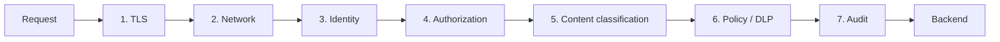

# Guide — Zero-Trust API Governance for Federal Mission Environments

## What zero-trust for APIs actually requires

Zero-trust is overused as a marketing term and underused as an architectural discipline. For an API estate in a federal mission environment, the working definition is:

> **Every API call is authenticated, authorized, encrypted, observed, classified, and revocable — without ever trusting a network perimeter.**

This guide covers the implementation across Azure Commercial, Azure Government, GCC High, DoD IL5, and select IL6 paths, with focus on the realities of federal mission operations.

---

## The boundary table

| Boundary | Accreditation | APIM | Entra | Foundry / AOAI | Purview | Notes |
|---|---|---|---|---|---|---|
| Azure Commercial | SOC 2, ISO 27001, HIPAA | GA | GA | GA | GA | Default for non-regulated workloads |
| Azure Government / GCC | FedRAMP High | GA | GA | GA (subset) | GA | Most federal civilian workloads |
| GCC High | FedRAMP High + DFARS | GA | GA | GA (subset) | GA | DIB / defense contractor |
| DoD IL5 | DoD CC SRG IL5 | GA | GA | GA (subset) | GA | Controlled defense workloads |
| DoD IL6 | DoD CC SRG IL6 | GA | GA | Select | Select | Classified secret-level workloads |

The architecture deploys identically across boundaries. The available model and adjacent-service catalog varies. The same Bicep templates parameterize the cloud environment.

---

## The seven-layer enforcement stack

Every API call traverses seven enforcement layers:



| Layer | Mechanism | What it enforces |
|---|---|---|
| 1. TLS | TLS 1.2+, mutual TLS where required | Transport encryption, server / client authentication |
| 2. Network | Private endpoints, ExpressRoute, WAF, IP allowlists | Network reachability — no public ingress to data planes |
| 3. Identity | Entra-issued JWT, validated by APIM | Caller is who they say they are |
| 4. Authorization | Scope check, Conditional Access, PIM elevation | Caller is allowed to call this operation |
| 5. Content classification | Sensitivity label check, payload inspection | Right caller, right operation, right data classification |
| 6. Policy / DLP | Purview DLP rules, content safety, custom policy | Data does not leave the boundary inappropriately |
| 7. Audit | Log Analytics with immutable retention | Every call attributable, reviewable, irrefutable |

The remainder of this guide unpacks each layer.

---

## Layer 1 — TLS

| Setting | Requirement |
|---|---|
| Minimum TLS version | 1.2 (1.3 preferred for new deployments) |
| Cipher suites | NIST-approved suites only |
| Certificate source | Key Vault-managed certificates; auto-rotation |
| Mutual TLS | Required for cross-boundary federation and partner agency callers |
| Certificate pinning | Optional but recommended for high-assurance flows |

APIM enforces TLS at the gateway. Backend TLS is enforced via APIM-to-backend mTLS where the backend supports it.

---

## Layer 2 — Network

| Pattern | Description |
|---|---|
| **Private inbound** | APIM Premium v2 with private endpoint; Front Door / Application Gateway WAF in front for public surface |
| **Private outbound** | VNet integration; private endpoints to backends; ExpressRoute for on-prem |
| **Boundary segregation** | Per-boundary subscription / tenant; cross-boundary via Entra B2B + APIM federation, not network bridging |
| **Self-hosted gateway at edge** | One container per regional center; data plane stays in the regional boundary |
| **Public surface minimum** | Only the developer portal and selected APIs; mission APIs are private-only |

---

## Layer 3 — Identity

### Entra in Government

Entra ID Government is deployed in Azure Government and GCC High; it is the identity plane for those boundaries. Standard Entra capabilities apply with these notes:

- Sign-in URLs: `login.microsoftonline.us`
- Graph endpoint: `graph.microsoft.us`
- Issuer URLs: `sts.windows.us` / `login.microsoftonline.us/{tenant}/v2.0`

### Conditional Access

Conditional Access policies on API resources enforce:

| Signal | Policy |
|---|---|
| Device compliance | Block if non-compliant; allow if hybrid-joined or Intune-managed |
| Location | Block unknown-region sign-ins; require MFA on legitimate but unusual locations |
| Sign-in risk | Block on high-risk; require MFA on medium-risk |
| User risk | Block on high-risk |
| Client app | Allow only approved app types (browser-based, modern auth, named application registrations) |
| Session controls | Enforce session lifetime; sign-in frequency for high-sensitivity operations |

### CAE — Continuous Access Evaluation

CAE-aware clients receive tokens that can be revoked in near-real-time on risk events:

- Device compliance loss
- User risk escalation
- Sign-in from unusual location
- Group membership change

For agentic AI workloads, CAE is essential — an agent's identity is its credential, and CAE is the only mechanism for revoking it within minutes.

### Workload identity

Non-human callers use:

- **Managed identity** — Azure-hosted resources; no secrets in code
- **Federated identity credentials** — K8s workloads, GitHub Actions; signed by the workload's identity provider
- **Service principal with certificate** — non-Azure-hosted; preferred over secret-based
- **Application user in Dataverse** — for app-only Dataverse access

Secrets-in-vaults are a last resort. Managed identity and federated credentials are the production posture.

---

## Layer 4 — Authorization

### Scopes for APIs

Every API has explicit scopes:

| Scope name | Typical use |
|---|---|
| `Resource.Read` | Read operations |
| `Resource.Write` | Write operations |
| `Resource.Admin` | Administrative operations |
| `Resource.ReadAll` | Cross-tenant or cross-instance read |

APIs enforce required scopes via APIM's `validate-jwt` policy with `required-claims`.

### PIM for elevation

Privileged actions (admin scopes) require Privileged Identity Management elevation:

- User requests activation for the admin role
- Approval required (or automatic with MFA + justification)
- Time-bound activation (typically 1–8 hours)
- Audit trail of every activation

For mission-critical write operations, PIM is mandatory.

### Mapping scopes to roles in backends

A common pattern: APIM validates the scope, then maps it to a backend RBAC role:

```xml
<choose>
  <when condition="@(context.Request.Headers["Authorization"][0].Contains("scp=Eam.Write"))">
    <set-header name="X-Backend-Role" exists-action="override"><value>maintainer</value></set-header>
  </when>
  <when condition="@(context.Request.Headers["Authorization"][0].Contains("scp=Eam.Read"))">
    <set-header name="X-Backend-Role" exists-action="override"><value>reader</value></set-header>
  </when>
</choose>
```

The backend trusts only `X-Backend-Role` headers from APIM (mTLS-authenticated).

---

## Layer 5 — Content classification

Microsoft Information Protection (MIP) sensitivity labels propagate through the stack:

- Data at rest in storage carries labels (label-aware encryption, conditional access)
- APIs that serve labeled data require consumers with appropriate label-clearance
- APIM checks `X-Sensitivity-Label` headers on responses and enforces label-required-headers on outbound
- AI model outputs derived from labeled inputs inherit labels (Foundry label propagation)
- Power BI and Excel respect labels on imported data

For ITAR data, the label-aware enforcement is the technical control that backs the policy assertion.

---

## Layer 6 — Policy and DLP

Purview Data Loss Prevention (DLP) rules apply at multiple enforcement points:

| Point | DLP applies to |
|---|---|
| Endpoint | Files copied to USB, uploaded to non-corporate cloud |
| M365 | Email outbound, Teams messages, SharePoint shares |
| Cloud apps | Defender for Cloud Apps inspects SaaS traffic |
| APIM | Custom policy on response bodies (e.g., regex for SSN / PII) |
| AI outputs | Foundry content safety + custom policy on agent responses |

DLP rules are authored once in Purview and enforced everywhere. The unified policy story is one of Microsoft's strongest federal-credibility arguments.

---

## Layer 7 — Audit

Every API call lands in three places:

1. **App Insights** — operational telemetry, queryable via KQL, retained 30–730 days
2. **Log Analytics** — full request/response logs (with sensitivity-aware redaction), retained per agency policy
3. **Activity Log** — control-plane changes (policy updates, subscription changes)

Audit retention and immutability:

| Retention | Mechanism |
|---|---|
| 30–730 days hot | App Insights / Log Analytics standard retention |
| Long-term cold | Archive to Storage with immutability policy (legal hold) |
| Tamper-evident | Customer-managed keys + immutable container policies |

Audit queries that earn their keep:

```kql
// All write operations against EAM by user in last 30 days
ApiManagementGatewayLogs
| where TimeGenerated > ago(30d)
| where ApiId == "eam"
| where Method in ("POST", "PATCH", "DELETE")
| project TimeGenerated, RequestId, ApimSubscriptionId, CallerIpAddress, Method, Url, ResponseCode

// Sensitivity-label violations (egress with unauthorized label)
customEvents
| where name == "SensitivityLabelViolation"
| project TimeGenerated, customDimensions

// PIM activations on admin scopes in last 7 days
AuditLogs
| where TimeGenerated > ago(7d)
| where OperationName == "Add member to role completed (PIM activation)"
```

---

## Cross-boundary federation

Multi-agency or multi-classification environments require federated identity across boundaries:

| Federation type | When to use |
|---|---|
| **Entra B2B (cross-tenant)** | Same boundary, different tenants — partner agencies |
| **External Identities / B2B with cross-tenant access settings** | Different tenants with conditional access policies bridged |
| **Federation via SAML** | Boundary-incompatible IdPs |
| **APIM cross-boundary brokering** | Different accreditation boundaries — APIM in each boundary federates trust at the API layer |

For a federal civilian agency federating with a contractor in GCC High, the pattern is typically:

1. Agency operates in Azure Gov Entra tenant
2. Contractor operates in GCC High Entra tenant
3. APIM in agency Entra fronts agency APIs
4. APIM accepts tokens from contractor tenant via configured authority + audience claims
5. Conditional access bridges (device, location, app) apply in both directions
6. Audit logs at both APIM instances; lineage in Purview at both ends

---

## ITAR and CUI handling

For ITAR / Controlled Unclassified Information (CUI):

- **Data lives in GCC High or DoD IL5/IL6**, not commercial
- **Identity is GCC High Entra**, not commercial
- **APIM is the GCC High SKU**, not commercial
- **APIs proxying ITAR data require ITAR-cleared callers** — Conditional Access policy includes group membership in ITAR-cleared user group
- **Sensitivity labels** mark ITAR-controlled data; APIM enforces no-egress-outside-boundary
- **Audit retention** matches contractual / DFARS requirements
- **Cross-boundary federation** is via explicit accredited paths; no commercial-cloud bridges

---

## FedRAMP High posture — service-by-service

| Service | Accreditation |
|---|---|
| Azure API Management | FedRAMP High in Azure Gov / GCC High |
| Microsoft Entra ID Government | FedRAMP High |
| Azure OpenAI in Azure Gov | FedRAMP High; model availability subset of commercial |
| Foundry MaaS | FedRAMP High subset; expanding |
| Foundry custom-deployment | FedRAMP High when deployed in Gov |
| Microsoft Purview | FedRAMP High in Azure Gov |
| Power Platform / Dataverse | FedRAMP High in GCC / GCC High |
| Microsoft Graph | FedRAMP High in Gov boundaries |
| Azure Databricks | FedRAMP High in Azure Gov |
| Microsoft Fabric | Forecast / in-progress for Gov boundaries |

For Fabric, the Gov path is in flight as of mid-2026 — confirm current accreditation status before committing.

---

## Survival kit — what holds up under third-party review

Federal architecture reviews look for specific evidence. The checklist:

| Evidence | Where it lives |
|---|---|
| API catalog with ownership, SLA, classification, sensitivity label | Purview |
| Every API behind identity-grounded gateway | APIM with `validate-jwt` policy |
| Conditional Access policies on API resources | Entra documentation |
| No public network paths to backends | Network architecture documentation; private endpoint inventory |
| Service principal usage minimized; managed identity preferred | Identity inventory |
| Audit retention meeting agency policy | Log Analytics retention config + storage archive policy |
| Sensitivity labels propagating through APIs | MIP policy documentation + APIM headers |
| DLP rules at all enforcement points | Purview DLP rules |
| Operational playbook covering breach scenarios | Incident response runbooks |
| Penetration test / red-team results | Latest reports |
| Cross-boundary federation documented | Network + identity architecture |
| FedRAMP / IL5 / IL6 boundary mapping | Architecture documentation |

Each row is a deliverable. Each deliverable has an owner. The discipline of producing and updating them quarterly is what differentiates a passing architecture from a barely-tolerated one.

---

## Related material

- [Best practice — API-first data strategy](../best-practices/api-first-data-strategy.md)
- [Best practice — Multi-model AI orchestration](../best-practices/multi-model-ai-orchestration.md)
- [Guide — APIM as the universal API gateway](./apim-universal-gateway.md)
- [Reference architecture — API-first multi-model ecosystem](../reference-architecture/api-first-multi-model-ecosystem.md)
- [Whitepaper — API-first data strategy on Azure](../research/api-first-data-strategy-whitepaper.md)
