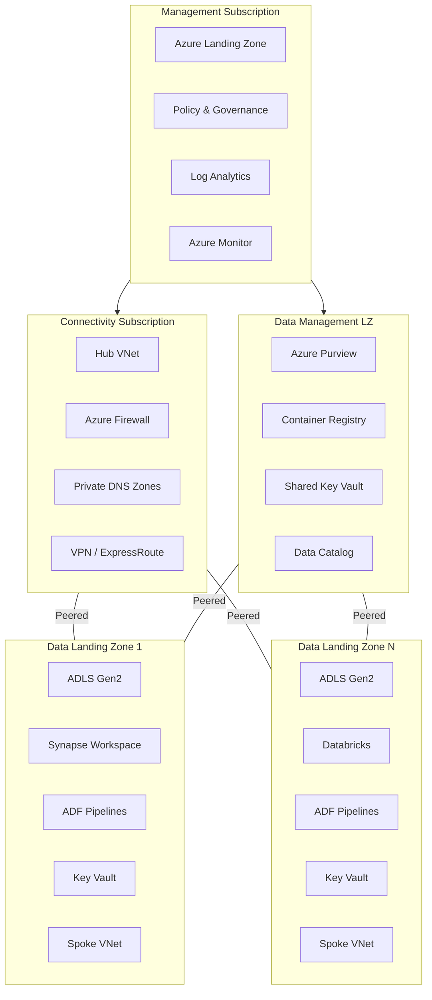

# CSA-in-a-Box: Cloud-Scale Analytics Platform

**Azure-native reference implementation of Microsoft's "Unify your data platform" Cloud Adoption Framework guidance.**

CSA-in-a-Box assembles Azure PaaS services and open-source tooling into an opinionated, end-to-end data platform that delivers Data Mesh, Data Fabric, and Data Lakehouse capabilities today — designed for environments where Microsoft Fabric is not yet GA (Azure Government) and as an incremental on-ramp for teams building toward Fabric adoption.

Fork it, deploy it, and customize it for your organization. This is not a SaaS product — it is production-grade reference code and Infrastructure as Code you own and operate.

---

## What Is CSA-in-a-Box?

CSA-in-a-Box is a Bicep-deployable reference implementation that reaches Fabric-equivalent capability on Azure PaaS services available today. It serves three roles in the 2026 Azure data-platform landscape:

- :material-shield-account:{ .lg .middle } **Azure Government Gap-Filler**

    ***

    Microsoft Fabric is forecast — not GA — in Azure Government as of April 2026. This repo ships the Fabric-parity stack (lakehouse, mesh, streaming, AI/ML, governance) on Azure PaaS services available in Gov (IL4/IL5) today.

- :material-book-open-page-variant:{ .lg .middle } **CAF "Unify Your Data Platform" Reference**

    ***

    The CAF Cloud-Scale Analytics scenario was deprecated in April 2026 in favor of Fabric-first guidance. For teams who need an end-to-end Bicep reference that is not yet a Fabric workspace, CSA-in-a-Box fills that gap.

- :material-arrow-up-bold-circle:{ .lg .middle } **Incremental On-Ramp to Microsoft Fabric**

    ***

    Every capability maps to a Fabric equivalent. Teams that start here can migrate one workload at a time into Fabric as Gov availability lands or as Commercial procurement fits.

---

## The Principles Behind the Platform

CSA-in-a-Box is not just a collection of Bicep modules — it is a working implementation of three converging data architecture paradigms that together define what "cloud-scale analytics" means in practice.

### :material-hubspot:{ .lg } Data Mesh — Domain-Oriented Ownership

Data Mesh treats data as a product owned by the domain that produces it, not a centralized team. In CSA-in-a-Box:

- **Domain-oriented Data Landing Zones** — each business domain (finance, sales, inventory) owns its own DLZ subscription with its own ADLS Gen2 storage, compute, and pipelines
- **Self-serve data infrastructure** — domain teams deploy from shared Bicep modules and dbt project templates without waiting on a central platform team
- **Federated computational governance** — Azure Purview enforces classification, lineage, and access policies across all domains from the central Data Management Landing Zone (DMLZ), while domain teams retain ownership of their data products
- **Data product contracts** — YAML-defined contracts specify schema, SLAs, freshness guarantees, and ownership, enabling consumers to discover and trust data across domain boundaries

### :material-connection:{ .lg } Data Fabric — Unified Metadata & Governance

Data Fabric provides an integrated layer of metadata, governance, and automation that spans all data assets regardless of where they live. In CSA-in-a-Box:

- **Microsoft Purview** serves as the unified metadata catalog — scanning, classifying, and tracking lineage across ADLS Gen2, Databricks, Synapse, Azure SQL, and Cosmos DB
- **Automated governance** — sensitivity labels, access policies, and compliance controls propagate automatically across data assets without manual tagging
- **Cross-domain data discovery** — the Data Marketplace API enables self-service search, access requests, and data product registration, giving every team a single pane of glass for finding trusted data
- **Lineage from source to dashboard** — end-to-end lineage tracking from ingestion (ADF) through transformation (dbt/Spark) to consumption (Power BI, APIs)

### :material-layers-triple:{ .lg } Data Lakehouse — Delta Lake Medallion Architecture

The Data Lakehouse unifies the best of data lakes (scalable, open storage) and data warehouses (ACID transactions, schema enforcement, BI performance). In CSA-in-a-Box:

- **Delta Lake on ADLS Gen2** — open-format, ACID-compliant tables on low-cost cloud storage, readable by Spark, Synapse Serverless SQL, and Power BI without data movement
- **Medallion architecture (Bronze / Silver / Gold)** — raw data lands in Bronze, validated and conformed data in Silver, and business-ready aggregates in Gold, with quality gates enforced by Great Expectations at each transition
- **Unified batch and streaming** — the same Delta tables serve both batch pipelines (ADF + dbt) and streaming workloads (Event Hubs + Spark Structured Streaming), eliminating the need for separate batch and real-time stores
- **Compute diversity** — Databricks, Synapse Spark, and Synapse Serverless SQL all query the same lakehouse, so teams pick the engine that fits their workload without duplicating data

### Why "One-Stop Shop"?

Most reference implementations cover one of these paradigms. CSA-in-a-Box implements all three — plus AI/ML integration, compliance mappings for six regulatory frameworks, 11 migration playbooks, 18 end-to-end vertical examples, and production operational runbooks — in a single, fork-ready repository. The goal is a complete starting point for any enterprise analytics initiative on Azure, not a proof-of-concept that stops at "Hello World."

---

- :material-rocket-launch:{ .lg .middle } **Getting Started**

    ***

    Deploy your first landing zone in under 30 minutes with the Quickstart guide.

    [:octicons-arrow-right-24: Quickstart](QUICKSTART.md)

- :material-crane:{ .lg .middle } **Architecture**

    ***

    Four-subscription landing zone architecture: Management, Connectivity, DMLZ, and DLZ with Delta Lake medallion layers.

    [:octicons-arrow-right-24: Architecture](ARCHITECTURE.md)

- :material-shield-check:{ .lg .middle } **Compliance**

    ***

    NIST 800-53, FedRAMP, CMMC 2.0 L2, HIPAA, SOC 2, PCI-DSS, and GDPR control mappings with Azure-native implementations.

    [:octicons-arrow-right-24: Compliance](compliance/README.md)

- :material-robot:{ .lg .middle } **AI Copilot**

    ***

    Ask questions about the codebase, architecture, and troubleshooting with our AI-powered assistant.

    [:octicons-arrow-right-24: Chat with Copilot](chat.md)

---

## What's Included

| Capability              | Azure Services                        | Fabric Equivalent                            | Status                                      |
| ----------------------- | ------------------------------------- | -------------------------------------------- | ------------------------------------------- |
| **Data Lakehouse**      | ADLS Gen2 + Delta Lake + Databricks   | OneLake + Lakehouse                          | :material-check-circle:{ .green } GA        |
| **Data Mesh**           | Purview + Domain-oriented ownership   | Workspaces + Domains                         | :material-check-circle:{ .green } GA        |
| **Data Fabric**         | Purview unified metadata + governance | OneLake Catalog + Purview integration        | :material-check-circle:{ .green } GA        |
| **ETL/ELT Pipelines**   | ADF + dbt Core + Event Hubs           | Fabric Data Factory                          | :material-check-circle:{ .green } GA        |
| **Data Warehousing**    | Synapse Dedicated + Serverless SQL    | Fabric Warehouse                             | :material-check-circle:{ .green } GA        |
| **Governance**          | Purview + Unity Catalog + Policy      | OneLake Catalog (Purview-powered)            | :material-check-circle:{ .green } GA        |
| **Real-Time Analytics** | Event Hubs + ADX + Spark Streaming    | Real-Time Intelligence (Eventhouse / KQL DB) | :material-check-circle:{ .green } GA        |
| **AI Integration**      | Azure OpenAI + Cognitive Services     | Fabric Data Science + Copilot                | :material-check-circle:{ .green } GA        |
| **Portal**              | FastAPI + React + Kubernetes          | Power BI + Power Apps                        | :material-check-circle:{ .green } GA        |
| **Observability**       | Log Analytics + Azure Monitor + KQL   | Fabric Monitoring Hub                        | :material-check-circle:{ .green } GA        |
| **IaC**                 | Bicep + GitHub Actions CI/CD          | —                                            | :material-check-circle:{ .green } GA        |
| **Fabric Migration**    | RTI Adapter + Migration Pathways      | —                                            | :material-progress-clock:{ .amber } Preview |

---

## Use Fabric if... Use This if...

CSA-in-a-Box is **not** a blanket substitute for Microsoft Fabric. For most Azure Commercial greenfield workloads where Fabric is GA in the region, Fabric is the right answer. Use this decision table to pick the right tool:

| Use Microsoft Fabric if...                                            | Use CSA-in-a-Box if...                                                                  |
| --------------------------------------------------------------------- | --------------------------------------------------------------------------------------- |
| Workload is on Azure Commercial and Fabric is GA in your region       | Workload is on Azure Government (IL4/IL5) — Fabric is forecast, not GA                  |
| Team prefers a unified SaaS control plane over composed Bicep modules | Team requires Bicep/Terraform IaC, controlled deployments, explicit Azure Policy        |
| Simplicity and managed OneLake are higher priority than control       | Composability and Azure PaaS primitives are higher priority than a single pane of glass |
| Preview features are an asset (Data Activator, Fabric Copilot)        | Production-stable services and conservative roll-out pace are required                  |
| Commercial-only workloads OR starting greenfield with Fabric          | Federal/regulated/tribal workloads subject to FedRAMP High, CMMC 2.0 L2, or HIPAA       |
| F-SKU reserved capacity cost model fits your procurement              | Consumption-based Azure metering + reserved instances fit your procurement              |

For detailed selection logic, see the [Fabric vs. Databricks vs. Synapse decision tree](decisions/fabric-vs-databricks-vs-synapse.md) and [ADR-0010: Fabric Strategic Target](adr/0010-fabric-strategic-target.md).

---

## Architecture Overview

CSA-in-a-Box deploys across four Azure subscriptions following the Cloud Adoption Framework enterprise-scale pattern:

[:octicons-arrow-right-24: Full Architecture Reference](ARCHITECTURE.md)

---

## Quick Links

- [:material-book-open-variant: Developer Pathways](DEVELOPER_PATHWAYS.md) — Choose your learning path by role
- [:material-school: Tutorials](tutorials/README.md) — 11 step-by-step tutorials from Foundation to Data API Builder
- [:material-flask: End-to-End Examples](examples/index.md) — 18 vertical implementations across federal, healthcare, financial, and more
- [:material-star-check: Best Practices](best-practices/index.md) — 9 guides covering medallion, engineering, governance, security, cost, and more
- [:material-cog: Production Checklist](PRODUCTION_CHECKLIST.md) — Pre-production readiness
- [:material-currency-usd: Cost Management](COST_MANAGEMENT.md) — FinOps guidance
- [:material-swap-horizontal: Migrations](migrations/README.md) — 11 playbooks for AWS, GCP, Snowflake, Databricks, Teradata, Hadoop, and more
- [:material-bug: Troubleshooting](TROUBLESHOOTING.md) — Common issues and fixes
- [:material-source-branch: Contributing](https://github.com/fgarofalo56/csa-inabox/blob/main/CONTRIBUTING.md) — How to contribute

<!-- release v0.3.0 -->
