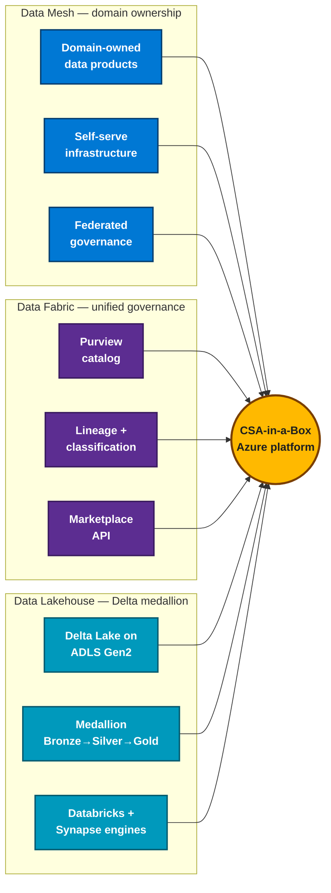

# Cloud Scale Analytics in a Box

!!! info "Comparative positioning note"
    This document is written from the
    perspective of Microsoft Azure, Cloud Scale Analytics, and CSA Loom. Any
    description of third-party or competing products, services, pricing, or
    capabilities is derived from **publicly available documentation and sources**
    believed accurate at the time of writing, and is provided for **general
    comparison only**. We do not claim expertise in, or authority over, any
    non-Microsoft product or service; the respective vendor's official
    documentation is the authoritative source for their offerings, which may
    change over time. Nothing here is intended to disparage any vendor — where a
    competing product has genuine advantages, we aim to note them honestly.
    Verify all third-party details against the vendor's current official
    documentation before making decisions.

**A deployable, Azure-native data platform — Data Mesh, Data Fabric, and Data Lakehouse — for teams who can't get Microsoft Fabric yet, or who deliberately don't want SaaS and need full control of their environment.**

CSA-in-a-Box assembles Azure PaaS/IaaS services and open-source tooling into an opinionated, end-to-end platform that delivers Data Mesh, Data Fabric, and Data Lakehouse capabilities **today**, on services available in Azure Government (IL4/IL5) now. It follows the same data-mesh, data-fabric, and lakehouse principles as Microsoft's Cloud Adoption Framework data-platform guidance. Use it as an **on-ramp to Microsoft Fabric** (migrate workload by workload as Fabric reaches your cloud) **or as a permanent, self-operated alternative** when SaaS isn't an option — by mandate or by choice.

!!! note "Personal project — not an official Microsoft offering"
    CSA-in-a-Box and CSA Loom are a personal, community reference project maintained by
    [@fgarofalo56](https://github.com/fgarofalo56). They are **not** official Microsoft
    products, services, or guidance, are **not** endorsed or supported by Microsoft, and
    do not represent Microsoft's positions. Compliance pages are **reference control
    mappings to help you build toward an authorization** — not attestations,
    certifications, or authorizations to operate (ATO).

!!! tip "New: **CSA Loom** — the productized Microsoft Fabric parity layer"
    For federal / DoD / IC / state + local customers blocked from
    Microsoft Fabric: **[CSA Loom](fiab/index.md)** is the productized
    SaaS-feel deployment of CSA-in-a-Box. Loom Console (Fabric
    workspace experience), Loom Setup Wizard (conversational deploy),
    parity services for Direct Lake / Activator / Mirroring / Data
    Agents. Free in v1. **[Learn more →](fiab/index.md)**

Fork it, deploy it, customize it. Production-grade Bicep + reference code you own and operate.

!!! abstract "Maturity — read this before you plan a rollout (as of 2026-06-02)"
    Be clear-eyed about what is battle-tested versus what is reference material. This repo mixes both on purpose, and the line matters when you scope a deployment.

    **Production-tested and deployed** (run live, validated against real Azure backends):

    - The **landing-zone Bicep** (ALZ + DMLZ + DLZ) and the medallion ADLS Gen2 / Delta storage layout — these deploy end-to-end and are the foundation everything else sits on.
    - The **dbt medallion transforms** (Bronze → Silver → Gold), data-quality gates (dbt tests + Great Expectations), and data contracts — exercised by the vertical examples.
    - **CSA Loom console** service navigators over **real** Azure/Fabric REST and data-plane calls — Databricks, Synapse, Azure SQL, Cosmos DB, AI Search, ADX, APIM, Event Hubs, Power BI/Fabric semantic. These are deployed and verified live (see the [parity scorecard](fiab/parity/MASTER-SCORECARD.md)). Their **depth varies** — most sit at B/C grade with genuine missing breadth, not at full 1:1 Azure parity.

    **Reference-only / illustrative** (sound patterns, but treat as a starting point — adapt and harden before production):

    - The **vertical examples** (USDA, NOAA, EPA, casino, tribal-health, etc.) ship seed-data generators and synthetic data — they demonstrate end-to-end patterns, not certified workloads.
    - **Compliance pages** are control *mappings* to help you build toward an authorization. They are **not** attestations, certifications, or an ATO.
    - The **Terraform path**, **Fabric Deployment Pipelines Git/CI integration**, **Mapping Data Flow / Synapse-notebook visual designers**, and **Unity Catalog write surface** are **on the roadmap, not built** — see the [parity matrix](#fabric-parity-matrix) below for the honest per-capability state.

[:octicons-rocket-16: Start the 30-min tour](GETTING_STARTED.md){ .md-button .md-button--primary }
[:octicons-zap-16: Quickstart (5 min)](QUICKSTART.md){ .md-button }
[:octicons-mark-github-16: View on GitHub](https://github.com/fgarofalo56/csa-inabox){ .md-button }

[{ .architecture-hero loading="eager" }](ARCHITECTURE.md "Open the full architecture reference")

---

## Start here

Four pages cover the full path from "what is this?" to "deployed in production."

- :material-rocket-launch:{ .lg .middle } **Quickstart**

    ***

    Deploy a working CSA platform end-to-end in 60–90 minutes — infra, seed data, dbt medallion, streaming.

    [:octicons-arrow-right-24: Quickstart](QUICKSTART.md)

- :material-crane:{ .lg .middle } **Architecture**

    ***

    Four-subscription landing zone: Management, Connectivity, Data Management LZ, Data Landing Zone — with Delta Lake medallion layers.

    [:octicons-arrow-right-24: Architecture](ARCHITECTURE.md)

- :material-shield-check:{ .lg .middle } **Compliance**

    ***

    NIST 800-53, FedRAMP, CMMC 2.0 L2, HIPAA, SOC 2, PCI-DSS, and GDPR — control mappings with Azure-native implementations.

    [:octicons-arrow-right-24: Compliance](compliance/README.md)

- :material-robot:{ .lg .middle } **AI Copilot**

    ***

    Ask questions about the codebase, architecture, and troubleshooting with the in-page AI assistant.

    [:octicons-arrow-right-24: Chat with Copilot](chat.md)

---

## Why teams use it

- :material-shield-account:{ .lg .middle } **Azure Government gap-filler**

    ***

    Microsoft Fabric is forecast — not GA — in Azure Government. This repo ships the Fabric-parity stack (lakehouse, mesh, streaming, AI/ML, governance) on Azure PaaS services available in Gov (IL4/IL5) today.

- :material-book-open-page-variant:{ .lg .middle } **CAF "Unify Your Data Platform" reference**

    ***

    The CAF Cloud-Scale Analytics scenario was deprecated in April 2026 in favor of Fabric-first guidance. For teams who need an end-to-end Bicep reference that is not yet a Fabric workspace, CSA-in-a-Box fills that gap.

- :material-arrow-up-bold-circle:{ .lg .middle } **Incremental on-ramp to Microsoft Fabric**

    ***

    Every capability maps to a Fabric equivalent. Teams that start here migrate one workload at a time into Fabric as Gov availability lands or Commercial procurement fits. See the [Supercharge Microsoft Fabric](https://fgarofalo56.github.io/Suppercharge_Microsoft_Fabric/) companion site for hands-on Fabric tutorials and best practices.

---

## The principles behind the platform

CSA-in-a-Box is not just a collection of Bicep modules — it is a working implementation of three converging data architecture paradigms that together define what "cloud-scale analytics" means in practice.

<!-- diagram source: atlas-diag dgm_e24ec57b530af206d287 (internal) -->

### :material-hubspot:{ .lg } Data Mesh — domain-oriented ownership

Data Mesh treats data as a product owned by the domain that produces it, not a centralized team. In CSA-in-a-Box:

- **Domain-oriented Data Landing Zones** — each business domain (finance, sales, inventory) owns its own DLZ subscription with its own ADLS Gen2 storage, compute, and pipelines.
- **Self-serve data infrastructure** — domain teams deploy from shared Bicep modules and dbt project templates without waiting on a central platform team.
- **Federated computational governance** — Purview enforces classification, lineage, and access policies across all domains from the central DMLZ, while domain teams retain ownership of their data products.
- **Data product contracts** — YAML-defined contracts specify schema, SLAs, freshness guarantees, and ownership, enabling consumers to discover and trust data across domain boundaries.

### :material-connection:{ .lg } Data Fabric — unified metadata & governance

Data Fabric provides an integrated layer of metadata, governance, and automation that spans all data assets regardless of where they live. In CSA-in-a-Box:

- **Microsoft Purview** is the unified catalog — scanning, classifying, and tracking lineage across ADLS Gen2, Databricks, Synapse, Azure SQL, and Cosmos DB.
- **Automated governance** — sensitivity labels, access policies, and compliance controls propagate across data assets without manual tagging.
- **Cross-domain data discovery** — the Data Marketplace API enables self-service search, access requests, and data product registration.
- **Lineage from source to dashboard** — end-to-end tracking from ingestion (ADF) through transformation (dbt/Spark) to consumption (Power BI, APIs).

### :material-layers-triple:{ .lg } Data Lakehouse — Delta Lake medallion

The Data Lakehouse unifies data lakes (scalable, open storage) with data warehouses (ACID transactions, schema enforcement, BI performance). In CSA-in-a-Box:

- **Delta Lake on ADLS Gen2** — open-format, ACID-compliant tables on low-cost cloud storage, readable by Spark, Synapse Serverless SQL, and Power BI without data movement.
- **Medallion architecture (Bronze / Silver / Gold)** — raw → validated → business-ready, with quality gates enforced by Great Expectations at each transition.
- **Unified batch and streaming** — the same Delta tables serve both batch pipelines (ADF + dbt) and streaming workloads (Event Hubs + Spark Structured Streaming).
- **Compute diversity** — Databricks, Synapse Spark, and Synapse Serverless SQL all query the same lakehouse, so teams pick the engine that fits their workload without duplicating data.

> **Why "one-stop shop"?** Most reference implementations cover one of these paradigms. CSA-in-a-Box implements all three — plus AI/ML integration, control mappings across the major federal and commercial compliance frameworks, a library of migration playbooks and end-to-end vertical examples, and production runbooks — in a single, fork-ready repository.

---

## Choose your path

- :material-school:{ .lg .middle } **Tutorials**

    ***

    11 step-by-step tutorials from Foundation to Data API Builder.

    [:octicons-arrow-right-24: Browse tutorials](tutorials/README.md)

- :material-flask:{ .lg .middle } **End-to-end examples**

    ***

    18 vertical implementations across federal, healthcare, financial, gaming, and more.

    [:octicons-arrow-right-24: Browse examples](examples/index.md)

- :material-star-check:{ .lg .middle } **Best practices**

    ***

    9 guides covering medallion, engineering, governance, security, cost, and more.

    [:octicons-arrow-right-24: Best practices](best-practices/index.md)

- :material-swap-horizontal:{ .lg .middle } **Migrations**

    ***

    11 playbooks for AWS, GCP, Snowflake, Databricks, Teradata, Hadoop, and more.

    [:octicons-arrow-right-24: Migration playbooks](migrations/README.md)

- :material-cog:{ .lg .middle } **Production checklist**

    ***

    Pre-production readiness, FinOps guidance, and operational runbooks.

    [:octicons-arrow-right-24: Production checklist](PRODUCTION_CHECKLIST.md)

- :material-bug:{ .lg .middle } **Troubleshooting**

    ***

    Common issues, fixes, and the developer pathway by role.

    [:octicons-arrow-right-24: Troubleshooting](TROUBLESHOOTING.md)

---

## Use Fabric, or use this?

CSA-in-a-Box is **not** a blanket substitute for Microsoft Fabric. If Fabric is GA in your cloud and you're comfortable with SaaS, Fabric is usually the right answer — and the **[Supercharge Microsoft Fabric](https://fgarofalo56.github.io/Suppercharge_Microsoft_Fabric/)** companion site has the hands-on tutorials, POC agendas, and notebooks for it.

Choose CSA-in-a-Box when **either** is true:

- **Fabric isn't available to you** — Azure Government / DoD / IC, or a region where Fabric isn't GA yet.
- **You won't run on SaaS** — sovereignty, data residency, custom networking, dedicated capacity, or full operational control mean a multi-tenant managed plane is off the table. Here CSA-in-a-Box is a **permanent** choice, not a stopgap.

### Which one do I use?

| Your situation | Use |
| --- | --- |
| Fabric is GA in your cloud and you want it (SaaS, Microsoft-managed) | **Microsoft Fabric** + **[Supercharge Microsoft Fabric](https://fgarofalo56.github.io/Suppercharge_Microsoft_Fabric/)** |
| Fabric isn't available in your cloud yet (Gov / DoD / IC) | **CSA-in-a-Box** (this repo) |
| You could get Fabric but won't take SaaS — control / sovereignty / custom networking | **CSA-in-a-Box** (permanent, by design) |
| You want the CSA stack with a Fabric-like console + guided deploy | **[CSA Loom](fiab/index.md)** |

For the full decision logic see the [Fabric vs. Databricks vs. Synapse decision tree](decisions/fabric-vs-databricks-vs-synapse.md) and [ADR-0010: Fabric Strategic Target](adr/0010-fabric-strategic-target.md). The Fabric-equivalent capability matrix is immediately below.

---

## Fabric parity matrix

This is the honest, capability-by-capability map of where CSA-in-a-Box / CSA Loom stands against each Microsoft Fabric workload. Fabric capabilities and workload names are grounded in [Microsoft Learn — What is Microsoft Fabric?](https://learn.microsoft.com/fabric/fundamentals/microsoft-fabric-overview) and the [end-to-end Fabric architecture](https://learn.microsoft.com/azure/architecture/example-scenario/dataplate2e/data-platform-end-to-end). The "CSA/Loom equivalent" column names the actual Azure service plus the Loom editor that surfaces it. **Status is candid, not aspirational**, and is derived from the live [parity scorecard](fiab/parity/MASTER-SCORECARD.md):

- ✅ **At parity** — real control + real Azure backend, deployed and verified. Depth may still trail the richest Azure tabs; the per-service [parity docs](fiab/parity/) record exactly what.
- ⚠️ **Honest gate / partial** — the surface renders and works, but a flagship sub-feature is read-only, infra-gated (a Fluent MessageBar naming the env var/role to provision), or routed out. Not a dead button.
- ➖ **Not built** — no Loom surface for this Fabric capability yet; on the roadmap.

| Fabric capability | Fabric workload/feature | CSA/Loom equivalent (Azure service + Loom editor) | Status |
| --- | --- | --- | :--: |
| **Lakehouse** | OneLake Lakehouse — Tables/Files explorer, SQL analytics endpoint, Load-to-Tables | ADLS Gen2 (Delta) + Synapse Serverless SQL · Loom **Lakehouse editor** | ✅ explorer, preview, T-SQL, upload, context menu, download all real. OneLake **shortcuts** are an honest infra-gate (Azure-native ADLS/UC shortcut engine on the roadmap; `abfss://` + `OPENROWSET` work today). |
| **Warehouse** | Fabric Warehouse — T-SQL editor, CTAS, save-as-view, Open-in-Excel, relationships/permissions | Synapse Dedicated SQL pool (TDS) · Loom **Warehouse editor** | ✅ B+ — SQL authoring, CTAS, .iqy export, relationships, permissions all real. ➖ no-code **visual Power Query canvas** not built; Git is workspace-level (honest-gate). |
| **Data Factory — Pipelines** | Fabric/ADF data pipelines — orchestration, control flow, copy activity | Azure Data Factory · Loom **pipeline editor** (React Flow canvas) | ⚠️ pipeline canvas built on real ADF REST; **Copy Data Tool wizard**, Add-Dynamic-Content expression builder, connector galleries + Test-Connection, and Publish/Git/ARM are not yet built. |
| **Data Factory — Mapping Data Flow** | Visual source→transform→sink dataflow with data preview/debug | ADF Mapping Data Flow | ➖ **not built** — the flagship ADF visual designer is absent (the React Flow canvas is pipeline-only). The single biggest ADF gap. |
| **Dataflows Gen2** | Power Query Online ETL (visual, reusable) | Power Query / ADF · (no dedicated Loom Dataflow canvas) | ➖ **not built** as a visual surface. dbt + ADF pipelines are the supported transform path today. |
| **Notebooks / Spark (Data Engineering)** | Fabric notebooks — cells, %% magics, attach-pool, Run/Run-all, viz | Azure Databricks (notebooks/Spark, Unity Catalog) + Synapse Spark · Loom **Databricks** + **Synapse** editors | ⚠️ Databricks Spark/notebook surface is the strongest service (grade A); **Synapse notebook authoring editor is not built** (Spark is a single textbox). Databricks **Unity Catalog is read-only** (no create/GRANT/lineage write). |
| **Real-Time Intelligence / KQL** | Eventhouse + KQL database, eventstreams, KQL query | Azure Data Explorer (Kusto) + Event Hubs + Stream Analytics · Loom **ADX (Kusto)** + **Eventstream** editors | ⚠️ real `.show` / KQL execution + DB policies built (C+). **Rich results grid** (sort/group/pivot/profile), Open-in-Excel/Power BI export, and cluster lifecycle/RBAC not yet built. |
| **Eventstreams** | No-code stream ingest/transform/route | Event Hubs · Loom **Eventstream** + **Event Hubs** editors | ⚠️ Eventstream React Flow canvas built; Event Hubs **Send** is real REST. **Data Explorer receive** is an honest AMQP-dependency gate; SAS/connection-string copy, Capture authoring, auto-inflate not built. |
| **Semantic models / Power BI** | Direct Lake semantic models, reports, Power BI service | Power BI + Databricks SQL (Direct Lake over Delta) · Loom **semantic-model / report / scorecard** editors | ⚠️ semantic-model list/detail, scorecard goal check-in (real Fabric REST write), report surfaces built (B-). **Lineage view, sensitivity labels, gateway-credential sign-in, in-browser report authoring** not built. |
| **OneLake** | Single logical lake, zero-copy across workloads | ADLS Gen2 + Unity Catalog (conceptual unified metadata) | ⚠️ the storage substrate (ADLS Gen2 + Delta + Unity Catalog) is real and deployed; there is **no single-namespace OneLake equivalent** — it is multiple storage accounts unified by Unity Catalog, not one logical lake. |
| **Data Activator** | Reflex — detect conditions in data, trigger alerts/actions | `csa_platform/data_activator/` (Event Grid + Functions + Teams/email) · Loom Activator surface | ⚠️ event-driven alerting deployed via Azure-native services; not a 1:1 of the Fabric Activator rule-authoring UX. |
| **Purview governance** | Built-in Purview — catalog, classification, lineage, sensitivity labels | Microsoft Purview · Loom **unified-catalog / governance** surfaces | ⚠️ Purview scan/classify/lineage deployed in the DMLZ; **sensitivity-label apply** is honestly omitted (no public apply REST) and cross-tenant OneLake sharing has no equivalent. |
| **Data Science / ML** | Fabric Data Science — MLflow experiments, SynapseML, model registry, batch scoring | Azure ML + Azure Databricks (MLflow) · `csa_platform/ai_integration/` | ⚠️ Azure ML + Databricks MLflow are the deployed ML path; there is no unified Loom Data-Science editor matching the Fabric notebook-to-registry-to-Direct-Lake loop. |
| **Copilot / Data Agents** | Copilot across workloads, Fabric Data Agents (NL→SQL/KQL/DAX) | Azure OpenAI + AI Foundry agents · Loom **AI Foundry** + docs **Copilot** | ⚠️ AI Foundry agent editor built on real `foundry-agent-client.ts` (C+); fine-tuning, evals, and 7-of-8 playgrounds are deep-link or not built. No tenant-wide cross-workload Copilot. |
| **Git / CI-CD deployment pipelines** | Fabric Deployment Pipelines + Git integration (dev→test→prod promotion, source control) | Fabric Deployment Pipelines REST + ARM deployments · Loom **deployment-pipelines** pane | ⚠️ stage→items→**deploy**→history promotion workflow is fully built on real Fabric REST; **Git source-control config / CI integration / pipeline create-delete admin lifecycle are not built** (done in Fabric). |
| **API for GraphQL / Data API Builder** | Fabric API for GraphQL — auto-generated GraphQL over SQL/Warehouse/Lakehouse | Data API Builder (DAB) over Azure SQL / Cosmos · Loom **GraphQL API** editor | ✅ DAB-backed REST+GraphQL generation is a supported Loom surface (schema explorer + query playground per the parity spec). Fabric-managed-resolver depth still trails. |

**Honest summary:** Loom is roughly one-third of the way to 1:1 Azure parity. What is built is genuine (no fake data; gates are honest), but every service still has real missing breadth — the headline gaps are the **visual designers** (Mapping Data Flow, Synapse notebooks), the **Unity Catalog write surface**, and **per-service admin blades**. See the [Master Scorecard](fiab/parity/MASTER-SCORECARD.md) for per-service grades and the prioritized build backlog.

<!-- release v0.3.0 -->

---

**See also:**

- → Next: [Getting Started (30-min tour)](GETTING_STARTED.md)
- ⌂ Index: [Documentation home](index.md)
