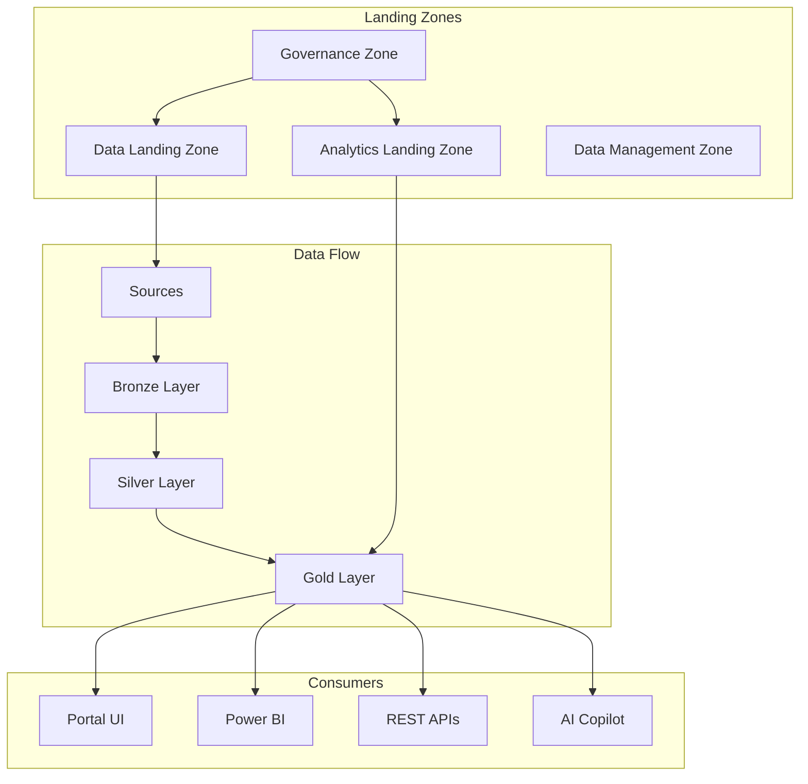

# CSA-in-a-Box

**Azure-native reference implementation of Microsoft's "Unify your data platform" guidance.**

Production-grade Data Mesh, Data Fabric, and Data Lakehouse capabilities on Azure PaaS services — designed for environments where Microsoft Fabric is not yet GA (Azure Government) and as an incremental on-ramp pathway.

---

-   :material-rocket-launch:{ .lg .middle } **Getting Started**

    ---

    Deploy your first landing zone in under 30 minutes with the Quickstart guide.

    [:octicons-arrow-right-24: Quickstart](QUICKSTART.md)

-   :material-crane:{ .lg .middle } **Architecture**

    ---

    Four-tier landing zone architecture: ALZ, DLZ, DMLZ, and Governance zones with Delta Lake medallion layers.

    [:octicons-arrow-right-24: Architecture](ARCHITECTURE.md)

-   :material-shield-check:{ .lg .middle } **Compliance**

    ---

    NIST 800-53, CMMC 2.0 L2, and HIPAA control mappings with Azure-native implementations.

    [:octicons-arrow-right-24: Compliance](compliance/README.md)

-   :material-robot:{ .lg .middle } **AI Copilot**

    ---

    Ask questions about the codebase, architecture, and troubleshooting with our AI-powered assistant.

    [:octicons-arrow-right-24: Chat with Copilot](chat.md)

---

## What's Included

| Capability | Azure Services | Status |
|---|---|---|
| **Data Lakehouse** | ADLS Gen2 + Delta Lake + Databricks | :material-check-circle:{ .green } GA |
| **Data Mesh** | Purview + Domain-oriented ownership | :material-check-circle:{ .green } GA |
| **ETL/ELT Pipelines** | ADF + dbt Core + Event Hubs | :material-check-circle:{ .green } GA |
| **Governance** | Purview + Unity Catalog + Policy | :material-check-circle:{ .green } GA |
| **Real-Time Analytics** | Event Hubs + ADX + Spark Streaming | :material-check-circle:{ .green } GA |
| **AI Integration** | Azure OpenAI + Cognitive Services | :material-check-circle:{ .green } GA |
| **Portal** | FastAPI + React + Kubernetes | :material-check-circle:{ .green } GA |
| **IaC** | Bicep + GitHub Actions CI/CD | :material-check-circle:{ .green } GA |
| **Fabric Migration** | RTI Adapter + Migration Pathways | :material-progress-clock:{ .amber } Preview |

## Quick Links

- [:material-book-open-variant: Developer Pathways](DEVELOPER_PATHWAYS.md) — Choose your learning path
- [:material-cog: Production Checklist](PRODUCTION_CHECKLIST.md) — Pre-production readiness
- [:material-currency-usd: Cost Management](COST_MANAGEMENT.md) — FinOps guidance
- [:material-bug: Troubleshooting](TROUBLESHOOTING.md) — Common issues and fixes
- [:material-source-branch: Contributing](https://github.com/fgarofalo56/csa-inabox/blob/main/CONTRIBUTING.md) — How to contribute

## Architecture Overview

