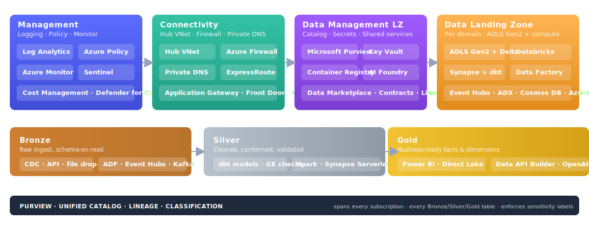

# CSA-in-a-Box

**Azure-native reference implementation of Microsoft's "Unify your data platform" Cloud Adoption Framework guidance.**

CSA-in-a-Box assembles Azure PaaS services and open-source tooling into an opinionated, end-to-end data platform that delivers Data Mesh, Data Fabric, and Data Lakehouse capabilities today — designed for environments where Microsoft Fabric is not yet GA (Azure Government), and as an incremental on-ramp for teams building toward Fabric adoption.

Fork it, deploy it, customize it. Production-grade Bicep + reference code you own and operate.

[:octicons-rocket-16: Start the 30-min tour](GETTING_STARTED.md){ .md-button .md-button--primary }
[:octicons-zap-16: Quickstart (5 min)](QUICKSTART.md){ .md-button }
[:octicons-mark-github-16: View on GitHub](https://github.com/fgarofalo56/csa-inabox){ .md-button }

[{ .architecture-hero loading="eager" }](ARCHITECTURE.md "Open the full architecture reference")

---

## Start here

Four pages cover the full path from "what is this?" to "deployed in production."

- :material-rocket-launch:{ .lg .middle } **Quickstart**

    ***

    Deploy a working CSA platform end-to-end in 60–90 minutes — infra, seed data, dbt medallion, streaming.

    [:octicons-arrow-right-24: Quickstart](QUICKSTART.md)

- :material-crane:{ .lg .middle } **Architecture**

    ***

    Four-subscription landing zone: Management, Connectivity, Data Management LZ, Data Landing Zone — with Delta Lake medallion layers.

    [:octicons-arrow-right-24: Architecture](ARCHITECTURE.md)

- :material-shield-check:{ .lg .middle } **Compliance**

    ***

    NIST 800-53, FedRAMP, CMMC 2.0 L2, HIPAA, SOC 2, PCI-DSS, and GDPR — control mappings with Azure-native implementations.

    [:octicons-arrow-right-24: Compliance](compliance/README.md)

- :material-robot:{ .lg .middle } **AI Copilot**

    ***

    Ask questions about the codebase, architecture, and troubleshooting with the in-page AI assistant.

    [:octicons-arrow-right-24: Chat with Copilot](chat.md)

---

## Why teams use it

- :material-shield-account:{ .lg .middle } **Azure Government gap-filler**

    ***

    Microsoft Fabric is forecast — not GA — in Azure Government. This repo ships the Fabric-parity stack (lakehouse, mesh, streaming, AI/ML, governance) on Azure PaaS services available in Gov (IL4/IL5) today.

- :material-book-open-page-variant:{ .lg .middle } **CAF "Unify Your Data Platform" reference**

    ***

    The CAF Cloud-Scale Analytics scenario was deprecated in April 2026 in favor of Fabric-first guidance. For teams who need an end-to-end Bicep reference that is not yet a Fabric workspace, CSA-in-a-Box fills that gap.

- :material-arrow-up-bold-circle:{ .lg .middle } **Incremental on-ramp to Microsoft Fabric**

    ***

    Every capability maps to a Fabric equivalent. Teams that start here migrate one workload at a time into Fabric as Gov availability lands or Commercial procurement fits.

---

## The principles behind the platform

CSA-in-a-Box is not just a collection of Bicep modules — it is a working implementation of three converging data architecture paradigms that together define what "cloud-scale analytics" means in practice.

### :material-hubspot:{ .lg } Data Mesh — domain-oriented ownership

Data Mesh treats data as a product owned by the domain that produces it, not a centralized team. In CSA-in-a-Box:

- **Domain-oriented Data Landing Zones** — each business domain (finance, sales, inventory) owns its own DLZ subscription with its own ADLS Gen2 storage, compute, and pipelines.
- **Self-serve data infrastructure** — domain teams deploy from shared Bicep modules and dbt project templates without waiting on a central platform team.
- **Federated computational governance** — Purview enforces classification, lineage, and access policies across all domains from the central DMLZ, while domain teams retain ownership of their data products.
- **Data product contracts** — YAML-defined contracts specify schema, SLAs, freshness guarantees, and ownership, enabling consumers to discover and trust data across domain boundaries.

### :material-connection:{ .lg } Data Fabric — unified metadata & governance

Data Fabric provides an integrated layer of metadata, governance, and automation that spans all data assets regardless of where they live. In CSA-in-a-Box:

- **Microsoft Purview** is the unified catalog — scanning, classifying, and tracking lineage across ADLS Gen2, Databricks, Synapse, Azure SQL, and Cosmos DB.
- **Automated governance** — sensitivity labels, access policies, and compliance controls propagate across data assets without manual tagging.
- **Cross-domain data discovery** — the Data Marketplace API enables self-service search, access requests, and data product registration.
- **Lineage from source to dashboard** — end-to-end tracking from ingestion (ADF) through transformation (dbt/Spark) to consumption (Power BI, APIs).

### :material-layers-triple:{ .lg } Data Lakehouse — Delta Lake medallion

The Data Lakehouse unifies data lakes (scalable, open storage) with data warehouses (ACID transactions, schema enforcement, BI performance). In CSA-in-a-Box:

- **Delta Lake on ADLS Gen2** — open-format, ACID-compliant tables on low-cost cloud storage, readable by Spark, Synapse Serverless SQL, and Power BI without data movement.
- **Medallion architecture (Bronze / Silver / Gold)** — raw → validated → business-ready, with quality gates enforced by Great Expectations at each transition.
- **Unified batch and streaming** — the same Delta tables serve both batch pipelines (ADF + dbt) and streaming workloads (Event Hubs + Spark Structured Streaming).
- **Compute diversity** — Databricks, Synapse Spark, and Synapse Serverless SQL all query the same lakehouse, so teams pick the engine that fits their workload without duplicating data.

> **Why "one-stop shop"?** Most reference implementations cover one of these paradigms. CSA-in-a-Box implements all three — plus AI/ML integration, compliance mappings for six regulatory frameworks, 11 migration playbooks, 18 end-to-end vertical examples, and production runbooks — in a single, fork-ready repository.

---

## Choose your path

- :material-school:{ .lg .middle } **Tutorials**

    ***

    11 step-by-step tutorials from Foundation to Data API Builder.

    [:octicons-arrow-right-24: Browse tutorials](tutorials/README.md)

- :material-flask:{ .lg .middle } **End-to-end examples**

    ***

    18 vertical implementations across federal, healthcare, financial, gaming, and more.

    [:octicons-arrow-right-24: Browse examples](examples/index.md)

- :material-star-check:{ .lg .middle } **Best practices**

    ***

    9 guides covering medallion, engineering, governance, security, cost, and more.

    [:octicons-arrow-right-24: Best practices](best-practices/index.md)

- :material-swap-horizontal:{ .lg .middle } **Migrations**

    ***

    11 playbooks for AWS, GCP, Snowflake, Databricks, Teradata, Hadoop, and more.

    [:octicons-arrow-right-24: Migration playbooks](migrations/README.md)

- :material-cog:{ .lg .middle } **Production checklist**

    ***

    Pre-production readiness, FinOps guidance, and operational runbooks.

    [:octicons-arrow-right-24: Production checklist](PRODUCTION_CHECKLIST.md)

- :material-bug:{ .lg .middle } **Troubleshooting**

    ***

    Common issues, fixes, and the developer pathway by role.

    [:octicons-arrow-right-24: Troubleshooting](TROUBLESHOOTING.md)

---

## Use Fabric, or use this?

CSA-in-a-Box is **not** a blanket substitute for Microsoft Fabric. For most Azure Commercial greenfield workloads where Fabric is GA in the region, Fabric is the right answer.

For the full decision logic — including Fabric vs. Databricks vs. Synapse — see the [Fabric vs. Databricks vs. Synapse decision tree](decisions/fabric-vs-databricks-vs-synapse.md) and [ADR-0010: Fabric Strategic Target](adr/0010-fabric-strategic-target.md).

For the full capability matrix and Fabric-equivalent mapping, see [Architecture → What's Included](ARCHITECTURE.md#whats-included).

<!-- release v0.3.0 -->
