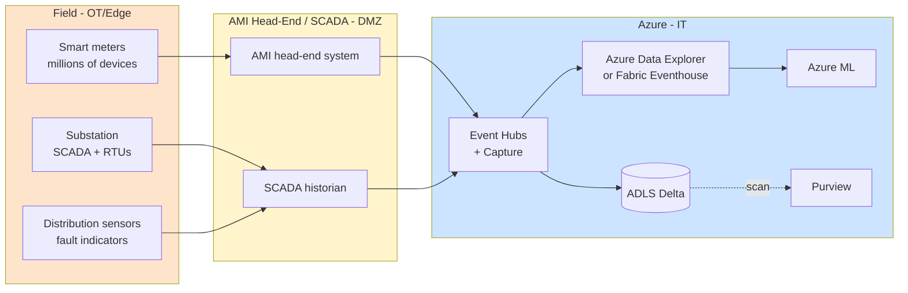

# Industry — Energy & Utilities

> **Scope:** Power generation, transmission, distribution, oil & gas, water utilities, renewables. Critical infrastructure, regulated monopolies in many regions, heavy IoT presence, safety-critical OT environments.

## Top scenarios

| Scenario | Pattern | Latency | Reference |
|----------|---------|---------|-----------|
| **Smart-grid telemetry** | Meter data + Eventhouse + dbt aggregations | seconds | [Tutorial 05 — Streaming Lambda](../tutorials/05-streaming-lambda/README.md), [Industries — Manufacturing](manufacturing.md) |
| **Asset performance management** | Sensor + ML + work-order integration | minutes | [Example — IoT Streaming](../examples/iot-streaming.md) |
| **Renewables forecasting** (wind / solar) | Weather + asset state + ML | hours | [Example — ML Lifecycle](../examples/ml-lifecycle.md) |
| **Outage prediction + restoration** | Real-time sensor + crew dispatch + customer comms | minutes | [Use Case — Anomaly Detection](../use-cases/realtime-intelligence-anomaly-detection.md) |
| **Demand response** | Real-time price signal + customer device control | seconds | Custom — see Energy patterns |
| **Pipeline / leak detection** (oil & gas) | Acoustic + pressure + ML + alerting | sub-second | [Industries — Manufacturing](manufacturing.md) (similar OT/IT pattern) |
| **Field worker GenAI** (manuals, schematics) | RAG + AI Search + mobile/offline | seconds | [Tutorial 08 — RAG](../tutorials/08-rag-vector-search/README.md) |
| **Customer billing analytics** | Meter data + dbt + Power BI for utility customers | daily | [Tutorial 11 — Data API Builder](../tutorials/11-data-api-builder/README.md) |
| **Carbon accounting / ESG** | Multi-source emission data + reporting | quarterly | [Tutorial 02 — Data Governance](../tutorials/02-data-governance/README.md) |

## Regulatory landscape

| Framework | Relevance |
|-----------|-----------|
| **NERC CIP** (North American electric) | Mandatory for bulk-electric system; affects OT cyber, asset inventory, change mgmt |
| **ISO 27019** (energy industry cyber) | Sector adaptation of ISO 27002 |
| **NIS2** (EU critical sectors, 2024) | Operational resilience + incident reporting for "essential entities" |
| **TSA Pipeline Security Directive** (US oil/gas) | Cyber requirements post-Colonial Pipeline |
| **GDPR** (EU residential customer data) | [Compliance — GDPR](../compliance/gdpr-privacy.md) |
| **C2M2** (DOE cyber maturity) | Voluntary but widely used self-assessment |
| **State PUC reporting** | Per-state customer data + reliability reporting |

## Reference architecture variations

### Smart grid + AMI ingest

Same OT/IT separation principles as [Manufacturing](manufacturing.md): one-way data flow, no cloud-to-PLC writes without functional safety review, NERC CIP scope explicitly bounded.

## Why the standard CSA-in-a-Box pattern works for energy

- Medallion + dbt = **reproducible regulator reports** (state PUCs, FERC, DOE)
- Event Hubs + Fabric Eventhouse / ADX = **purpose-built time-series for AMI** (billions of meter reads/day)
- Azure ML + MLflow = **forecasting model lifecycle** with versioning regulators care about
- Purview + classifications = **customer PII protection** for residential billing data
- Defender for IoT = **OT cyber visibility** (NERC CIP-007/008/010 evidence)

## What's specific to energy

- **Time-series cardinality is extreme.** Millions of meters × 15-minute reads + sub-second SCADA tags. Time-series database is not optional.
- **Regulator data residency** matters more than in most industries. State PUCs may require customer data stay in-state. Plan region selection accordingly.
- **NERC CIP scope is sticky.** Once a system is in CIP scope, getting it OUT requires demonstrating it has no impact on the BES. Design with explicit boundaries.
- **Renewables forecasting is the biggest ML opportunity.** Weather + asset state + market price + battery state = high-value optimization. Model latency requirement is hours, not seconds.
- **Field worker mobile** is underserved. Field workers spend hours looking up schematics, work orders, manuals. RAG over the asset corpus + offline mobile sync is high-impact.
- **Demand response** is becoming real-time at scale (DERMS, VPPs). The platform pattern is similar to anomaly detection but with **control feedback** — extra rigor on safety + auditability.

## Getting started

1. Read [Reference Architecture — Hub-Spoke](../reference-architecture/hub-spoke-topology.md) and [Data Flow](../reference-architecture/data-flow-medallion.md)
2. Walk [Tutorial 05 — Streaming Lambda](../tutorials/05-streaming-lambda/README.md) end-to-end
3. Adapt [Example — IoT Streaming](../examples/iot-streaming.md) to your meter / SCADA tag inventory
4. Add Fabric Eventhouse or Azure Data Explorer for time-series — see [Patterns — Streaming & CDC](../patterns/streaming-cdc.md)
5. If you're NERC-regulated: read [Compliance — NIST 800-53 r5](../compliance/nist-800-53-rev5.md) (CIP maps closely) and engage your CIP compliance team **before** any cloud migration
6. Pilot **one** forecasting model (renewables generation is a great starter) using [Example — ML Lifecycle](../examples/ml-lifecycle.md) as the template

## Related

- [Industries — Manufacturing](manufacturing.md) — OT/IT patterns transfer directly
- [Use Case — Anomaly Detection](../use-cases/realtime-intelligence-anomaly-detection.md)
- [Use Case — NOAA Climate Analytics](../use-cases/noaa-climate-analytics.md) — weather data integration patterns
- [Patterns — Streaming & CDC](../patterns/streaming-cdc.md)
- Azure for energy: https://www.microsoft.com/industry/energy
