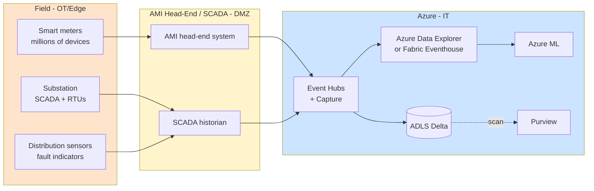
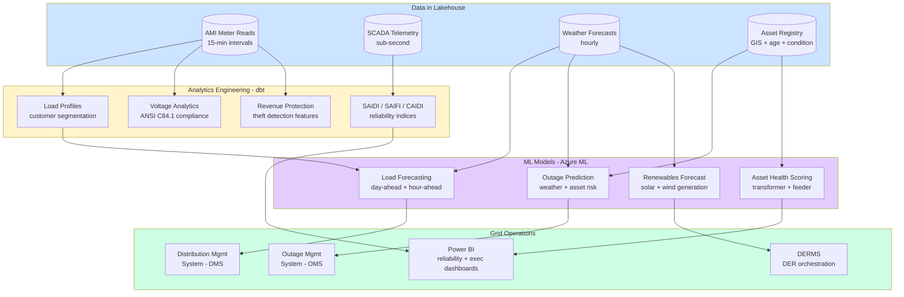

# Industry — Energy & Utilities

> **Scope:** Power generation, transmission, distribution, oil & gas, water utilities, renewables. Critical infrastructure, regulated monopolies in many regions, heavy IoT presence, safety-critical OT environments.

## Top scenarios

| Scenario                                     | Pattern                                           | Latency    | Reference                                                                                                                    |
| -------------------------------------------- | ------------------------------------------------- | ---------- | ---------------------------------------------------------------------------------------------------------------------------- |
| **Smart-grid telemetry**                     | Meter data + Eventhouse + dbt aggregations        | seconds    | [Tutorial 05 — Streaming Lambda](../tutorials/05-streaming-lambda/README.md), [Industries — Manufacturing](manufacturing.md) |
| **Asset performance management**             | Sensor + ML + work-order integration              | minutes    | [Example — IoT Streaming](../examples/iot-streaming.md)                                                                      |
| **Renewables forecasting** (wind / solar)    | Weather + asset state + ML                        | hours      | [Example — ML Lifecycle](../examples/ml-lifecycle.md)                                                                        |
| **Outage prediction + restoration**          | Real-time sensor + crew dispatch + customer comms | minutes    | [Use Case — Anomaly Detection](../use-cases/realtime-intelligence-anomaly-detection.md)                                      |
| **Demand response**                          | Real-time price signal + customer device control  | seconds    | Custom — see Energy patterns                                                                                                 |
| **Pipeline / leak detection** (oil & gas)    | Acoustic + pressure + ML + alerting               | sub-second | [Industries — Manufacturing](manufacturing.md) (similar OT/IT pattern)                                                       |
| **Field worker GenAI** (manuals, schematics) | RAG + AI Search + mobile/offline                  | seconds    | [Tutorial 08 — RAG](../tutorials/08-rag-vector-search/README.md)                                                             |
| **Customer billing analytics**               | Meter data + dbt + Power BI for utility customers | daily      | [Tutorial 11 — Data API Builder](../tutorials/11-data-api-builder/README.md)                                                 |
| **Carbon accounting / ESG**                  | Multi-source emission data + reporting            | quarterly  | [Tutorial 02 — Data Governance](../tutorials/02-data-governance/README.md)                                                   |

## Regulatory landscape

| Framework                                        | Relevance                                                                          |
| ------------------------------------------------ | ---------------------------------------------------------------------------------- |
| **NERC CIP** (North American electric)           | Mandatory for bulk-electric system; affects OT cyber, asset inventory, change mgmt |
| **ISO 27019** (energy industry cyber)            | Sector adaptation of ISO 27002                                                     |
| **NIS2** (EU critical sectors, 2024)             | Operational resilience + incident reporting for "essential entities"               |
| **TSA Pipeline Security Directive** (US oil/gas) | Cyber requirements post-Colonial Pipeline                                          |
| **GDPR** (EU residential customer data)          | [Compliance — GDPR](../compliance/gdpr-privacy.md)                                 |
| **C2M2** (DOE cyber maturity)                    | Voluntary but widely used self-assessment                                          |
| **State PUC reporting**                          | Per-state customer data + reliability reporting                                    |

## Reference architecture variations

### Smart grid + AMI ingest

Same OT/IT separation principles as [Manufacturing](manufacturing.md): one-way data flow, no cloud-to-PLC writes without functional safety review, NERC CIP scope explicitly bounded.

## Why the standard CSA-in-a-Box pattern works for energy

- Medallion + dbt = **reproducible regulator reports** (state PUCs, FERC, DOE)
- Event Hubs + Fabric Eventhouse / ADX = **purpose-built time-series for AMI** (billions of meter reads/day)
- Azure ML + MLflow = **forecasting model lifecycle** with versioning regulators care about
- Purview + classifications = **customer PII protection** for residential billing data
- Defender for IoT = **OT cyber visibility** (NERC CIP-007/008/010 evidence)

## What's specific to energy

- **Time-series cardinality is extreme.** Millions of meters × 15-minute reads + sub-second SCADA tags. Time-series database is not optional.
- **Regulator data residency** matters more than in most industries. State PUCs may require customer data stay in-state. Plan region selection accordingly.
- **NERC CIP scope is sticky.** Once a system is in CIP scope, getting it OUT requires demonstrating it has no impact on the BES. Design with explicit boundaries.
- **Renewables forecasting is the biggest ML opportunity.** Weather + asset state + market price + battery state = high-value optimization. Model latency requirement is hours, not seconds.
- **Field worker mobile** is underserved. Field workers spend hours looking up schematics, work orders, manuals. RAG over the asset corpus + offline mobile sync is high-impact.
- **Demand response** is becoming real-time at scale (DERMS, VPPs). The platform pattern is similar to anomaly detection but with **control feedback** — extra rigor on safety + auditability.

## Getting started

1. Read [Reference Architecture — Hub-Spoke](../reference-architecture/hub-spoke-topology.md) and [Data Flow](../reference-architecture/data-flow-medallion.md)
2. Walk [Tutorial 05 — Streaming Lambda](../tutorials/05-streaming-lambda/README.md) end-to-end
3. Adapt [Example — IoT Streaming](../examples/iot-streaming.md) to your meter / SCADA tag inventory
4. Add Fabric Eventhouse or Azure Data Explorer for time-series — see [Patterns — Streaming & CDC](../patterns/streaming-cdc.md)
5. If you're NERC-regulated: read [Compliance — NIST 800-53 r5](../compliance/nist-800-53-rev5.md) (CIP maps closely) and engage your CIP compliance team **before** any cloud migration
6. Pilot **one** forecasting model (renewables generation is a great starter) using [Example -- ML Lifecycle](../examples/ml-lifecycle.md) as the template

## Smart grid analytics pipeline

The AMI ingest diagram above shows how data enters the platform. The following diagram focuses on the analytics pipeline downstream -- how meter and sensor data becomes operational intelligence for grid management.

## Asset management

### Transformer health scoring

Power transformers are the most expensive and hardest-to-replace assets on the grid. A health scoring model combines multiple data sources into a single index that drives capital planning and maintenance prioritization.

| Data source                      | Key features                                                      | Refresh                             |
| -------------------------------- | ----------------------------------------------------------------- | ----------------------------------- |
| **Dissolved gas analysis (DGA)** | H2, CH4, C2H2, C2H4 concentrations; Duval triangle classification | Monthly lab results                 |
| **Oil quality**                  | Dielectric strength, moisture, acidity, interfacial tension       | Quarterly lab results               |
| **Loading history**              | Peak load as % of nameplate, cumulative overload hours            | Daily from AMI/SCADA                |
| **Age and design**               | Manufacture year, insulation class, cooling type, OEM             | Static from asset registry          |
| **Maintenance history**          | Past repairs, bushing replacements, tap changer operations        | Event-driven from work-order system |
| **Environmental**                | Ambient temperature extremes, coastal salt exposure, flood zone   | GIS + weather                       |

Compute the health index as a weighted composite or train a gradient-boosted model on historical failure data. Output a 1-100 score per transformer. Transformers scoring below threshold enter the capital replacement queue; those in the caution zone get accelerated inspection schedules.

### Vegetation management

Vegetation contact is the leading cause of distribution outages. Analytics improves targeting of tree-trimming crews:

- **LiDAR + satellite imagery** — identify encroachment zones where vegetation clearance is below minimum
- **Historical outage correlation** — overlay vegetation-caused outage locations with circuit GIS
- **Growth-rate modeling** — predict which circuits will reach critical clearance before the next trim cycle
- **Priority scoring** — rank circuits by (failure probability x customer impact x critical facility exposure)

Store vegetation risk scores in the gold layer, join with the GIS circuit model, and surface in Power BI maps for vegetation management planners.

### Outage prediction

Outage prediction models estimate the probability and severity of outages given weather forecasts and asset condition:

1. **Feature engineering** — combine weather forecast (wind speed, ice accumulation, lightning density), asset health scores, vegetation risk, and historical outage rates per circuit
2. **Model** — gradient-boosted classifier (LightGBM) predicting outage probability per circuit per 6-hour window
3. **Severity estimation** — regression model predicting customers affected and estimated restoration time
4. **Operational use** — pre-position crews, stage materials, prepare customer communications before the storm hits

!!! tip
Outage prediction models trained on your utility's historical data significantly outperform generic weather-severity models. Even two years of outage history correlated with weather gives a useful model. Retrain quarterly as asset condition changes.

## NERC CIP compliance mapping

The North American Electric Reliability Corporation Critical Infrastructure Protection (NERC CIP) standards are mandatory for bulk electric system (BES) operators. The table below maps CIP standards to CSA-in-a-Box controls.

| NERC CIP Standard | Requirement                     | CSA-in-a-Box Control                                                                                                                   |
| ----------------- | ------------------------------- | -------------------------------------------------------------------------------------------------------------------------------------- |
| **CIP-003**       | Security management controls    | [Best Practices -- Data Governance](../best-practices/data-governance.md), policy-as-code in IaC                                       |
| **CIP-004**       | Personnel and training          | Entra ID + PIM for access provisioning; access reviews via Identity Governance                                                         |
| **CIP-005**       | Electronic security perimeters  | Hub-spoke VNet topology with NSGs, Azure Firewall, Private Endpoints; see [Hub-Spoke](../reference-architecture/hub-spoke-topology.md) |
| **CIP-006**       | Physical security               | Out of scope for cloud platform (Azure datacenter physical security is covered by Azure compliance certifications)                     |
| **CIP-007**       | System security management      | Defender for Cloud secure-score policies, patch management, endpoint protection                                                        |
| **CIP-008**       | Incident reporting and response | Sentinel SIEM + playbooks + [runbooks](../runbooks/data-pipeline-failure.md)                                                           |
| **CIP-009**       | Recovery plans                  | [DR plan](../DR.md), backup/restore procedures, tested annually                                                                        |
| **CIP-010**       | Configuration change management | IaC (Bicep/Terraform) + GitHub PR workflows + deployment gates                                                                         |
| **CIP-011**       | Information protection          | Purview sensitivity labels + classification, encryption at rest (platform-managed or CMK)                                              |
| **CIP-013**       | Supply chain risk management    | Azure vendor risk documentation, third-party component inventory, SBOM for custom code                                                 |

!!! warning
NERC CIP scope determination (BES Cyber Systems and associated assets) should be done by your CIP compliance team, not your cloud architects. The analytics platform typically falls into "medium impact" or "low impact" BES Cyber Systems depending on how it connects to operational systems. Scope classification drives which CIP requirements apply. Get this determination in writing before designing the architecture.

## Renewable integration

### Solar and wind forecasting

Renewables forecasting is the highest-value ML use case for utilities with generation assets or DER programs. The pipeline:

1. **Weather data** — ingest numerical weather prediction (NWP) from NOAA GFS/HRRR models (free) or commercial providers (more granular)
2. **Asset data** — panel orientation, tilt, capacity, inverter specs (solar); hub height, rotor diameter, power curve (wind)
3. **Historical generation** — actual generation vs forecast for model training
4. **Features** — cloud cover, GHI (Global Horizontal Irradiance), wind speed at hub height, temperature, humidity, time-of-day
5. **Model** — gradient-boosted trees for day-ahead; LSTM or transformer for intra-day; physical models (PVLib for solar) as baselines

Forecast horizons and uses:

| Horizon         | Resolution | Primary use                               |
| --------------- | ---------- | ----------------------------------------- |
| 15-minute ahead | 5-min      | Real-time dispatch, AGC                   |
| Hour-ahead      | 15-min     | Intra-day market trading                  |
| Day-ahead       | Hourly     | Day-ahead market bidding, unit commitment |
| Week-ahead      | Daily      | Maintenance scheduling, fuel procurement  |

### Battery optimization

For utilities with battery energy storage systems (BESS), the optimization problem is: when to charge, when to discharge, and at what rate, given:

- **Wholesale energy prices** (LMP — locational marginal pricing)
- **Renewables forecast** (charge when excess solar, discharge when deficit)
- **Demand forecast** (peak shaving reduces demand charges)
- **Battery degradation model** (cycle count, depth of discharge, temperature affect battery life)

Implement as a mixed-integer linear program (MILP) or reinforcement learning agent. Score hourly, dispatch to DERMS/SCADA. Store optimization decisions and outcomes in gold for performance tracking.

### Demand response analytics

Demand response (DR) programs incentivize customers to reduce consumption during peak periods. Analytics supports DR in several ways:

- **Customer targeting** — identify customers with the most flexible load (high AC usage, EV charging, pool pumps) using AMI interval data
- **Baseline estimation** — calculate the counterfactual (what would the customer have consumed without DR?) using CAISO/PJM 10-in-10 baseline or regression-based methods
- **Performance measurement** — actual reduction vs baseline, program cost-effectiveness ($/kW reduced)
- **Optimization** — which customers to call, when, and with what incentive level to achieve the target demand reduction at minimum cost

## GIS integration

### Geospatial analytics with Azure Maps

Utility data is inherently geospatial. Azure Maps provides the visualization and geocoding layer; the analytics lives in your medallion lakehouse.

Key integration patterns:

- **Asset visualization** — plot transformers, feeders, substations, and meters on a map; color-code by health score, age, or loading
- **Outage mapping** — real-time outage polygons from OMS data; overlay with weather radar; show estimated restoration times per area
- **Service territory analysis** — customer density, revenue per square mile, infrastructure investment needs by area
- **Storm path overlay** — project forecasted storm path onto the grid model; highlight at-risk circuits and pre-position crews

### Field crew optimization

Field operations consume a significant portion of utility O&M budgets. Optimize crew dispatch using:

- **Route optimization** — minimize travel time for scheduled maintenance using vehicle routing problem (VRP) solvers
- **Dynamic dispatch** — during storms, reassign crews based on real-time outage priority, crew location, and skills match
- **Work-order clustering** — group nearby maintenance tasks into efficient field trips
- **Parts inventory** — predict which parts are needed based on asset health scores and failure modes; pre-stage in service vehicles

Surface crew assignments and optimized routes in a mobile-friendly Power BI report or a custom Power App with Azure Maps integration. See [Tutorial 11 -- Data API Builder](../tutorials/11-data-api-builder/README.md) for serving the data layer.

!!! note
For real-time fleet tracking and dynamic dispatch, consider Azure Maps Route API + Azure Functions for the optimization logic, with results written back to gold for performance analytics. The historical crew efficiency data in gold feeds back into improving the dispatch model.

## Carbon accounting and ESG

Utilities face increasing ESG (Environmental, Social, Governance) reporting requirements. Build carbon accounting into the platform from the start rather than bolting it on later.

### Emissions data pipeline

| Scope                                          | What to measure                                     | Data source                                   | Calculation                                 |
| ---------------------------------------------- | --------------------------------------------------- | --------------------------------------------- | ------------------------------------------- |
| **Scope 1** (direct)                           | Fossil fuel combustion at owned plants              | Plant fuel consumption records, EPA CEMS data | Fuel quantity x emission factor (EPA AP-42) |
| **Scope 2** (indirect - purchased electricity) | Grid electricity consumed at facilities             | Utility bills, interval meter data            | kWh consumed x grid emission factor (eGRID) |
| **Scope 3** (value chain)                      | Upstream fuel production, downstream customer usage | Supplier data, customer usage estimates       | Activity data x lifecycle emission factors  |

Build as a dbt pipeline: bronze captures raw consumption and generation data, silver standardizes units and applies emission factors, gold produces reporting-ready tables for GHG Protocol, CDP, and SEC climate disclosure. Version your emission factor tables in git so calculations are reproducible year-over-year.

### Renewable energy certificates (RECs)

Track REC generation, ownership transfers, and retirement in your gold layer. Each MWh of renewable generation produces one REC. Match RECs to customer programs (green tariffs, community solar) and corporate reporting needs. Integrate with registries (M-RETS, GATS, WREGIS) via API or batch extract.

## EV integration analytics

Electric vehicle charging is the fastest-growing load category for many utilities. Analytics supports grid planning and customer programs.

- **Charging load profiles** — identify when and where EV charging occurs using AMI data (detect EV charging signatures in household load curves)
- **Grid impact assessment** — model the impact of EV adoption scenarios on transformer loading, feeder capacity, and substation capacity by neighborhood
- **Managed charging programs** — analytics for time-of-use rate design and managed charging incentives that shift EV load to off-peak hours
- **Public charging infrastructure** — site selection for utility-owned chargers based on traffic patterns, grid capacity, and underserved areas

## Trade-offs

| Give                                               | Get                                                                             |
| -------------------------------------------------- | ------------------------------------------------------------------------------- |
| ADX/Eventhouse for time-series (dedicated service) | Sub-second queries on billions of meter reads, but additional service to manage |
| NERC CIP scope inclusion (cloud in BES scope)      | Full cloud analytics capability, but significant compliance overhead            |
| Edge inference for outage detection                | Faster detection during comms outages, but model update complexity              |
| Multi-region deployment (data residency per state) | PUC compliance, but higher infrastructure cost and operational complexity       |
| Granular AMI data (15-min intervals kept hot)      | Rich analytics capability, but significant storage cost at scale                |

## Related

- [Industries — Manufacturing](manufacturing.md) — OT/IT patterns transfer directly
- [Use Case — Anomaly Detection](../use-cases/realtime-intelligence-anomaly-detection.md)
- [Use Case — NOAA Climate Analytics](../use-cases/noaa-climate-analytics.md) — weather data integration patterns
- [Patterns — Streaming & CDC](../patterns/streaming-cdc.md)
- Azure for energy: https://www.microsoft.com/industry/energy
