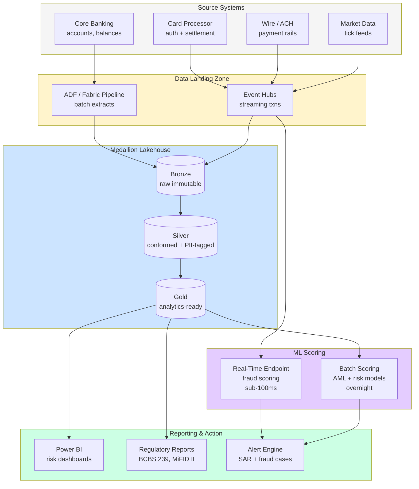
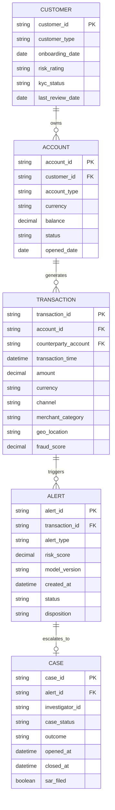

# Industry — Financial Services

> **Scope:** Banking, capital markets, insurance, wealth management. Heavy regulator presence, high data volumes, low-latency requirements, fraud as a constant adversary.

## Top scenarios

| Scenario                                      | Pattern                                  | Latency          | Reference                                                                                                                                                             |
| --------------------------------------------- | ---------------------------------------- | ---------------- | --------------------------------------------------------------------------------------------------------------------------------------------------------------------- |
| **Real-time fraud detection**                 | Streaming + ML scoring + write-back      | sub-100ms        | [Tutorial 05 — Streaming Lambda](../tutorials/05-streaming-lambda/README.md), [Use Case — Anomaly Detection](../use-cases/realtime-intelligence-anomaly-detection.md) |
| **AML transaction monitoring**                | Batch + graph + alert workflow           | minutes-hours    | [Example — ML Lifecycle](../examples/ml-lifecycle.md) (loan default → adapt for AML)                                                                                  |
| **Customer 360**                              | Medallion gold + reverse-ETL + Power BI  | minutes          | [Reference Arch — Data Flow](../reference-architecture/data-flow-medallion.md)                                                                                        |
| **Risk modeling (FRTB, IFRS 9)**              | Spark + Monte Carlo + result persistence | overnight        | [Tutorial 06 — AI Foundry](../tutorials/06-ai-analytics-foundry/README.md)                                                                                            |
| **Regulatory reporting (BCBS 239, MiFID II)** | dbt models + audit trail + signing       | daily            | [Best Practices — Data Governance](../best-practices/data-governance.md)                                                                                              |
| **Algorithmic trading research**              | Tick data + backtesting + ML             | research / batch | [Example — Streaming](../examples/streaming.md) (adapt)                                                                                                               |
| **Insurance claims AI triage**                | RAG + agents + claims-system integration | seconds          | [Tutorial 08 — RAG](../tutorials/08-rag-vector-search/README.md), [Tutorial 07 — Agents](../tutorials/07-agents-foundry-sk/README.md)                                 |
| **Customer GenAI (chat, doc Q&A)**            | RAG + grounding + content safety         | seconds          | [Example — AI Agents](../examples/ai-agents.md), [Example — Fabric Data Agent](../examples/fabric-data-agent.md)                                                      |

## Regulatory landscape

| Framework                                  | Where in CSA-in-a-Box                                                                                          |
| ------------------------------------------ | -------------------------------------------------------------------------------------------------------------- |
| **SOC 2 Type II**                          | [Compliance — SOC 2](../compliance/soc2-type2.md)                                                              |
| **PCI-DSS v4.0** (if handling card data)   | [Compliance — PCI-DSS](../compliance/pci-dss-v4.md)                                                            |
| **GDPR / CCPA**                            | [Compliance — GDPR](../compliance/gdpr-privacy.md)                                                             |
| **SOX** (public companies)                 | Same controls as SOC 2 + financial-reporting evidence                                                          |
| **GLBA** (US banks)                        | [Compliance — NIST 800-53](../compliance/nist-800-53-rev5.md) covers most                                      |
| **Basel III / FRTB** (capital adequacy)    | Out of scope for platform; the **risk model results** must be reproducible (use dbt + git)                     |
| **MiFID II** (EU markets)                  | Transaction reporting + best-execution evidence — capture in bronze, report from gold                          |
| **DORA** (EU operational resilience, 2025) | Heavy overlap with [DR.md](../DR.md) + [Runbooks](../runbooks/data-pipeline-failure.md); also third-party risk |

## Reference architecture variations

- **Tier-1 isolation**: separate DLZ subscription per LOB (retail / commercial / investment); shared DMLZ for governance
- **Sub-100ms inference**: Azure ML real-time endpoint behind a Premium APIM; deploy ONNX models to a dedicated GPU SKU
- **Tick data**: Event Hubs → Azure Data Explorer (Eventhouse in Fabric) for sub-second queries on TB+/day
- **Lineage for regulators**: Purview + dbt docs is the source of record for "where did this number come from?"

## Why the standard CSA-in-a-Box pattern works for FSI

- Medallion + dbt = **reproducible regulatory reports**
- Bronze immutability = **audit trail**
- Federated identity + PIM = **separation of duties** (CC6.x in SOC 2; SOX-relevant)
- Defender for Cloud + Sentinel = **continuous monitoring** (DORA, NYDFS Part 500)
- AOAI + content filters = **safe customer GenAI**

## What's specific to FSI

- **Latency**: real-time fraud scoring needs sub-100ms; standard batch dbt won't work. Use ML real-time endpoint + Cosmos for state.
- **Right of explanation** (EU AI Act, FCRA in US): every adverse decision must be explainable. Use **SHAP / LIME** in your training pipeline; log feature contributions per inference.
- **Model risk management** (SR 11-7, OCC 2011-12): formal model lifecycle — registration, validation, monitoring, retirement. Wrap MLflow + Azure ML Model Registry in a governance workflow.
- **Tick / market data** is the most expensive data category in any FSI platform. Azure Data Explorer / Fabric Eventhouse is purpose-built; don't try to use Synapse SQL for sub-second queries on TB-scale tick data.

## Getting started

1. Read [Reference Architecture — Hub-Spoke](../reference-architecture/hub-spoke-topology.md) and [Identity & Secrets Flow](../reference-architecture/identity-secrets-flow.md)
2. Pick a starting scenario from the table above
3. Walk the most-relevant tutorial end-to-end in dev
4. Adapt the closest [example](../examples/index.md) — usually `ml-lifecycle` or `cybersecurity` is the closest fit for FSI patterns
5. Review [Compliance — SOC 2](../compliance/soc2-type2.md) and your specific regulator's framework
6. Engage your model risk management team **before** deploying any ML model that drives a customer decision

## Transaction data-flow reference architecture

The following diagram shows how transaction data flows through the CSA-in-a-Box landing zone into a medallion lakehouse, through ML scoring, and out to regulatory reporting. Regulatory boundaries are marked explicitly so your compliance team can scope their review.

!!! note
The real-time fraud-scoring path bypasses the medallion pipeline intentionally. Transactions hit the ML endpoint directly from Event Hubs for sub-100ms latency, then land in bronze asynchronously for audit. See [Patterns -- Streaming & CDC](../patterns/streaming-cdc.md) for the dual-write pattern.

## Regulatory deep-dive

Each framework listed in the regulatory landscape table above has specific implications for how you configure the platform. This section expands on Azure implementation considerations for each.

### SOC 2 Type II

SOC 2 maps directly to the platform's security controls: CC6 (logical access) maps to Entra ID + PIM + Conditional Access, CC7 (system operations) maps to Defender for Cloud + Sentinel, and CC8 (change management) maps to IaC + GitHub PR approval workflows. The audit period is typically 6-12 months; start collecting evidence from day 1. See [Compliance -- SOC 2](../compliance/soc2-type2.md) for the full control mapping.

### PCI-DSS v4.0

The single most important design decision is scope minimization. Tokenize card data at the payment gateway or POS terminal so that raw PANs never reach the analytics platform. If you must process PANs, isolate them in a dedicated subscription with network segmentation and encrypt at rest with customer-managed keys in Azure Key Vault. SAQ-D self-assessment questionnaire applies when storing card data; SAQ-A applies when fully tokenized. See [Compliance -- PCI-DSS](../compliance/pci-dss-v4.md).

### GDPR

For EU banking customers, the right to erasure (Art. 17) conflicts with AML record-retention requirements (5+ years). Document this legal-basis conflict formally. Implement pseudonymization at the silver layer using deterministic encryption so that erasure requests can be satisfied by destroying the encryption key rather than scanning every table. Data Protection Impact Assessments (DPIAs) are required for automated decisioning that affects customers (Art. 35).

### SOX (Sarbanes-Oxley)

SOX Section 404 requires internal controls over financial reporting. In the data platform context this means: immutable bronze for audit trail, dbt version-controlled transformations for reproducibility, PIM-enforced separation of duties between data engineers and report publishers, and Power BI row-level security for financial data access. The external auditor needs evidence of these controls over a 12-month period.

### GLBA (Gramm-Leach-Bliley Act)

GLBA's Safeguards Rule requires a written information security plan. Most of the technical controls overlap with NIST 800-53 (see [Compliance -- NIST 800-53](../compliance/nist-800-53-rev5.md)). The key FSI-specific requirement is the annual privacy notice to customers explaining data sharing practices, which affects what data you can use for analytics and ML model training.

### Basel III / FRTB

The Fundamental Review of the Trading Book (FRTB) requires banks to compute risk measures (Expected Shortfall replacing VaR) using either the standardized approach or internal models approach (IMA). The platform's role is to provide reproducible computation pipelines: store market data in bronze, compute sensitivities in silver using Spark, aggregate risk measures in gold using dbt, and version everything with git tags. BCBS 239 (risk data aggregation) requires lineage from source to report, which Purview + dbt docs provide.

### MiFID II

MiFID II's transaction reporting obligation (Art. 26) requires T+1 reporting to the national competent authority. Best-execution evidence (Art. 27) requires capturing order timestamps, venue prices, and execution quality metrics. Capture raw execution data in bronze, compute best-execution analytics in silver, and generate RTS 25/28 reports from gold. The clock-synchronization requirement (UTC, microsecond precision) affects how you ingest timestamps from trading systems.

### DORA (Digital Operational Resilience Act)

DORA (effective January 2025 in the EU) requires ICT risk management, incident reporting, resilience testing, and third-party risk management. The CSA-in-a-Box [DR plan](../DR.md) and [runbooks](../runbooks/data-pipeline-failure.md) cover the operational resilience aspects. Third-party risk management requires documenting Azure as a critical ICT provider (Microsoft is classified as a Critical Third-Party Provider under DORA). Maintain a register of all ICT services and conduct annual scenario-based testing.

## Fraud detection patterns

### Real-time vs batch

| Dimension                   | Real-time scoring                                        | Batch scoring                               |
| --------------------------- | -------------------------------------------------------- | ------------------------------------------- |
| **Latency**                 | sub-100ms per transaction                                | minutes to hours                            |
| **Use case**                | Card-present auth, wire screening                        | AML pattern detection, account review       |
| **Architecture**            | Event Hubs → ML real-time endpoint → Cosmos DB for state | Gold tables → Spark/dbt → ML batch endpoint |
| **Model update frequency**  | Daily champion/challenger deploy                         | Weekly retrain, monthly validation          |
| **False-positive handling** | Auto-block + manual review queue                         | Case management workflow                    |

### Rule-based vs ML

Start with rules for compliance-mandated checks (OFAC screening, velocity limits, country blocks) and layer ML for pattern detection. A common production architecture uses a rule engine as the first gate (fast, explainable, auditable) with ML as a second pass for risk scoring. Never deploy ML-only without a rule backstop — regulators expect deterministic controls for known fraud typologies.

### Ensemble approaches

Production fraud systems rarely rely on a single model. A typical ensemble combines:

- **Gradient-boosted trees** (XGBoost/LightGBM) for tabular transaction features — these remain the best performers for structured fraud data
- **Graph neural networks** for relationship-based fraud (money mule rings, bust-out fraud) — use the transaction graph from silver
- **Isolation forests** or autoencoders for anomaly detection on unseen fraud patterns
- **Business rules** as hard constraints that override model scores

Combine scores using a calibrated meta-learner or a simple weighted average with business-rule overrides.

### Velocity features

Velocity features are the highest-signal inputs for real-time fraud models. Key examples:

- **Transaction count** in the last 1 / 5 / 15 / 60 minutes per card, per device, per IP
- **Cumulative amount** in the last 1 / 24 hours per account
- **Distinct merchant count** in the last hour per card
- **Geographic velocity** — distance between consecutive transactions divided by time elapsed (impossible-travel detection)
- **Channel switching** — number of channel changes (ATM → online → mobile) in a time window

Store velocity state in Cosmos DB (or Redis) for sub-millisecond lookups during real-time scoring. Backfill from silver for model training.

!!! tip
Feature stores (Azure ML managed feature store or Feast on AKS) unify real-time and batch feature computation. Define features once, compute them in both streaming and batch contexts, and avoid training/serving skew.

## Risk analytics

### VaR calculation pipeline

Value at Risk (VaR) — and its successor Expected Shortfall (ES) under FRTB — requires Monte Carlo simulation at portfolio scale. The pipeline:

1. **Market data** — bronze captures daily closes, curves, and volatility surfaces
2. **Risk factor generation** — silver models produce correlated scenario paths using Cholesky decomposition on the covariance matrix
3. **Pricing** — Spark distributes valuation of instruments across scenarios (typically 10,000+ paths)
4. **Aggregation** — dbt models in gold compute portfolio-level VaR/ES at multiple confidence levels (97.5%, 99%) and holding periods (1-day, 10-day)
5. **Backtesting** — compare predicted VaR against actual P&L; Basel traffic-light test determines capital add-on

Use Spark for the Monte Carlo engine (embarrassingly parallel across scenarios). Store scenario-level results in silver for regulatory drill-down; store aggregate risk measures in gold for dashboards and FRTB reporting.

### FRTB sensitivities

The FRTB standardized approach requires computing sensitivities (delta, vega, curvature) for every position across prescribed risk factors. Organize sensitivity computation as a dbt DAG: raw positions → instrument-level sensitivities → bucket-level aggregation → capital charge. Version the entire DAG with git tags so regulators can reproduce any historical calculation.

### Stress testing with Spark

Stress testing (CCAR/DFAST in the US, EBA in the EU) requires evaluating portfolio losses under macroeconomic scenarios. Use Spark to:

- Apply scenario-specific shocks to risk factors (interest rates, credit spreads, FX, equity)
- Revalue the portfolio under each scenario
- Compute loss distributions and capital impact
- Generate the scenario narrative + quantitative results for regulator submission

Store stress-test results in gold with full lineage back to the scenario definition and portfolio snapshot. Typical run times are overnight for a large bank portfolio; Spark auto-scaling handles the burst compute.

## Sample data model

The following entity-relationship diagram represents a core FSI schema covering accounts, transactions, fraud alerts, and investigation cases. This is a gold-layer logical model — adapt field names and types to your institution's data dictionary.

!!! note
This schema intentionally separates alerts from cases. Not every alert warrants investigation — the alert-to-case ratio is a key operational metric (target < 10% for mature systems). Track this ratio in your gold-layer KPI tables.

## AML and KYC analytics

Anti-Money Laundering (AML) and Know Your Customer (KYC) are distinct from fraud detection — they are compliance obligations with different analytical patterns.

### Transaction monitoring

AML transaction monitoring looks for patterns that indicate money laundering, terrorist financing, or sanctions evasion. Unlike fraud (which protects the bank), AML protects the financial system. Key pattern types:

- **Structuring** — multiple transactions just below reporting thresholds ($10K CTR, $3K record-keeping)
- **Rapid movement** — funds deposited and withdrawn quickly, often across accounts or entities
- **Geographic risk** — transactions involving OFAC-sanctioned countries or high-risk jurisdictions
- **Shell company activity** — complex layering through entities with no legitimate business activity
- **Unusual behavior** — activity inconsistent with the customer's profile, occupation, or stated purpose

Implement as a batch pipeline (daily or intra-day) in dbt. Each pattern becomes a dbt model that scores accounts and transactions. Alerts above threshold feed the case management workflow. The key metric is SAR (Suspicious Activity Report) conversion rate — too many false alerts exhaust investigators; too few mean missed obligations.

### Graph analytics for AML

Money laundering is inherently a network problem — funds flow through chains of accounts and entities. Graph analytics reveals patterns invisible to transaction-level analysis:

- **Community detection** — identify clusters of accounts that transact primarily with each other (potential mule networks)
- **Shortest-path analysis** — trace the path from high-risk source to destination, identifying intermediaries
- **Centrality scoring** — find hub accounts that connect otherwise-unrelated transaction clusters

Use Azure Cosmos DB (Gremlin API) or a graph library in Spark (GraphX, GraphFrames) for graph analytics. Store graph-derived features in the gold layer alongside transaction-monitoring alerts.

### Model risk management (SR 11-7)

Any ML model that drives a customer-facing decision or regulatory output must go through a formal model risk management process per Federal Reserve SR 11-7 and OCC 2011-12. The lifecycle:

| Phase           | Activities                                                            | Platform component                                             |
| --------------- | --------------------------------------------------------------------- | -------------------------------------------------------------- |
| **Development** | Feature engineering, model selection, training, initial validation    | Azure ML + MLflow experiment tracking                          |
| **Validation**  | Independent review of model assumptions, performance, and limitations | Separate validation environment; documented challenger testing |
| **Approval**    | Model risk committee review and sign-off                              | Git PR approval workflow + documented approval                 |
| **Deployment**  | Champion/challenger deployment, A/B testing                           | Azure ML managed endpoints + traffic splitting                 |
| **Monitoring**  | Ongoing performance tracking, data drift, concept drift               | Azure ML data drift monitors + custom dbt KPI models           |
| **Retirement**  | Formal decommission with documentation of replacement                 | MLflow model stage transition + archived artifacts             |

!!! tip
For Fabric-native ML implementations, see [Fabric Lakehouse patterns](https://fgarofalo56.github.io/Suppercharge_Microsoft_Fabric/) for integrating MLflow with the Fabric workspace.

## Trade-offs

| Give                                                  | Get                                                                        |
| ----------------------------------------------------- | -------------------------------------------------------------------------- |
| Sub-100ms real-time scoring (dedicated GPU endpoints) | Higher infrastructure cost but fraud blocked at point of transaction       |
| Separate subscription per LOB                         | Stronger isolation for regulators but more operational overhead            |
| SHAP/LIME explainability on every inference           | Regulatory compliance for adverse actions but 2-5x inference latency       |
| Full graph analytics for AML                          | Better network-level detection but significant data engineering investment |
| Customer-managed keys (CMK) for encryption            | Key control for compliance but operational complexity for key rotation     |

## FSI example

For a complete end-to-end walkthrough of fraud detection on this platform, see:

[Example -- Financial Fraud Detection](../examples/financial-fraud-detection.md)

## Related

- [Use Case — Real-Time Anomaly Detection](../use-cases/realtime-intelligence-anomaly-detection.md)
- [Use Case — Casino & Gaming Analytics](../use-cases/casino-gaming-analytics.md) (fraud patterns transfer to FSI)
- [Patterns — LLMOps & Evaluation](../patterns/llmops-evaluation.md)
- [Patterns — Streaming & CDC](../patterns/streaming-cdc.md)
