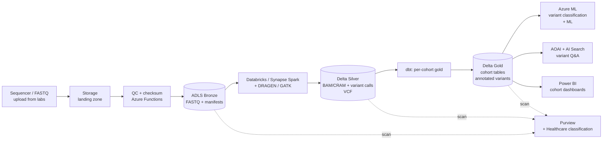
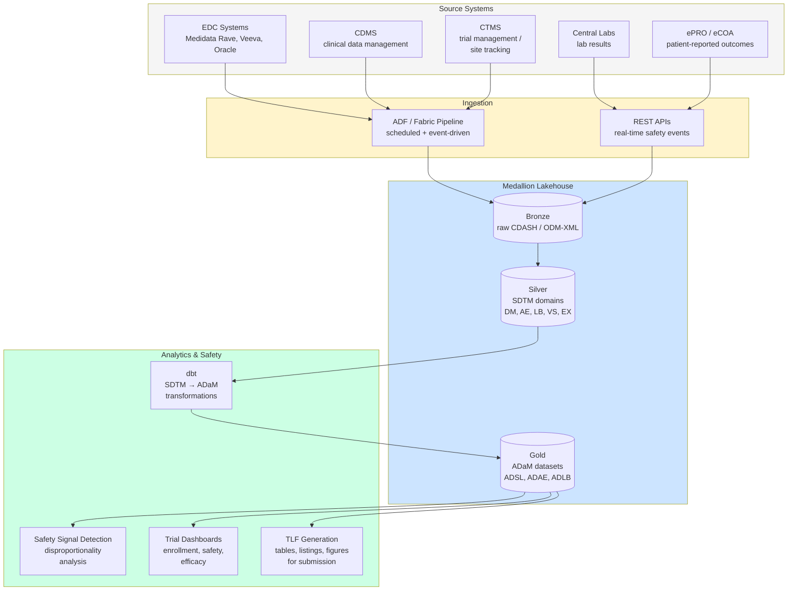

# Industry — Life Sciences & Genomics

> **Comparative positioning note.** This document is written from the
> perspective of Microsoft Azure, Cloud Scale Analytics, and CSA Loom. Any
> description of third-party or competing products, services, pricing, or
> capabilities is derived from **publicly available documentation and sources**
> believed accurate at the time of writing, and is provided for **general
> comparison only**. We do not claim expertise in, or authority over, any
> non-Microsoft product or service; the respective vendor's official
> documentation is the authoritative source for their offerings, which may
> change over time. Nothing here is intended to disparage any vendor — where a
> competing product has genuine advantages, we aim to note them honestly.
> Verify all third-party details against the vendor's current official
> documentation before making decisions.

> **Scope:** Pharma, biotech, contract research orgs, medical devices, genomics, clinical trials. Heavily regulated (FDA, EMA, MHRA), data is clinical (HIPAA + good practice frameworks), AI is transforming both R&D and commercial.

## Top scenarios

| Scenario                                                    | Pattern                                                       | Latency          | Reference                                                                                                                                          |
| ----------------------------------------------------------- | ------------------------------------------------------------- | ---------------- | -------------------------------------------------------------------------------------------------------------------------------------------------- |
| **Genomics pipelines** (variant calling, RNA-seq, assembly) | Spark + bioinformatics tools (DRAGEN, GATK, Nextflow) + Delta | hours-days       | [Tutorial 03 — GeoAnalytics OSS](../tutorials/03-geoanalytics-oss/README.md) (similar Spark patterns)                                              |
| **Clinical trial analytics**                                | EDC ingest + dbt + ADaM/SDTM models + regulator submissions   | daily            | [Tutorial 02 — Data Governance](../tutorials/02-data-governance/README.md)                                                                         |
| **Real-world evidence (RWE)**                               | Claims + EHR + registry + de-identification + ML              | weeks            | [Use Case — IHS Tribal Health](../use-cases/tribal-health-analytics.md) (HIPAA patterns)                                                           |
| **Drug discovery (cheminformatics, target ID)**             | RDKit / molecular models + ML + GenAI                         | research / batch | [Tutorial 06 — AI Foundry](../tutorials/06-ai-analytics-foundry/README.md), [Tutorial 09 — GraphRAG](../tutorials/09-graphrag-knowledge/README.md) |
| **Pharmacovigilance (adverse event signal)**                | Multi-source ingest + NLP + statistical signal                | daily            | [Tutorial 08 — RAG](../tutorials/08-rag-vector-search/README.md)                                                                                   |
| **Manufacturing (GxP biopharma)**                           | OT/IT + batch genealogy + 21 CFR Part 11 audit                | minutes          | [Industries — Manufacturing](manufacturing.md)                                                                                                     |
| **Medical affairs GenAI** (literature, KOL, MSL support)    | RAG over publication / internal corpus                        | seconds          | [Tutorial 08 — RAG](../tutorials/08-rag-vector-search/README.md), [Example — AI Agents](../examples/ai-agents.md)                                  |
| **Commercial analytics** (HCP/HCO 360, payer mix)           | Claims / promo / EHR + ML                                     | daily            | [Industries — Retail & CPG](retail-cpg.md) (similar customer-360 patterns)                                                                         |

## Regulatory landscape

| Framework                                                | Where in CSA-in-a-Box                                                                                                            |
| -------------------------------------------------------- | -------------------------------------------------------------------------------------------------------------------------------- |
| **HIPAA Security Rule** (PHI)                            | [Compliance — HIPAA](../compliance/hipaa-security-rule.md)                                                                       |
| **GDPR + EU Data Boundary**                              | [Compliance — GDPR](../compliance/gdpr-privacy.md) — EU subject genomic / clinical data is sensitive category (Art. 9)           |
| **21 CFR Part 11** (FDA electronic records / signatures) | Audit trail + access control + electronic signature design — uses [IaC + git](../IaC-CICD-Best-Practices.md) for change evidence |
| **GxP** (GLP / GCP / GMP / GVP)                          | Validation lifecycle for systems used in regulated work; CSA validates platform; you validate your scientific applications       |
| **GAMP 5**                                               | Risk-based system validation — categorize the platform appropriately                                                             |
| **EU MDR / IVDR** (medical devices)                      | If your platform supports a medical device, additional QMS + clinical evaluation                                                 |
| **HITRUST CSF** (US health)                              | Common control framework that maps HIPAA + NIST + ISO; popular B2B requirement                                                   |
| **State medical privacy** (e.g., NY SHIELD, CA CMIA)     | Tighter than HIPAA in places                                                                                                     |

## Reference architecture variations

### Genomics secondary analysis at scale

Key points:

- **PHI / DNA is sensitive-category** under GDPR Art. 9 — explicit basis required for EU subjects
- **Cohort gold tables** are the most-shared artifact; DAB or Synapse Serverless makes them queryable for downstream researchers
- **Bioinformatics tools are container-first**; AKS or Container Apps for orchestrating pipelines beyond what dbt covers
- **Don't reinvent variant calling** — use validated commercial tools (DRAGEN, Sentieon) or open-source pipelines (Nextflow, WDL) wrapped in the platform

### Clinical trials

- **EDC → ADaM/SDTM**: dbt is excellent at this; SDTM = silver, ADaM = gold
- **Submission packages**: Define.xml + datasets generated from gold; sign + archive in immutable storage with retention matching regulator (typically 25+ years)
- **Reproducibility**: Git tag every submission; container image of the dbt/R/SAS environment; audit trail must let you re-run the analysis years later

## Why the standard CSA-in-a-Box pattern works for life sciences

- Medallion + dbt = **reproducible analyses** that pass regulator scrutiny
- Bronze immutability + Purview = **21 CFR Part 11 audit trail** with classification
- IaC + git history + GitHub PR review = **CSV (computer system validation)** evidence
- Defender for Cloud + Sentinel = **HIPAA audit + breach detection**
- AOAI + Content Safety + grounding = **safe medical-affairs GenAI**
- AKS / Container Apps = **bioinformatics pipeline orchestration** beyond dbt

## What's specific to life sciences

- **Validation is the dominant cost.** GxP validation effort can dwarf development. Use the platform's IaC + audit trail to provide validation evidence; align with your CSV/CSA team early.
- **Data residency is per-trial.** A trial may have country-specific patient data residency requirements. Plan multi-region from the start.
- **Genomic data is huge AND sensitive.** A single human WGS = ~100GB FASTQ → ~30GB BAM → ~1GB VCF. At cohort scale this is petabytes. Cool/archive lifecycle is essential.
- **De-identification is technical and legal.** HIPAA Safe Harbor vs Expert Determination have different rigor. Implement de-identification as code; have an external Expert Determination if you go that route.
- **Real-world evidence (RWE) is the highest-growth analytics area.** Combining claims + EHR + registry + genomics requires strong identity resolution (often via privacy-preserving record linkage / honest broker patterns).
- **Medical affairs GenAI** is the most-deployed life sciences AI in 2025 — RAG over publications + internal MSL responses + KOL profiles. **Hallucination has direct patient-safety implications.** Mandatory citations + content filters + human-in-loop for any HCP-facing output.

## Getting started

1. Engage your **CSV / regulatory** team **before** any infrastructure work — validation strategy drives everything
2. Read [Compliance — HIPAA](../compliance/hipaa-security-rule.md) and [Compliance — GDPR](../compliance/gdpr-privacy.md)
3. Read [Identity & Secrets Flow](../reference-architecture/identity-secrets-flow.md) (PHI access controls)
4. Walk [Tutorial 02 — Data Governance](../tutorials/02-data-governance/README.md) — sensitive-data classification is foundational
5. Pick a starter scenario:
    - **Clinical analytics**: adapt [Example — Tribal Health](../examples/tribal-health.md) (HIPAA patterns + dbt clinical model)
    - **Genomics**: adapt [Example — GeoAnalytics](../examples/geoanalytics.md) (Spark patterns) + add bioinformatics containers via AKS
    - **Medical affairs GenAI**: walk [Tutorial 08 — RAG](../tutorials/08-rag-vector-search/README.md) end-to-end
6. **Before** any HCP- or patient-facing GenAI: review [Patterns -- LLMOps & Evaluation](../patterns/llmops-evaluation.md) and design your eval set with clinical SMEs

## Clinical trial analytics reference architecture

The following diagram shows the data flow from Electronic Data Capture (EDC) systems and Clinical Data Management Systems (CDMS) through the medallion lakehouse to trial dashboards and safety signal detection.

!!! note
SDTM (Study Data Tabulation Model) maps naturally to the silver layer, and ADaM (Analysis Data Model) maps to gold. This is not a coincidence -- both the medallion pattern and CDISC standards are designed around progressive refinement from raw to analysis-ready.

### CDISC standards in the medallion model

| CDISC Standard              | Medallion Layer | Implementation                                                                                                       |
| --------------------------- | --------------- | -------------------------------------------------------------------------------------------------------------------- |
| **CDASH** (data collection) | Bronze          | Raw CRF data as captured by EDC; preserve original field names                                                       |
| **SDTM** (tabulation)       | Silver          | Standardized domains (DM, AE, LB, VS, EX, etc.); controlled terminology applied                                      |
| **ADaM** (analysis)         | Gold            | Analysis-ready datasets (ADSL for subject level, ADAE for adverse events, ADLB for labs); derived variables computed |
| **Define.xml**              | Metadata        | Generated from dbt model metadata + Purview classifications; describes the submission package                        |

Implement SDTM-to-ADaM transformations as dbt models. Each ADaM variable derivation is a version-controlled SQL transformation with tests validating CDISC conformance rules. Use Pinnacle 21 (or OpenCST) as a validation step in your CI pipeline to catch CDISC violations before they reach regulatory submission.

## Pharmacovigilance

### Adverse event detection pipeline

Pharmacovigilance (PV) monitors drug safety after approval. The platform supports PV through automated signal detection from multiple data sources.

**Data sources:**

- **Spontaneous reports** — Individual Case Safety Reports (ICSRs) from MedWatch (FDA), EudraVigilance (EMA), VigiBase (WHO)
- **Clinical trial AE data** — adverse events from ongoing and completed trials
- **Real-world data** — insurance claims, EHR data, patient registries
- **Literature** — published case reports and safety studies (amenable to RAG + NLP extraction)
- **Social media / patient forums** — emerging signal detection (use with caution; high noise)

### FAERS reporting pipeline

The FDA Adverse Event Reporting System (FAERS) requires structured reporting. Build the pipeline as:

1. **Bronze** — ingest FAERS quarterly data extracts (publicly available for signal detection) and internal ICSR data
2. **Silver** — standardize drug names (map to RxNorm), medical terms (map to MedDRA preferred terms), and de-duplicate cases
3. **Gold** — compute disproportionality metrics per drug-event combination:
    - **PRR** (Proportional Reporting Ratio)
    - **ROR** (Reporting Odds Ratio)
    - **EBGM** (Empirical Bayesian Geometric Mean) — the FDA's preferred metric
    - **IC** (Information Component) — WHO's Bayesian metric
4. **Alerting** — flag drug-event pairs where EBGM > 2 and case count > 3 (standard thresholds) for medical review

### Signal detection

Signal detection is the statistical process of identifying potential safety issues from adverse event databases. Key considerations:

- **Masking** — a high-frequency event can mask signals for co-reported events. Use stratified analysis (by age, gender, indication) to unmask hidden signals.
- **Confounding by indication** — the disease being treated can cause the same adverse events attributed to the drug. Adjust for indication using logistic regression or case-control studies.
- **Temporal patterns** — time-to-onset analysis distinguishes acute reactions (days) from chronic effects (months/years). Implement Weibull shape parameter analysis in your gold layer.

!!! warning
Automated signal detection complements but does not replace medical review. Every statistical signal must be evaluated by a qualified pharmacovigilance professional before regulatory action. The platform provides the analytics; humans make the safety decisions.

## Genomics pipeline

### FASTQ to VCF processing

The genomics secondary analysis pipeline transforms raw sequencing output into clinically interpretable variant calls. The platform supports this at cohort scale.

**Pipeline stages:**

| Stage                | Input           | Output                   | Tool                                  | Compute                           |
| -------------------- | --------------- | ------------------------ | ------------------------------------- | --------------------------------- |
| **QC**               | FASTQ           | QC report                | FastQC, MultiQC                       | Azure Batch (low CPU)             |
| **Alignment**        | FASTQ           | BAM/CRAM                 | BWA-MEM2, DRAGEN                      | Azure Batch (high CPU, 32+ cores) |
| **Sorting + dedup**  | BAM             | Sorted, deduplicated BAM | Samtools, GATK MarkDuplicates         | Azure Batch                       |
| **Variant calling**  | BAM + reference | gVCF                     | GATK HaplotypeCaller, DeepVariant     | Azure Batch (GPU for DeepVariant) |
| **Joint genotyping** | gVCFs (cohort)  | Multi-sample VCF         | GATK GenomicsDBImport + GenotypeGVCFs | Spark on Databricks               |
| **Annotation**       | VCF             | Annotated VCF            | VEP, SnpEff, ClinVar                  | Azure Batch                       |
| **Filtering**        | Annotated VCF   | Filtered variants        | GATK VQSR or hard filters             | Spark                             |

### Variant calling with Cromwell/WDL on Azure Batch

Cromwell is the most widely used workflow engine for genomics pipelines. WDL (Workflow Description Language) defines the pipeline steps declaratively.

Deployment pattern on Azure:

1. **Cromwell server** — deploy on Azure Container Apps or AKS; connects to Azure Batch as the backend compute
2. **Azure Batch pools** — auto-scaling pools with genomics-optimized VM SKUs (HBv3 for CPU-intensive alignment, NCv3 for GPU-based DeepVariant)
3. **Storage** — FASTQ and intermediate files on ADLS; use lifecycle policies to move FASTQs to cool/archive after processing (they are rarely re-accessed)
4. **Workflow submission** — submit WDL workflows via Cromwell API; track progress in Cromwell metadata database (Azure SQL or Cosmos)
5. **Results to lakehouse** — final VCFs and QC metrics land in bronze; dbt transforms to silver (annotated variants) and gold (cohort-level variant tables)

!!! tip
Microsoft Genomics (now part of Azure HPC) provides a managed Cromwell-on-Azure deployment. If you prefer managed infrastructure, start there. If you need full control over the pipeline and custom tools, deploy Cromwell on AKS with the Azure Batch backend.

### Data volumes and cost management

Genomic data is large and grows fast. Plan storage and compute costs carefully:

| Data type          | Size per sample     | Retention              | Storage tier                 |
| ------------------ | ------------------- | ---------------------- | ---------------------------- |
| FASTQ (raw reads)  | 50-100 GB (WGS)     | Permanent (regulatory) | Cool → Archive after 90 days |
| BAM/CRAM (aligned) | 30-50 GB / 10-15 GB | Permanent              | Cool storage                 |
| VCF (variants)     | 0.5-1 GB            | Permanent              | Hot (frequently queried)     |
| QC metrics         | < 1 MB              | Permanent              | Hot                          |

At cohort scale (10,000+ samples), storage costs dominate compute costs. Use CRAM format (50-70% smaller than BAM) for aligned reads. Implement ADLS lifecycle management policies aggressively.

## Real-world evidence

### Claims data integration

Real-world evidence (RWE) uses non-clinical-trial data to evaluate treatment effectiveness and safety. Insurance claims data is the most accessible RWE source.

**Key data elements:**

- **Medical claims** — diagnosis codes (ICD-10), procedure codes (CPT), provider, dates, facility type
- **Pharmacy claims** — NDC codes, fill dates, days supply, quantity, prescriber
- **Enrollment** — coverage periods, plan type, demographics

Build claims data as a medallion pipeline: bronze preserves raw claims extracts, silver conforms to the OMOP Common Data Model (CDM) for standardization across data sources, gold produces analysis-ready cohorts.

### Patient journey mapping

Patient journey analysis traces a patient's healthcare interactions over time to understand treatment patterns, care gaps, and disease progression.

Implementation in dbt:

1. **`stg_claims_medical`** + **`stg_claims_pharmacy`** (silver) — standardized claims with OMOP concept IDs
2. **`int_patient_episodes`** — group related claims into care episodes using temporal clustering
3. **`fct_patient_journey`** (gold) — sequence of episodes per patient: diagnosis → first treatment → line of therapy changes → outcomes
4. **`rpt_treatment_pathways`** (gold) — Sankey-diagram-ready data showing the most common treatment sequences and where patients deviate from guidelines

### Treatment pathway analysis

Compare real-world treatment patterns against clinical guidelines to identify:

- **Guideline adherence** — what percentage of patients receive first-line therapy as recommended?
- **Line of therapy transitions** — when and why patients switch treatments
- **Time to treatment** — interval from diagnosis to first treatment (a quality metric)
- **Outcomes by pathway** — do patients on guideline-concordant pathways have better outcomes?

Use the OMOP CDM's drug-era and condition-era constructs to standardize treatment pathway definitions across data sources.

!!! note
RWE studies require careful attention to confounding. Patients who receive different treatments differ systematically (confounding by indication). Use propensity score matching, inverse probability weighting, or instrumental variables to adjust. Document your causal inference methodology rigorously — regulatory submissions (e.g., FDA's RWE Framework) scrutinize these methods.

## 21 CFR Part 11 compliance

### Electronic records and electronic signatures

21 CFR Part 11 establishes the FDA's criteria for accepting electronic records and electronic signatures as equivalent to paper records and handwritten signatures. This is relevant for any system that creates, modifies, maintains, archives, retrieves, or transmits records required by FDA regulations.

### Audit trail requirements

The platform must maintain a computer-generated, time-stamped audit trail that independently records the date and time of operator entries and actions. In CSA-in-a-Box:

| Part 11 Requirement               | Platform Implementation                                                                                                |
| --------------------------------- | ---------------------------------------------------------------------------------------------------------------------- |
| **Audit trail of record changes** | Bronze layer immutability (append-only Delta tables) + Purview scan history + git commit history for dbt model changes |
| **Operator identification**       | Entra ID authentication; all data access logged with user principal name                                               |
| **Time-stamped entries**          | UTC timestamps from Azure platform; NTP-synchronized across services                                                   |
| **Reason for change**             | Git commit messages for code/config changes; PR review comments for approval rationale                                 |
| **Record retention**              | ADLS lifecycle policies; regulatory retention typically 2 years after approval or investigation closure                |
| **Record availability**           | Data accessible throughout retention period; archive tier with documented retrieval procedures                         |

### Validation requirements

Systems subject to 21 CFR Part 11 must be validated to ensure accuracy, reliability, consistent intended performance, and the ability to discern invalid or altered records. The validation approach for CSA-in-a-Box:

- **IQ (Installation Qualification)** — IaC deployment produces a documented, reproducible environment; infrastructure tests validate that resources are provisioned correctly
- **OQ (Operational Qualification)** — dbt tests + integration tests validate that the system operates correctly under expected conditions
- **PQ (Performance Qualification)** — end-to-end test scenarios with known data validate that the system produces correct results for its intended use

!!! tip
Use the CSA (Computer Software Assurance) approach from FDA's 2022 guidance rather than the older CSV (Computer System Validation) approach. CSA emphasizes critical thinking and risk-based testing over exhaustive scripted testing, which aligns well with modern CI/CD practices. Your IaC + dbt tests + automated CI pipelines provide most of the validation evidence CSA requires.

### Electronic signatures

If the platform is used for regulatory submissions or GxP record approvals, implement electronic signatures using:

- **Entra ID** as the identity provider (unique user identification per Part 11.100)
- **Multi-factor authentication** for signature events (something you know + something you have)
- **Signature meaning** — capture the meaning of the signature (author, reviewer, approver) as metadata
- **Signature binding** — link the signature to the specific record version (git commit hash or Delta table version)

## De-identification patterns

Life sciences data frequently requires de-identification before analytics or sharing. HIPAA defines two methods; choose based on your use case.

### Safe Harbor vs Expert Determination

| Method                                   | What it requires                                                                                                      | When to use                                                          |
| ---------------------------------------- | --------------------------------------------------------------------------------------------------------------------- | -------------------------------------------------------------------- |
| **Safe Harbor** (164.514(b)(2))          | Remove 18 specified identifiers (name, SSN, dates, ZIP, etc.); no actual knowledge that residual info can re-identify | Lower-risk analytics, internal research, data sets with many records |
| **Expert Determination** (164.514(b)(1)) | Statistical expert certifies that risk of re-identification is "very small"                                           | Higher-risk sharing, small populations, rare diseases, genomic data  |

### Implementation in the medallion pipeline

Implement de-identification as a code-driven transformation in your silver layer:

1. **Bronze** — raw PHI, access restricted to data stewards under BAA
2. **Silver-PHI** — cleansed data with PHI intact; heavily access-controlled; used only for linkage and identity resolution
3. **Silver-deidentified** — Safe Harbor or Expert Determination applied; dates shifted, ZIP truncated to 3-digit, free-text fields NLP-scrubbed
4. **Gold** — analysis-ready data derived from de-identified silver; broadly accessible to researchers

!!! warning
Date shifting must be consistent per patient (same random offset applied to all dates for a given patient) to preserve temporal relationships. Store the offset mapping in a separate, access-controlled table. Destroy the mapping if you need to achieve true anonymization rather than pseudonymization.

## Trade-offs

| Give                                              | Get                                                                                           |
| ------------------------------------------------- | --------------------------------------------------------------------------------------------- |
| GxP validation of the platform (IQ/OQ/PQ)         | Regulatory acceptance for clinical use but significant upfront effort and ongoing maintenance |
| Expert Determination for de-identification        | More data utility preserved but cost of statistical expert and ongoing re-certification       |
| CRAM format for aligned reads (smaller files)     | 50-70% storage savings but slightly slower random access than BAM                             |
| OMOP CDM for RWE (standardized data model)        | Cross-study comparability but ETL effort to map proprietary data sources                      |
| On-premises sequencer gateway (air-gapped upload) | Stronger biosecurity for novel pathogens but slower data transfer to cloud                    |

## Related

- [Use Case — IHS / Tribal Health](../use-cases/tribal-health-analytics.md) — HIPAA-bounded clinical patterns
- [Use Case — AI Document Analytics & eDiscovery](../use-cases/ai-document-analytics-ediscovery.md) — patterns transfer to medical literature search
- [Compliance — HIPAA](../compliance/hipaa-security-rule.md)
- [Compliance — GDPR](../compliance/gdpr-privacy.md)
- [Patterns — LLMOps & Evaluation](../patterns/llmops-evaluation.md)
- Azure for healthcare: https://www.microsoft.com/industry/health/microsoft-cloud-for-healthcare
- Azure Genomics: https://learn.microsoft.com/azure/architecture/example-scenario/precision-medicine/genomic-analysis-reporting
