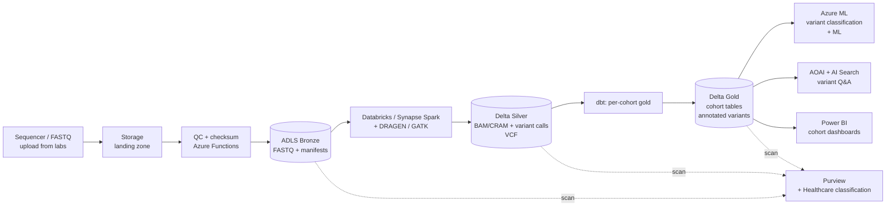

# Industry — Life Sciences & Genomics

> **Scope:** Pharma, biotech, contract research orgs, medical devices, genomics, clinical trials. Heavily regulated (FDA, EMA, MHRA), data is clinical (HIPAA + good practice frameworks), AI is transforming both R&D and commercial.

## Top scenarios

| Scenario | Pattern | Latency | Reference |
|----------|---------|---------|-----------|
| **Genomics pipelines** (variant calling, RNA-seq, assembly) | Spark + bioinformatics tools (DRAGEN, GATK, Nextflow) + Delta | hours-days | [Tutorial 03 — GeoAnalytics OSS](../tutorials/03-geoanalytics-oss/README.md) (similar Spark patterns) |
| **Clinical trial analytics** | EDC ingest + dbt + ADaM/SDTM models + regulator submissions | daily | [Tutorial 02 — Data Governance](../tutorials/02-data-governance/README.md) |
| **Real-world evidence (RWE)** | Claims + EHR + registry + de-identification + ML | weeks | [Use Case — IHS Tribal Health](../use-cases/tribal-health-analytics.md) (HIPAA patterns) |
| **Drug discovery (cheminformatics, target ID)** | RDKit / molecular models + ML + GenAI | research / batch | [Tutorial 06 — AI Foundry](../tutorials/06-ai-analytics-foundry/README.md), [Tutorial 09 — GraphRAG](../tutorials/09-graphrag-knowledge/README.md) |
| **Pharmacovigilance (adverse event signal)** | Multi-source ingest + NLP + statistical signal | daily | [Tutorial 08 — RAG](../tutorials/08-rag-vector-search/README.md) |
| **Manufacturing (GxP biopharma)** | OT/IT + batch genealogy + 21 CFR Part 11 audit | minutes | [Industries — Manufacturing](manufacturing.md) |
| **Medical affairs GenAI** (literature, KOL, MSL support) | RAG over publication / internal corpus | seconds | [Tutorial 08 — RAG](../tutorials/08-rag-vector-search/README.md), [Example — AI Agents](../examples/ai-agents.md) |
| **Commercial analytics** (HCP/HCO 360, payer mix) | Claims / promo / EHR + ML | daily | [Industries — Retail & CPG](retail-cpg.md) (similar customer-360 patterns) |

## Regulatory landscape

| Framework | Where in CSA-in-a-Box |
|-----------|----------------------|
| **HIPAA Security Rule** (PHI) | [Compliance — HIPAA](../compliance/hipaa-security-rule.md) |
| **GDPR + EU Data Boundary** | [Compliance — GDPR](../compliance/gdpr-privacy.md) — EU subject genomic / clinical data is sensitive category (Art. 9) |
| **21 CFR Part 11** (FDA electronic records / signatures) | Audit trail + access control + electronic signature design — uses [IaC + git](../IaC-CICD-Best-Practices.md) for change evidence |
| **GxP** (GLP / GCP / GMP / GVP) | Validation lifecycle for systems used in regulated work; CSA validates platform; you validate your scientific applications |
| **GAMP 5** | Risk-based system validation — categorize the platform appropriately |
| **EU MDR / IVDR** (medical devices) | If your platform supports a medical device, additional QMS + clinical evaluation |
| **HITRUST CSF** (US health) | Common control framework that maps HIPAA + NIST + ISO; popular B2B requirement |
| **State medical privacy** (e.g., NY SHIELD, CA CMIA) | Tighter than HIPAA in places |

## Reference architecture variations

### Genomics secondary analysis at scale

Key points:
- **PHI / DNA is sensitive-category** under GDPR Art. 9 — explicit basis required for EU subjects
- **Cohort gold tables** are the most-shared artifact; DAB or Synapse Serverless makes them queryable for downstream researchers
- **Bioinformatics tools are container-first**; AKS or Container Apps for orchestrating pipelines beyond what dbt covers
- **Don't reinvent variant calling** — use validated commercial tools (DRAGEN, Sentieon) or open-source pipelines (Nextflow, WDL) wrapped in the platform

### Clinical trials

- **EDC → ADaM/SDTM**: dbt is excellent at this; SDTM = silver, ADaM = gold
- **Submission packages**: Define.xml + datasets generated from gold; sign + archive in immutable storage with retention matching regulator (typically 25+ years)
- **Reproducibility**: Git tag every submission; container image of the dbt/R/SAS environment; audit trail must let you re-run the analysis years later

## Why the standard CSA-in-a-Box pattern works for life sciences

- Medallion + dbt = **reproducible analyses** that pass regulator scrutiny
- Bronze immutability + Purview = **21 CFR Part 11 audit trail** with classification
- IaC + git history + GitHub PR review = **CSV (computer system validation)** evidence
- Defender for Cloud + Sentinel = **HIPAA audit + breach detection**
- AOAI + Content Safety + grounding = **safe medical-affairs GenAI**
- AKS / Container Apps = **bioinformatics pipeline orchestration** beyond dbt

## What's specific to life sciences

- **Validation is the dominant cost.** GxP validation effort can dwarf development. Use the platform's IaC + audit trail to provide validation evidence; align with your CSV/CSA team early.
- **Data residency is per-trial.** A trial may have country-specific patient data residency requirements. Plan multi-region from the start.
- **Genomic data is huge AND sensitive.** A single human WGS = ~100GB FASTQ → ~30GB BAM → ~1GB VCF. At cohort scale this is petabytes. Cool/archive lifecycle is essential.
- **De-identification is technical and legal.** HIPAA Safe Harbor vs Expert Determination have different rigor. Implement de-identification as code; have an external Expert Determination if you go that route.
- **Real-world evidence (RWE) is the highest-growth analytics area.** Combining claims + EHR + registry + genomics requires strong identity resolution (often via privacy-preserving record linkage / honest broker patterns).
- **Medical affairs GenAI** is the most-deployed life sciences AI in 2025 — RAG over publications + internal MSL responses + KOL profiles. **Hallucination has direct patient-safety implications.** Mandatory citations + content filters + human-in-loop for any HCP-facing output.

## Getting started

1. Engage your **CSV / regulatory** team **before** any infrastructure work — validation strategy drives everything
2. Read [Compliance — HIPAA](../compliance/hipaa-security-rule.md) and [Compliance — GDPR](../compliance/gdpr-privacy.md)
3. Read [Identity & Secrets Flow](../reference-architecture/identity-secrets-flow.md) (PHI access controls)
4. Walk [Tutorial 02 — Data Governance](../tutorials/02-data-governance/README.md) — sensitive-data classification is foundational
5. Pick a starter scenario:
   - **Clinical analytics**: adapt [Example — Tribal Health](../examples/tribal-health.md) (HIPAA patterns + dbt clinical model)
   - **Genomics**: adapt [Example — GeoAnalytics](../examples/geoanalytics.md) (Spark patterns) + add bioinformatics containers via AKS
   - **Medical affairs GenAI**: walk [Tutorial 08 — RAG](../tutorials/08-rag-vector-search/README.md) end-to-end
6. **Before** any HCP- or patient-facing GenAI: review [Patterns — LLMOps & Evaluation](../patterns/llmops-evaluation.md) and design your eval set with clinical SMEs

## Related

- [Use Case — IHS / Tribal Health](../use-cases/tribal-health-analytics.md) — HIPAA-bounded clinical patterns
- [Use Case — AI Document Analytics & eDiscovery](../use-cases/ai-document-analytics-ediscovery.md) — patterns transfer to medical literature search
- [Compliance — HIPAA](../compliance/hipaa-security-rule.md)
- [Compliance — GDPR](../compliance/gdpr-privacy.md)
- [Patterns — LLMOps & Evaluation](../patterns/llmops-evaluation.md)
- Azure for healthcare: https://www.microsoft.com/industry/health/microsoft-cloud-for-healthcare
- Azure Genomics: https://learn.microsoft.com/azure/architecture/example-scenario/precision-medicine/genomic-analysis-reporting
