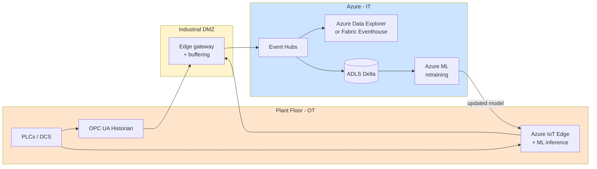

# Industry — Manufacturing

> **Scope:** Discrete and process manufacturing, industrial IoT, OT/IT convergence, supply-chain optimization. Heavy edge presence, high data volumes from sensors, safety-critical environments.

## Top scenarios

| Scenario                                        | Pattern                                                           | Latency       | Reference                                                                                            |
| ----------------------------------------------- | ----------------------------------------------------------------- | ------------- | ---------------------------------------------------------------------------------------------------- |
| **Predictive maintenance**                      | IoT → streaming + ML scoring + work-order integration             | minutes       | [Example — IoT Streaming](../examples/iot-streaming.md)                                              |
| **Digital twin**                                | Real-time state in Cosmos + historian in Delta + 3D visualization | seconds       | [Reference Arch — Data Flow](../reference-architecture/data-flow-medallion.md) + Azure Digital Twins |
| **OEE (Overall Equipment Effectiveness)**       | Tag-data ingest + dbt aggregations + Power BI                     | minutes-hours | [Tutorial 05 — Streaming Lambda](../tutorials/05-streaming-lambda/README.md)                         |
| **Quality / SPC (Statistical Process Control)** | Streaming + control-chart logic + alerting                        | seconds       | [Use Case — Anomaly Detection](../use-cases/realtime-intelligence-anomaly-detection.md)              |
| **Supply chain visibility**                     | Multi-source ingest + graph + ML for ETA prediction               | hours         | [Tutorial 09 — GraphRAG](../tutorials/09-graphrag-knowledge/README.md)                               |
| **Demand forecasting**                          | Historical sales + external signals + ML                          | daily         | [Example — ML Lifecycle](../examples/ml-lifecycle.md)                                                |
| **Energy optimization**                         | Sub-meter ingest + ML + control system feedback                   | minutes       | [Industries — Energy & Utilities](energy-utilities.md)                                               |
| **Computer vision QC**                          | Edge inference + cloud retraining + drift detection               | sub-second    | [Patterns — LLMOps](../patterns/llmops-evaluation.md) (transfer learning patterns)                   |

## Regulatory landscape

| Framework                               | Relevance                                                                                     |
| --------------------------------------- | --------------------------------------------------------------------------------------------- |
| **NIST CSF**                            | Generic cyber framework; widely adopted                                                       |
| **IEC 62443** (OT cybersecurity)        | Required for any OT/IT integration touching control systems                                   |
| **ITAR / EAR** (US export control)      | Required for defense / dual-use; affects where data can be processed (US persons, US regions) |
| **GDPR** (employee data, EU operations) | [Compliance — GDPR](../compliance/gdpr-privacy.md)                                            |
| **NIS2** (EU critical sectors)          | Operational resilience for "essential entities"                                               |
| **C2M2** (energy + manufacturing)       | DOE-sponsored cyber maturity model                                                            |

## Reference architecture variations

### Edge-cloud hybrid

Key principles:

- **Edge first**: latency-sensitive inference runs at the edge (Azure IoT Edge); cloud is for retraining + visualization + analytics
- **One-way data flow** from OT to IT (network DMZ + diode pattern); never let cloud control plane talk back to PLCs without explicit safety review
- **OPC UA is the standard** for tag data; use the Microsoft OPC UA Edge module
- **Azure Data Explorer / Fabric Eventhouse** is the right home for high-cardinality time-series (millions of tags × 1-10s sample rate = billions of points/day)

## Why the standard CSA-in-a-Box pattern works for manufacturing

- Medallion + dbt = **reproducible OEE / quality reports**
- Event Hubs + Capture = **bronze for streaming sensor data**
- Azure ML + MLflow = **predictive maintenance model lifecycle**
- Purview = **catalog + lineage** for plant data (good for ISO 27001 / IEC 62443)
- Fabric RTI / ADX = **the time-series engine** that's missing from generic medallion examples

## What's specific to manufacturing

- **OT/IT convergence** is a security boundary, not a network boundary. Use Defender for IoT to monitor OT networks; never collapse the two networks just because the data needs to flow.
- **Data volume from sensors** dwarfs everything else: a single line with 5,000 tags at 1Hz = 432M points/day. **Time-series databases (ADX / Eventhouse) are not optional** at this scale.
- **Latency** for predictive maintenance is measured in machine cycles, not seconds. Plan to deploy inference to the edge (Azure IoT Edge + ONNX); cloud-only inference adds RTT that breaks the value prop.
- **Data quality is operational** — sensor drift, calibration, missing values are the norm. dbt tests + Great Expectations on bronze are mandatory, not optional.
- **Safety-critical isolation** — never integrate analytics output into a control loop without functional-safety review (IEC 61508 / ISO 13849). "Recommendation engine" yes; "automated parameter change" no without explicit safety design.

## Getting started

1. Read [Reference Architecture — Data Flow](../reference-architecture/data-flow-medallion.md)
2. Walk [Tutorial 05 — Streaming Lambda](../tutorials/05-streaming-lambda/README.md) end-to-end — the patterns transfer directly
3. Adapt [Example — IoT Streaming](../examples/iot-streaming.md) to your tag inventory
4. Add a time-series store (Fabric Eventhouse or ADX) — see [Patterns — Streaming & CDC](../patterns/streaming-cdc.md)
5. Pilot **one** predictive maintenance model end-to-end ([Example — ML Lifecycle](../examples/ml-lifecycle.md) is the closest template) before scaling to a fleet

## Related

- [Industries — Energy & Utilities](energy-utilities.md) — heavy overlap on smart-grid IoT
- [Use Case — Anomaly Detection](../use-cases/realtime-intelligence-anomaly-detection.md)
- [Patterns — Streaming & CDC](../patterns/streaming-cdc.md)
- [Patterns — Observability with OTel](../patterns/observability-otel.md)
- Azure Industrial IoT: https://learn.microsoft.com/azure/industrial-iot/
- Azure Digital Twins: https://learn.microsoft.com/azure/digital-twins/
