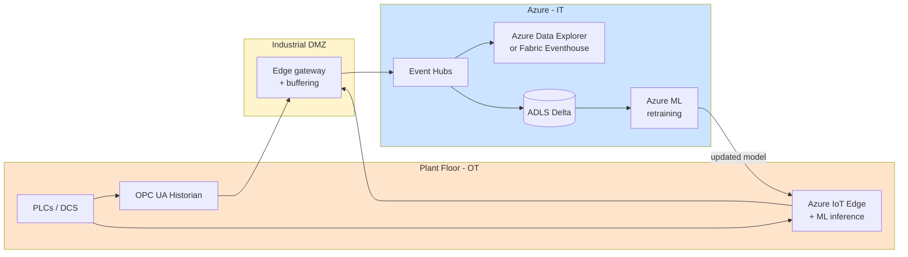
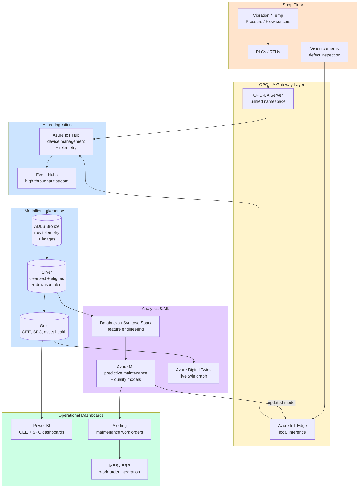

# Industry — Manufacturing

> **Scope:** Discrete and process manufacturing, industrial IoT, OT/IT convergence, supply-chain optimization. Heavy edge presence, high data volumes from sensors, safety-critical environments.

## Top scenarios

| Scenario                                        | Pattern                                                           | Latency       | Reference                                                                                            |
| ----------------------------------------------- | ----------------------------------------------------------------- | ------------- | ---------------------------------------------------------------------------------------------------- |
| **Predictive maintenance**                      | IoT → streaming + ML scoring + work-order integration             | minutes       | [Example — IoT Streaming](../examples/iot-streaming.md)                                              |
| **Digital twin**                                | Real-time state in Cosmos + historian in Delta + 3D visualization | seconds       | [Reference Arch — Data Flow](../reference-architecture/data-flow-medallion.md) + Azure Digital Twins |
| **OEE (Overall Equipment Effectiveness)**       | Tag-data ingest + dbt aggregations + Power BI                     | minutes-hours | [Tutorial 05 — Streaming Lambda](../tutorials/05-streaming-lambda/README.md)                         |
| **Quality / SPC (Statistical Process Control)** | Streaming + control-chart logic + alerting                        | seconds       | [Use Case — Anomaly Detection](../use-cases/realtime-intelligence-anomaly-detection.md)              |
| **Supply chain visibility**                     | Multi-source ingest + graph + ML for ETA prediction               | hours         | [Tutorial 09 — GraphRAG](../tutorials/09-graphrag-knowledge/README.md)                               |
| **Demand forecasting**                          | Historical sales + external signals + ML                          | daily         | [Example — ML Lifecycle](../examples/ml-lifecycle.md)                                                |
| **Energy optimization**                         | Sub-meter ingest + ML + control system feedback                   | minutes       | [Industries — Energy & Utilities](energy-utilities.md)                                               |
| **Computer vision QC**                          | Edge inference + cloud retraining + drift detection               | sub-second    | [Patterns — LLMOps](../patterns/llmops-evaluation.md) (transfer learning patterns)                   |

## Regulatory landscape

| Framework                               | Relevance                                                                                     |
| --------------------------------------- | --------------------------------------------------------------------------------------------- |
| **NIST CSF**                            | Generic cyber framework; widely adopted                                                       |
| **IEC 62443** (OT cybersecurity)        | Required for any OT/IT integration touching control systems                                   |
| **ITAR / EAR** (US export control)      | Required for defense / dual-use; affects where data can be processed (US persons, US regions) |
| **GDPR** (employee data, EU operations) | [Compliance — GDPR](../compliance/gdpr-privacy.md)                                            |
| **NIS2** (EU critical sectors)          | Operational resilience for "essential entities"                                               |
| **C2M2** (energy + manufacturing)       | DOE-sponsored cyber maturity model                                                            |

## Reference architecture variations

### Edge-cloud hybrid



Key principles:

- **Edge first**: latency-sensitive inference runs at the edge (Azure IoT Edge); cloud is for retraining + visualization + analytics
- **One-way data flow** from OT to IT (network DMZ + diode pattern); never let cloud control plane talk back to PLCs without explicit safety review
- **OPC UA is the standard** for tag data; use the Microsoft OPC UA Edge module
- **Azure Data Explorer / Fabric Eventhouse** is the right home for high-cardinality time-series (millions of tags × 1-10s sample rate = billions of points/day)

## Why the standard CSA-in-a-Box pattern works for manufacturing

- Medallion + dbt = **reproducible OEE / quality reports**
- Event Hubs + Capture = **bronze for streaming sensor data**
- Azure ML + MLflow = **predictive maintenance model lifecycle**
- Purview = **catalog + lineage** for plant data (good for ISO 27001 / IEC 62443)
- Fabric RTI / ADX = **the time-series engine** that's missing from generic medallion examples

## What's specific to manufacturing

- **OT/IT convergence** is a security boundary, not a network boundary. Use Defender for IoT to monitor OT networks; never collapse the two networks just because the data needs to flow.
- **Data volume from sensors** dwarfs everything else: a single line with 5,000 tags at 1Hz = 432M points/day. **Time-series databases (ADX / Eventhouse) are not optional** at this scale.
- **Latency** for predictive maintenance is measured in machine cycles, not seconds. Plan to deploy inference to the edge (Azure IoT Edge + ONNX); cloud-only inference adds RTT that breaks the value prop.
- **Data quality is operational** — sensor drift, calibration, missing values are the norm. dbt tests + Great Expectations on bronze are mandatory, not optional.
- **Safety-critical isolation** — never integrate analytics output into a control loop without functional-safety review (IEC 61508 / ISO 13849). "Recommendation engine" yes; "automated parameter change" no without explicit safety design.

## Getting started

1. Read [Reference Architecture — Data Flow](../reference-architecture/data-flow-medallion.md)
2. Walk [Tutorial 05 — Streaming Lambda](../tutorials/05-streaming-lambda/README.md) end-to-end — the patterns transfer directly
3. Adapt [Example — IoT Streaming](../examples/iot-streaming.md) to your tag inventory
4. Add a time-series store (Fabric Eventhouse or ADX) — see [Patterns — Streaming & CDC](../patterns/streaming-cdc.md)
5. Pilot **one** predictive maintenance model end-to-end ([Example — ML Lifecycle](../examples/ml-lifecycle.md) is the closest template) before scaling to a fleet

## IIoT reference architecture

The diagram below shows the full path from shop-floor sensors through cloud analytics and back to operational dashboards. This complements the edge-cloud hybrid diagram above by focusing on the analytics pipeline.



## OPC-UA ingestion

OPC-UA (Open Platform Communications Unified Architecture) is the dominant protocol for industrial data integration. Getting the ingestion right is the foundation for everything else.

### Connecting OPC-UA to Azure IoT Hub

The recommended path uses the **Azure IoT Edge OPC UA module** (also called OPC Publisher), which runs as a container on an IoT Edge device at the plant:

1. **Deploy IoT Edge** on a gateway machine in the industrial DMZ (Linux VM or ruggedized hardware)
2. **Configure OPC Publisher** with a `publishednodes.json` file that lists the OPC-UA node IDs and sampling intervals for each tag
3. **IoT Hub** receives telemetry as JSON messages; use message routing to send to Event Hubs for analytics and to storage for cold archive
4. **Device twin** manages configuration remotely — you can update sampling rates, add/remove tags, and deploy new edge modules without touching the plant floor

### Data format considerations

| Decision             | Recommendation                                                  | Rationale                                                                                                                   |
| -------------------- | --------------------------------------------------------------- | --------------------------------------------------------------------------------------------------------------------------- |
| **Message format**   | JSON with tag metadata                                          | Human-readable, schema-evolves easily; use Avro/Parquet only if bandwidth is genuinely constrained                          |
| **Sampling rate**    | Match the process dynamics, not the sensor capability           | A temperature sensor may report at 10Hz but the thermal process changes over minutes — sample at 1Hz and save 90% bandwidth |
| **Timestamp source** | Use the OPC-UA server timestamp, not the IoT Hub enqueue time   | Ensures accurate time-series alignment; calibrate NTP on the OPC-UA server                                                  |
| **Tag naming**       | Adopt ISA-95 hierarchy: Enterprise/Site/Area/Line/Equipment/Tag | Enables hierarchical rollup in analytics; encode in the IoT Hub message properties                                          |

!!! tip
For brownfield plants with legacy protocols (Modbus, PROFINET, BACnet), use an OPC-UA aggregation server (e.g., Kepware, Matrikon) to translate to OPC-UA before hitting the IoT Edge gateway. This avoids protocol-specific ingestion code.

## Digital twin integration

Azure Digital Twins (ADT) provides a live digital representation of your factory floor. When combined with the medallion lakehouse, it enables both real-time operational views and historical analytics.

### DTDL models

Digital Twin Definition Language (DTDL) models define the entities and relationships in your twin graph. A typical manufacturing DTDL hierarchy:

- **Factory** → contains **Production Lines**
- **Production Line** → contains **Work Cells**
- **Work Cell** → contains **Equipment** (CNC, robot, conveyor)
- **Equipment** → has **Components** (motor, spindle, bearing)
- **Component** → reports **Telemetry** (vibration, temperature, current)

Each DTDL model defines properties (static attributes like serial number, install date), telemetry (live sensor values), and relationships (physical containment, data flow). Store DTDL models in git alongside your IaC for version control.

### Twin graph for factory floor

The twin graph mirrors the physical factory. IoT Hub routes telemetry to ADT via an Azure Function that updates twin properties in real time. The value comes from context-aware queries:

- "Show me all equipment in Line 3 where vibration exceeds threshold" — combines topology with telemetry
- "What is the OEE for Work Cell 7 over the last shift?" — twin provides the equipment hierarchy, gold tables provide the OEE calculation
- "Which downstream equipment is affected if Pump P-201 fails?" — graph traversal for impact analysis

Feed ADT data into the medallion lakehouse by routing twin change events to Event Hubs → bronze. This gives you a historical record of twin state changes for trend analysis.

!!! note
Azure Digital Twins is not a time-series database. Use it for the live graph and topology queries; use Fabric Eventhouse / ADX for time-series analytics. The two complement each other.

## Quality analytics

### Statistical Process Control (SPC) in dbt

SPC monitors process stability using control charts. Implementing SPC as dbt models makes the logic version-controlled, testable, and reproducible.

A typical dbt SPC pipeline:

1. **`stg_measurements`** (silver) — cleansed measurement data with equipment ID, parameter name, timestamp, value, and sample metadata
2. **`int_control_limits`** (intermediate) — compute UCL, LCL, and center line using the appropriate chart type:
    - **X-bar/R charts** for continuous variables with subgroups
    - **I-MR charts** for individual measurements
    - **p-charts** for defect proportions
    - **c-charts** for defect counts
3. **`fct_spc_violations`** (gold) — flag Western Electric rules (1 point beyond 3-sigma, 2 of 3 beyond 2-sigma, 4 of 5 beyond 1-sigma, 8 consecutive on one side)
4. **`rpt_control_charts`** (gold) — Power BI-ready table with measurement, limits, and violation flags per chart

### Defect classification

For visual inspection (camera-based QC), the pattern is:

- **Edge inference** — Azure IoT Edge runs an ONNX classification model on the production line camera feed; results (pass/fail + defect type + confidence) stream to IoT Hub
- **Silver layer** — join defect classifications with production context (lot, recipe, operator, equipment state)
- **Gold layer** — Pareto charts of defect types by line, shift, and recipe; first-pass yield (FPY) calculations
- **Retraining loop** — failed classifications flagged by operators feed back to Azure ML for model improvement

!!! warning
SPC control limits must be computed from a stable, in-control baseline period. Never compute limits from data that includes known process upsets. In dbt, parameterize the baseline date range and recompute limits only during formal process reviews.

## Predictive maintenance pipeline

Predictive maintenance (PdM) is the highest-value ML use case in manufacturing. The pipeline has distinct stages, each with specific engineering considerations.

### Feature engineering from sensor data

Raw sensor data at 1Hz+ is too granular for most ML models. Feature engineering transforms time-series into tabular features:

| Feature category        | Examples                                                                       | Window                    |
| ----------------------- | ------------------------------------------------------------------------------ | ------------------------- |
| **Statistical**         | Mean, std, skew, kurtosis of vibration                                         | 1 hour, 8 hours, 24 hours |
| **Frequency-domain**    | FFT peak frequency, spectral entropy                                           | Per rotation cycle        |
| **Trend**               | Slope of rolling mean (degradation rate)                                       | 7-day, 30-day             |
| **Operational context** | Cumulative run hours since last maintenance, load profile, ambient temperature | Lifetime / shift          |
| **Cross-sensor**        | Correlation between vibration and temperature (bearing degradation signature)  | 24 hours                  |

Compute features in Databricks/Synapse Spark as a scheduled pipeline. Store in a feature store (Azure ML managed feature store) for reuse across models.

### Failure mode classification

Rather than predicting a generic "failure" event, classify the failure mode so maintenance crews know what to fix:

- **Bearing wear** — increasing vibration amplitude at specific harmonics
- **Imbalance** — 1x RPM vibration component dominates
- **Misalignment** — 2x RPM component with axial vibration
- **Lubrication failure** — high-frequency vibration + temperature rise
- **Electrical fault** — current signature anomalies

Use a multi-class classification model (LightGBM or random forest) trained on historical maintenance records joined with sensor features. The label comes from the work-order system (maintenance action taken). Class imbalance is the norm — use SMOTE or class weights.

### Trade-offs

| Give                                                 | Get                                                                      |
| ---------------------------------------------------- | ------------------------------------------------------------------------ |
| Higher false-positive rate (predict failure earlier) | Fewer unexpected breakdowns, but more unnecessary inspections            |
| Edge-only inference (no cloud dependency)            | Lower latency, works during network outages, but harder to update models |
| Equipment-specific models (one model per machine)    | Better accuracy, but higher training/maintenance cost at scale           |
| Federated models across similar equipment            | Faster cold-start for new machines, but lower per-machine accuracy       |

!!! tip
Start with a single critical asset class (e.g., spindle motors on CNC machines) and prove the pipeline end-to-end before scaling to the full equipment fleet. See [Example -- ML Lifecycle](../examples/ml-lifecycle.md) for the model development workflow.

## OEE (Overall Equipment Effectiveness)

OEE is the single most important manufacturing KPI. It combines three factors: Availability x Performance x Quality. Implement OEE as a dbt model hierarchy in your gold layer.

### dbt OEE model

```sql
-- Simplified OEE calculation in dbt
with shift_data as (
    select
        equipment_id,
        shift_date,
        shift_id,
        planned_production_time_min,
        actual_run_time_min,
        ideal_cycle_time_sec,
        total_units_produced,
        good_units_produced
    from {{ ref('stg_shift_production') }}
),
oee_calc as (
    select *,
        -- Availability = Run Time / Planned Production Time
        actual_run_time_min / nullif(planned_production_time_min, 0) as availability,
        -- Performance = (Ideal Cycle Time * Total Units) / Run Time
        (ideal_cycle_time_sec * total_units_produced / 60.0)
            / nullif(actual_run_time_min, 0) as performance,
        -- Quality = Good Units / Total Units
        good_units_produced / nullif(total_units_produced, 0) as quality
    from shift_data
)
select *,
    availability * performance * quality as oee
from oee_calc
```

Track OEE at multiple levels of granularity: per-equipment per-shift (operational), per-line per-day (management), per-plant per-week (executive). Use Pareto analysis on the "six big losses" (breakdowns, setup/adjustment, small stops, reduced speed, startup rejects, production rejects) to identify the highest-impact improvement opportunities.

### Downtime classification

Accurate downtime classification is the foundation of OEE improvement. Categorize every stop event:

| Category                | Examples                                           | Impact on OEE                                   |
| ----------------------- | -------------------------------------------------- | ----------------------------------------------- |
| **Planned downtime**    | Scheduled maintenance, changeovers, breaks         | Excluded from planned time (doesn't affect OEE) |
| **Unplanned breakdown** | Equipment failure, tool breakage                   | Reduces Availability                            |
| **Minor stops**         | Jams, sensor trips, material feed issues (< 5 min) | Reduces Performance                             |
| **Reduced speed**       | Running below rated speed due to wear or material  | Reduces Performance                             |
| **Startup scrap**       | Rejects during process warm-up                     | Reduces Quality                                 |
| **Production defects**  | Rejects during stable run                          | Reduces Quality                                 |

Automate classification where possible (PLC stop-reason codes, operator tablet input). Store in silver with standardized codes. Surface in Power BI with drill-down from OEE → loss category → specific events.

## Data quality for manufacturing

Sensor data quality issues are the rule, not the exception. Build data quality checks into your pipeline systematically.

| Issue                    | Detection (dbt test)                                                   | Remediation                                                 |
| ------------------------ | ---------------------------------------------------------------------- | ----------------------------------------------------------- |
| **Missing values**       | Null percentage > threshold per tag per hour                           | Forward-fill for slow-changing tags; flag for fast-changing |
| **Frozen sensor**        | Standard deviation = 0 over extended window                            | Alert maintenance; exclude from ML features                 |
| **Spike / out-of-range** | Value outside physical bounds (e.g., temperature > 500C for a bearing) | Replace with NaN; investigate sensor calibration            |
| **Timestamp gaps**       | Gap between consecutive readings > 2x sample rate                      | Log gap; interpolate for analytics; preserve gap for audit  |
| **Duplicate readings**   | Same tag + same timestamp + same value appearing twice                 | Deduplicate in silver                                       |

Use dbt generic tests and custom tests for manufacturing-specific quality rules. Surface data quality scores in a dedicated Power BI page so operations teams know which sensors need attention.

!!! note
For streaming data quality on Fabric Real-Time Intelligence, see [Real-Time Intelligence patterns](https://fgarofalo56.github.io/Suppercharge_Microsoft_Fabric/) for implementing quality checks within KQL update policies.

## Manufacturing IoT example

For a complete end-to-end walkthrough of manufacturing IoT analytics on this platform, see:

[Example -- Manufacturing IoT](../examples/manufacturing-iot.md)

## Related

- [Industries — Energy & Utilities](energy-utilities.md) — heavy overlap on smart-grid IoT
- [Use Case — Anomaly Detection](../use-cases/realtime-intelligence-anomaly-detection.md)
- [Patterns — Streaming & CDC](../patterns/streaming-cdc.md)
- [Patterns — Observability with OTel](../patterns/observability-otel.md)
- Azure Industrial IoT: https://learn.microsoft.com/azure/industrial-iot/
- Azure Digital Twins: https://learn.microsoft.com/azure/digital-twins/
