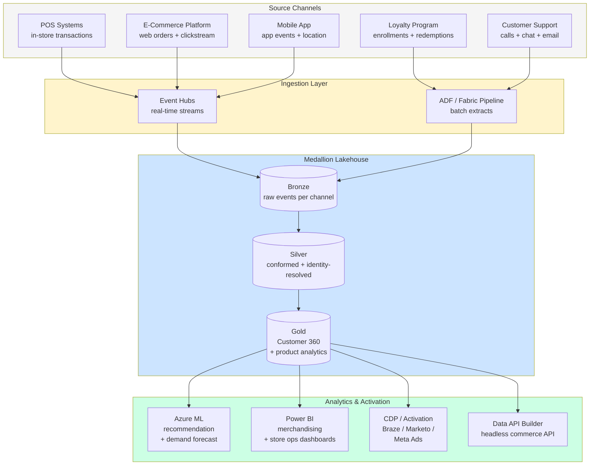

# Industry — Retail & CPG

!!! info "Comparative positioning note"
    This document is written from the
    perspective of Microsoft Azure, Cloud Scale Analytics, and CSA Loom. Any
    description of third-party or competing products, services, pricing, or
    capabilities is derived from **publicly available documentation and sources**
    believed accurate at the time of writing, and is provided for **general
    comparison only**. We do not claim expertise in, or authority over, any
    non-Microsoft product or service; the respective vendor's official
    documentation is the authoritative source for their offerings, which may
    change over time. Nothing here is intended to disparage any vendor — where a
    competing product has genuine advantages, we aim to note them honestly.
    Verify all third-party details against the vendor's current official
    documentation before making decisions.


> **Scope:** Brick-and-mortar retail, e-commerce, omnichannel, consumer packaged goods. Customer experience as competitive advantage, demand volatility, supply-chain complexity, payment data sensitivity.

## Top scenarios

| Scenario                      | Pattern                                                         | Latency    | Reference                                                                                                            |
| ----------------------------- | --------------------------------------------------------------- | ---------- | -------------------------------------------------------------------------------------------------------------------- |
| **Customer 360**              | Multi-source identity resolution + medallion gold + reverse-ETL | minutes    | [Reference Arch — Data Flow](../reference-architecture/data-flow-medallion.md)                                       |
| **Real-time recommendation**  | Feature store + online inference + click feedback loop          | sub-100ms  | [Example — ML Lifecycle](../examples/ml-lifecycle.md) (adapt)                                                        |
| **Demand forecasting**        | Sales + weather + promotions + ML                               | daily      | [Example — ML Lifecycle](../examples/ml-lifecycle.md)                                                                |
| **Inventory optimization**    | Real-time stock + demand forecast + replenishment               | hours      | [Tutorial 11 — Data API Builder](../tutorials/11-data-api-builder/README.md) for serving                             |
| **Pricing optimization**      | Competitive scrape + elasticity model + scenario eval           | daily      | [Use Case — Anomaly Detection](../use-cases/realtime-intelligence-anomaly-detection.md) (similar streaming patterns) |
| **Fraud / chargeback**        | Transaction streaming + ML scoring                              | sub-second | [Industries — Financial Services](financial-services.md)                                                             |
| **Conversational commerce**   | RAG + product catalog + checkout integration                    | seconds    | [Tutorial 08 — RAG](../tutorials/08-rag-vector-search/README.md), [Example — AI Agents](../examples/ai-agents.md)    |
| **Marketing attribution**     | Touchpoint ingest + multi-touch model                           | daily      | [Tutorial 02 — Data Governance](../tutorials/02-data-governance/README.md)                                           |
| **Loyalty / personalization** | CDP + ML segments + activation channels                         | minutes    | [Tutorial 11 — Data API Builder](../tutorials/11-data-api-builder/README.md)                                         |

## Regulatory landscape

| Framework                                         | Where in CSA-in-a-Box                                                                             |
| ------------------------------------------------- | ------------------------------------------------------------------------------------------------- |
| **PCI-DSS v4.0** (any payment data)               | [Compliance — PCI-DSS](../compliance/pci-dss-v4.md) — strongly recommend tokenization at the edge |
| **GDPR** (EU customers)                           | [Compliance — GDPR](../compliance/gdpr-privacy.md)                                                |
| **CCPA / CPRA** (California)                      | Same patterns as GDPR; "do not sell" preference + DSR handling                                    |
| **SOC 2 Type II**                                 | [Compliance — SOC 2](../compliance/soc2-type2.md) — table stakes for B2B SaaS commerce            |
| **State privacy laws** (VA, CO, CT, UT, TX, etc.) | Mostly track GDPR principles; one consent management platform usually serves all                  |
| **COPPA** (under-13 users)                        | If applicable, age-gate at signup; segregate child accounts                                       |

## Reference architecture variations

- **CDP layer**: customer 360 in gold + segment exports to activation channels (Marketo, Braze, Salesforce, Meta Ads). [Tutorial 11 — Data API Builder](../tutorials/11-data-api-builder/README.md) provides the REST/GraphQL surface.
- **Edge POS integration**: tokenize payment at the POS device; analytics receives only token + last-4 + transaction context. Keeps PCI scope at the edge.
- **Conversational commerce**: AOAI + product catalog as RAG corpus. Add **Azure AI Content Safety** before sending model output to customers — never let an LLM make a price commitment without a guard.
- **Headless commerce**: gold tables expose product / inventory / pricing via DAB → consumed by storefronts (Next.js, mobile apps) via GraphQL.

## Why the standard CSA-in-a-Box pattern works for retail

- Medallion + Purview = **catalog of customer attributes** with classification (PII / sensitive)
- dbt = **reproducible CDP** (no more "the customer count differs between Marketing and Finance")
- AOAI + AI Search + Content Safety = **safe customer-facing GenAI**
- Data API Builder = **headless commerce data layer** without bespoke API code
- Power Apps + Power BI = **store-manager and merchandiser apps** without app-dev cycles

## What's specific to retail / CPG

- **Identity resolution is the hardest data problem.** Customers have multiple emails, devices, household memberships, loyalty accounts, in-store interactions. Build identity resolution as a **first-class silver-layer asset**, not as a one-off.
- **Demand volatility is brutal.** Forecast accuracy matters more than model sophistication; ensemble simple models + external signals (weather, holidays, social) usually beats one complex model.
- **PCI scope minimization is everything.** Tokenize at the POS / payment gateway; never let raw PAN reach analytics. See [Compliance — PCI-DSS](../compliance/pci-dss-v4.md).
- **Real-time matters at checkout, not for analytics.** Recommendation, fraud scoring, dynamic pricing — sub-100ms or it doesn't get used. Other analytics can be batch.
- **Promotions are messy.** Promo lift modeling is the most-mistaken analytics in retail; almost everyone over-attributes lift to promos. Use causal inference (DML, synthetic control) for promo eval.

## Getting started

1. Read [Reference Architecture — Data Flow](../reference-architecture/data-flow-medallion.md)
2. Pick **one** scenario from the top list — most retailers benefit most from Customer 360 first
3. Walk [Tutorial 02 — Data Governance](../tutorials/02-data-governance/README.md) so customer data is properly classified before you build anything
4. Adapt [Example — Commerce](../examples/commerce.md) (federal commerce stats but the data patterns transfer)
5. Layer [Example — Data API Builder](../examples/data-api-builder.md) for the headless commerce surface
6. **Before** rolling out customer-facing GenAI: review [Patterns -- LLMOps & Evaluation](../patterns/llmops-evaluation.md)

## Omnichannel analytics reference architecture

The following diagram shows how data from POS systems, e-commerce platforms, and mobile apps converge into a unified customer graph that powers analytics, personalization, and activation.



!!! note
Identity resolution happens at the bronze-to-silver transition. Every channel produces a different identifier (POS loyalty number, e-commerce email, mobile device ID). The silver layer resolves these into a single `customer_id` using deterministic matching (email, phone, loyalty number) first, then probabilistic matching (address, name fuzzy match) for the remainder.

## Supply chain optimization

### Demand sensing

Demand sensing improves short-term forecast accuracy (1-14 days) by incorporating signals beyond historical sales:

- **POS sell-through data** — actual consumer purchases, not retailer orders (reduces bullwhip effect)
- **Weather forecasts** — temperature, precipitation, severe weather warnings correlated with category demand
- **Promotional calendar** — planned promotions, competitor promotions (scrape or third-party data)
- **Social signals** — trending products, viral moments, sentiment shifts
- **Event calendar** — holidays, sports events, school schedules by region

Implement demand sensing as a daily dbt + ML pipeline: dbt prepares the feature tables in gold, Azure ML trains and scores the forecast model, results write back to gold for downstream consumption.

### Supplier risk scoring

Build a supplier risk score in your gold layer using:

| Risk dimension           | Data source                            | Metric                                             |
| ------------------------ | -------------------------------------- | -------------------------------------------------- |
| **Delivery reliability** | Purchase orders vs receipts            | On-time-in-full (OTIF) rate, lead time variability |
| **Quality**              | Inspection records, returns            | Defect rate, return rate by supplier               |
| **Financial health**     | Third-party credit data (D&B, Moody's) | Credit score, payment history                      |
| **Concentration**        | Procurement data                       | % of category spend with single supplier           |
| **Geopolitical**         | Country risk indices                   | Sourcing region instability score                  |

Combine into a composite score using weighted average or a simple ML model. Surface in Power BI for procurement teams. Alert when a critical supplier's score deteriorates beyond threshold.

### Inventory turn analysis

Inventory turns (COGS / average inventory) is the fundamental retail efficiency metric. Build it as a dbt model hierarchy:

1. **`stg_inventory_snapshots`** — daily inventory positions by SKU and location
2. **`int_avg_inventory`** — rolling 30/60/90-day average inventory at cost
3. **`fct_inventory_turns`** — turns by SKU, category, location, and time period
4. **`rpt_slow_movers`** — SKUs below target turn rate, with aging buckets (30/60/90/180+ days)

!!! tip
For Fabric-native implementations, see [Fabric Lakehouse patterns](https://fgarofalo56.github.io/Suppercharge_Microsoft_Fabric/) for optimizing Delta table layouts for inventory snapshot workloads.

## Customer 360

### Identity resolution

Identity resolution is the hardest and most valuable data engineering problem in retail. Build it as a first-class silver-layer asset, not a one-off script.

**Deterministic matching** (high confidence, run first):

- Exact email match (normalize: lowercase, trim, remove dots in Gmail)
- Exact phone match (normalize to E.164 format)
- Loyalty number match
- Payment token match (same tokenized card across channels)

**Probabilistic matching** (lower confidence, run second on unmatched records):

- Name + address fuzzy match (Jaro-Winkler distance > 0.92)
- Name + ZIP + last-4-of-card
- Device fingerprint clustering

Store the identity graph in silver with match confidence scores. Downstream gold models join on the resolved `customer_id`. Periodically review low-confidence matches with a human-in-the-loop process.

### RFM scoring

Recency-Frequency-Monetary (RFM) scoring segments customers by purchase behavior. Implement as a dbt model:

```sql
-- Simplified RFM scoring in dbt
with rfm_base as (
    select
        customer_id,
        datediff(day, max(order_date), current_date) as recency_days,
        count(distinct order_id) as frequency,
        sum(order_total) as monetary
    from {{ ref('fct_orders') }}
    where order_date >= dateadd(year, -2, current_date)
    group by customer_id
),
rfm_scored as (
    select *,
        ntile(5) over (order by recency_days desc) as r_score,
        ntile(5) over (order by frequency) as f_score,
        ntile(5) over (order by monetary) as m_score
    from rfm_base
)
select *,
    r_score * 100 + f_score * 10 + m_score as rfm_segment
from rfm_scored
```

### Customer lifetime value (CLV)

CLV prediction uses historical purchase data to estimate future value. Two common approaches:

- **Probabilistic** (BG/NBD + Gamma-Gamma model) — works well with transaction-level data, requires only purchase dates and amounts, implemented via the `lifetimes` Python library in Azure ML
- **ML-based** — train a regression model on features including RFM scores, category preferences, channel mix, tenure, and engagement metrics; better accuracy but requires more feature engineering

Store CLV predictions in the gold layer, refresh monthly, and use them for:

- Marketing budget allocation (invest more in high-CLV segments)
- Acquisition channel evaluation (which channels bring high-CLV customers?)
- Churn intervention prioritization (high-CLV + high-churn-risk = top priority)

## Demand sensing patterns

### Seasonal decomposition

Retail demand has strong seasonal patterns. Decompose time series into trend, seasonal, and residual components before feeding to ML models. Use STL decomposition (Seasonal and Trend decomposition using LOESS) in the feature engineering pipeline:

- **Trend** — long-term direction (category growth/decline)
- **Seasonal** — repeating calendar patterns (weekly, monthly, annual)
- **Residual** — the signal your ML model should focus on (demand shocks, promotions, weather)

Compute decomposition in Databricks/Synapse Spark using `statsmodels.tsa.seasonal.STL`. Store components as features in gold for downstream ML models.

### Promotional lift measurement

Measuring true promotional lift requires causal inference, not just before/after comparison (which confounds promotion with seasonality, trend, and other factors).

| Method                              | When to use                                                                           | Complexity |
| ----------------------------------- | ------------------------------------------------------------------------------------- | ---------- |
| **Difference-in-differences**       | You have control stores that didn't run the promotion                                 | Low        |
| **Synthetic control**               | No clean control group; construct a synthetic counterfactual from weighted donor pool | Medium     |
| **Double ML (DML)**                 | High-dimensional confounders; want a causal estimate of promotion effect              | High       |
| **Bayesian structural time series** | Single time-series with pre/post periods; Google's CausalImpact approach              | Medium     |

!!! warning
Simple lift calculations (promoted sales minus baseline) systematically overstate promotion effectiveness. At minimum, use difference-in-differences with a control group. For high-stakes promo evaluation, invest in synthetic control or DML.

### Weather impact modeling

Weather affects retail demand more than most teams realize. Key patterns:

- **Temperature** — drives seasonal categories (beverages, ice cream, apparel transitions)
- **Precipitation** — suppresses foot traffic, boosts e-commerce
- **Severe weather warnings** — drive pantry-loading behavior (water, batteries, bread/milk)
- **Day length** — affects outdoor activity and associated product categories

Ingest weather data from NOAA (free, daily resolution) or a commercial provider (hourly, hyperlocal). Join with store locations and sales data in silver. Add weather features to demand forecast models. See [Use Case -- NOAA Climate Analytics](../use-cases/noaa-climate-analytics.md) for the weather data ingestion pattern.

## Price and markdown optimization

### Elasticity models

Price elasticity measures how demand responds to price changes. Estimate it per SKU-store using regression on historical price/demand data:

- **Own-price elasticity** — % change in demand for a 1% change in price (typically -1.5 to -3 for branded CPG)
- **Cross-price elasticity** — how a price change in one SKU affects demand for substitutes and complements
- **Promotional elasticity** — demand response to temporary price reductions (usually 2-5x higher than everyday elasticity)

Use log-log regression (`ln(demand) ~ ln(price) + controls`) for constant-elasticity estimates. For more flexibility, use gradient-boosted trees with price as a feature and compute elasticity via finite differences.

### Markdown cadence

Seasonal merchandise (fashion, holiday) requires a markdown strategy that balances sell-through against margin:

1. **Initial price** — set based on target margin and competitive positioning
2. **First markdown** (typically 4-6 weeks into season) — 20-30% off; triggered when sell-through falls below plan
3. **Subsequent markdowns** — deeper cuts at 2-3 week intervals based on remaining inventory and weeks to end-of-season
4. **Final clearance** — 60-70% off to clear residual inventory before new season

Optimize markdown timing and depth using a dynamic programming model that maximizes total margin subject to sell-through targets. Implement in Azure ML; score weekly; surface recommendations in Power BI for merchandisers.

### Competitive pricing

Monitor competitor prices using:

- **Third-party price intelligence** (Competera, Prisync, Intelligence Node) — automated scraping + matching
- **MAP (Minimum Advertised Price) compliance** — ensure your prices comply with manufacturer MAP policies
- **Price-index dashboards** — your price relative to competitors at category, brand, and SKU level

Surface competitive price intelligence alongside elasticity estimates in a Power BI dashboard so pricing analysts can make informed decisions. Automate only non-sensitive repricing (e.g., matching marketplace prices for commodity items); keep strategic pricing decisions human-led.

## Marketing attribution

### Multi-touch attribution models

Marketing attribution assigns credit for conversions across touchpoints. Implement as a gold-layer dbt model.

| Model                           | Logic                                                | Pros                                | Cons                                          |
| ------------------------------- | ---------------------------------------------------- | ----------------------------------- | --------------------------------------------- |
| **Last-touch**                  | 100% credit to the last touchpoint before conversion | Simple, easy to implement           | Ignores awareness and consideration stages    |
| **First-touch**                 | 100% credit to the first touchpoint                  | Values acquisition channels         | Ignores nurture and conversion channels       |
| **Linear**                      | Equal credit to all touchpoints                      | Fair across stages                  | Ignores relative importance of each touch     |
| **Time-decay**                  | More credit to touchpoints closer to conversion      | Reflects increasing purchase intent | Undervalues brand-building touchpoints        |
| **Position-based (U-shaped)**   | 40% first, 40% last, 20% split across middle         | Balances acquisition + conversion   | Arbitrary weight distribution                 |
| **Data-driven (Shapley value)** | ML-computed marginal contribution of each channel    | Most accurate                       | Requires large data volume; harder to explain |

Implement data-driven attribution using the Shapley value approach: for each conversion, compute the marginal contribution of each channel by comparing conversion probability with and without that channel in the path. Use Azure ML for the computation; store attribution results in gold for Power BI dashboards.

### Incrementality testing

Attribution models tell you which channels get credit; incrementality testing tells you which channels actually cause conversions. Run geo-based or user-based holdout experiments:

1. **Define test and control** — randomly assign geographic regions (or user cohorts) to treatment (see ads) and control (don't see ads)
2. **Measure conversion difference** — the gap between treatment and control conversion rates is the true incremental lift
3. **Calculate iROAS** — incremental Return on Ad Spend = (incremental revenue) / (ad spend in treatment)

Store experiment configurations and results in your gold layer for longitudinal tracking.

## Trade-offs

| Give                                               | Get                                                                              |
| -------------------------------------------------- | -------------------------------------------------------------------------------- |
| Real-time identity resolution (streaming matching) | More responsive personalization but higher infrastructure cost and complexity    |
| Probabilistic matching (fuzzy name/address)        | Higher match rate but risk of false matches polluting Customer 360               |
| Centralized CDP (gold layer serves all channels)   | Single source of truth but latency for activation channels                       |
| Data-driven attribution (Shapley values)           | More accurate credit assignment but requires significant data volume and compute |
| Tokenization at POS (no raw PAN in analytics)      | Minimal PCI scope but lose ability to do card-level analytics across merchants   |

## Retail demand forecasting example

For a complete end-to-end walkthrough of demand forecasting on this platform, see:

[Example -- Retail Demand Forecasting](../examples/retail-demand-forecasting.md)

## Related

- [Industries — Financial Services](financial-services.md) — fraud + payment patterns transfer
- [Industries — Telco](telco.md) — churn + customer experience patterns transfer
- [Use Case — Casino & Gaming Analytics](../use-cases/casino-gaming-analytics.md) — customer LTV + fraud patterns transfer
- [Patterns — LLMOps & Evaluation](../patterns/llmops-evaluation.md)
- [Patterns — Power BI & Fabric Roadmap](../patterns/power-bi-fabric-roadmap.md)
