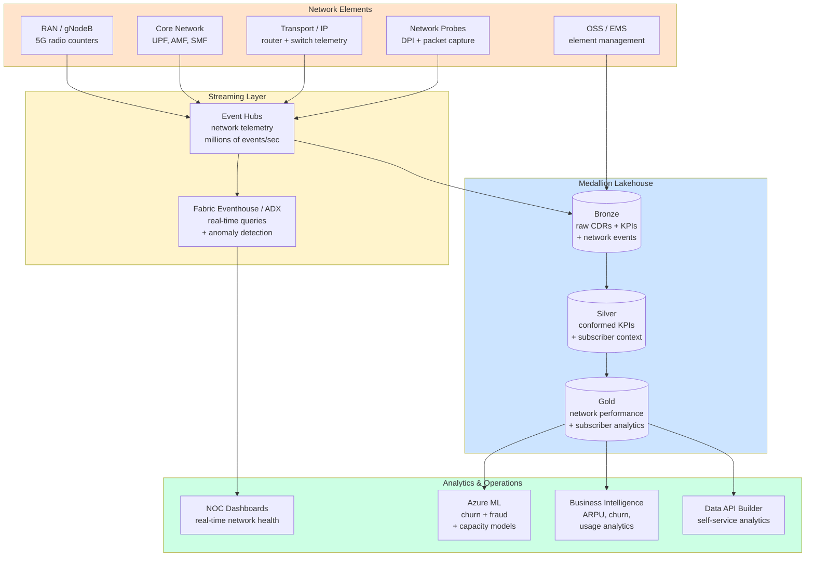

# Industry — Telecommunications

!!! info "Comparative positioning note"
    This document is written from the
    perspective of Microsoft Azure, Cloud Scale Analytics, and CSA Loom. Any
    description of third-party or competing products, services, pricing, or
    capabilities is derived from **publicly available documentation and sources**
    believed accurate at the time of writing, and is provided for **general
    comparison only**. We do not claim expertise in, or authority over, any
    non-Microsoft product or service; the respective vendor's official
    documentation is the authoritative source for their offerings, which may
    change over time. Nothing here is intended to disparage any vendor — where a
    competing product has genuine advantages, we aim to note them honestly.
    Verify all third-party details against the vendor's current official
    documentation before making decisions.


> **Scope:** Wireless carriers, cable / wireline, MVNOs, telecom equipment vendors. Massive subscriber bases, network telemetry at unprecedented scale, churn + customer experience as core KPIs, regulated CPNI.

## Top scenarios

| Scenario                                           | Pattern                                  | Latency         | Reference                                                                                                                                          |
| -------------------------------------------------- | ---------------------------------------- | --------------- | -------------------------------------------------------------------------------------------------------------------------------------------------- |
| **Network analytics** (5G/4G QoS, capacity)        | Streaming + Eventhouse + ML for anomaly  | seconds-minutes | [Use Case — Anomaly Detection](../use-cases/realtime-intelligence-anomaly-detection.md), [Tutorial 05](../tutorials/05-streaming-lambda/README.md) |
| **Subscriber churn prediction**                    | CDR + usage + interactions + ML          | daily           | [Example — ML Lifecycle](../examples/ml-lifecycle.md)                                                                                              |
| **Fraud detection** (subscription, IRSF, SIM swap) | Streaming + graph + ML                   | seconds         | [Industries — Financial Services](financial-services.md) (similar patterns)                                                                        |
| **Customer experience (NPS, CSAT)**                | Multi-channel ingest + sentiment + ML    | hours           | [Tutorial 08 — RAG](../tutorials/08-rag-vector-search/README.md) for support-call analytics                                                        |
| **Network planning + capacity**                    | Historical traffic + ML + scenario eval  | weeks           | [Tutorial 06 — AI Foundry](../tutorials/06-ai-analytics-foundry/README.md)                                                                         |
| **Customer GenAI** (support, billing)              | RAG + agents + content safety            | seconds         | [Example — AI Agents](../examples/ai-agents.md)                                                                                                    |
| **OSS/BSS modernization**                          | Mainframe / legacy → ADF / Synapse / DAB | varies          | [Migration — Hadoop / Hive](../migrations/hadoop-hive.md), [Migration — Teradata](../migrations/teradata.md)                                       |
| **Field worker GenAI** (cell tower maintenance)    | RAG over asset/manual corpus + mobile    | seconds         | [Industries — Energy & Utilities](energy-utilities.md) (similar pattern)                                                                           |

## Regulatory landscape

| Framework                                                       | Where in CSA-in-a-Box                                                                                                                    |
| --------------------------------------------------------------- | ---------------------------------------------------------------------------------------------------------------------------------------- |
| **CPNI** (US Customer Proprietary Network Information)          | Restricted use of subscriber call/usage data; classification + access controls in [Compliance — NIST](../compliance/nist-800-53-rev5.md) |
| **GDPR** (EU subscribers)                                       | [Compliance — GDPR](../compliance/gdpr-privacy.md)                                                                                       |
| **CALEA** (US lawful intercept)                                 | Out of scope for analytics platform; affects network elements                                                                            |
| **CCPA / CPRA + state privacy**                                 | Same patterns as GDPR                                                                                                                    |
| **PCI-DSS** (recurring billing)                                 | [Compliance — PCI-DSS](../compliance/pci-dss-v4.md) — minimize via tokenization                                                          |
| **NIS2 / TSA Pipeline-equivalent for telco** (EU + emerging US) | Operational resilience, breach reporting                                                                                                 |

## Reference architecture variations

- **CDR ingest scale** is the single hardest part of telco analytics: 100M subscribers × dozens of CDRs/day = billions of records/day. Plan with **Fabric Eventhouse / ADX** for the streaming gold; Synapse / Databricks for batch silver/gold.
- **Network telemetry** (5G slice metrics, RAN counters): dedicated **time-series database** (ADX) — never try to put this in Synapse SQL.
- **Customer 360** in telco includes call/SMS/data usage, billing, support interactions, network experience. Identity resolution is straightforward (one MSISDN per SIM) but data volume is large.
- **CPNI partition**: customer call/usage data has tighter access controls than other customer data. Implement a separate **silver-PII** schema with explicit RBAC.

## Why the standard CSA-in-a-Box pattern works for telco

- Medallion + dbt = **reproducible regulator + investor reports** (FCC Form 477, ARPU/churn/EBITDA breakdowns)
- Event Hubs + Eventhouse / ADX = **CDR + RAN telemetry at scale**
- Azure ML + MLflow = **churn / fraud / recommendation models** with proper governance
- AOAI + AI Search + Content Safety = **safe customer-facing GenAI** for support / billing
- Purview + classification = **CPNI controls** with auditable access

## What's specific to telco

- **CDR scale is the operational reality.** A mid-size telco generates more rows in a day than a typical retailer generates in a year. Design every silver/gold table with partitioning + Z-order from day 1.
- **Network telemetry vs business analytics are different platforms.** Network ops needs sub-second visibility on RAN; business analytics needs daily/weekly aggregates. Don't try to make one platform serve both.
- **Churn modeling is a solved problem; activation is harder.** Predicting churn is easy; _intervening_ (offer, retention call, channel choice) is where value is captured. Model the intervention, not just the prediction.
- **Fraud (IRSF, subscription, SIM swap) is real-time.** Loss happens within minutes of fraud onset. Streaming + ML scoring + auto-block is the architecture.
- **Customer GenAI is the highest-ROI 2025/2026 use case.** Telco support volume + cost is enormous; even modest deflection rates pay for the platform many times over. Content Safety + grounding are non-negotiable.
- **CPNI is your audit hot button.** US carriers get FCC fines for CPNI violations. Use Purview classifications + dedicated security groups + access reviews quarterly.

## Getting started

1. Read [Reference Architecture — Data Flow](../reference-architecture/data-flow-medallion.md)
2. Pick a scale-tested time-series store — **Fabric Eventhouse** or **Azure Data Explorer** — before anything else
3. Walk [Tutorial 05 — Streaming Lambda](../tutorials/05-streaming-lambda/README.md) end-to-end
4. Adapt [Example — IoT Streaming](../examples/iot-streaming.md) for CDR shape, or [Example — Cybersecurity](../examples/cybersecurity.md) for network anomaly patterns
5. Pilot **one** churn model end-to-end using [Example — ML Lifecycle](../examples/ml-lifecycle.md) as the template
6. **Before** customer-facing GenAI: review [Patterns -- LLMOps & Evaluation](../patterns/llmops-evaluation.md) and [Compliance -- GDPR](../compliance/gdpr-privacy.md)

## Network analytics reference architecture

The following diagram shows the data flow from network probes and element management systems through the streaming and analytics layers to NOC dashboards and operational systems.



!!! note
The dual-path architecture is intentional. Real-time network KPIs flow through Eventhouse/ADX for sub-second NOC dashboards. The same data lands in the medallion lakehouse (via Event Hubs Capture) for historical analytics, ML training, and business reporting. See [Patterns -- Streaming & CDC](../patterns/streaming-cdc.md) for the pattern details.

## Churn prediction

### Feature engineering from CDR and usage data

Subscriber churn prediction is one of the most mature ML use cases in telco. The quality of features, not the model algorithm, determines prediction accuracy. Build features in your silver and gold layers using dbt.

**Behavioral features (from CDR + usage data):**

| Feature category       | Examples                                                                        | Window        |
| ---------------------- | ------------------------------------------------------------------------------- | ------------- |
| **Voice usage**        | Total minutes, peak/off-peak ratio, international minutes, unique contacts      | 7d, 30d, 90d  |
| **Data usage**         | Total GB, peak-hour ratio, app category mix, throttle events                    | 7d, 30d, 90d  |
| **Messaging**          | SMS count, MMS count, OTT messaging proxy indicators                            | 30d           |
| **Network experience** | Dropped call rate, data session failures, handover failures, average throughput | 7d, 30d       |
| **Device**             | Device age, device tier (flagship vs budget), recent device change              | Point-in-time |
| **Billing**            | ARPU, payment delays, plan changes, overage frequency, promo expiration         | 30d, 90d      |

**Trend features (critical for churn detection):**

- **Usage decline** — 30-day moving average vs 90-day baseline; a sustained decline is the strongest churn signal
- **Engagement drop** — decrease in app logins, self-service visits, or loyalty program activity
- **Complaint acceleration** — increasing call-center contact frequency, especially after a bill shock
- **Competitor signals** — port-out inquiries, MNP (Mobile Number Portability) information requests

### Propensity scoring

Train a binary classifier (LightGBM is the industry standard for telco churn) on a 6-12 month window of historical data where churn is defined as voluntary disconnection or port-out. Key modeling considerations:

- **Label definition matters** — exclude involuntary churn (non-payment), seasonal prepaid churn, and corporate bulk changes from your churn label
- **Class imbalance** — monthly churn rates of 1-3% mean heavy class imbalance; use SMOTE, class weights, or focal loss
- **Calibration** — calibrate probabilities so that "0.15 churn probability" actually means 15% of those subscribers churn; use Platt scaling or isotonic regression
- **Temporal validation** — always use time-based train/test splits (train on months 1-6, validate on month 7, test on month 8); never use random splits for time-series problems

### Retention campaign targeting

The churn model is only valuable if it drives action. Integrate predictions into retention campaigns:

1. **Score** — daily batch scoring of all subscribers; write scores to gold layer
2. **Segment** — combine churn probability with CLV to create action segments:
    - High churn risk + high CLV = proactive retention offer (dedicated retention team)
    - High churn risk + medium CLV = automated retention campaign (email/SMS/app notification)
    - High churn risk + low CLV = no action (let go gracefully)
3. **Activate** — push segments to campaign management (Salesforce, Adobe Campaign, in-house CRM) via reverse-ETL or Data API Builder
4. **Measure** — track conversion rates per segment; A/B test retention offers; feed results back to model retraining

!!! tip
The biggest mistake in telco churn programs is optimizing the model without optimizing the intervention. A mediocre model with a well-designed offer matrix outperforms a perfect model with generic "please stay" messages. Build your offer optimization as a separate ML model (contextual bandit or multi-armed bandit) that learns which offer works best for which subscriber profile.

## 5G and edge computing

### MEC (Multi-access Edge Computing) with Azure

MEC places compute at the network edge (cell-tower aggregation points or central offices) to enable ultra-low-latency applications. Azure supports MEC through Azure Private MEC and Azure Operator Nexus.

**Analytics use cases at the edge:**

| Use case                 | Latency requirement | Edge implementation                                                                          |
| ------------------------ | ------------------- | -------------------------------------------------------------------------------------------- |
| **Content optimization** | < 10ms              | Cache popular content at MEC; analytics on cache hit rates and content popularity            |
| **AR/VR quality**        | < 20ms              | Edge inference for video quality optimization; metrics stream to cloud for capacity planning |
| **IoT gateway**          | < 50ms              | Aggregate and filter IoT telemetry from enterprise customers before forwarding to cloud      |
| **Local breakout**       | < 5ms               | Enterprise traffic stays local; analytics on enterprise SLA compliance                       |

### Edge analytics patterns

For network analytics at the edge:

- **Pre-aggregation** — compute 1-minute rollups of per-cell KPIs at the edge; send aggregated data to cloud (reduces bandwidth by 100x vs raw counters)
- **Local anomaly detection** — run lightweight anomaly detection models (isolation forest, one-class SVM) at the edge for sub-second alerting; retrain models in the cloud
- **Network slicing analytics** — monitor SLA compliance per network slice at the MEC; ensure each enterprise customer's slice meets contracted throughput and latency guarantees

### Network slicing

5G network slicing creates virtual end-to-end networks on shared infrastructure. Analytics must track per-slice performance:

- **Slice SLA monitoring** — throughput, latency, jitter, and packet loss per slice, measured against contracted SLA
- **Resource utilization** — compute, bandwidth, and spectrum usage per slice; alert when approaching capacity
- **Slice lifecycle** — creation, modification, and teardown events; correlation with subscriber experience
- **Cross-slice interference** — detect when one slice's traffic patterns degrade another slice's performance

Build slice analytics as a dedicated set of gold-layer tables partitioned by slice ID. Surface in NOC dashboards with drill-down from slice to cell to subscriber.

## Revenue assurance

### Usage reconciliation

Revenue assurance ensures that every billable event generates revenue and every charge has a corresponding usage event. Discrepancies indicate either system issues (lost CDRs, billing errors) or fraud.

**Reconciliation pipeline:**

1. **CDR completeness** — compare CDR counts from network switches with CDRs received by the mediation platform; gap = potential revenue leakage
2. **Mediation-to-billing** — match rated CDRs with billing system charges; discrepancies indicate rating errors or dropped records
3. **Billing-to-payment** — reconcile invoiced amounts with payments received; aging analysis for collections

Implement as dbt models with data quality tests:

```sql
-- dbt test: CDR completeness check
-- Expected: switch CDR count within 0.1% of mediation CDR count
select
    event_date,
    switch_id,
    switch_cdr_count,
    mediation_cdr_count,
    abs(switch_cdr_count - mediation_cdr_count)
        / nullif(switch_cdr_count, 0) as gap_pct
from {{ ref('fct_cdr_reconciliation') }}
where gap_pct > 0.001
```

### Billing accuracy

Beyond completeness, validate billing accuracy by sampling rated CDRs and re-rating them independently:

- **Rate plan verification** — does the applied rate match the subscriber's plan?
- **Discount application** — are bundle discounts, loyalty discounts, and promotional rates applied correctly?
- **Roaming charges** — are visited-network charges rated according to the correct inter-operator tariff?
- **Tax calculation** — are jurisdiction-specific taxes (federal, state, local, USF) computed correctly?

### Fraud detection patterns

Telco fraud patterns differ from financial fraud and require specialized detection:

| Fraud type                                   | Detection method                                                                              | Response                                                                |
| -------------------------------------------- | --------------------------------------------------------------------------------------------- | ----------------------------------------------------------------------- |
| **SIM swap**                                 | Account activity from a new device immediately after SIM change; velocity of SIM changes      | Block outbound services; notify subscriber via alternate channel        |
| **IRSF (International Revenue Share Fraud)** | Unusual call volume to high-cost international destinations (premium-rate numbers)            | Real-time call blocking to flagged destinations; destination blacklists |
| **Subscription fraud**                       | Multiple activations from same identity document or address; credit check anomalies           | Enhanced verification at point of sale; deposit requirements            |
| **Wangiri (callback fraud)**                 | Short-duration inbound calls from premium international numbers designed to trigger callbacks | Block inbound from flagged number ranges; subscriber education          |
| **Interconnect bypass**                      | Voice traffic arriving via unauthorized routes (SIM boxes); audio quality fingerprinting      | Traffic analysis for SIM box signatures; test calls                     |

Use a combination of rule-based detection (for known patterns) and ML-based anomaly detection (for emerging patterns). The streaming architecture described in the network analytics section supports real-time fraud scoring.

## Network planning

### Coverage optimization

Coverage planning uses drive-test data, subscriber complaints, and crowdsourced measurements to identify and prioritize coverage gaps.

**Data sources:**

- **Drive test data** — RSRP, RSRQ, SINR measurements along test routes
- **Crowdsourced measurements** — apps like Ookla, OpenSignal, or carrier-provided apps reporting signal quality from subscriber devices
- **Subscriber complaints** — geo-tagged coverage complaints from call center and app
- **Census / demographics** — population density, commercial activity, transportation corridors

**Analytics pipeline:**

1. **Bronze** — raw measurement data with GPS coordinates and timestamps
2. **Silver** — grid the coverage area into hexagonal bins (H3 resolution 7-8); aggregate signal measurements per bin
3. **Gold** — coverage score per bin (composite of signal strength, throughput, and reliability); gap identification where score falls below threshold; prioritized build list considering population served and competitive pressure

### Capacity planning

Capacity planning forecasts future network resource needs based on traffic growth and subscriber trends.

**Key models:**

- **Traffic forecast** — predict data traffic growth per cell using historical trends, subscriber growth, and device mix evolution (5G device penetration drives traffic growth)
- **Spectrum utilization** — current utilization per band per cell; project when utilization exceeds 80% threshold
- **Capacity solutions** — rank solutions by cost-effectiveness: sector splits, carrier aggregation, small cells, macro densification, new spectrum deployment
- **Financial model** — CapEx per capacity unit vs revenue impact; prioritize investments by ROI

### Spectrum analysis

For carriers managing multiple spectrum bands (low-band for coverage, mid-band for capacity, mmWave for hotspots), analytics supports:

- **Band utilization** — traffic distribution across bands per cell; identify underutilized spectrum
- **Inter-band steering** — effectiveness of load balancing policies; subscriber experience by band
- **Spectrum sharing** — for CBRS/shared spectrum, monitor usage patterns and interference levels
- **Refarming analysis** — model the impact of transitioning spectrum from legacy technologies (3G sunset) to 5G

Build spectrum analytics as a dedicated domain in gold, refreshed daily from RAN performance counters. Surface in Power BI with cell-level drill-down and geographic visualization via Azure Maps.

!!! tip
For Fabric-native implementations of real-time network telemetry, see [Real-Time Intelligence patterns](https://fgarofalo56.github.io/Suppercharge_Microsoft_Fabric/) for optimizing Eventhouse ingestion and KQL queries at telco scale.

## Customer experience analytics

### NPS and CSAT pipeline

Net Promoter Score (NPS) and Customer Satisfaction (CSAT) are the primary customer experience KPIs. Build a unified CX analytics pipeline:

1. **Bronze** — survey responses (post-call, post-visit, in-app), social mentions, app store reviews, community forum posts
2. **Silver** — standardize scores, extract sentiment using Azure AI Language, link to subscriber profile via MSISDN or account ID
3. **Gold** — NPS by segment (plan type, tenure, region), CSAT by interaction type (call, chat, store visit), trend analysis, driver analysis

### Root cause analysis

Move beyond tracking NPS to understanding what drives it. Use text analytics on verbatim survey responses and call transcripts:

- **Topic extraction** — Azure AI Language or custom NLP to identify complaint themes (billing confusion, network quality, wait times)
- **Driver analysis** — regression of NPS on operational metrics (network quality, billing accuracy, first-call resolution) to quantify which factors have the largest impact
- **Journey correlation** — link NPS responses to the subscriber's recent journey (did they experience a network outage? a billing error? a long hold time?) to identify systemic issues

Surface driver analysis in Power BI so CX teams can prioritize improvements by impact rather than complaint volume.

## OSS/BSS modernization patterns

Many telcos operate legacy OSS/BSS systems (mainframe billing, siloed provisioning, proprietary mediation). The analytics platform can serve as the modernization bridge.

### Migration patterns

| Legacy system                                 | Migration approach                                                                                                         | CSA-in-a-Box component                                                        |
| --------------------------------------------- | -------------------------------------------------------------------------------------------------------------------------- | ----------------------------------------------------------------------------- |
| **Mainframe billing**                         | CDC (Change Data Capture) to ADLS bronze; build billing analytics in dbt gold while mainframe remains the system of record | [Patterns -- Streaming & CDC](../patterns/streaming-cdc.md)                   |
| **Proprietary mediation**                     | Replace with Event Hubs + custom rating logic in Spark/dbt; or run mediation in parallel during transition                 | Event Hubs + Databricks                                                       |
| **Siloed CRM**                                | Extract to bronze; build unified subscriber view in silver; serve via Data API Builder                                     | [Tutorial 11 -- Data API Builder](../tutorials/11-data-api-builder/README.md) |
| **Legacy data warehouse (Teradata, Netezza)** | Migrate queries to Synapse/Databricks; use [Migration -- Teradata](../migrations/teradata.md) patterns                     | Synapse Serverless + dbt                                                      |
| **Legacy Hadoop**                             | Move data to ADLS; rewrite Hive jobs as dbt/Spark; see [Migration -- Hadoop/Hive](../migrations/hadoop-hive.md)            | ADLS + Databricks + dbt                                                       |

### Strangler fig pattern for BSS

Rather than a risky big-bang migration, use the strangler fig pattern:

1. **Shadow** — replicate data from legacy BSS to the lakehouse; build new analytics alongside the old system
2. **Verify** — run both systems in parallel; compare outputs; build confidence in the new pipeline
3. **Redirect** — point downstream consumers (dashboards, reports, APIs) to the new platform one at a time
4. **Retire** — decommission legacy components as they lose their last consumer

This approach reduces risk and provides immediate analytics value even before the legacy system is fully replaced.

## Trade-offs

| Give                                            | Get                                                                           |
| ----------------------------------------------- | ----------------------------------------------------------------------------- |
| Dual-path architecture (Eventhouse + Lakehouse) | Real-time NOC visibility and deep batch analytics, but two systems to manage  |
| Per-subscriber churn model (vs segment-level)   | Precise retention targeting, but higher compute and feature-engineering cost  |
| CPNI partition in silver (separate schema)      | Clean FCC compliance boundary, but more complex data access management        |
| Edge analytics at MEC                           | Ultra-low-latency for local applications, but distributed model management    |
| Strangler fig BSS migration                     | Lower risk than big-bang, but longer dual-run period and temporary complexity |

## Related

- [Industries — Financial Services](financial-services.md) — fraud + customer 360 patterns transfer
- [Industries — Retail & CPG](retail-cpg.md) — churn + customer 360 patterns transfer
- [Use Case — Anomaly Detection](../use-cases/realtime-intelligence-anomaly-detection.md)
- [Patterns — Streaming & CDC](../patterns/streaming-cdc.md)
- [Patterns — LLMOps & Evaluation](../patterns/llmops-evaluation.md)
- Azure for telecom: https://www.microsoft.com/industry/telecommunications
