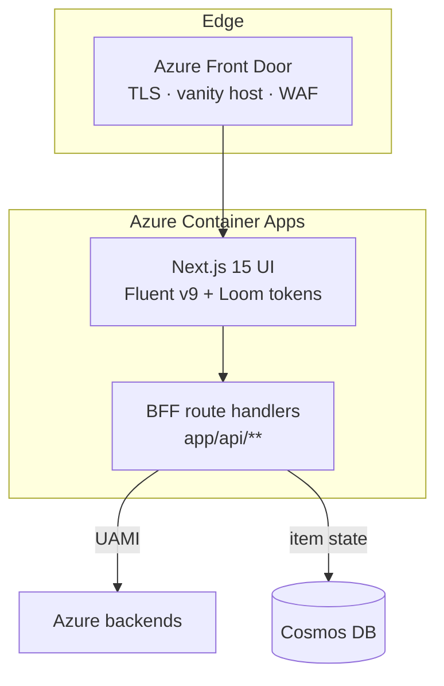

# Architecture

CSA Loom is a single web console plus a set of Azure-native backends, deployed by
Bicep into your subscription. This page describes each layer and how they connect.

## The console

The console (`apps/fiab-console`) is a **Next.js 15** application with a
**Fluent UI v9** front end themed with Loom design tokens. It runs as a container
on **Azure Container Apps (ACA)** behind **Azure Front Door**, which terminates
TLS, serves the vanity hostname, and provides the public ingress. ACA gives the
console scale-to-N horizontal scaling and a managed identity for calling Azure.

The Next.js app is both the UI and its own **Backend-for-Frontend (BFF)**: the
`app/api/**` route handlers run server-side inside the same container, validate
the caller's session, and call Azure services with the console's **user-assigned
managed identity (UAMI)**. No secrets ship to the browser; every backend call is
brokered by a BFF route that returns a structured `{ ok, data | error }` envelope
with proper HTTP status codes.

## Item state in Cosmos DB

Loom items (a lakehouse, a pipeline, a report, an app, …) are **documents in
Cosmos DB**. Creating an item writes its definition and metadata to Cosmos;
opening an item reads it back; editing persists changes. This item-state store is
what makes the console feel like a workspace: the *authoring* state lives in
Cosmos, while the *data-plane* state (Delta tables, SQL objects, ADX databases,
Event Hubs, Function apps) lives in the corresponding Azure service.

This separation is deliberate. It means a fresh deployment with an empty Cosmos
store is a working, empty Loom — and every item's real Azure backend is
provisioned and called on demand as users author.

## Azure-native backends

Each item type maps to an Azure-native default backend. The console never calls a
Fabric or Power BI endpoint on the default path. The canonical map:

| Workload | Azure-native backend |
|---|---|
| Lakehouse / files + Delta | **ADLS Gen2 + Delta** + Synapse serverless SQL + Spark |
| Warehouse | **Synapse dedicated SQL pool** |
| Notebooks / Spark jobs | **Synapse Spark** (or Azure Databricks, opt-in) |
| Pipelines / dataflows | **Synapse pipelines** / **Azure Data Factory** |
| Eventhouse / KQL | **Azure Data Explorer (ADX)** |
| Eventstream | **Azure Event Hubs** (+ Stream Analytics) |
| Activator / Reflex | **Azure Monitor** scheduled-query alerts (or Logic Apps) |
| Mirroring / CDC | **ADF CDC / Synapse Link → ADLS Bronze Delta** |
| Semantic model / report | **Loom-native tabular + report layer** over warehouse/lakehouse (Azure Analysis Services optional) |
| AI / agents / vectors | **Azure OpenAI / AI Foundry**, AI Search, Cosmos vector |
| Apps (Loom / Data / Slate) | **Azure Functions + Cosmos DB + Static Web Apps** |

The complete per-item table is on the
[Fabric → Azure-native mapping](fabric-to-azure-mapping.md) page.

## Authentication and authorization

- **Sign-in** uses **MSAL** against **Entra ID**. The console is registered as an
  Entra app; users sign in at the edge and the BFF holds the session.
- **Backend calls** use the console's **UAMI** (via managed-identity credentials),
  or **on-behalf-of (OBO)** token exchange where a call must run under the user's
  own identity and governance.
- **Per-item access control** is enforced by an **ACL / policy-decision-point
  (PDP)** layer: item documents carry an owner and an access list, and detail
  routes resolve the caller's membership before returning data. Multi-user and
  multi-domain access control is a first-class part of the item model, not an
  add-on.

## Infrastructure as Code (Bicep)

Everything the console needs is deployed by **Bicep** under
`platform/fiab/bicep`. The from-scratch install is a documented, two-phase path:

1. **Provision infra** — `az deployment sub create -f platform/fiab/bicep/main.bicep`
   with `deployAppsEnabled=false` stands up the hub VNet, Private DNS, ACR, the
   Container Apps environment, and **every Azure backend** — but no Container Apps
   yet (the image doesn't exist in the fresh ACR).
2. **Build + roll the app images** — a GitHub workflow opens the ACR, builds each
   app image server-side with `az acr build`, re-locks the registry, and rolls the
   Container Apps onto the new images.
3. **Post-deploy bootstrap** — a workflow wires MSAL sign-in and the data-plane
   grants (Synapse SQL, Purview, Databricks SCIM, private-endpoint access).

Every new Azure resource, environment variable, role assignment, or Cosmos
container that a feature needs is added to Bicep, so a clean subscription reaches
the same working Loom the live deployment runs (this is the "no drift" rule in
`.claude/rules/no-vaporware.md`).

## Networking and sovereignty

Loom is designed to run **private by default**: backends can be reached over
**private endpoints** with `publicNetworkAccess = disabled`, the console reaching
them from inside the hub VNet. Front Door provides the only public surface. The
same topology deploys in **Azure Commercial** and **Azure Government**; where a
Gov boundary lacks a Commercial-only service, the affected surface shows an honest
infra-gate rather than failing silently.

## Related

- [What is CSA Loom](index.md)
- [Fabric → Azure-native mapping](fabric-to-azure-mapping.md)
- [Item catalog](item-catalog.md)
- [Platform services](../PLATFORM_SERVICES.md) · [Architecture overview](../ARCHITECTURE.md)
