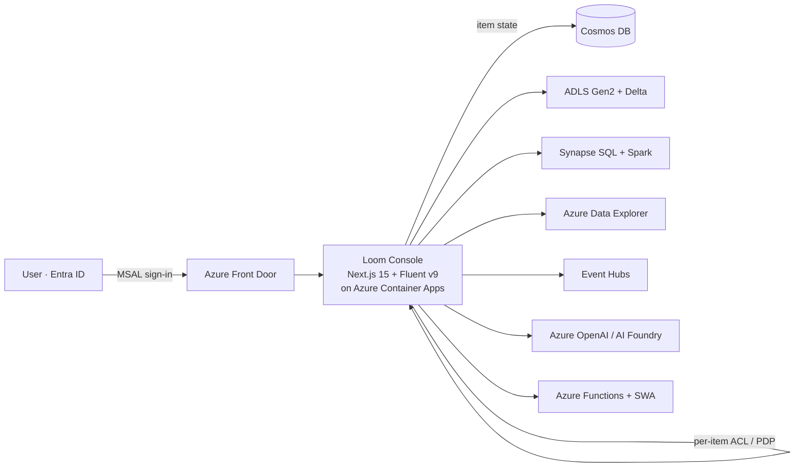

# What is CSA Loom

**CSA Loom** is a Fabric-class analytics console you deploy into your **own Azure
subscription**. It gives teams the workload surface of Microsoft Fabric —
lakehouses, warehouses, pipelines, real-time intelligence, notebooks, semantic
models, reports, data agents, and more — but every item runs on **Azure-native
services and open-source engines**, with **no dependency on a Microsoft Fabric
capacity, a Fabric workspace, or a Power BI workspace**.

If you have ever wanted "Fabric, but in my tenant, in my network, in Government
cloud, on the Azure services I already pay for" — that is CSA Loom.

!!! info "Positioning"
    CSA Loom is the productized, customer-deployable form of the broader
    [Cloud Scale Analytics in a Box](../index.md) reference implementation. It is
    an Azure-native **parity layer** for Microsoft Fabric — see the
    [feature-by-feature comparison](../comparison/csa-loom-vs-fabric.md).

## The core idea: parity without the Fabric dependency

Microsoft Fabric bundles analytics workloads behind a single SaaS control plane
and an F-SKU capacity. That is convenient — but it couples you to a managed
tenant boundary, and Fabric is not generally available across every Azure
Government boundary today.

CSA Loom takes the **same catalog of item types and the same author-time
workflows** and re-implements each one against an **Azure-native default
backend**:

- A **Lakehouse** stores files and Delta tables in **ADLS Gen2**, queried through
  a **Synapse serverless SQL** endpoint and **Spark** — not OneLake.
- A **Warehouse** is a **Synapse dedicated SQL pool** — not a Fabric Warehouse.
- An **Eventhouse / KQL database** is an **Azure Data Explorer (ADX)** cluster —
  not Fabric RTI.
- A **Data pipeline** is a **Synapse pipeline** (or ADF) — not a Fabric pipeline.
- A **Semantic model** and **Report** render on a **Loom-native tabular + report
  layer** over your warehouse/lakehouse — no Power BI workspace required.

The full one-to-one map is on the
[Fabric → Azure-native mapping](fabric-to-azure-mapping.md) page, and the complete
list of every item type is in the [item catalog](item-catalog.md).

A Fabric or Power BI backend can still be used — but only as an **explicit,
opt-in alternative** (an `LOOM_<ITEM>_BACKEND=fabric` flag plus a bound
workspace). By default, and with no configuration, every surface works on Azure
alone. This is a die-hard product rule, not a preference (see
`.claude/rules/no-fabric-dependency.md`).

## Who it's for

CSA Loom is built for teams that want Fabric-class analytics but cannot — or
choose not to — depend on Microsoft Fabric:

- **Azure Government, DoD, and regulated customers** who need the workloads now,
  in boundaries where Fabric is still forecasted.
- **Platform teams** who want per-resource Bicep control, private networking
  (`publicNetworkAccess = disabled`), and per-domain subscription isolation.
- **Data teams with existing Synapse / Databricks / ADX investments** who want a
  unified console over what they already run, rather than a lift to a new SaaS
  plane.
- **ISVs and solution teams** who need a productized, cloneable analytics console
  they can deploy into a customer's tenant.

## Commercial and Government

CSA Loom is designed to deploy the **same feature set** in both **Azure
Commercial** and **Azure Government** (GCC / GCC-High / DoD IL). Where a
Commercial-only Azure capability has no Gov equivalent, the affected surface
shows an **honest infra-gate** (a Fluent MessageBar naming the exact env var,
role, or resource to provision) rather than silently failing — see the
[Government service matrix](../GOV_SERVICE_MATRIX.md) and
[Fabric in Government cloud](../fabric-in-gov-cloud.md).

## How it fits together

Read on:

- [Architecture](architecture.md) — how the console, state store, backends, auth,
  and Bicep fit together.
- [Fabric → Azure-native mapping](fabric-to-azure-mapping.md) — the full parity
  table.
- [Loom Apps](loom-apps.md) — building and distributing apps on Azure-native
  services.
- [Item catalog](item-catalog.md) — every item type, grouped by workload, with
  its Azure-native backend.
