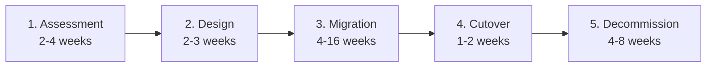

# Migrations to Azure

Field-tested migration playbooks from common on-prem and other-cloud platforms onto the CSA-in-a-Box Azure stack. Each playbook covers **assessment → design → migration → cutover → decommission** with realistic timelines and pitfalls.

- :material-database-arrow-right:{ .lg .middle } **Data, AI & Analytics**

    ***

    Core CSA-aligned playbooks for cloud-scale analytics, data platforms, AI/ML, and the operational data stores that feed them. Hyperscalers, warehouses, lakehouses, BI, ETL, and operational DBs.

    [:octicons-arrow-down-24: Jump to playbooks](#data-ai-analytics-migrations)

- :material-domain:{ .lg .middle } **Enterprise modernization**

    ***

    Adjacent migrations (compute, identity, productivity, DevOps, SecOps) that customers commonly bundle with cloud / data migrations at enterprise scale. Included for big-picture planning, not because they're part of the analytics platform itself.

    [:octicons-arrow-down-24: Jump to playbooks](#enterprise-modernization-beyond-analytics)

---

## Data, AI & Analytics migrations

Core CSA-aligned playbooks for cloud-scale analytics, data platforms, AI/ML, and the operational data stores that feed them.

!!! tip "Migrating to Microsoft Fabric?"
    Several playbooks below target Microsoft Fabric directly. For additional Fabric-specific migration guides, planning worksheets, and tutorials, see the [Supercharge Microsoft Fabric](https://fgarofalo56.github.io/Suppercharge_Microsoft_Fabric/) companion site — including the [Migration Planning Tutorial](https://fgarofalo56.github.io/Suppercharge_Microsoft_Fabric/tutorials/13-migration-planning/) and [Migration Patterns](https://fgarofalo56.github.io/Suppercharge_Microsoft_Fabric/best-practices/migration-patterns/).

### Hyperscaler & cloud platforms (analytics workloads)

| Source                        | Target                         | Playbook                           |
| ----------------------------- | ------------------------------ | ---------------------------------- |
| AWS (Redshift, S3, Glue, EMR) | Synapse, ADLS, ADF, Databricks | [aws-to-azure.md](aws-to-azure.md) |
| GCP (BigQuery, GCS, Dataflow) | Synapse/Fabric, ADLS, ADF      | [gcp-to-azure.md](gcp-to-azure.md) |

### Data warehouses & lakehouses

| Source                           | Target                                        | Playbook                                           |
| -------------------------------- | --------------------------------------------- | -------------------------------------------------- |
| Snowflake                        | Fabric / Synapse + Databricks                 | [snowflake.md](snowflake.md)                       |
| Databricks (other clouds or AWS) | Microsoft Fabric                              | [databricks-to-fabric.md](databricks-to-fabric.md) |
| Teradata                         | Synapse Dedicated SQL Pool / Fabric Warehouse | [teradata.md](teradata.md)                         |
| Palantir Foundry                 | Azure data mesh + Purview                     | [palantir-foundry.md](palantir-foundry.md)         |

### Big data ecosystems

| Source                                       | Target                                   | Playbook                                       |
| -------------------------------------------- | ---------------------------------------- | ---------------------------------------------- |
| Hadoop / Hive (Cloudera, HDInsight, on-prem) | Synapse Spark + Delta / Fabric Lakehouse | [hadoop-hive.md](hadoop-hive.md)               |
| Cloudera / CDH (Impala, NiFi, CDP)           | Synapse + Databricks + ADF               | [cloudera-to-azure.md](cloudera-to-azure.md)   |

### ETL & data integration

| Source                         | Target                                     | Playbook                         |
| ------------------------------ | ------------------------------------------ | -------------------------------- |
| Informatica PowerCenter / IICS | Azure Data Factory / Fabric Data Pipelines | [informatica.md](informatica.md) |

### Business intelligence

| Source  | Target   | Playbook                                                 |
| ------- | -------- | -------------------------------------------------------- |
| Tableau | Power BI | [tableau-to-powerbi.md](tableau-to-powerbi.md)           |
| Qlik    | Power BI | [qlik-to-powerbi.md](qlik-to-powerbi.md)                 |

### Analytics & statistical computing

| Source             | Target              | Playbook                             |
| ------------------ | ------------------- | ------------------------------------ |
| SAS (9.4 / Viya)   | Azure ML / Fabric   | [sas-to-azure.md](sas-to-azure.md)   |

### Operational databases (analytics sources)

| Source                  | Target                              | Playbook                                             |
| ----------------------- | ----------------------------------- | ---------------------------------------------------- |
| SQL Server (on-prem)    | Azure SQL DB / MI / VM              | [sql-server-to-azure.md](sql-server-to-azure.md)     |
| Oracle Database         | Azure SQL MI / PostgreSQL / Oracle@Azure | [oracle-to-azure.md](oracle-to-azure.md)         |
| IBM Db2 (z/OS, LUW, i)  | Azure SQL                           | [db2-to-azure-sql.md](db2-to-azure-sql.md)           |
| MongoDB                 | Cosmos DB (vCore / RU)              | [mongodb-to-cosmosdb.md](mongodb-to-cosmosdb.md)     |
| MySQL (on-prem / cloud) | Azure Database for MySQL / PostgreSQL | [mysql-to-azure.md](mysql-to-azure.md)             |

### Streaming & IoT

| Source                | Target                            | Playbook                             |
| --------------------- | --------------------------------- | ------------------------------------ |
| IoT Hub + ADAL/X.509  | Entra ID + Event Grid + Functions | [iot-hub-entra.md](iot-hub-entra.md) |

## Enterprise modernization (beyond analytics)

These migrations are not part of the core analytics platform but often accompany cloud / data migrations at the enterprise level. Included so architects and customers can see the bigger picture when planning multi-year cloud transformations.

### Compute & infrastructure

| Source       | Target              | Playbook                                       |
| ------------ | ------------------- | ---------------------------------------------- |
| VMware       | Azure VMware Solution / Azure IaaS | [vmware-to-azure.md](vmware-to-azure.md)       |
| Kubernetes (self-managed / EKS / GKE) | AKS    | [kubernetes-to-aks.md](kubernetes-to-aks.md)   |

### End-user computing

| Source         | Target                  | Playbook                                   |
| -------------- | ----------------------- | ------------------------------------------ |
| Citrix         | Azure Virtual Desktop   | [citrix-to-avd.md](citrix-to-avd.md)       |

### Enterprise applications

| Source            | Target                                | Playbook                             |
| ----------------- | ------------------------------------- | ------------------------------------ |
| SAP (ECC, S/4HANA)| SAP on Azure / S/4HANA Cloud          | [sap-to-azure.md](sap-to-azure.md)   |

### Identity & access

| Source                | Target              | Playbook                                           |
| --------------------- | ------------------- | -------------------------------------------------- |
| Active Directory      | Entra ID            | [ad-to-entra-id.md](ad-to-entra-id.md)             |
| Okta                  | Entra ID            | [okta-to-entra-id.md](okta-to-entra-id.md)         |
| HashiCorp Vault       | Azure Key Vault     | [vault-to-key-vault.md](vault-to-key-vault.md)     |

### Productivity & collaboration

| Source                                | Target                                                | Playbook                                                   |
| ------------------------------------- | ----------------------------------------------------- | ---------------------------------------------------------- |
| Exchange (on-prem)                    | Exchange Online                                       | [exchange-to-online.md](exchange-to-online.md)             |
| Google Workspace (Gmail, Drive, Docs) | Microsoft 365 (Exchange, OneDrive, SharePoint, Teams) | [google-workspace-to-m365.md](google-workspace-to-m365.md) |
| SharePoint Server (on-prem)           | SharePoint Online                                     | [sharepoint-to-online.md](sharepoint-to-online.md)         |

### DevOps tooling

| Source   | Target                              | Playbook                                                       |
| -------- | ----------------------------------- | -------------------------------------------------------------- |
| Jenkins  | GitHub Actions / Azure DevOps       | [jenkins-to-github-actions.md](jenkins-to-github-actions.md)   |

### Security operations & observability

| Source                          | Target                  | Playbook                                                                     |
| ------------------------------- | ----------------------- | ---------------------------------------------------------------------------- |
| Splunk (SIEM)                   | Microsoft Sentinel      | [splunk-to-sentinel.md](splunk-to-sentinel.md)                               |
| Datadog / New Relic / Dynatrace | Azure Monitor + AppInsights | [observability-to-azure-monitor.md](observability-to-azure-monitor.md)   |

## What every migration has in common

Regardless of source, every migration follows the same **5 phases**:

| Phase            | Goal                                                                | Output                                                                                     |
| ---------------- | ------------------------------------------------------------------- | ------------------------------------------------------------------------------------------ |
| **Assessment**   | Inventory current state — workloads, data sizes, dependencies, cost | Migration backlog (CSV / Azure Migrate output), workload tier, target architecture options |
| **Design**       | Map source primitives to Azure primitives                           | Target architecture diagram, security model, network topology, sizing assumptions          |
| **Migration**    | Move data + code in waves                                           | Working pipelines, dbt models, dashboards on Azure for each wave                           |
| **Cutover**      | Stop writes to source, freeze, switch consumers                     | Read-only source, consumers on Azure                                                       |
| **Decommission** | Verify, archive, delete                                             | Source archived, contracts cancelled, runbooks updated                                     |

## Sequencing rule

We **always** migrate consumers before producers, going **upstream**:

1. First: **read-only consumers** (BI dashboards, downstream APIs) — point them at a shadow Azure copy
2. Then: **transformations** (dbt / SQL / Spark)
3. Then: **ingestion** (the actual writes from source systems)
4. Finally: **freeze the source** and decommission

This minimizes the window where any single workload depends on both clouds simultaneously.

## Cost during migration

Plan for **~140% of your steady-state Azure cost** during the migration window because both source and target run in parallel. Tag every resource created during migration with `purpose=migration-from-<source>` so you can report on it separately.

See also [Best Practices — Cost Optimization](../best-practices/cost-optimization.md) for tagging and reserved-capacity strategy.

## Compliance during migration

Migration is the highest-risk window for data exposure. Read these before starting:

- [Best Practices — Security & Compliance](../best-practices/security-compliance.md)
- [Compliance — your relevant framework](../compliance/README.md)
- [Runbook — Security Incident](../runbooks/security-incident.md)

Specifically: **never** open a public IP on the source side to "make it easier to copy data over." Use ExpressRoute / VPN / Private Link.

## Need a playbook for something not listed?

Open an issue at https://github.com/fgarofalo56/csa-inabox/issues with the source platform, approximate data volume, and target Azure services. We add playbooks based on demand.
