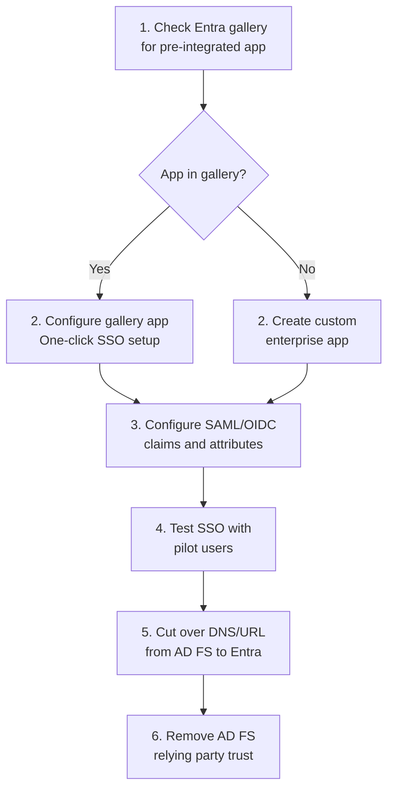
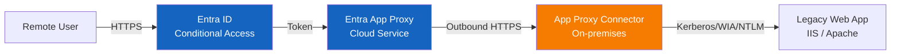
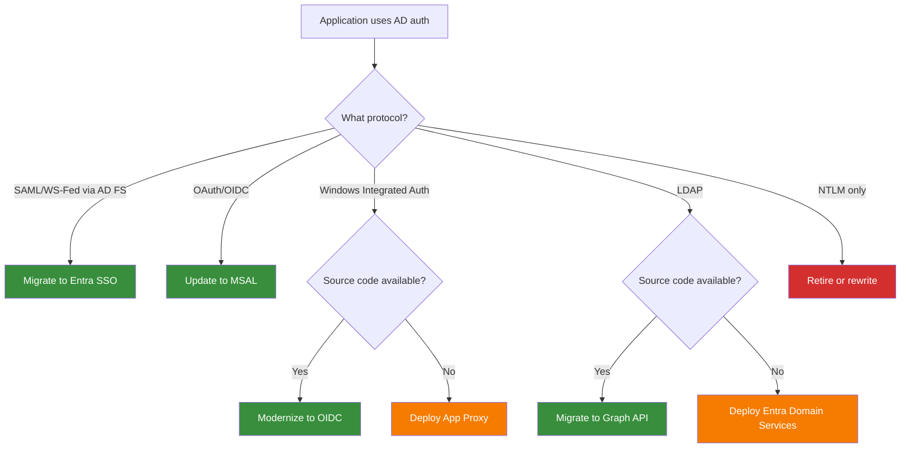

# Application Migration: LDAP and Kerberos to Modern Authentication

**Technical guide for migrating on-premises applications from LDAP, Kerberos, NTLM, and AD FS authentication to modern authentication patterns with Microsoft Entra ID --- covering App Proxy, SAML/OIDC migration, Graph API, and Kerberos cloud trust.**

---

## Overview

Application migration is the most complex and time-consuming aspect of AD-to-Entra-ID migration. Every application that authenticates against Active Directory --- whether through LDAP bind, Kerberos ticket, NTLM challenge, or AD FS federation --- must be assessed, categorized, and migrated to modern authentication or bridged through a compatibility layer.

This guide provides the technical patterns for each migration path, prioritization frameworks, and CSA-in-a-Box integration patterns.

---

## 1. Application inventory and assessment

### Step 1: Discover AD-dependent applications

```powershell
# Method 1: AD FS relying party trusts
# Run on AD FS server:
Get-AdfsRelyingPartyTrust |
    Select-Object Name, Identifier, IssuanceTransformRules,
    MonitoringEnabled, Enabled, TokenLifetime |
    Export-Csv ".\adfs-relying-parties.csv" -NoTypeInformation

# Method 2: LDAP query logging
# Enable LDAP diagnostics on domain controllers:
# Registry: HKLM\SYSTEM\CurrentControlSet\Services\NTDS\Diagnostics
# Set "16 LDAP Interface Events" to 2 (Basic)
# Analyze Event ID 2889 (unsigned LDAP binds) and 1644 (LDAP queries)

# Method 3: Kerberos service ticket analysis
# Analyze Security Event 4769 (Kerberos Service Ticket Operations)
Get-WinEvent -FilterHashtable @{
    LogName = 'Security'
    Id = 4769
    StartTime = (Get-Date).AddDays(-30)
} | ForEach-Object {
    $xml = [xml]$_.ToXml()
    [PSCustomObject]@{
        ServiceName = $xml.Event.EventData.Data[0].'#text'
        ClientAddress = $xml.Event.EventData.Data[6].'#text'
        TicketType = $xml.Event.EventData.Data[4].'#text'
    }
} | Group-Object ServiceName | Sort-Object Count -Descending |
    Select-Object Count, Name | Export-Csv ".\kerberos-service-tickets.csv"
```

### Step 2: Categorize applications

| Category                     | Auth protocol                   | Migration path                               | Complexity  | Priority  |
| ---------------------------- | ------------------------------- | -------------------------------------------- | ----------- | --------- |
| **A: SaaS apps on AD FS**    | SAML/WS-Fed via AD FS           | Entra ID SSO (gallery or custom)             | Low--Medium | 1 (first) |
| **B: Modern web apps**       | OAuth/OIDC                      | MSAL SDK migration                           | Low         | 2         |
| **C: Legacy web apps (IIS)** | Windows Integrated Auth         | Entra Application Proxy                      | Medium      | 3         |
| **D: LDAP-bound apps**       | LDAP simple/secure bind         | Graph API migration or Entra Domain Services | High        | 4         |
| **E: Kerberos apps**         | Kerberos constrained delegation | App Proxy KCD or cloud trust                 | High        | 5         |
| **F: NTLM-only apps**        | NTLM challenge/response         | App rewrite or retirement                    | Very High   | 6 (last)  |

---

## 2. Category A: AD FS to Entra ID SSO migration

### AD FS application activity report

```powershell
# Generate AD FS application usage report
# Identifies which relying parties are actively used

# On AD FS server (requires AD FS 2019+):
$rpUsage = Get-AdfsRelyingPartyTrust | ForEach-Object {
    $rp = $_
    $events = Get-WinEvent -FilterHashtable @{
        LogName = 'AD FS/Admin'
        Id = 299  # Token issued
        StartTime = (Get-Date).AddDays(-90)
    } -ErrorAction SilentlyContinue |
    Where-Object { $_.Message -match $rp.Identifier }

    [PSCustomObject]@{
        Name = $rp.Name
        Identifier = $rp.Identifier[0]
        Protocol = if ($rp.WSFedEndpoint) { "WS-Fed" } else { "SAML" }
        TokensIssued90Days = $events.Count
        LastUsed = ($events | Sort-Object TimeCreated -Descending | Select-Object -First 1).TimeCreated
    }
}

$rpUsage | Sort-Object TokensIssued90Days -Descending |
    Export-Csv ".\adfs-app-usage.csv" -NoTypeInformation
```

### Migration process: AD FS to Entra SSO



### SAML claim mapping: AD FS to Entra

| AD FS claim rule                                                                   | Entra ID equivalent              | Configuration                 |
| ---------------------------------------------------------------------------------- | -------------------------------- | ----------------------------- |
| `c:[Type == "http://schemas.xmlsoap.org/ws/2005/05/identity/claims/upn"]`          | User.userprincipalname (default) | Automatic                     |
| `c:[Type == "http://schemas.xmlsoap.org/ws/2005/05/identity/claims/emailaddress"]` | User.mail                        | Attribute mapping             |
| `c:[Type == "http://schemas.microsoft.com/ws/2008/06/identity/claims/groups"]`     | User.groups                      | Group claims configuration    |
| Custom claim: department                                                           | User.department                  | Custom claim mapping          |
| Custom claim: employee ID                                                          | User.employeeid                  | Custom claim mapping          |
| Transform rule (regex)                                                             | Claims transformation policy     | Entra ID claim transformation |

```powershell
# Configure SAML claims for enterprise app
$appObjectId = "enterprise-app-object-id"

# Add custom claim mapping policy
$claimPolicy = @{
    definition = @(
        '{"ClaimsMappingPolicy":{"Version":1,"IncludeBasicClaimSet":"true","ClaimsSchema":[{"Source":"user","ID":"employeeid","SamlClaimType":"http://schemas.contoso.com/claims/employeeid"},{"Source":"user","ID":"department","SamlClaimType":"http://schemas.contoso.com/claims/department"}]}}'
    )
    displayName = "Custom Claims - Contoso App"
    isOrganizationDefault = $false
}

$policy = New-MgPolicyClaimMappingPolicy -BodyParameter $claimPolicy
# Assign policy to service principal
```

---

## 3. Category B: Modern web application migration

### ADAL to MSAL migration

ADAL (Active Directory Authentication Library) is deprecated. Applications using ADAL must migrate to MSAL (Microsoft Authentication Library).

=== "C# (.NET)"

    ```csharp
    // BEFORE: ADAL (deprecated)
    var authContext = new AuthenticationContext(
        "https://login.microsoftonline.com/contoso.com");
    var result = await authContext.AcquireTokenAsync(
        "https://graph.microsoft.com",
        clientId,
        new UserPasswordCredential(username, password));

    // AFTER: MSAL
    var app = ConfidentialClientApplicationBuilder
        .Create(clientId)
        .WithAuthority(AzureCloudInstance.AzurePublic, tenantId)
        .WithClientSecret(clientSecret) // or .WithCertificate()
        .Build();

    var result = await app.AcquireTokenForClient(
        new[] { "https://graph.microsoft.com/.default" })
        .ExecuteAsync();
    ```

=== "Python"

    ```python
    # BEFORE: ADAL (deprecated)
    import adal
    context = adal.AuthenticationContext(
        f"https://login.microsoftonline.com/{tenant_id}")
    token = context.acquire_token_with_client_credentials(
        "https://graph.microsoft.com", client_id, client_secret)

    # AFTER: MSAL
    from msal import ConfidentialClientApplication
    app = ConfidentialClientApplication(
        client_id,
        authority=f"https://login.microsoftonline.com/{tenant_id}",
        client_credential=client_secret)

    token = app.acquire_token_for_client(
        scopes=["https://graph.microsoft.com/.default"])
    ```

=== "JavaScript"

    ```javascript
    // BEFORE: ADAL.js (deprecated)
    var authContext = new AuthenticationContext({
        clientId: clientId,
        tenant: tenantId,
    });

    // AFTER: MSAL.js
    import { PublicClientApplication } from "@azure/msal-browser";

    const msalConfig = {
        auth: {
            clientId: clientId,
            authority: `https://login.microsoftonline.com/${tenantId}`,
            redirectUri: "https://app.contoso.com",
        },
    };

    const msalInstance = new PublicClientApplication(msalConfig);
    const loginResponse = await msalInstance.loginPopup({
        scopes: ["User.Read"],
    });
    ```

---

## 4. Category C: Legacy web applications (Application Proxy)

Entra Application Proxy provides secure remote access to on-premises web applications without VPN, with Entra SSO and Conditional Access.

### Application Proxy architecture



### Deploy Application Proxy

```powershell
# Step 1: Install Application Proxy connector on an on-premises server
# Download from Entra admin center > Applications > Application Proxy
# Run installer:
.\AADApplicationProxyConnectorInstaller.exe /quiet

# Step 2: Configure the enterprise application
# Via Microsoft Graph API:
$appProxy = @{
    displayName = "Legacy HR Application"
    web = @{
        redirectUris = @("https://hr.contoso.com/")
    }
}
$app = New-MgApplication -BodyParameter $appProxy

# Step 3: Configure Application Proxy settings
# Entra admin center > Enterprise Apps > [App] > Application Proxy
# Internal URL: http://hr-internal.contoso.local:8080/
# External URL: https://hr.contoso.com/ (auto-generated or custom domain)
# Pre-authentication: Azure Active Directory
# Connector Group: Default (or custom group)
```

### Single sign-on with Kerberos constrained delegation

```powershell
# Configure KCD for the Application Proxy connector
# The connector machine account needs delegation rights

# Step 1: Set SPN on the application service account
setspn -s HTTP/hr-internal.contoso.local svc-hr-app

# Step 2: Configure KCD on the connector computer account
# Active Directory Users and Computers > Connector Computer > Delegation tab
# "Trust this computer for delegation to specified services only"
# "Use any authentication protocol"
# Add: HTTP/hr-internal.contoso.local

# Step 3: Configure SSO in the enterprise app
# Entra admin center > Enterprise Apps > [App] > Single sign-on
# Mode: Windows Integrated Authentication
# Internal application SPN: HTTP/hr-internal.contoso.local
# Delegated Login Identity: User principal name
```

---

## 5. Category D: LDAP application migration

### LDAP to Microsoft Graph API migration

| LDAP operation                     | Graph API equivalent           | Example                                      |
| ---------------------------------- | ------------------------------ | -------------------------------------------- |
| `ldap_search(base, scope, filter)` | `GET /users?$filter=...`       | `GET /users?$filter=department eq 'Finance'` |
| `ldap_bind(dn, password)`          | OAuth token acquisition        | MSAL `AcquireTokenByUsernamePassword()`      |
| `ldap_compare(dn, attr, value)`    | `GET /users/{id}?$select=attr` | Check attribute value via GET                |
| `ldap_modify(dn, changes)`         | `PATCH /users/{id}`            | Update user attributes                       |
| `ldap_add(dn, attrs)`              | `POST /users`                  | Create new user                              |
| `ldap_delete(dn)`                  | `DELETE /users/{id}`           | Delete user                                  |
| `ldap_search` with `memberOf`      | `GET /users/{id}/memberOf`     | Group membership query                       |

### LDAP query migration examples

```python
# BEFORE: LDAP query
import ldap

conn = ldap.initialize("ldap://dc01.contoso.com")
conn.simple_bind_s("CN=svc-app,OU=Service,DC=contoso,DC=com", "password")

results = conn.search_s(
    "OU=Users,DC=contoso,DC=com",
    ldap.SCOPE_SUBTREE,
    "(department=Finance)",
    ["displayName", "mail", "memberOf"]
)

for dn, attrs in results:
    print(f"Name: {attrs['displayName'][0]}, Email: {attrs['mail'][0]}")

# AFTER: Microsoft Graph API
from azure.identity import ClientSecretCredential
from msgraph import GraphServiceClient

credential = ClientSecretCredential(tenant_id, client_id, client_secret)
client = GraphServiceClient(credential)

users = await client.users.get(
    request_configuration=RequestConfiguration(
        query_parameters=UsersRequestBuilder.UsersRequestBuilderGetQueryParameters(
            filter="department eq 'Finance'",
            select=["displayName", "mail"],
            expand=["memberOf"]
        )
    )
)

for user in users.value:
    print(f"Name: {user.display_name}, Email: {user.mail}")
```

### When to use Entra Domain Services instead

Entra Domain Services (Entra DS) provides a managed LDAP endpoint in the cloud. Use it when:

- Application source code is not available for modification
- Application requires LDAP bind and cannot be rewritten
- Application uses LDAP search extensively and Graph API migration is impractical
- Timeline does not allow application remediation

```bicep
// Deploy Entra Domain Services via Bicep
resource aadds 'Microsoft.AAD/DomainServices@2022-12-01' = {
  name: 'contoso.com'
  location: location
  properties: {
    domainName: 'aadds.contoso.com'
    filteredSync: 'Enabled'  // Only sync specific groups
    sku: 'Standard'
    ldapsSettings: {
      ldaps: 'Enabled'
      externalAccess: 'Disabled'  // Internal only
    }
    notificationSettings: {
      notifyDcAdmins: 'Enabled'
      notifyGlobalAdmins: 'Enabled'
    }
  }
}
```

---

## 6. Category E: Kerberos application migration

### Kerberos cloud trust

Kerberos cloud trust enables Entra-joined devices to obtain Kerberos tickets for on-premises resources without line of sight to a domain controller.

```powershell
# Configure Kerberos cloud trust
# Step 1: Create the Entra Kerberos server object in AD
Install-Module -Name AzureADHybridAuthenticationManagement -Force

$domain = "contoso.com"
$cloudCred = Get-Credential -Message "Entra ID Global Admin"
$onPremCred = Get-Credential -Message "AD Domain Admin"

Set-AzureADKerberosServer -Domain $domain `
    -CloudCredential $cloudCred `
    -DomainCredential $onPremCred

# Step 2: Verify the Kerberos server object
Get-AzureADKerberosServer -Domain $domain -CloudCredential $cloudCred `
    -DomainCredential $onPremCred
```

---

## 7. Application migration tracking

### Migration status dashboard

| Application      | Category | Protocol | Migration path    | Status      | Target date |
| ---------------- | -------- | -------- | ----------------- | ----------- | ----------- |
| Salesforce       | A        | SAML     | Entra SSO gallery | Complete    | ---         |
| ServiceNow       | A        | SAML     | Entra SSO gallery | Complete    | ---         |
| Custom HR Portal | C        | WIA      | App Proxy + KCD   | In progress | Week 12     |
| Legacy ERP       | D        | LDAP     | Graph API rewrite | Planning    | Week 20     |
| File Server      | E        | Kerberos | Cloud trust       | In progress | Week 16     |
| Old Intranet     | F        | NTLM     | Retirement        | Approved    | Week 24     |

### Migration decision tree



---

## CSA-in-a-Box integration

Application migration enables full CSA-in-a-Box platform access through Entra ID:

- **Databricks workspace:** OAuth/OIDC SSO via Entra ID; no AD FS dependency
- **Fabric portal:** Entra SSO with Conditional Access; no legacy auth
- **Purview catalog:** Graph API for programmatic access; no LDAP
- **Power BI embedded:** MSAL token acquisition for embedded analytics
- **Custom data applications:** MSAL SDK for all new application development

All CSA-in-a-Box applications use modern authentication exclusively. Legacy auth protocols are not supported.

---

**Maintainers:** csa-inabox core team
**Last updated:** 2026-04-30
