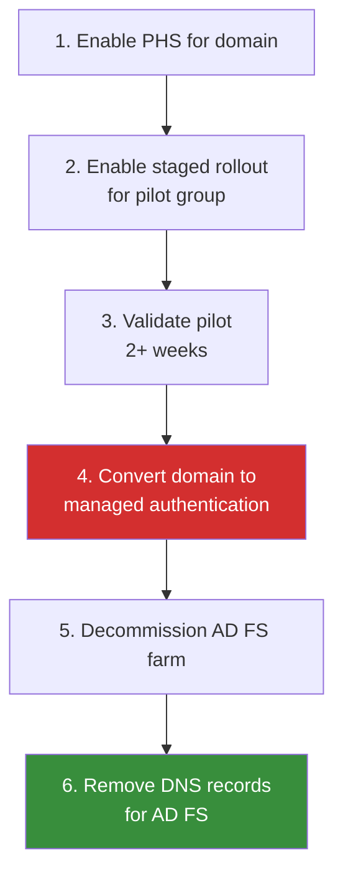

# Cloud-Only Identity Migration

**Guide for migrating from synchronized hybrid identity to fully cloud-managed identities in Microsoft Entra ID --- covering user object conversion, mailbox migration dependencies, application readiness, and de-federation.**

---

## Overview

Cloud-only identity is the final state of the AD-to-Entra-ID migration. In this state, all user objects are managed directly in Entra ID with no dependency on on-premises Active Directory. Domain controllers, Entra Connect/Cloud Sync agents, AD FS farms, and all AD infrastructure are decommissioned.

This guide covers the technical process of converting synchronized users to cloud-managed users, the dependencies that must be resolved first, and the rollback procedures for each step.

---

## 1. Prerequisites for cloud-only migration

Before converting any user from synced to cloud-managed, all dependencies on on-premises AD must be resolved.

### Dependency checklist

| Dependency                               | Status required     | Validation method                                           |
| ---------------------------------------- | ------------------- | ----------------------------------------------------------- |
| All applications migrated from AD FS     | Complete            | No remaining relying party trusts                           |
| All LDAP applications remediated         | Complete            | LDAP query logs show zero queries from production apps      |
| All Kerberos applications migrated       | Complete            | No KCD configurations active                                |
| Devices Entra-joined (not hybrid-joined) | Complete or planned | Intune device inventory shows Entra Join                    |
| Group Policy migrated to Intune          | Complete            | Intune compliance reports show coverage                     |
| Mailbox migration to Exchange Online     | Complete            | No on-prem Exchange mailboxes for target users              |
| DNS migrated from AD-integrated          | Complete            | DNS zones hosted in Azure DNS or standalone                 |
| RADIUS/NPS replaced                      | Complete            | Network device auth via Entra Private Access or third-party |
| Service accounts converted               | Complete            | Workload identities or managed identities in use            |

### Mailbox migration dependency

Exchange hybrid environments create a hard dependency on directory synchronization. Users with on-premises Exchange mailboxes **cannot** be converted to cloud-only until their mailbox is migrated to Exchange Online.

```powershell
# Identify users with on-premises mailboxes
Get-MgUser -All -Property UserPrincipalName, Mail, OnPremisesSyncEnabled,
    ProxyAddresses |
    Where-Object {
        $_.OnPremisesSyncEnabled -eq $true -and
        $_.ProxyAddresses -match "SMTP:"
    } |
    Select-Object UserPrincipalName, Mail |
    Export-Csv -Path ".\users-with-onprem-mailbox.csv" -NoTypeInformation
```

---

## 2. User object conversion process

### Step 1: Identify conversion candidates

```powershell
# Get all synchronized users
$syncedUsers = Get-MgUser -All -Property `
    UserPrincipalName, OnPremisesSyncEnabled, OnPremisesImmutableId,
    OnPremisesDomainName, OnPremisesSamAccountName |
    Where-Object { $_.OnPremisesSyncEnabled -eq $true }

Write-Host "Total synced users: $($syncedUsers.Count)"

# Categorize by conversion readiness
$readyForConversion = $syncedUsers | Where-Object {
    # Add your readiness criteria here
    # Example: users in specific OUs, departments, or locations
    $_.OnPremisesDomainName -eq "corp.contoso.com"
}

Write-Host "Ready for conversion: $($readyForConversion.Count)"
```

### Step 2: Remove from sync scope

The safest conversion method is to remove users from the sync scope and let the sync engine handle the transition.

=== "Cloud Sync"

    1. Navigate to **Entra admin center** > **Entra Connect** > **Cloud Sync**
    2. Edit the configuration
    3. Modify the **Scoping filter** to exclude the target OU or group
    4. Save and wait for next sync cycle

=== "Entra Connect"

    ```powershell
    # Option A: Move users to an excluded OU in AD
    # Then wait for sync cycle
    Get-ADUser -Identity "jdoe" |
        Move-ADObject -TargetPath "OU=CloudOnly,OU=Users,DC=contoso,DC=com"

    # Option B: Filter by attribute
    # Set a custom attribute on users ready for conversion
    Set-ADUser -Identity "jdoe" -Replace @{
        extensionAttribute15 = "CloudManaged"
    }
    # Add attribute filter to Entra Connect/Cloud Sync configuration
    ```

### Step 3: Validate cloud-only status

```powershell
# After sync cycle processes the scope change
$user = Get-MgUser -UserId "jdoe@contoso.com" `
    -Property OnPremisesSyncEnabled, OnPremisesImmutableId,
    OnPremisesLastSyncDateTime

if ($user.OnPremisesSyncEnabled -eq $false -or $user.OnPremisesSyncEnabled -eq $null) {
    Write-Host "User is cloud-managed" -ForegroundColor Green
    Write-Host "Last sync: $($user.OnPremisesLastSyncDateTime)"
} else {
    Write-Host "User is still synchronized" -ForegroundColor Red
}
```

### Step 4: Clear on-premises anchor

```powershell
# Optional: Clear the ImmutableId to fully sever the link
# This prevents accidental re-matching if sync is re-enabled
Update-MgUser -UserId "jdoe@contoso.com" `
    -OnPremisesImmutableId ""

# Verify
$user = Get-MgUser -UserId "jdoe@contoso.com" `
    -Property OnPremisesImmutableId
Write-Host "ImmutableId: '$($user.OnPremisesImmutableId)'"
# Should be empty
```

---

## 3. Bulk conversion process

For large-scale conversion, use a scripted approach with validation gates.

```powershell
# Bulk conversion script with safety checks
param(
    [string]$CsvPath = ".\conversion-candidates.csv",
    [switch]$WhatIf
)

$candidates = Import-Csv -Path $CsvPath
$results = @()

foreach ($candidate in $candidates) {
    $upn = $candidate.UserPrincipalName

    # Safety check 1: Verify user exists in Entra
    $user = Get-MgUser -UserId $upn -Property `
        OnPremisesSyncEnabled, Mail, AssignedLicenses -ErrorAction SilentlyContinue

    if (-not $user) {
        $results += [PSCustomObject]@{
            UPN = $upn; Status = "NOT_FOUND"; Action = "SKIP"
        }
        continue
    }

    # Safety check 2: Verify mailbox is in Exchange Online
    # (Requires Exchange Online PowerShell module)
    $mailbox = Get-EXOMailbox -Identity $upn -ErrorAction SilentlyContinue
    if (-not $mailbox) {
        $results += [PSCustomObject]@{
            UPN = $upn; Status = "NO_CLOUD_MAILBOX"; Action = "SKIP"
        }
        continue
    }

    # Safety check 3: Verify no active AD FS relying party dependencies
    # (Check sign-in logs for federated auth in last 30 days)
    $fedSignIns = Get-MgAuditLogSignIn -Filter `
        "userPrincipalName eq '$upn' and authenticationProtocol eq 'wsFed'" `
        -Top 1

    if ($fedSignIns) {
        $results += [PSCustomObject]@{
            UPN = $upn; Status = "ACTIVE_FEDERATION"; Action = "SKIP"
        }
        continue
    }

    # All checks passed - proceed with conversion
    if (-not $WhatIf) {
        # Move user out of sync scope in AD
        $adUser = Get-ADUser -Filter "UserPrincipalName -eq '$upn'"
        if ($adUser) {
            Move-ADObject -Identity $adUser.DistinguishedName `
                -TargetPath "OU=CloudManaged,DC=contoso,DC=com"
        }
    }

    $results += [PSCustomObject]@{
        UPN = $upn; Status = "CONVERTED"; Action = if ($WhatIf) { "WHATIF" } else { "MOVED" }
    }
}

$results | Export-Csv -Path ".\conversion-results.csv" -NoTypeInformation
$results | Group-Object Status | Format-Table Name, Count
```

---

## 4. De-federation

De-federation is the process of converting a federated domain from AD FS to managed authentication (PHS or cloud-only).

### De-federation sequence



### Domain conversion

```powershell
# Convert domain from federated to managed
# WARNING: This affects ALL users in the domain immediately
# Use staged rollout to pilot before full conversion

# Check current domain authentication type
$domain = Get-MgDomain -DomainId "contoso.com"
Write-Host "Current auth type: $($domain.AuthenticationType)"

# Convert to managed (PHS)
Update-MgDomain -DomainId "contoso.com" `
    -AuthenticationType "Managed"

# Verify conversion
$domain = Get-MgDomain -DomainId "contoso.com"
Write-Host "New auth type: $($domain.AuthenticationType)"
# Should output: "Managed"
```

### Post-de-federation cleanup

```powershell
# Remove AD FS farm
# On each AD FS server:
Uninstall-WindowsFeature ADFS-Federation -IncludeManagementTools

# Remove WAP (Web Application Proxy) servers
Uninstall-WindowsFeature Web-Application-Proxy -IncludeManagementTools

# Remove DNS records
# - fs.contoso.com (A record pointing to AD FS VIP)
# - enterpriseregistration.contoso.com (CNAME for device registration)

# Remove SSL certificates from load balancer
# Remove AD FS service account from AD
```

---

## 5. Application readiness assessment

Before cloud-only conversion, every application must be assessed for AD dependency.

### Application dependency categories

| Category               | Examples                        | Cloud-only compatible | Migration path                        |
| ---------------------- | ------------------------------- | --------------------- | ------------------------------------- |
| **SaaS (SAML/OIDC)**   | Salesforce, ServiceNow, Workday | Yes                   | Entra ID SSO gallery app              |
| **Modern web (OAuth)** | Custom .NET Core, Node.js apps  | Yes                   | MSAL integration                      |
| **Legacy web (WIA)**   | Classic ASP, IIS WIA apps       | Requires bridging     | Entra Application Proxy               |
| **LDAP-bound**         | HR systems, legacy ERP          | Requires migration    | Graph API or Entra Domain Services    |
| **Kerberos-dependent** | File servers, SQL Server WIA    | Requires bridging     | Kerberos cloud trust or App Proxy KCD |
| **NTLM-only**          | Very old applications           | Requires remediation  | Application rewrite or retirement     |

### Application readiness report

```powershell
# Generate application readiness report
# Requires: Entra ID sign-in logs, AD FS audit logs

# SaaS applications already using Entra SSO
$entraApps = Get-MgServicePrincipal -All |
    Where-Object { $_.AppId -ne $null -and $_.Tags -contains "WindowsAzureActiveDirectoryIntegratedApp" } |
    Select-Object DisplayName, AppId, SignInAudience

# AD FS relying parties still active
# (Run on AD FS server)
$adfsRPs = Get-AdfsRelyingPartyTrust | Select-Object Name, Identifier, Enabled

# Compare: apps in Entra vs apps still on AD FS
Write-Host "Apps in Entra SSO: $($entraApps.Count)"
Write-Host "Apps still on AD FS: $(($adfsRPs | Where-Object Enabled).Count)"
```

---

## 6. Service account conversion

Service accounts are often the last dependency blocking AD decommission.

### Service account types and conversion

| AD service account type               | Entra ID replacement                     | Conversion effort |
| ------------------------------------- | ---------------------------------------- | ----------------- |
| User-based service account (password) | Managed identity (system-assigned)       | Medium            |
| Group-managed service account (gMSA)  | Managed identity (user-assigned)         | Medium            |
| Computer account (machine identity)   | Workload identity (federated credential) | Medium            |
| Scheduled task credential             | Managed identity + Azure Automation      | Low               |
| SQL Server service account            | Managed identity for Azure SQL           | Low               |

```powershell
# Inventory all service accounts in AD
Get-ADUser -Filter {
    ServicePrincipalName -like "*" -or
    Description -like "*service*" -or
    PasswordNeverExpires -eq $true
} -Properties ServicePrincipalName, PasswordNeverExpires, LastLogonDate,
    Description, PasswordLastSet |
    Select-Object SamAccountName, Description, ServicePrincipalName,
    PasswordNeverExpires, PasswordLastSet, LastLogonDate |
    Export-Csv -Path ".\service-accounts-audit.csv" -NoTypeInformation
```

---

## 7. Rollback procedures

Every conversion step must have a documented rollback.

### Rollback: User conversion

```powershell
# If a cloud-only user needs to be re-synced to AD:
# 1. Move the user back into the sync scope OU
Move-ADObject -Identity "CN=John Doe,OU=CloudManaged,DC=contoso,DC=com" `
    -TargetPath "OU=Employees,DC=contoso,DC=com"

# 2. Set the ImmutableId back to the on-prem objectGUID
$onPremGuid = (Get-ADUser -Identity "jdoe" -Properties objectGUID).objectGUID
$immutableId = [System.Convert]::ToBase64String($onPremGuid.ToByteArray())
Update-MgUser -UserId "jdoe@contoso.com" -OnPremisesImmutableId $immutableId

# 3. Wait for next sync cycle (or force sync)
# Cloud Sync: automatic within minutes
# Entra Connect: Start-ADSyncSyncCycle -PolicyType Delta
```

### Rollback: De-federation

```powershell
# Re-federate a managed domain (emergency rollback)
# Requires AD FS farm to still be operational
New-MgDomainFederationConfiguration -DomainId "contoso.com" `
    -IssuerUri "http://fs.contoso.com/adfs/services/trust" `
    -PassiveSignInUri "https://fs.contoso.com/adfs/ls/" `
    -SigningCertificate $signingCert `
    -ActiveSignInUri "https://fs.contoso.com/adfs/services/trust/2005/usernamemixed"
```

---

## 8. Validation and testing

### Pre-conversion validation checklist

- [ ] User can sign in to all required applications with Entra ID (not AD FS)
- [ ] User's mailbox is in Exchange Online (not on-premises)
- [ ] User's device is Entra-joined (not domain-joined only)
- [ ] No LDAP queries from production apps targeting this user's attributes
- [ ] No active Kerberos tickets issued from on-prem DCs for this user
- [ ] User's groups are all synced or cloud-managed
- [ ] MFA is registered and functional

### Post-conversion validation

```powershell
# Run after each conversion wave
$convertedUsers = Import-Csv ".\conversion-results.csv" |
    Where-Object { $_.Status -eq "CONVERTED" }

foreach ($user in $convertedUsers) {
    $mgUser = Get-MgUser -UserId $user.UPN -Property `
        OnPremisesSyncEnabled, AccountEnabled, AssignedLicenses

    [PSCustomObject]@{
        UPN                  = $user.UPN
        CloudManaged         = ($mgUser.OnPremisesSyncEnabled -ne $true)
        AccountEnabled       = $mgUser.AccountEnabled
        LicensesAssigned     = ($mgUser.AssignedLicenses.Count -gt 0)
    }
} | Format-Table -AutoSize
```

---

## CSA-in-a-Box integration

Cloud-only identity is the optimal state for CSA-in-a-Box:

- **No sync latency:** Group membership changes take effect immediately (vs 30-minute sync cycle)
- **Dynamic groups:** Cloud-only users support all dynamic group rule properties
- **Lifecycle workflows:** Entra ID Lifecycle Workflows automate onboarding/offboarding for platform access
- **Workload identity federation:** CI/CD pipelines use federated credentials without secrets

```bicep
// CSA-in-a-Box Bicep: Workload identity for GitHub Actions deployment
resource federatedCredential 'Microsoft.ManagedIdentity/userAssignedIdentities/federatedIdentityCredentials@2023-01-31' = {
  name: 'github-deploy-csa'
  parent: deploymentIdentity
  properties: {
    issuer: 'https://token.actions.githubusercontent.com'
    subject: 'repo:contoso/csa-inabox:ref:refs/heads/main'
    audiences: ['api://AzureADTokenExchange']
  }
}
```

---

**Maintainers:** csa-inabox core team
**Last updated:** 2026-04-30
