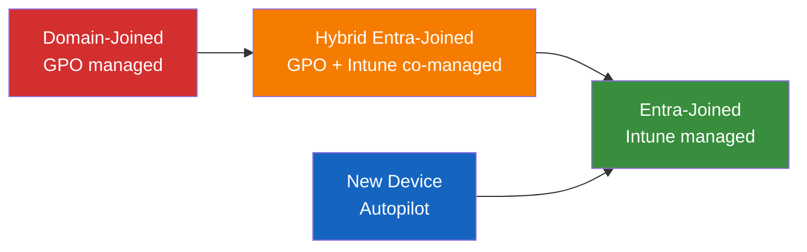
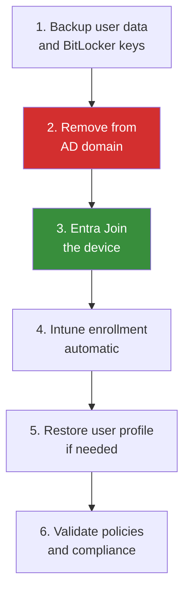

# Device Migration: Domain-Joined to Entra-Joined

**Technical guide for migrating Windows devices from Active Directory domain join to Microsoft Entra Join, covering hybrid join as an interim state, Autopilot provisioning, Intune enrollment, BitLocker key escrow, and compliance policies.**

---

## Overview

Device join state determines how a Windows device authenticates, receives policy, and is managed. On-premises AD uses domain join; Entra ID uses Entra Join. The migration path typically goes through hybrid join as an interim state before reaching Entra Join as the target.

This guide covers the full device migration lifecycle --- from planning through execution to AD domain unjoin.

---

## 1. Device join states

| Join state              | Authentication                | Management                            | GPO support | Conditional Access | Target             |
| ----------------------- | ----------------------------- | ------------------------------------- | ----------- | ------------------ | ------------------ |
| **AD domain-joined**    | Kerberos/NTLM to on-prem DC   | Group Policy                          | Full        | No (unless hybrid) | Migrate away       |
| **Hybrid Entra-joined** | Kerberos to DC + PRT to Entra | Group Policy + Intune (co-management) | Full        | Yes                | Interim            |
| **Entra-joined**        | PRT to Entra ID               | Intune only                           | None        | Yes                | **Primary target** |
| **Entra-registered**    | User-level only (BYOD)        | Intune MAM                            | None        | Limited            | BYOD devices       |

### Recommended migration path



---

## 2. Phase 1: Hybrid Entra Join (interim)

Hybrid Entra Join adds an Entra ID device registration to an existing domain-joined device. This enables Conditional Access and Intune co-management without removing the AD domain join.

### Prerequisites

- Entra Connect or Cloud Sync with device sync enabled
- Service Connection Point (SCP) configured in AD
- Line of sight to domain controller and Entra ID endpoints

### Configure Hybrid Entra Join

```powershell
# Option 1: Via Entra Connect
# Run Entra Connect wizard > Configure device options > Hybrid Azure AD Join

# Option 2: Manual SCP configuration
# On a domain controller:
$configNC = (Get-ADRootDSE).configurationNamingContext
$scp = "CN=62a0ff2e-97b9-4513-943f-0d221bd30080,CN=Device Registration Configuration,CN=Services,$configNC"

# Verify SCP exists
Get-ADObject -Identity $scp -Properties keywords, serviceBindingInformation

# SCP should contain:
# keywords: azureADId:<tenant-id>
# serviceBindingInformation: https://enterpriseregistration.windows.net
```

### Verify Hybrid Entra Join

```powershell
# On a Windows device:
dsregcmd /status

# Look for:
# AzureAdJoined : YES
# DomainJoined : YES
# AzureAdPrt : YES (Primary Refresh Token issued)
```

### Intune co-management enrollment

```powershell
# Configure co-management via SCCM (if SCCM is in use)
# Or enroll devices via Intune GPO:

# Create GPO to trigger Intune enrollment
# Computer Configuration > Administrative Templates > Windows Components >
# MDM > Enable automatic MDM enrollment using default Azure AD credentials

# Registry equivalent:
# HKLM\SOFTWARE\Policies\Microsoft\Windows\CurrentVersion\MDM
# AutoEnrollMDM = 1
# UseAADCredentialType = 1
```

---

## 3. Phase 2: Entra Join (target state)

Entra Join is the target state where devices authenticate exclusively through Entra ID with no on-premises AD dependency.

### Methods for achieving Entra Join

| Method                    | Scenario                       | Effort | Recommended                      |
| ------------------------- | ------------------------------ | ------ | -------------------------------- |
| **Windows Autopilot**     | New device or device reset     | Low    | **Yes** --- primary method       |
| **Fresh OS install**      | Device refresh cycle           | Medium | Yes                              |
| **In-place migration**    | Convert existing hybrid device | High   | When device reset is impractical |
| **Bulk enrollment token** | Kiosk/shared devices           | Low    | Specific scenarios               |

### Windows Autopilot deployment

#### Step 1: Register devices in Autopilot

```powershell
# Collect hardware hash from existing devices
# Run on each device (or deploy via SCCM/Intune script):
[System.Net.WebClient]::new().DownloadFile(
    "https://www.powershellgallery.com/api/v2/package/Get-WindowsAutoPilotInfo",
    "$env:TEMP\Get-WindowsAutoPilotInfo.nupkg"
)
Install-Script -Name Get-WindowsAutoPilotInfo -Force
Get-WindowsAutoPilotInfo -OutputFile "$env:TEMP\autopilot-hash.csv"

# Upload to Intune via Graph API or admin center
# Intune > Devices > Enrollment > Windows Autopilot > Devices > Import
```

#### Step 2: Create Autopilot deployment profile

```powershell
# Via Microsoft Graph API
$profile = @{
    displayName = "CSA-in-a-Box Standard Profile"
    description = "Entra Join + Intune MDM for data platform users"
    language = "en-US"
    extractHardwareHash = $true
    deviceNameTemplate = "CSA-%SERIAL%"
    outOfBoxExperienceSettings = @{
        hidePrivacySettings = $true
        hideEULA = $true
        userType = "Standard"
        hideEscapeLink = $true
        skipKeyboardSelectionPage = $true
        deviceUsageType = "SingleUser"
    }
}

New-MgDeviceManagementWindowsAutopilotDeploymentProfile -BodyParameter $profile
```

#### Step 3: Assign Autopilot profile to device group

```powershell
# Create dynamic device group for Autopilot devices
New-MgGroup -DisplayName "CSA-Autopilot-Devices" `
    -GroupTypes "DynamicMembership" `
    -MembershipRule '(device.devicePhysicalIDs -any (_ -contains "[ZTDId]"))' `
    -MembershipRuleProcessingState "On" `
    -SecurityEnabled $true `
    -MailEnabled $false `
    -MailNickname "csa-autopilot"
```

---

## 4. In-place migration: Hybrid to Entra Join

For devices that cannot be reset, an in-place migration is possible but requires careful planning.

### In-place migration steps



### Migration script

```powershell
# WARNING: This removes the device from the AD domain
# Test thoroughly on pilot devices before broad deployment

# Step 1: Backup BitLocker recovery key
$bitlockerVolume = Get-BitLockerVolume -MountPoint "C:"
$recoveryKey = $bitlockerVolume.KeyProtector |
    Where-Object { $_.KeyProtectorType -eq "RecoveryPassword" }
Write-Host "Recovery Key ID: $($recoveryKey.KeyProtectorId)"
Write-Host "Recovery Key: $($recoveryKey.RecoveryPassword)"
# Save securely before proceeding

# Step 2: Verify user has Entra ID credentials
# User must know their Entra ID UPN and password (or have passwordless registered)

# Step 3: Leave the AD domain and join Entra ID
# This requires a reboot
# Run as administrator:
$cred = Get-Credential -Message "Enter local admin credentials"
Remove-Computer -UnjoinDomainCredential $cred -Force -Restart

# After reboot:
# Settings > Accounts > Access work or school > Connect
# Select "Join this device to Azure Active Directory"
# Sign in with Entra ID credentials
```

### Automated in-place migration

```powershell
# For large-scale in-place migration, use a scheduled task approach:

# 1. Deploy migration package via Intune or SCCM
# 2. Schedule the migration during maintenance window
# 3. Script handles: domain unjoin > reboot > Entra Join

# Migration task sequence:
$migrationScript = @'
# Pre-migration checks
$dsregStatus = dsregcmd /status
if ($dsregStatus -match "DomainJoined\s*:\s*YES" -and
    $dsregStatus -match "AzureAdJoined\s*:\s*YES") {

    # Device is hybrid - safe to proceed

    # Backup BitLocker keys to Entra ID (if not already)
    BackupToAAD-BitLockerKeyProtector -MountPoint "C:" `
        -KeyProtectorId (Get-BitLockerVolume -MountPoint "C:").KeyProtector[0].KeyProtectorId

    # Leave domain
    Remove-Computer -UnjoinDomainCredential (New-Object PSCredential(
        "CONTOSO\svc-migration",
        (ConvertTo-SecureString "PLACEHOLDER" -AsPlainText -Force)
    )) -Force

    # Schedule Entra Join on next login
    # The device will prompt user to join Entra ID after reboot
}
'@
```

---

## 5. BitLocker key management

BitLocker recovery keys must be escrowed to Entra ID before device migration.

### Escrow BitLocker keys to Entra ID

```powershell
# Backup all BitLocker recovery keys to Entra ID
$volumes = Get-BitLockerVolume | Where-Object { $_.ProtectionStatus -eq "On" }

foreach ($volume in $volumes) {
    $recoveryProtector = $volume.KeyProtector |
        Where-Object { $_.KeyProtectorType -eq "RecoveryPassword" }

    if ($recoveryProtector) {
        BackupToAAD-BitLockerKeyProtector -MountPoint $volume.MountPoint `
            -KeyProtectorId $recoveryProtector.KeyProtectorId
        Write-Host "Backed up key for $($volume.MountPoint)" -ForegroundColor Green
    }
}
```

### Verify key escrow

```powershell
# Via Graph API - verify BitLocker keys are in Entra ID
$deviceId = (dsregcmd /status | Select-String "DeviceId").ToString().Split(":")[1].Trim()

$keys = Get-MgInformationProtectionBitlockerRecoveryKey -Filter "deviceId eq '$deviceId'"
Write-Host "Keys escrowed: $($keys.Count)"
```

---

## 6. Compliance policies

Intune compliance policies replace the device health checks that GPO provided.

### Baseline compliance policy for CSA-in-a-Box

```json
{
    "displayName": "CSA-in-a-Box Device Compliance",
    "description": "Compliance policy for devices accessing CSA-in-a-Box data platform",
    "platforms": "windows10AndLater",
    "settings": {
        "deviceThreatProtection": {
            "requireDeviceThreatProtection": true,
            "deviceThreatProtectionRequiredSecurityLevel": "secured"
        },
        "osMinimumVersion": "10.0.19045",
        "bitLockerEnabled": true,
        "secureBootEnabled": true,
        "codeIntegrityEnabled": true,
        "tpmRequired": true,
        "firewallEnabled": true,
        "antivirusRequired": true,
        "antiSpywareRequired": true,
        "passwordRequired": true,
        "passwordMinimumLength": 12,
        "storageRequireEncryption": true
    },
    "scheduledActionsForRule": [
        {
            "ruleName": "PasswordRequired",
            "scheduledActionConfigurations": [
                {
                    "actionType": "block",
                    "gracePeriodHours": 24,
                    "notificationTemplateId": "default"
                }
            ]
        }
    ]
}
```

### Conditional Access integration

```powershell
# Create Conditional Access policy requiring compliant device for CSA-in-a-Box
$policy = @{
    displayName = "CSA-in-a-Box - Require Compliant Device"
    state = "enabledForReportingButNotEnforced"  # Start in report-only
    conditions = @{
        applications = @{
            includeApplications = @(
                "00000003-0000-0ff1-ce00-000000000000"  # SharePoint (Fabric)
                # Add Databricks, Purview app IDs
            )
        }
        users = @{
            includeGroups = @("CSA-Platform-Users-GroupId")
        }
    }
    grantControls = @{
        operator = "AND"
        builtInControls = @(
            "compliantDevice"
            "mfa"
        )
    }
}

New-MgIdentityConditionalAccessPolicy -BodyParameter $policy
```

---

## 7. Windows LAPS migration

Windows LAPS (Local Administrator Password Solution) manages local admin passwords. Migration from legacy LAPS (AD-backed) to Windows LAPS (Entra ID-backed) is required for Entra-joined devices.

### Configure Windows LAPS for Entra ID

```powershell
# Intune > Endpoint Security > Account Protection > Local Admin Password Solution (LAPS)
# Or via Intune configuration profile:

$lapsPolicy = @{
    displayName = "CSA LAPS Policy"
    settings = @{
        backupDirectory = "Azure AD"  # Entra ID backup
        passwordAgeDays = 30
        passwordLength = 24
        passwordComplexity = "Large letters + small letters + numbers + special characters"
        administratorAccountName = "CSA-LocalAdmin"
        postAuthenticationResetDelay = 24  # hours
        postAuthenticationActions = "Reset password and log off"
    }
}
```

### Retrieve LAPS passwords from Entra ID

```powershell
# Via Graph API
$deviceId = "device-object-id-here"
$lapsPassword = Get-MgDeviceLocalCredential -DeviceId $deviceId
$lapsPassword | Select-Object DeviceName, AccountName,
    @{N="Password"; E={[System.Text.Encoding]::UTF8.GetString(
        [System.Convert]::FromBase64String($_.Credentials[0].AccountPassword)
    )}}
```

---

## 8. Migration wave planning

### Device migration waves

| Wave           | Scope               | Devices      | Criteria                                           | Duration |
| -------------- | ------------------- | ------------ | -------------------------------------------------- | -------- |
| Wave 0 (pilot) | IT department       | 50--100      | Identity team, early adopters                      | 2 weeks  |
| Wave 1         | Cloud-first workers | 500--1,000   | No on-prem app dependency, remote workers          | 4 weeks  |
| Wave 2         | General population  | 1,000--5,000 | Standard knowledge workers                         | 8 weeks  |
| Wave 3         | Specialized devices | 500--2,000   | Developer workstations, kiosks, conference rooms   | 4 weeks  |
| Wave 4         | Legacy holdouts     | Remaining    | Devices with on-prem dependencies (addressed last) | 4 weeks  |

### Success metrics per wave

| Metric                      | Target    | Measurement                     |
| --------------------------- | --------- | ------------------------------- |
| Entra Join success rate     | > 98%     | Intune device compliance report |
| Help desk ticket increase   | < 10%     | Help desk ticket system         |
| User satisfaction           | > 4.0/5.0 | Post-migration survey           |
| SSO functionality           | 100%      | Application access testing      |
| BitLocker key escrow        | 100%      | Entra ID BitLocker key report   |
| Compliance policy pass rate | > 95%     | Intune compliance dashboard     |

---

## 9. Troubleshooting

### Common issues

| Issue                      | Symptom                                   | Resolution                                                                        |
| -------------------------- | ----------------------------------------- | --------------------------------------------------------------------------------- |
| PRT not issued             | `dsregcmd /status` shows `AzureAdPrt: NO` | Verify Entra ID endpoints reachable; check Conditional Access; re-register device |
| Hybrid Join fails          | Device not appearing in Entra ID          | Verify SCP configuration; check `userCertificate` attribute on computer object    |
| Autopilot OOBE fails       | Error during out-of-box experience        | Verify hardware hash uploaded; check Autopilot profile assignment; verify network |
| BitLocker key escrow fails | Key not appearing in Entra ID             | Run `BackupToAAD-BitLockerKeyProtector` manually; verify device registration      |
| SSO broken after migration | Apps requiring re-authentication          | Clear token cache; verify PRT; check Conditional Access for device compliance     |

### Diagnostic commands

```powershell
# Full device registration status
dsregcmd /status

# Detailed debug for registration issues
dsregcmd /status /debug

# Check network connectivity to Entra endpoints
Test-NetConnection -ComputerName "enterpriseregistration.windows.net" -Port 443
Test-NetConnection -ComputerName "login.microsoftonline.com" -Port 443
Test-NetConnection -ComputerName "device.login.microsoftonline.com" -Port 443

# Force device registration refresh
dsregcmd /forcerecovery

# Check Intune enrollment
Get-ChildItem "HKLM:\SOFTWARE\Microsoft\Enrollments" |
    Get-ItemProperty |
    Select-Object PSChildName, UPN, ProviderID
```

---

## CSA-in-a-Box integration

Entra-joined devices provide the strongest security posture for CSA-in-a-Box access:

- **Conditional Access device compliance** gates access to Fabric, Databricks, and Purview
- **Windows Hello for Business** provides passwordless authentication to all platform services
- **Intune app protection** can enforce data loss prevention on Power BI mobile access
- **Device-based Named Locations** enable location-aware access policies for sensitive data

---

**Maintainers:** csa-inabox core team
**Last updated:** 2026-04-30
