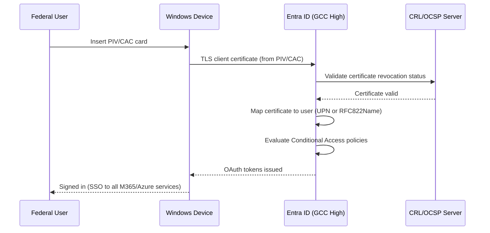

# Federal Migration Guide: Active Directory to Entra ID

**Comprehensive guidance for federal agencies migrating from on-premises Active Directory to Microsoft Entra ID in Azure Government --- covering EO 14028, CISA Zero Trust Maturity Model, PIV/CAC authentication, IL4/IL5 identity requirements, and FedRAMP identity controls.**

---

## Overview

Federal identity migration operates under unique constraints: Executive Order 14028 mandates Zero Trust architecture, CISA's Zero Trust Maturity Model (ZTMM) places identity at the foundation, FIPS 201-3 requires PIV/CAC smart card authentication, and Impact Level (IL) requirements govern data classification and identity assurance. This guide addresses every federal-specific requirement for the AD-to-Entra-ID migration.

---

## 1. Executive Order 14028 --- Identity requirements

### EO 14028 Section 3: Modernizing Federal Government Cybersecurity

EO 14028 mandates that federal agencies:

| Requirement                           | Section | Entra ID capability                                             | Status     |
| ------------------------------------- | ------- | --------------------------------------------------------------- | ---------- |
| Adopt Zero Trust architecture         | 3(a)    | Conditional Access, Identity Protection, PIM                    | Available  |
| Deploy MFA that is phishing-resistant | 3(d)    | FIDO2, CBA (PIV/CAC), Windows Hello                             | Available  |
| Encrypt data in transit               | 3(d)    | TLS 1.2+ enforced for all auth                                  | Enforced   |
| Implement EDR capabilities            | 3(g)    | Defender for Identity + Identity Protection                     | Available  |
| Improve logging and retention         | 3(h)    | Entra audit logs + Azure Monitor (90-day default, configurable) | Available  |
| Adopt secure cloud services           | 3(a)    | FedRAMP High authorized (Azure Gov)                             | Authorized |

### OMB M-22-09 implementation

OMB Memorandum M-22-09 operationalizes EO 14028's Zero Trust mandate:

| M-22-09 requirement                       | Pillar        | Entra ID implementation                            |
| ----------------------------------------- | ------------- | -------------------------------------------------- |
| Enterprise-managed identities             | Identity      | Entra ID as sole IdP                               |
| Phishing-resistant MFA everywhere         | Identity      | FIDO2 + CBA (PIV/CAC) + Windows Hello              |
| Authorization incorporates device signals | Devices       | Conditional Access + Intune compliance             |
| Application-level access control          | Applications  | Per-app Conditional Access policies                |
| Data-centric security                     | Data          | Purview sensitivity labels + Entra-governed access |
| Continuous authorization                  | Cross-cutting | Continuous Access Evaluation (CAE)                 |

---

## 2. CISA Zero Trust Maturity Model

### Pillar 1: Identity --- maturity progression

| Maturity level          | Traditional (AD)                | Advanced (Hybrid)                  | Optimal (Entra ID)                                    |
| ----------------------- | ------------------------------- | ---------------------------------- | ----------------------------------------------------- |
| **Authentication**      | Passwords + basic MFA           | Passwords + phishing-resistant MFA | Passwordless (FIDO2/CBA) exclusively                  |
| **Identity stores**     | On-prem AD (siloed)             | Hybrid AD + Entra ID               | Cloud-native Entra ID (single store)                  |
| **Risk assessment**     | None (network-based trust)      | Sign-in risk signals               | Continuous risk evaluation + automated remediation    |
| **Access management**   | Static group membership         | Conditional Access (basic)         | Dynamic access + PIM + entitlement management         |
| **Identity governance** | Manual access reviews           | Semi-automated reviews             | Automated lifecycle + access reviews + entitlement    |
| **Visibility**          | AD event logs (manual analysis) | Entra sign-in + audit logs         | Full SIEM integration + Identity Protection analytics |

### Target maturity for CSA-in-a-Box

CSA-in-a-Box targets **Advanced** maturity at migration completion and **Optimal** maturity within 12 months post-migration.

---

## 3. Azure Government identity services

### Entra ID in Azure Government

| Service                 | Azure Commercial | Azure Government (GCC High) | Azure Government (DoD) |
| ----------------------- | ---------------- | --------------------------- | ---------------------- |
| Entra ID P1/P2          | Available        | Available (M365 GCC High)   | Available (M365 DoD)   |
| Conditional Access      | Full feature set | Full feature set            | Full feature set       |
| Identity Protection     | Available        | Available                   | Available              |
| PIM                     | Available        | Available                   | Available              |
| Entra CBA (PIV/CAC)     | Available        | Available                   | Available              |
| FIDO2                   | Available        | Available                   | Available              |
| Windows Hello           | Available        | Available                   | Available              |
| Entra Cloud Sync        | Available        | Available                   | Available              |
| Entra Application Proxy | Available        | Available                   | Available              |
| Entra Domain Services   | Available        | Available                   | Available              |

### Sovereign cloud endpoints

```powershell
# Azure Government endpoints for identity
$endpoints = @{
    "Entra ID Login"         = "login.microsoftonline.us"
    "Graph API"              = "graph.microsoft.us"
    "Entra Admin Center"     = "entra.microsoft.us"
    "Intune"                 = "manage.microsoft.us"
    "Azure Portal"           = "portal.azure.us"
    "Key Vault"              = "vault.usgovcloudapi.net"
    "Storage"                = "blob.core.usgovcloudapi.net"
}

# Connect to Azure Government Entra ID
Connect-MgGraph -Environment USGov -Scopes "Directory.Read.All"

# Or via Azure CLI
az cloud set --name AzureUSGovernment
az login --tenant "your-gov-tenant-id"
```

---

## 4. PIV/CAC smart card authentication

### FIPS 201-3 compliance

Federal PIV (Personal Identity Verification) and DoD CAC (Common Access Card) smart cards are the primary authentication method for federal workers. Entra ID CBA provides native support.

### Configure Entra CBA for PIV/CAC

```powershell
# Step 1: Upload federal CA certificate chain
Connect-MgGraph -Environment USGov -Scopes "Policy.ReadWrite.AuthenticationMethod"

# Upload DoD Root CA certificates
$rootCAs = @(
    @{
        Certificate = [Convert]::ToBase64String(
            [IO.File]::ReadAllBytes(".\DoD-Root-CA-6.cer")
        )
        IsRootAuthority = $true
        CertificateRevocationListUrl = "http://crl.disa.mil/crl/DODROOTCA6.crl"
    },
    @{
        Certificate = [Convert]::ToBase64String(
            [IO.File]::ReadAllBytes(".\DoD-ID-CA-73.cer")
        )
        IsRootAuthority = $false
        CertificateRevocationListUrl = "http://crl.disa.mil/crl/DODIDCA_73.crl"
        DeltaCertificateRevocationListUrl = "http://crl.disa.mil/crl/DODIDCA_73_delta.crl"
    }
)

# Step 2: Configure CBA authentication method
$cbaConfig = @{
    "@odata.type" = "#microsoft.graph.x509CertificateAuthenticationMethodConfiguration"
    state = "enabled"
    certificateUserBindings = @(
        @{
            x509CertificateField = "PrincipalName"
            userProperty = "onPremisesUserPrincipalName"
            priority = 1
        },
        @{
            x509CertificateField = "RFC822Name"
            userProperty = "userPrincipalName"
            priority = 2
        }
    )
    authenticationModeConfiguration = @{
        x509CertificateAuthenticationDefaultMode = "x509CertificateMultiFactor"
        rules = @(
            @{
                x509CertificateRuleType = "issuerSubject"
                identifier = "CN=DOD ID CA-73"
                x509CertificateAuthenticationMode = "x509CertificateMultiFactor"
            }
        )
    }
}

Update-MgPolicyAuthenticationMethodPolicyAuthenticationMethodConfiguration `
    -AuthenticationMethodConfigurationId "x509Certificate" `
    -BodyParameter $cbaConfig
```

### PIV/CAC authentication flow



---

## 5. Impact Level identity requirements

### IL4 identity controls

| Control  | Requirement                       | Entra ID implementation             |
| -------- | --------------------------------- | ----------------------------------- |
| IA-2     | Identification and Authentication | Entra ID with MFA                   |
| IA-2(1)  | MFA to privileged accounts        | PIM + phishing-resistant MFA        |
| IA-2(2)  | MFA to non-privileged accounts    | Conditional Access MFA policy       |
| IA-2(12) | PIV/CAC acceptance                | Entra CBA with PIV/CAC              |
| IA-5     | Authenticator management          | Entra authentication methods        |
| IA-8     | Identification of non-org users   | Entra B2B with Conditional Access   |
| AC-2     | Account management                | Entra ID lifecycle + access reviews |
| AC-3     | Access enforcement                | Conditional Access + RBAC           |
| AC-6     | Least privilege                   | PIM just-in-time access             |
| AC-7     | Unsuccessful logon attempts       | Entra smart lockout                 |

### IL5 additional requirements

| Control  | IL5 addition                          | Entra ID implementation                             |
| -------- | ------------------------------------- | --------------------------------------------------- |
| IA-2(6)  | PIV/CAC required for network access   | Entra CBA as primary auth method                    |
| AC-2(4)  | Automated audit actions               | Lifecycle workflows + audit log alerts              |
| AC-17(1) | Automated monitoring of remote access | Conditional Access + sign-in risk                   |
| SC-28    | Protection of information at rest     | Entra ID data encrypted at rest (Microsoft-managed) |
| AU-6     | Audit review, analysis, reporting     | Entra audit logs + Azure Monitor + Sentinel         |

---

## 6. FedRAMP identity controls

### NIST 800-53 Rev 5 identity control families

| Control family                         | Key controls                         | Entra ID evidence                                                 |
| -------------------------------------- | ------------------------------------ | ----------------------------------------------------------------- |
| **AC (Access Control)**                | AC-2, AC-3, AC-6, AC-7, AC-11, AC-17 | Conditional Access policies, PIM, smart lockout, session controls |
| **AU (Audit)**                         | AU-2, AU-3, AU-6, AU-8, AU-12        | Entra sign-in logs, audit logs, Azure Monitor integration         |
| **IA (Identification/Authentication)** | IA-2, IA-4, IA-5, IA-8               | Entra authentication methods, CBA, MFA, B2B                       |
| **CM (Configuration Management)**      | CM-6, CM-7                           | Intune configuration profiles, security baselines                 |
| **SC (System/Communications)**         | SC-8, SC-12, SC-13, SC-28            | TLS 1.2+, FIPS 140-2 crypto, encryption at rest                   |

### Evidence generation

```powershell
# Generate FedRAMP identity control evidence

# AC-2: Account Management evidence
$users = Get-MgUser -All -Property CreatedDateTime, AccountEnabled,
    OnPremisesSyncEnabled, AssignedLicenses |
    Select-Object UserPrincipalName, CreatedDateTime, AccountEnabled,
    @{N="LicenseCount"; E={$_.AssignedLicenses.Count}}

$users | Export-Csv ".\fedramp-evidence\ac-2-user-inventory.csv" -NoTypeInformation

# IA-2: Authentication Method evidence
$authMethods = Get-MgReportAuthenticationMethodUserRegistrationDetail -All
$authMethods | Select-Object UserPrincipalName, MethodsRegistered,
    IsMfaRegistered, IsMfaCapable, IsPasswordlessCapable |
    Export-Csv ".\fedramp-evidence\ia-2-mfa-registration.csv" -NoTypeInformation

# AU-6: Audit Review evidence (sign-in summary)
$signIns = Get-MgAuditLogSignIn -Filter "createdDateTime ge 2026-04-01" -All
$signIns | Group-Object Status.ErrorCode | Select-Object Name, Count |
    Export-Csv ".\fedramp-evidence\au-6-sign-in-summary.csv" -NoTypeInformation
```

---

## 7. Conditional Access for federal environments

### Federal Conditional Access policy set

| Policy                           | Federal requirement    | Configuration                                             |
| -------------------------------- | ---------------------- | --------------------------------------------------------- |
| Require PIV/CAC for all users    | FIPS 201-3, M-22-09    | Authentication strength: phishing-resistant MFA           |
| Block non-government devices     | Data boundary          | Device filter: compliant + Intune managed                 |
| Restrict access by location      | IL4/IL5 data residency | Named Locations: US Government cloud only                 |
| Enforce session controls         | NIST 800-53 AC-11      | Sign-in frequency: 12 hours; persistent browser: disabled |
| Require compliant device for CUI | CMMC 2.0               | Grant: compliant device + phishing-resistant MFA          |

```powershell
# Federal Conditional Access: Require phishing-resistant MFA
$fedPolicy = @{
    displayName = "FED-CA001 - Require Phishing-Resistant MFA"
    state = "enabledForReportingButNotEnforced"
    conditions = @{
        users = @{
            includeUsers = @("All")
            excludeUsers = @("BreakGlass1-Id", "BreakGlass2-Id")
        }
        applications = @{ includeApplications = @("All") }
    }
    grantControls = @{
        operator = "OR"
        authenticationStrength = @{
            id = "00000000-0000-0000-0000-000000000004"  # Phishing-resistant MFA
        }
    }
}

New-MgIdentityConditionalAccessPolicy -BodyParameter $fedPolicy
```

---

## 8. Migration timeline for federal agencies

### Federal-specific considerations

| Phase                 | Commercial timeline | Federal timeline | Reason for delta                       |
| --------------------- | ------------------- | ---------------- | -------------------------------------- |
| Discovery             | 4 weeks             | 6 weeks          | ATO documentation, security assessment |
| Hybrid deployment     | 4 weeks             | 6 weeks          | ISSM review, change control board      |
| Application migration | 12 weeks            | 16 weeks         | ATO re-assessment for changed apps     |
| Device migration      | 18 weeks            | 24 weeks         | STIG compliance validation             |
| Security hardening    | 8 weeks             | 12 weeks         | Penetration testing, ATO update        |
| AD decommission       | 10 weeks            | 14 weeks         | Archival requirements, audit trail     |
| **Total**             | **40--50 weeks**    | **60--78 weeks** |                                        |

### ATO impact

The identity migration triggers an ATO (Authority to Operate) update or modification:

| ATO activity                             | Timing     | Owner                     |
| ---------------------------------------- | ---------- | ------------------------- |
| System boundary update (add Entra ID)    | Phase 1    | ISSM/ISSO                 |
| Security control assessment update       | Phase 2    | Third-party assessor      |
| POA&M for in-progress migration controls | Phase 2--4 | ISSO                      |
| Penetration test (identity-focused)      | Phase 5    | Third-party assessor      |
| Continuous monitoring update             | Phase 6    | ISSM                      |
| Final ATO modification                   | Phase 6    | AO (Authorizing Official) |

---

## 9. Data residency and sovereignty

### Azure Government data residency

| Data type                   | Storage location          | Guarantee                     |
| --------------------------- | ------------------------- | ----------------------------- |
| Entra ID directory data     | US Government datacenters | Contractual (Azure Gov terms) |
| Authentication logs         | US Government datacenters | FedRAMP High boundary         |
| Entra audit logs            | US Government datacenters | 30-day default (configurable) |
| Conditional Access policies | US Government datacenters | Tenant-bound                  |
| Device registration data    | US Government datacenters | Sovereign cloud               |

### Sovereign cloud isolation

```powershell
# Verify tenant is in Azure Government
$org = Get-MgOrganization
$org | Select-Object DisplayName, TenantType,
    @{N="Cloud"; E={$_.VerifiedDomains[0].Name}},
    CountryLetterCode

# Azure Government tenants have specific service endpoints
# that are isolated from commercial Azure
```

---

## 10. Agency-specific patterns

### DoD agencies

- **Primary auth:** CAC via Entra CBA
- **MFA requirement:** CAC satisfies phishing-resistant MFA (AAL3)
- **Device management:** STIG-compliant Intune baselines
- **Network:** Azure Government DoD regions
- **Compliance:** IL5 minimum for identity data

### Civilian agencies (CFO Act)

- **Primary auth:** PIV via Entra CBA
- **MFA requirement:** PIV or FIDO2 satisfies phishing-resistant MFA
- **Device management:** Intune with agency-specific compliance profiles
- **Network:** Azure Government (GCC High)
- **Compliance:** FedRAMP High minimum

### Intelligence Community

- **Note:** CSA-in-a-Box does not target IC workloads (IL6+)
- **Recommendation:** Maintain separate AD infrastructure for classified networks
- **Integration:** Entra B2B for unclassified collaboration

---

## CSA-in-a-Box federal identity integration

For federal deployments, CSA-in-a-Box identity integration requires:

```bicep
// Federal CSA-in-a-Box: Entra ID configuration
// All resources deployed to Azure Government

param location string = 'usgovvirginia'  // Azure Government region
param environment string = 'AzureUSGovernment'

// Key Vault with FIPS 140-2 Level 3 HSM
resource keyVault 'Microsoft.KeyVault/vaults@2023-07-01' = {
  name: kvName
  location: location
  properties: {
    sku: { family: 'A', name: 'premium' }  // HSM-backed
    enableRbacAuthorization: true
    tenantId: subscription().tenantId
    // No access policies; Entra RBAC only
  }
}
```

---

**Maintainers:** csa-inabox core team
**Last updated:** 2026-04-30
