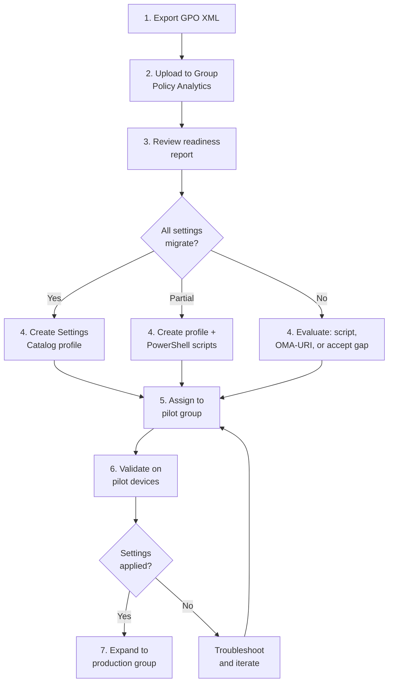

# Group Policy Migration: GPO to Intune

**Technical guide for migrating Group Policy Objects to Microsoft Intune --- covering Group Policy Analytics, Settings Catalog, configuration profiles, compliance policies, ADMX-backed policies, and prioritization frameworks.**

---

## Overview

Group Policy is the configuration management backbone of Active Directory environments. A typical enterprise runs 100--500+ GPOs controlling security settings, application configurations, network settings, and user preferences. Migrating this estate to Intune is one of the most labor-intensive aspects of the AD-to-Entra-ID migration.

This guide provides a systematic approach: assess with Group Policy Analytics, prioritize by security impact, migrate using Settings Catalog and configuration profiles, and validate with Intune reporting.

---

## 1. Group Policy Analytics

Intune Group Policy Analytics evaluates GPO XML exports and rates each setting for Intune migration readiness.

### Export GPOs for analysis

```powershell
# Export all GPOs as XML for Intune Group Policy Analytics
$exportPath = ".\GPO_Export"
New-Item -ItemType Directory -Path $exportPath -Force

Get-GPO -All | ForEach-Object {
    $gpoName = $_.DisplayName -replace '[\\/:*?"<>|]', '_'
    $xmlPath = Join-Path $exportPath "$gpoName.xml"
    Get-GPOReport -Guid $_.Id -ReportType Xml -Path $xmlPath
    Write-Host "Exported: $($_.DisplayName) -> $xmlPath"
}

# Count total GPOs
$gpoCount = (Get-ChildItem $exportPath -Filter "*.xml").Count
Write-Host "Total GPOs exported: $gpoCount"
```

### Upload to Group Policy Analytics

1. Navigate to **Intune admin center** > **Devices** > **Group Policy Analytics**
2. Click **Import** and upload the GPO XML files
3. Wait for analysis (typically 5--15 minutes for 100+ GPOs)
4. Review the migration readiness report

### Interpreting results

| Readiness status        | Meaning                                       | Action                                                   |
| ----------------------- | --------------------------------------------- | -------------------------------------------------------- |
| **Ready for migration** | Direct Intune equivalent exists               | Migrate using Settings Catalog                           |
| **Partially ready**     | Some settings have equivalents, others do not | Migrate supported settings; plan alternatives for gaps   |
| **Not available**       | No Intune equivalent                          | Use custom PowerShell script, ADMX import, or accept gap |
| **Deprecated**          | Setting is obsolete                           | Remove from migration scope                              |

---

## 2. Intune configuration mechanisms

### Settings Catalog (recommended)

The Settings Catalog is the primary mechanism for device configuration in Intune. It provides a flat, searchable list of all available settings with full documentation.

```
Intune admin center > Devices > Configuration > Create > Settings Catalog
```

| Advantage          | Detail                                                           |
| ------------------ | ---------------------------------------------------------------- |
| Searchable         | Find settings by name, category, or keyword                      |
| Fully documented   | Each setting includes description, expected values, and platform |
| Conflict detection | Intune alerts on conflicting settings across profiles            |
| Reporting          | Per-device, per-setting compliance reporting                     |
| Growing coverage   | Microsoft adds settings monthly; ~4,500+ settings available      |

### Configuration profiles (templates)

Pre-built templates for common scenarios:

| Template                 | GPO equivalent                                   | Use case                             |
| ------------------------ | ------------------------------------------------ | ------------------------------------ |
| Device restrictions      | Security Settings, many Administrative Templates | Baseline security                    |
| Endpoint protection      | Windows Defender GPO settings                    | Antivirus, firewall, disk encryption |
| Identity protection      | Smart card settings, WHfB                        | Windows Hello configuration          |
| Administrative templates | ADMX-based settings                              | Office, Edge, Windows settings       |
| Custom (OMA-URI)         | No direct equivalent                             | CSP-based settings not in catalog    |

### Compliance policies

Compliance policies define the minimum device health requirements. Unlike GPOs (which configure), compliance policies **assess and report**.

| GPO concept                          | Intune compliance equivalent |
| ------------------------------------ | ---------------------------- |
| Password policy (complexity, length) | Password compliance check    |
| BitLocker enforcement                | Encryption compliance check  |
| Windows Update level                 | OS version compliance check  |
| Firewall enabled                     | Firewall compliance check    |
| Antivirus active                     | Defender compliance check    |

---

## 3. Migration priority framework

### Priority 1: Security settings (migrate first)

| GPO setting            | Intune mechanism                     | Configuration                              |
| ---------------------- | ------------------------------------ | ------------------------------------------ |
| Password policy        | Settings Catalog: Authentication     | `Passwords > Minimum Password Length = 14` |
| Account lockout        | Settings Catalog: Account Lockout    | `Account Lockout Threshold = 10`           |
| BitLocker              | Endpoint Protection: Disk Encryption | `Encrypt devices = Required`               |
| Windows Firewall       | Endpoint Protection: Firewall        | `Domain/Private/Public profiles = Enable`  |
| Audit policy           | Settings Catalog: Audit              | `Audit Logon Events = Success and Failure` |
| User rights assignment | Settings Catalog: User Rights        | `Allow log on locally = Administrators`    |
| Security options       | Settings Catalog: Security Options   | Various security hardening settings        |
| Windows Defender       | Endpoint Protection: Antivirus       | `Real-time protection = Enabled`           |

### Priority 2: Device management

| GPO setting      | Intune mechanism                 | Configuration                       |
| ---------------- | -------------------------------- | ----------------------------------- |
| Windows Update   | Update rings for Windows 10/11   | `Quality update deferral = 7 days`  |
| Power settings   | Settings Catalog: Power          | `Sleep timeout = 15 minutes`        |
| Screen lock      | Device restrictions              | `Maximum minutes of inactivity = 5` |
| USB restrictions | Device restrictions: General     | `Block removable storage = Yes`     |
| Remote Desktop   | Settings Catalog: Remote Desktop | `Allow Remote Desktop = Disabled`   |

### Priority 3: Application configuration

| GPO setting               | Intune mechanism                   | Configuration                           |
| ------------------------- | ---------------------------------- | --------------------------------------- |
| Microsoft Edge settings   | Administrative Templates: Edge     | Comprehensive Edge policy set           |
| Microsoft Office settings | Administrative Templates: Office   | Office configuration via ADMX           |
| OneDrive KFM              | Administrative Templates: OneDrive | `Silently move known folders = Enabled` |
| Teams settings            | Settings Catalog: Teams            | Meeting and calling policies            |

### Priority 4: User preferences (lowest priority)

| GPO setting           | Intune mechanism                  | Configuration                   |
| --------------------- | --------------------------------- | ------------------------------- |
| Desktop wallpaper     | Settings Catalog: Personalization | `Desktop image URL`             |
| Start menu layout     | Settings Catalog: Start           | `Start layout JSON`             |
| Taskbar customization | Settings Catalog: Taskbar         | Pin/unpin apps                  |
| Mapped drives         | PowerShell script                 | Drive mapping script via Intune |
| Logon scripts         | PowerShell scripts                | Intune platform scripts         |

---

## 4. ADMX-backed policies

Many GPO settings are defined in ADMX template files. Intune supports importing custom ADMX files for settings not in the Settings Catalog.

### Built-in ADMX support

Intune includes ADMX templates for:

- Windows components
- Microsoft Edge
- Microsoft Office / Microsoft 365 Apps
- OneDrive
- Microsoft Teams

### Import custom ADMX files

```powershell
# Upload custom ADMX file to Intune
# Intune admin center > Devices > Configuration > Import ADMX

# Example: Upload Chrome browser ADMX
# 1. Download Chrome ADMX from Google
# 2. Upload chrome.admx and chrome.adml (en-US) to Intune
# 3. Create configuration profile > Administrative Templates > Chrome

# Via Graph API:
$admxContent = [Convert]::ToBase64String(
    [System.IO.File]::ReadAllBytes(".\chrome.admx")
)
$admlContent = [Convert]::ToBase64String(
    [System.IO.File]::ReadAllBytes(".\en-US\chrome.adml")
)

$params = @{
    displayName = "Chrome Browser ADMX"
    description = "Custom ADMX for Chrome management"
    files = @(
        @{ fileName = "chrome.admx"; content = $admxContent }
        @{ fileName = "en-US/chrome.adml"; content = $admlContent }
    )
}

# Import via Intune Graph API
Invoke-MgGraphRequest -Method POST `
    -Uri "https://graph.microsoft.com/beta/deviceManagement/groupPolicyUploadedDefinitionFiles" `
    -Body ($params | ConvertTo-Json -Depth 5)
```

---

## 5. GPO settings without Intune equivalents

Some GPO settings have no direct Intune equivalent. Mitigation strategies:

### Strategy 1: PowerShell remediation scripts

```powershell
# Example: Map network drive (no direct Intune setting)
# Deploy as Intune Platform Script
# Intune > Devices > Scripts and remediations > Platform scripts

# Detection script
$driveLetter = "S:"
$uncPath = "\\fileserver.contoso.com\shared"

if (Test-Path $driveLetter) {
    $drive = Get-PSDrive -Name $driveLetter.TrimEnd(':') -ErrorAction SilentlyContinue
    if ($drive.Root -eq $uncPath) {
        Write-Host "Drive mapped correctly"
        exit 0
    }
}
Write-Host "Drive not mapped"
exit 1

# Remediation script
$driveLetter = "S"
$uncPath = "\\fileserver.contoso.com\shared"
New-PSDrive -Name $driveLetter -PSProvider FileSystem -Root $uncPath -Persist -Scope Global
```

### Strategy 2: Custom OMA-URI

```xml
<!-- Example: Configure custom registry setting via OMA-URI -->
<!-- Intune > Devices > Configuration > Custom > OMA-URI -->
<!--
Name: Custom Security Setting
OMA-URI: ./Device/Vendor/MSFT/Policy/Config/CustomSetting
Data type: String
Value: <enabled/>
-->
```

### Strategy 3: Accept the gap

Some GPO settings are not needed in a cloud-managed environment:

| GPO setting                   | Why it's not needed                             |
| ----------------------------- | ----------------------------------------------- |
| Software Restriction Policies | Replaced by Defender Application Control (WDAC) |
| IE zone settings              | IE is deprecated; Edge managed via Intune       |
| Offline Files                 | Replaced by OneDrive Files On-Demand            |
| Network printer deployment    | Replaced by Universal Print                     |
| WMI filters                   | Replaced by Intune assignment filters           |
| Loopback processing           | Replaced by Intune device vs user assignment    |
| Slow link detection           | Not applicable in cloud-managed model           |

---

## 6. GPO to Intune migration workflow

### Per-GPO migration process



### Parallel running strategy

During migration, GPOs and Intune policies coexist. Conflict resolution:

| Conflict scenario                            | Resolution                                                    |
| -------------------------------------------- | ------------------------------------------------------------- |
| Same setting in GPO and Intune               | Intune MDM wins over GPO by default on Entra-joined devices   |
| GPO on hybrid-joined, Intune on Entra-joined | No conflict --- different device populations                  |
| Co-managed device (SCCM + Intune)            | Workload slider determines which management authority applies |

```powershell
# Verify MDM wins over GPO on a specific device
# Check registry:
$mdmWins = Get-ItemProperty -Path "HKLM:\SOFTWARE\Policies\Microsoft\Windows\CurrentVersion\MDM" `
    -Name "MDMWinsOverGP" -ErrorAction SilentlyContinue

if ($mdmWins.MDMWinsOverGP -eq 1) {
    Write-Host "Intune MDM policies take precedence over GPO" -ForegroundColor Green
} else {
    Write-Host "GPO may override Intune settings" -ForegroundColor Yellow
}
```

---

## 7. Validation and reporting

### Intune configuration compliance

```powershell
# Check device configuration status via Graph API
$devices = Get-MgDeviceManagementManagedDevice -All

foreach ($device in $devices) {
    $configStates = Get-MgDeviceManagementManagedDeviceDeviceConfigurationState `
        -ManagedDeviceId $device.Id

    [PSCustomObject]@{
        DeviceName = $device.DeviceName
        ComplianceState = $device.ComplianceState
        ConfigProfiles = $configStates.Count
        FailedSettings = ($configStates | Where-Object { $_.State -eq "Error" }).Count
    }
} | Format-Table -AutoSize
```

### GPO retirement tracking

| GPO name              | Settings count | Migrated | Remaining         | Status          | Retire date |
| --------------------- | -------------- | -------- | ----------------- | --------------- | ----------- |
| Default Domain Policy | 15             | 15       | 0                 | Ready to retire | Week 12     |
| Security Baseline     | 45             | 42       | 3 (scripted)      | Ready to retire | Week 14     |
| Office Configuration  | 30             | 30       | 0                 | Ready to retire | Week 12     |
| Legacy App Settings   | 12             | 8        | 4 (gaps accepted) | Ready to retire | Week 16     |
| Network Configuration | 20             | 15       | 5 (scripted)      | In progress     | Week 18     |

---

## 8. Security baselines

Microsoft Intune provides pre-built security baselines that replace many security-focused GPOs.

### Available baselines

| Baseline                        | GPO equivalent                | Settings count |
| ------------------------------- | ----------------------------- | -------------- |
| Windows 11 Security Baseline    | CIS/DISA STIG benchmarks      | ~300 settings  |
| Microsoft Defender for Endpoint | Windows Defender GPO          | ~50 settings   |
| Microsoft Edge Baseline         | Edge Administrative Templates | ~100 settings  |
| Windows 365 Baseline            | Cloud PC specific             | ~200 settings  |
| Microsoft 365 Apps Baseline     | Office ADMX policies          | ~100 settings  |

```
Intune admin center > Endpoint Security > Security baselines
```

---

## CSA-in-a-Box integration

GPO migration enables cloud-managed devices to access CSA-in-a-Box services with proper security posture:

- **Compliance policies** gate access to Fabric and Databricks via Conditional Access
- **Security baselines** ensure devices meet CSA-in-a-Box security requirements
- **Certificate profiles** deliver certificates for Entra CBA (smart card SSO to platform services)
- **Edge management** configures browser security for Power BI and Fabric portal access
- **Windows Hello** enables passwordless SSO to all CSA-in-a-Box services

---

**Maintainers:** csa-inabox core team
**Last updated:** 2026-04-30
