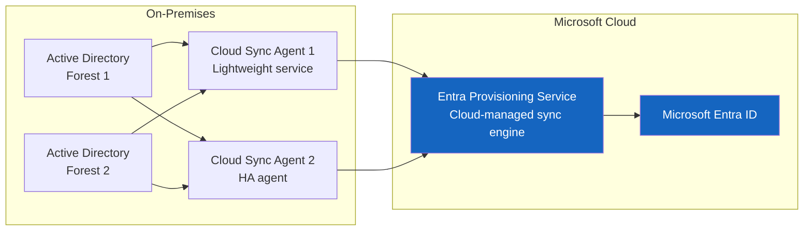
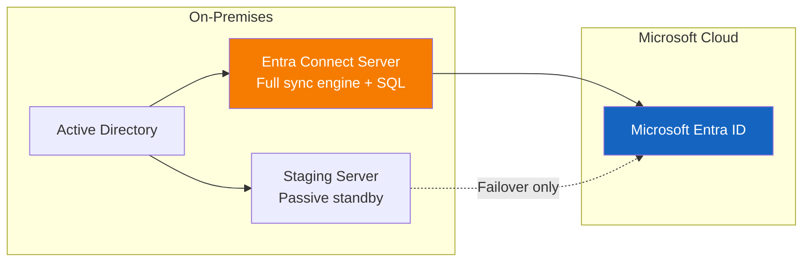
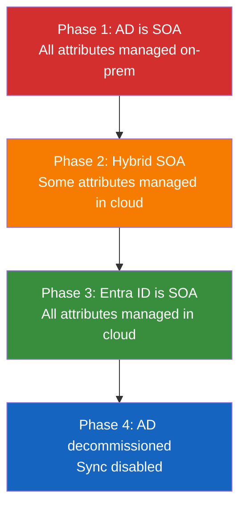
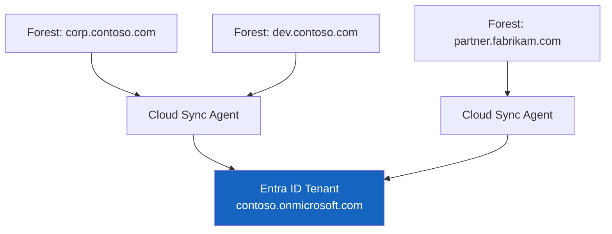

# Hybrid Identity Migration: Entra Connect and Cloud Sync

**Technical guide for deploying hybrid identity as the bridge between on-premises Active Directory and Microsoft Entra ID --- covering Entra Connect, Cloud Sync, password hash sync, pass-through authentication, federation, and Source of Authority switching.**

---

## Overview

Hybrid identity is the bridge phase of AD-to-Entra-ID migration. During this phase, user objects exist in both on-premises AD and Entra ID, synchronized by a sync engine. The goal is not to stay in hybrid permanently --- it is to enable a phased migration where applications, devices, and users can be moved to cloud-managed identity incrementally.

Two sync engines are available: **Entra Connect** (the legacy engine, still widely deployed) and **Cloud Sync** (the modern replacement). This guide covers both, with a strong recommendation for Cloud Sync for all new deployments and most migrations from Entra Connect.

---

## 1. Entra Connect vs Cloud Sync decision matrix

### When to use Cloud Sync (recommended)

| Scenario                              | Cloud Sync                   | Entra Connect                         |
| ------------------------------------- | ---------------------------- | ------------------------------------- |
| New hybrid deployment                 | **Yes**                      | No                                    |
| Multi-forest sync                     | **Yes** (simplified)         | Yes (complex)                         |
| High availability (no staging server) | **Yes** (multi-agent)        | No (active-passive only)              |
| Lightweight agent (no SQL dependency) | **Yes**                      | No (requires SQL Express or full SQL) |
| Microsoft-managed upgrades            | **Yes** (auto-update)        | No (manual upgrade required)          |
| Attribute mapping customization       | **Yes** (expression builder) | Yes (synchronization rules editor)    |
| Password hash sync                    | **Yes**                      | Yes                                   |
| Group writeback v2                    | **Yes**                      | Yes                                   |
| Accidental deletion prevention        | **Yes**                      | Yes                                   |

### When Entra Connect is still required

| Scenario                           | Cloud Sync support | Entra Connect support |
| ---------------------------------- | ------------------ | --------------------- |
| Pass-through authentication (PTA)  | **No**             | Yes                   |
| AD FS federation management        | **No**             | Yes                   |
| Device writeback                   | **No**             | Yes                   |
| Exchange hybrid (full)             | Limited            | **Yes**               |
| Directory extension attribute sync | Limited            | **Yes**               |
| Filtering by OU with complex logic | Basic              | **Yes**               |

!!! warning "Entra Connect end of support"
Microsoft has announced that Entra Connect (formerly Azure AD Connect) will reach end of support. Organizations should plan migration to Cloud Sync. The [Cloud Sync Tutorial](tutorial-cloud-sync.md) provides step-by-step migration guidance.

---

## 2. Architecture comparison

### Cloud Sync architecture



### Entra Connect architecture



---

## 3. Password Hash Synchronization (PHS)

PHS is the **recommended** authentication method for hybrid identity. It synchronizes a hash of the on-premises password hash to Entra ID, enabling cloud authentication without on-premises connectivity.

### How PHS works

1. Entra Connect/Cloud Sync reads the password hash from AD (MD4 hash of the Unicode password)
2. The hash is salted and re-hashed using PBKDF2 with HMAC-SHA256 (1,000 iterations)
3. The derived hash is transmitted over TLS 1.2 to Entra ID
4. Entra ID stores the derived hash and uses it for authentication

### PHS configuration

=== "Cloud Sync"

    Password hash sync is enabled by default in Cloud Sync configurations. Verify in the Entra admin center:

    1. Navigate to **Entra ID** > **Entra Connect** > **Cloud Sync**
    2. Select your configuration
    3. Verify **Password hash synchronization** is enabled

=== "Entra Connect"

    ```powershell
    # Enable PHS on Entra Connect
    Set-ADSyncAADPasswordSyncConfiguration `
        -ConnectorName "contoso.com - AAD" `
        -Enable $true

    # Verify PHS status
    Get-ADSyncAADPasswordSyncConfiguration -ConnectorName "contoso.com - AAD"
    ```

### PHS security considerations

| Concern                                       | Reality                                                                                 |
| --------------------------------------------- | --------------------------------------------------------------------------------------- |
| "Passwords are stored in the cloud"           | Only a derived hash is stored; the actual password is never transmitted or stored       |
| "An attacker could extract passwords"         | The PBKDF2 derivation makes brute-force infeasible; Entra smart lockout adds protection |
| "On-prem password changes aren't reflected"   | PHS syncs within 2 minutes of an on-premises password change                            |
| "Compliance prohibits cloud password storage" | FedRAMP High and DoD IL5 both accept PHS; NIST 800-63B does not prohibit it             |

---

## 4. Pass-Through Authentication (PTA)

PTA validates passwords against on-premises AD in real-time without storing password hashes in the cloud. It requires Entra Connect (not supported in Cloud Sync).

### When to use PTA

- Regulatory requirement prohibiting any form of password hash in cloud (rare)
- Immediate enforcement of on-prem password policies (lockout, logon hours)
- Organizations that cannot accept PHS for policy reasons

### PTA limitations

| Limitation                                                 | Impact                                             |
| ---------------------------------------------------------- | -------------------------------------------------- |
| Requires on-prem connectivity                              | Authentication fails if all PTA agents are offline |
| No Identity Protection leaked credential detection         | Cannot detect leaked passwords without PHS         |
| Higher latency than PHS                                    | Each authentication requires round-trip to on-prem |
| No Cloud Sync support                                      | Must use Entra Connect                             |
| Cannot combine with Conditional Access password protection | Entra ID password protection requires PHS          |

!!! note "Recommendation"
Microsoft and the CSA-in-a-Box team recommend **PHS over PTA** for all deployments. PHS provides better security (Identity Protection leaked credential detection), higher availability (no on-prem dependency), and lower latency. PTA should only be used when specific regulatory requirements prohibit PHS.

---

## 5. Federation (AD FS)

Federation delegates authentication to an on-premises AD FS farm. This was the dominant model before PHS matured but is now **deprecated** for new deployments.

### Reasons to de-federate

| Reason                     | Detail                                                           |
| -------------------------- | ---------------------------------------------------------------- |
| Infrastructure cost        | AD FS farm: 2--4 servers + WAP + load balancer + certificates    |
| Single point of failure    | AD FS outage = all cloud authentication fails                    |
| Certificate management     | Token signing certificates expire and require manual rollover    |
| Limited Conditional Access | AD FS claim rules are less capable than Entra Conditional Access |
| No Identity Protection     | AD FS does not support risk-based policies                       |
| No passwordless            | AD FS does not support FIDO2 or Authenticator passwordless       |

### De-federation process

```powershell
# Step 1: Enable PHS (prerequisite)
Set-ADSyncAADPasswordSyncConfiguration `
    -ConnectorName "contoso.com - AAD" `
    -Enable $true

# Step 2: Enable staged rollout for pilot group
New-MgPolicyStagedRolloutPolicy -DisplayName "PHS Pilot" `
    -Feature "passwordHashSync" `
    -IsEnabled $true

# Step 3: Add pilot users to staged rollout
# (via Entra admin center > Entra Connect > Staged Rollout)

# Step 4: After validation, convert domain from federated to managed
Set-MgDomain -DomainId "contoso.com" `
    -AuthenticationType "Managed"

# Step 5: Decommission AD FS farm
# - Remove relying party trusts
# - Remove AD FS servers from load balancer
# - Uninstall AD FS role
```

---

## 6. Source of Authority (SOA) switching

Source of Authority determines which directory (on-prem AD or Entra ID) is the authoritative source for user attributes. During hybrid identity, on-prem AD is typically the SOA. The migration goal is to switch SOA to Entra ID.

### SOA switching process



### Converting a synced user to cloud-managed

```powershell
# Option 1: Cloud Sync - Scope filtering
# Remove user from Cloud Sync scope (OU-based or attribute-based filter)
# The user object in Entra ID becomes cloud-managed

# Option 2: Entra Connect - Soft match prevention
# Move user to an OU excluded from sync scope
# Wait for sync cycle (30 minutes default)
# User becomes cloud-managed in Entra ID

# Option 3: Direct conversion (PowerShell)
# Requires stopping sync for the specific user
Set-MgUser -UserId "user@contoso.com" `
    -OnPremisesSyncEnabled $false

# Verify SOA
$user = Get-MgUser -UserId "user@contoso.com" `
    -Property OnPremisesSyncEnabled, OnPremisesImmutableId
$user | Select-Object DisplayName, OnPremisesSyncEnabled, OnPremisesImmutableId
```

### SOA switching --- staged approach

| Wave           | Users            | Criteria                                       | Duration |
| -------------- | ---------------- | ---------------------------------------------- | -------- |
| Wave 1 (pilot) | 50--100          | IT staff, identity team                        | 2 weeks  |
| Wave 2         | 500--1,000       | Cloud-only workers (no on-prem app dependency) | 4 weeks  |
| Wave 3         | 1,000--5,000     | General population                             | 6 weeks  |
| Wave 4         | Remaining        | Legacy app users (after app migration)         | 4 weeks  |
| Wave 5         | Service accounts | Convert to workload identities                 | 2 weeks  |

---

## 7. Hard-match hardening --- June/July 2026 enforcement

### What is changing

Microsoft is enforcing hard-match hardening to prevent:

- **Soft-match exploitation:** An attacker creating a cloud object with the same SMTP address or UPN as an on-prem object, then gaining access when sync merges them
- **Duplicate object creation:** Mismatched sync configurations creating ghost objects

### What you must do

```powershell
# Verify all synced users have a valid ImmutableId (SourceAnchor)
Get-MgUser -All -Property OnPremisesImmutableId, UserPrincipalName |
    Where-Object { $_.OnPremisesImmutableId -eq $null -and $_.OnPremisesSyncEnabled -eq $true } |
    Select-Object UserPrincipalName, OnPremisesImmutableId

# If any synced users lack ImmutableId, investigate and remediate
# Common cause: user was created in cloud, then sync was enabled
# Resolution: Set ImmutableId to match the on-prem objectGUID

$onPremGuid = (Get-ADUser -Identity "jdoe" -Properties objectGUID).objectGUID
$immutableId = [System.Convert]::ToBase64String($onPremGuid.ToByteArray())

Update-MgUser -UserId "jdoe@contoso.com" `
    -OnPremisesImmutableId $immutableId
```

### Remediation timeline

| Action                                   | Deadline  | Impact of missing deadline       |
| ---------------------------------------- | --------- | -------------------------------- |
| Audit all synced objects for ImmutableId | May 2026  | Discovery only; no impact        |
| Remediate objects missing ImmutableId    | June 2026 | Objects may fail to sync         |
| Validate hard-match enforcement          | July 2026 | Duplicate objects may be created |
| Complete Cloud Sync migration            | Q3 2026   | Entra Connect may have issues    |

---

## 8. Multi-forest and multi-tenant scenarios

### Multi-forest sync



### Configuration for multi-forest

```powershell
# Cloud Sync supports multiple forests with a single agent
# Each forest requires a separate configuration in the Entra admin center

# Verify agent can reach all forests
$forests = @("corp.contoso.com", "dev.contoso.com")
foreach ($forest in $forests) {
    $context = New-Object DirectoryServices.ActiveDirectory.DirectoryContext(
        "Forest", $forest
    )
    try {
        $forestObj = [DirectoryServices.ActiveDirectory.Forest]::GetForest($context)
        Write-Host "Connected to forest: $($forestObj.Name)" -ForegroundColor Green
    } catch {
        Write-Host "Failed to connect to forest: $forest" -ForegroundColor Red
    }
}
```

---

## 9. Migration from Entra Connect to Cloud Sync

Organizations currently running Entra Connect should plan migration to Cloud Sync.

### Migration steps

1. **Deploy Cloud Sync agents** (minimum 2 for HA) on domain-joined servers
2. **Configure Cloud Sync** with matching scope and attribute mappings
3. **Enable parallel pilot:** Run Cloud Sync for a pilot OU while Entra Connect handles the rest
4. **Validate sync accuracy:** Compare object counts and attribute values
5. **Cutover:** Disable Entra Connect sync; enable Cloud Sync for full scope
6. **Decommission Entra Connect server**

```powershell
# Step 1: Stop Entra Connect scheduler
Set-ADSyncScheduler -SyncCycleEnabled $false

# Step 2: Export current configuration for reference
Get-ADSyncServerConfiguration -Path "C:\EntraConnect_Config_Export"

# Step 3: Verify Cloud Sync is syncing correctly
# Check Entra admin center > Entra Connect > Cloud Sync > Provisioning logs

# Step 4: After validation period (2+ weeks)
# Uninstall Entra Connect
# Decommission the server
```

---

## 10. Monitoring and troubleshooting

### Key metrics to monitor

| Metric                | Source                                              | Alert threshold    |
| --------------------- | --------------------------------------------------- | ------------------ |
| Sync errors           | Entra admin center > Cloud Sync > Provisioning logs | Any error          |
| Password sync latency | Entra ID audit logs                                 | > 5 minutes        |
| Agent health          | Entra admin center > Cloud Sync > Agent status      | Agent offline      |
| Object count delta    | Graph API comparison                                | > 1% variance      |
| Export errors         | Provisioning logs                                   | Any export failure |

### Common issues and resolutions

| Issue                      | Symptom                                    | Resolution                                           |
| -------------------------- | ------------------------------------------ | ---------------------------------------------------- |
| Duplicate objects          | Two entries for same user in Entra ID      | Verify ImmutableId; use hard-match to merge          |
| Password sync failure      | Users cannot sign in with current password | Restart Cloud Sync agent; check DC connectivity      |
| Attribute mapping conflict | Incorrect department or job title in Entra | Review attribute mapping in Cloud Sync config        |
| OU scoping error           | Users in excluded OU appearing in Entra    | Verify OU filter in Cloud Sync configuration         |
| Agent connectivity         | Agent shows offline                        | Check outbound HTTPS (443) to \*.microsoftonline.com |

---

## CSA-in-a-Box integration

Hybrid identity is a prerequisite for CSA-in-a-Box deployment. During the hybrid phase:

- **Fabric workspace RBAC** uses synced Entra groups from on-prem AD security groups
- **Databricks SCIM** provisions from synced Entra users --- no direct AD-to-Databricks sync
- **Purview access policies** bind to synced Entra groups
- **Conditional Access** applies to all CSA-in-a-Box service access from day one of hybrid deployment

The hybrid phase enables CSA-in-a-Box deployment while the broader AD migration progresses. Do not wait for full cloud-only identity to begin platform deployment.

---

**Maintainers:** csa-inabox core team
**Last updated:** 2026-04-30
