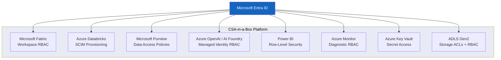
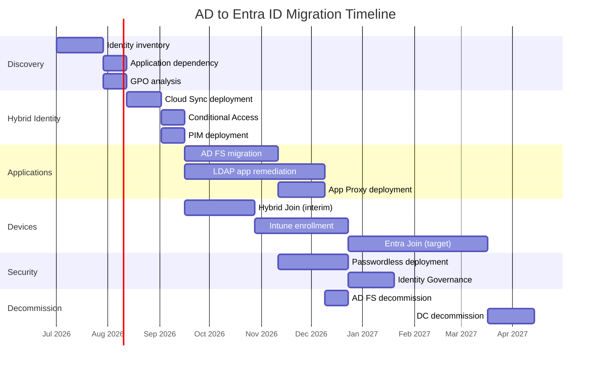

# Active Directory to Microsoft Entra ID Migration Center

**The definitive resource for migrating from on-premises Active Directory to Microsoft Entra ID --- the Zero Trust identity control plane for CSA-in-a-Box and the modern enterprise.**

---

## Who this is for

This migration center serves federal CISOs, identity architects, IT administrators, platform engineers, and compliance officers who are evaluating or executing a migration from on-premises Active Directory to Microsoft Entra ID. Whether you are responding to Executive Order 14028 Zero Trust mandates, eliminating domain controller infrastructure, modernizing authentication from Kerberos/NTLM to OAuth/OIDC, preparing for Microsoft's June/July 2026 hard-match hardening enforcement, or establishing cloud-native identity as the foundation for CSA-in-a-Box deployment, these resources provide the evidence, patterns, and step-by-step guidance to execute confidently.

---

## Quick-start decision matrix

| Your situation                              | Start here                                                 |
| ------------------------------------------- | ---------------------------------------------------------- |
| Executive evaluating Entra ID vs on-prem AD | [Why Entra ID over Active Directory](why-entra-over-ad.md) |
| Need cost justification for migration       | [Total Cost of Ownership Analysis](tco-analysis.md)        |
| Need a feature-by-feature comparison        | [Complete Feature Mapping](feature-mapping-complete.md)    |
| Ready to plan a migration                   | [Migration Playbook](../ad-to-entra-id.md)                 |
| Federal/government-specific requirements    | [Federal Migration Guide](federal-migration-guide.md)      |
| Planning hybrid identity deployment         | [Hybrid Identity Migration](hybrid-identity-migration.md)  |
| Planning full cloud-only migration          | [Cloud-Only Migration](cloud-only-migration.md)            |
| Migrating domain-joined devices             | [Device Migration](device-migration.md)                    |
| Migrating LDAP/Kerberos applications        | [Application Migration](application-migration.md)          |
| Migrating Group Policy                      | [Group Policy Migration](group-policy-migration.md)        |
| Migrating AD security model                 | [Security Migration](security-migration.md)                |

---

## Strategic resources

These documents provide the business case, cost analysis, and strategic framing for decision-makers.

| Document                                                   | Audience                  | Description                                                                                                                                                                            |
| ---------------------------------------------------------- | ------------------------- | -------------------------------------------------------------------------------------------------------------------------------------------------------------------------------------- |
| [Why Entra ID over Active Directory](why-entra-over-ad.md) | CIO / CISO / Board        | Executive white paper covering Zero Trust mandate, passwordless authentication, Conditional Access, elimination of domain controller infrastructure, EO 14028, and Copilot integration |
| [Total Cost of Ownership Analysis](tco-analysis.md)        | CFO / CIO / Procurement   | Detailed pricing comparison of on-prem AD infrastructure vs Entra ID licensing, 3/5-year projections, hidden cost analysis, and FTE reduction                                          |
| [Complete Feature Mapping](feature-mapping-complete.md)    | CISO / Identity Architect | 50+ AD features mapped to Entra ID equivalents with migration complexity ratings, gap analysis, and CSA-in-a-Box integration points                                                    |

---

## Migration guides

Domain-specific deep dives covering every aspect of an AD-to-Entra-ID migration.

| Guide                                                     | AD capability                            | Entra ID destination                                       |
| --------------------------------------------------------- | ---------------------------------------- | ---------------------------------------------------------- |
| [Hybrid Identity Migration](hybrid-identity-migration.md) | AD forests, trusts, sync                 | Entra Connect, Cloud Sync, PHS, PTA, federation            |
| [Cloud-Only Migration](cloud-only-migration.md)           | On-prem user objects, SOA                | Cloud-managed identities, de-federation                    |
| [Device Migration](device-migration.md)                   | Domain-joined devices, GPO device config | Entra Join, Autopilot, Intune MDM                          |
| [Application Migration](application-migration.md)         | LDAP, Kerberos, AD FS apps               | Graph API, OAuth/OIDC, App Proxy, Entra SSO                |
| [Group Policy Migration](group-policy-migration.md)       | GPOs, ADMX, preferences                  | Intune profiles, Settings Catalog, compliance policies     |
| [Security Migration](security-migration.md)               | AD admin tiers, LAPS, auditing           | PIM, Conditional Access, Identity Protection, Windows LAPS |

---

## Tutorials

Step-by-step walkthroughs for key migration scenarios. {: #tutorials }

| Tutorial                                               | Duration   | Description                                                                                                                        |
| ------------------------------------------------------ | ---------- | ---------------------------------------------------------------------------------------------------------------------------------- |
| [Deploy Entra Cloud Sync](tutorial-cloud-sync.md)      | 2--3 hours | Install Cloud Sync agent, configure attribute mapping, enable password hash sync, test sync, enable SOA switching for pilot group  |
| [Entra Join a Windows Device](tutorial-device-join.md) | 1--2 hours | Configure Entra Join, deploy Autopilot profile, migrate a Windows device from domain-joined to Entra-joined with Intune management |

---

## Technical references

| Document                                                | Description                                                                                                                |
| ------------------------------------------------------- | -------------------------------------------------------------------------------------------------------------------------- |
| [Complete Feature Mapping](feature-mapping-complete.md) | Every AD feature mapped to its Entra ID equivalent with migration complexity ratings and CSA-in-a-Box integration evidence |
| [Migration Playbook](../ad-to-entra-id.md)              | The end-to-end migration playbook with capability mapping, phased project plan, and competitive framing                    |

---

## Government and federal

| Document                                              | Description                                                                                                                                                       |
| ----------------------------------------------------- | ----------------------------------------------------------------------------------------------------------------------------------------------------------------- |
| [Federal Migration Guide](federal-migration-guide.md) | Entra ID in Azure Government, EO 14028 Zero Trust mandate, CISA ZTMM, PIV/CAC smart card authentication, IL4/IL5 identity requirements, FedRAMP identity controls |

---

## How CSA-in-a-Box fits

CSA-in-a-Box uses **Microsoft Entra ID as the identity backbone** for every service in the platform. Identity is not a peripheral concern --- it is the Zero Trust control plane through which all access to data, analytics, AI, and governance services flows.

### Identity integration points

### What Entra ID enables for CSA-in-a-Box

- **Fabric workspaces:** Entra security groups map directly to Fabric workspace roles (Admin, Member, Contributor, Viewer). Dynamic group membership automates access as users change roles.
- **Databricks SCIM:** Entra ID provisions and deprovisions users and groups into Databricks workspaces automatically via SCIM 2.0. Unity Catalog inherits these identities for table-level access control.
- **Purview governance:** Data access policies in Purview bind to Entra security groups. Data stewards manage access through Entra group membership, not per-resource ACLs.
- **Azure OpenAI / AI Foundry:** Managed identities (workload identities) authenticate service-to-service calls without credentials. User access governed by Entra RBAC roles.
- **Power BI row-level security:** RLS roles reference Entra group membership via `USERPRINCIPALNAME()` and `CUSTOMDATA()` DAX functions. No separate identity store.
- **ADLS Gen2 storage:** POSIX-style ACLs and Azure RBAC roles bind to Entra identities. No shared keys in production --- managed identity or user delegation SAS only.
- **Key Vault:** Secrets, keys, and certificates accessed exclusively through Entra RBAC. No access policy model in new deployments.
- **Azure Monitor:** Log Analytics workspace access controlled through Entra RBAC. Resource-context and workspace-context access models both reference Entra identities.

### Why AD migration is a prerequisite

Without Entra ID as the identity provider, CSA-in-a-Box cannot enforce:

1. **Conditional Access** on data platform access (require compliant device, MFA, location policy)
2. **Just-in-time admin elevation** via PIM for Fabric/Databricks/Purview admin roles
3. **Automated provisioning/deprovisioning** via SCIM and Entra lifecycle workflows
4. **Workload identity federation** for CI/CD pipelines deploying Bicep templates
5. **Cross-service SSO** --- a single sign-on token from Entra ID authenticates to Fabric, Databricks, Purview, Power BI, and Azure Portal without separate credential stores

---

## Performance and benchmarks

| Document                    | Description                                                                                                                                                              |
| --------------------------- | ------------------------------------------------------------------------------------------------------------------------------------------------------------------------ |
| [Benchmarks](benchmarks.md) | Authentication latency comparison (on-prem AD vs Entra ID), Conditional Access evaluation speed, SSO token performance, Graph API vs LDAP query performance, MFA latency |

---

## Best practices

| Document                            | Description                                                                                                                                                                |
| ----------------------------------- | -------------------------------------------------------------------------------------------------------------------------------------------------------------------------- |
| [Best Practices](best-practices.md) | Staged migration waves, pilot group strategy, rollback planning, application inventory methodology, GPO audit before migration, CSA-in-a-Box identity integration patterns |

---

## Migration timeline overview

---

## Document index

| #   | Document                                          | Lines     | Description                                           |
| --- | ------------------------------------------------- | --------- | ----------------------------------------------------- |
| 1   | [Hub Page](index.md)                              | This page | Decision matrix, navigation, CSA-in-a-Box integration |
| 2   | [Why Entra ID](why-entra-over-ad.md)              | ~450      | Executive brief: Zero Trust, passwordless, EO 14028   |
| 3   | [TCO Analysis](tco-analysis.md)                   | ~450      | Cost comparison with 3/5-year projections             |
| 4   | [Feature Mapping](feature-mapping-complete.md)    | ~550      | 50+ AD features mapped to Entra ID equivalents        |
| 5   | [Hybrid Identity](hybrid-identity-migration.md)   | ~420      | Entra Connect vs Cloud Sync, PHS, PTA, federation     |
| 6   | [Cloud-Only Migration](cloud-only-migration.md)   | ~375      | Full cloud-managed identity, SOA switching            |
| 7   | [Device Migration](device-migration.md)           | ~425      | Domain-joined to Entra-joined, Autopilot, Intune      |
| 8   | [Application Migration](application-migration.md) | ~425      | LDAP/Kerberos to modern auth, App Proxy               |
| 9   | [GPO Migration](group-policy-migration.md)        | ~425      | Group Policy to Intune Settings Catalog               |
| 10  | [Security Migration](security-migration.md)       | ~375      | Conditional Access, PIM, Identity Protection          |
| 11  | [Tutorial: Cloud Sync](tutorial-cloud-sync.md)    | ~450      | Step-by-step Cloud Sync deployment                    |
| 12  | [Tutorial: Device Join](tutorial-device-join.md)  | ~375      | Step-by-step Entra Join + Autopilot                   |
| 13  | [Federal Guide](federal-migration-guide.md)       | ~375      | Azure Government, PIV/CAC, IL4/IL5, FedRAMP           |
| 14  | [Benchmarks](benchmarks.md)                       | ~325      | Authentication and API performance data               |
| 15  | [Best Practices](best-practices.md)               | ~375      | Migration waves, rollback, CSA-in-a-Box patterns      |

---

**Maintainers:** csa-inabox core team
**Last updated:** 2026-04-30
