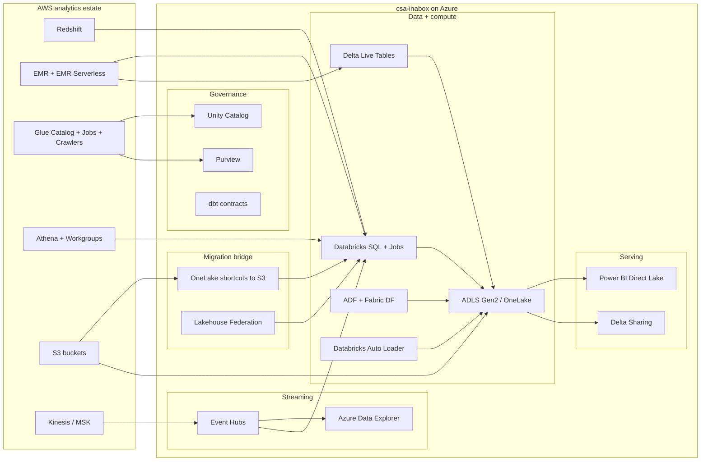

# Migrating from AWS Analytics to csa-inabox on Azure

**Status:** Authored 2026-04-19
**Audience:** Federal CIO / CDO / Chief Data Architect running an AWS analytics estate (Redshift, EMR, Glue, Athena, S3) and moving to Azure — commercial, GovCloud, or Azure Government.
**Scope:** The AWS analytics estate: Redshift, EMR (EC2 + Serverless + Studio), Glue (Catalog + Jobs + Crawlers), Athena, and S3 as the data-lake substrate. Ancillary services (Kinesis, MSK, Lake Formation, QuickSight) are addressed where they touch the above.

---

## 1. Executive summary

AWS analytics is a mature stack. The federal reasons to move are rarely technical merit; they are forcing functions — an Azure-first mandate from the mission owner, IL5 coverage gaps on AWS GovCloud for specific workloads, consolidation of the federal tenant onto a single hyperscaler, a mission need for services that are only available (or only available at the right compliance tier) on Azure Government, or a partner/prime requirement.

csa-inabox on Azure inherits **FedRAMP High** through Azure Government (`docs/compliance/nist-800-53-rev5.md`, `csa_platform/csa_platform/governance/compliance/nist-800-53-rev5.yaml`), **CMMC 2.0 Level 2** (`csa_platform/csa_platform/governance/compliance/cmmc-2.0-l2.yaml`), and **HIPAA Security Rule** (`csa_platform/csa_platform/governance/compliance/hipaa-security-rule.yaml`), and ships a reference pattern that projects those controls through every Bicep module, Purview classification, Delta Lake table, and audit source. Every row of every capability-mapping table below cites a real file in the repo.

This playbook is honest. AWS GovCloud has been federal-first since 2011 and has deep workload coverage. IL4 coverage is broad; IL5 coverage is service-dependent — check the AWS IL5 service boundary list against the `docs/GOV_SERVICE_MATRIX.md` Azure Gov coverage before committing. This document is not a takedown of AWS; it is a migration playbook for federal tenants that have decided to move. For those tenants, the main value is **compressing the five-service AWS analytics estate (Redshift + EMR + Glue + Athena + S3) into a coherent Delta Lake + Databricks + Purview + OneLake stack** and doing it without losing the current Glue Data Catalog investment or having to rip-and-replace S3 on day one.

### Federal considerations — AWS analytics vs csa-inabox

| Consideration | AWS GovCloud today | csa-inabox on Azure Gov | Notes |
|---|---|---|---|
| FedRAMP High | Authorized for most analytics services | Inherited through Azure Gov | Both platforms meet baseline |
| DoD IL4 | Covered (most analytics services) | Covered | Parity |
| DoD IL5 | **Service-dependent**; several analytics services have partial IL5 coverage | Covered on Azure Gov for most services; Fabric IL5 parity forecast per Microsoft roadmap | Check AWS IL5 boundary vs `docs/GOV_SERVICE_MATRIX.md` |
| DoD IL6 | Covered (AWS Top Secret Region) | **Gap** — out of scope for csa-inabox | For IL6, recommend staying on AWS Top Secret or bespoke Azure Top Secret |
| ITAR | Covered via AWS GovCloud US data-residency | Covered via Azure Government tenant-binding | Parity |
| CMMC 2.0 Level 2 | Customer-managed mappings; AWS controls available | Controls mapped in `csa_platform/csa_platform/governance/compliance/cmmc-2.0-l2.yaml` + narrative | DIB primes inherit directly on csa-inabox |
| HIPAA Security Rule | Covered with BAA | Covered; mapped in `csa_platform/csa_platform/governance/compliance/hipaa-security-rule.yaml` | See `examples/tribal-health/` for HHS / IHS worked example |
| Storage format | S3 object storage + Glue Catalog | ADLS Gen2 + OneLake + Unity Catalog + Purview | OneLake shortcuts allow S3 to stay source-of-truth during migration |
| Table format | Parquet/ORC + Iceberg (AWS Glue Iceberg) + Hudi | Delta Lake (primary) + Iceberg (ADR-0003) + Parquet | Delta + Iceberg interop; Glue Iceberg tables readable in Databricks |
| IaC | CloudFormation / CDK / Terraform | Bicep (ADR-0004 `docs/adr/0004-bicep-over-terraform.md`) | Terraform also supported; Bicep chosen for Azure policy evidence |

---

## 2. Capability mapping — AWS → csa-inabox

This section is split by service because the AWS estate is rarely migrated as a monolith.

### 2.1 Redshift → csa-inabox

| Redshift capability | csa-inabox equivalent | Mapping notes | Effort | Evidence |
|---|---|---|---|---|
| RA3 nodes + managed storage | Databricks SQL Warehouses + Delta Lake on ADLS Gen2 | RA3 decoupling maps cleanly to Databricks compute-storage separation | M | `csa_platform/unity_catalog_pattern/README.md`, ADR-0003 `docs/adr/0003-delta-lake-over-iceberg-and-parquet.md` |
| Spectrum (external tables on S3) | OneLake shortcuts to S3 + Databricks Lakehouse Federation | Spectrum's S3-external query pattern preserved read-only during migration | S | `csa_platform/unity_catalog_pattern/onelake_config.yaml` |
| Automated vacuum/analyze | Databricks `OPTIMIZE` + `ANALYZE TABLE` + auto-compaction | Delta's `OPTIMIZE ZORDER BY` replaces the sort-key maintenance loop | XS | `domains/shared/dbt/dbt_project.yml` (OPTIMIZE in model configs) |
| Workload management (WLM) queues | Databricks SQL Warehouse sizing + queuing + serverless auto-scale | Each WLM queue becomes a SQL Warehouse; serverless handles bursty users | M | `csa_platform/multi_synapse/rbac_templates/` (pattern for warehouse sizing per group), ADR-0002 `docs/adr/0002-databricks-over-oss-spark.md` |
| Federated queries (to RDS/Aurora) | Databricks Lakehouse Federation + ADF linked services | Native Lakehouse Federation covers Postgres/MySQL/SQL Server/Snowflake | M | `domains/shared/pipelines/adf/`, `csa_platform/unity_catalog_pattern/` |
| Materialized views | dbt incremental models + Databricks materialized views | Most Redshift MVs re-express as dbt incremental; heavy CDC → Delta Live Tables | M | `domains/shared/dbt/dbt_project.yml`, ADR-0001 `docs/adr/0001-adf-dbt-over-airflow.md` |
| Stored procedures (PL/pgSQL-ish) | dbt macros + Databricks SQL UDFs + notebook jobs | Port logic to dbt macros for SQL-only; complex imperative SPs → notebooks | L | `domains/finance/dbt/macros/`, `domains/shared/dbt/macros/` |
| Distribution + sort keys | Delta partitioning + Z-ordering | Distribution key → partition column; sort keys → `ZORDER BY` columns | S | ADR-0003 |
| Data sharing (Redshift data shares) | Delta Sharing + OneLake shortcuts | Open protocol (Delta Sharing) + Purview data-product registry | M | `csa_platform/data_marketplace/`, `csa_platform/data_marketplace/api/` |
| Concurrency scaling | Databricks SQL Warehouse serverless + auto-scale | Serverless handles the spillover that concurrency scaling solved | XS | ADR-0010 `docs/adr/0010-fabric-strategic-target.md` |

### 2.2 EMR → csa-inabox

| EMR capability | csa-inabox equivalent | Mapping notes | Effort | Evidence |
|---|---|---|---|---|
| EMR on EC2 (Hadoop, Spark, Hive, Presto, Trino) | Azure Databricks (primary) + HDInsight (only where Hadoop/Hive residency is required) | Almost every Spark workload collapses to Databricks; Trino/Presto-on-EMR → Databricks SQL | M–L | `csa_platform/unity_catalog_pattern/`, `domains/shared/notebooks/`, ADR-0002 |
| EMR Serverless | Azure Databricks Serverless SQL + Jobs | EMR Serverless's per-job compute maps to Databricks serverless jobs | S | ADR-0002, ADR-0010 |
| EMR Studio | Databricks Workspace Notebooks + Git integration | Notebook-and-repo UX is 1:1 | S | `domains/shared/notebooks/` |
| EMR Notebooks (SageMaker-linked) | Databricks Notebooks + Azure ML notebooks for deep-ML workflows | Notebook runtime stays with Databricks; Azure ML handles MLOps | S | `csa_platform/ai_integration/model_serving/`, `domains/spark/` |
| Bootstrap actions | Databricks init scripts + cluster policies | 1:1 semantic mapping | XS | `csa_platform/unity_catalog_pattern/deploy/` |
| Managed scaling | Databricks cluster autoscaling + serverless | Serverless removes the tuning burden entirely | XS | ADR-0002 |
| Spot instances | Databricks Spot on Azure (EvictionPolicy + SpotBidMaxPrice) | Direct 1:1 | XS | `csa_platform/unity_catalog_pattern/deploy/` |
| Hive metastore | Unity Catalog (primary) + external Hive metastore supported | Unity Catalog is the target; bridge via external metastore during cutover | M | `csa_platform/unity_catalog_pattern/unity_catalog/` |

### 2.3 Glue → csa-inabox

| Glue capability | csa-inabox equivalent | Mapping notes | Effort | Evidence |
|---|---|---|---|---|
| Glue Data Catalog | Unity Catalog (primary) + Purview (enterprise catalog) | Unity Catalog holds runtime metadata; Purview holds business glossary, classifications, lineage across catalogs | M | `csa_platform/csa_platform/governance/purview/purview_automation.py`, `csa_platform/unity_catalog_pattern/unity_catalog/`, ADR-0006 `docs/adr/0006-purview-over-atlas.md` |
| Glue Jobs (Spark / Python Shell) | Databricks Jobs + notebooks + ADF activities | Spark jobs move to Databricks Jobs; Python-Shell jobs → Azure Functions or small Databricks Python tasks | M | `domains/shared/notebooks/`, `domains/shared/pipelines/adf/` |
| Glue Crawlers | Purview scan jobs + Databricks Auto Loader schema inference | Crawlers become Purview scans (governance) + Auto Loader (runtime schema evolution) | M | `csa_platform/csa_platform/governance/purview/purview_automation.py`, `csa_platform/unity_catalog_pattern/` |
| Glue Streaming Jobs | Databricks structured streaming + Event Hubs / ADX | Kinesis → Event Hubs bridge; streaming ETL lands on Delta tables | M | ADR-0005 `docs/adr/0005-event-hubs-over-kafka.md`, `examples/iot-streaming/` |
| DataBrew | Power Query (Fabric) + Databricks SQL + dbt | Most DataBrew transforms re-express as Power Query in a Fabric dataflow or dbt model | S | `domains/shared/dbt/dbt_project.yml` |
| Glue DataQuality | dbt tests + Great Expectations + data-product `contract.yaml` | Every data product ships a contract; dbt tests enforce column-level rules; GE covers row-level expectations | S | `domains/finance/data-products/invoices/contract.yaml`, `.github/workflows/validate-contracts.yml` |

### 2.4 Athena → csa-inabox

| Athena capability | csa-inabox equivalent | Mapping notes | Effort | Evidence |
|---|---|---|---|---|
| Federated queries over S3 | Databricks SQL + OneLake shortcuts to S3 | S3 stays source-of-truth read-only during migration; Databricks SQL replaces Athena query engine | S | `csa_platform/unity_catalog_pattern/onelake_config.yaml` |
| Workgroups | Databricks SQL Warehouses | One workgroup = one warehouse; cost-control settings map to warehouse auto-stop + Azure budgets | XS | `docs/COST_MANAGEMENT.md`, `scripts/deploy/teardown-platform.sh` |
| Athena Federated Query (to non-S3 sources) | Databricks Lakehouse Federation | Connectors for Postgres/MySQL/SQL Server/Snowflake are native | S | ADR-0002 |
| Athena ACID (Iceberg on Athena) | Delta Lake ACID (primary) + Iceberg read-compat | If staying on Iceberg during migration, Databricks reads Iceberg natively | S | ADR-0003 |
| CTAS / INSERT OVERWRITE | dbt models + `MERGE INTO` on Delta | Idempotent merges on Delta replace CTAS idioms | S | `domains/shared/dbt/` |

### 2.5 S3 → csa-inabox

| S3 role | csa-inabox equivalent | Mapping notes | Effort | Evidence |
|---|---|---|---|---|
| Data lake buckets (raw/stage/curated) | ADLS Gen2 containers (bronze/silver/gold) + OneLake workspaces | Medallion layout mirrors the vertical examples below | M | `examples/commerce/`, `examples/noaa/`, `csa_platform/unity_catalog_pattern/onelake_config.yaml` |
| S3 as source-of-truth during migration | OneLake shortcuts (read-only) | No copy; Azure reads S3 through the shortcut while writes migrate to ADLS Gen2 | XS | `csa_platform/unity_catalog_pattern/onelake_config.yaml` |
| S3 lifecycle policies | ADLS Gen2 lifecycle management policies | 1:1 rule-set translation; tiers Hot → Cool → Archive | XS | Azure Storage policy (via Bicep) |
| S3 Object Lock (WORM) | Immutable storage (time-based) on ADLS Gen2 | 1:1 for compliance-driven retention | XS | Azure Storage immutability policies |
| S3 Access Points | Private endpoints + RBAC + Azure Network rules | ACL-level access maps to RBAC + ABAC on containers | S | `docs/SELF_HOSTED_IR.md` (edge patterns) |
| S3 Event Notifications → SQS/SNS/Lambda | Event Grid → Logic Apps / Functions | ADLS Gen2 emits `BlobCreated` events to Event Grid; fan-out pattern is identical | S | `csa_platform/data_activator/`, Event Grid modules in Bicep |
| S3 Cross-Region Replication | ADLS Gen2 object replication + geo-zone-redundant storage | For DR patterns, see `docs/DR.md` | S | `docs/DR.md`, `docs/MULTI_REGION.md` |

### Cross-cloud transition bridge

**The safest migration pattern is to keep S3 read-only for weeks/months via OneLake shortcuts while Azure targets warm up.** This is the single most valuable lesson from AWS→Azure analytics migrations: don't try to move the bucket and the compute in the same sprint.

- Week 1–N: OneLake shortcuts to S3; Databricks reads S3 directly for bronze/silver; writes land on ADLS Gen2 from day one.
- Week N+: flip individual datasets from S3-backed to ADLS-Gen2-native when they're ready.
- Final: S3 becomes the archive; ADLS Gen2 is source-of-truth.

Same pattern applies to Glue Catalog → Unity Catalog (run both side-by-side; Unity Catalog is target; Glue stays as federated catalog during the cutover).

---

## 3. Reference architecture



---

## 4. Worked migration example — daily EMR Spark aggregation → Databricks Job + dbt

Most AWS migrations have dozens of these small Spark-on-EMR jobs. One worked example here is representative — port the first three, and the pattern generalizes.

### 4.1 Starting state (EMR on EC2)

Daily PySpark job computing sales aggregates, launched from Airflow via `emr-containers`:

```bash
# spark-submit on EMR
spark-submit \
  --deploy-mode cluster \
  --master yarn \
  --conf spark.sql.sources.default=parquet \
  --conf spark.hadoop.fs.s3a.aws.credentials.provider=...InstanceProfileCredentialsProvider \
  s3://acme-analytics-code/jobs/daily_sales_agg.py \
  --date 2026-04-19 \
  --source s3://acme-analytics-raw/sales/ \
  --target s3://acme-analytics-curated/sales_daily/
```

- IAM role: `emr-sales-analytics-role` (InstanceProfile).
- Job reads S3 raw, writes S3 curated Parquet.
- Airflow DAG triggers daily at 02:00 UTC.
- Glue Catalog holds table `curated.sales_daily` partitioned by `date`.

### 4.2 Target state (Databricks Job + dbt)

**Databricks Job JSON** (created from the Databricks CLI or Terraform):

```json
{
  "name": "daily_sales_agg",
  "schedule": { "quartz_cron_expression": "0 0 2 * * ?", "timezone_id": "UTC" },
  "tasks": [
    {
      "task_key": "agg",
      "notebook_task": {
        "notebook_path": "/Repos/acme/sales-analytics/jobs/daily_sales_agg",
        "base_parameters": {
          "run_date": "{{job.start_time[yyyy-MM-dd]}}",
          "source_path": "abfss://raw@acmeanalyticsgov.dfs.core.usgovcloudapi.net/sales/",
          "target_catalog": "sales_prod",
          "target_table": "gold.fact_sales_daily"
        }
      },
      "job_cluster_key": "agg_cluster"
    }
  ],
  "job_clusters": [
    {
      "job_cluster_key": "agg_cluster",
      "new_cluster": {
        "spark_version": "15.4.x-scala2.12",
        "node_type_id": "Standard_D8s_v5",
        "num_workers": 4,
        "data_security_mode": "SINGLE_USER",
        "runtime_engine": "PHOTON"
      }
    }
  ]
}
```

**Auth:** IAM InstanceProfile → Unity Catalog service principal bound to a managed identity. The job cluster runs as the service principal; grants on `sales_prod.gold.fact_sales_daily` govern write access. No access keys in config.

**Transformation:** rewrite the agg as a dbt incremental model so the logic is versioned, tested, and lineage-visible in Purview.

```sql
-- models/gold/fact_sales_daily.sql
{{ config(
    materialized='incremental',
    unique_key=['sales_date','region','product_id'],
    incremental_strategy='merge',
    partition_by=['sales_date']
) }}

SELECT
  DATE(order_ts) AS sales_date,
  region,
  product_id,
  SUM(quantity) AS units_sold,
  SUM(gross_amount) AS gross_amount
FROM {{ ref('stg_sales') }}

WHERE DATE(order_ts) >= DATE_SUB(CURRENT_DATE(), 3)  -- reprocess 3-day window

GROUP BY 1, 2, 3
```

The Databricks Job calls `dbt run --select fact_sales_daily` instead of running the raw PySpark.

### 4.3 IAM → managed identity translation

| AWS | Azure |
|---|---|
| IAM role `emr-sales-analytics-role` | User-assigned managed identity `umi-sales-analytics` |
| Instance profile | Managed identity attached to Databricks workspace or job cluster |
| `s3:GetObject`/`PutObject` bucket policies | RBAC: `Storage Blob Data Contributor` on target container |
| S3 bucket policy for KMS decrypt | Azure RBAC: `Key Vault Crypto Service Encryption User` on CMK |
| Glue `glue:GetTable` | Unity Catalog `USAGE` + `SELECT` on catalog/schema/table |

Cross-reference: `csa_platform/multi_synapse/rbac_templates/` holds the RBAC template pattern.

### 4.4 Airflow → ADF trigger (or Databricks Workflow schedule)

Two targets; pick based on how much cross-system orchestration you have:

- **Databricks Workflows schedule** (simple case) — one schedule, one job. This is what the JSON above uses.
- **ADF orchestration** — if the job coordinates with on-prem sources, Fabric pipelines, or Power BI dataset refresh. See `domains/shared/pipelines/adf/` and ADR-0001 `docs/adr/0001-adf-dbt-over-airflow.md`.

Airflow-in-AWS → Airflow-in-Azure is also valid for teams with heavy Airflow DAGs; the ADR captures why ADF + dbt is the preferred csa-inabox default.

### 4.5 Contract + catalog registration

Ship a `contract.yaml` for `fact_sales_daily` alongside the dbt model; pattern-match against `domains/finance/data-products/invoices/contract.yaml`. CI runs `.github/workflows/validate-contracts.yml`. Purview auto-scans the target catalog; the data product shows up in `csa_platform/data_marketplace/` for portal discovery.

---

## 5. Migration sequence (phased project plan)

A realistic mid-to-large federal AWS-analytics migration runs 30–40 weeks because the surface area is larger than a Snowflake-only move.

### Phase 0 — Discovery (Weeks 1–3)

- Inventory every AWS analytics artifact: Redshift clusters + databases + schemas, EMR clusters + job scripts + DAGs, Glue jobs + crawlers + catalogs, Athena workgroups + saved queries, S3 buckets + IAM policies, Kinesis/MSK topics.
- Tag each item: keep on AWS (IL6 / other reasons), migrate to csa-inabox, or retire.
- Identify cross-cloud data flows (what will break if S3 goes read-only).
- Map IAM roles to target Entra ID groups + managed identities.

**Success criteria:** 90% coverage; a prioritized wave plan; known shadow consumers surfaced.

### Phase 1 — Landing zones + bridge (Weeks 4–8)

- Deploy the Data Management Landing Zone (DMLZ) and first Data Landing Zone (DLZ) via Bicep.
- Unity Catalog metastore + catalogs mirroring the Glue Catalog structure.
- Purview provisioned; scan both the new ADLS Gen2 containers and (read-only) the S3 buckets via the AWS connector if scanning across clouds is desired.
- **OneLake shortcuts to S3 + Lakehouse Federation to Redshift** — bridge in place so every subsequent phase has a fallback.
- Entra ID groups + managed identity mapping.

**Success criteria:** `make deploy-dev` succeeds; Unity Catalog + Purview reachable; Databricks can read any S3-backed table through OneLake shortcuts.

### Phase 2 — Pilot domain migration (Weeks 8–16)

Port one end-to-end domain — typically the one with the most Athena usage since that workload translates cleanest:

1. Move Glue table metadata for that domain into Unity Catalog.
2. Port Athena saved queries + workgroups → Databricks SQL + SQL Warehouses.
3. Port Glue jobs feeding that domain → Databricks Jobs + dbt models.
4. Migrate EMR jobs for that domain → Databricks Jobs (see Section 4 worked example).
5. Ship `contract.yaml` per data product.
6. Power BI reports over the Direct Lake semantic model.

**Reconciliation:** dual-run 2 weeks; aggregate-fact parity ≤0.5%.

**Success criteria:** pilot domain reconciled on Databricks; Purview lineage end-to-end; Athena/EMR for that domain shut down.

### Phase 3 — Redshift migration (Weeks 14–24, overlaps Phase 2)

Redshift gets its own phase because it usually has the densest stored-procedure / materialized-view logic.

1. Convert distribution/sort keys → Delta partitioning + Z-ordering.
2. Port materialized views → dbt incremental models or DLT.
3. Port SPs → dbt macros (for SQL-only) or notebook jobs (for imperative).
4. Migrate Redshift data shares → Delta Sharing + Purview data products.
5. Consumer cutover (BI tools re-pointed to Databricks SQL endpoint).

**Success criteria:** Redshift cluster in read-only mode; parity reconciled; consumers cut over.

### Phase 4 — EMR + streaming (Weeks 18–28, overlapping)

- EMR persistent clusters → Databricks (see 2.2 table).
- EMR Serverless jobs → Databricks serverless jobs.
- Kinesis → Event Hubs (ADR-0005 `docs/adr/0005-event-hubs-over-kafka.md`).
- MSK → Event Hubs with Kafka protocol or keep MSK if wire-format lock-in is material; note this reintroduces cross-cloud dependency.
- Structured streaming on Delta replaces the Glue Streaming ETL surface.

### Phase 5 — S3 final cutover (Weeks 24–36)

Per-bucket decisions:

- **Archive only** — leave on S3 with lifecycle-to-Glacier; cross-cloud cost low.
- **Migrate to ADLS Gen2** — use AzCopy or Azure Data Box for large cold volumes; Storage Mover service for running migrations; OneLake shortcuts for staged cutover.
- **Bridge indefinitely** — some datasets reasonably live on S3 via OneLake shortcut forever; only revisit if cross-cloud egress cost justifies a full move.

**Success criteria:** every S3 bucket has a disposition decision and a date; hot/warm buckets migrated; archive tier acceptable.

### Phase 6 — Decommission + docs (Weeks 32–40)

- AWS accounts moved to post-migration read-only state.
- Final cost baseline published comparing AWS spend to Azure spend.
- Runbooks, rollback procedures, and lessons-learned document updated in repo.

---

## 6. Federal compliance considerations

- **FedRAMP High:** inherited through Azure Government; mappings in `csa_platform/csa_platform/governance/compliance/nist-800-53-rev5.yaml`. AWS GovCloud is also FedRAMP High — the compliance delta here is usually less material than for Snowflake; the migration decision is typically operational (Azure-first mandate, consolidation) rather than compliance-forced.
- **DoD IL4 / IL5:** `docs/GOV_SERVICE_MATRIX.md` is the live reference for Azure Gov service-level IL5 coverage. Compare against the AWS IL5 boundary list for each in-scope service before committing.
- **DoD IL6:** **out of scope for csa-inabox**. If any workload must stay IL6, plan to keep it on AWS Top Secret Region or deploy to a bespoke Azure Top Secret tenant (not csa-inabox).
- **ITAR:** Azure Government tenant-binding handles data residency.
- **CMMC 2.0 Level 2:** `csa_platform/csa_platform/governance/compliance/cmmc-2.0-l2.yaml` + `docs/compliance/cmmc-2.0-l2.md`.
- **HIPAA:** `csa_platform/csa_platform/governance/compliance/hipaa-security-rule.yaml`. See `examples/tribal-health/` for a worked HHS/IHS implementation.
- **Audit evidence:** the csa-inabox tamper-evident audit chain (CSA-0016) provides stronger evidence than the default CloudTrail-equivalent Azure Monitor path for FedRAMP High control families AU-* and AC-*.
- **AWS-specific data to preserve during migration:** CloudTrail logs of data access; S3 bucket-policy history; Redshift access history. These frequently become evidence in post-migration audits; archive before decommission.

---

## 7. Cost comparison

Illustrative. The single biggest variable is the current AWS commitment model (Reserved Instances, Savings Plans, Compute Savings Plans, Redshift Reserved Nodes). A federal tenant running **~$4M/year** on the AWS analytics estate typically lands on:

- Databricks SQL + jobs (DBUs): **$1.0M–$1.5M**
- Storage (OneLake + ADLS Gen2 + S3 archive kept): **$250K–$500K**
- Power BI Premium or Fabric capacity F64/F128: **$200K–$400K**
- Azure OpenAI / AI Foundry: **$200K–$500K**
- Purview + Monitor + Key Vault + Private Endpoints: **$200K–$400K**
- Cross-cloud egress during bridge phase (S3 → Azure): **$50K–$200K** (one-time and declining)
- **Typical run-rate: $2.0M–$3.5M/year** — a 25–50% savings at comparable workload.

Cost drivers:

- **Fabric capacity sizing** (F-SKU) is the largest knob; see `docs/COST_MANAGEMENT.md`.
- **Serverless SQL Warehouses** are typically cheaper than right-sized dedicated SKUs for intermittent workloads.
- **OneLake shortcuts avoid egress** for bridge-phase reads; budget for final-migration transfer cost separately.
- **Teardown scripts**: `scripts/deploy/teardown-platform.sh` (CSA-0011) for workshop/dev environments.

Run `scripts/deploy/estimate-costs.sh` against the target landing-zone configuration before go-live.

---

## 8. Gaps and roadmap

| Gap | Description | Tracked finding | Planned remediation |
|---|---|---|---|
| **IL6 coverage** | Out of scope for csa-inabox | N/A | Recommend AWS Top Secret Region or bespoke Azure Top Secret |
| **Direct EMR→Databricks migration tooling** | No first-party lift-and-shift runner for EMR job graphs | N/A | Manual port per Section 4; Databricks partner tooling can accelerate at scale |
| **Glue DataBrew feature parity** | Power Query + dbt covers most DataBrew cases; a couple of the point-and-click transforms require light SQL rewrite | N/A | Documented pattern; no first-party tooling planned |
| **CSA Copilot** | No agent loop / chat UX for NL analysis yet | CSA-0008 (XL) | 6-phase MVP |
| **Framework control matrices** | NIST, CMMC, HIPAA delivered; PCI-DSS, SOC 2, GDPR still pending | CSA-0012 (XL) — in progress | Six YAMLs + narrative pages |

---

## 9. Competitive framing

### Where AWS wins today

- **IL6.** AWS Top Secret Region is production for classified workloads; csa-inabox does not cover IL6.
- **Mature stack.** Redshift/EMR/Glue/Athena/S3 have 10+ years of hardening and the broadest partner ecosystem.
- **GovCloud-first maturity.** AWS GovCloud opened in 2011; Azure Government in 2014. Some agencies have deeper operational muscle memory on AWS Gov.
- **Fine-grained IAM.** AWS IAM is more expressive than Azure RBAC for policy conditions; this closes with Azure ABAC but remains a real gap.
- **S3 ecosystem.** S3 is the de-facto object-store target for third-party analytics tools. OneLake shortcuts bridge most of this, but the ecosystem still defaults to S3.

### Where csa-inabox wins today

- **Single coherent stack.** Databricks + Delta + Purview + OneLake + Power BI replace Redshift + EMR + Glue + Athena + S3 + QuickSight with fewer moving parts.
- **Open storage format.** Delta Lake + Parquet with a clean exit path. The five-service AWS stack has five exit paths.
- **Unified governance.** Unity Catalog + Purview gives one lineage graph across compute + catalog + BI, rather than stitching Glue + Lake Formation + QuickSight + CloudTrail.
- **Bicep policy evidence.** FedRAMP High evidence ships with the IaC; see ADR-0004.
- **Teardown safety.** `scripts/deploy/teardown-platform.sh` (CSA-0011) is a hard kill-switch.
- **Federal-tribal reference implementations.** `examples/tribal-health/` and `examples/casino-analytics/`.

### Decision framework

- **Start here for csa-inabox:** Azure-first mandate, federal tenant consolidation, S3 + Redshift + EMR + Glue + Athena all in play (biggest simplification), heavy Delta/Parquet bet, Power BI preferred over QuickSight.
- **Stay on AWS:** IL6 workloads, deep SageMaker integration, heavy Kinesis/Firehose pipeline with minimal streaming budget, cost-model locked in on long-term Reserved / Savings Plans, single-service footprint (e.g., Redshift-only) where the migration payback is weaker.

Mixed-cloud is also a rational endpoint. OneLake shortcuts + Delta Sharing make S3 + ADLS Gen2 coexistence straightforward; the playbook phases above support a final state of "AWS for X, Azure for Y" if that's what the mission owner wants.

---

## 10. Related resources

- **Migration index:** [docs/migrations/README.md](README.md)
- **Companion playbooks:** [snowflake.md](snowflake.md), [palantir-foundry.md](palantir-foundry.md), [gcp-to-azure.md](gcp-to-azure.md)
- **Decision trees:**
  - `docs/decisions/fabric-vs-databricks-vs-synapse.md`
  - `docs/decisions/kafka-vs-eventhubs-vs-servicebus.md`
  - `docs/decisions/delta-vs-iceberg-vs-parquet.md`
  - `docs/decisions/lakehouse-vs-warehouse-vs-lake.md`
  - `docs/decisions/batch-vs-streaming.md`
- **ADRs:**
  - `docs/adr/0001-adf-dbt-over-airflow.md`
  - `docs/adr/0002-databricks-over-oss-spark.md`
  - `docs/adr/0003-delta-lake-over-iceberg-and-parquet.md`
  - `docs/adr/0004-bicep-over-terraform.md`
  - `docs/adr/0005-event-hubs-over-kafka.md`
  - `docs/adr/0006-purview-over-atlas.md`
  - `docs/adr/0010-fabric-strategic-target.md`
- **Compliance matrices:**
  - `docs/compliance/nist-800-53-rev5.md` / `csa_platform/csa_platform/governance/compliance/nist-800-53-rev5.yaml`
  - `docs/compliance/cmmc-2.0-l2.md` / `csa_platform/csa_platform/governance/compliance/cmmc-2.0-l2.yaml`
  - `docs/compliance/hipaa-security-rule.md` / `csa_platform/csa_platform/governance/compliance/hipaa-security-rule.yaml`
- **Platform modules:**
  - `csa_platform/unity_catalog_pattern/` — OneLake + Unity Catalog + S3 shortcut pattern
  - `csa_platform/csa_platform/governance/purview/` — Purview automation, classifications
  - `csa_platform/ai_integration/` — AI Foundry / Azure OpenAI primitives
  - `csa_platform/multi_synapse/` — multi-workspace pattern
  - `csa_platform/data_marketplace/` — data-product registry
- **Example verticals:**
  - `examples/commerce/`, `examples/noaa/`, `examples/epa/`, `examples/interior/`, `examples/usda/`, `examples/iot-streaming/`
- **Operational guides:**
  - `docs/QUICKSTART.md`, `docs/ARCHITECTURE.md`, `docs/GOV_SERVICE_MATRIX.md`, `docs/COST_MANAGEMENT.md`, `docs/DATABRICKS_GUIDE.md`, `docs/SELF_HOSTED_IR.md`

---

**Maintainers:** csa-inabox core team
**Source finding:** CSA-0083 (HIGH, XL) — approved via AQ-0010 ballot B6
**Last updated:** 2026-04-19
