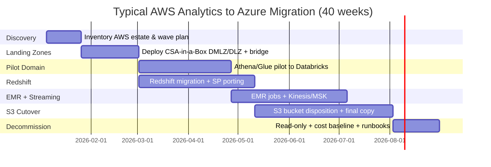

# AWS to Azure Migration Center

**The definitive resource for migrating from AWS analytics services to Microsoft Azure, Microsoft Fabric, and CSA-in-a-Box.**

---

## Who this is for

This migration center serves federal CIOs, CDOs, Chief Data Architects, platform engineers, data engineers, and analysts who are evaluating or executing a migration from AWS analytics services (Redshift, EMR, Glue, Athena, S3, Kinesis, MSK, QuickSight, SageMaker) to Azure-native services. Whether you are responding to an Azure-first mandate, consolidating onto a single hyperscaler, addressing IL5 coverage gaps in AWS GovCloud, or simplifying a five-service analytics estate into a unified platform, these resources provide the evidence, patterns, and step-by-step guidance to execute confidently.

---

## Quick-start decision matrix

| Your situation | Start here |
|---|---|
| Executive evaluating Azure vs AWS for analytics | [Why Azure over AWS](why-azure-over-aws.md) |
| Need cost justification for migration | [Total Cost of Ownership Analysis](tco-analysis.md) |
| Need a feature-by-feature comparison | [Complete Feature Mapping](feature-mapping-complete.md) |
| Ready to plan a migration | [Migration Playbook](../aws-to-azure.md) |
| Federal/government-specific requirements | [Federal Migration Guide](federal-migration-guide.md) |
| Migrating S3 data to Azure | [Storage Migration](storage-migration.md) |
| Migrating Redshift/EMR/Athena | [Compute Migration](compute-migration.md) |
| Migrating Glue ETL pipelines | [ETL Migration](etl-migration.md) |
| Migrating QuickSight dashboards | [Analytics Migration](analytics-migration.md) |
| Migrating Kinesis/MSK streaming | [Streaming Migration](streaming-migration.md) |
| Migrating SageMaker/Bedrock AI workloads | [AI/ML Migration](ai-ml-migration.md) |
| Migrating IAM/Lake Formation security | [Security Migration](security-migration.md) |

---

## Strategic resources

These documents provide the business case, cost analysis, and strategic framing for decision-makers.

| Document | Audience | Description |
|---|---|---|
| [Why Azure over AWS](why-azure-over-aws.md) | CIO / CDO / Board | Executive white paper covering strategic advantages, ecosystem synergies, talent comparison, innovation velocity, and an honest assessment of AWS strengths |
| [Total Cost of Ownership Analysis](tco-analysis.md) | CFO / CIO / Procurement | Detailed pricing model comparison across three federal tenant sizes, 5-year TCO projections, hidden cost analysis, and cost optimization strategies |
| [Complete Feature Mapping](feature-mapping-complete.md) | CTO / Platform Architecture | 60+ AWS analytics features mapped to Azure equivalents with migration complexity ratings and gap analysis |

---

## Migration guides

Domain-specific deep dives covering every aspect of an AWS-to-Azure analytics migration.

| Guide | AWS capability | Azure destination |
|---|---|---|
| [Storage Migration](storage-migration.md) | S3 buckets, lifecycle policies, versioning, access points | ADLS Gen2, OneLake, OneLake S3 shortcuts |
| [Compute Migration](compute-migration.md) | Redshift, EMR, Athena | Databricks SQL, Databricks Jobs, Fabric SQL endpoint |
| [ETL Migration](etl-migration.md) | Glue Jobs, Crawlers, Data Catalog, Step Functions | ADF, dbt, Purview, Unity Catalog |
| [Analytics Migration](analytics-migration.md) | QuickSight dashboards, SPICE, Q | Power BI, Direct Lake, Copilot |
| [Streaming Migration](streaming-migration.md) | Kinesis Data Streams, Firehose, Analytics, MSK | Event Hubs, Stream Analytics, Fabric RTI |
| [AI/ML Migration](ai-ml-migration.md) | SageMaker, Bedrock, Bedrock Agents | Azure ML, Azure OpenAI, AI Foundry, Copilot Studio |
| [Security Migration](security-migration.md) | IAM, Lake Formation, KMS, GuardDuty, CloudTrail | Entra ID, Purview, Key Vault, Defender, Azure Monitor |

---

## Technical references

| Document | Description |
|---|---|
| [Complete Feature Mapping](feature-mapping-complete.md) | Every AWS analytics feature mapped to its Azure equivalent with migration complexity ratings and CSA-in-a-Box evidence paths |
| [Migration Playbook](../aws-to-azure.md) | The end-to-end migration playbook with capability mapping, worked examples, phased project plan, and competitive framing |

---

## Government and federal

| Document | Description |
|---|---|
| [Federal Migration Guide](federal-migration-guide.md) | AWS GovCloud vs Azure Government comparison, FedRAMP High analysis, IL4/IL5/IL6 coverage, CMMC mapping, ITAR, procurement guidance, and agency-specific patterns |

---

## How CSA-in-a-Box fits

CSA-in-a-Box is the **core migration destination** --- an Azure-native reference implementation providing Data Mesh, Data Fabric, and Data Lakehouse capabilities. It compresses the five-service AWS analytics estate (Redshift + EMR + Glue + Athena + S3) into a coherent Delta Lake + Databricks + Purview + OneLake stack, and deploys a complete data platform with:

- **Infrastructure as Code** (Bicep across 4 Azure subscriptions)
- **Data governance** (Purview automation, Unity Catalog, classification taxonomies, data contracts)
- **Data engineering** (ADF pipelines, dbt models, Databricks/Fabric notebooks)
- **Analytics** (Power BI semantic models, Direct Lake, Copilot integration)
- **AI integration** (Azure OpenAI, AI Foundry, RAG patterns)
- **Compliance** (FedRAMP, CMMC, HIPAA machine-readable control mappings)
- **Migration bridge** (OneLake S3 shortcuts for zero-copy cross-cloud reads during transition)

For capabilities beyond CSA-in-a-Box's current scope (e.g., Copilot Studio agents, Power Apps operational apps, Microsoft Fabric Real-Time Intelligence), this migration center provides direct guidance using the broader Azure and Microsoft ecosystem.

---

## Migration timeline overview

---

**Last updated:** 2026-04-30
**Maintainers:** CSA-in-a-Box core team
**Related:** [Migration Playbook](../aws-to-azure.md) | [Palantir Migration Center](../palantir-foundry/index.md) | [GCP Migration](../gcp-to-azure.md) | [Snowflake Migration](../snowflake.md)
