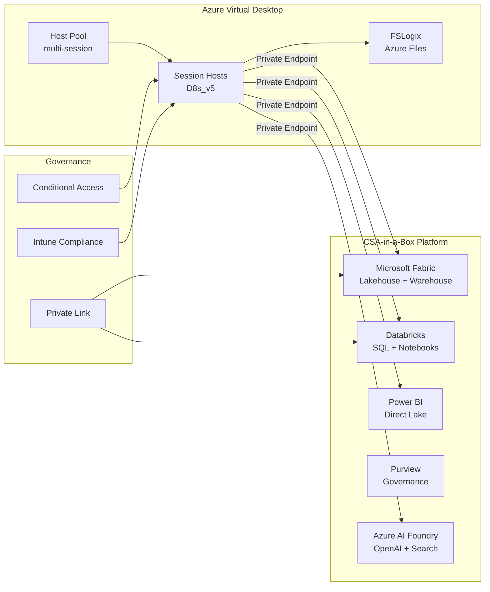

# Citrix to Azure Virtual Desktop Migration Center

**The definitive resource for migrating from Citrix Virtual Apps and Desktops to Azure Virtual Desktop (AVD), with CSA-in-a-Box as the data analyst workstation pattern.**

---

## Who this is for

This migration center serves federal CIOs, CTOs, EUC architects, VDI engineers, desktop administrators, and IT decision-makers who are evaluating or executing a migration from Citrix Virtual Apps and Desktops (CVAD), Citrix Cloud, and NetScaler Gateway to Azure Virtual Desktop. Whether you are responding to Citrix licensing cost increases, executing a cloud-first VDI strategy, consolidating end-user computing onto Azure, or deploying governed data analyst desktops for Fabric and Databricks users, these resources provide the evidence, patterns, and step-by-step guidance to execute confidently.

---

## Quick-start decision matrix

| Your situation                                    | Start here                                                   |
| ------------------------------------------------- | ------------------------------------------------------------ |
| Executive evaluating AVD vs Citrix vs Windows 365 | [Why AVD over Citrix](why-avd-over-citrix.md)                |
| Need cost justification for migration             | [Total Cost of Ownership Analysis](tco-analysis.md)          |
| Need a feature-by-feature comparison              | [Complete Feature Mapping](feature-mapping-complete.md)      |
| Ready to plan a migration                         | [Migration Playbook](../citrix-to-avd.md)                    |
| Federal/government-specific requirements          | [Federal Migration Guide](federal-migration-guide.md)        |
| Migrating session hosts and images                | [Session Host Migration](session-host-migration.md)          |
| Migrating Citrix UPM profiles                     | [Profile Migration](profile-migration.md)                    |
| Migrating published applications                  | [App Delivery Migration](app-delivery-migration.md)          |
| Migrating NetScaler/Gateway networking            | [Networking Migration](networking-migration.md)              |
| Migrating Citrix Director monitoring              | [Monitoring Migration](monitoring-migration.md)              |
| Want a step-by-step AVD deployment                | [Tutorial: AVD Deployment](tutorial-avd-deployment.md)       |
| Need to migrate Citrix profiles to FSLogix        | [Tutorial: Profile Migration](tutorial-profile-migration.md) |

---

## Decision matrix: AVD vs Windows 365 vs Citrix on Azure

Choosing the right virtual desktop platform depends on organizational requirements, user count, management complexity tolerance, and licensing posture.

| Criterion                        | Azure Virtual Desktop                          | Windows 365                     | Citrix on Azure                     |
| -------------------------------- | ---------------------------------------------- | ------------------------------- | ----------------------------------- |
| **Pricing model**                | Consumption (Azure compute) + M365 license     | Fixed per-user/month            | Azure compute + Citrix subscription |
| **Windows multi-session**        | Yes (unique to AVD)                            | No (personal only)              | No (server OS only)                 |
| **User density**                 | 12--16 users per D8s_v5 (multi-session)        | 1 user per Cloud PC             | 8--12 users per server OS VM        |
| **Management complexity**        | Medium (Azure-native)                          | Low (fully managed)             | High (Citrix + Azure)               |
| **Customization**                | Full control over images, networking, policies | Limited (Microsoft-managed)     | Full control                        |
| **GPU support**                  | NVadsA10_v5, NCasT4_v3, NDm_A100_v4            | Limited GPU options             | Same Azure GPU VMs                  |
| **RemoteApp (published apps)**   | Native                                         | No                              | Native                              |
| **MSIX app attach**              | Native                                         | No                              | Requires Citrix App Layering        |
| **FSLogix**                      | Included (M365 license)                        | Built-in (managed)              | Requires separate config            |
| **Autoscale**                    | Native scaling plans                           | N/A (always-on Cloud PCs)       | Citrix Autoscale                    |
| **Intune management**            | Full integration                               | Full integration                | Partial (session host level)        |
| **Federal (IL4/IL5)**            | Azure Government                               | Azure Government                | Azure Government + Citrix           |
| **Smart card (PIV/CAC)**         | Native                                         | Limited                         | Native                              |
| **Screen capture protection**    | Native                                         | No                              | Citrix App Protection               |
| **Teams optimization**           | Native media offload                           | Native                          | HDX media optimization              |
| **Estimated cost (1,000 users)** | $200K--$500K/yr                                | $300K--$600K/yr                 | $500K--$1.2M/yr                     |
| **Best for**                     | Large-scale VDI, mixed workloads, federal      | Small/mid orgs, simple desktops | Citrix-dependent apps, HDX-critical |

### When to choose AVD

- You have 500+ users and want multi-session density savings
- You need RemoteApp (published application) delivery
- You want to eliminate Citrix licensing costs entirely
- You are deploying data analyst desktops for Fabric/Databricks/Power BI
- You have federal requirements (IL4/IL5, PIV/CAC, screen capture protection)
- You want Azure-native management (Intune, Conditional Access, Azure Monitor)

### When to choose Windows 365

- You have fewer than 500 users with simple desktop needs
- You want zero infrastructure management (fully managed Cloud PCs)
- You prefer predictable per-user monthly pricing
- Your users do not need RemoteApp or GPU workloads

### When to stay on Citrix (on Azure)

- You have applications with hard dependencies on HDX protocol features (lossless graphics, specific USB redirection, Citrix App Protection DRM)
- You have deep Citrix policy customization that cannot be replicated in AVD
- You are in a multi-cloud environment where Citrix provides a single management plane across Azure, AWS, and GCP
- Your organization has invested heavily in Citrix-specific automation and monitoring tooling

---

## Strategic resources

| Document                                                | Audience                | Description                                                                                                                                                                              |
| ------------------------------------------------------- | ----------------------- | ---------------------------------------------------------------------------------------------------------------------------------------------------------------------------------------- |
| [Why AVD over Citrix](why-avd-over-citrix.md)           | CIO / CTO / VP of IT    | Executive white paper covering Windows multi-session advantage, Citrix licensing elimination, Azure-native management, Copilot integration, and an honest assessment of Citrix strengths |
| [Total Cost of Ownership Analysis](tco-analysis.md)     | CFO / CIO / Procurement | Detailed pricing comparison for Citrix CVAD, Citrix Cloud, AVD, and Windows 365 across three deployment sizes, 5-year TCO projections, and hidden cost analysis                          |
| [Complete Feature Mapping](feature-mapping-complete.md) | CTO / EUC Architecture  | 50+ Citrix features mapped to AVD equivalents with migration complexity ratings and gap analysis                                                                                         |

---

## Migration guides

Domain-specific deep dives covering every aspect of a Citrix-to-AVD migration.

| Guide                                               | Citrix capability                                     | AVD destination                                            |
| --------------------------------------------------- | ----------------------------------------------------- | ---------------------------------------------------------- |
| [Session Host Migration](session-host-migration.md) | VDA, MCS/PVS, Machine Catalogs, Delivery Groups       | AVD session hosts, host pools, Azure Compute Gallery       |
| [Profile Migration](profile-migration.md)           | Citrix UPM, Persona Management, folder redirection    | FSLogix profile containers, Office containers, Cloud Cache |
| [App Delivery Migration](app-delivery-migration.md) | Published apps, App Layering, App-V, Citrix Workspace | RemoteApp, MSIX app attach, application groups             |
| [Networking Migration](networking-migration.md)     | NetScaler Gateway, Citrix ADC, HDX proxy, ICA         | AVD reverse connect, RDP Shortpath, Private Link           |
| [Monitoring Migration](monitoring-migration.md)     | Citrix Director, Citrix Analytics, CQI                | Azure Monitor, AVD Insights, Log Analytics                 |

---

## Tutorials

Step-by-step walkthroughs for common migration scenarios.

| Tutorial                                                            | Description                                                                                                                       | Duration   |
| ------------------------------------------------------------------- | --------------------------------------------------------------------------------------------------------------------------------- | ---------- |
| [Deploy AVD from Scratch](tutorial-avd-deployment.md)               | Create host pool, deploy session hosts, publish desktop and RemoteApp, configure FSLogix, test user connection with Bicep and CLI | 2--3 hours |
| [Migrate Citrix Profiles to FSLogix](tutorial-profile-migration.md) | Export Citrix UPM data, configure FSLogix containers on Azure Files, migrate user data, validate profile loading                  | 1--2 hours |

---

## Government and federal

| Document                                              | Description                                                                                                                                                                  |
| ----------------------------------------------------- | ---------------------------------------------------------------------------------------------------------------------------------------------------------------------------- |
| [Federal Migration Guide](federal-migration-guide.md) | AVD in Azure Government, FedRAMP High analysis, IL4/IL5 coverage, FIPS 140-2 endpoints, smart card (PIV/CAC) authentication, DoD VDI requirements, screen capture protection |

---

## Performance and operational references

| Document                            | Description                                                                                                                      |
| ----------------------------------- | -------------------------------------------------------------------------------------------------------------------------------- |
| [Benchmarks](benchmarks.md)         | User density comparison, GPU performance, login times, protocol latency (HDX vs RDP Shortpath), Teams optimization, printing     |
| [Best Practices](best-practices.md) | Image management lifecycle, scaling plans, cost optimization, user acceptance testing, CSA-in-a-Box data analyst desktop pattern |

---

## How CSA-in-a-Box fits

CSA-in-a-Box integrates with AVD to provide **governed data analyst workstations** for users who need direct access to Azure data and analytics services. The typical CSA-in-a-Box deployment includes Fabric workspaces, Databricks clusters, Power BI capacities, Purview governance, and Azure AI Foundry -- all accessed from managed AVD desktops.

### The data analyst desktop pattern

### What AVD provides for CSA-in-a-Box users

- **Low-latency data access:** session hosts run in the same Azure region as Fabric/Databricks, eliminating WAN latency for data exploration
- **Pre-configured tooling:** golden images include Power BI Desktop, Azure Data Studio, Python/R environments, VS Code with data extensions, and Azure CLI
- **Data residency:** Conditional Access policies ensure data is accessed only from governed AVD sessions, not personal devices
- **Profile persistence:** FSLogix containers preserve Jupyter notebooks, Power BI files, VS Code settings, and browser bookmarks across sessions
- **Cost efficiency:** multi-session host pools share compute across 12--16 data analysts per VM, dramatically reducing per-user cost vs dedicated workstations

---

## Migration timeline overview

| Phase              | Weeks  | Activities                                                                   |
| ------------------ | ------ | ---------------------------------------------------------------------------- |
| **Discovery**      | 1--4   | Inventory Citrix estate, assess user workloads, classify migration tiers     |
| **Landing zone**   | 3--6   | Deploy AVD host pools, configure networking and FSLogix, build golden images |
| **Pilot**          | 5--8   | Migrate 50--100 users, validate applications, tune performance               |
| **Wave migration** | 8--16  | Migrate remaining users in 200--500 user waves                               |
| **Optimization**   | 14--20 | Tune scaling plans, optimize costs, validate monitoring                      |
| **Decommission**   | 18--24 | Drain Citrix sessions, decommission infrastructure, reclaim licenses         |

---

## Key terminology

Understanding the mapping between Citrix and AVD terminology is essential for planning:

| Citrix term                  | AVD term                          | Description                                |
| ---------------------------- | --------------------------------- | ------------------------------------------ |
| Site                         | Subscription / Resource Group     | Top-level organizational boundary          |
| Delivery Controller          | AVD Broker (Azure-managed)        | Session brokering and management           |
| Machine Catalog              | Host Pool                         | Collection of session host VMs             |
| Delivery Group               | Application Group                 | Desktop or RemoteApp assignment unit       |
| StoreFront / Workspace       | AVD Feed (built-in)               | User-facing portal for published resources |
| VDA (Virtual Delivery Agent) | AVD Agent + Boot Loader           | Session host agent software                |
| NetScaler Gateway            | AVD Reverse Connect               | Remote access gateway                      |
| Citrix Director              | AVD Insights + Azure Monitor      | Monitoring and diagnostics                 |
| Citrix UPM                   | FSLogix Profile Container         | User profile management                    |
| HDX / ICA                    | RDP + RDP Shortpath (UDP)         | Remote display protocol                    |
| MCS / PVS                    | Azure Compute Gallery             | Image management and provisioning          |
| Citrix Policies              | Intune + GPO + Conditional Access | Policy enforcement                         |
| Zones                        | Host Pools per region             | Geographic distribution                    |
| Power Management             | Scaling Plans                     | Session host auto-start/stop               |
| FAS                          | Entra ID Certificate-Based Auth   | Certificate authentication                 |
| WEM                          | Intune + FSLogix                  | Workspace environment management           |

---

## Frequently asked questions

**Q: Do I need to rebuild my golden image from scratch?**
A: No. You can modify your existing Citrix golden image by removing the Citrix VDA and installing the AVD agent. See [Session Host Migration](session-host-migration.md).

**Q: Can I run AVD and Citrix in parallel during migration?**
A: Yes. This is the recommended approach. Run both environments simultaneously and migrate users in waves. Plan for 30+ days of parallel operation.

**Q: Does AVD support published applications like Citrix?**
A: Yes. AVD RemoteApp application groups provide equivalent published application functionality. See [App Delivery Migration](app-delivery-migration.md).

**Q: What about my Citrix UPM profiles?**
A: Migrate to FSLogix Profile Containers. FSLogix provides faster login (2--5 seconds vs 15--60+ seconds) and better profile fidelity. See [Profile Migration](profile-migration.md).

**Q: Is RDP as good as HDX?**
A: For the vast majority of workloads, RDP with Shortpath (UDP) provides equivalent quality. HDX retains an edge for extreme low-bandwidth scenarios and lossless graphics. See [Benchmarks](benchmarks.md).

**Q: Does AVD work in Azure Government for federal workloads?**
A: Yes. AVD is available in all Azure Government regions, supports IL2--IL5, and inherits FedRAMP High authorization. See [Federal Migration Guide](federal-migration-guide.md).

**Q: What about my NetScaler investment?**
A: AVD eliminates the need for NetScaler Gateway entirely. AVD uses reverse connect (Azure-managed) with no inbound ports required. This removes $50K--$500K/year in NetScaler licensing. See [Networking Migration](networking-migration.md).

---

## Related resources

- **Migration index:** [docs/migrations/README.md](../README.md)
- **Migration playbook:** [Citrix to AVD Playbook](../citrix-to-avd.md)
- **VMware to Azure:** [VMware Migration](../vmware-to-azure.md) (complementary infrastructure migration)
- **AD to Entra ID:** [AD Migration](../ad-to-entra-id.md) (complementary identity migration)
- **CSA-in-a-Box Architecture:** [docs/ARCHITECTURE.md](../../ARCHITECTURE.md)
- **Government Service Matrix:** [docs/GOV_SERVICE_MATRIX.md](../../GOV_SERVICE_MATRIX.md)
- **Cost Management:** [docs/COST_MANAGEMENT.md](../../COST_MANAGEMENT.md)

---

**Maintainers:** CSA-in-a-Box core team
**Last updated:** 2026-04-30
