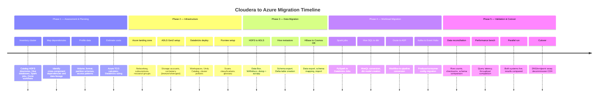
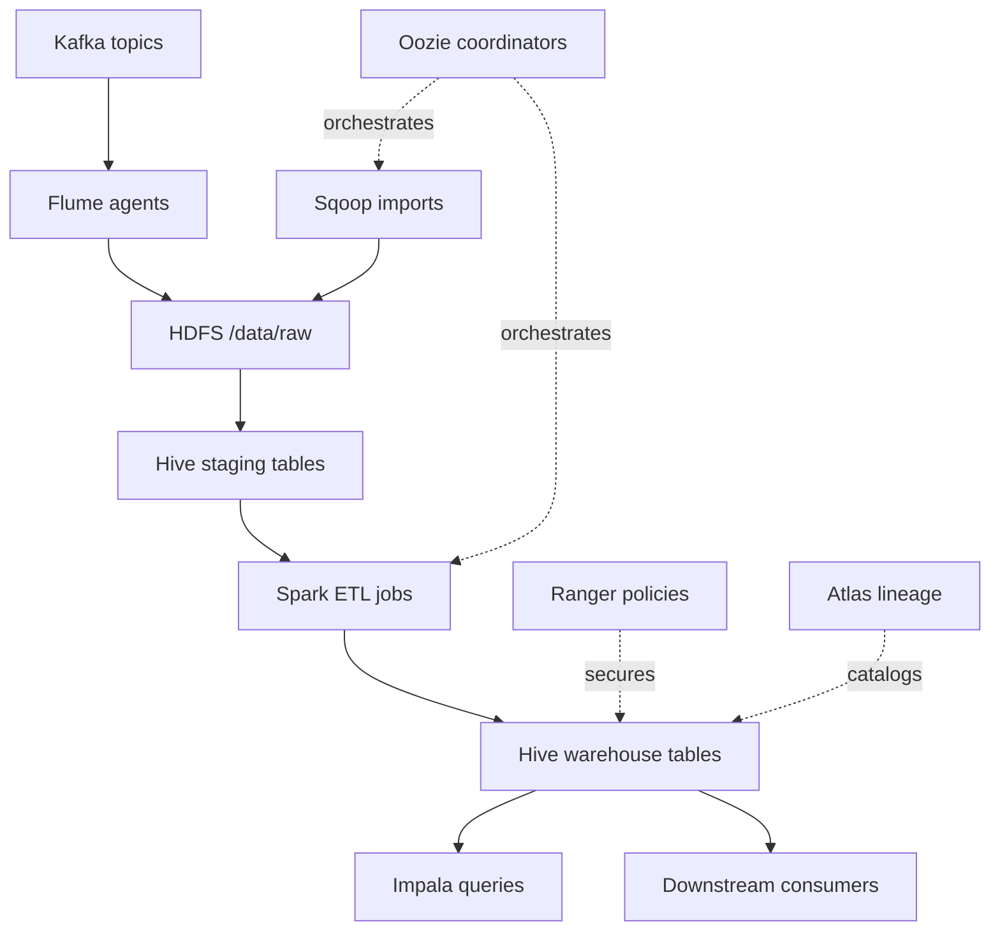
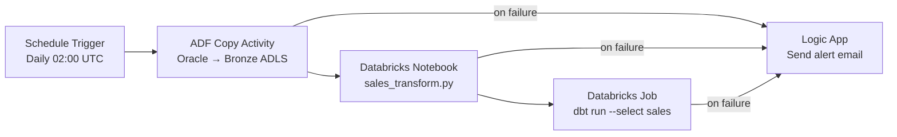
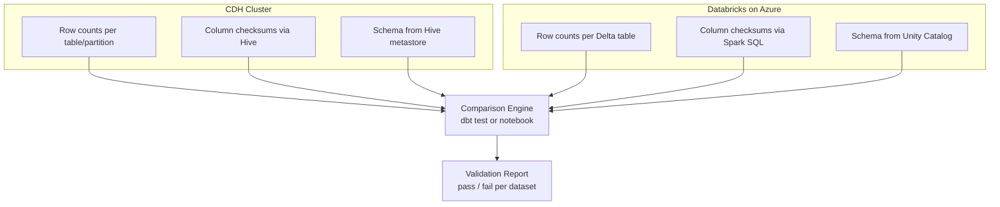

# Migrating from Cloudera/CDH to CSA-in-a-Box on Azure

**Status:** Authored 2026-04-29 | Expanded 2026-04-30
**Audience:** Data engineers, platform architects, and CDOs running Cloudera CDH 6.x or CDP Private/Public Cloud who need to migrate to a cloud-native analytics platform on Azure.
**Scope:** Full component-by-component migration from the Cloudera ecosystem (HDFS, Hive, Spark, Impala, HBase, Kafka, Oozie, Ranger, Atlas, NiFi, Sqoop, Flume) to csa-inabox on Microsoft Azure.

!!! tip "Expanded Migration Center Available"
This playbook is the core migration reference. For the complete Cloudera-to-Azure migration package — including white papers, deep-dive guides, tutorials, and benchmarks — visit the **[Cloudera Migration Center](cloudera-to-azure/index.md)**.

    **Quick links:**

    - [Why Azure over Cloudera (Executive Brief)](cloudera-to-azure/why-azure-over-cloudera.md)
    - [Total Cost of Ownership Analysis](cloudera-to-azure/tco-analysis.md)
    - [Complete Feature Mapping (40+ features)](cloudera-to-azure/feature-mapping-complete.md)
    - [Tutorials & Walkthroughs](cloudera-to-azure/index.md#tutorials)
    - [Benchmarks & Performance](cloudera-to-azure/benchmarks.md)
    - [Best Practices](cloudera-to-azure/best-practices.md)

---

## 1. Why migrate now

Cloudera's on-premises CDH reached end of life in 2022. CDP Private Cloud is still supported, but the trajectory is clear: Cloudera is consolidating on CDP Public Cloud while raising renewal costs for the shrinking on-prem installed base. For organizations evaluating their next step, there are three forcing functions that keep coming up.

**Cost.** A typical CDH cluster runs on bare metal or IaaS VMs that are provisioned for peak. You pay for hardware 24/7 whether the cluster is busy or idle. Azure PaaS services — Databricks, Synapse, Data Factory, Event Hubs — are consumption-priced and most can scale to zero between runs. Organizations that move from CDH to Azure routinely report 40-60% infrastructure cost reductions once the migration stabilizes.

**Managed services.** CDH requires a dedicated platform team: Cloudera Manager, HDFS NameNode HA, YARN capacity scheduling, Kerberos KDC maintenance, Ranger policy administration, Atlas metadata curation. On Azure, the platform team shifts from keeping Hadoop alive to building data products on managed services that handle patching, scaling, and HA natively.

**Cloud-native analytics.** The data platform landscape has moved past MapReduce. Delta Lake, lakehouse architecture, serverless SQL, real-time streaming, vector search, and AI integration are the current table stakes. Migrating to csa-inabox gives you all of these on a single coherent platform rather than bolting them onto an aging CDH cluster.

!!! info "CDP Public Cloud customers"
If you are on CDP Public Cloud (not CDH on-prem), the migration is mechanically simpler because your data is already in cloud object storage. The component mapping and workload migration sections below still apply — you are swapping the compute and governance layers, not re-lifting data.

---

## 2. Component mapping — Cloudera to Azure

This is the load-bearing table. Every row maps a Cloudera component to its Azure equivalent in the csa-inabox platform.

| Cloudera component                 | Azure / csa-inabox equivalent                           | Notes                                                                                                                                                 |
| ---------------------------------- | ------------------------------------------------------- | ----------------------------------------------------------------------------------------------------------------------------------------------------- |
| **HDFS**                           | ADLS Gen2 + OneLake                                     | Open-format storage (Delta on Parquet). No NameNode, no replication tuning. See Section 5.                                                            |
| **Hive** (Hive on Tez / Hive LLAP) | Databricks SQL + dbt models                             | HiveQL ports to Spark SQL with minor syntax changes. Managed tables become Delta tables. See Section 6.                                               |
| **Spark on YARN**                  | Azure Databricks (Jobs + SQL Warehouses)                | PySpark / Scala Spark code is largely portable. YARN configs become cluster policies. See Section 7.                                                  |
| **Impala**                         | Databricks SQL Warehouse / Synapse Dedicated SQL        | Interactive SQL workloads. Databricks SQL is the primary target for lakehouse queries.                                                                |
| **HBase**                          | Azure Cosmos DB (NoSQL or Table API)                    | Wide-column key-value workloads. Cosmos DB provides global distribution and guaranteed latency.                                                       |
| **Kafka** (CDH / CDP Kafka)        | Azure Event Hubs (Kafka-compatible endpoint)            | Kafka wire protocol compatible. Existing producers/consumers connect with config changes only. See ADR-0005 `docs/adr/0005-event-hubs-over-kafka.md`. |
| **Oozie**                          | Azure Data Factory + Databricks Workflows               | Oozie XML workflows become ADF pipelines or Databricks multi-task jobs. See Section 8.                                                                |
| **Ranger**                         | Microsoft Purview + Unity Catalog + Azure RBAC          | Fine-grained access control. Ranger policies decompose into Purview classifications + Unity Catalog grants + Entra ID RBAC.                           |
| **Atlas**                          | Microsoft Purview                                       | Metadata catalog, business glossary, data lineage. Purview is the enterprise-wide equivalent. See ADR-0006 `docs/adr/0006-purview-over-atlas.md`.     |
| **Cloudera Manager**               | Azure Portal + Azure Monitor + Databricks Admin Console | Cluster management, monitoring, alerting. Azure Monitor replaces CM health checks.                                                                    |
| **Sentry** (legacy, pre-Ranger)    | Azure AD (Entra ID) + RBAC                              | Role-based access. Entra ID groups replace Sentry roles.                                                                                              |
| **NiFi**                           | Azure Data Factory                                      | Data ingestion and routing. ADF provides 100+ connectors and visual pipeline design.                                                                  |
| **Sqoop**                          | ADF Copy Activity                                       | Bulk RDBMS-to-lake ingestion. ADF Copy Activity handles the same source/sink pairs with parallelism tuning.                                           |
| **Flume**                          | Event Hubs + Azure Functions                            | Log/event collection. Event Hubs replaces the channel; Azure Functions replaces the sink logic.                                                       |
| **Kudu**                           | Delta Lake on ADLS Gen2                                 | Fast-insert mutable storage. Delta Lake provides ACID transactions, time travel, and merge operations.                                                |
| **Hue**                            | Databricks SQL Editor + Azure Data Studio               | SQL query editor and job browser.                                                                                                                     |
| **ZooKeeper**                      | Managed by Azure services (no user-managed ZK)          | Coordination is handled internally by Event Hubs, Databricks, and Cosmos DB.                                                                          |
| **YARN**                           | Databricks cluster autoscaling + serverless             | Resource management is handled by Databricks cluster policies and serverless compute.                                                                 |

---

## 3. Migration phases

The migration follows five phases. Resist the urge to compress Phases 1 and 2 — the assessment drives every downstream decision, and cutting corners in infrastructure setup creates compounding rework.



---

## 4. Phase 1 — Assessment and planning

### 4.1 Cluster inventory

Before writing a single line of migration code, build a complete inventory. The following queries run against a CDH cluster to extract the information you need.

```bash
# HDFS directory sizes (top two levels)
hdfs dfs -du -h /user /data /warehouse | sort -rh | head -50

# Hive database and table inventory
beeline -u "jdbc:hive2://hiveserver2:10000" -e "
  SHOW DATABASES;
" > hive_databases.txt

beeline -u "jdbc:hive2://hiveserver2:10000" -e "
  SELECT t.TBL_NAME, t.TBL_TYPE, d.NAME as DB_NAME,
         s.LOCATION, p.PARAM_VALUE as NUM_ROWS
  FROM TBLS t
  JOIN DBS d ON t.DB_ID = d.DB_ID
  JOIN SDS s ON t.SD_ID = s.SD_ID
  LEFT JOIN TABLE_PARAMS p ON t.TBL_ID = p.TBL_ID AND p.PARAM_KEY = 'numRows'
  ORDER BY d.NAME, t.TBL_NAME;
" > hive_tables_inventory.csv

# Oozie workflow inventory
oozie jobs -oozie http://oozie-server:11000/oozie -jobtype coordinator -len 500 \
  | grep -v "^---" > oozie_coordinators.txt

# Spark application history (last 30 days)
yarn application -list -appStates FINISHED -appTypes SPARK \
  | tail -n +3 > spark_jobs_history.txt
```

### 4.2 Dependency mapping

Build a directed graph of component dependencies. Every Oozie workflow that calls a Spark job, every Hive table that feeds a downstream ETL, every Kafka topic consumed by a streaming job — capture it. This graph determines your migration order.



### 4.3 Data profiling

For each HDFS directory / Hive database, capture:

| Metric                                      | Why it matters                                                     |
| ------------------------------------------- | ------------------------------------------------------------------ |
| Total size (compressed)                     | Determines migration method (Data Box vs network transfer)         |
| File count                                  | Large small-file counts need compaction before or during migration |
| File format (Parquet, ORC, Avro, CSV, text) | Parquet migrates to Delta cleanly; ORC requires conversion         |
| Partition scheme                            | Partition keys carry over to Delta but may need optimization       |
| Replication factor                          | ADLS Gen2 handles redundancy natively — no need to replicate 3x    |
| Last access time                            | Stale data can be archived or skipped entirely                     |
| Compression codec                           | Snappy/Zstd carry forward; LZO requires recompression              |

---

## 5. HDFS to ADLS Gen2 migration

This is the heaviest lift by volume. Choose your method based on dataset size and network bandwidth.

### 5.1 Method selection

| Method                | Best for                                          | Throughput                             | Notes                                                                    |
| --------------------- | ------------------------------------------------- | -------------------------------------- | ------------------------------------------------------------------------ |
| **Azure Data Box**    | > 100 TB, limited bandwidth                       | Ship physical device; days to transfer | Order from Azure Portal. 80 TB per device, stackable.                    |
| **WANdisco LiveData** | Active datasets requiring zero-downtime migration | Continuous replication                 | Keeps HDFS and ADLS in sync during cutover window.                       |
| **distcp + azcopy**   | < 100 TB with decent bandwidth                    | Network-limited                        | Run distcp from CDH to a staging area, then azcopy to ADLS.              |
| **ADF Copy Activity** | Incremental / scheduled transfers                 | Parallelized by ADF                    | Use self-hosted integration runtime if CDH is on-prem behind a firewall. |

### 5.2 Directory structure mapping

Map HDFS paths to the medallion architecture on ADLS Gen2.

```
HDFS (before)                          ADLS Gen2 (after)
─────────────────────                  ──────────────────────────────
/data/raw/                       →     abfss://bronze@storageacct.dfs.core.windows.net/
/data/raw/sales/                 →     bronze/sales/
/data/raw/finance/               →     bronze/finance/
/user/hive/warehouse/            →     (migrated to Delta tables in silver/gold)
/data/staging/                   →     silver/staging/
/data/curated/                   →     gold/curated/
/data/archive/                   →     archive container (Cool/Archive tier)
```

### 5.3 Handling the small-file problem

CDH clusters often accumulate millions of small files (< 128 MB) from streaming ingestion, frequent Hive inserts, or poorly configured Spark jobs. Migrating these as-is to ADLS Gen2 is wasteful and slow.

!!! warning "Compact before or during migration"
Small files degrade query performance on both HDFS and ADLS Gen2. Compact them before migration using Spark or as part of the Delta conversion during migration. Target file sizes of 256 MB - 1 GB for analytical workloads.

```python
# Compact small files during Delta conversion
spark.read.parquet("abfss://bronze@storage.dfs.core.windows.net/sales/raw/") \
    .repartition(100) \
    .write.format("delta") \
    .mode("overwrite") \
    .option("overwriteSchema", "true") \
    .save("abfss://silver@storage.dfs.core.windows.net/sales/compacted/")
```

### 5.4 ORC to Parquet conversion

If your Hive tables use ORC format, convert to Parquet as part of the migration. Delta Lake's native format is Parquet.

```python
# Read ORC, write as Delta (Parquet under the hood)
df = spark.read.format("orc").load("hdfs:///user/hive/warehouse/sales_db.db/orders")
df.write.format("delta").mode("overwrite").saveAsTable("silver.sales.orders")
```

---

## 6. Hive to dbt on Databricks

### 6.1 HiveQL to Spark SQL conversion

Most HiveQL is valid Spark SQL. The exceptions are where the migration work lives.

| HiveQL construct                                            | Spark SQL / Databricks equivalent                     | Notes                                                 |
| ----------------------------------------------------------- | ----------------------------------------------------- | ----------------------------------------------------- |
| `CREATE TABLE ... STORED AS ORC`                            | `CREATE TABLE ... USING DELTA`                        | All new tables should be Delta.                       |
| `INSERT OVERWRITE TABLE ... PARTITION (dt='2024-01')`       | `INSERT OVERWRITE ... PARTITION (dt)` or `MERGE INTO` | Dynamic partition overwrite or MERGE for incremental. |
| `LATERAL VIEW EXPLODE(...)`                                 | `LATERAL VIEW EXPLODE(...)`                           | Syntax is identical.                                  |
| `DISTRIBUTE BY` / `SORT BY`                                 | `CLUSTER BY` / `ORDER BY` (in Delta context)          | Rarely needed — Delta handles distribution.           |
| `MSCK REPAIR TABLE`                                         | Not needed for Delta                                  | Delta manages its own metadata.                       |
| `ADD JAR ...` (for UDFs)                                    | `%pip install` or Databricks Libraries                | See UDF migration below.                              |
| `TRANSFORM ... USING 'script.py'`                           | PySpark UDF or `pandas_udf`                           | Streaming TRANSFORM is not supported; rewrite as UDF. |
| Hive-specific functions (`collect_set`, `percentile`, etc.) | Available in Spark SQL                                | Most Hive built-in functions are supported natively.  |

### 6.2 Managed vs external table migration

| Hive table type                                     | Migration strategy                                                                                                                     |
| --------------------------------------------------- | -------------------------------------------------------------------------------------------------------------------------------------- |
| **Managed table** (data in `/user/hive/warehouse/`) | Convert to Delta managed table in Unity Catalog. Data is copied and re-formatted.                                                      |
| **External table** (data in custom HDFS path)       | Register as external Delta table pointing to ADLS Gen2 path after data migration.                                                      |
| **Partitioned table**                               | Preserve partition columns. Evaluate whether Hive-style partitioning (directory-based) should become Delta partitioning or Z-ordering. |

!!! tip "Partition strategy"
Hive's directory-based partitioning (`/dt=2024-01-01/`) works on Delta but can create too many small partitions for high-cardinality columns. For columns with > 1000 distinct values, use Z-ordering instead of partitioning. For date columns with daily granularity, partitioning is still appropriate.

### 6.3 UDF migration

UDF migration is consistently the hardest part of a Hive-to-Databricks move. Budget 30% of your workload migration effort here.

| Hive UDF type                               | Databricks equivalent                                          | Migration path                                                                                        |
| ------------------------------------------- | -------------------------------------------------------------- | ----------------------------------------------------------------------------------------------------- |
| **Simple UDF** (Java class extending `UDF`) | Python UDF or Spark SQL built-in                               | Check if a built-in function exists first. Most simple UDFs have native equivalents.                  |
| **GenericUDF** (Java, complex types)        | `pandas_udf` (Python) or Scala UDF                             | Rewrite in Python/Scala. Java UDFs can run on Databricks but are not recommended for new development. |
| **UDAF** (aggregation)                      | `pandas_udf` with `GROUPED_AGG` or native aggregate functions  | Rewrite. Hive UDAFs do not run on Databricks without modification.                                    |
| **UDTF** (table-generating)                 | `explode()` + `lateral view` or Python UDTF (Databricks 14.0+) | Rewrite. Hive UDTFs are not portable.                                                                 |

```python
# Example: Hive Java UDF → Databricks Python UDF
# Before (Hive): ADD JAR /path/to/my-udfs.jar;
#   CREATE FUNCTION parse_phone AS 'com.example.ParsePhoneUDF';
#   SELECT parse_phone(phone_col) FROM customers;

# After (Databricks):
from pyspark.sql.functions import udf
from pyspark.sql.types import StringType
import re

@udf(returnType=StringType())
def parse_phone(phone):
    if phone is None:
        return None
    digits = re.sub(r'\D', '', phone)
    if len(digits) == 10:
        return f"({digits[:3]}) {digits[3:6]}-{digits[6:]}"
    return phone

# Register for SQL use
spark.udf.register("parse_phone", parse_phone)
```

### 6.4 Building dbt models from Hive SQL

Once your Hive tables are on ADLS Gen2 as Delta tables, rebuild your transformation layer in dbt. This is not a 1:1 port — it is a redesign that produces a better result.

```sql
-- dbt model: models/silver/sales/stg_orders.sql
-- Replaces: Hive ETL script that did INSERT OVERWRITE on staging.orders

{{ config(
    materialized='incremental',
    unique_key='order_id',
    file_format='delta',
    incremental_strategy='merge'
) }}

SELECT
    order_id,
    customer_id,
    order_date,
    CAST(total_amount AS DECIMAL(18,2)) AS total_amount,
    status,
    _metadata.file_modification_time AS _loaded_at
FROM {{ source('bronze_sales', 'raw_orders') }}

WHERE _metadata.file_modification_time > (SELECT MAX(_loaded_at) FROM {{ this }})

```

---

## 7. Spark job migration

### 7.1 YARN config to Databricks cluster mapping

| YARN / Spark-on-CDH config                               | Databricks equivalent                             | Notes                                                                         |
| -------------------------------------------------------- | ------------------------------------------------- | ----------------------------------------------------------------------------- |
| `spark.executor.memory`                                  | Worker node type selection                        | Choose node type with appropriate memory. Databricks manages executor memory. |
| `spark.executor.cores`                                   | Worker node type selection                        | Cores are determined by the node type, not per-executor config.               |
| `spark.executor.instances` / `spark.dynamicAllocation.*` | Autoscaling (min/max workers)                     | Set min and max workers on the cluster. Databricks handles scaling.           |
| `spark.yarn.queue`                                       | Cluster policy                                    | Queue-based isolation becomes policy-based isolation.                         |
| `spark.sql.shuffle.partitions`                           | `spark.sql.shuffle.partitions`                    | Still relevant. Default 200; tune based on data volume.                       |
| `spark.yarn.maxAppAttempts`                              | Job retry policy                                  | Configure retries in the Databricks Job definition.                           |
| `spark.jars` / `spark.jars.packages`                     | Databricks Libraries (cluster or job-scoped)      | Upload JARs to DBFS or use Maven coordinates in cluster config.               |
| `spark.hadoop.fs.defaultFS`                              | `abfss://container@account.dfs.core.windows.net/` | Storage path scheme changes from `hdfs://` to `abfss://`.                     |

### 7.2 Library migration

| CDH library management                             | Databricks equivalent                                          |
| -------------------------------------------------- | -------------------------------------------------------------- |
| Maven JARs on cluster classpath                    | Cluster Libraries (Maven coordinates) or workspace Libraries   |
| Python packages via `conda` or `pip` on edge nodes | `%pip install` in notebooks or `init_scripts` for cluster-wide |
| `spark-submit --jars`                              | Job Libraries in Databricks Workflows                          |
| Custom Hadoop JARs (InputFormat, etc.)             | Upload to DBFS; attach as cluster library                      |

### 7.3 Submit script migration

```bash
# Before: spark-submit on CDH
spark-submit \
  --master yarn \
  --deploy-mode cluster \
  --queue production \
  --num-executors 20 \
  --executor-memory 8g \
  --executor-cores 4 \
  --conf spark.sql.shuffle.partitions=400 \
  --jars /opt/libs/custom-serde.jar \
  /opt/jobs/daily_etl.py \
  --date 2024-01-15
```

```json
// After: Databricks Job definition (JSON)
{
    "name": "daily_etl",
    "tasks": [
        {
            "task_key": "run_etl",
            "spark_python_task": {
                "python_file": "dbfs:/jobs/daily_etl.py",
                "parameters": ["--date", "{{job.trigger_time.iso_date}}"]
            },
            "new_cluster": {
                "spark_version": "15.4.x-scala2.12",
                "node_type_id": "Standard_DS4_v2",
                "autoscale": {
                    "min_workers": 4,
                    "max_workers": 20
                },
                "spark_conf": {
                    "spark.sql.shuffle.partitions": "400"
                }
            },
            "libraries": [{ "jar": "dbfs:/libs/custom-serde.jar" }]
        }
    ],
    "schedule": {
        "quartz_cron_expression": "0 0 2 * * ?",
        "timezone_id": "America/New_York"
    }
}
```

### 7.4 PySpark compatibility

PySpark code is highly portable between CDH and Databricks. The main changes are:

1. **Storage paths:** `hdfs://` becomes `abfss://`
2. **SparkSession creation:** On Databricks, `spark` is pre-initialized. Remove `SparkSession.builder.master("yarn")...getOrCreate()` blocks.
3. **Hive metastore references:** `spark.sql("USE database")` becomes `spark.sql("USE CATALOG catalog; USE SCHEMA schema")` with Unity Catalog.
4. **Hadoop config:** Remove `spark.hadoop.*` configurations that reference HDFS NameNode addresses.

---

## 8. Oozie to Azure Data Factory

### 8.1 Concept mapping

| Oozie concept                              | ADF / Databricks Workflows equivalent                | Notes                                                                              |
| ------------------------------------------ | ---------------------------------------------------- | ---------------------------------------------------------------------------------- |
| **Workflow** (DAG of actions)              | ADF Pipeline / Databricks multi-task Job             | ADF for cross-service orchestration; Databricks Workflows for Spark-only DAGs.     |
| **Coordinator** (time/data trigger)        | ADF Schedule Trigger / Tumbling Window Trigger       | Tumbling Window handles data-availability patterns similar to Oozie data triggers. |
| **Bundle** (group of coordinators)         | ADF Pipeline with nested Execute Pipeline activities | Group related pipelines into a parent pipeline.                                    |
| **Fork/Join** (parallel execution)         | ADF parallel activities / Databricks parallel tasks  | ADF handles parallelism natively via activity dependencies.                        |
| **Sub-workflow**                           | ADF Execute Pipeline activity                        | Nested pipelines map 1:1 to Oozie sub-workflows.                                   |
| **Decision node**                          | ADF If Condition / Switch activity                   | Expression-based branching.                                                        |
| **Email action**                           | Logic App triggered by ADF webhook                   | ADF does not send email natively; trigger a Logic App or Azure Function.           |
| **Shell action**                           | ADF Custom Activity / Azure Batch                    | Run arbitrary scripts via Custom Activity on Azure Batch.                          |
| **Sqoop action**                           | ADF Copy Activity                                    | Direct replacement with more connectors and better parallelism.                    |
| **Hive action**                            | Databricks notebook activity (Spark SQL)             | Execute dbt models or Spark SQL notebooks.                                         |
| **Spark action**                           | Databricks notebook/JAR/Python activity              | Direct mapping.                                                                    |
| **`${coord:dataIn}` / `${coord:dataOut}`** | ADF dataset + trigger parameters                     | Parameterize pipelines with trigger metadata.                                      |

### 8.2 Workflow conversion example

```xml
<!-- Before: Oozie workflow.xml -->
<workflow-app name="daily-sales-etl" xmlns="uri:oozie:workflow:0.5">
  <start to="sqoop-import"/>
  <action name="sqoop-import">
    <sqoop>
      <command>import --connect jdbc:oracle://... --table ORDERS --target-dir /data/raw/orders</command>
    </sqoop>
    <ok to="spark-transform"/>
    <error to="send-alert"/>
  </action>
  <action name="spark-transform">
    <spark>
      <jar>/opt/jobs/sales-etl.jar</jar>
      <class>com.example.SalesETL</class>
    </spark>
    <ok to="hive-load"/>
    <error to="send-alert"/>
  </action>
  <action name="hive-load">
    <hive>
      <script>/opt/hql/load_sales.hql</script>
    </hive>
    <ok to="end"/>
    <error to="send-alert"/>
  </action>
  <action name="send-alert">
    <email><to>oncall@example.com</to><subject>ETL Failed</subject></email>
    <ok to="fail"/>
  </action>
  <kill name="fail"><message>Workflow failed</message></kill>
  <end name="end"/>
</workflow-app>
```

The equivalent on Azure uses ADF for orchestration with Databricks for compute:



!!! note "Don't convert Oozie 1:1"
Complex Oozie workflows with deeply nested sub-workflows, custom Java actions, and intricate decision trees should be redesigned rather than mechanically converted. Take the opportunity to simplify the DAG and leverage dbt's `ref()` dependency management for the transformation layer.

---

## 9. Security migration

### 9.1 Ranger to Purview + Unity Catalog + Azure RBAC

Ranger policies decompose into three layers on Azure. This is not a 1:1 mapping — it is a decomposition into purpose-built services.

| Ranger policy type                  | Azure equivalent                             | Where it lives                                              |
| ----------------------------------- | -------------------------------------------- | ----------------------------------------------------------- |
| **Database-level access**           | Unity Catalog `GRANT` on catalog/schema      | Unity Catalog SQL grants                                    |
| **Table-level access**              | Unity Catalog `GRANT` on table               | Unity Catalog SQL grants                                    |
| **Column-level masking**            | Unity Catalog column masks                   | `CREATE FUNCTION` + `ALTER TABLE SET COLUMN MASK`           |
| **Row-level filtering**             | Unity Catalog row filters                    | `CREATE FUNCTION` + `ALTER TABLE SET ROW FILTER`            |
| **HDFS path-level access**          | ADLS Gen2 RBAC + ACLs                        | Azure IAM role assignments on storage containers            |
| **Kafka topic access**              | Event Hubs RBAC                              | Entra ID role assignments (Event Hubs Data Sender/Receiver) |
| **Tag-based policies** (Atlas tags) | Purview classifications + sensitivity labels | Purview auto-classification scans                           |

```sql
-- Example: Ranger column masking → Unity Catalog column mask
-- Ranger policy: Mask SSN column for non-PII-admin role

-- Step 1: Create masking function
CREATE FUNCTION silver.sales.mask_ssn(ssn STRING)
RETURNS STRING
RETURN CASE
  WHEN is_member('pii-admins') THEN ssn
  ELSE CONCAT('XXX-XX-', RIGHT(ssn, 4))
END;

-- Step 2: Apply to table
ALTER TABLE silver.sales.customers
  ALTER COLUMN ssn SET MASK silver.sales.mask_ssn;
```

### 9.2 Kerberos to Entra ID

| Kerberos concept                               | Entra ID equivalent                                          |
| ---------------------------------------------- | ------------------------------------------------------------ |
| Kerberos principal (`user@REALM`)              | Entra ID user principal name (`user@tenant.onmicrosoft.com`) |
| Keytab files                                   | Service principal + client secret or certificate             |
| KDC (Key Distribution Center)                  | Entra ID (cloud-managed, no on-prem KDC)                     |
| Kerberos service principals for HDFS/Hive/etc. | Managed identities for Azure services                        |
| `kinit` / `klist` in job scripts               | MSAL token acquisition (transparent for managed identities)  |

### 9.3 Knox to Azure API Management

If your CDH deployment uses Apache Knox as an API gateway, map it to Azure API Management (APIM). Knox's topology-based URL rewriting becomes APIM policy-based routing. See `docs/guides/apim-data-mesh-gateway.md` for the csa-inabox APIM pattern.

---

## 10. Data validation

Never trust the migration. Validate every dataset before declaring it migrated.

### 10.1 Validation framework



### 10.2 Row count reconciliation

```sql
-- Source (Hive on CDH)
SELECT COUNT(*) AS row_count, date_partition
FROM sales.orders
GROUP BY date_partition
ORDER BY date_partition;

-- Target (Databricks)
SELECT COUNT(*) AS row_count, date_partition
FROM silver.sales.orders
GROUP BY date_partition
ORDER BY date_partition;
```

### 10.3 Checksum comparison

```sql
-- Compute column-level checksums on both sides
-- Source (Hive)
SELECT
  COUNT(*) AS total_rows,
  SUM(CAST(order_id AS BIGINT)) AS sum_order_id,
  SUM(CAST(total_amount * 100 AS BIGINT)) AS sum_amount_cents,
  COUNT(DISTINCT customer_id) AS distinct_customers
FROM sales.orders
WHERE date_partition = '2024-01';

-- Target (Databricks) — same query, different catalog
SELECT
  COUNT(*) AS total_rows,
  SUM(CAST(order_id AS BIGINT)) AS sum_order_id,
  SUM(CAST(total_amount * 100 AS BIGINT)) AS sum_amount_cents,
  COUNT(DISTINCT customer_id) AS distinct_customers
FROM silver.sales.orders
WHERE date_partition = '2024-01';
```

### 10.4 Schema drift detection

```python
# Compare schemas between Hive metastore export and Unity Catalog
import json

with open("hive_schema_export.json") as f:
    hive_schema = json.load(f)

dbx_schema = spark.table("silver.sales.orders").schema

for hive_col in hive_schema["columns"]:
    dbx_col = next(
        (c for c in dbx_schema.fields if c.name == hive_col["name"]), None
    )
    if dbx_col is None:
        print(f"MISSING: {hive_col['name']} not in Databricks table")
    elif str(dbx_col.dataType).lower() != hive_col["type"].lower():
        print(f"TYPE MISMATCH: {hive_col['name']}: "
              f"Hive={hive_col['type']}, Databricks={dbx_col.dataType}")
```

---

## 11. Gotchas and lessons learned

These are drawn from real CDH-to-Azure migrations. Each one cost someone a week or more.

!!! danger "UDF migration is the hardest part"
Budget 30% of your workload migration effort for UDF conversion. Java UDFs need to be rewritten in Python or Scala. Custom SerDes need replacement. GenericUDAFs and UDTFs have no direct port path. Start the UDF inventory in Phase 1 and prototype replacements before Phase 4 begins.

!!! warning "Hive partition pruning differs on Databricks"
Hive's partition pruning is directory-based and very literal. Databricks uses Delta statistics for file pruning, which is more efficient but behaves differently with complex predicate pushdown. Test your most performance-sensitive queries early — especially those that rely on partition pruning with functions like `date_format()` in the WHERE clause.

!!! warning "Oozie complex workflows need redesign"
Oozie workflows with more than 10 actions, multiple sub-workflows, or custom Java actions should be redesigned from scratch on ADF/Databricks Workflows. Mechanical conversion produces brittle pipelines that are harder to maintain than the original Oozie XML.

!!! info "HDFS replication factor vs ADLS redundancy"
HDFS defaults to a replication factor of 3 (three copies of every block). ADLS Gen2 handles redundancy at the storage layer (LRS/ZRS/GRS). Do not replicate data 3x on ADLS — it already has built-in redundancy. This is a common mistake that triples storage costs.

!!! info "Cloudera Sentry fine-grained policies"
If you are migrating from an older CDH cluster that uses Sentry (pre-Ranger), be aware that Sentry's role-privilege model maps cleanly to Unity Catalog grants. The migration path is simpler than Ranger because Sentry has fewer policy types to decompose.

!!! tip "Small-file compaction is non-negotiable"
CDH clusters that have been running for years accumulate enormous numbers of small files from streaming ingestion, Hive dynamic partition inserts, and Spark jobs that write with too many partitions. Compact these before or during migration. Every migration that skipped compaction paid for it in poor query performance on the Azure side.

!!! tip "Test Kerberos removal early"
Many CDH job scripts have hardcoded `kinit` calls, keytab paths, and Kerberos principal references. Removing these is mechanical but tedious. Find them all in Phase 1 so they do not surprise you during workload migration.

---

## 12. Migration checklist

- [ ] **Phase 1: Assessment**
    - [ ] Complete HDFS directory inventory (sizes, file counts, formats)
    - [ ] Export Hive metastore schema (all databases, tables, partitions)
    - [ ] Inventory all Oozie workflows, coordinators, and bundles
    - [ ] Inventory all Spark jobs (JAR, PySpark, submit scripts)
    - [ ] Catalog all UDFs (Java, Python, custom SerDes)
    - [ ] Map Ranger policies (database, table, column, row-level)
    - [ ] Document Kafka topics, consumer groups, throughput
    - [ ] Profile data volumes and identify stale/archivable datasets
    - [ ] Build dependency graph
    - [ ] Estimate Azure costs with TCO calculator
- [ ] **Phase 2: Infrastructure**
    - [ ] Deploy Azure landing zone (networking, subscriptions, resource groups)
    - [ ] Provision ADLS Gen2 storage accounts (bronze/silver/gold containers)
    - [ ] Deploy Databricks workspace with Unity Catalog
    - [ ] Configure Purview (scans, classifications, glossary)
    - [ ] Set up Azure Data Factory with self-hosted IR (if on-prem CDH)
    - [ ] Configure Event Hubs (if migrating Kafka)
    - [ ] Set up Entra ID groups matching CDH security roles
    - [ ] Deploy monitoring (Azure Monitor, Log Analytics)
- [ ] **Phase 3: Data Migration**
    - [ ] Order Azure Data Box (if > 100 TB)
    - [ ] Migrate HDFS raw data to ADLS bronze container
    - [ ] Convert ORC/Avro to Delta (Parquet) format
    - [ ] Compact small files during conversion
    - [ ] Create Delta tables in Unity Catalog matching Hive schema
    - [ ] Migrate HBase tables to Cosmos DB (if applicable)
    - [ ] Validate row counts and checksums for each dataset
- [ ] **Phase 4: Workload Migration**
    - [ ] Convert and test all UDFs
    - [ ] Port Spark jobs to Databricks (update paths, remove YARN config)
    - [ ] Convert Hive ETL to dbt models
    - [ ] Convert Oozie workflows to ADF pipelines / Databricks Workflows
    - [ ] Migrate Kafka producers/consumers to Event Hubs endpoints
    - [ ] Recreate Ranger policies as Unity Catalog grants + Purview classifications
    - [ ] Migrate Sqoop imports to ADF Copy Activities
    - [ ] Test all workloads end-to-end
- [ ] **Phase 5: Validation & Cutover**
    - [ ] Run parallel: both CDH and Azure processing same data for 2+ weeks
    - [ ] Compare outputs between CDH and Azure for every pipeline
    - [ ] Performance benchmark critical queries (latency, throughput)
    - [ ] Validate security: confirm access controls match CDH policies
    - [ ] Train operations team on Azure monitoring and troubleshooting
    - [ ] Schedule cutover window
    - [ ] Execute cutover: redirect data sources to Azure endpoints
    - [ ] Decommission CDH cluster (after 30-day bake period)

---

## 13. Cross-references

| Topic                                    | Document                                               |
| ---------------------------------------- | ------------------------------------------------------ |
| ADR: Databricks over OSS Spark           | `docs/adr/0002-databricks-over-oss-spark.md`           |
| ADR: Delta Lake over Iceberg and Parquet | `docs/adr/0003-delta-lake-over-iceberg-and-parquet.md` |
| ADR: Event Hubs over Kafka               | `docs/adr/0005-event-hubs-over-kafka.md`               |
| ADR: Purview over Atlas                  | `docs/adr/0006-purview-over-atlas.md`                  |
| ADR: ADF + dbt over Airflow              | `docs/adr/0001-adf-dbt-over-airflow.md`                |
| ADLS and storage setup                   | `docs/GETTING_STARTED.md`                              |
| Cost management                          | `docs/COST_MANAGEMENT.md`                              |
| Self-hosted integration runtime          | `docs/SELF_HOSTED_IR.md`                               |
| ADF setup guide                          | `docs/ADF_SETUP.md`                                    |
| Databricks guide                         | `docs/DATABRICKS_GUIDE.md`                             |
| Purview setup                            | `docs/governance/PURVIEW_SETUP.md`                     |
| Data governance                          | `docs/best-practices/data-governance.md`               |
| Security and compliance                  | `docs/best-practices/security-compliance.md`           |
| OSS migration playbook                   | `docs/guides/oss-migration-playbook.md`                |
| AWS to Azure migration                   | `docs/migrations/aws-to-azure.md`                      |
| GCP to Azure migration                   | `docs/migrations/gcp-to-azure.md`                      |
