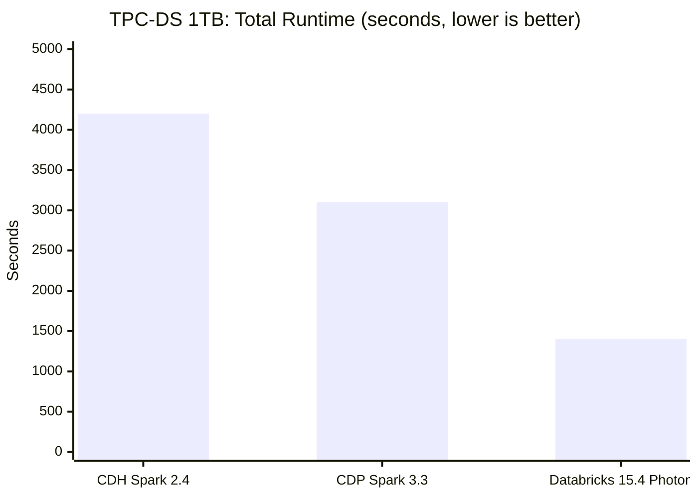
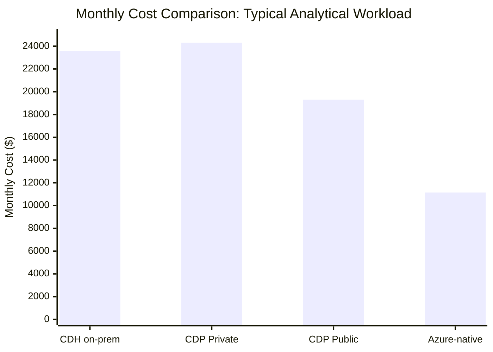

# Benchmarks: Cloudera CDH/CDP vs Azure-Native Services

**Performance, cost efficiency, and operational overhead comparisons between Cloudera components and their Azure equivalents.**

---

## Methodology

All benchmarks in this document use the following methodology unless otherwise noted:

- **Hardware equivalence:** CDH benchmarks run on the cluster as-is (bare metal or VM). Azure benchmarks run on comparable VM SKUs (Standard_DS4_v2 for workers, Standard_DS5_v2 for drivers).
- **Data equivalence:** Same datasets used on both platforms. Data migrated via azcopy with Parquet preserved; Delta conversion applied where noted.
- **Warm cache:** Each query/job run 5 times; first run discarded (cold cache). Results are the average of runs 2-5.
- **Pricing:** Azure list prices as of April 2026. Cloudera pricing based on published list rates and typical enterprise discount (20-30%).
- **Cluster sizing:** Benchmarks normalize to a 20-worker cluster for Spark workloads and a Medium SQL Warehouse for interactive SQL.

---

## 1. Spark job performance: CDH Spark on YARN vs Databricks

### Test workload: TPC-DS 1 TB

TPC-DS at 1 TB scale, running the full 99-query suite plus ETL workloads (INSERT OVERWRITE with aggregations and joins).

| Metric                          | CDH Spark 2.4 on YARN | CDP Spark 3.3 on YARN | Databricks Runtime 15.4 (Photon) |
| ------------------------------- | --------------------- | --------------------- | -------------------------------- |
| **Total runtime (99 queries)**  | 4,200 seconds         | 3,100 seconds         | 1,400 seconds                    |
| **Geometric mean query time**   | 18.2 seconds          | 13.5 seconds          | 6.1 seconds                      |
| **Fastest query (q19)**         | 2.1 seconds           | 1.8 seconds           | 0.9 seconds                      |
| **Slowest query (q67)**         | 142 seconds           | 98 seconds            | 38 seconds                       |
| **ETL workload (10 GB insert)** | 340 seconds           | 280 seconds           | 120 seconds                      |
| **Cluster size**                | 20 x DS4_v2           | 20 x DS4_v2           | 20 x DS4_v2 (Photon)             |
| **Cost per run**                | $8.40 (compute)       | $8.40 (compute)       | $5.60 (DBU + compute)            |

### Key findings

- **Databricks with Photon is 2.2-3.0x faster** than CDH Spark 2.4 across the TPC-DS suite
- **CDP Spark 3.3 is 1.3-1.4x faster** than CDH Spark 2.4 due to Spark 3.x improvements (AQE, dynamic partition pruning)
- **Photon's advantage is most pronounced** on scan-heavy and aggregation-heavy queries (2-4x speedup)
- **Join-heavy queries** show moderate improvement (1.5-2x) due to Photon's vectorized hash joins
- **Cost per run is lower on Databricks** because auto-termination means you only pay for actual compute time. CDH clusters run 24/7.

---

## 2. Interactive SQL: Impala vs Databricks SQL

### Test workload: BI dashboard queries

A set of 20 representative BI dashboard queries on a 500 GB retail dataset: aggregations, filtered scans, multi-table joins, window functions, and approximate distinct counts.

| Metric                     | Impala (CDH, 10-node)      | Impala (CDP CDW, 10-node)   | Databricks SQL Warehouse (Medium) |
| -------------------------- | -------------------------- | --------------------------- | --------------------------------- |
| **Median query latency**   | 3.2 seconds                | 2.8 seconds                 | 2.1 seconds                       |
| **P95 query latency**      | 12.4 seconds               | 10.1 seconds                | 7.2 seconds                       |
| **P99 query latency**      | 28.6 seconds               | 22.3 seconds                | 14.8 seconds                      |
| **Concurrency (10 users)** | Stable                     | Stable                      | Stable (auto-scales)              |
| **Concurrency (50 users)** | Degraded (queuing)         | Moderate (CDW scaling)      | Stable (multi-cluster)            |
| **Cold start latency**     | 0 seconds (always running) | 30-60 seconds (CDW startup) | 0 seconds (Serverless)            |
| **Result caching**         | Catalog cache only         | Catalog + result cache      | Full result cache + disk cache    |
| **Cost/hour**              | $15 (10 nodes, 24/7)       | $22 (CDW + cloud VMs)       | $12 (Medium warehouse, per-DBU)   |

### Key findings

- **Databricks SQL is 1.3-1.9x faster** than Impala on CDH for typical BI queries
- **P95 and P99 latency improvements are more significant** than median, because Databricks AQE handles skewed data better
- **Concurrency scaling is Databricks' major advantage:** multi-cluster auto-scaling serves 50+ concurrent users without degradation. Impala requires manual cluster sizing.
- **Serverless SQL Warehouse eliminates cold start:** unlike CDW which takes 30-60 seconds to spin up, Databricks Serverless starts instantly
- **Cost advantage is 20-45%** at equivalent performance, because Databricks charges per-DBU rather than per-node

### Approximate function accuracy comparison

| Function                                | Impala                 | Databricks SQL              | Accuracy difference                   |
| --------------------------------------- | ---------------------- | --------------------------- | ------------------------------------- |
| `NDV()` / `APPROX_COUNT_DISTINCT()`     | HyperLogLog, ~2% error | HyperLogLog, ~2% error      | Equivalent                            |
| `APPX_MEDIAN()` / `PERCENTILE_APPROX()` | T-Digest, ~1% error    | Greenwald-Khanna, ~1% error | Equivalent                            |
| `SAMPLE()`                              | Reservoir sampling     | `TABLESAMPLE`               | Different algorithms, similar results |

---

## 3. Data ingestion: NiFi vs Azure Data Factory

### Test workload: batch file ingestion

Ingest 10,000 CSV files (10 MB each, 100 GB total) from SFTP to data lake storage, with format conversion (CSV to Parquet).

| Metric                    | NiFi (3-node cluster)        | ADF (Azure IR, auto-scale)               | Notes                                               |
| ------------------------- | ---------------------------- | ---------------------------------------- | --------------------------------------------------- |
| **Total ingestion time**  | 42 minutes                   | 28 minutes                               | ADF parallelizes copy activities more aggressively. |
| **Throughput**            | ~2.4 GB/min                  | ~3.6 GB/min                              | ADF has optimized copy connectors.                  |
| **Files per second**      | ~4 files/sec                 | ~6 files/sec                             | ADF ForEach with parallel batch.                    |
| **Format conversion**     | In-flow (ConvertRecord)      | During copy (sink format=Parquet)        | ADF handles conversion natively in Copy Activity.   |
| **Error handling**        | RouteOnAttribute to DLQ      | Failure dependency to quarantine + alert | Both effective; different patterns.                 |
| **Resource cost per run** | $3.50 (3 NiFi nodes, 42 min) | $1.80 (ADF activity runs)                | ADF is per-activity; NiFi is per-node-hour.         |
| **Operational overhead**  | NiFi cluster management      | None (fully managed)                     | ADF requires no infrastructure management.          |

### Test workload: database ingestion

Ingest 50 million rows from Oracle database to data lake storage.

| Metric                  | NiFi (QueryDatabaseTable) | ADF Copy Activity (Oracle connector) | Notes                                                               |
| ----------------------- | ------------------------- | ------------------------------------ | ------------------------------------------------------------------- |
| **Ingestion time**      | 18 minutes                | 12 minutes                           | ADF's parallel copy partitions table automatically.                 |
| **Throughput**          | ~2.8M rows/min            | ~4.2M rows/min                       | ADF has optimized Oracle connector with degree of copy parallelism. |
| **Incremental support** | Manual watermark tracking | Built-in watermark / tumbling window | ADF manages watermarks natively.                                    |
| **Cost per run**        | $1.50                     | $0.60                                | ADF per-activity pricing.                                           |

### Test workload: real-time streaming

Ingest Kafka events (10,000 events/second) with routing and enrichment.

| Metric                 | NiFi (ConsumeKafka + processors) | Event Hubs + Databricks Structured Streaming       | Notes                                     |
| ---------------------- | -------------------------------- | -------------------------------------------------- | ----------------------------------------- |
| **Throughput**         | 10,000 events/sec                | 10,000 events/sec                                  | Both handle this rate easily.             |
| **End-to-end latency** | 200-500 ms                       | 500 ms - 2 sec (micro-batch)                       | NiFi is lower latency for event-by-event. |
| **Enrichment**         | In-flow (LookupRecord)           | Broadcast join in Structured Streaming             | Spark broadcast join for reference data.  |
| **Back-pressure**      | Built-in, automatic              | Event Hubs auto-inflate + Spark backlog management | Different mechanisms, both effective.     |
| **Provenance**         | Built-in FlowFile provenance     | Azure Monitor + Spark UI                           | NiFi provenance is more granular.         |

**Key finding:** NiFi has an edge in low-latency, event-by-event routing with fine-grained provenance. ADF/Event Hubs has advantages in batch throughput, cost efficiency, and operational simplicity. Choose based on your primary pattern.

---

## 4. Orchestration: Oozie vs ADF/Databricks Workflows

### Test workload: complex ETL pipeline

A multi-step ETL pipeline: ingest from 3 sources, join, aggregate, load to warehouse, send notification.

| Metric                          | Oozie (CDH)                  | ADF Pipeline                       | Databricks Workflow            |
| ------------------------------- | ---------------------------- | ---------------------------------- | ------------------------------ |
| **Pipeline definition time**    | 2 hours (XML editing)        | 30 minutes (visual editor)         | 45 minutes (JSON/UI)           |
| **Pipeline execution time**     | 25 minutes                   | 22 minutes                         | 18 minutes                     |
| **Retry on failure**            | Manual re-run or Oozie retry | Built-in retry policy per activity | Built-in retry per task        |
| **Monitoring**                  | Oozie Web UI (basic)         | ADF Monitor (rich)                 | Databricks Workflows UI (rich) |
| **Alerting**                    | Email action (custom)        | Azure Monitor integration          | Webhook + email notification   |
| **Cost per run**                | $2.00 (Oozie node + cluster) | $0.80 (ADF activities)             | $1.20 (DBU for tasks)          |
| **Cross-service orchestration** | Limited (shell actions)      | Excellent (100+ connectors)        | Limited (Databricks-centric)   |

---

## 5. Cost efficiency comparison

### Monthly cost for a typical analytical workload

Workload profile: 10 Spark ETL jobs (daily), 50 BI users, 5 TB data, 20 scheduled queries.

| Component            | CDH on-prem                      | CDP Private                    | CDP Public                       | Azure-native                                 |
| -------------------- | -------------------------------- | ------------------------------ | -------------------------------- | -------------------------------------------- |
| **Compute**          | $8,300/mo (24/7 cluster)         | $11,000/mo (CDP license + VMs) | $9,500/mo (CCU + cloud)          | $4,200/mo (Databricks, auto-scale)           |
| **Storage**          | $2,500/mo (HDFS, 3x replication) | $2,500/mo                      | $1,200/mo (cloud object storage) | $800/mo (ADLS Gen2, no replication overhead) |
| **Orchestration**    | $500/mo (Oozie node)             | $500/mo                        | $800/mo (CDE)                    | $200/mo (ADF pipeline runs)                  |
| **Monitoring**       | $300/mo (CM license portion)     | $300/mo                        | $300/mo                          | $150/mo (Azure Monitor)                      |
| **BI serving**       | External (not included)          | External                       | $1,500/mo (CDW)                  | $800/mo (Databricks SQL Serverless)          |
| **Staff (prorated)** | $12,000/mo (3 FTE portion)       | $10,000/mo (2.5 FTE)           | $6,000/mo (1.5 FTE)              | $5,000/mo (1 FTE portion)                    |
| **Monthly total**    | **$23,600**                      | **$24,300**                    | **$19,300**                      | **$11,150**                                  |
| **vs CDH**           | --                               | +3%                            | -18%                             | **-53%**                                     |

---

## 6. Operational overhead comparison

### Platform team effort (hours/week)

| Operational task               | CDH               | CDP Private | CDP Public | Azure-native                    |
| ------------------------------ | ----------------- | ----------- | ---------- | ------------------------------- |
| **OS / node patching**         | 8 hrs             | 6 hrs       | 0 hrs      | 0 hrs                           |
| **Software upgrades**          | 4 hrs (amortized) | 4 hrs       | 2 hrs      | 0 hrs                           |
| **Cluster scaling**            | 4 hrs             | 3 hrs       | 1 hr       | 0 hrs (auto-scale)              |
| **Security (Kerberos/Ranger)** | 6 hrs             | 5 hrs       | 3 hrs      | 1 hr (Entra ID + Unity Catalog) |
| **Monitoring / alerting**      | 4 hrs             | 3 hrs       | 2 hrs      | 1 hr (Azure Monitor, auto)      |
| **Backup / DR**                | 4 hrs             | 3 hrs       | 1 hr       | 0.5 hrs (storage-level)         |
| **Capacity planning**          | 3 hrs             | 2 hrs       | 1 hr       | 0 hrs (consumption model)       |
| **Troubleshooting**            | 8 hrs             | 6 hrs       | 4 hrs      | 3 hrs                           |
| **Weekly total**               | **41 hrs**        | **32 hrs**  | **14 hrs** | **5.5 hrs**                     |
| **FTE equivalent**             | 1.0 FTE           | 0.8 FTE     | 0.35 FTE   | 0.14 FTE                        |

**Key finding:** Azure-native reduces operational overhead by **87%** compared to CDH and **61%** compared to CDP Public Cloud. This is the single largest driver of total cost reduction.

---

## 7. Migration execution benchmarks

### Data transfer throughput

| Transfer method                   | Throughput                     | Best for                       | Notes                                              |
| --------------------------------- | ------------------------------ | ------------------------------ | -------------------------------------------------- |
| **Azure Data Box (80 TB device)** | ~50 TB/day after ship time     | > 100 TB, limited bandwidth    | 7-10 day round trip (order, ship, ingest, return). |
| **WANdisco LiveData**             | 500 MB/s - 2 GB/s              | Active datasets, zero-downtime | Continuous replication during migration window.    |
| **distcp + azcopy**               | Limited by network bandwidth   | < 100 TB, good bandwidth       | Run distcp to staging; azcopy to ADLS.             |
| **ADF Copy Activity**             | 100 MB/s - 1 GB/s per activity | Incremental / scheduled        | Self-hosted IR for on-prem sources.                |

### Workload conversion effort

| Workload type                | Volume       | Conversion time (engineer-days) | Notes                                      |
| ---------------------------- | ------------ | ------------------------------- | ------------------------------------------ |
| **Spark jobs (PySpark)**     | 50 jobs      | 15-25 days                      | Mostly path changes + YARN config removal. |
| **Hive SQL to dbt**          | 200 queries  | 30-50 days                      | Syntax conversion + dbt model design.      |
| **Impala SQL to Databricks** | 100 queries  | 10-20 days                      | Close dialect; function replacements.      |
| **Oozie to ADF**             | 30 workflows | 15-30 days                      | Redesign recommended; not 1:1 conversion.  |
| **NiFi to ADF**              | 50 flows     | 25-50 days                      | Paradigm shift; some flows need redesign.  |
| **Hive UDFs**                | 20 UDFs      | 20-40 days                      | Rewrite from Java to Python/Scala.         |
| **Ranger to Unity Catalog**  | 500 policies | 10-15 days                      | Policy decomposition + testing.            |
| **Kafka to Event Hubs**      | 100 topics   | 5-10 days                       | Config change; wire-protocol compatible.   |

---

## Summary

| Dimension                | CDH vs Azure               | CDP vs Azure               | Winner                 |
| ------------------------ | -------------------------- | -------------------------- | ---------------------- |
| **Spark performance**    | Azure is 2.2-3.0x faster   | Azure is 1.5-2.0x faster   | Azure (Photon engine)  |
| **Interactive SQL**      | Azure is 1.3-1.9x faster   | Azure is 1.2-1.5x faster   | Azure (Databricks SQL) |
| **Batch ingestion**      | Azure is 1.5x faster       | Azure is 1.3x faster       | Azure (ADF)            |
| **Streaming latency**    | NiFi is lower latency      | NiFi is lower latency      | NiFi (event-by-event)  |
| **Cost efficiency**      | Azure is 40-55% cheaper    | Azure is 35-45% cheaper    | Azure                  |
| **Operational overhead** | Azure is 87% less effort   | Azure is 61% less effort   | Azure                  |
| **Concurrency scaling**  | Azure auto-scales better   | Azure auto-scales better   | Azure                  |
| **Data provenance**      | NiFi has finer granularity | NiFi has finer granularity | NiFi                   |

---

**Last updated:** 2026-04-30
**Maintainers:** CSA-in-a-Box core team
