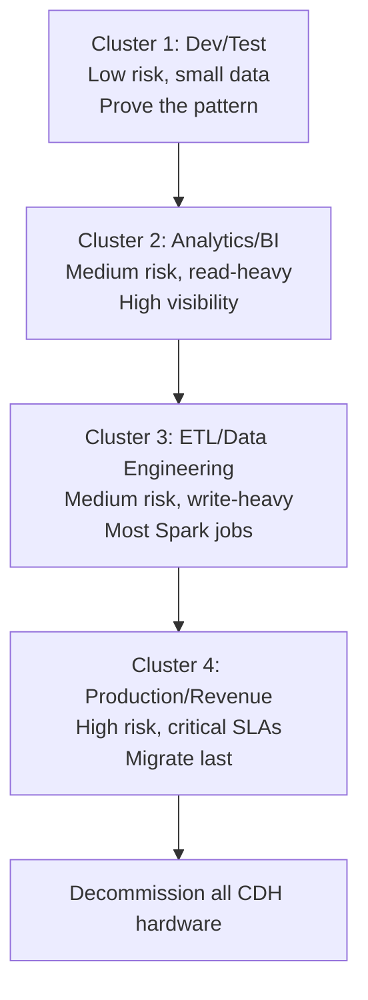
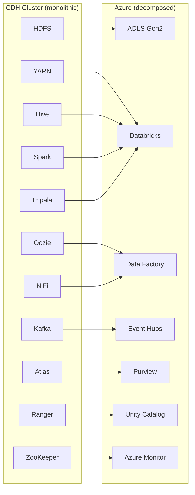
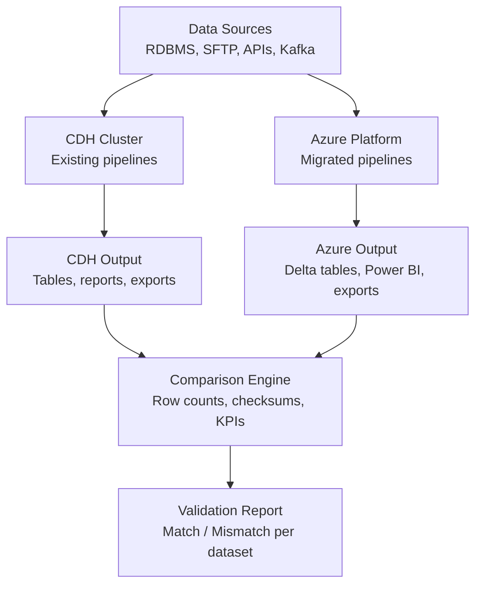

# Best Practices: Cloudera to Azure Migration

**Migration strategy, planning patterns, team structure, and common pitfalls for organizations moving from CDH or CDP to Azure.**

---

## 1. Cluster-by-cluster migration strategy

Large Cloudera deployments often run multiple clusters serving different teams or workloads. Do not migrate them all at once. Use a cluster-by-cluster approach that proves the pattern on the lowest-risk cluster first and then accelerates through the remaining clusters.

### Cluster prioritization matrix

| Factor                   | Weight | How to score                                                    |
| ------------------------ | ------ | --------------------------------------------------------------- |
| **Business criticality** | High   | Revenue-generating = high risk; internal analytics = lower risk |
| **Technical complexity** | High   | UDF count, NiFi flow count, custom SerDes = higher complexity   |
| **Data volume**          | Medium | > 100 TB requires Data Box or WANdisco; adds timeline           |
| **Team readiness**       | Medium | Team with cloud experience migrates faster                      |
| **Interdependencies**    | High   | Clusters that feed downstream clusters must migrate in order    |
| **License expiration**   | High   | Clusters with expiring CDH support migrate first                |

### Recommended cluster migration order



### What each cluster migration proves

| Cluster                  | What it proves                                                                            | What you learn                                                          |
| ------------------------ | ----------------------------------------------------------------------------------------- | ----------------------------------------------------------------------- |
| **Dev/Test**             | Data transfer pipeline works. Delta conversion works. Spark code ports cleanly.           | Transfer throughput, conversion issues, team familiarity.               |
| **Analytics/BI**         | Impala-to-Databricks SQL works. BI tool connections work. Users can use the new platform. | SQL dialect issues, BI reconnection patterns, user training needs.      |
| **ETL/Data Engineering** | Spark jobs run in production. Oozie-to-ADF works. NiFi-to-ADF works.                      | Job scheduling patterns, error handling, monitoring setup.              |
| **Production/Revenue**   | Full platform works at scale under SLAs. Security model is complete.                      | Cutover procedure, parallel-run validation, incident response on Azure. |

---

## 2. CDP vs CDH: differences that affect migration planning

If you are migrating from CDP rather than CDH, several aspects of the migration are different. Plan accordingly.

### Migration planning matrix

| Aspect                 | CDH migration                                      | CDP Private Cloud migration                            | CDP Public Cloud migration                         |
| ---------------------- | -------------------------------------------------- | ------------------------------------------------------ | -------------------------------------------------- |
| **Data location**      | HDFS on bare metal; full data lift required        | HDFS on bare metal/VM; full data lift required         | Cloud object storage; data lift is minimal         |
| **Spark version**      | Spark 2.x; upgrade to 3.x during migration         | Spark 3.x; direct port to Databricks                   | Spark 3.x; direct port to Databricks               |
| **Hive version**       | Hive 2.x; more syntax differences vs Spark SQL     | Hive 3.x; fewer differences                            | Hive 3.x; fewer differences                        |
| **Security model**     | Kerberos + Ranger (or legacy Sentry)               | Kerberos + Ranger + Knox                               | IDBroker + Ranger + Knox                           |
| **Container platform** | None (bare metal)                                  | Kubernetes (ECS/OCP); teams may have K8s experience    | Managed by Cloudera; teams may lack K8s experience |
| **API maturity**       | Older CM API; more manual work                     | CDP CLI + REST API; scriptable                         | CDP CLI + REST API; scriptable                     |
| **CDE / CML / CDW**    | Not available                                      | Available; migration to Databricks/Azure ML            | Available; migration to Databricks/Azure ML        |
| **Expected timeline**  | Longer (data lift + format conversion + code port) | Medium (data lift + code port; less format conversion) | Shorter (minimal data lift; code port only)        |

### CDP Public Cloud advantage

Organizations on CDP Public Cloud have a significant head start: their data is already in cloud object storage (S3, ADLS, or GCS). The migration is primarily a compute and governance layer swap:

1. Point Databricks at existing cloud storage
2. Convert tables to Delta format (in place, using `CONVERT TO DELTA`)
3. Port Spark jobs (remove Cloudera-specific configs)
4. Replace Ranger with Unity Catalog grants
5. Replace CDE with Databricks Workflows
6. Decommission CDP Public Cloud subscription

This can be accomplished in 8-12 weeks for a typical deployment, versus 16-30 weeks for a CDH on-prem migration.

---

## 3. Service decomposition strategy

Cloudera clusters bundle many services on shared infrastructure. On Azure, each service runs independently. This decomposition is an opportunity to right-size each component.

### Decomposition map



### Right-sizing each service

| CDH service | CDH resource allocation                 | Azure allocation                          | Savings mechanism                                   |
| ----------- | --------------------------------------- | ----------------------------------------- | --------------------------------------------------- |
| **HDFS**    | 3x replication across all DataNodes     | ADLS Gen2 (storage-level redundancy)      | Eliminate 67% storage overhead from 3x replication. |
| **Spark**   | Fixed YARN queue (e.g., 50% of cluster) | Databricks auto-scaling (0 to N workers)  | Pay only during job execution; terminate when idle. |
| **Impala**  | Dedicated Impala daemons (always on)    | Databricks SQL Serverless (scale to zero) | Pay per query; no always-on daemons.                |
| **Kafka**   | Dedicated Kafka brokers (always on)     | Event Hubs (auto-inflate TUs)             | Scale throughput units based on actual traffic.     |
| **NiFi**    | Dedicated NiFi cluster (always on)      | ADF (per-activity pricing)                | Pay per pipeline run; no always-on cluster.         |

---

## 4. Parallel-run strategy

Never cut over without a parallel-run period. This is the single most important risk mitigation step.

### Parallel-run architecture



### Parallel-run rules

1. **Duration:** Minimum 2 weeks for each cluster migration. 4 weeks for production/revenue clusters.
2. **Scope:** Every pipeline, every scheduled query, every report must run on both platforms.
3. **Comparison:** Automated daily comparison of row counts, column checksums, and key business metrics.
4. **Acceptance criteria:** Zero data discrepancies for 5 consecutive business days before cutover.
5. **Rollback plan:** CDH cluster remains available for 30 days after cutover as a safety net.

### Parallel-run cost impact

Running both platforms simultaneously costs approximately 1.3-1.5x the steady-state cost of CDH alone. Budget for this overhead for 2-8 weeks depending on the number of clusters and validation complexity.

### Validation automation

```python
# Automated comparison script (runs daily on Databricks)
from pyspark.sql import functions as F

tables_to_compare = [
    ("silver.sales.orders", "hdfs_mirror.sales.orders"),
    ("silver.sales.customers", "hdfs_mirror.sales.customers"),
    ("silver.inventory.products", "hdfs_mirror.inventory.products"),
]

results = []
for azure_table, cdh_table in tables_to_compare:
    azure_count = spark.table(azure_table).count()
    cdh_count = spark.table(cdh_table).count()
    match = azure_count == cdh_count
    results.append({
        "table": azure_table,
        "azure_count": azure_count,
        "cdh_count": cdh_count,
        "match": match,
        "diff": azure_count - cdh_count,
        "timestamp": F.current_timestamp()
    })

    if not match:
        print(f"MISMATCH: {azure_table}: Azure={azure_count}, CDH={cdh_count}")

# Write results to validation tracking table
spark.createDataFrame(results).write \
    .format("delta") \
    .mode("append") \
    .saveAsTable("audit.migration_validation")
```

---

## 5. Decommission timeline

### Phased decommission plan

| Phase                     | Duration          | Action                                   | Risk mitigation                                      |
| ------------------------- | ----------------- | ---------------------------------------- | ---------------------------------------------------- |
| **Pre-cutover**           | 2-4 weeks         | Parallel run; both systems active        | Full rollback capability.                            |
| **Cutover**               | 1 day             | Redirect data sources to Azure endpoints | CDH still running as read-only backup.               |
| **Post-cutover bake**     | 30 days           | CDH read-only; Azure is primary          | Can re-enable CDH pipelines if critical issue found. |
| **CDH shutdown**          | 1 day             | Stop all CDH services                    | Data archived to ADLS for reference if needed.       |
| **Hardware decommission** | 2-4 weeks         | Wipe disks, return/recycle hardware      | Asset management and disposal.                       |
| **License termination**   | Next renewal date | Do not renew Cloudera Enterprise license | Confirm with procurement.                            |

### Pre-decommission checklist

- [ ] All data validated on Azure (row counts, checksums, KPIs match)
- [ ] All pipelines running on Azure for 2+ weeks without data issues
- [ ] All BI tools reconnected to Azure (Databricks SQL, Power BI)
- [ ] All users trained on Azure platform
- [ ] All monitoring and alerting configured on Azure
- [ ] All security policies (Ranger) recreated on Unity Catalog
- [ ] Incident response runbook updated for Azure
- [ ] CDH data archived to ADLS (cold/archive tier) for compliance/reference
- [ ] CDH Kerberos/keytab references removed from all scripts
- [ ] Cloudera Manager alerts disabled to prevent false alarms during shutdown
- [ ] Stakeholder sign-off on cutover and decommission

---

## 6. Team structure and roles

### During migration (temporary team augmentation)

| Role                           | Count | Responsibilities                                                |
| ------------------------------ | ----- | --------------------------------------------------------------- |
| **Migration lead**             | 1     | Overall migration planning, timeline, stakeholder communication |
| **Data engineer (Spark/Hive)** | 2-3   | Spark job porting, Hive-to-dbt conversion, UDF rewrites         |
| **Data engineer (NiFi/ADF)**   | 1-2   | NiFi-to-ADF pipeline conversion, integration testing            |
| **Impala/SQL specialist**      | 1     | Impala-to-Databricks SQL conversion, BI tool reconnection       |
| **Security engineer**          | 1     | Ranger-to-Unity Catalog policy migration, Kerberos removal      |
| **Azure platform engineer**    | 1     | Landing zone setup, networking, IAM, monitoring                 |
| **QA / validation**            | 1     | Parallel-run validation, data quality checks, reporting         |

### Post-migration (steady state)

| Role                   | Count | Responsibilities                                                     |
| ---------------------- | ----- | -------------------------------------------------------------------- |
| **Platform engineer**  | 1-2   | Azure infrastructure, Databricks workspace management, monitoring    |
| **Data engineer**      | 2-4   | dbt models, ADF pipelines, Databricks jobs, Delta table optimization |
| **Analytics engineer** | 1-2   | Power BI semantic models, dbt metrics, data documentation            |
| **Data governance**    | 0.5-1 | Purview classifications, Unity Catalog grants, data quality          |

The post-migration team is typically 30-50% smaller than the CDH operations team because managed services eliminate infrastructure management work.

---

## 7. Common pitfalls and how to avoid them

### Pitfall 1: Trying to replicate CDH architecture on Azure

**Problem:** Teams deploy Azure VMs, install open-source Hadoop components, and try to recreate the CDH cluster in the cloud.

**Why it happens:** Familiarity bias. The team knows Hadoop and tries to minimize learning.

**Solution:** Use Azure-native managed services. The whole point of migration is to stop managing Hadoop infrastructure. Deploying Hadoop on Azure VMs gives you the worst of both worlds: cloud costs without cloud benefits.

### Pitfall 2: Underestimating UDF migration

**Problem:** Teams discover during Phase 4 that they have 50+ Java UDFs, custom SerDes, and GenericUDAFs that cannot run on Databricks without rewriting.

**Why it happens:** UDFs are invisible in cluster inventory scripts. They live in JAR files on HDFS or in Maven repositories, not in the Hive metastore.

**Solution:** Inventory UDFs in Phase 1. Grep all Hive scripts for `ADD JAR`, `CREATE FUNCTION`, `TRANSFORM USING`. Prototype replacements before Phase 4.

### Pitfall 3: Ignoring small-file compaction

**Problem:** Migrated data performs poorly on Azure because millions of small files from CDH streaming ingestion or Hive dynamic partitions were transferred as-is.

**Why it happens:** The migration tool (azcopy, Data Box) copies files faithfully. It does not compact them.

**Solution:** Compact during Delta conversion. Target 256 MB - 1 GB per file. Enable auto-optimization on all Delta tables post-migration.

### Pitfall 4: Skipping the parallel-run

**Problem:** The team cuts over to Azure after unit testing individual pipelines but without running both systems on production data simultaneously. Discrepancies are discovered by business users, not by the migration team.

**Why it happens:** Parallel-run is expensive (1.3-1.5x cost) and time-consuming. Teams under deadline pressure skip it.

**Solution:** Budget for 2-4 weeks of parallel-run per cluster. Automate comparison. This is the single most important risk mitigation step. Skipping it costs more in incident response than it saves in parallel-run costs.

### Pitfall 5: Big-bang migration of all clusters

**Problem:** The team plans to migrate all CDH clusters simultaneously to minimize the total migration window.

**Why it happens:** Management wants to minimize the period of paying for both CDH and Azure.

**Solution:** Migrate cluster by cluster. The first cluster takes longest (learning curve, tooling setup). Subsequent clusters go 2-3x faster because the team has established patterns. The sequential approach is actually faster in total wall-clock time because it avoids the coordination overhead and incident recovery costs of a big-bang.

### Pitfall 6: Mechanical Oozie conversion

**Problem:** The team converts every Oozie action to an ADF activity 1:1, producing brittle ADF pipelines that are harder to maintain than the original Oozie XML.

**Why it happens:** Conversion tools and scripts generate 1:1 mappings without architectural judgment.

**Solution:** Redesign complex Oozie workflows. Use the migration as an opportunity to simplify DAGs, leverage dbt's `ref()` dependency management, and separate orchestration (ADF) from transformation (dbt/Databricks).

### Pitfall 7: Not cleaning up Kerberos references

**Problem:** Migrated Spark scripts fail on Databricks because they contain hardcoded `kinit` calls, keytab paths, and Kerberos principal references.

**Why it happens:** Kerberos is so deeply embedded in CDH that teams forget to search for all references.

**Solution:** In Phase 1, grep all scripts, configuration files, and job definitions for: `kinit`, `keytab`, `principal`, `krb5.conf`, `REALM`, `KDC`. Create a remediation checklist.

### Pitfall 8: Ignoring HDFS replication factor

**Problem:** The team configures ADLS Gen2 with extra copies of data, tripling storage costs, because they are accustomed to HDFS's 3x replication.

**Why it happens:** HDFS defaults to replication factor 3. Teams assume they need the same on Azure.

**Solution:** ADLS Gen2 handles redundancy at the storage layer (LRS = 3 copies within a datacenter, ZRS = 3 copies across availability zones, GRS = 6 copies across regions). Do not replicate data at the application level. This mistake alone can triple your storage bill.

---

## 8. Change management

### Training plan

| Audience        | Training topic                                    | Duration | Format            |
| --------------- | ------------------------------------------------- | -------- | ----------------- |
| Data engineers  | Databricks workspace, notebooks, Jobs             | 2 days   | Hands-on workshop |
| Data engineers  | dbt fundamentals + Databricks dbt integration     | 1 day    | Hands-on workshop |
| Data engineers  | ADF pipeline development                          | 1 day    | Hands-on workshop |
| SQL analysts    | Databricks SQL Editor, dialect differences        | 0.5 day  | Demo + practice   |
| BI developers   | Power BI + Databricks SQL connector               | 0.5 day  | Demo + practice   |
| Data governance | Purview + Unity Catalog                           | 1 day    | Hands-on workshop |
| Platform team   | Azure Monitor, cost management, Databricks admin  | 2 days   | Hands-on workshop |
| All users       | ADLS Gen2 storage navigation, Azure Portal basics | 0.5 day  | Self-paced        |

### Communication cadence

| Communication                | Frequency    | Audience         | Content                                       |
| ---------------------------- | ------------ | ---------------- | --------------------------------------------- |
| Migration status update      | Weekly       | All stakeholders | Progress, blockers, next steps                |
| Technical sync               | Twice weekly | Migration team   | Technical issues, architecture decisions      |
| Executive briefing           | Bi-weekly    | CIO/CDO          | Timeline, budget, risk, decisions needed      |
| User readiness update        | Bi-weekly    | End users        | Training schedule, what is changing, FAQ      |
| Post-migration retrospective | Once         | All              | Lessons learned, what worked, what to improve |

---

## 9. Success criteria

Define these before migration starts. Get stakeholder sign-off.

| Criterion                | Metric                                             | Target                                           |
| ------------------------ | -------------------------------------------------- | ------------------------------------------------ |
| **Data accuracy**        | Row count and checksum match between CDH and Azure | 100% match for all migrated datasets             |
| **Query performance**    | P95 query latency on Databricks SQL vs Impala      | Within 120% of Impala baseline (or better)       |
| **Pipeline reliability** | ADF/Databricks Workflow success rate               | > 99% over 2-week validation period              |
| **Cost**                 | Monthly Azure run-rate vs monthly CDH cost         | ≤ 65% of CDH cost by month 3 post-migration      |
| **Operational overhead** | Platform team hours per week                       | ≤ 50% of CDH operational hours                   |
| **User satisfaction**    | Survey of data engineers and analysts              | ≥ 80% rate new platform as "good" or "excellent" |
| **Security compliance**  | All Ranger policies recreated on Unity Catalog     | 100% policy coverage, verified by audit          |
| **CDH decommission**     | CDH hardware decommissioned                        | Within 60 days of cutover                        |

---

## Next steps

1. **Use the [Migration Playbook](../cloudera-to-azure.md)** for the detailed phased plan
2. **Review the [TCO Analysis](tco-analysis.md)** to build the financial case
3. **See the [Benchmarks](benchmarks.md)** for performance comparison data
4. **Start hands-on** with the [NiFi to ADF Tutorial](tutorial-nifi-to-adf.md) or [Impala to Databricks Tutorial](tutorial-impala-to-databricks.md)

---

**Last updated:** 2026-04-30
**Maintainers:** CSA-in-a-Box core team
