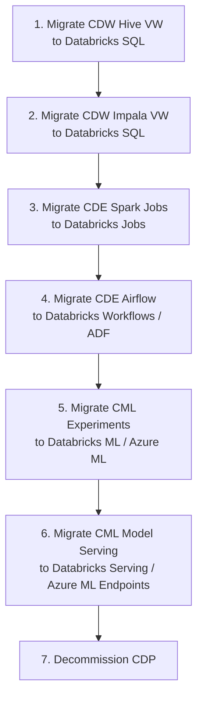

# CDP Data Engineering Migration: CDE, CML, CDW to Azure

**A detailed guide for migrating Cloudera Data Platform (CDP) components -- Data Engineering (CDE), Machine Learning (CML), and Data Warehouse (CDW) -- to Databricks, Azure ML, and Fabric.**

---

## Overview

CDP represents Cloudera's modern platform, built on Kubernetes and available in Private Cloud and Public Cloud editions. Organizations on CDP are in a different position than CDH shops: the infrastructure is more modern, the APIs are cleaner, and the migration paths are more direct. However, the core economic and strategic arguments for Azure migration still apply -- CDP licensing costs are rising, and Azure-native services provide broader capabilities at lower total cost.

This guide covers three CDP-specific components that require dedicated migration approaches beyond the core HDFS/Hive/Spark/Oozie playbook.

---

## 1. CDE Virtual Clusters to Databricks Workspaces

### Architecture comparison

| CDE concept                       | Databricks equivalent                   | Notes                                                             |
| --------------------------------- | --------------------------------------- | ----------------------------------------------------------------- |
| **CDE Service**                   | Databricks account                      | Top-level container for all resources.                            |
| **Virtual Cluster**               | Databricks Workspace                    | Isolated environment with its own compute, notebooks, and jobs.   |
| **CDE Spark job**                 | Databricks Job (Spark task)             | Spark application submitted for scheduled or on-demand execution. |
| **CDE resource (files/archives)** | Databricks DBFS / Unity Catalog Volumes | File storage for job dependencies.                                |
| **CDE job run**                   | Databricks Job Run                      | Individual execution of a job.                                    |
| **CDE CLI**                       | Databricks CLI / REST API               | Command-line management interface.                                |
| **CDE API**                       | Databricks REST API / SDK               | Programmatic access to all functionality.                         |

### CDE job definition to Databricks job

```yaml
# CDE job definition (CDE CLI format)
name: daily-sales-etl
type: spark
application-file: s3a://cde-resources/jobs/sales_etl.py
driver-cores: 2
driver-memory: 4g
executor-cores: 4
executor-memory: 8g
num-executors: 10
conf:
    spark.sql.shuffle.partitions: 400
schedule:
    enabled: true
    cron-expression: "0 2 * * *"
    start: "2025-01-01T00:00:00Z"
```

```json
// Databricks Job definition (Jobs API 2.1 format)
{
    "name": "daily-sales-etl",
    "tasks": [
        {
            "task_key": "run_sales_etl",
            "spark_python_task": {
                "python_file": "dbfs:/jobs/sales_etl.py"
            },
            "new_cluster": {
                "spark_version": "15.4.x-scala2.12",
                "node_type_id": "Standard_DS4_v2",
                "driver_node_type_id": "Standard_DS4_v2",
                "autoscale": {
                    "min_workers": 4,
                    "max_workers": 10
                },
                "spark_conf": {
                    "spark.sql.shuffle.partitions": "400"
                }
            }
        }
    ],
    "schedule": {
        "quartz_cron_expression": "0 0 2 * * ?",
        "timezone_id": "UTC"
    }
}
```

### Key differences in job management

| CDE behavior                         | Databricks behavior                                          | Migration note                                                   |
| ------------------------------------ | ------------------------------------------------------------ | ---------------------------------------------------------------- |
| Virtual cluster has fixed compute    | Clusters are per-job or shared (job clusters vs all-purpose) | Use job clusters for production; all-purpose for development.    |
| Resources uploaded via CDE CLI       | Libraries attached via cluster config or job config          | Upload JARs/wheels to DBFS or Unity Catalog Volumes.             |
| CDE manages Spark versions per VC    | Databricks Runtime version set per cluster                   | Choose DBR version in cluster config.                            |
| CDE auto-scales within VC limits     | Databricks auto-scales per cluster policy                    | Set min/max workers in cluster or policy.                        |
| CDE resource isolation via namespace | Databricks workspace isolation + Unity Catalog               | Workspace-level isolation; data access via Unity Catalog grants. |

---

## 2. CDE Airflow to Databricks Workflows

CDE includes Apache Airflow for orchestration. This is one of the more straightforward migrations because Databricks Workflows provides a native alternative, and ADF provides a broader orchestration layer.

### Migration targets

| CDE Airflow pattern                      | Target                                        | When to use                                                  |
| ---------------------------------------- | --------------------------------------------- | ------------------------------------------------------------ |
| Simple Spark DAG (all tasks are Spark)   | Databricks Workflows (multi-task job)         | All tasks run on Databricks compute.                         |
| Mixed DAG (Spark + SQL + shell + API)    | ADF Pipeline                                  | Cross-service orchestration (Databricks + SQL + Logic Apps). |
| Complex DAG with branching/dynamic tasks | Databricks Workflows + ADF                    | Databricks for compute tasks; ADF for cross-service logic.   |
| Airflow sensors (file/time/external)     | ADF triggers (schedule/event/tumbling window) | ADF trigger types replace Airflow sensor patterns.           |

### Airflow DAG to Databricks Workflow conversion

```python
# CDE Airflow DAG (before)
from airflow import DAG
from airflow.providers.cde.operators.cde_job import CDEJobRunOperator
from datetime import datetime

dag = DAG(
    'daily_sales_pipeline',
    schedule_interval='0 2 * * *',
    start_date=datetime(2025, 1, 1),
    catchup=False
)

extract = CDEJobRunOperator(
    task_id='extract_orders',
    job_name='extract_orders_job',
    dag=dag
)

transform = CDEJobRunOperator(
    task_id='transform_sales',
    job_name='transform_sales_job',
    dag=dag
)

load = CDEJobRunOperator(
    task_id='load_warehouse',
    job_name='load_warehouse_job',
    dag=dag
)

extract >> transform >> load
```

```json
// Databricks Workflow (after)
{
    "name": "daily_sales_pipeline",
    "tasks": [
        {
            "task_key": "extract_orders",
            "spark_python_task": {
                "python_file": "dbfs:/jobs/extract_orders.py"
            },
            "new_cluster": {
                "spark_version": "15.4.x-scala2.12",
                "node_type_id": "Standard_DS4_v2",
                "autoscale": { "min_workers": 2, "max_workers": 8 }
            }
        },
        {
            "task_key": "transform_sales",
            "depends_on": [{ "task_key": "extract_orders" }],
            "spark_python_task": {
                "python_file": "dbfs:/jobs/transform_sales.py"
            },
            "new_cluster": {
                "spark_version": "15.4.x-scala2.12",
                "node_type_id": "Standard_DS4_v2",
                "autoscale": { "min_workers": 2, "max_workers": 10 }
            }
        },
        {
            "task_key": "load_warehouse",
            "depends_on": [{ "task_key": "transform_sales" }],
            "spark_python_task": {
                "python_file": "dbfs:/jobs/load_warehouse.py"
            },
            "new_cluster": {
                "spark_version": "15.4.x-scala2.12",
                "node_type_id": "Standard_DS4_v2",
                "num_workers": 4
            }
        }
    ],
    "schedule": {
        "quartz_cron_expression": "0 0 2 * * ?",
        "timezone_id": "UTC"
    },
    "email_notifications": {
        "on_failure": ["data-eng@example.com"]
    }
}
```

### Airflow operator mapping

| Airflow operator (CDE)  | Databricks Workflow / ADF equivalent              | Notes                                                  |
| ----------------------- | ------------------------------------------------- | ------------------------------------------------------ |
| `CDEJobRunOperator`     | Databricks Spark task                             | Direct mapping.                                        |
| `BashOperator`          | ADF Custom Activity (Azure Batch)                 | Shell scripts run on Azure Batch.                      |
| `PythonOperator`        | Databricks Python task / Azure Functions          | Python scripts as Spark tasks or serverless Functions. |
| `SqlSensor`             | ADF Lookup Activity + Until loop                  | Poll database until condition met.                     |
| `FileSensor`            | ADF GetMetadata + Until loop / Event Grid trigger | File arrival detection.                                |
| `ExternalTaskSensor`    | ADF Execute Pipeline with dependency              | Cross-pipeline dependencies.                           |
| `BranchPythonOperator`  | ADF If Condition / Switch                         | Conditional branching.                                 |
| `TriggerDagRunOperator` | ADF Execute Pipeline activity                     | Trigger another pipeline/workflow.                     |
| `EmailOperator`         | Logic App (triggered by ADF/Databricks webhook)   | Email notifications via Logic App.                     |
| `SlackWebhookOperator`  | Logic App (Slack connector)                       | Slack alerts via Logic App.                            |

---

## 3. CML to Azure ML + Databricks ML

### Architecture comparison

| CML component                        | Azure equivalent                                      | Notes                                           |
| ------------------------------------ | ----------------------------------------------------- | ----------------------------------------------- |
| **CML Workspace**                    | Azure ML Workspace / Databricks Workspace             | Both provide Jupyter-style environments.        |
| **CML Session**                      | Azure ML Compute Instance / Databricks cluster        | Interactive compute for development.            |
| **CML Experiments**                  | MLflow on Databricks / Azure ML Experiments           | MLflow tracking is available on both platforms. |
| **CML Models (registry)**            | Databricks Model Registry / Azure ML Model Registry   | Model versioning and stage management.          |
| **CML Model Serving**                | Databricks Model Serving / Azure ML Managed Endpoints | Real-time inference endpoints.                  |
| **CML Applied ML Prototypes (AMPs)** | Databricks Solution Accelerators                      | Pre-built templates for common ML patterns.     |
| **CML Projects (Git-backed)**        | Databricks Repos / Azure ML linked repos              | Git integration for version control.            |
| **CML Jobs (scheduled)**             | Databricks Jobs / Azure ML Pipelines                  | Scheduled ML training and scoring.              |

### Migration decision: Azure ML vs Databricks ML

| Use case                                   | Choose Azure ML                    | Choose Databricks ML        |
| ------------------------------------------ | ---------------------------------- | --------------------------- |
| **Heavy Spark-based feature engineering**  | No                                 | **Yes** (native Spark)      |
| **Traditional ML (scikit-learn, XGBoost)** | **Yes**                            | Yes                         |
| **Deep learning (PyTorch, TensorFlow)**    | **Yes** (GPU clusters)             | Yes (GPU clusters)          |
| **LLM fine-tuning**                        | **Yes** (Azure AI Foundry)         | Yes (Foundation Model APIs) |
| **AutoML**                                 | **Yes** (Azure ML AutoML)          | Yes (Databricks AutoML)     |
| **Responsible AI dashboard**               | **Yes**                            | No                          |
| **Already using Databricks for data**      | No                                 | **Yes** (unified platform)  |
| **Complex pipeline orchestration**         | **Yes** (Azure ML Pipelines)       | Databricks Workflows        |
| **Need endpoint autoscaling**              | **Yes** (managed online endpoints) | Yes (Model Serving)         |
| **Real-time feature serving**              | Databricks Feature Store           | Databricks Feature Store    |

**Recommendation:** If your data engineering runs on Databricks, use Databricks ML for tight integration. If you need Responsible AI dashboards, LLM fine-tuning with Azure AI Foundry, or complex multi-step ML pipelines, use Azure ML. Many organizations use both.

### CML model migration script

```python
# Step 1: Export model from CML (on CML cluster)
import cmlapi
import mlflow
import os

# Connect to CML
client = cmlapi.default_client()

# Download model artifacts
mlflow.set_tracking_uri("https://cml-workspace.example.com/mlflow")
model_uri = "models:/sales_forecast/Production"
local_path = mlflow.artifacts.download_artifacts(model_uri, dst_path="/tmp/models")

# Package model for transfer
# azcopy copy /tmp/models abfss://ml@storage.dfs.core.windows.net/models/sales_forecast/

# Step 2: Register model on Databricks (on Databricks)
import mlflow

mlflow.set_registry_uri("databricks-uc")

# Load model from ADLS
model_path = "abfss://ml@storage.dfs.core.windows.net/models/sales_forecast/"

# Register in Unity Catalog
mlflow.register_model(
    f"runs:/{run_id}/model",  # Or from local path
    "ml_catalog.models.sales_forecast"
)

# Step 3: Deploy as serving endpoint
from databricks.sdk import WorkspaceClient

w = WorkspaceClient()
w.serving_endpoints.create(
    name="sales-forecast-endpoint",
    config={
        "served_models": [{
            "model_name": "ml_catalog.models.sales_forecast",
            "model_version": "1",
            "workload_size": "Small",
            "scale_to_zero_enabled": True
        }]
    }
)
```

---

## 4. CDP Data Warehouse (CDW) to Databricks SQL + Fabric

### CDW architecture to Azure mapping

| CDW component                    | Azure equivalent                          | Notes                                                    |
| -------------------------------- | ----------------------------------------- | -------------------------------------------------------- |
| **CDW Hive Virtual Warehouse**   | Databricks SQL Warehouse                  | HiveQL to Spark SQL conversion (see playbook Section 6). |
| **CDW Impala Virtual Warehouse** | Databricks SQL Warehouse                  | See [Impala Migration](impala-migration.md).             |
| **CDW auto-scaling**             | Databricks SQL Serverless auto-scaling    | More granular scaling on Databricks.                     |
| **CDW Data Visualization**       | Power BI                                  | Richer visualization; Direct Lake for lakehouse data.    |
| **CDW query isolation**          | Databricks SQL multi-cluster auto-scaling | Each concurrent user group gets its own cluster.         |
| **CDW Hue interface**            | Databricks SQL Editor                     | SQL editor with autocomplete, query history.             |

### CDW to Fabric SQL endpoint (alternative)

For organizations adopting Microsoft Fabric, CDW workloads can also target Fabric SQL endpoint:

| CDW feature                  | Fabric SQL endpoint                          | Notes                                      |
| ---------------------------- | -------------------------------------------- | ------------------------------------------ |
| Interactive SQL on lake data | Fabric SQL endpoint (read Delta via OneLake) | T-SQL syntax instead of HiveQL/Impala SQL. |
| BI serving                   | Power BI Direct Lake mode                    | Sub-second dashboard refresh.              |
| Data exploration             | Fabric Lakehouse notebooks                   | PySpark + SQL in Fabric notebooks.         |
| Scheduled queries            | Fabric Data Pipeline (notebook activity)     | Scheduled notebook execution.              |

**When to choose Fabric vs Databricks SQL:**

| Scenario                            | Fabric SQL endpoint   | Databricks SQL      |
| ----------------------------------- | --------------------- | ------------------- |
| Organization is Microsoft 365-heavy | **Yes**               | Maybe               |
| Heavy Spark workloads alongside SQL | Maybe                 | **Yes**             |
| Need T-SQL compatibility            | **Yes**               | No (Spark SQL)      |
| Need Unity Catalog governance       | No                    | **Yes**             |
| BI-primary workload (Power BI)      | **Yes** (Direct Lake) | Yes (via connector) |
| Mixed workload (ETL + SQL + ML)     | Maybe                 | **Yes**             |

---

## 5. Migration order for CDP components

### Recommended sequence



### Rationale for this order

1. **CDW first:** SQL workloads are the easiest to validate (row counts, checksums) and have the highest business visibility (dashboards break immediately if wrong).
2. **CDE Spark next:** Spark code is highly portable; the main changes are path updates and YARN config removal.
3. **CDE Airflow after Spark:** Orchestration migration depends on the compute tasks being available on the target platform.
4. **CML last:** ML workloads are often the most self-contained and can continue running on CML while other components migrate.

---

## 6. CDP vs CDH migration differences

If you are migrating from CDP rather than CDH, several things are easier:

| Migration aspect        | CDH migration                                             | CDP migration                                           |
| ----------------------- | --------------------------------------------------------- | ------------------------------------------------------- |
| **Data location**       | HDFS on bare metal; requires Data Box or network transfer | If CDP Public Cloud: data already in cloud storage      |
| **Spark version**       | CDH ships Spark 2.x (old); upgrade to Spark 3.x needed    | CDP ships Spark 3.x; direct port to Databricks          |
| **Hive version**        | CDH ships Hive 2.x; more syntax differences               | CDP ships Hive 3.x; fewer syntax changes                |
| **Kerberos**            | Deep Kerberos integration in all services                 | CDP supports Kerberos but also token-based auth         |
| **Container awareness** | CDH is bare-metal/VM only                                 | CDP Private Cloud runs on Kubernetes; familiar concepts |
| **API maturity**        | CDH APIs are older; more manual work                      | CDP APIs are modern REST; easier to script migration    |
| **MLflow**              | Not available on CDH                                      | CML includes MLflow; experiments port directly          |

---

## CDP migration checklist

- [ ] **Inventory CDP components in use** (CDW, CDE, CML, Data Hub)
- [ ] **Export CDE job definitions** (CDE CLI: `cde job list --output json`)
- [ ] **Export CDE Airflow DAGs** (from Git repo or CDE filesystem)
- [ ] **Export CML experiment metadata** (MLflow tracking export)
- [ ] **Export CML model artifacts** (MLflow model download)
- [ ] **Document CDW virtual warehouse configurations** (size, auto-scaling, user groups)
- [ ] **Map CDE virtual cluster configs to Databricks cluster policies**
- [ ] **Convert CDE Spark jobs to Databricks Job definitions**
- [ ] **Convert Airflow DAGs to Databricks Workflows or ADF pipelines**
- [ ] **Register CML models in Databricks Model Registry or Azure ML**
- [ ] **Deploy model serving endpoints on Databricks or Azure ML**
- [ ] **Validate SQL workload results** (CDW vs Databricks SQL output comparison)
- [ ] **Performance benchmark** (CDW query latency vs Databricks SQL)
- [ ] **Update BI tool connections** (JDBC/ODBC from CDW to Databricks SQL Warehouse)
- [ ] **Train users on Databricks SQL Editor** (replacing Hue)
- [ ] **Parallel run for 2+ weeks** (both CDP and Azure processing same workloads)
- [ ] **Decommission CDP virtual clusters after validation**

---

## Next steps

1. **Review the [Migration Playbook](../cloudera-to-azure.md)** for the full HDFS/Hive/Spark/Oozie migration
2. **See the [Impala Migration Guide](impala-migration.md)** for CDW Impala-specific conversion
3. **Review the [Benchmarks](benchmarks.md)** for CDP vs Azure performance data
4. **Read the [Best Practices](best-practices.md)** for cluster-by-cluster migration strategy

---

**Last updated:** 2026-04-30
**Maintainers:** CSA-in-a-Box core team
