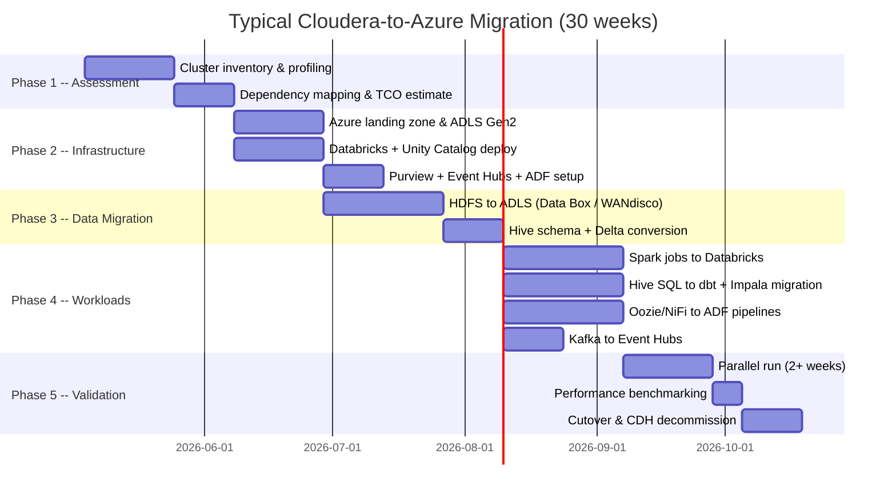

# Cloudera to Azure Migration Center

**The definitive resource for migrating from Cloudera CDH/CDP to Microsoft Azure, Databricks, and CSA-in-a-Box.**

---

## Who this is for

This migration center serves CDOs, data platform architects, data engineers, Hadoop administrators, and analytics leaders who are evaluating or executing a migration from Cloudera CDH 6.x, CDP Private Cloud, or CDP Public Cloud to Azure-native services. Whether you are responding to CDH end-of-life, escalating CDP renewal costs, or a strategic pivot toward cloud-native analytics, these resources provide the evidence, patterns, and step-by-step guidance to execute confidently.

---

## Quick-start decision matrix

| Your situation                         | Start here                                              |
| -------------------------------------- | ------------------------------------------------------- |
| Executive evaluating Azure vs Cloudera | [Why Azure over Cloudera](why-azure-over-cloudera.md)   |
| Need cost justification for migration  | [Total Cost of Ownership Analysis](tco-analysis.md)     |
| Need a feature-by-feature comparison   | [Complete Feature Mapping](feature-mapping-complete.md) |
| Ready to plan a migration              | [Migration Playbook](../cloudera-to-azure.md)           |
| Running Impala workloads               | [Impala Migration Guide](impala-migration.md)           |
| Running NiFi data flows                | [NiFi Migration Guide](nifi-migration.md)               |
| Using CDP Data Engineering / CML       | [CDP Data Engineering Guide](cdp-data-engineering.md)   |
| Want hands-on tutorials                | [Tutorials](#tutorials)                                 |
| Need performance data                  | [Benchmarks](benchmarks.md)                             |
| Need migration best practices          | [Best Practices](best-practices.md)                     |

---

## Strategic resources

These documents provide the business case, cost analysis, and strategic framing for decision-makers.

| Document                                              | Audience                   | Description                                                                                                                                                        |
| ----------------------------------------------------- | -------------------------- | ------------------------------------------------------------------------------------------------------------------------------------------------------------------ |
| [Why Azure over Cloudera](why-azure-over-cloudera.md) | CIO / CDO / Board          | Executive brief covering CDH end-of-life urgency, managed-service advantages, talent availability, AI/ML capabilities, and honest assessment of Cloudera strengths |
| [Total Cost of Ownership Analysis](tco-analysis.md)   | CFO / CIO / Procurement    | Detailed pricing model comparison across CDH on-prem, CDP Private Cloud, and CDP Public Cloud vs Azure consumption model, with 5-year projections                  |
| [Benchmarks & Performance](benchmarks.md)             | CTO / Platform Engineering | Spark performance, Impala vs Databricks SQL, NiFi vs ADF throughput, cost efficiency, and operational overhead comparisons                                         |

---

## Technical references

| Document                                                | Description                                                                                                                                                    |
| ------------------------------------------------------- | -------------------------------------------------------------------------------------------------------------------------------------------------------------- |
| [Complete Feature Mapping](feature-mapping-complete.md) | 40+ Cloudera components mapped to Azure equivalents with migration complexity ratings, from HDFS and Hive through NiFi, Ranger, Atlas, CML, and CDE            |
| [Migration Playbook](../cloudera-to-azure.md)           | The original end-to-end migration playbook with component mapping, phased plan, HDFS/Hive/Spark/Oozie migration, security conversion, and validation framework |

---

## Component migration guides

Domain-specific deep dives covering the components that require specialized migration approaches beyond the core playbook.

| Guide                                           | Cloudera component           | Azure destination                                   |
| ----------------------------------------------- | ---------------------------- | --------------------------------------------------- |
| [Impala Migration](impala-migration.md)         | Impala, Kudu                 | Databricks SQL, Delta Lake, Fabric SQL endpoint     |
| [NiFi Migration](nifi-migration.md)             | Apache NiFi, NiFi Registry   | Azure Data Factory, Logic Apps, ADF Git integration |
| [CDP Data Engineering](cdp-data-engineering.md) | CDE, CML, CDP Data Warehouse | Databricks, Azure ML, Databricks SQL, Fabric        |

---

## Tutorials

Hands-on, step-by-step walkthroughs for common migration scenarios.

| Tutorial                                                              | Duration  | What you will build                                                                                                               |
| --------------------------------------------------------------------- | --------- | --------------------------------------------------------------------------------------------------------------------------------- |
| [NiFi Flow to ADF Pipeline](tutorial-nifi-to-adf.md)                  | 2-3 hours | Convert a NiFi data ingestion flow to an ADF pipeline with equivalent processors, error handling, and scheduling                  |
| [Impala Workload to Databricks SQL](tutorial-impala-to-databricks.md) | 2-3 hours | Migrate an Impala analytical workload to Databricks SQL with SQL conversion, Kudu-to-Delta conversion, and performance validation |

---

## Best practices & planning

| Document                            | Description                                                                                                                                             |
| ----------------------------------- | ------------------------------------------------------------------------------------------------------------------------------------------------------- |
| [Best Practices](best-practices.md) | Cluster-by-cluster migration strategy, CDP vs CDH differences, service decomposition, parallel-run patterns, decommission timelines, and team structure |

---

## How CSA-in-a-Box fits

CSA-in-a-Box is the **core migration destination** -- an Azure-native reference implementation providing Data Mesh, Data Fabric, and Data Lakehouse capabilities. For Cloudera migrations specifically, it provides:

- **ADLS Gen2 + OneLake** replacing HDFS with medallion architecture (bronze/silver/gold)
- **Databricks + dbt** replacing Hive, Spark on YARN, and Impala
- **Azure Data Factory** replacing Oozie, Sqoop, NiFi, and Flume
- **Event Hubs** replacing Kafka with wire-protocol compatibility
- **Purview + Unity Catalog** replacing Ranger and Atlas
- **Azure Monitor** replacing Cloudera Manager health checks
- **Infrastructure as Code** (Bicep across 4 Azure subscriptions)

---

## Migration timeline overview

---

## Cross-references

| Topic                                    | Document                                               |
| ---------------------------------------- | ------------------------------------------------------ |
| ADR: Databricks over OSS Spark           | `docs/adr/0002-databricks-over-oss-spark.md`           |
| ADR: Delta Lake over Iceberg and Parquet | `docs/adr/0003-delta-lake-over-iceberg-and-parquet.md` |
| ADR: Event Hubs over Kafka               | `docs/adr/0005-event-hubs-over-kafka.md`               |
| ADR: Purview over Atlas                  | `docs/adr/0006-purview-over-atlas.md`                  |
| ADR: ADF + dbt over Airflow              | `docs/adr/0001-adf-dbt-over-airflow.md`                |
| AWS to Azure migration                   | `docs/migrations/aws-to-azure.md`                      |
| GCP to Azure migration                   | `docs/migrations/gcp-to-azure.md`                      |
| Hadoop/Hive migration                    | `docs/migrations/hadoop-hive.md`                       |
| OSS migration playbook                   | `docs/guides/oss-migration-playbook.md`                |

---

**Last updated:** 2026-04-30
**Maintainers:** CSA-in-a-Box core team
