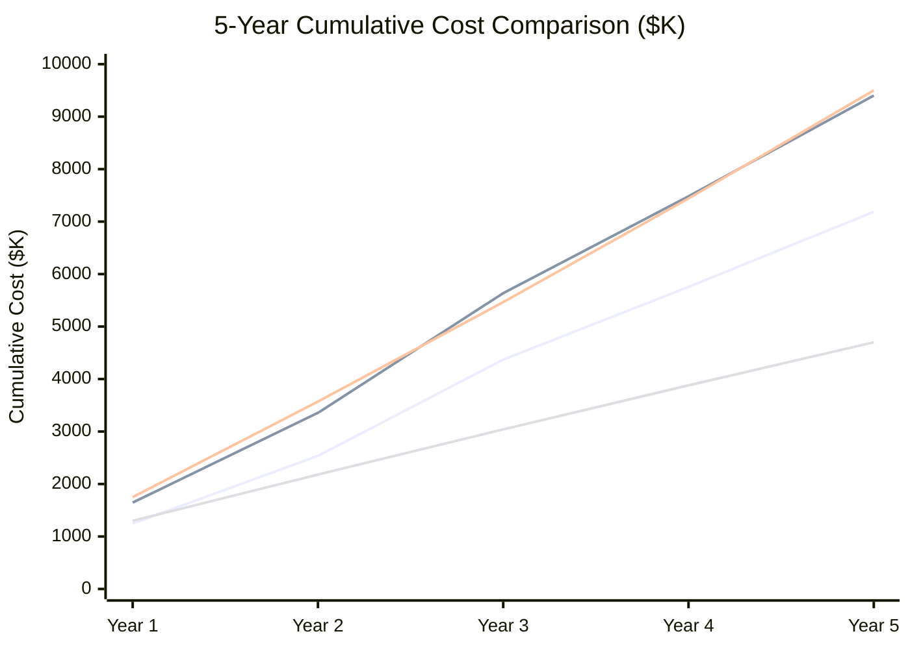

# Total Cost of Ownership: Cloudera vs Azure

**A detailed financial analysis for CFOs, CIOs, and procurement teams evaluating the cost implications of migrating from Cloudera CDH or CDP to Microsoft Azure.**

---

## Executive summary

Cloudera's cost model -- whether CDH on-premises licensing plus hardware, CDP Private Cloud subscription plus infrastructure, or CDP Public Cloud subscription plus cloud infrastructure -- creates fixed-cost structures that penalize idle capacity and scale linearly with cluster size. Azure's consumption-based model scales with actual workload intensity, not provisioned capacity, producing 40-60% cost reductions at comparable scale for most enterprise deployments. This analysis provides detailed breakdowns across all three Cloudera deployment models and a 5-year projection.

---

## Pricing model comparison

### CDH on-premises pricing structure

CDH pricing combines Cloudera Enterprise licensing with self-managed hardware:

| Component                      | Typical cost                      | Notes                                                            |
| ------------------------------ | --------------------------------- | ---------------------------------------------------------------- |
| Cloudera Enterprise license    | $4,000-$6,000/node/year           | Per-node licensing; tiered discounts for large clusters          |
| Server hardware (per node)     | $8,000-$15,000 (3-year amortized) | DataNode: 12-24 HDD, 128-256 GB RAM, 2x CPU                      |
| Hardware refresh cycle         | Every 3-4 years                   | Full refresh of all nodes; budget for 25-33% annual amortization |
| Data center costs              | $1,500-$3,000/node/year           | Power, cooling, rack space, networking                           |
| Hadoop administration team     | $600K-$900K/year                  | 3-4 FTEs at $150K-$225K fully loaded                             |
| Network infrastructure         | $50K-$150K/year                   | Spine-leaf networking, 10GbE/25GbE, top-of-rack switches         |
| Backup / DR infrastructure     | $100K-$300K/year                  | Secondary cluster or HDFS snapshot infrastructure                |
| Cloudera professional services | $100K-$300K (initial)             | Implementation, tuning, training -- front-loaded                 |

**Total for a 50-node CDH cluster (typical mid-market):**

| Line item                                     | Annual cost    |
| --------------------------------------------- | -------------- |
| Cloudera license (50 nodes x $5,000)          | $250,000       |
| Hardware amortization (50 x $12,000 / 3.5 yr) | $171,000       |
| Data center (50 x $2,000)                     | $100,000       |
| Hadoop admin team (3 FTE)                     | $525,000       |
| Network + backup                              | $200,000       |
| **Annual total**                              | **$1,246,000** |

### CDP Private Cloud pricing structure

CDP Private Cloud replaces CDH but adds capabilities at higher license cost:

| Component                      | Typical cost             | Notes                                                       |
| ------------------------------ | ------------------------ | ----------------------------------------------------------- |
| CDP Private Cloud Base license | $6,000-$10,000/node/year | Higher than CDH; includes Data Hub, CML, CDE entitlements   |
| CDP Data Engineering add-on    | $2,000-$4,000/node/year  | CDE virtual clusters, Airflow, Spark management             |
| CDP Machine Learning add-on    | $3,000-$5,000/node/year  | CML sessions, model serving, experiments                    |
| Hardware or IaaS VMs           | $8,000-$15,000/node/year | Can run on-prem hardware or cloud VMs                       |
| OpenShift / Kubernetes infra   | $50K-$150K/year          | CDP Private Cloud requires container orchestration          |
| Administration team            | $500K-$800K/year         | 2-3 FTEs; slightly fewer than CDH due to CDE/CML management |

**Total for equivalent 50-node CDP Private Cloud deployment:**

| Line item                                                | Annual cost    |
| -------------------------------------------------------- | -------------- |
| CDP license (50 x $8,000 base + $3,000 CDE + $4,000 CML) | $750,000       |
| Hardware/VM amortization                                 | $171,000       |
| Data center / cloud IaaS                                 | $100,000       |
| Kubernetes infrastructure                                | $100,000       |
| Admin team (3 FTE)                                       | $525,000       |
| **Annual total**                                         | **$1,646,000** |

CDP Private Cloud is **32% more expensive** than CDH for comparable capability, primarily due to higher per-node licensing.

### CDP Public Cloud pricing structure

CDP Public Cloud runs Cloudera services on top of AWS, Azure, or GCP infrastructure:

| Component                       | Typical cost     | Notes                                          |
| ------------------------------- | ---------------- | ---------------------------------------------- |
| CDP Public Cloud subscription   | $500K-$1.5M/year | Consumption-based Cloudera Compute Units (CCU) |
| Underlying cloud infrastructure | $300K-$800K/year | EC2/Azure VMs, S3/ADLS storage, networking     |
| Data Engineering (CDE)          | Included in CCU  | Virtual clusters billed per CCU                |
| Machine Learning (CML)          | Included in CCU  | Sessions billed per CCU                        |
| Data Warehouse (CDW)            | Included in CCU  | Hive/Impala on cloud billed per CCU            |
| Administration team             | $300K-$500K/year | 1-2 FTEs; less than on-prem but still needed   |

**Total for comparable CDP Public Cloud deployment:**

| Line item                                 | Annual cost    |
| ----------------------------------------- | -------------- |
| CDP Public Cloud subscription             | $900,000       |
| Cloud infrastructure (Azure VMs, storage) | $500,000       |
| Admin team (2 FTE)                        | $350,000       |
| **Annual total**                          | **$1,750,000** |

The double-payment problem is visible: you pay Cloudera for the platform AND the cloud provider for the infrastructure.

---

## Azure pricing structure

Azure uses consumption-based pricing across all services:

| Component                          | Typical cost     | Notes                                                   |
| ---------------------------------- | ---------------- | ------------------------------------------------------- |
| Databricks (Jobs + SQL Warehouses) | $200K-$600K/year | DBU-based; clusters auto-scale and terminate when idle  |
| Azure Data Factory                 | $30K-$100K/year  | Per-pipeline-run; integration runtime hours             |
| ADLS Gen2 storage                  | $30K-$150K/year  | Per-GB; hot/cool/archive tiers; no replication overhead |
| Event Hubs                         | $20K-$80K/year   | Per-TU + per-event; Kafka-compatible                    |
| Purview                            | $20K-$80K/year   | Per-asset scanning and classification                   |
| Azure Monitor / Log Analytics      | $30K-$100K/year  | Per-GB ingestion                                        |
| Networking / Private Endpoints     | $20K-$50K/year   | Private link, DNS, NSGs                                 |
| Key Vault / Entra ID Premium       | $10K-$30K/year   | Secret management, conditional access                   |
| Power BI Pro / Premium             | $50K-$200K/year  | Per-user or per-capacity                                |
| Platform engineering team          | $300K-$500K/year | 1-2 FTEs focused on data products, not infrastructure   |

**Total for equivalent Azure-native deployment:**

| Line item                            | Annual cost                     |
| ------------------------------------ | ------------------------------- |
| Databricks                           | $400,000                        |
| ADF + Event Hubs + Purview           | $150,000                        |
| ADLS Gen2 + networking               | $100,000                        |
| Monitoring + security                | $60,000                         |
| Power BI                             | $100,000                        |
| Platform team (2 FTE)                | $350,000                        |
| **Annual total**                     | **$1,160,000** (gross)          |
| **With auto-scaling / idle savings** | **$750,000-$900,000** (typical) |

Auto-scaling savings are real and significant. Databricks clusters terminate when jobs complete. ADF charges nothing when no pipelines run. Event Hubs scales throughput units down during off-peak hours.

---

## Side-by-side comparison

| Cost dimension       | CDH on-prem      | CDP Private      | CDP Public            | Azure-native            |
| -------------------- | ---------------- | ---------------- | --------------------- | ----------------------- |
| **Annual total**     | $1,246K          | $1,646K          | $1,750K               | $750K-$900K             |
| **vs CDH baseline**  | --               | +32%             | +40%                  | **-28% to -40%**        |
| **Scales with**      | Nodes (fixed)    | Nodes (fixed)    | CCUs + infra          | Actual compute usage    |
| **Idle cost**        | 100% (always on) | 100% (always on) | 60-80% (some scaling) | 10-30% (auto-terminate) |
| **Hardware refresh** | Every 3-4 years  | Every 3-4 years  | None                  | None                    |
| **Platform team**    | 3-4 FTE          | 2-3 FTE          | 1-2 FTE               | 1-2 FTE                 |

---

## 5-year projection

### Assumptions

- 5% annual data growth (modest)
- CDH/CDP license costs increase 3-5% annually (Cloudera's historical pricing trajectory)
- Azure consumption increases 5% annually (data growth) but offset by 10-15% annual price reductions on compute (Azure's historical trajectory)
- One hardware refresh in year 3 for on-prem deployments
- Migration cost: $300K-$500K one-time (professional services + internal effort)

### 5-year cumulative cost

| Year                      | CDH on-prem         | CDP Private         | CDP Public       | Azure-native               |
| ------------------------- | ------------------- | ------------------- | ---------------- | -------------------------- |
| Year 0 (migration)        | --                  | --                  | --               | $400K (migration)          |
| Year 1                    | $1,246K             | $1,646K             | $1,750K          | $900K + $400K = $1,300K    |
| Year 2                    | $1,290K             | $1,710K             | $1,820K          | $880K                      |
| Year 3                    | $1,835K (+ refresh) | $2,280K (+ refresh) | $1,895K          | $860K                      |
| Year 4                    | $1,385K             | $1,845K             | $1,975K          | $840K                      |
| Year 5                    | $1,430K             | $1,920K             | $2,060K          | $820K                      |
| **5-year total**          | **$7,186K**         | **$9,401K**         | **$9,500K**      | **$4,700K**                |
| **5-year savings vs CDH** | --                  | -$2,215K (worse)    | -$2,314K (worse) | **+$2,486K (35% savings)** |

_Lines top to bottom: CDP Public Cloud, CDP Private Cloud, CDH on-prem, Azure-native._

---

## Hidden cost factors

### Costs that favor Azure migration

| Hidden cost                           | CDH/CDP impact                                                     | Azure impact                                       |
| ------------------------------------- | ------------------------------------------------------------------ | -------------------------------------------------- |
| **Opportunity cost of platform team** | 3-4 engineers maintaining Hadoop instead of building data products | 1-2 engineers building data products               |
| **Recruitment costs**                 | Hadoop talent is scarce; hiring takes 3-6 months at premium rates  | Azure talent pool is 50-100x larger                |
| **Compliance remediation**            | CDH EOL creates audit findings requiring remediation               | Azure services are patched automatically           |
| **Innovation velocity**               | New capabilities require cluster upgrades and testing              | New Azure services available immediately           |
| **Data gravity**                      | Data locked in HDFS; expensive to integrate with cloud AI services | Data in ADLS Gen2 accessible by all Azure services |
| **Hardware disposal**                 | Decommissioning costs for end-of-life hardware                     | No hardware to dispose of                          |

### Costs that favor staying on Cloudera

| Hidden cost            | Impact                                                                |
| ---------------------- | --------------------------------------------------------------------- |
| **Migration effort**   | $300K-$500K one-time; 6-9 months of engineering effort                |
| **Retraining**         | Team must learn Databricks, ADF, Azure tooling; budget $50K-$100K     |
| **UDF rewrite**        | Java Hive UDFs must be rewritten; budget 30% of workload migration    |
| **Parallel run**       | Running both systems during validation adds 2-4 months of double cost |
| **Risk of disruption** | Any migration carries execution risk; mitigate with phased approach   |

---

## FinOps best practices for Azure

Once migrated, apply these practices to keep Azure costs optimized:

1. **Reserved instances** for predictable Databricks workloads (30-50% discount)
2. **Spot instances** for fault-tolerant batch jobs (60-90% discount)
3. **Auto-termination** for all interactive Databricks clusters (default: 30 minutes)
4. **Storage lifecycle policies** to automatically tier cold data to cool/archive storage
5. **Databricks cluster policies** to prevent over-provisioning by development teams
6. **Azure Cost Management alerts** at 80% and 100% of budget thresholds
7. **Resource tagging** for cost attribution by team, project, and environment
8. **Serverless SQL** for intermittent query workloads (pay per query, not per cluster)

---

## Building the business case

### For the CFO

"Migrating from Cloudera to Azure will reduce our annual data platform spend by 35-45% over 5 years, eliminating $2.5M+ in cumulative costs. The migration pays for itself in 18 months. After migration, our cost structure scales with actual data processing, not provisioned hardware."

### For the CIO

"Azure migration eliminates our CDH end-of-life compliance risk, reduces our platform team's operational burden by 60%, and gives us access to AI/ML capabilities (Azure OpenAI, Copilot) that are unavailable on Cloudera without separate infrastructure."

### For the CTO

"The Azure-native architecture replaces 15+ Hadoop components with managed services, removes Kerberos and YARN management, and gives us lakehouse capabilities (Delta Lake, Unity Catalog, Photon) that Cloudera cannot match. Our engineers shift from infrastructure maintenance to data product development."

---

## Next steps

1. **Use the [Azure TCO Calculator](https://azure.microsoft.com/pricing/tco/calculator/)** with your actual cluster inventory
2. **Review the [Migration Playbook](../cloudera-to-azure.md)** for phased planning
3. **Read the [Benchmarks](benchmarks.md)** for performance comparison data
4. **Engage Microsoft FastTrack** for a free migration assessment

---

**Last updated:** 2026-04-30
**Maintainers:** CSA-in-a-Box core team
