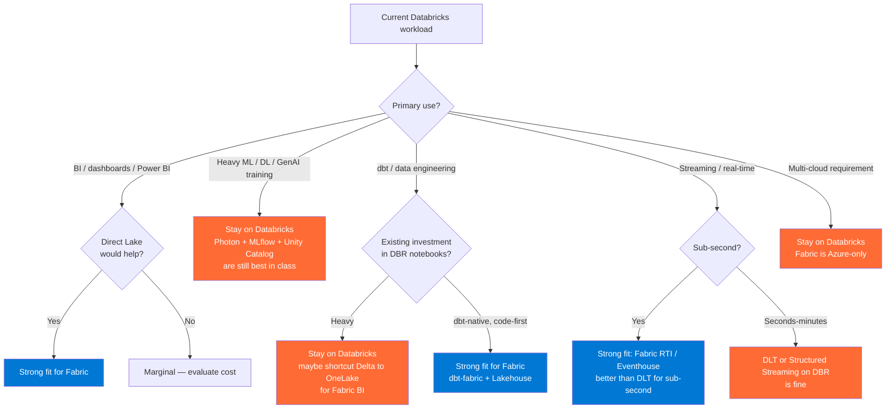
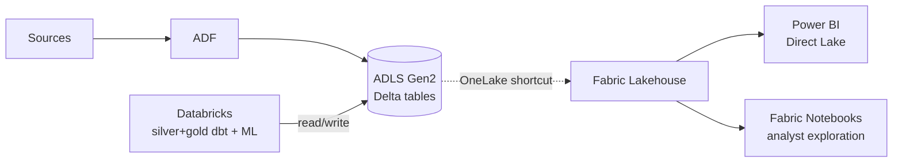

# Migration — Databricks → Microsoft Fabric

> **Audience:** Teams running Databricks (on AWS, Azure, GCP, or on-prem) considering Microsoft Fabric as the strategic forward path. **This is not a "rip and replace" guide** — it's a phased migration that keeps Databricks for what it's best at (heavy ML, multi-cloud) and moves BI-first workloads to Fabric.

## Decide first: should you migrate?

**Most enterprise patterns are hybrid** — keep Databricks, add Fabric, OneLake-shortcut between them. Don't fall into the "must pick one" trap.

## Phase 1 — Assessment (2-4 weeks)

### Inventory

For each existing Databricks workspace, catalog:

- **Notebooks**: count, last-run, owner, primary user
- **Jobs**: count, schedule, runtime, downstream consumers
- **Delta tables**: size, partition strategy, refresh cadence, downstream usage
- **Unity Catalog metastore**: catalogs, schemas, RBAC, lineage
- **Compute**: cluster types, DBUs/month, photon usage, runtime version
- **Power BI integration**: # semantic models using DBR SQL endpoint
- **Cost**: DBUs by SKU + cloud infra cost + storage

Output: a spreadsheet (one row per workload) with **migration tier**:

| Tier | Description | Action |
|------|-------------|--------|
| **A** Migrate now | Pure BI, dbt-native, Direct Lake would help | Move in Wave 1 |
| **B** Migrate later | Mixed BI/ML, schedule allows | Move in Wave 2-3 |
| **C** Hybrid | ML stays DBR, BI surfaces in Fabric via OneLake shortcut | Wave 1 (shortcut only) |
| **D** Keep on Databricks | Heavy ML / multi-cloud / Photon-dependent | No move; possibly add OneLake shortcut for downstream BI |

### Cost modeling

Map current spend to Fabric capacity SKU. Rule of thumb:

| Current DBR spend | Likely Fabric capacity |
|-------------------|------------------------|
| <$1,000/mo | F2 (~$260/mo) — but evaluate if F-SKU "always on" makes sense |
| $1,000-5,000/mo | F8-F16 |
| $5,000-20,000/mo | F32-F64 |
| $20,000-100,000/mo | F128-F512 |
| >$100,000/mo | F1024-F2048 + reserved capacity discount |

Fabric's **smoothing** (24-hour averaging of capacity usage) often makes a smaller SKU work than naive sizing suggests. Pilot with F-SKU one tier smaller than your initial estimate.

## Phase 2 — Design (2-3 weeks)

### Target architecture decisions

| Question | Default answer |
|----------|----------------|
| OneLake or shortcut to existing ADLS? | **Shortcut** — keeps Delta files in place, avoids data movement, allows Databricks + Fabric to share storage |
| Lakehouse or Warehouse? | **Lakehouse** for most cases; Warehouse only if you need T-SQL DW-style features (proc, identity, etc.) |
| Notebooks (PySpark) → Fabric notebooks or dbt? | **dbt** for transformations, **Fabric notebooks** for ad-hoc + ML. Avoid migrating notebook spaghetti as-is |
| Unity Catalog → Fabric workspace RBAC + Purview | Fabric workspace roles + Purview classifications. Unity Catalog has **no direct equivalent**; document the mapping carefully |
| Power BI semantic models → Direct Lake or Import? | **Direct Lake** for any new semantic model >100MB; **Import** stays for existing models with complex DAX or aggregations |

### OneLake shortcut pattern (keeps DBR running)

Both engines read the same Delta files. Writes still happen from Databricks. Power BI / analysts use Fabric. **No data duplication.**

## Phase 3 — Migration (4-12 weeks per wave)

### Wave 1 — Add Fabric BI surface (no Databricks changes)

1. Provision Fabric capacity (start small — F8 or F16)
2. Create a Fabric workspace; assign to the capacity
3. Create a Lakehouse with **OneLake shortcuts** to your existing ADLS Delta tables
4. Migrate the highest-value Power BI semantic model to Direct Lake
5. Validate row counts, query results, refresh latency
6. Repoint Power BI consumers; keep DBR SQL endpoint alive as fallback for 2-4 weeks
7. Decommission DBR SQL endpoint for that semantic model

This wave does **not** touch Databricks notebooks, jobs, or compute. It adds a parallel BI surface.

### Wave 2 — Migrate transformations to dbt-fabric (or keep dbt-databricks)

If you're already on dbt:
- Add the `dbt-fabric` adapter
- Most models transfer with **minor SQL dialect adjustments** (T-SQL flavor for Fabric Warehouse; Spark SQL flavor for Fabric Lakehouse Spark)
- Run dbt against both targets in parallel; reconcile output

If you have notebook-heavy transformations:
- **Don't** lift-and-shift notebooks to Fabric — convert to dbt models or Fabric SQL pipelines
- Notebook spaghetti is the source of much DBR cost; Fabric isn't going to magically fix that

### Wave 3 — Decide what stays on Databricks

Most enterprises end up with a stable hybrid:

- **Databricks**: heavy ML training, MLflow registry, real-time inference at scale, multi-cloud reads
- **Fabric**: BI semantic models (Direct Lake), Power BI, ad-hoc analyst SQL, RTI for streaming gold
- **Shared**: Delta tables in ADLS, exposed to both via OneLake shortcuts

This is **not a failure** — it's the right end state for any mature enterprise.

## Phase 4 — Cutover (1-2 weeks per workload)

For each workload migrated:

- [ ] Parallel run Databricks + Fabric for 2 weeks; reconcile output daily
- [ ] Switch consumers (Power BI, downstream APIs, dbt downstream models)
- [ ] Reduce Databricks compute for that workload (cluster autoscale floor → 0)
- [ ] Verify cost reduction in next billing cycle
- [ ] Remove Databricks job schedule for that workload

## Phase 5 — Decommission (per workload)

- [ ] Confirm zero references in monitoring queries / runbooks / dashboards
- [ ] Archive Databricks notebook revisions to git (if not already)
- [ ] Delete cluster definitions
- [ ] Update [`Migrations/README.md`](README.md) with what was migrated and what wasn't

## Common pitfalls

| Pitfall | Mitigation |
|---------|------------|
| **Trying to forklift notebooks** | Convert to dbt + Fabric SQL pipelines; don't migrate notebook spaghetti |
| **Underestimating Unity Catalog migration** | UC has no direct Fabric equivalent; plan workspace role + Purview classification mapping early |
| **Sizing F-capacity by current DBR DBU spend** | Smoothing changes the math; pilot with smaller capacity first |
| **Migrating ML training to Fabric Spark** | Fabric Spark is forked-OSS, not Photon. Heavy ML training stays on Databricks for now |
| **Cutting over Power BI without parallel run** | Direct Lake behavior differs from Import in subtle ways (no aggregations table fallback). Always parallel-run |
| **Ignoring Photon dependency** | Photon-dependent queries can be 5-10x slower without it; benchmark before assuming Fabric Spark is equivalent |
| **Forgetting Gov customers** | Fabric is **pre-GA in Azure Government**. Hold those workloads on Databricks/Synapse until Gov GA |

## Trade-offs

✅ **Why migrate**
- Direct Lake is genuinely better than DBR + Power BI Import for semantic models
- Capacity-based pricing is predictable; smoothing helps spiky workloads
- One vendor for BI + lakehouse + RTI + Power BI = simpler ops
- OneLake unifies storage even before you migrate transformations

⚠️ **Why hybrid (don't go all-in)**
- Photon ML / Spark ML / GenAI training is best on Databricks
- Multi-cloud requires Databricks
- Mature MLflow + Unity Catalog is hard to replicate on Fabric today
- Azure Government is not yet a Fabric option

## Related

- [Reference Architecture — Fabric vs Synapse vs Databricks](../reference-architecture/fabric-vs-synapse-vs-databricks.md)
- [ADR 0010 — Fabric Strategic Target](../adr/0010-fabric-strategic-target.md)
- [ADR 0002 — Databricks over OSS Spark](../adr/0002-databricks-over-oss-spark.md)
- [Patterns — Power BI & Fabric Roadmap](../patterns/power-bi-fabric-roadmap.md)
- [Migrations — Snowflake](snowflake.md) — similar phased approach
- Microsoft Fabric migration guide: https://learn.microsoft.com/fabric/get-started/fabric-trial
