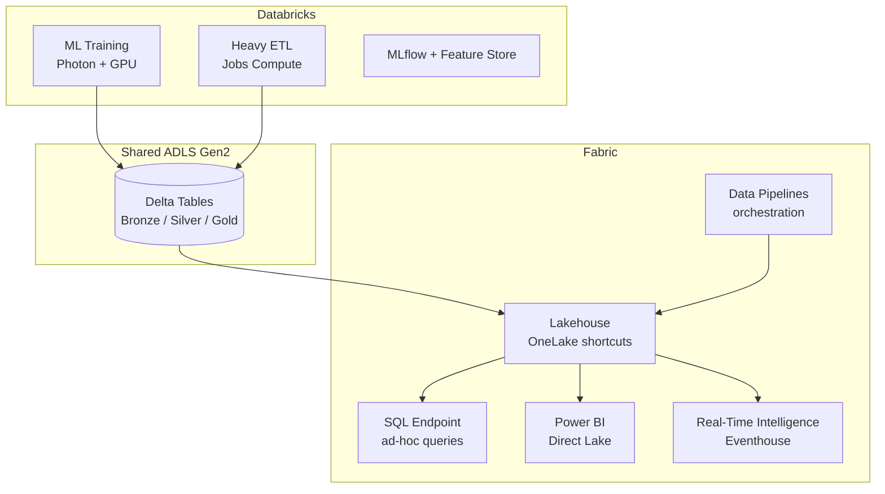

# Best Practices — Databricks to Fabric Migration

**Status:** Authored 2026-04-30
**Audience:** Migration leads, platform engineers, and architects executing a Databricks-to-Fabric migration or building a hybrid Databricks + Fabric architecture.
**Scope:** Hybrid strategy patterns, workspace mapping, capacity planning, notebook conversion checklist, common pitfalls, and operational runbook.

---

## 1. Hybrid Databricks + Fabric strategy

### 1.1 Why hybrid is the default recommendation

Most enterprises should not attempt a full Databricks-to-Fabric migration. Instead, adopt a hybrid architecture where each platform handles what it does best:

| Platform       | Owns                                                          | Reason                                                        |
| -------------- | ------------------------------------------------------------- | ------------------------------------------------------------- |
| **Databricks** | Heavy ML training, Photon-dependent ETL, multi-cloud reads    | GPU clusters, MLflow, Photon performance                      |
| **Fabric**     | BI semantic models, Power BI, ad-hoc SQL, real-time analytics | Direct Lake, Eventhouse, single capacity billing              |
| **Shared**     | Delta tables in ADLS Gen2                                     | OneLake shortcuts enable both platforms to read the same data |

### 1.2 Hybrid architecture reference



### 1.3 Integration points

| Integration                     | Mechanism                                        | Notes                                                               |
| ------------------------------- | ------------------------------------------------ | ------------------------------------------------------------------- |
| Databricks writes, Fabric reads | OneLake shortcut to ADLS                         | Zero-copy; Fabric reads Delta files written by Databricks           |
| Fabric writes, Databricks reads | Databricks external location on ADLS (same path) | Both engines write to shared ADLS; coordinate schema changes        |
| Metadata sync                   | Document table schemas; no auto-sync             | Unity Catalog and OneLake metadata are separate; keep a mapping doc |
| Lineage                         | Purview scans both (with connectors)             | Purview has connectors for Databricks and Fabric                    |
| Authentication                  | Shared Entra ID (Azure AD)                       | Same service principals work for both                               |

### 1.4 What to migrate first

Prioritize workloads by ROI:

| Priority          | Workload                                         | ROI driver                             |
| ----------------- | ------------------------------------------------ | -------------------------------------- |
| **1 (Week 1-2)**  | Power BI semantic models (Import -> Direct Lake) | Eliminate DBSQL cost + refresh compute |
| **2 (Week 3-4)**  | Ad-hoc SQL analytics                             | Eliminate DBSQL warehouse idle cost    |
| **3 (Week 5-8)**  | dbt transformations (if SQL-first)               | Simpler ops, lower CU cost             |
| **4 (Week 8-12)** | Streaming analytics (DLT -> RTI)                 | Lower latency, lower cost              |
| **5 (Ongoing)**   | PySpark notebooks (case-by-case)                 | Evaluate per-notebook                  |
| **Never**         | ML training (keep on Databricks)                 | Photon, GPU, MLflow maturity           |

---

## 2. Workspace mapping

### 2.1 Databricks-to-Fabric workspace mapping patterns

**Pattern A: 1-to-1 (simple)**

One Databricks workspace maps to one Fabric workspace:

```
Databricks: production-workspace  -->  Fabric: Production-Analytics
Databricks: development-workspace -->  Fabric: Development-Analytics
```

Best for: Small teams, single-project organizations.

**Pattern B: Catalog-to-workspace (recommended)**

Unity Catalog catalogs map to Fabric workspaces:

```
UC catalog: production  -->  Fabric workspace: Production
UC catalog: development -->  Fabric workspace: Development
UC catalog: staging     -->  Fabric workspace: Staging
```

Best for: Organizations using UC for environment isolation.

**Pattern C: Domain-to-workspace (enterprise)**

Business domains map to separate workspaces:

```
UC catalog: finance     -->  Fabric workspace: Finance-Analytics
UC catalog: marketing   -->  Fabric workspace: Marketing-Analytics
UC catalog: operations  -->  Fabric workspace: Operations-Analytics
```

Best for: Large enterprises with domain-driven data ownership.

### 2.2 Workspace naming conventions

| Convention               | Example                  | Notes                                 |
| ------------------------ | ------------------------ | ------------------------------------- |
| `{Domain}-{Environment}` | `Finance-Production`     | Clear domain + environment separation |
| `{Team}-{Purpose}`       | `DataEng-ETL`            | Team-oriented                         |
| `{Project}-{Tier}`       | `CustomerAnalytics-Gold` | Medallion-tier separation             |

Recommendation: Use `{Domain}-{Environment}` for production workspaces and `{Team}-{Purpose}` for development.

### 2.3 Lakehouse vs Warehouse decision

| Use case                    | Choose Lakehouse            | Choose Warehouse                |
| --------------------------- | --------------------------- | ------------------------------- |
| Delta table storage         | Yes                         | No                              |
| PySpark notebooks           | Yes                         | No                              |
| Direct Lake semantic models | Yes                         | No (Warehouse uses DirectQuery) |
| T-SQL stored procedures     | No                          | Yes                             |
| Column-level security       | No                          | Yes                             |
| Row-level security          | No (use PBI RLS)            | Yes                             |
| Cross-database queries      | Via shortcuts               | Via cross-database SQL          |
| dbt target                  | Either (different adapters) | Either                          |

**Default recommendation:** Use Lakehouse for most workloads. Use Warehouse only when you need T-SQL compatibility or fine-grained SQL security.

---

## 3. Capacity planning

### 3.1 Sizing methodology

1. **Measure current Databricks usage:** Export 3 months of DBU consumption from `system.billing.usage`
2. **Identify peak and average:** Calculate peak hour and 24-hour average
3. **Apply smoothing factor:** Fabric smoothing averages CU over 24 hours; this usually means you need a smaller SKU than peak suggests
4. **Start one tier lower:** Fabric capacity can be scaled up in minutes; start conservatively
5. **Monitor and adjust:** Use the Fabric Capacity Metrics app for the first 2-4 weeks

### 3.2 Sizing reference

| Current Databricks monthly spend | Starting Fabric SKU | Notes                                      |
| -------------------------------- | ------------------- | ------------------------------------------ |
| < $1,000                         | F2 - F4             | Validate if always-on capacity makes sense |
| $1,000 - $5,000                  | F8 - F16            | Good starting point for small teams        |
| $5,000 - $20,000                 | F16 - F64           | Most mid-size analytics teams              |
| $20,000 - $50,000                | F64 - F128          | Includes Power BI Premium (F64+)           |
| $50,000 - $100,000               | F128 - F256         | Large enterprise, many concurrent users    |
| > $100,000                       | F256 - F1024        | Enterprise scale; use reserved capacity    |

### 3.3 Capacity management best practices

| Practice                               | Description                                               |
| -------------------------------------- | --------------------------------------------------------- |
| **Separate dev and prod capacities**   | Dev capacity can be paused nights/weekends; prod stays on |
| **Reserve base, burst with PAYG**      | Reserve capacity for steady-state; use PAYG for spikes    |
| **Monitor smoothing utilization**      | If 24-hour average exceeds 80% of capacity, scale up      |
| **Schedule batch jobs to spread load** | Distribute jobs across the day to flatten peaks           |
| **Pause dev capacity on weekends**     | Automate with Azure Automation or Logic App               |
| **Use F-SKU autoscale (if available)** | Some F-SKUs support autoscale; enable for spiky workloads |

---

## 4. Notebook conversion checklist

Use this checklist for every notebook being migrated:

### Pre-migration assessment

- [ ] **Classify notebook:** ETL (migrate), ML training (keep on DBR), ad-hoc (migrate), DLT (convert to dbt)
- [ ] **Count lines of code:** <200 lines = simple, 200-500 = moderate, >500 = complex (consider rewriting)
- [ ] **Identify languages:** PySpark (migrate), SQL (migrate or convert to dbt), Scala (rewrite in PySpark), R (migrate)
- [ ] **List dependencies:** External libraries, internal %run references, dbutils calls
- [ ] **Identify data sources:** ADLS mounts, Unity Catalog tables, DBFS paths
- [ ] **Check Photon dependency:** Run without Photon on Databricks first; note performance difference

### Migration execution

- [ ] **Create Fabric environment** with required libraries
- [ ] **Replace dbutils** with mssparkutils (see [notebook-migration.md](notebook-migration.md))
- [ ] **Update file paths** from `/mnt/` to OneLake paths
- [ ] **Update table references** from `catalog.schema.table` to Lakehouse tables
- [ ] **Remove Databricks-specific configs** (`spark.databricks.*`)
- [ ] **Convert Scala cells** to PySpark
- [ ] **Replace %sql magic** with SQL cell type
- [ ] **Test interactively** in Fabric notebook
- [ ] **Validate output** against Databricks (row counts, schema, sample data)

### Post-migration

- [ ] **Schedule via Data Pipeline** (replace Databricks Workflow)
- [ ] **Set up monitoring** (pipeline alerts, run history)
- [ ] **Update downstream consumers** (Power BI, APIs, other notebooks)
- [ ] **Run parallel** for 2 weeks
- [ ] **Decommission Databricks notebook** (archive to Git, disable job)

---

## 5. Common pitfalls and mitigations

### 5.1 Technical pitfalls

| Pitfall                                 | Impact                                   | Mitigation                                                            |
| --------------------------------------- | ---------------------------------------- | --------------------------------------------------------------------- |
| **Lift-and-shift notebook spaghetti**   | Moves complexity without improving it    | Refactor: convert to dbt models, modular notebooks, or Data Pipelines |
| **Assuming Fabric Spark = Photon**      | 2-3x slower for Photon-dependent queries | Benchmark first; keep Photon workloads on Databricks                  |
| **Hardcoded paths (/mnt/, dbfs:/)**     | Notebooks fail on Fabric                 | Audit and replace all paths before migration                          |
| **Missing Scala support**               | Scala cells fail; notebook is broken     | Rewrite Scala code in PySpark before migration                        |
| **Init script dependencies**            | System-level packages unavailable        | Use Fabric environments for library management                        |
| **Databricks Connect workflows**        | No direct replacement                    | Use Fabric REST API, VS Code for Fabric, or JDBC                      |
| **Unity Catalog column-level security** | Not available on Lakehouse               | Route sensitive tables to Fabric Warehouse                            |
| **DLT expectations lost**               | Quality checks disappear silently        | Convert to dbt tests with `store_failures: true`                      |

### 5.2 Organizational pitfalls

| Pitfall                         | Impact                                 | Mitigation                                             |
| ------------------------------- | -------------------------------------- | ------------------------------------------------------ |
| **"All or nothing" migration**  | Delays value; risks failure            | Migrate BI first (weeks), then incrementally           |
| **No parallel run period**      | Data discrepancies go undetected       | Always run both platforms for 2+ weeks                 |
| **Skipping capacity trial**     | Over- or under-provisioned             | Run a 60-day Fabric trial before committing            |
| **Forgetting Power BI team**    | Report migration bottleneck            | Involve PBI developers from Phase 1                    |
| **Ignoring training**           | Teams struggle with new platform       | Budget 1-2 weeks of Fabric training per team           |
| **Not documenting the mapping** | Knowledge loss, inconsistent migration | Maintain a living spreadsheet of UC -> Fabric mappings |

### 5.3 Cost pitfalls

| Pitfall                               | Impact                         | Mitigation                                                        |
| ------------------------------------- | ------------------------------ | ----------------------------------------------------------------- |
| **Sizing Fabric by peak DBR usage**   | Over-provisioned, wasted spend | Use smoothed 24-hour average for sizing                           |
| **Forgetting to decommission DBR**    | Paying for both platforms      | Set decommission dates per workload; track in the migration plan  |
| **Not using reserved capacity**       | 20-40% more expensive          | Commit to reserved for base capacity after trial                  |
| **Running Spark notebooks 24/7**      | CU consumed continuously       | Use Data Pipelines for scheduled runs, not long-running notebooks |
| **Ignoring Power BI Premium savings** | Missing a major cost reduction | Verify PBI Premium is included in F64+ before sizing              |

---

## 6. Operational runbook

### 6.1 Day-to-day operations comparison

| Operation          | Databricks                       | Fabric                                        |
| ------------------ | -------------------------------- | --------------------------------------------- |
| Start compute      | Start cluster (3-7 min)          | Start Spark session (30-60s)                  |
| Scale compute      | Resize cluster (add nodes)       | Scale capacity SKU (minutes)                  |
| Monitor jobs       | Databricks UI > Workflows        | Fabric monitoring hub                         |
| Monitor costs      | Account console > Usage          | Azure Cost Management + Capacity Metrics app  |
| Deploy changes     | Databricks Asset Bundles / Repos | Fabric Git integration + deployment pipelines |
| Manage permissions | Unity Catalog GRANT/REVOKE       | Workspace roles + Warehouse SQL               |
| Debug failures     | Cluster driver logs, Spark UI    | Spark UI (in notebook), monitoring hub        |
| Manage libraries   | Cluster libraries, %pip          | Fabric environments, %pip                     |

### 6.2 Monitoring setup

After migration, establish these monitoring practices:

1. **Fabric Capacity Metrics app** -- install from AppSource; monitors CU consumption
2. **Azure Monitor alerts** -- set alerts for capacity utilization > 80%
3. **Data Pipeline alerts** -- configure failure notifications for each pipeline
4. **dbt test dashboard** -- build Power BI report on `store_failures` audit tables
5. **OneLake storage monitoring** -- track storage growth via Azure portal
6. **Power BI usage metrics** -- monitor report views and refresh patterns

### 6.3 Rollback plan

If a migrated workload does not perform as expected:

1. **Immediate:** Re-enable the Databricks job/cluster (should not be deleted during parallel run)
2. **Repoint consumers:** Switch Power BI / downstream APIs back to DBSQL endpoint
3. **Investigate:** Compare benchmarks, identify performance gap
4. **Decide:** Optimize Fabric workload, increase capacity, or keep on Databricks
5. **Document:** Update the migration plan with lessons learned

---

## 7. Migration timeline template

| Week  | Activity                                               | Deliverable                 |
| ----- | ------------------------------------------------------ | --------------------------- |
| 1-2   | Assessment: inventory workloads, classify, map         | Migration spreadsheet       |
| 3     | Capacity trial: provision Fabric, run benchmarks       | Sizing recommendation       |
| 4     | Design: workspace mapping, security model              | Architecture doc            |
| 5-6   | Wave 1: OneLake shortcuts, first Direct Lake model     | First PBI report on Fabric  |
| 7-8   | Wave 2: Migrate ad-hoc SQL, simple notebooks           | Analysts using Fabric       |
| 9-12  | Wave 3: dbt transformations, DLT conversion            | Pipelines running on Fabric |
| 13-14 | Wave 4: Streaming workloads (if applicable)            | RTI / Eventhouse live       |
| 15-16 | Validation: parallel run, reconciliation               | Sign-off per workload       |
| 17-18 | Cutover: decommission Databricks per workload          | Cost reduction verified     |
| 19-20 | Optimization: capacity right-sizing, reserved purchase | Optimized steady state      |

---

## 8. Quick reference: key commands

### Fabric notebook commands

```python
# List files in OneLake
mssparkutils.fs.ls("Files/")

# Get secret from Key Vault
secret = mssparkutils.credentials.getSecret("keyvault-name", "secret-name")

# Get notebook parameter
param = mssparkutils.notebook.getParam("param_name", "default_value")

# Run another notebook
result = mssparkutils.notebook.run("other_notebook", timeout_seconds=300, parameters={"key": "value"})

# Exit with value
mssparkutils.notebook.exit("SUCCESS")
```

### Fabric REST API (common operations)

```bash
# List workspaces
curl -H "Authorization: Bearer $TOKEN" \
     "https://api.fabric.microsoft.com/v1/workspaces"

# List Lakehouse items
curl -H "Authorization: Bearer $TOKEN" \
     "https://api.fabric.microsoft.com/v1/workspaces/{workspace_id}/items?type=Lakehouse"

# Trigger notebook run
curl -X POST -H "Authorization: Bearer $TOKEN" \
     -H "Content-Type: application/json" \
     "https://api.fabric.microsoft.com/v1/workspaces/{workspace_id}/items/{notebook_id}/jobs/instances?jobType=RunNotebook"
```

---

## Related

- [Why Fabric over Databricks](why-fabric-over-databricks.md) -- strategic context
- [TCO Analysis](tco-analysis.md) -- cost modeling
- [Feature Mapping](feature-mapping-complete.md) -- capability comparison
- [Benchmarks](benchmarks.md) -- performance data for capacity planning
- [Notebook Migration](notebook-migration.md) -- detailed notebook conversion
- [Unity Catalog Migration](unity-catalog-migration.md) -- governance mapping
- [DLT Migration](dlt-migration.md) -- pipeline conversion
- [ML Migration](ml-migration.md) -- ML workload guidance
- [Streaming Migration](streaming-migration.md) -- real-time workload guidance
- [Parent guide: 5-phase migration](../databricks-to-fabric.md)
- Fabric documentation: <https://learn.microsoft.com/fabric/>

---

**Maintainers:** csa-inabox core team
**Source finding:** CSA-0083 (HIGH, XL) -- approved via AQ-0010 ballot B6
**Last updated:** 2026-04-30
