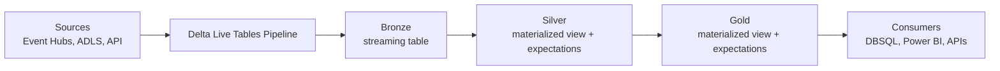
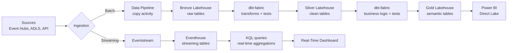

# Delta Live Tables Migration — Databricks to Fabric

**Status:** Authored 2026-04-30
**Audience:** Data engineers migrating Delta Live Tables (DLT) pipelines to Fabric Data Pipelines, dbt-fabric, and Real-Time Intelligence.
**Scope:** DLT pipeline patterns, expectations-to-tests mapping, streaming DLT migration, materialized views, pipeline monitoring, and orchestration.

---

## 1. Overview

Delta Live Tables (DLT) is Databricks' declarative data pipeline framework. It provides:

- **Declarative table definitions** -- define what a table should look like, not how to build it
- **Expectations** -- data quality rules that warn, drop, or fail on violations
- **Auto-managed infrastructure** -- DLT manages compute, retries, and checkpoints
- **Streaming + batch in one framework** -- same API for both
- **Materialized views and streaming tables** -- automatic incremental processing

Fabric does **not** have a direct DLT equivalent. The migration path depends on the workload type:

| DLT pattern                | Fabric target                                    | Why                                                                           |
| -------------------------- | ------------------------------------------------ | ----------------------------------------------------------------------------- |
| Batch DLT pipelines        | **dbt-fabric** + Fabric Data Pipelines           | dbt provides declarative SQL transforms; Data Pipelines provide orchestration |
| Streaming DLT tables       | **Fabric Real-Time Intelligence (RTI)**          | Eventhouse + Eventstream for sub-second streaming                             |
| DLT expectations (quality) | **dbt tests** + Great Expectations               | dbt tests replace DLT expectations                                            |
| DLT materialized views     | **Lakehouse tables** refreshed by dbt/notebooks  | Manual refresh via pipeline schedule                                          |
| DLT pipeline monitoring    | **Fabric monitoring hub** + Data Pipeline alerts | Pipeline-level monitoring                                                     |

---

## 2. Architecture comparison

### 2.1 Databricks DLT architecture



DLT manages the entire pipeline: ingestion, transformation, quality checks, incremental processing, and table management.

### 2.2 Fabric equivalent architecture



More components, but each is well-understood and independently testable.

---

## 3. Batch DLT to dbt-fabric

### 3.1 DLT table definition to dbt model

**Databricks DLT (Python):**

```python
import dlt

@dlt.table(
    comment="Cleaned customer records",
    table_properties={"quality": "silver"}
)
@dlt.expect_or_drop("valid_email", "email IS NOT NULL AND email LIKE '%@%'")
@dlt.expect_or_drop("valid_state", "LENGTH(state) = 2")
@dlt.expect("name_not_null", "name IS NOT NULL")
def customers_clean():
    return (
        dlt.read("raw_customers")
        .withColumn("email_lower", F.lower(F.col("email")))
        .withColumn("created_date", F.to_date(F.col("created_at")))
        .dropDuplicates(["customer_id"])
    )
```

**Databricks DLT (SQL):**

```sql
CREATE OR REFRESH LIVE TABLE customers_clean (
    CONSTRAINT valid_email EXPECT (email IS NOT NULL AND email LIKE '%@%') ON VIOLATION DROP ROW,
    CONSTRAINT valid_state EXPECT (LENGTH(state) = 2) ON VIOLATION DROP ROW,
    CONSTRAINT name_not_null EXPECT (name IS NOT NULL) ON VIOLATION FAIL UPDATE
)
COMMENT "Cleaned customer records"
AS SELECT
    customer_id,
    name,
    LOWER(email) AS email_lower,
    state,
    TO_DATE(created_at) AS created_date
FROM LIVE.raw_customers
```

**dbt-fabric equivalent:**

Model file `models/silver/customers_clean.sql`:

```sql
-- models/silver/customers_clean.sql
{{ config(
    materialized='table',
    description='Cleaned customer records'
) }}

SELECT DISTINCT
    customer_id,
    name,
    LOWER(email) AS email_lower,
    state,
    TO_DATE(created_at, 'yyyy-MM-dd') AS created_date
FROM {{ ref('raw_customers') }}
WHERE customer_id IS NOT NULL
```

Test file `tests/silver/test_customers_clean.yml`:

```yaml
# tests/silver/test_customers_clean.yml
version: 2

models:
    - name: customers_clean
      description: "Cleaned customer records"
      columns:
          - name: customer_id
            tests:
                - not_null
                - unique
          - name: email_lower
            tests:
                - not_null
                - dbt_utils.expression_is_true:
                      expression: "email_lower LIKE '%@%'"
                      config:
                          severity: error # equivalent to ON VIOLATION DROP ROW
          - name: state
            tests:
                - not_null
                - dbt_utils.expression_is_true:
                      expression: "LENGTH(state) = 2"
                      config:
                          severity: error
          - name: name
            tests:
                - not_null:
                      config:
                          severity: warn # equivalent to EXPECT (no drop)
```

### 3.2 DLT expectations to dbt tests mapping

| DLT expectation                       | dbt test equivalent                               | Behavior                          |
| ------------------------------------- | ------------------------------------------------- | --------------------------------- |
| `@dlt.expect("name", "expr")`         | `dbt test` with `severity: warn`                  | Log warning, keep row             |
| `@dlt.expect_or_drop("name", "expr")` | Pre-filter in model SQL + `severity: error` test  | Drop row in SQL, test validates   |
| `@dlt.expect_or_fail("name", "expr")` | `dbt test` with `severity: error` + `--fail-fast` | Fail pipeline on violation        |
| DLT quality metrics (% passing)       | dbt `store_failures` + custom macro               | Store test failures for reporting |

### 3.3 DLT incremental processing to dbt incremental

**DLT streaming table:**

```python
@dlt.table
def orders_incremental():
    return dlt.read_stream("raw_orders")
```

**dbt incremental model:**

```sql
-- models/silver/orders_incremental.sql
{{ config(
    materialized='incremental',
    unique_key='order_id',
    incremental_strategy='merge'
) }}

SELECT
    order_id,
    customer_id,
    order_date,
    amount,
    _metadata.file_modification_time AS ingested_at
FROM {{ ref('raw_orders') }}


WHERE ingested_at > (SELECT MAX(ingested_at) FROM {{ this }})

```

---

## 4. Streaming DLT to Fabric Real-Time Intelligence

### 4.1 When to use RTI vs Spark Structured Streaming

| Pattern                                  | Use RTI / Eventhouse        | Use Fabric Spark Structured Streaming |
| ---------------------------------------- | --------------------------- | ------------------------------------- |
| Sub-second analytics on streaming data   | Yes                         | No                                    |
| KQL-based querying and dashboards        | Yes                         | No                                    |
| Append-only event streams                | Yes                         | Yes                                   |
| Complex transformations (joins, windows) | Partial (KQL)               | Yes (Spark)                           |
| Writing to Delta tables                  | No (Eventhouse uses KQL DB) | Yes                                   |
| Integration with Power BI Real-Time      | Yes (native)                | No                                    |

### 4.2 DLT streaming to Eventstream + Eventhouse

**Databricks DLT streaming:**

```python
@dlt.table
def streaming_events():
    return (
        spark.readStream
        .format("eventhubs")
        .options(**eh_config)
        .load()
        .withColumn("body", F.col("body").cast("string"))
        .withColumn("parsed", F.from_json(F.col("body"), event_schema))
    )
```

**Fabric RTI equivalent:**

1. **Create an Eventstream** in the Fabric workspace
2. **Add Event Hubs source** -- connect to the same Event Hub
3. **Add Eventhouse destination** -- route events to a KQL database
4. **Define KQL table mapping** -- map JSON fields to table columns

```kql
// KQL: Define table in Eventhouse
.create table StreamingEvents (
    EventId: string,
    EventType: string,
    Timestamp: datetime,
    Payload: dynamic
)

// KQL: Create ingestion mapping
.create table StreamingEvents ingestion json mapping 'EventMapping'
    '[{"column":"EventId","path":"$.event_id","datatype":"string"},'
     '{"column":"EventType","path":"$.event_type","datatype":"string"},'
     '{"column":"Timestamp","path":"$.timestamp","datatype":"datetime"},'
     '{"column":"Payload","path":"$","datatype":"dynamic"}]'

// KQL: Query streaming data
StreamingEvents
| where Timestamp > ago(1h)
| summarize Count = count() by EventType, bin(Timestamp, 5m)
| render timechart
```

### 4.3 DLT streaming expectations to KQL

DLT expectations on streaming tables translate to KQL update policies:

```kql
// KQL: Create a filtered table (equivalent to expect_or_drop)
.create table CleanEvents (
    EventId: string,
    EventType: string,
    Timestamp: datetime,
    Amount: real
)

// Update policy that filters invalid records
.alter table CleanEvents policy update
    @'[{"Source": "StreamingEvents", '
       '"Query": "StreamingEvents | where isnotnull(EventId) and Amount > 0", '
       '"IsEnabled": true}]'
```

---

## 5. DLT materialized views to Fabric patterns

### 5.1 DLT materialized views

DLT materialized views auto-refresh when upstream data changes:

```python
@dlt.table
def daily_sales_summary():
    return (
        dlt.read("orders_clean")
        .groupBy("order_date", "product_category")
        .agg(F.sum("amount").alias("total_sales"), F.count("*").alias("order_count"))
    )
```

### 5.2 Fabric equivalents

| Approach                                | Freshness              | Effort | Best for                        |
| --------------------------------------- | ---------------------- | ------ | ------------------------------- |
| dbt model + scheduled run               | Minutes to hours       | Low    | Batch aggregations              |
| Fabric notebook + Data Pipeline trigger | Minutes                | Medium | Complex PySpark aggregations    |
| Lakehouse SQL view                      | Real-time (query-time) | Low    | Simple aggregations, small data |
| Power BI Direct Lake measure            | Real-time (query-time) | Low    | BI-layer aggregations           |

**dbt approach (recommended for batch):**

```sql
-- models/gold/daily_sales_summary.sql
{{ config(materialized='table') }}

SELECT
    order_date,
    product_category,
    SUM(amount) AS total_sales,
    COUNT(*) AS order_count
FROM {{ ref('orders_clean') }}
GROUP BY order_date, product_category
```

Schedule `dbt run` via a Fabric Data Pipeline on a cron schedule.

---

## 6. Pipeline monitoring migration

### 6.1 DLT monitoring

DLT provides:

- Pipeline event log (stored in Delta table)
- Data quality metrics (expectations pass/fail/drop counts)
- Pipeline lineage graph
- Run history with duration and status

### 6.2 Fabric monitoring equivalents

| DLT monitoring feature        | Fabric equivalent                                 |
| ----------------------------- | ------------------------------------------------- |
| Pipeline event log            | Data Pipeline run history (Fabric monitoring hub) |
| Expectation pass/fail metrics | dbt test results + `store_failures` table         |
| Pipeline lineage graph        | Fabric lineage view (workspace-level)             |
| Run history                   | Data Pipeline run history + Azure Monitor         |
| Alerting on failure           | Data Pipeline alerts + Data Activator             |

### 6.3 dbt test results for quality monitoring

```yaml
# dbt_project.yml
on-run-end:
    - "{{ dbt_utils.log_test_results() }}"

# Store test failures for dashboarding
vars:
    dbt_utils_dispatch_list: ["dbt_utils"]

# In schema.yml, enable store_failures:
models:
    - name: customers_clean
      columns:
          - name: email_lower
            tests:
                - not_null:
                      config:
                          store_failures: true
                          schema: audit
```

Failed rows are stored in `audit.not_null_customers_clean_email_lower`. Build a Power BI report on the audit schema for data quality dashboards.

---

## 7. Orchestration: DLT pipeline to Fabric Data Pipeline

### 7.1 DLT pipeline configuration

```json
{
    "name": "customer_pipeline",
    "target": "production",
    "continuous": false,
    "development": false,
    "clusters": [{ "label": "default", "num_workers": 4 }],
    "libraries": [{ "notebook": { "path": "/pipelines/customers" } }]
}
```

### 7.2 Fabric Data Pipeline equivalent

Create a Fabric Data Pipeline with the following activities:

1. **Notebook activity:** Run dbt transformations
2. **Set variable:** Capture dbt run result
3. **If condition:** Check for test failures
4. **Web activity:** Send Teams notification on failure
5. **Notebook activity:** Run downstream gold models

```json
{
    "name": "customer_pipeline",
    "activities": [
        {
            "name": "Run dbt bronze to silver",
            "type": "Notebook",
            "typeProperties": {
                "notebook": { "referenceName": "dbt_runner" },
                "parameters": {
                    "dbt_command": "dbt run --select tag:bronze_to_silver"
                }
            }
        },
        {
            "name": "Run dbt tests",
            "type": "Notebook",
            "dependsOn": [
                {
                    "activity": "Run dbt bronze to silver",
                    "conditions": ["Succeeded"]
                }
            ],
            "typeProperties": {
                "notebook": { "referenceName": "dbt_runner" },
                "parameters": {
                    "dbt_command": "dbt test --select tag:bronze_to_silver"
                }
            }
        },
        {
            "name": "Run dbt silver to gold",
            "type": "Notebook",
            "dependsOn": [
                { "activity": "Run dbt tests", "conditions": ["Succeeded"] }
            ],
            "typeProperties": {
                "notebook": { "referenceName": "dbt_runner" },
                "parameters": {
                    "dbt_command": "dbt run --select tag:silver_to_gold"
                }
            }
        }
    ]
}
```

---

## 8. Migration execution checklist

### Per DLT pipeline

- [ ] **Classify pipeline type:** batch-only, streaming-only, or mixed
- [ ] **Export DLT pipeline definition** (JSON config + notebook source)
- [ ] **For batch tables:** Convert to dbt models (see section 3)
- [ ] **For streaming tables:** Evaluate RTI vs Spark Structured Streaming (see section 4)
- [ ] **Convert DLT expectations** to dbt tests or KQL update policies
- [ ] **Create Fabric Data Pipeline** for orchestration (see section 7)
- [ ] **Set up monitoring** -- pipeline alerts, dbt test reporting
- [ ] **Parallel run** -- run DLT and Fabric pipeline simultaneously for 2+ weeks
- [ ] **Reconcile outputs** -- compare row counts, aggregates, quality metrics
- [ ] **Cutover** -- disable DLT pipeline, update downstream consumers
- [ ] **Decommission** -- archive DLT notebook, remove DLT pipeline definition

---

## 9. Common pitfalls

| Pitfall                                     | Mitigation                                                                                   |
| ------------------------------------------- | -------------------------------------------------------------------------------------------- |
| Trying to replicate DLT's declarative model | Accept that dbt + Data Pipelines is a different paradigm; it is well-understood and testable |
| Losing quality metric history               | Store dbt test failures in audit tables; build dashboards                                    |
| Ignoring DLT's auto-optimization            | Fabric auto-compacts and V-Orders, but verify write patterns are efficient                   |
| Mixing batch and streaming in one pipeline  | Separate batch (dbt) and streaming (RTI) workloads cleanly                                   |
| Underestimating DLT CDC complexity          | DLT change data capture requires careful translation to Fabric merge patterns                |
| Not scheduling dbt tests                    | Always run `dbt test` after `dbt run` in the pipeline; treat tests as first-class            |

---

## Related

- [Feature Mapping](feature-mapping-complete.md) -- DLT and orchestration mapping
- [Tutorial: DLT to Fabric Pipeline](tutorial-dlt-to-fabric-pipeline.md) -- hands-on walkthrough
- [Streaming Migration](streaming-migration.md) -- streaming-specific guidance
- [Notebook Migration](notebook-migration.md) -- notebook conversion for non-DLT workloads
- [Best Practices](best-practices.md) -- pipeline orchestration patterns
- [Parent guide: 5-phase migration](../databricks-to-fabric.md)
- dbt-fabric adapter: <https://github.com/microsoft/dbt-fabric>

---

**Maintainers:** csa-inabox core team
**Source finding:** CSA-0083 (HIGH, XL) -- approved via AQ-0010 ballot B6
**Last updated:** 2026-04-30
