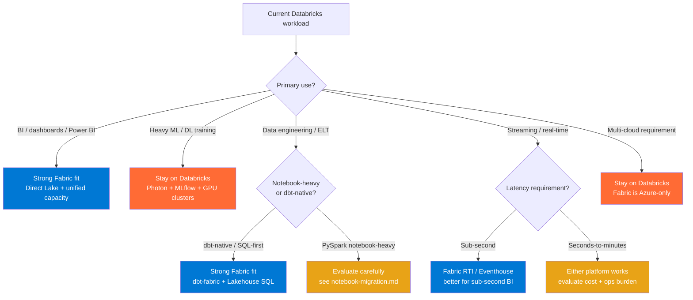

# Migration — Databricks to Microsoft Fabric (Package Index)

**Status:** Authored 2026-04-30
**Audience:** Teams running Databricks (on Azure, AWS, GCP) evaluating Microsoft Fabric as a strategic consolidation target for BI, data engineering, real-time analytics, and AI workloads.
**Scope:** Complete migration package — assessment through decommission — with feature-level mapping, hands-on tutorials, benchmarks, and best practices for hybrid and full-migration scenarios.

---

## Quick decision: should you migrate?

> **Most enterprises land on hybrid.** Databricks handles heavy ML/training; Fabric handles BI, ad-hoc analytics, and real-time. OneLake shortcuts let both engines read the same Delta tables. See [best-practices.md](best-practices.md) for the hybrid playbook.

---

## Decision matrix

| Workload category    | Databricks strength                  | Fabric strength                        | Recommendation            |
| -------------------- | ------------------------------------ | -------------------------------------- | ------------------------- |
| BI semantic models   | DBR SQL endpoint + Power BI Import   | Direct Lake (zero-copy) + native PBI   | **Fabric**                |
| Ad-hoc SQL analytics | DBSQL warehouse, Photon              | Lakehouse SQL endpoint, auto-optimized | **Fabric** (cost)         |
| PySpark notebooks    | Photon runtime, GPU attach           | Fabric Spark (forked OSS)              | **Databricks** (perf)     |
| dbt transformations  | dbt-databricks adapter, mature       | dbt-fabric adapter, growing            | **Either**                |
| Delta Live Tables    | DLT (declarative, expectations)      | Data Pipelines + dbt tests             | **Databricks** (maturity) |
| MLflow experiments   | Native MLflow, Unity Catalog lineage | Fabric ML experiments (limited)        | **Databricks**            |
| Model serving        | Databricks Model Serving, GPU        | Azure ML managed endpoints             | **Databricks**            |
| Feature store        | Databricks Feature Store + UC        | Fabric feature engineering (preview)   | **Databricks**            |
| Structured streaming | Structured Streaming, Auto Loader    | Real-Time Intelligence / Eventhouse    | **Fabric** (sub-second)   |
| Governance / catalog | Unity Catalog (3-level namespace)    | OneLake + Purview                      | **Databricks** (maturity) |
| Cost model           | DBU tiers (Jobs, SQL, All-Purpose)   | Fabric CU (single capacity)            | **Fabric** (simplicity)   |
| Multi-cloud          | AWS, Azure, GCP                      | Azure only                             | **Databricks**            |

---

## Package contents

### Strategic & cost

| Document                                                       | Description                                                             | Lines |
| -------------------------------------------------------------- | ----------------------------------------------------------------------- | ----- |
| [why-fabric-over-databricks.md](why-fabric-over-databricks.md) | Strategic white paper: when Fabric is the right move and when it is not | ~400  |
| [tco-analysis.md](tco-analysis.md)                             | DBU pricing vs Fabric CU, reserved capacity, storage, worked examples   | ~350  |
| [benchmarks.md](benchmarks.md)                                 | Photon vs Fabric Spark, DLT vs RTI, SQL warehouse comparisons           | ~300  |

### Feature mapping & migration guides

| Document                                                   | Description                                                                | Lines |
| ---------------------------------------------------------- | -------------------------------------------------------------------------- | ----- |
| [feature-mapping-complete.md](feature-mapping-complete.md) | 40+ feature-by-feature mapping: Databricks to Fabric equivalents           | ~400  |
| [notebook-migration.md](notebook-migration.md)             | PySpark notebooks, dbutils, library management, Databricks Connect         | ~350  |
| [unity-catalog-migration.md](unity-catalog-migration.md)   | Unity Catalog to OneLake + Purview: catalogs, schemas, RBAC, lineage       | ~400  |
| [dlt-migration.md](dlt-migration.md)                       | Delta Live Tables to Fabric Data Pipelines + dbt, expectations, monitoring | ~350  |
| [ml-migration.md](ml-migration.md)                         | MLflow, Model Serving, Feature Store, AutoML, Vector Search                | ~350  |
| [streaming-migration.md](streaming-migration.md)           | Structured Streaming to Fabric Real-Time Intelligence / Eventhouse         | ~300  |

### Hands-on tutorials

| Document                                                                 | Description                                                             | Lines |
| ------------------------------------------------------------------------ | ----------------------------------------------------------------------- | ----- |
| [tutorial-notebook-to-fabric.md](tutorial-notebook-to-fabric.md)         | Step-by-step: convert a Databricks PySpark notebook to Fabric           | ~350  |
| [tutorial-dlt-to-fabric-pipeline.md](tutorial-dlt-to-fabric-pipeline.md) | Migrate a DLT pipeline to Fabric Data Pipeline + dbt with quality tests | ~350  |

### Operations

| Document                               | Description                                                              | Lines |
| -------------------------------------- | ------------------------------------------------------------------------ | ----- |
| [best-practices.md](best-practices.md) | Hybrid strategy, workspace mapping, capacity planning, pitfall avoidance | ~300  |

---

## Reading order

**If you have 30 minutes:** Read this index + [why-fabric-over-databricks.md](why-fabric-over-databricks.md).

**If you are building a business case:** Add [tco-analysis.md](tco-analysis.md) + [benchmarks.md](benchmarks.md).

**If you are planning the migration:** Read [feature-mapping-complete.md](feature-mapping-complete.md) first, then the specific migration guide for your primary workload (notebooks, DLT, ML, streaming).

**If you are hands-on-keyboard:** Jump to the tutorials and [best-practices.md](best-practices.md).

---

## Related resources

- [Parent guide: Databricks to Fabric (5-phase overview)](../databricks-to-fabric.md)
- [Reference Architecture: Fabric vs Synapse vs Databricks](../../reference-architecture/fabric-vs-synapse-vs-databricks.md)
- [ADR 0010: Fabric Strategic Target](../../adr/0010-fabric-strategic-target.md)
- [ADR 0002: Databricks over OSS Spark](../../adr/0002-databricks-over-oss-spark.md)
- [Patterns: Power BI & Fabric Roadmap](../../patterns/power-bi-fabric-roadmap.md)
- [Migrations: Snowflake to csa-inabox](../snowflake.md)
- Microsoft Fabric documentation: <https://learn.microsoft.com/fabric/>
- Databricks-to-Fabric migration guide: <https://learn.microsoft.com/fabric/get-started/migrate-databricks>

---

**Maintainers:** csa-inabox core team
**Source finding:** CSA-0083 (HIGH, XL) -- approved via AQ-0010 ballot B6
**Last updated:** 2026-04-30
