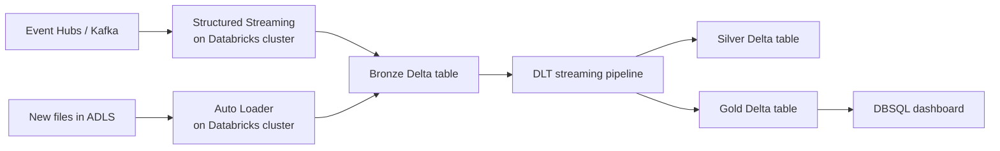
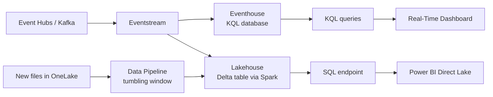

# Streaming Migration — Databricks to Fabric Real-Time Intelligence

**Status:** Authored 2026-04-30
**Audience:** Data engineers and architects migrating Structured Streaming, Auto Loader, and DLT streaming workloads from Databricks to Fabric Real-Time Intelligence (RTI), Eventhouse, and Eventstream.
**Scope:** Streaming architecture mapping, Structured Streaming to RTI conversion, Auto Loader alternatives, KQL query patterns, auto-scaling, and event-driven patterns.

---

## 1. Overview

Databricks streaming workloads use three main primitives:

- **Structured Streaming** -- Apache Spark's micro-batch or continuous streaming
- **Auto Loader** -- incremental file ingestion with automatic schema inference
- **Delta Live Tables (streaming mode)** -- declarative streaming pipelines

Fabric provides a fundamentally different streaming architecture:

- **Real-Time Intelligence (RTI)** -- Eventhouse (KQL database) + Eventstream for sub-second analytics
- **Fabric Spark Structured Streaming** -- same Spark API, runs on Fabric Spark
- **Data Pipelines with triggers** -- scheduled or event-triggered batch ingestion

### Decision matrix

| Streaming pattern                    | Fabric target                                          | When to use                                 |
| ------------------------------------ | ------------------------------------------------------ | ------------------------------------------- |
| Event stream analytics (sub-second)  | **Eventhouse + Eventstream**                           | Real-time dashboards, alerting, KQL queries |
| Micro-batch ETL (seconds to minutes) | **Fabric Spark Structured Streaming**                  | Complex transformations, Delta table writes |
| File-based incremental ingestion     | **Data Pipelines (tumbling window trigger)**           | New file detection, batch processing        |
| CDC / change data capture            | **Fabric mirroring** or **Spark Structured Streaming** | Database CDC replication                    |
| Complex event processing             | **Eventhouse + KQL update policies**                   | Pattern detection, windowed aggregations    |

---

## 2. Architecture comparison

### 2.1 Databricks streaming architecture



- **Always-on clusters** for Structured Streaming (cost: DBU + VM 24/7)
- **Auto Loader** detects new files via notification or directory listing
- **DLT** manages checkpoints, retries, and quality expectations

### 2.2 Fabric streaming architecture



- **Eventhouse** is a managed KQL database optimized for time-series and event data
- **Eventstream** routes events from Event Hubs/Kafka to Eventhouse or Lakehouse
- **No always-on cluster** -- Eventhouse is serverless; CU consumption scales with ingestion volume

---

## 3. Structured Streaming to Fabric Spark Structured Streaming

### 3.1 When to use Fabric Spark Structured Streaming

Use Fabric Spark Structured Streaming when:

- You need complex PySpark transformations on streaming data
- Your output is Delta tables (for downstream dbt / Power BI)
- You have existing Structured Streaming code that is simple to port
- Latency of seconds to minutes is acceptable

### 3.2 Code migration

**Databricks Structured Streaming:**

```python
from pyspark.sql import functions as F

# Read from Event Hubs
eh_conf = {
    "eventhubs.connectionString": sc._jvm.org.apache.spark.eventhubs
        .EventHubsUtils.encrypt(connection_string),
    "eventhubs.consumerGroup": "$Default",
    "eventhubs.startingPosition": json.dumps({"offset": "-1"}),
}

df_stream = (
    spark.readStream
    .format("eventhubs")
    .options(**eh_conf)
    .load()
    .withColumn("body", F.col("body").cast("string"))
    .withColumn("parsed", F.from_json(F.col("body"), event_schema))
    .select("parsed.*", "enqueuedTime")
)

# Transform
df_enriched = (
    df_stream
    .withColumn("event_date", F.to_date("event_time"))
    .withColumn("hour", F.hour("event_time"))
    .filter(F.col("event_type").isNotNull())
)

# Write to Delta
query = (
    df_enriched.writeStream
    .format("delta")
    .outputMode("append")
    .option("checkpointLocation", "/mnt/checkpoints/events")
    .trigger(processingTime="30 seconds")
    .table("production.bronze.events")
)
```

**Fabric Spark Structured Streaming:**

```python
from pyspark.sql import functions as F

# Read from Event Hubs (same API, different config pattern)
eh_conf = {
    "eventhubs.connectionString": mssparkutils.credentials.getSecret(
        "keyvault-name", "eh-connection-string"
    ),
    "eventhubs.consumerGroup": "$Default",
    "eventhubs.startingPosition": json.dumps({"offset": "-1"}),
}

df_stream = (
    spark.readStream
    .format("eventhubs")
    .options(**eh_conf)
    .load()
    .withColumn("body", F.col("body").cast("string"))
    .withColumn("parsed", F.from_json(F.col("body"), event_schema))
    .select("parsed.*", "enqueuedTime")
)

# Transform -- same code
df_enriched = (
    df_stream
    .withColumn("event_date", F.to_date("event_time"))
    .withColumn("hour", F.hour("event_time"))
    .filter(F.col("event_type").isNotNull())
)

# Write to Lakehouse Delta table
query = (
    df_enriched.writeStream
    .format("delta")
    .outputMode("append")
    .option("checkpointLocation", "Files/checkpoints/events")
    .trigger(processingTime="30 seconds")
    .toTable("events_bronze")
)
```

### 3.3 Key changes

| Databricks pattern               | Fabric equivalent                        | Notes                                             |
| -------------------------------- | ---------------------------------------- | ------------------------------------------------- |
| Cluster-based streaming job      | Fabric Spark notebook (long-running)     | Schedule via Data Pipeline; no persistent cluster |
| `/mnt/checkpoints/`              | `Files/checkpoints/`                     | OneLake path                                      |
| `dbutils.secrets`                | `mssparkutils.credentials`               | Key Vault integration                             |
| `.table("catalog.schema.table")` | `.toTable("lakehouse_table")`            | Lakehouse table reference                         |
| Auto-scaling cluster             | Fabric Spark auto-scales within capacity | CU-based, not VM-based                            |

---

## 4. Structured Streaming to Eventhouse (RTI)

### 4.1 When to use Eventhouse over Spark Streaming

| Criteria             | Eventhouse (RTI)                    | Spark Structured Streaming   |
| -------------------- | ----------------------------------- | ---------------------------- |
| Query latency        | Sub-second                          | Seconds (depends on trigger) |
| Query language       | KQL (Kusto Query Language)          | Spark SQL / PySpark          |
| Storage format       | KQL database (columnar, compressed) | Delta Lake (Parquet + logs)  |
| Auto-scaling         | Fully managed                       | Within Fabric Spark capacity |
| Retention policies   | Built-in (hot/warm/cold)            | Manual (Delta VACUUM)        |
| Real-time dashboards | Native (Real-Time Dashboard)        | Via Power BI DirectQuery     |
| Complex transforms   | KQL update policies                 | Full Spark API               |

### 4.2 Setting up Eventstream + Eventhouse

**Step 1: Create Eventhouse**

```
Fabric workspace > New > Eventhouse > Name: "events-house"
```

**Step 2: Create KQL database**

```kql
// Create table for events
.create table Events (
    EventId: string,
    EventType: string,
    UserId: string,
    EventTime: datetime,
    Properties: dynamic
)

// Set retention policy (30 days hot, 90 days total)
.alter table Events policy retention
    @'{"SoftDeletePeriod": "90.00:00:00", "Recoverability": "Enabled"}'

// Set caching policy (30 days in hot cache)
.alter table Events policy caching
    hot = 30d
```

**Step 3: Create Eventstream**

```
Fabric workspace > New > Eventstream > Name: "events-stream"
> Add Source: Azure Event Hubs
  > Connection: Select Event Hub namespace
  > Consumer group: $Default
> Add Destination: Eventhouse
  > Database: events-house
  > Table: Events
  > Mapping: Auto-detect or manual JSON mapping
```

**Step 4: Query streaming data in real time**

```kql
// Last hour of events by type
Events
| where EventTime > ago(1h)
| summarize Count = count() by EventType, bin(EventTime, 5m)
| render timechart

// Anomaly detection (built-in)
Events
| where EventTime > ago(24h)
| make-series Count = count() on EventTime step 1m
| extend (Anomalies, AnomalyScore, ExpectedCount) = series_decompose_anomalies(Count)
| mv-expand EventTime, Count, Anomalies, AnomalyScore
| where Anomalies != 0
```

### 4.3 KQL equivalents for common Spark Streaming patterns

| Spark Streaming pattern           | KQL equivalent                           |
| --------------------------------- | ---------------------------------------- |
| `window(col, "5 minutes")`        | `bin(Timestamp, 5m)`                     |
| `groupBy("key").count()`          | `summarize count() by key`               |
| `filter(col("x") > 10)`           | `where x > 10`                           |
| `withWatermark("time", "10 min")` | KQL handles late data via ingestion time |
| `dropDuplicates(["id"])`          | `summarize take_any(*) by id`            |
| `join(other_df, "key")`           | `join kind=inner (OtherTable) on key`    |
| UDF (Python function)             | KQL functions (limited but performant)   |

---

## 5. Auto Loader to Fabric alternatives

### 5.1 Databricks Auto Loader

Auto Loader detects new files in cloud storage and processes them incrementally:

```python
df = (
    spark.readStream
    .format("cloudFiles")
    .option("cloudFiles.format", "json")
    .option("cloudFiles.schemaLocation", "/mnt/schema/events")
    .option("cloudFiles.inferColumnTypes", "true")
    .load("/mnt/landing/events/")
)
```

### 5.2 Fabric alternatives

| Approach                                          | Latency    | Effort | Best for                          |
| ------------------------------------------------- | ---------- | ------ | --------------------------------- |
| Data Pipeline with tumbling window trigger        | Minutes    | Low    | Batch file processing on schedule |
| Data Pipeline with event trigger (Storage Events) | Seconds    | Medium | Event-driven file processing      |
| Fabric Spark Structured Streaming (file source)   | Seconds    | Medium | Complex transforms on new files   |
| Eventstream (Custom App source)                   | Sub-second | Medium | Real-time file event processing   |

**Data Pipeline with storage event trigger (recommended for most cases):**

1. Create a Data Pipeline in Fabric workspace
2. Add a **Storage Event trigger** that fires when new files arrive in ADLS / OneLake
3. Add a **Copy activity** or **Notebook activity** to process the new files
4. The trigger passes the file path as a parameter

```json
{
    "name": "NewFileTrigger",
    "type": "BlobEventsTrigger",
    "typeProperties": {
        "blobPathBeginsWith": "/container/landing/events/",
        "blobPathEndsWith": ".json",
        "ignoreEmptyBlobs": true,
        "scope": "/subscriptions/.../storageAccounts/...",
        "events": ["Microsoft.Storage.BlobCreated"]
    },
    "pipelines": [
        {
            "pipelineReference": { "referenceName": "ProcessNewFiles" },
            "parameters": {
                "filePath": "@trigger().outputs.body.fileName"
            }
        }
    ]
}
```

**Fabric Spark file streaming:**

```python
# Fabric notebook: Stream from OneLake file source
df = (
    spark.readStream
    .format("json")
    .schema(file_schema)
    .option("maxFilesPerTrigger", 100)
    .load("Files/landing/events/")
)

# Process and write
df.writeStream.format("delta").option(
    "checkpointLocation", "Files/checkpoints/file_ingest"
).toTable("events_raw")
```

---

## 6. Event-driven patterns in Fabric

### 6.1 Data Activator (event-triggered actions)

Data Activator monitors data conditions and triggers actions:

```
Fabric workspace > New > Data Activator (Reflex)
> Connect to: Eventhouse table or Power BI visual
> Define condition: "When event_count > 1000 in 5 minutes"
> Action: Send Teams notification / trigger Data Pipeline / send email
```

### 6.2 Eventstream routing

Eventstream can route events to multiple destinations simultaneously:

```
Event Hubs source
  ├── Eventhouse (real-time queries)
  ├── Lakehouse (Delta archive)
  └── Data Activator (alerting)
```

This replaces the Databricks pattern of running multiple Structured Streaming queries from the same source.

---

## 7. Auto-scaling comparison

| Aspect              | Databricks Streaming                 | Fabric RTI                             |
| ------------------- | ------------------------------------ | -------------------------------------- |
| Scaling unit        | Cluster nodes (VMs)                  | Fabric CU (capacity)                   |
| Scale-up time       | Minutes (new VMs)                    | Seconds (within capacity)              |
| Scale-to-zero       | Not for streaming (cluster must run) | Yes (Eventhouse scales with ingestion) |
| Cost during idle    | Full cluster cost                    | Minimal CU                             |
| Over-provisioning   | Common (must handle peak)            | Smoothing handles spikes               |
| Auto-scaling config | Cluster autoscale min/max nodes      | Capacity-level CU budget               |

**Key insight:** Databricks streaming jobs require an always-on cluster, meaning you pay for cluster VMs 24/7 even during low-traffic periods. Fabric Eventhouse scales with ingestion volume and costs near-zero during idle periods (within your capacity allocation).

---

## 8. Migration execution checklist

### Per streaming workload

- [ ] **Classify latency requirement:** sub-second (Eventhouse) vs seconds (Spark) vs minutes (Data Pipeline)
- [ ] **Document source:** Event Hubs, Kafka, file-based, database CDC
- [ ] **Document transforms:** simple routing, complex PySpark, windowed aggregations
- [ ] **Document output:** Delta table, dashboard, alert, API
- [ ] **Choose target:** Eventhouse + Eventstream OR Fabric Spark Structured Streaming OR Data Pipeline
- [ ] **Implement on Fabric** -- follow patterns in sections 3-5
- [ ] **Set up monitoring** -- Eventstream metrics, KQL queries, pipeline alerts
- [ ] **Parallel run** -- run both Databricks and Fabric streaming for 1-2 weeks
- [ ] **Validate completeness** -- compare event counts, latency, data quality
- [ ] **Cutover** -- stop Databricks streaming job, terminate cluster
- [ ] **Monitor cost** -- verify CU consumption is within budget

---

## 9. Common pitfalls

| Pitfall                                                             | Mitigation                                                                                     |
| ------------------------------------------------------------------- | ---------------------------------------------------------------------------------------------- |
| Assuming Eventhouse replaces Structured Streaming for all use cases | Eventhouse is for analytics (KQL); use Spark Streaming for complex ETL                         |
| Running Spark Structured Streaming 24/7 on Fabric                   | This consumes CU continuously; evaluate if Eventhouse is cheaper                               |
| Ignoring Auto Loader's schema evolution                             | Data Pipeline + Spark lacks Auto Loader's auto-schema-merge; handle manually                   |
| Not setting Eventhouse retention policies                           | Without retention, data grows unbounded; set hot/warm/cold tiers                               |
| Expecting Eventstream to handle complex transforms                  | Eventstream is routing, not transformation; use KQL update policies or Spark for complex logic |
| Forgetting checkpoint migration                                     | Structured Streaming checkpoints are not portable; restart from earliest offset during cutover |

---

## Related

- [Feature Mapping](feature-mapping-complete.md) -- streaming section
- [DLT Migration](dlt-migration.md) -- DLT streaming pipelines
- [Tutorial: DLT to Fabric Pipeline](tutorial-dlt-to-fabric-pipeline.md) -- hands-on migration
- [Benchmarks](benchmarks.md) -- streaming latency comparisons
- [Best Practices](best-practices.md) -- streaming architecture patterns
- [Parent guide: 5-phase migration](../databricks-to-fabric.md)
- Fabric Real-Time Intelligence: <https://learn.microsoft.com/fabric/real-time-intelligence/>
- Fabric Eventstream: <https://learn.microsoft.com/fabric/real-time-intelligence/event-streams/>

---

**Maintainers:** csa-inabox core team
**Source finding:** CSA-0083 (HIGH, XL) -- approved via AQ-0010 ballot B6
**Last updated:** 2026-04-30
