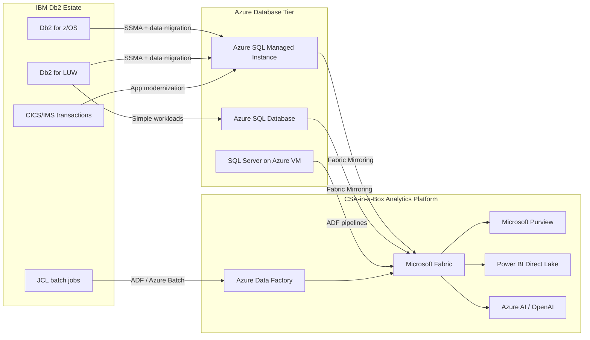

# Migrating from IBM Db2 to Azure SQL

**Status:** Authored 2026-04-30
**Audience:** Federal CIO / CDO / DBA leads / Enterprise Architects running IBM Db2 estates on z/OS mainframes or LUW (Linux/UNIX/Windows) and migrating to Azure-native managed databases.
**Scope:** IBM Db2 for z/OS, Db2 for LUW, Db2 for iSeries migrating to Azure SQL Database, Azure SQL Managed Instance, or SQL Server on Azure VMs. Covers SSMA-based schema conversion, data movement, stored procedure migration, COBOL/CICS application modernization, and CSA-in-a-Box analytics integration.

---

!!! tip "Expanded Migration Center Available"
This playbook is the core migration reference. For the complete Db2-to-Azure SQL migration package -- including white papers, deep-dive guides, tutorials, and federal-specific guidance -- visit the **[Db2 to Azure SQL Migration Center](db2-to-azure-sql/index.md)**.

    **Quick links:**

    - [Why Azure over Db2 (Executive Brief)](db2-to-azure-sql/why-azure-over-db2.md)
    - [Total Cost of Ownership Analysis](db2-to-azure-sql/tco-analysis.md)
    - [Complete Feature Mapping (40+ features)](db2-to-azure-sql/feature-mapping-complete.md)
    - [Federal Migration Guide](db2-to-azure-sql/federal-migration-guide.md)
    - [Tutorials & Walkthroughs](db2-to-azure-sql/index.md#tutorials)
    - [Best Practices](db2-to-azure-sql/best-practices.md)

    **Migration guides by topic:** [Schema Conversion](db2-to-azure-sql/schema-migration.md) | [Data Movement](db2-to-azure-sql/data-migration.md) | [Stored Procedures](db2-to-azure-sql/stored-proc-migration.md) | [Application Changes](db2-to-azure-sql/application-migration.md) | [Mainframe Considerations](db2-to-azure-sql/mainframe-considerations.md)

---

## 1. Executive summary

IBM Db2 is the backbone of mission-critical workloads in banking, insurance, manufacturing, and federal government. Db2 for z/OS powers core transaction processing on mainframes, while Db2 for LUW serves departmental and midrange applications. The migration forcing functions are consistent: mainframe hardware refresh cycles costing tens of millions, IBM licensing tied to MIPS capacity on z/OS or PVU counts on LUW, a shrinking pool of Db2 DBA talent as the workforce retires, and a strategic imperative to move from batch-centric processing to cloud-native, real-time analytics.

Microsoft SQL Server Migration Assistant (SSMA) for Db2 is a mature, Microsoft-supported tool that automates schema conversion from Db2 to T-SQL at 70-85% fidelity for typical workloads. The remaining manual conversion centers on Db2 SQL PL stored procedures, EBCDIC encoding on z/OS, COBOL precompiler dependencies, and Db2-specific SQL syntax differences. Azure SQL Managed Instance is the recommended target for most workloads due to its near-complete T-SQL surface area, built-in HA, and managed service model.

This playbook is honest. Db2 for z/OS migrations are among the most complex database migrations in the industry due to mainframe coupling -- CICS transaction regions, IMS databases, JCL batch scheduling, VSAM files, and EBCDIC encoding all require parallel modernization. The migration is not a weekend project; it is a multi-quarter program. But the economics are compelling: a typical federal mainframe running Db2 at 3,000 MIPS carries $3-5M/year in IBM software costs alone, compared to $200-400K/year for equivalent Azure SQL capacity.

### Target platform decision matrix

| Scenario                         | Recommended target             | Why                                                                                  |
| -------------------------------- | ------------------------------ | ------------------------------------------------------------------------------------ |
| OLTP workloads, moderate SQL PL  | **Azure SQL Managed Instance** | Near-100% T-SQL parity, SQL Agent jobs, linked servers, SSMA handles bulk conversion |
| Simple read/write apps, web tier | **Azure SQL Database**         | Lowest cost, serverless auto-scale, no infrastructure management                     |
| Complex batch, SQL Agent heavy   | **Azure SQL Managed Instance** | SQL Agent, CLR, cross-database queries, Service Broker                               |
| Legacy apps needing full control | **SQL Server on Azure VMs**    | Full SQL Server, OS-level access, custom configurations                              |
| Analytics/warehouse workloads    | **Microsoft Fabric / Synapse** | Columnar storage, Spark, Direct Lake, CSA-in-a-Box integration                       |

---

## 2. How CSA-in-a-Box fits

CSA-in-a-Box is the analytics, governance, and AI landing zone that consumes data from migrated Db2 workloads regardless of which Azure SQL target you choose.

Migrated Db2 data flows into CSA-in-a-Box through Fabric Mirroring (for Azure SQL MI and Azure SQL Database) or Azure Data Factory pipelines (for SQL Server on VMs). From there, the full CSA-in-a-Box platform applies -- Delta Lake medallion architecture, Purview governance and lineage, Power BI semantic models, and Azure AI integration.

---

## 3. Capability mapping -- Db2 to Azure SQL

### Core database features

| Db2 capability                       | Azure SQL equivalent               | Mapping notes                                                   | Effort |
| ------------------------------------ | ---------------------------------- | --------------------------------------------------------------- | ------ |
| Tablespaces (database, table, index) | Filegroups + data files            | Logical-to-logical; SSMA maps automatically                     | XS     |
| Bufferpools                          | Buffer pool (memory)               | Azure SQL manages automatically; configure max memory on VMs    | XS     |
| REORG / RUNSTATS                     | Index rebuild + UPDATE STATISTICS  | Automatic maintenance on managed services                       | XS     |
| Db2 stored procedures (SQL PL)       | T-SQL stored procedures            | SSMA converts ~70%; manual work for condition handlers, cursors | M-L    |
| Triggers (BEFORE/AFTER/INSTEAD OF)   | T-SQL triggers (AFTER/INSTEAD OF)  | BEFORE triggers require refactoring to INSTEAD OF or app logic  | S-M    |
| Sequences                            | Sequences (CREATE SEQUENCE)        | 1:1 mapping; syntax nearly identical                            | XS     |
| Identity columns                     | Identity columns                   | 1:1 mapping                                                     | XS     |
| Materialized Query Tables (MQTs)     | Indexed views                      | SSMA converts; refresh semantics differ (immediate vs deferred) | M      |
| Row and Column Access Control (RCAC) | Row-level security (RLS)           | Predicate-based; similar model, different syntax                | M      |
| Temporal tables (system-time)        | Temporal tables (system-versioned) | Azure SQL has native temporal table support                     | S      |
| XML data type                        | XML data type                      | 1:1; XQuery support in both                                     | XS     |
| Federation / nicknames               | Linked servers                     | Db2 federation objects become linked server references          | M      |
| EXPLAIN / access plan                | Execution plan / SET STATISTICS    | Different tooling but same conceptual approach                  | XS     |

### SQL syntax mapping (key differences)

| Db2 SQL                         | T-SQL equivalent              | Notes                                      |
| ------------------------------- | ----------------------------- | ------------------------------------------ | ------------------------- | --------------------------------------- |
| `FETCH FIRST n ROWS ONLY`       | `TOP n` or `OFFSET...FETCH`   | SSMA converts automatically                |
| `VALUES (expr)` as SELECT       | `SELECT expr`                 | Db2 uses VALUES for single-row queries     |
| `CURRENT DATE` / `CURRENT TIME` | `GETDATE()` / `SYSDATETIME()` | Special registers become functions         |
| `DATE('2026-01-01')`            | `CAST('2026-01-01' AS DATE)`  | Date constructor syntax differs            |
| `DAYS(d1) - DAYS(d2)`           | `DATEDIFF(DAY, d2, d1)`       | Date arithmetic is fundamentally different |
| `SUBSTR(s, p, l)`               | `SUBSTRING(s, p, l)`          | SSMA converts automatically                |
| `CONCAT(a, b)` or `a            |                               | b`                                         | `CONCAT(a, b)` or `a + b` | Both support CONCAT(); operator differs |
| `DECIMAL(expr, p, s)`           | `CAST(expr AS DECIMAL(p,s))`  | Type casting syntax                        |
| `WITH ur` (uncommitted read)    | `WITH (NOLOCK)`               | Isolation hint                             |
| `MERGE` (Db2 syntax)            | `MERGE` (T-SQL syntax)        | Both support MERGE; clause order differs   |
| `SIGNAL SQLSTATE`               | `THROW` / `RAISERROR`         | Error raising                              |
| `GET DIAGNOSTICS`               | `@@ROWCOUNT` / `@@ERROR`      | Diagnostic info retrieval                  |

---

## 4. Worked migration example -- Db2 LUW OLTP to Azure SQL MI

### 4.1 Starting state

Db2 11.5 for LUW running on RHEL 8, serving a loan-processing application:

- 2 databases, 450 tables, 120 stored procedures, 85 triggers
- 800 GB total data, 40M rows in the largest transaction table
- 15 batch jobs running nightly via cron calling `db2 -tvf` scripts
- JDBC connections from a Java/Spring application
- DB2 HADR (High Availability Disaster Recovery) for failover

### 4.2 Migration path

1. **Assess:** Install SSMA for Db2 and connect to source. Run assessment report -- expect 75-85% automatic conversion for schema and stored procedures.
2. **Convert schema:** SSMA converts tables, views, indexes, sequences, triggers. Review conversion report for items requiring manual remediation.
3. **Remediate stored procedures:** Convert SQL PL condition handlers to TRY/CATCH, SIGNAL to THROW, Db2 built-in functions to T-SQL equivalents.
4. **Migrate data:** Use SSMA data migration for small tables; use ADF Db2 connector + bulk insert for large tables (40M+ rows).
5. **Update application:** Change JDBC driver from `com.ibm.db2.jcc.DB2Driver` to `com.microsoft.sqlserver.jdbc.SQLServerDriver`. Update connection strings. Fix Db2-specific SQL in the application layer.
6. **Replace batch jobs:** Cron + `db2 -tvf` scripts become SQL Agent jobs on Azure SQL MI or ADF pipeline activities.
7. **Validate:** Run reconciliation queries comparing row counts, checksums, and business-logic outputs between Db2 source and Azure SQL MI target.

### 4.3 HADR to Azure SQL MI HA

| Db2 HADR                            | Azure SQL MI                                |
| ----------------------------------- | ------------------------------------------- |
| Primary + standby instance          | Built-in zone-redundant HA (99.99% SLA)     |
| HADR_SYNCMODE (SYNC/NEARSYNC/ASYNC) | Synchronous commit within availability zone |
| Automatic client reroute (ACR)      | Redirect connection policy (built-in)       |
| Manual takeover (`TAKEOVER HADR`)   | Automatic failover (no manual intervention) |

---

## 5. Migration sequence (phased project plan)

### Phase 0 -- Discovery and assessment (Weeks 1-4)

- Inventory all Db2 databases: z/OS subsystems, LUW instances, iSeries partitions.
- Catalog stored procedures, triggers, UDFs, MQTs, and external dependencies.
- Map COBOL/CICS/JCL dependencies (z/OS) or application connectivity (LUW).
- Run SSMA assessment against representative databases.
- Establish complexity tiers: simple (schema + data only), moderate (stored procedures), complex (mainframe coupling).

### Phase 1 -- Landing zone and tooling (Weeks 4-8)

- Deploy Azure SQL MI (Business Critical tier for mission-critical workloads).
- Configure private endpoints, VNet integration, and connectivity to on-premises via ExpressRoute or VPN.
- Install and configure SSMA for Db2 on a migration workstation.
- Configure ADF with the Db2 connector for data movement pipelines.
- Deploy CSA-in-a-Box landing zone (Fabric workspace, Purview, ADF).

### Phase 2 -- Pilot database migration (Weeks 8-14)

- Select a low-risk LUW database for the pilot (departmental workload, not mainframe).
- Convert schema with SSMA, remediate stored procedures, migrate data.
- Update application connectivity and test end-to-end.
- Establish Fabric Mirroring from Azure SQL MI to bring migrated data into the analytics platform.
- Validate with dual-run: 2-week parallel operation comparing outputs.

### Phase 3 -- Production LUW migrations (Weeks 14-24)

- Migrate remaining Db2 LUW databases in waves sorted by complexity tier.
- Each wave: convert, remediate, migrate data, update applications, validate.
- Batch job migration: cron scripts to SQL Agent or ADF pipelines.
- Performance tuning: index optimization, query plan analysis.

### Phase 4 -- Mainframe Db2 migration (Weeks 20-36, if applicable)

- EBCDIC-to-Unicode conversion strategy.
- CICS transaction replacement (APIs, microservices, or Azure API Management).
- JCL batch job replacement (ADF pipelines, Azure Batch, Databricks Jobs).
- VSAM file migration to Azure Blob Storage or Azure SQL.
- COBOL precompiler dependency elimination.

### Phase 5 -- Analytics integration and decommission (Weeks 30-40)

- Fabric Mirroring or ADF pipelines established for all migrated databases.
- Purview scanning and classification of migrated data.
- Power BI semantic models built over the new Azure SQL sources.
- Azure AI integration for intelligent workloads.
- IBM mainframe LPAR capacity reduction or decommission.
- Final cost reconciliation: IBM licensing savings vs Azure run-rate.

---

## 6. Federal compliance considerations

- **FedRAMP High:** Azure SQL MI and Azure SQL Database are FedRAMP High authorized in Azure Government. Db2 on z/OS systems in federal data centers must transition controls to Azure-inherited controls per `csa_platform/csa_platform/governance/compliance/nist-800-53-rev5.yaml`.
- **DoD IL4 / IL5:** Azure SQL MI is available in Azure Government regions at IL4; IL5 availability per `docs/GOV_SERVICE_MATRIX.md`.
- **CMMC 2.0 Level 2:** Controls mapped in `csa_platform/csa_platform/governance/compliance/cmmc-2.0-l2.yaml`.
- **HIPAA:** Azure SQL MI supports BAA coverage; mapped in `csa_platform/csa_platform/governance/compliance/hipaa-security-rule.yaml`.
- **Data residency:** Federal agencies must ensure Db2 data remains in authorized Azure Government regions during and after migration. No data should traverse commercial Azure regions.
- **Audit trail:** Preserve Db2 audit logs (db2audit, AUDIT policy) and mainframe SMF records as evidence during the migration period. Azure SQL MI Auditing provides the ongoing audit capability.

---

## 7. Cost comparison

Illustrative. IBM Db2 licensing varies dramatically by platform. A federal agency running Db2 for z/OS at 3,000 MIPS with Db2 for LUW on 8 PVU cores typically faces:

**Current IBM costs (annual):**

| Cost element                         | Annual cost                 |
| ------------------------------------ | --------------------------- |
| Db2 for z/OS license (3,000 MIPS)    | $1,800,000 - $2,400,000     |
| Db2 for LUW license (8 PVU cores)    | $180,000 - $280,000         |
| IBM annual support (22% of license)  | $435,000 - $590,000         |
| Mainframe hardware / LPAR allocation | $800,000 - $1,500,000       |
| Db2 DBA FTEs (4 FTEs at $140K)       | $560,000                    |
| **Total annual IBM cost**            | **$3,775,000 - $5,330,000** |

**Target Azure costs (annual):**

| Cost element                                | Annual cost             |
| ------------------------------------------- | ----------------------- |
| Azure SQL MI (Business Critical, 16 vCores) | $120,000 - $180,000     |
| Azure SQL MI (General Purpose, 8 vCores)    | $40,000 - $60,000       |
| Fabric capacity (F64)                       | $150,000 - $200,000     |
| ADF pipeline execution                      | $20,000 - $40,000       |
| Azure Monitor + Key Vault + networking      | $30,000 - $50,000       |
| Cloud DBA FTEs (2 FTEs at $150K)            | $300,000                |
| **Total annual Azure cost**                 | **$660,000 - $830,000** |

**Typical savings: 75-85%** -- driven primarily by eliminating IBM mainframe MIPS-based licensing and reducing DBA headcount through managed services.

---

## 8. Gaps and honest assessment

| Gap                                   | Description                                                | Mitigation                                                               |
| ------------------------------------- | ---------------------------------------------------------- | ------------------------------------------------------------------------ |
| BEFORE triggers                       | Azure SQL supports AFTER and INSTEAD OF, not BEFORE        | Refactor to INSTEAD OF triggers or move logic to application layer       |
| SQL PL condition handlers             | No direct equivalent to Db2's DECLARE HANDLER              | Convert to TRY/CATCH blocks; requires manual effort                      |
| EBCDIC encoding                       | Azure SQL is Unicode (UTF-16); no native EBCDIC support    | Convert during data migration; use SSMA or custom ETL                    |
| CICS/IMS coupling                     | No Azure equivalent for CICS transaction monitors          | Modernize to REST APIs, Azure API Management, or microservices           |
| Db2 utilities (REORG, RUNSTATS, LOAD) | Azure SQL automates maintenance; no direct CLI equivalents | Adapt operational runbooks; most maintenance is automatic                |
| MQT deferred refresh                  | Indexed views refresh immediately; no deferred option      | Schedule refresh via SQL Agent jobs or ADF for deferred patterns         |
| Db2 federation (nicknames)            | Linked servers exist but with different capabilities       | Test federation patterns; may require ADF for complex cross-source joins |

---

## 9. Related resources

- **Migration index:** [docs/migrations/README.md](README.md)
- **Companion playbooks:** [Oracle to Azure](oracle-to-azure.md), [SQL Server to Azure](sql-server-to-azure.md), [SAP to Azure](sap-to-azure.md)
- **Decision trees:**
    - `docs/decisions/fabric-vs-databricks-vs-synapse.md`
    - `docs/decisions/lakehouse-vs-warehouse-vs-lake.md`
    - `docs/decisions/batch-vs-streaming.md`
- **ADRs:**
    - `docs/adr/0001-adf-dbt-over-airflow.md`
    - `docs/adr/0004-bicep-over-terraform.md`
    - `docs/adr/0006-purview-over-atlas.md`
    - `docs/adr/0010-fabric-strategic-target.md`
- **Compliance matrices:**
    - `docs/compliance/nist-800-53-rev5.md`
    - `docs/compliance/cmmc-2.0-l2.md`
    - `docs/compliance/hipaa-security-rule.md`
- **Platform modules:**
    - `csa_platform/unity_catalog_pattern/` -- OneLake + Unity Catalog
    - `csa_platform/csa_platform/governance/purview/` -- Purview automation
    - `csa_platform/ai_integration/` -- AI Foundry / Azure OpenAI

---

**Maintainers:** csa-inabox core team
**Last updated:** 2026-04-30
