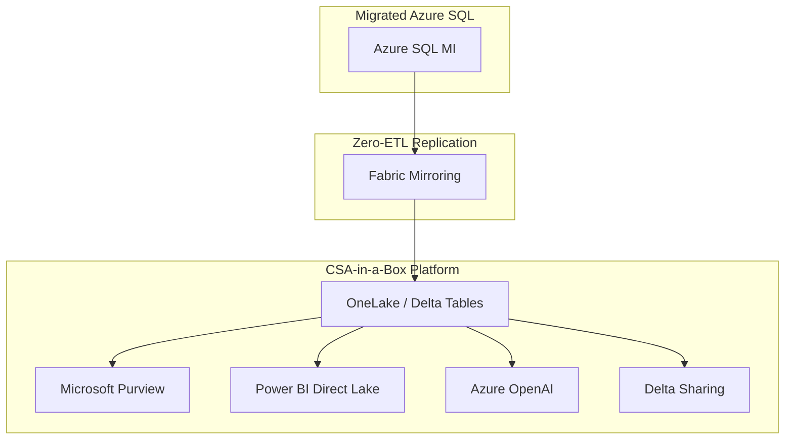

# Best Practices -- IBM Db2 to Azure SQL Migration

**Audience:** Migration Leads, Architects, DBAs, Program Managers
**Purpose:** Assessment methodology, complexity tiers, COBOL dependency analysis, batch workload modernization, testing strategy, and CSA-in-a-Box analytics integration for modernized Db2 data.

---

## 1. Assessment methodology

### Phase 1: Discovery and inventory

Before planning any migration, build a complete inventory of the Db2 estate.

#### Automated discovery

Use SSMA for Db2 to generate an assessment report for each database. Run the assessment against all Db2 instances to get a comprehensive picture.

For large estates, supplement SSMA with catalog queries:

```sql
-- Db2 LUW: comprehensive object inventory
SELECT 'TABLE' AS obj_type, TABSCHEMA, TABNAME AS obj_name,
       CARD AS row_count, (DATA_OBJECT_P_SIZE + INDEX_OBJECT_P_SIZE)/1024 AS size_mb
FROM SYSCAT.TABLES WHERE TYPE = 'T' AND TABSCHEMA NOT LIKE 'SYS%'
UNION ALL
SELECT 'VIEW', VIEWSCHEMA, VIEWNAME, NULL, NULL
FROM SYSCAT.VIEWS WHERE VIEWSCHEMA NOT LIKE 'SYS%'
UNION ALL
SELECT CASE ROUTINETYPE WHEN 'P' THEN 'PROCEDURE' ELSE 'FUNCTION' END,
       ROUTINESCHEMA, ROUTINENAME, NULL, NULL
FROM SYSCAT.ROUTINES WHERE ROUTINESCHEMA NOT LIKE 'SYS%'
UNION ALL
SELECT 'TRIGGER', TRIGSCHEMA, TRIGNAME, NULL, NULL
FROM SYSCAT.TRIGGERS WHERE TRIGSCHEMA NOT LIKE 'SYS%'
UNION ALL
SELECT 'SEQUENCE', SEQSCHEMA, SEQNAME, NULL, NULL
FROM SYSCAT.SEQUENCES WHERE SEQSCHEMA NOT LIKE 'SYS%'
ORDER BY 1, 2, 3;
```

#### Manual discovery (z/OS)

For Db2 for z/OS, also inventory:

- BIND/REBIND plans and packages (from SYSIBM.SYSPACKAGE)
- CICS/IMS region-to-Db2 subsystem mappings
- JCL job streams that reference Db2 utilities or programs
- VSAM files referenced in the same batch job streams
- MQ Series queue definitions that trigger Db2 transactions
- RACF/ACF2 security profiles for Db2 resources

### Phase 2: Complexity classification

Classify each database or application into complexity tiers:

| Tier                          | Criteria                                                                                           | Typical conversion rate | Timeline per database |
| ----------------------------- | -------------------------------------------------------------------------------------------------- | ----------------------- | --------------------- |
| **Tier 1: Simple**            | Schema + data only; no stored procs, no triggers, no batch dependencies                            | 95%+ automatic          | 1-2 weeks             |
| **Tier 2: Moderate**          | Schema + data + stored procedures (< 50) + triggers; standard SQL patterns                         | 75-85% automatic        | 3-6 weeks             |
| **Tier 3: Complex**           | Heavy stored procedures (50-200+) + BEFORE triggers + MQTs + batch jobs + application dependencies | 60-75% automatic        | 8-16 weeks            |
| **Tier 4: Very Complex**      | z/OS with CICS/IMS coupling, COBOL embedded SQL, EBCDIC, JCL batch, VSAM integration               | 50-65% automatic        | 16-36 weeks           |
| **Tier 5: Mainframe Program** | Full mainframe modernization including COBOL rewrite, CICS replacement, JCL elimination            | 40-55% automatic        | 36-52+ weeks          |

### Phase 3: Prioritization

Prioritize migration waves based on:

1. **Business value:** Which databases support mission-critical vs. departmental workloads?
2. **Migration complexity:** Start with Tier 1-2 for quick wins and team ramp-up.
3. **License cost concentration:** Which databases consume the most MIPS/PVUs?
4. **Risk profile:** Which databases have the best rollback options?
5. **Dependencies:** Map inter-database dependencies to avoid breaking cross-database queries.

**Recommended wave strategy:**

| Wave           | Databases                       | Purpose                           |
| -------------- | ------------------------------- | --------------------------------- |
| Wave 0 (Pilot) | 1 Tier 1 or Tier 2 LUW database | Team learning, process validation |
| Wave 1         | 3-5 Tier 1-2 LUW databases      | Build confidence, demonstrate ROI |
| Wave 2         | 5-10 Tier 2-3 LUW databases     | Address moderate complexity       |
| Wave 3         | Remaining LUW databases         | Complete LUW migration            |
| Wave 4         | z/OS databases (Tier 3-4)       | Mainframe database migration      |
| Wave 5         | z/OS coupled systems (Tier 5)   | Full mainframe modernization      |

---

## 2. COBOL dependency analysis

### Why COBOL analysis matters

COBOL programs are the primary consumers of Db2 for z/OS data. A Db2 migration without a COBOL strategy leaves the mainframe running without its database -- or requires maintaining Db2 access from COBOL programs via network connectivity to Azure SQL.

### COBOL-Db2 coupling assessment

Inventory all COBOL programs that contain EXEC SQL:

```bash
# Search COBOL source for embedded SQL
grep -rl "EXEC SQL" /src/cobol/*.cbl | wc -l
# Count individual SQL statements
grep -c "EXEC SQL" /src/cobol/*.cbl
```

For each COBOL program with embedded SQL:

1. **Count SQL statements:** Programs with 1-5 SQL statements are simpler to migrate; programs with 50+ statements are complex.
2. **Identify SQL patterns:** READ/SELECT are easier than cursor-based processing or dynamic SQL.
3. **Check for DCLGEN dependency:** Programs using DCLGEN copybooks are tightly coupled to the Db2 schema.
4. **Assess CICS dependency:** Programs with both EXEC SQL and EXEC CICS are the most complex.
5. **Check for call chain depth:** COBOL programs may call other COBOL programs that access Db2. Map the full call chain.

### COBOL disposition decisions

| COBOL program type                          | Recommended action                                    | Effort      |
| ------------------------------------------- | ----------------------------------------------------- | ----------- |
| Batch-only, simple SQL (1-5 stmts)          | Rewrite as SQL Agent job or ADF pipeline              | Low         |
| Batch-only, complex SQL (5-50 stmts)        | Rewrite as T-SQL stored procedure                     | Medium      |
| Batch-only, complex with file processing    | Rewrite as Azure Function or Azure Batch              | Medium-High |
| CICS online, simple                         | Rewrite as REST API (Java/Spring or .NET)             | Medium-High |
| CICS online, complex (50+ stmts, 10+ maps)  | Micro Focus Enterprise Server on Azure VM             | Medium      |
| CICS online, very complex (tightly coupled) | Phased modernization: Micro Focus first, then rewrite | Very High   |

---

## 3. Batch workload modernization

### Batch pattern analysis

Db2 batch workloads follow common patterns:

| Pattern                          | Description                                        | Azure target                                     |
| -------------------------------- | -------------------------------------------------- | ------------------------------------------------ |
| **SQL script execution**         | Run a series of SQL statements                     | SQL Agent job (T-SQL step)                       |
| **Stored procedure call**        | Call a Db2 procedure with parameters               | SQL Agent job (T-SQL step with EXEC)             |
| **ETL (extract-transform-load)** | Extract from Db2, transform, load to another table | ADF pipeline                                     |
| **Report generation**            | Query Db2, format output, write to file            | SQL Agent + sqlcmd or Power BI scheduled refresh |
| **Cross-system processing**      | Read from Db2 + VSAM + MQ, write results           | ADF pipeline with multiple sources               |
| **Long-running compute**         | CPU-intensive processing over large datasets       | Azure Batch or Databricks                        |

### Batch window analysis

Mainframe batch windows are often tightly scheduled with dependencies:

```
22:00 - EOD processing (close business day)
22:30 - Extract transactions to staging tables
23:00 - Run reconciliation procedures
23:30 - Generate regulatory reports
00:00 - Run interest calculations
01:00 - Update account balances
02:00 - Load data warehouse (ETL)
03:00 - REORG + RUNSTATS on critical tables
04:00 - Generate customer statements
05:00 - Process incoming files (ACH, wire transfers)
06:00 - Open business day
```

Map this batch schedule to Azure equivalents:

| Window      | Db2 implementation               | Azure implementation                             |
| ----------- | -------------------------------- | ------------------------------------------------ |
| 22:00-22:30 | JCL calling COBOL programs       | SQL Agent jobs executing stored procedures       |
| 22:30-23:30 | JCL calling Db2 utility programs | ADF pipeline with SQL activities                 |
| 00:00-02:00 | JCL calling COBOL with heavy SQL | SQL Agent jobs + ADF for cross-system data       |
| 02:00-03:00 | Db2 LOAD/REORG utilities         | ADF pipelines + automatic maintenance            |
| 03:00-05:00 | JCL with file output + FTP       | ADF + Blob Storage + Logic Apps for distribution |

### Batch monitoring replacement

Replace mainframe job monitoring (CA-7, Control-M, TWS) with:

- **Azure SQL MI SQL Agent:** Built-in job history and failure alerting
- **Azure Data Factory:** Pipeline monitoring, run history, failure alerts
- **Azure Monitor:** Cross-service monitoring and alerting
- **Power BI:** Operational dashboards showing batch job status and duration trends

---

## 4. Testing strategy

### Test environments

| Environment     | Purpose                                         | Sizing                                         |
| --------------- | ----------------------------------------------- | ---------------------------------------------- |
| **Development** | Schema conversion, stored procedure development | General Purpose, 4 vCores                      |
| **Test**        | Integration testing, data migration validation  | General Purpose, 8 vCores                      |
| **UAT**         | User acceptance testing, parallel operation     | Business Critical, 16 vCores (production-like) |
| **Production**  | Production workload                             | Business Critical, 16-32 vCores                |

### Testing phases

**Phase 1: Unit testing (1-2 weeks)**

Test each converted stored procedure individually:

- Execute with known input parameters
- Compare output against Db2 results
- Test error handling (invalid inputs, constraint violations)
- Verify cursor-based procedures return correct result sets

**Phase 2: Integration testing (2-3 weeks)**

Test application modules end-to-end:

- Run full application workflows against Azure SQL
- Validate data integrity across related tables
- Test batch job sequences in correct order
- Verify cross-database queries through linked servers

**Phase 3: Performance testing (1-2 weeks)**

Compare Azure SQL performance against Db2 baselines:

- Run representative query workload
- Measure response times for critical queries
- Test concurrent user load
- Validate batch window fits within required time

```sql
-- Azure SQL: capture performance baseline
SELECT
    qs.query_id,
    qt.query_sql_text,
    rs.avg_duration / 1000.0 AS avg_ms,
    rs.avg_cpu_time / 1000.0 AS avg_cpu_ms,
    rs.avg_logical_io_reads,
    rs.count_executions
FROM sys.query_store_query_stats rs
JOIN sys.query_store_query qs ON rs.query_id = qs.query_id
JOIN sys.query_store_query_text qt ON qs.query_text_id = qt.query_text_id
WHERE rs.last_execution_time > DATEADD(HOUR, -24, GETUTCDATE())
ORDER BY rs.avg_duration DESC;
```

**Phase 4: Regression testing (2-3 weeks)**

Run the full application test suite:

- All automated test cases
- Manual test cases for critical business processes
- Edge cases and error scenarios
- Security testing (access control, encryption)

**Phase 5: Parallel operation (2-4 weeks)**

Run both Db2 and Azure SQL simultaneously:

- Application writes to Azure SQL (primary)
- Compare transaction outputs between Db2 and Azure SQL
- Monitor for data drift
- Validate batch job outputs match

### Data reconciliation queries

```sql
-- Run on both Db2 and Azure SQL, compare results
-- Aggregate reconciliation
SELECT
    'transactions' AS table_name,
    COUNT(*) AS row_count,
    SUM(CAST(amount AS DECIMAL(31,2))) AS total_amount,
    MIN(trans_date) AS min_date,
    MAX(trans_date) AS max_date,
    COUNT(DISTINCT account_id) AS unique_accounts
FROM transactions
WHERE trans_date >= '2026-01-01';
```

### Go/no-go criteria

| Criterion                 | Threshold                          | Measurement                                      |
| ------------------------- | ---------------------------------- | ------------------------------------------------ |
| Row count parity          | 100% match                         | All tables                                       |
| Aggregate value parity    | 99.999% match (rounding tolerance) | Sum of key numeric columns                       |
| Stored procedure parity   | 100% match on test cases           | All procedures with automated tests              |
| Batch job completion      | All jobs complete within window    | Full batch cycle timing                          |
| Application response time | Within 20% of Db2 baseline         | P95 response times                               |
| Error rate                | < 0.01%                            | Transaction error rate during parallel operation |

---

## 5. CSA-in-a-Box analytics integration

### Why integrate migrated data with CSA-in-a-Box

The migration from Db2 to Azure SQL is not just a database move -- it is an opportunity to unlock data that was previously trapped in batch-oriented mainframe processing. CSA-in-a-Box provides:

1. **Real-time analytics** over data that was only available after nightly batch processing
2. **Self-service BI** through Power BI Direct Lake on data that required mainframe report generation
3. **AI/ML integration** through Azure OpenAI on data that was inaccessible to modern AI platforms
4. **Data governance** through Purview on data that had no enterprise catalog or lineage
5. **Data sharing** through Delta Sharing on data that was locked in the Db2 subsystem

### Integration architecture



### Setting up the integration

**Step 1: Enable Fabric Mirroring**

Fabric Mirroring creates near-real-time replicas of Azure SQL MI tables in OneLake as Delta tables:

1. In Microsoft Fabric, create a new mirrored database.
2. Connect to the Azure SQL MI instance.
3. Select the tables to mirror (start with the most analytically valuable tables).
4. Fabric begins replicating data as Delta tables.

**Step 2: Configure Purview scanning**

Set up Purview to scan and classify the migrated data:

1. Register the Azure SQL MI instance as a data source in Purview.
2. Create a scan rule set including built-in classifications (PII, PHI, financial).
3. Run the initial scan.
4. Review and approve classification results.
5. Enable lineage tracking to see data flow from Azure SQL through Fabric to Power BI.

**Step 3: Build Power BI semantic models**

Create Power BI semantic models over the mirrored Delta tables:

1. In Power BI Desktop, connect to the Fabric lakehouse.
2. Select the mirrored tables.
3. Build relationships, measures, and hierarchies.
4. Publish to the Power BI service.
5. Use Direct Lake mode for sub-second query performance without data import.

**Step 4: Enable AI integration**

Connect Azure OpenAI to the migrated data:

1. Deploy Azure OpenAI in the same Azure Government region.
2. Use Azure AI Search to index the Delta tables for RAG (Retrieval Augmented Generation).
3. Build intelligent applications that can answer natural-language questions over the migrated data.

### Analytics use cases enabled by migration

| Use case                   | Before (Db2 on mainframe)                                          | After (Azure SQL + CSA-in-a-Box)                         |
| -------------------------- | ------------------------------------------------------------------ | -------------------------------------------------------- |
| **Daily reporting**        | Batch job generates reports at 4:00 AM; users see yesterday's data | Power BI Direct Lake shows near-real-time data           |
| **Ad-hoc analysis**        | Request submitted to DBA team; report delivered in 2-5 days        | Self-service analytics in Power BI                       |
| **Regulatory reporting**   | Manual extraction and formatting                                   | Automated Fabric pipelines with scheduled delivery       |
| **Fraud detection**        | Batch-based pattern matching on prior-day data                     | Real-time anomaly detection with Azure AI                |
| **Customer insights**      | Not feasible on mainframe                                          | Azure OpenAI natural-language queries over customer data |
| **Cross-system analytics** | Manual joins between siloed systems                                | Purview catalog + Fabric lakehouse unifies all data      |

---

## 6. Operational runbook updates

### DBA operational procedures

Update operational runbooks to reflect Azure SQL MI operations:

| Db2 operation                        | Azure SQL MI equivalent             | Notes                                         |
| ------------------------------------ | ----------------------------------- | --------------------------------------------- |
| REORG TABLE                          | ALTER INDEX REBUILD (or automatic)  | Azure SQL MI auto-maintains indexes           |
| RUNSTATS                             | UPDATE STATISTICS (or automatic)    | Auto-update statistics enabled by default     |
| BACKUP DATABASE                      | Automated (no action needed)        | 35-day PITR, automatic full/diff/log backups  |
| ROLLFORWARD (point-in-time recovery) | Portal/CLI restore to point in time | No manual log management                      |
| db2diag monitoring                   | Azure Monitor + SQL Insights        | Cloud-native monitoring                       |
| BIND/REBIND                          | Not applicable                      | T-SQL compiles on execution                   |
| db2pd monitoring                     | DMVs (sys.dm*exec*\*)               | Dynamic Management Views for live diagnostics |

### Incident response updates

Update security incident response procedures to cover Azure SQL MI:

1. **Threat detection:** Microsoft Defender for SQL alerts (replaces manual log review)
2. **Access investigation:** Azure SQL Auditing + Entra ID sign-in logs (replaces RACF/db2audit)
3. **Data breach assessment:** Purview sensitivity labels + audit logs (replaces manual classification)
4. **Containment:** Network security group rules + firewall updates (replaces mainframe network changes)

---

## 7. Common mistakes to avoid

1. **Migrating without SSMA assessment first.** Always run the SSMA assessment report before estimating timelines. Every database has surprises.

2. **Underestimating stored procedure conversion.** SSMA converts 70-85% automatically, but the remaining 15-30% is where the complexity concentrates (condition handlers, dynamic SQL, cursor patterns).

3. **Ignoring EBCDIC conversion validation.** For z/OS migrations, character encoding issues are silent data corruption. Validate every character column after migration.

4. **Migrating the database without the applications.** A migrated database is useless if the applications still point to Db2. Plan application cutover as part of the migration.

5. **Skipping parallel operation.** Running both systems in parallel for 2-4 weeks catches issues that unit testing misses: date arithmetic differences, numeric precision variances, and timing-dependent behavior.

6. **Not updating the ATO.** Federal systems require ATO coverage. A migrated database without updated authorization is a compliance violation.

7. **Treating z/OS Db2 like Db2 LUW.** z/OS migrations are mainframe modernization programs. The database is the easy part. CICS, COBOL, JCL, and VSAM are the hard parts.

8. **Not planning for IBM ELA repricing.** Removing Db2 from an IBM ELA can trigger price increases on remaining products. Review contract terms before executing the migration.

---

## Related resources

- [Migration Playbook](../db2-to-azure-sql.md) -- end-to-end migration plan
- [Feature Mapping](feature-mapping-complete.md) -- gap analysis and capability comparison
- [Tutorial: SSMA Migration](tutorial-ssma-migration.md) -- hands-on SSMA walkthrough
- [Tutorial: Azure SQL MI](tutorial-azure-sql-mi.md) -- end-to-end MI migration
- [Mainframe Considerations](mainframe-considerations.md) -- z/OS-specific guidance
- [Federal Migration Guide](federal-migration-guide.md) -- compliance and acquisition

---

**Maintainers:** csa-inabox core team
**Last updated:** 2026-04-30
